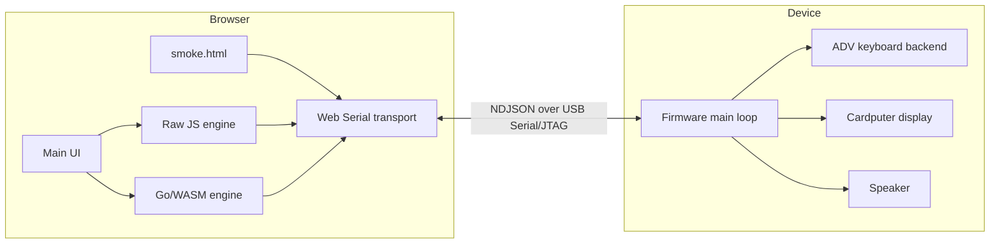
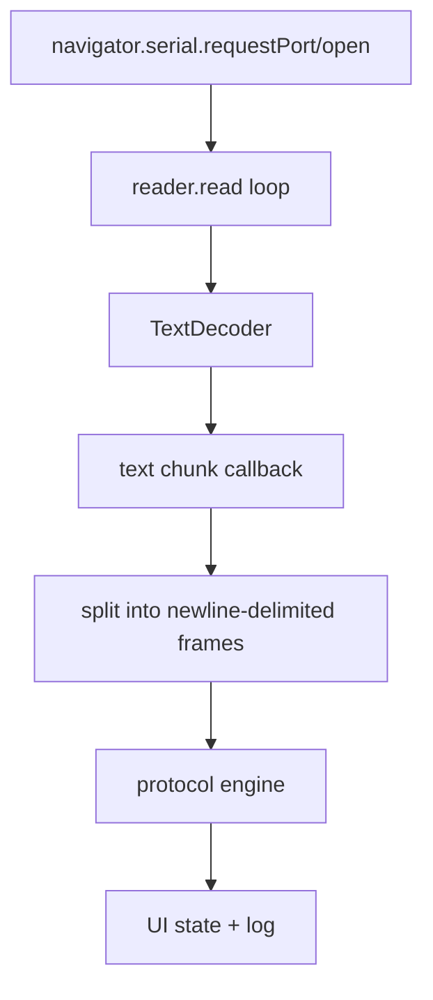

# Cardputer Web Serial Demo

This project is a small but surprisingly rich end-to-end experiment: an M5Stack Cardputer ADV runs ESP-IDF firmware that speaks newline-delimited JSON over the ESP32-S3 USB Serial/JTAG interface, while a browser page talks to it over Web Serial using either a plain JavaScript protocol engine or the same framing logic compiled from Go to WebAssembly.

It started as a milestone demo and quickly turned into a practical systems-integration exercise. The interesting part is not any single layer by itself, but the fact that embedded firmware, browser transport, UI state, a Go/WASM protocol bridge, and Cardputer ADV hardware quirks all had to line up at once before the demo became reliable.

> [!summary]
> The project currently has three important identities:
> 1. a browser-to-device demo for the Cardputer ADV using Web Serial
> 2. an A/B comparison between a Raw JS protocol engine and a Go-compiled WASM engine
> 3. a debugging case study in how to de-risk serial, firmware, and browser failures by shrinking the problem until one layer at a time becomes testable

## Why this project exists

The immediate goal is to prove a two-way browser-controlled Cardputer workflow without introducing a heavy native host application. The browser should be able to connect directly to the device, receive key events, send commands, update the screen, and exercise small device actions like beeps and status refreshes.

The secondary goal is architectural: compare two protocol implementations behind the same UI and transport.

- In **Raw JS** mode, the browser parses and builds NDJSON messages directly in JavaScript.
- In **Go + WASM** mode, the browser delegates line parsing and command construction to Go code compiled to `web/app.wasm`.

That split makes the project more than a demo. It is also a test bench for deciding where protocol logic should live when the frontend, firmware, and tooling may later diverge.

## Current project status

The repository is now in a hardware-verified working state.

What is working:

- the firmware builds successfully for `esp32s3`
- the Cardputer ADV keyboard backend works using the ADV-specific keyboard controller path
- the device can be flashed and monitored from the current environment
- the browser main page works again over Web Serial
- the minimal `smoke.html` page works as a direct transport sanity check
- both protocol engines work:
  - `Raw JS`
  - `Go + WASM`
- the firmware responds correctly to:
  - `get_info`
  - `ping`
  - `set_screen_text`
  - `set_ui_state`
  - `clear_screen`
  - `beep`

What changed relative to the repository's initial state:

- the repo originally targeted the **original Cardputer keyboard matrix**
- the build initially targeted `esp32` instead of `esp32s3`
- the browser app initially looked broken because the main page lost the device while a simpler page did not
- the README is now partially stale because it still describes the old Cardputer-only status and says ADV support was not implemented

What remains incomplete:

- the exact single browser-side root cause of the earlier main-page instability was not isolated to one line during the later bisect
- the repo still needs a README refresh to match the now-verified hardware path
- the firmware protocol is intentionally hand-rolled and would need more hardening before becoming a reusable library or product surface

## Project shape

At a high level, the project has four layers:

1. **Firmware on the Cardputer ADV**
   - initializes M5Unified
   - scans the ADV keyboard
   - draws a compact UI on the screen
   - emits and receives NDJSON over USB Serial/JTAG
2. **Browser transport**
   - uses `navigator.serial`
   - opens the ESP32-S3 USB Serial/JTAG port
   - turns byte streams into text chunks and lines
3. **Protocol engine**
   - Raw JS parser/builder, or
   - Go code compiled to WASM and loaded into the browser
4. **UI / diagnostics**
   - dashboard
   - command buttons
   - text input
   - detailed protocol log
   - smoke page for transport isolation

Important repository locations:

- `/home/manuel/code/wesen/2026-04-02--cardputer-web-demo/firmware/`
- `/home/manuel/code/wesen/2026-04-02--cardputer-web-demo/firmware/main/main.cpp`
- `/home/manuel/code/wesen/2026-04-02--cardputer-web-demo/firmware/main/cardputer_keyboard.cpp`
- `/home/manuel/code/wesen/2026-04-02--cardputer-web-demo/wasm/main.go`
- `/home/manuel/code/wesen/2026-04-02--cardputer-web-demo/web/app.js`
- `/home/manuel/code/wesen/2026-04-02--cardputer-web-demo/web/serial-transport.js`
- `/home/manuel/code/wesen/2026-04-02--cardputer-web-demo/web/smoke.html`
- `/home/manuel/code/wesen/2026-04-02--cardputer-web-demo/scripts/01-serial-roundtrip-probe.py`
- `/home/manuel/code/wesen/2026-04-02--cardputer-web-demo/ttmp/2026-04-02/01-diary.md`

## Architecture



The important design choice is that the wire protocol is boring on purpose. Every frame is a single JSON object followed by `\n`. That makes every layer easy to inspect:

- firmware can emit lines with string builders
- the browser can log exact wire text
- the Go/WASM path can stay line-oriented instead of operating on binary packets
- Python serial tooling can validate the device without depending on the app

This project gets much of its reliability from resisting the temptation to over-design the protocol.

## Implementation details

The implementation is easiest to understand as two continuously running loops that meet on a newline-delimited serial stream.

### Firmware loop

The firmware state is centralized in a small `DeviceState` struct in `firmware/main/main.cpp`. That state captures:

- connection label
- active engine label
- screen text
- accumulated typed text
- last submitted text
- last key

The main loop is conceptually:

```text
boot:
  install usb_serial_jtag driver
  init M5Unified
  init ADV keyboard backend
  draw initial screen
  emit hello

forever:
  M5.update()
  poll keyboard
  if key changed:
    update typed text state
    emit key event

  read serial bytes
  append to rx buffer
  split on '\n'
  for each line:
    parse command fields
    mutate device state
    emit ack / hello / status / pong / error

  if screen dirty:
    redraw LCD

  every 1000ms:
    emit status
```

The command parser is intentionally manual rather than schema-driven. `main.cpp` includes helpers like `extractStringField(...)` and `extractIntField(...)` that walk the JSON text directly. That is a tradeoff:

- it keeps the firmware lightweight and easy to build inside ESP-IDF without adding a JSON library
- it assumes messages stay small and structurally simple
- it is fine for this demo because the command set is narrow and known ahead of time

The outbound event surface is similarly small:

- `hello`
- `status`
- `key`
- `pong`
- `ack`
- `error`

The resulting protocol is not elegant in an abstract sense, but it is highly observable, which mattered more during bring-up.

### ADV keyboard backend

The repository originally assumed the original Cardputer keyboard matrix. That was wrong for the actual hardware used here, which was a **Cardputer ADV** with a different keyboard controller path.

The working backend now lives in:

- `/home/manuel/code/wesen/2026-04-02--cardputer-web-demo/firmware/main/cardputer_keyboard.cpp`
- `/home/manuel/code/wesen/2026-04-02--cardputer-web-demo/firmware/main/cardputer_keyboard.h`
- `/home/manuel/code/wesen/2026-04-02--cardputer-web-demo/firmware/main/Adafruit_TCA8418.cpp`
- `/home/manuel/code/wesen/2026-04-02--cardputer-web-demo/firmware/main/Adafruit_TCA8418.h`

The important lesson from the ADV port was that the keyboard problem was not just "change some GPIO pins." The first naive I2C attempt used the old I2C driver path directly and immediately hit an ESP-IDF runtime conflict with the newer driver stack that M5Unified already uses:

```text
E (242) i2c: CONFLICT! driver_ng is not allowed to be used with this old driver
```

That error was the turning point. The real constraint was not only the hardware controller, but the fact that M5Unified had already claimed the bus in a newer way. The stable fix was to move the ADV keyboard support into an M5Unified-compatible I2C device wrapper instead of opening a separate legacy driver path.

This is a good example of why embedded bring-up often fails at the integration boundary rather than inside the obvious subsystem.

### Browser transport

The browser transport in `web/serial-transport.js` is thin by design:

- request or reuse a port
- open it at `115200`
- keep a reader loop alive
- decode bytes into text
- surface chunks to the app
- serialize writes as text

The main page wraps that transport with state and protocol handling. The smoke page does not. That distinction turned out to be essential when debugging.

The minimal working transport model looks like this:



The key debugging discovery was that `web/smoke.html` worked even when the main app appeared to fail. That meant the device, USB transport, and Web Serial stack were not fundamentally broken. The failure had to be in the main app's surrounding complexity or a stale browser state.

Creating `smoke.html` was therefore not just a convenience. It was the instrument that re-established trust in the lower layers.

### Raw JS vs Go/WASM engine

The protocol-engine abstraction is deliberately small:

- receive raw text from the transport
- buffer it
- split it into lines
- parse lines into event objects
- build outgoing commands
- expose a debug snapshot

In Raw JS mode, this is plain browser code. In Go/WASM mode, the same responsibility lives in `wasm/main.go`.

The Go/WASM engine works roughly like this:

```go
type Engine struct {
    buffer string
    emit   js.Value
}

func (e *Engine) ReceiveText(text string) {
    e.buffer += text
    for each newline-delimited line in e.buffer:
        e.processLine(line)
    if buffer too large:
        trim it
}

func (e *Engine) BuildCommand(name string, payloadJSON string) string {
    cmd := map[string]any{"type": "cmd", "name": name}
    merge decoded payload keys except type/name
    return jsonMarshal(cmd) + "\n"
}
```

That engine does not attempt to do anything magical. Its value is mostly architectural:

- it proves that the wire contract can be implemented in Go and hosted in the browser
- it makes parser behavior more portable if the project later grows a shared protocol layer
- it offers a clean A/B test against the Raw JS path under the same UI and transport

The recent logs showed the `go-wasm` mode correctly handling:

- `set_ui_state`
- `get_info`
- `ping` / `pong`
- `beep`
- ongoing `status` frames

So the WASM path has graduated from "interesting milestone" to "working implementation."

### UI and diagnostics

The main page in `web/index.html` and `web/app.js` is intentionally no-build and direct. That made it easy to patch while debugging and kept the stack readable.

Two additions were especially valuable:

1. **copyable protocol logs**
   - a `Copy log` button makes it trivial to move browser evidence into the development conversation
2. **wire-level logging**
   - raw received lines, fragments, transport events, and transmit lines are visible

That instrumentation mattered because some failures initially looked like firmware crashes, while later evidence showed they were not. A good log turned "I think it crashed" into "the browser lost the device before the first write" and then later into "the smoke page actually works."

### How the system behaves as a whole

The simplest mental model for the finished demo is:


The Cardputer is not acting as an autonomous application host. It is a small interactive endpoint that exposes:

- keyboard input
- a text display
- a status surface
- a buzzer

The browser is the orchestrator. The device is the serially attached physical frontend.

## Debugging timeline and main lessons

### 1. The initial build failure was not really about `const`

The first visible issue was a `const` mismatch around the USB Serial/JTAG driver config. Fixing that helped compilation, but the deeper issue was target mismatch: the firmware was configured for `esp32` while the Cardputer hardware is an `esp32s3`.

That mismatch explained the undefined `usb_serial_jtag_*` references. The headers were visible, but the implementation was not being built for the wrong target.

### 2. The actual hardware target had to move to `esp32s3`

Once the target was switched with `idf.py set-target esp32s3`, the build matched the hardware and the driver implementation linked correctly.

This is the kind of problem that looks low-level but is really configuration hygiene.

### 3. Flashing needed a stable path and slower baud

The reliable flash path ended up being the stable by-id device:

```bash
idf.py -p '/dev/serial/by-id/usb-Espressif_USB_JTAG_serial_debug_unit_D8:85:AC:A4:FB:7C-if00' -b 115200 flash
```

Using the generic ACM path was brittle. The board worked better when addressed by its stable by-id path and flashed at `115200`.

### 4. The ADV port failed first at runtime, not compile time

After the ADV keyboard backend was first introduced, the firmware built but then boot-looped. That is a classic embedded trap: successful compilation says very little about peripheral ownership and runtime compatibility.

The `driver_ng` vs old I2C driver conflict made it clear that the keyboard integration had to respect M5Unified's bus management instead of bypassing it.

### 5. A minimal page beat speculation

The main browser UI looked broken, but a stripped-down `smoke.html` page worked. That immediately narrowed the problem from "device/USB/firmware are unreliable" to "the main page is doing something different."

This is probably the single most reusable lesson from the project:

> when a browser-hardware integration looks haunted, build the smallest page that only opens the port, dumps lines, and sends one manual frame

That one move often saves hours of guessing.

### 6. The bisect did not identify one silver bullet

After the main page started working again, earlier simplifications were reintroduced one by one:

- eager WASM runtime preload
- automatic `get_info`
- granted-port reuse
- no connect delay
- synchronous rendering

All of them stayed stable when restored. That means the original recovery was probably due to an interaction between changes, browser state, or stale cached code rather than one obviously guilty line.

That is unsatisfying in a narrow sense, but still useful. The system is now instrumented, reproducible, and verified with multiple independent tools.

## Current user-facing commands and behaviors

Useful local commands:

```bash
cd /home/manuel/code/wesen/2026-04-02--cardputer-web-demo
./build-wasm.sh

cd /home/manuel/code/wesen/2026-04-02--cardputer-web-demo/firmware
source ~/esp/esp-5.4.1/export.sh
idf.py build
idf.py -p '/dev/serial/by-id/usb-Espressif_USB_JTAG_serial_debug_unit_D8:85:AC:A4:FB:7C-if00' -b 115200 flash

cd /home/manuel/code/wesen/2026-04-02--cardputer-web-demo/web
python3 -m http.server 8081
```

Useful browser entry points:

- `http://localhost:8081`
- `http://localhost:8081/smoke.html`

Useful protocol frames:

```json
{"type":"cmd","name":"get_info"}
{"type":"cmd","name":"set_ui_state","connection":"connected","engine":"go-wasm"}
{"type":"cmd","name":"set_screen_text","text":"hello from web"}
{"type":"cmd","name":"ping","nonce":"example-123"}
{"type":"cmd","name":"beep","frequency_hz":880,"duration_ms":120}
```

## Important project docs

- `/home/manuel/code/wesen/2026-04-02--cardputer-web-demo/README.md`
- `/home/manuel/code/wesen/2026-04-02--cardputer-web-demo/ttmp/2026-04-02/01-diary.md`
- `/home/manuel/code/wesen/2026-04-02--cardputer-web-demo/scripts/01-serial-roundtrip-probe.py`
- `/home/manuel/code/wesen/2026-04-02--cardputer-web-demo/web/smoke.html`

The diary is worth reading because it captures the exact sequence of false starts and corrections:

- target mismatch
- ADV keyboard backend port
- runtime I2C conflict
- flashing quirks
- browser transport investigation
- smoke-page validation
- main-page bisect

## Open questions

- What exactly caused the main page to recover after the earlier browser-side changes?
- Should the protocol parser remain duplicated in Raw JS and Go/WASM, or should one become the canonical implementation?
- Is `usb_serial_jtag` the right long-term browser-facing transport, or should the project eventually move to a native USB CDC ACM path for broader compatibility?
- Should the firmware continue to hand-parse JSON, or is there a point where a tiny structured parser becomes worth the complexity?
- Should the ADV keyboard backend be generalized into a clearer hardware-abstraction layer if more Cardputer variants are expected?

## Near-term next steps

- refresh the README so it reflects:
  - Cardputer ADV support
  - verified hardware bring-up
  - the smoke page
  - the reliable flash command
- keep `smoke.html` as a permanent troubleshooting tool rather than a temporary artifact
- add one or two scripted browser-side smoke procedures so regressions are easier to spot
- validate special ADV keys thoroughly:
  - shift
  - caps lock
  - backspace
  - tab
  - enter
- decide whether the Go/WASM path should stay a demo option or become the preferred protocol implementation

## Project working rule

> [!important]
> When the full browser app behaves strangely, first prove the transport with the smallest page and the smallest wire protocol possible. Only then move back up into the richer app.

## KB reviews

- [[KB-BATCH4-embedded-hardware]] (2026-05-11) — concept extraction + classification

## Related KB entries

- **reduction-ladder debugging** (2/3) — smoke.html pattern
- [[Tribal/browser-side-processing-for-embedded]] — browser as protocol engine (CREATED)
