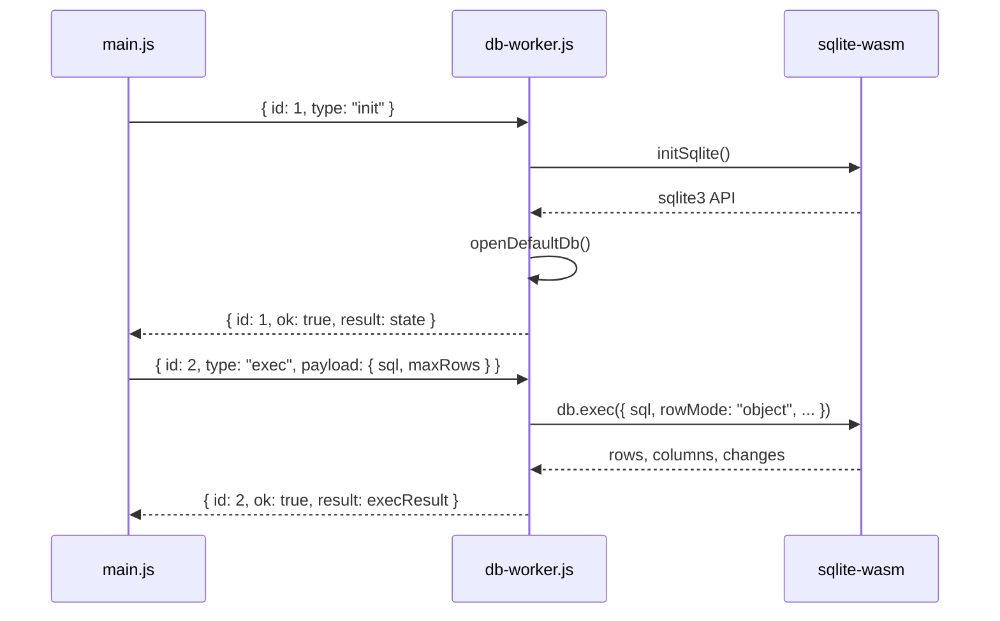

# SQLide Browser

A browser-only SQL IDE that uses Go compiled to WebAssembly for editor logic and SQL parsing, while running the actual SQLite engine inside a dedicated Web Worker via the official `@sqlite.org/sqlite-wasm` package. Databases persist through OPFS when available, falling back to in-memory when not.

> [!summary]
> The project is an experiment at the intersection of three things:
> 1. using Go/Wasm as a browser application shell with `syscall/js`
> 2. running the official SQLite Wasm build in a worker for real database operations
> 3. exploring the practical boundary between "what Go should do" and "what the browser should do" in a Wasm-based app

## Why this project exists

The motivating question was: **can you build a pure browser SQL IDE using Go compiled to Wasm, with SQLite also running in the browser?**

The naive answer is "compile `mattn/go-sqlite3` to Wasm." That does not work. The `GOOS=js GOARCH=wasm` target does not support cgo, so cgo-based SQLite drivers like `mattn/go-sqlite3` are out. The pure-Go SQLite driver (`modernc.org/sqlite`) does not officially list `js/wasm` in its support matrix, and even if it compiled, browser-side persistence via OPFS requires a worker context that Go's single-threaded browser runtime cannot directly use.

The answer that actually works is a split architecture:

- Go handles the parts it is good at in a browser context: string processing, state management, JSON serialization, DOM interaction through `syscall/js`
- SQLite's own Wasm build handles the parts that need deep browser integration: the database engine, OPFS persistence, worker-based execution

This project is the proof-of-concept of that architecture.

## Current project status

The repository is a working prototype with three git commits.

What already exists:

- a complete Vite-based dev and build setup
- a Go/Wasm module that exports SQL statement splitting, cursor-aware statement picking, and starter SQL generation
- a JavaScript bridge that dynamically loads Go Wasm and polls for readiness
- a dedicated SQLite worker using the official `@sqlite.org/sqlite-wasm` OO1 API
- import and export of `.sqlite3` database files (via OPFS or `sqlite3_deserialize`)
- OPFS-backed persistence with automatic fallback to in-memory
- a dark-themed IDE layout with editor, schema explorer, result grid, and log panel
- keyboard shortcuts for running statements (`Ctrl/Cmd+Enter`) and full scripts (`Shift+Ctrl/Cmd+Enter`)

What is missing or rough:

- no syntax highlighting (uses a plain `<textarea>`)
- no query history persistence beyond the current session
- no tabs or multi-database support
- the Go Wasm binary is ~3.3 MB for a relatively small Go program
- no tests for any layer

## Project shape

The project has a clear three-layer structure:

1. **Go/Wasm layer** — SQL parsing, statement classification, text helpers
2. **JavaScript application layer** — UI, event wiring, RPC to the worker, file import/export
3. **SQLite worker layer** — database operations, schema introspection, OPFS management

The interesting design choice is that Go does not talk to SQLite at all. Go handles the editor intelligence; JavaScript handles the plumbing; the worker handles the database. Each layer communicates through well-defined boundaries.

## Architecture

```mermaid
flowchart TD
    subgraph Browser Main Thread
        UI[HTML/CSS UI]
        JS[main.js — event wiring, RPC, rendering]
        GO[Go/Wasm — splitScript, pickStatement]
        BRIDGE[go-bridge.js — loads wasm_exec.js + main.wasm]
    end

    subgraph Web Worker
        WORKER[db-worker.js]
        SQLITE[sqlite-wasm OO1 API]
        OPFS[(OPFS — /sqlide/sqlide.sqlite3)]
        MEM[(In-memory fallback)]
    end

    UI --> JS
    JS --> BRIDGE --> GO
    JS -- postMessage RPC --> WORKER
    WORKER --> SQLITE
    SQLITE --> OPFS
    SQLITE --> MEM

    style GO fill:#2d4a22,stroke:#4a7c3f
    style SQLITE fill:#1a3a5c,stroke:#3a7cbd
    style OPFS fill:#3a2a1a,stroke:#7c5a3a
```



Key code locations:

- `cmd/sqlide/main.go` — Go/Wasm entry point, SQL splitting and classification
- `src/main.js` — main application, UI rendering, event handlers, worker RPC client
- `src/db-worker.js` — SQLite worker, handles init, exec, schema, import/export
- `src/go-bridge.js` — Go Wasm loader and JS shim
- `src/style.css` — dark-themed IDE layout
- `scripts/build-go.mjs` — build script for Go Wasm + wasm_exec.js
- `vite.config.mjs` — Vite config with COOP/COEP headers for OPFS
- `index.html` — application shell

## Implementation details

### The Go/Wasm module

The Go module at `cmd/sqlide/main.go` is deliberately minimal. It exports exactly three functions to JavaScript via `syscall/js`:

```go
api := js.Global().Get("Object").New()
api.Set("splitScript", js.FuncOf(splitScriptJS))
api.Set("pickStatement", js.FuncOf(pickStatementJS))
api.Set("starterSQL", js.FuncOf(starterSQLJS))
js.Global().Set("sqlideGo", api)
select {} // keep Go alive
```

The `splitScript` function is the most substantial piece. It implements a proper SQL statement splitter that handles:

- line comments (`--`)
- block comments (`/* */`)
- single-quoted strings with escaped quotes (`''`)
- double-quoted identifiers
- backtick identifiers
- bracket identifiers (`[name]`)
- semicolon-delimited statement boundaries
- line and column tracking for each statement

This is genuinely useful work that would be awkward to write in JavaScript but is natural in Go. The splitter returns JSON arrays of statement objects with `text`, `start`, `end`, `kind`, `line`, and `column` fields.

The `pickStatement` function uses the same splitter to find the statement under the cursor, enabling "run current statement" behavior. If there is a selection, it splits within the selection. If not, it finds the statement containing the cursor position.

The `classify` function categorizes statements by their leading keyword (`select`, `insert`, `create`, etc.), including CTE awareness — a `WITH ... SELECT` is classified as `select`.

### The Go bridge loader

The `go-bridge.js` module handles the slightly tricky business of loading a Go Wasm module in a Vite-managed application:

1. Dynamically inject `wasm_exec.js` as a classic (non-module) script tag
2. Wait for `window.Go` to become available
3. Instantiate the Wasm binary with `WebAssembly.instantiateStreaming`
4. Call `go.run(instance)` which starts the Go `main()` goroutine
5. Poll `globalThis.sqlideGo` for up to 3 seconds until the Go module registers itself

The polling step is necessary because `go.run()` returns a promise that resolves when Go exits, but the Go program never exits — it blocks on `select {}`. The actual exports appear asynchronously when the Go `main()` function runs its setup code.

### The SQLite worker

The worker at `src/db-worker.js` is the heaviest single file (~340 lines). It wraps the official `@sqlite.org/sqlite-wasm` package with a message-based RPC protocol:



The worker supports these operations:

| Action     | Description                                          |
|------------|------------------------------------------------------|
| `init`     | Initialize SQLite, open default DB (OPFS or memory)  |
| `exec`     | Execute SQL with row limit and streaming callback     |
| `schema`   | Read tables, views, indexes, triggers from `sqlite_schema` |
| `reset`    | Close and reopen DB (with OPFS delete if persistent)  |
| `export`   | Serialize DB to `ArrayBuffer` via `sqlite3_js_db_export` |
| `import`   | Deserialize `ArrayBuffer` into DB via OPFS `importDb` or `sqlite3_deserialize` |

The exec implementation uses a streaming callback pattern instead of collecting all rows, which enables the configurable `maxRows` truncation:

```javascript
db.exec({
  sql: statement,
  rowMode: 'object',
  columnNames,
  callback(row) {
    if (rows.length >= maxRows) {
      truncated = true;
      return false;  // stop iteration
    }
    rows.push(normalizeRow(row));
    return true;
  },
});
```

### OPFS persistence and fallback

The worker attempts OPFS persistence first by checking for `sqlite3.oo1.OpfsDb`. OPFS requires:

1. A worker context (not the main thread)
2. Cross-origin isolation headers (`Cross-Origin-Embedder-Policy: require-corp` and `Cross-Origin-Opener-Policy: same-origin`)

The Vite config sets these headers for both dev and preview modes. If OPFS is unavailable (wrong context, missing headers, unsupported browser), the worker silently falls back to an in-memory `sqlite3.oo1.DB()`.

Database import handles both paths:

- **OPFS available**: uses `OpfsDb.importDb(path, arrayBuffer)` to write bytes into the virtual filesystem, then opens the database normally
- **Memory fallback**: allocates Wasm memory with `sqlite3.wasm.allocFromTypedArray(bytes)`, creates a new in-memory DB, then calls `sqlite3_deserialize` with `SQLITE_DESERIALIZE_FREEONCLOSE | SQLITE_DESERIALIZE_RESIZEABLE`

Export always uses `sqlite3_js_db_export`, which serializes the entire database to a byte array regardless of storage mode. The resulting `ArrayBuffer` is transferred (not copied) back to the main thread using the `postMessage` transferables list.

### The RPC protocol

Communication between the main thread and worker uses a simple promise-based RPC:

```javascript
call(type, payload = {}, transferables = []) {
  return new Promise((resolve, reject) => {
    const id = this.nextId++;
    this.pending.set(id, { resolve, reject });
    this.worker.postMessage({ id, type, payload }, transferables);
  });
}
```

Each message carries an incrementing `id`. The worker responds with `{ id, ok, result }` or `{ id, ok: false, error }`. Errors are serialized as `{ name, message, stack }` objects to survive the structured clone boundary.

### The UI

The UI is entirely vanilla JavaScript with no framework. The `main.js` file (~340 lines) handles:

- DOM element caching
- event wiring (buttons, keyboard shortcuts, file inputs)
- schema rendering with `<details>` elements for each table/view
- result card rendering with tabular data
- a structured log panel with timestamps and levels
- busy/idle state management that disables all buttons during operations

The schema explorer renders tables with their column metadata, and each table has a "SELECT *" button that inserts a starter query into the editor. Views, indexes, and triggers are also shown.

### The build pipeline

```mermaid
flowchart LR
    A[cmd/sqlide/main.go] -->|GOOS=js GOARCH=wasm| B[public/go/main.wasm]
    C["$(go env GOROOT)/misc/wasm/wasm_exec.js"] -->|copy| D[public/go/wasm_exec.js]
    E[src/*.js + src/*.css] -->|Vite| F[dist/]
    B --> F
    D --> F

    style B fill:#2d4a22,stroke:#4a7c3f
    style F fill:#1a3a5c,stroke:#3a7cbd
```



The `scripts/build-go.mjs` Node script:

1. Runs `go env GOROOT` to find the Go installation
2. Locates `wasm_exec.js` under `misc/wasm/` or `lib/wasm/`
3. Compiles `cmd/sqlide/main.go` with `GOOS=js GOARCH=wasm`
4. Copies both artifacts to `public/go/`

Vite then serves `public/go/` as static assets and bundles the `src/` modules. The `@sqlite.org/sqlite-wasm` package is excluded from Vite's dependency optimization because it contains its own Wasm binary and worker scripts that must be loaded at runtime.

### The COOP/COEP header story

SQLite's OPFS VFS requires `SharedArrayBuffer`, which browsers gate behind cross-origin isolation. The required headers are:

```
Cross-Origin-Embedder-Policy: require-corp
Cross-Origin-Opener-Policy: same-origin
```

The Vite config applies these for both `server` and `preview` modes. This is a deployment consideration: any production server must also set these headers, or OPFS persistence silently degrades to in-memory.

## Open questions

- Is the Go/Wasm module pulling its weight? The SQL splitter could be rewritten in JavaScript for a much smaller download (~3.3 MB Wasm binary vs ~5 KB of equivalent JS). The value is in demonstrating the architecture, not in the current feature set.
- Could `modernc.org/sqlite` actually work under `GOOS=js GOARCH=wasm`? The support matrix does not list it, but the package documentation on pkg.go.dev renders for `js/wasm`. A spike with `file::memory:?cache=shared` would settle this.
- Should the project add CodeMirror or Monaco for syntax highlighting, or stay minimal?
- Is there a path to a fully self-contained Go/Wasm app where Go also runs SQLite, bypassing the worker? That would require solving OPFS access from Go's single-threaded browser runtime.
- How should multi-database support work — multiple workers, or a single worker with multiple open connections?

## Near-term next steps

- try compiling `modernc.org/sqlite` to `js/wasm` as an all-Go spike
- add query history persistence to `localStorage`
- add syntax highlighting with a lightweight library
- add tab support for multiple query buffers
- explore reducing the Go Wasm binary size with `tinygo` or build flags
- add basic integration tests for the worker protocol

## Project working rule

> [!important]
> Keep the split architecture. Go does text processing and state; SQLite Wasm does database operations in a worker. Do not try to merge the two runtimes until the all-Go persistence story is actually proven.

## KB reviews

- [[KB-BATCH13-cozo-editor-structured-browser-tools]] (2026-05-11) — Batch D analysis; used as the browser-side structured tool that reinforced the split Go/Wasm + worker-owned engine pattern.

## Related KB entries

- [[On-Ramp/wasm-from-go]] — new split-architecture example where Go/Wasm handles editor intelligence and a worker-owned SQLite Wasm build owns DB execution.

**Tribal candidates** (not yet written / needs review):
- Go/Wasm editor intelligence over worker-owned SQLite engine (2/3 when considered with broader Wasm/browser evidence).
- Keep split architecture: text/state in Go, DB engine in worker (1/3).

**On-Ramp candidates** (not yet written):
- SQLite worker + OPFS mental model (1/5 🌐).

