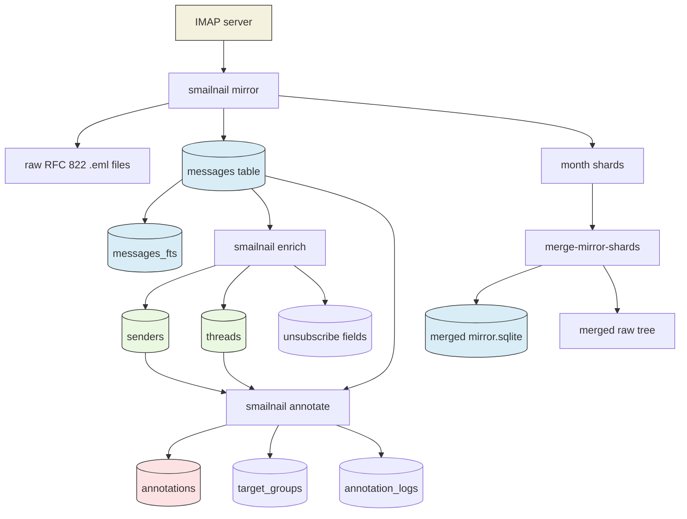
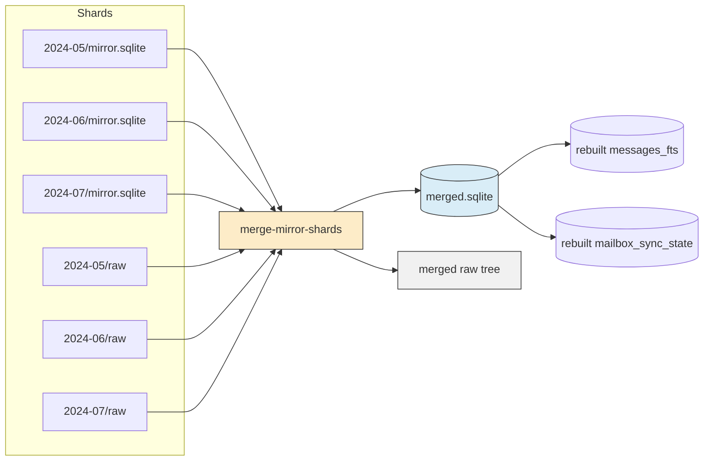
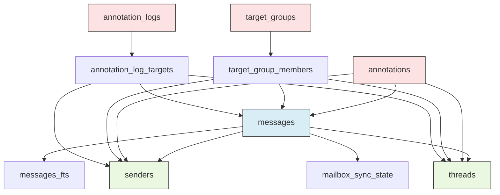

# Smailnail SQLite Mirror, Merge, Enrich, and Annotation Report

This phase of `smailnail` turned the project from a live-IMAP inspection tool into something much more substantial: a local mail knowledge base. The system now knows how to mirror mail incrementally into SQLite, keep raw RFC 822 messages on disk, enrich that corpus into sender and thread structure, merge parallel backfill shards into one durable mirror, and layer a local annotation system on top so future triage work can happen against a stable database instead of against the live server.

The interesting part is not just that the commands exist. The interesting part is that the repository now has a coherent architecture for email analysis that feels much more like a local data platform than a traditional mail client. The IMAP server becomes the upstream source of truth, SQLite becomes the working memory, enrichment turns raw mail into structured entities, and annotation creates a place for human and LLM judgment to live safely beside the corpus.

> [!summary]
> 1. `smailnail mirror` now creates a durable local SQLite-backed mail mirror with FTS5 search, raw `.eml` persistence, incremental checkpoints, date-bounded backfills, and optional post-sync enrichment.
> 2. `smailnail merge-mirror-shards` now consolidates month-sharded backfills into one reusable mirror by copying canonical rows and raw files, then rebuilding checkpoint and FTS state.
> 3. A parallel annotation track, documented in `pkg/doc/annotate-sqlite-playbook.md` and ticket `SMN-20260402-ANNOTATION-DESIGN`, is turning that mirror into a reviewable triage system for humans and LLMs.

## Why this work matters

Before this work, `smailnail` already had real IMAP plumbing, a JS runtime, a hosted backend, and rule-oriented fetch flows. But it still lacked one core capability: a durable local mailbox representation that could be searched, inspected, enriched, copied, backfilled in slices, and annotated independently of a currently open IMAP connection.

That gap mattered for several reasons.

First, live IMAP is a poor place to do exploratory analysis. It is slow, stateful, and not designed for repeated SQL-heavy inspection. Second, any serious bulk-triage or LLM-aided mail analysis needs a reviewable local corpus. Third, once you start caring about large backfills, you need bounded sync windows, resumable checkpointing, and some story for parallelization and later consolidation. Fourth, if the long-term goal includes safe bulk actions, unsubscribe workflows, and sender-level judgments, you need a local place where “what the mail is” and “what we think about the mail” can coexist.

This project phase solved the first half of that problem directly and sketched the second half in a way that looks implementable rather than speculative.

## What exists now

At a high level, the SQLite-oriented Smailnail stack now has four layers.

1. **Mirror**
   - Connect to IMAP.
   - Incrementally download messages.
   - Store raw `.eml` files under a deterministic mirror root.
   - Store normalized metadata, headers, bodies, and search text in SQLite.

2. **Enrich**
   - Compute sender-level and thread-level structure over the mirrored messages.
   - Extract unsubscribe metadata and related sender traits.

3. **Merge**
   - Take many bounded shard mirrors, usually month slices.
   - Merge them into one canonical destination SQLite DB and one raw-message tree.

4. **Annotate**
   - Attach human and agent judgments to messages, senders, domains, threads, and other targets.
   - Group targets and attach logs so review workflows become durable and inspectable.

The current system shape looks like this:



## The simplest mental model

The cleanest way to understand this system is to treat it as a pipeline with three kinds of state.

### 1. Canonical copied state

This is the data you copy directly because it is the local source of truth for the mirrored corpus.

- `messages`
- raw `.eml` files under `raw/...`

### 2. Derived analytic state

This is the data you can rebuild from the canonical corpus.

- `messages_fts`
- `mailbox_sync_state`
- sender and thread enrichment tables

### 3. Judgment state

This is the data that does not describe the mail itself, but rather how humans or agents interpret it.

- `annotations`
- `target_groups`
- `annotation_logs`
- `annotation_log_targets`

That split is one of the strongest design choices in this phase because it keeps the architecture legible. The mirror tells you what exists. Enrichment tells you what structure can be derived. Annotation tells you what someone thinks should matter.

## The mirror layer

The mirror implementation lives primarily in:

- `/home/manuel/workspaces/2026-04-01/smailnail-sqlite/smailnail/cmd/smailnail/commands/mirror.go`
- `/home/manuel/workspaces/2026-04-01/smailnail-sqlite/smailnail/pkg/mirror/service.go`
- `/home/manuel/workspaces/2026-04-01/smailnail-sqlite/smailnail/pkg/mirror/schema.go`
- `/home/manuel/workspaces/2026-04-01/smailnail-sqlite/smailnail/pkg/mirror/files.go`
- `/home/manuel/workspaces/2026-04-01/smailnail-sqlite/smailnail/pkg/mirror/parser.go`
- `/home/manuel/workspaces/2026-04-01/smailnail-sqlite/smailnail/pkg/mailruntime/imap_client.go`

The important thing here is that `smailnail mirror` is not a thin wrapper around the old fetch command. It is a new local-storage subsystem that reuses the UID-oriented IMAP runtime and builds its own durable state model around it.

The command surface already has the right operational controls:

- `--sqlite-path`
- `--mirror-root`
- `--batch-size`
- `--max-messages`
- `--since-days`
- `--since-date`
- `--before-date`
- `--all-mailboxes`
- `--mailbox-pattern`
- `--exclude-mailbox-pattern`
- `--stop-on-error`
- `--reconcile-full-mailbox`
- `--reset-mailbox-state`
- `--enrich-after`

That matters because the mirror is not only a “download everything” verb. It is also a bounded sampling tool, a safe first-sync tool, a large-backfill primitive, and a resumable incremental sync primitive.

### What the mirror stores

The mirror schema centers on a `messages` table with IMAP identity plus parsed content:

- account and mailbox identity
- `uidvalidity` and `uid`
- message-level identifiers such as `message_id`
- normalized headers JSON
- sender summaries
- text and HTML bodies
- `search_text`
- `raw_path`
- `raw_sha256`
- `remote_deleted`

It also maintains:

- `mailbox_sync_state` for incremental resume
- `messages_fts` for FTS5-backed local search

Because FTS5 is now required for builds that include the mirror package, the system does not pretend search is optional anymore. That was the right simplification. The feature exists to create a searchable local mail corpus, so a non-FTS build would mostly be a lie.

### How one mailbox sync actually works

The operational heart is `pkg/mirror/service.go`. The service:

1. validates and normalizes sync options,
2. opens an IMAP session through `pkg/mailruntime`,
3. resolves which mailboxes to mirror,
4. reads previous local sync state for each mailbox,
5. searches by UID with optional date bounds,
6. fetches batches of messages,
7. writes raw `.eml` files,
8. parses those raw files into normalized projections,
9. upserts `messages`,
10. optionally reconciles remote deletions,
11. updates checkpoint state,
12. optionally runs enrichment.

In pseudocode, the shape is roughly:

```go
func SyncMailbox(opts) {
    status := imap.Status(mailbox)
    state := loadMailboxSyncState(accountKey, mailbox)

    if opts.ResetMailboxState {
        state = empty
    }

    bounds := buildDateBounds(opts.SinceDays, opts.SinceDate, opts.BeforeDate)
    uids := imap.Search(mailbox, bounds, state.HighestUID)

    for batch in chunk(uids, opts.BatchSize) {
        fetched := imap.Fetch(batch, rawRFC822 + headers + flags + metadata)

        for msg in fetched {
            rawPath, sha := writeRawMessage(msg.Raw)
            parsed := parseRawMessage(msg.Raw)
            record := buildMessageRecord(msg, parsed, rawPath, sha)
            upsertMessage(record)
        }
    }

    if opts.ReconcileFull {
        allRemoteUIDs := imap.Search(mailbox, noDateBounds)
        tombstoneMissingLocalRows(allRemoteUIDs)
        restorePresentRows(allRemoteUIDs)
    }

    updateMailboxSyncState()
}
```

The most important subtlety is that the raw RFC 822 message is the canonical parse source. Earlier IMAP metadata is still useful for fetch planning, but the local projection now prefers the actual stored `.eml` payload for normalized headers and body extraction. That is the right architecture because it gives the mirror one canonical representation to parse and reparse later.

### Why the raw `.eml` files matter

The raw message tree is not just a debugging artifact. It is the archive layer that prevents the SQLite DB from becoming the only representation of the mirrored mail.

That gives several advantages:

- reparsing is possible later without refetching from IMAP,
- merge can copy canonical raw files rather than invent new payloads,
- bugs in the current parser do not destroy the original source,
- future attachment and MIME work has a stable substrate.

The raw path contract is deterministic:

```text
raw/<accountKey>/<mailboxSlug>/<uidvalidity>/<uid>.eml
```

That relative-path rule is what makes merging possible later.

## The enrichment layer

The enrichment layer lives in:

- `/home/manuel/workspaces/2026-04-01/smailnail-sqlite/smailnail/pkg/enrich/schema.go`
- `/home/manuel/workspaces/2026-04-01/smailnail-sqlite/smailnail/pkg/enrich/all.go`
- `/home/manuel/workspaces/2026-04-01/smailnail-sqlite/smailnail/pkg/enrich/senders.go`
- `/home/manuel/workspaces/2026-04-01/smailnail-sqlite/smailnail/pkg/enrich/threads.go`
- `/home/manuel/workspaces/2026-04-01/smailnail-sqlite/smailnail/pkg/enrich/unsubscribe.go`
- `/home/manuel/workspaces/2026-04-01/smailnail-sqlite/smailnail/cmd/smailnail/commands/enrich/root.go`
- `/home/manuel/workspaces/2026-04-01/smailnail-sqlite/smailnail/cmd/smailnail/commands/enrich/all.go`

This part is easy to underestimate. A mirror alone gives you searchable mail, but it does not yet give you the higher-level nouns that most interesting triage workflows want. Those nouns are things like:

- sender
- sender domain
- thread
- unsubscribe capability
- whether a sender looks like a private relay

The enrichment schema adds exactly that.

### What enrichment adds

Schema migration v2 introduces:

- `messages.thread_id`
- `messages.thread_depth`
- `messages.sender_email`
- `messages.sender_domain`
- `threads`
- `senders`

Then `pkg/enrich/all.go` runs the three passes in order:

1. senders
2. threads
3. unsubscribe

This ordering is sensible. You first normalize senders, then build thread structure, then compute unsubscribe-related sender-level signals from the already-enriched corpus.

### Why enrichment is a post-step

One subtle but important design decision is that enrichment is not fused into the core mirror write path. It can run after `smailnail mirror` or after `merge-mirror-shards` through `--enrich-after`.

That separation is healthy because:

- core sync stays about getting canonical mail locally,
- enrichment remains rebuildable,
- merge does not need to preserve shard-local derived rows directly,
- performance and failure boundaries stay clearer.

In other words, mirror gets the corpus. Enrich adds interpretation.

## The merge layer

The merge implementation lives in:

- `/home/manuel/workspaces/2026-04-01/smailnail-sqlite/smailnail/cmd/smailnail/commands/merge_mirror_shards.go`
- `/home/manuel/workspaces/2026-04-01/smailnail-sqlite/smailnail/pkg/mirror/merge.go`
- `/home/manuel/workspaces/2026-04-01/smailnail-sqlite/smailnail/pkg/mirror/merge_test.go`

This command exists because large backfills are much easier to perform as bounded shards than as one monolithic sync. Once date bounds were added to `smailnail mirror`, it became practical to run month slices in parallel. But that immediately created a second problem: how to turn many shard directories back into one usable long-lived mirror.

The answer was to make merge a first-class Go verb instead of leaving it as ad hoc SQL and `rsync`.

### Why merge belongs in Go

The merge operation is not only file copying. It has to understand the mirror’s data model.

It must:

- discover shard directories under a root,
- inspect and validate them,
- copy canonical `messages` rows,
- copy raw files while preserving the relative path contract,
- warn on missing raw files by default,
- hard-fail on true raw-byte conflicts,
- rebuild `mailbox_sync_state`,
- rebuild `messages_fts`,
- optionally run `--enrich-after`.

That is a domain operation, not just operator glue.

### The key design decision

The smartest part of the merge design is the explicit distinction between copied state and rebuilt state:

```text
Copy:
  messages
  raw/*.eml

Rebuild:
  mailbox_sync_state
  messages_fts
  enrichment outputs
```

That keeps the merge deterministic and easy to reason about. If something is derived, do not try to preserve shard-local versions of it as if they were sacred.

### Merge pseudocode

The core algorithm looks like this:

```go
func MergeShards(inputRoot, outputDB, outputRoot) {
    shards := discoverShardDirs(inputRoot)
    inspectEachShard(shards)
    validateSchemasAndContracts(shards)

    dst := bootstrapFreshMirror(outputDB, outputRoot)

    for _, shard := range shards {
        for _, row := range shard.messages {
            upsertMessageIntoDestination(row)
            copyRawIfNeeded(shard.rawRoot, row.raw_path, outputRoot)
        }
    }

    rebuildMailboxSyncState(dst)
    rebuildMessagesFTS(dst)

    if enrichAfter {
        enrich.RunAll(dst)
    }
}
```

And the physical input/output shape looks like this:



### Real numbers from the current work

This was not only designed; it was exercised against a real mailbox.

Some useful measurements from the current phase:

- a 30-day single mirror run fetched `2894` messages
- a two-worker parallel 30-day benchmark finished in about `18-19` minutes per worker for `2929` messages each
- a six-worker month-sharded run over the last six months mirrored `14568` messages in about `19m 40s` wall-clock
- the full 24-month merge merged `23` shards and `32912` messages in about `110` seconds

The final 24-month merged output ended up at roughly:

- `5.3G` for the merged SQLite DB
- `2.1G` for the merged raw-message tree

That size profile is a good reminder that the merged mirror is not “just the shard size again.” It is a consolidated destination with rebuilt FTS and a full raw archive.

## The annotation layer

This is where the project starts becoming genuinely interesting.

A colleague has been pushing the annotation design and starter playbook in:

- `/home/manuel/workspaces/2026-04-01/smailnail-sqlite/smailnail/pkg/doc/annotate-sqlite-playbook.md`
- `/home/manuel/workspaces/2026-04-01/smailnail-sqlite/smailnail/ttmp/2026/04/02/SMN-20260402-ANNOTATION-DESIGN--human-and-llm-annotation-system-for-email-triage-safety-and-bulk-actions/`
- `/home/manuel/workspaces/2026-04-01/smailnail-sqlite/smailnail/pkg/annotate/schema.go`
- `/home/manuel/workspaces/2026-04-01/smailnail-sqlite/smailnail/pkg/annotate/repository.go`
- `/home/manuel/workspaces/2026-04-01/smailnail-sqlite/smailnail/cmd/smailnail/commands/annotate/`

This layer matters because once you have a mirrored and enriched corpus, the next obvious question is: where do judgments live?

Examples:

- “This sender is important but noisy.”
- “This thread needs follow-up.”
- “These forty senders look like newsletters and should be reviewed as a group.”
- “An agent suggested muting these, but a human has not approved that yet.”

The annotation answer is intentionally modest for the MVP.

### The MVP model

The current annotation schema introduces:

- `annotations`
- `target_groups`
- `target_group_members`
- `annotation_logs`
- `annotation_log_targets`

And it uses one generic target model:

- `target_type`
- `target_id`

That is a strong design because it avoids building a separate subsystem for each entity family. Instead, the same annotation mechanism can attach to:

- messages
- threads
- senders
- domains
- mailboxes
- accounts

### Why this is the right next layer

The mirror gives you local mail.
The enrichment layer gives you usable entities.
The annotation layer gives you durable judgment.

Without that third layer, any LLM-based triage system would either be stateless or unsafe. With it, you can do review queues, grouped investigations, log linked reasoning, and later proposal-driven bulk actions without pretending the model’s first answer should execute directly against IMAP.

The design ticket for this layer gets that safety posture right:

- human judgment should dominate model judgment,
- destructive operations should not happen straight from raw LLM output,
- decisions should become reviewable and auditable.

That is a much better long-term direction than “let the model sort your inbox and hope.”

## The emerging data model

One of the nicest things about this work is that the schema now tells a coherent story.



The rough interpretation is:

- `messages` is the canonical mail corpus
- `senders` and `threads` are derived structural tables
- `messages_fts` and `mailbox_sync_state` are operationally derived tables
- the annotation tables form the first policy and review layer on top

That is the kind of schema story that an intern can actually hold in their head.

## Current commands that define the workflow

The most important operational commands now look like this.

### Safe first mirror

```bash
go run -tags sqlite_fts5 ./cmd/smailnail --log-level info mirror \
  --server mail.example.com \
  --username user \
  --password "$MAIL_PASSWORD" \
  --mailbox INBOX \
  --since-days 30 \
  --sqlite-path /tmp/mail.sqlite \
  --mirror-root /tmp/mail-raw \
  --output json
```

### Mirror and enrich in one shot

```bash
go run -tags sqlite_fts5 ./cmd/smailnail --log-level info mirror \
  --server mail.example.com \
  --username user \
  --password "$MAIL_PASSWORD" \
  --mailbox INBOX \
  --since-days 30 \
  --sqlite-path /tmp/mail.sqlite \
  --mirror-root /tmp/mail-raw \
  --enrich-after \
  --output json
```

### Sharded backfill using explicit date windows

```bash
go run -tags sqlite_fts5 ./cmd/smailnail --log-level info mirror \
  --server mail.example.com \
  --username user \
  --password "$MAIL_PASSWORD" \
  --mailbox INBOX \
  --since-date 2025-11-01 \
  --before-date 2025-12-01 \
  --sqlite-path /tmp/backfill/2025-11/mirror.sqlite \
  --mirror-root /tmp/backfill/2025-11/raw \
  --output json
```

### Merge shards into one destination

```bash
go run -tags sqlite_fts5 ./cmd/smailnail --log-level info merge-mirror-shards \
  --input-root /tmp/smailnail-last-24-months-backfill \
  --output-sqlite /tmp/smailnail-last-24-months-merged.sqlite \
  --output-mirror-root /tmp/smailnail-last-24-months-merged-root \
  --output json
```

### Merge and enrich immediately after

```bash
go run -tags sqlite_fts5 ./cmd/smailnail --log-level info merge-mirror-shards \
  --input-root /tmp/smailnail-last-24-months-backfill \
  --output-sqlite /tmp/smailnail-last-24-months-merged.sqlite \
  --output-mirror-root /tmp/smailnail-last-24-months-merged-root \
  --enrich-after \
  --output json
```

### Add a sender annotation

```bash
go run -tags sqlite_fts5 ./cmd/smailnail annotate annotation add \
  --sqlite-path /tmp/smailnail-last-24-months-merged.sqlite \
  --target-type sender \
  --target-id notifications@github.com \
  --tag important \
  --note "Important but noisy" \
  --source-kind human \
  --created-by manuel
```

## Querying the SQLite DB directly

The project is especially satisfying because the output is not trapped inside the CLI. Once the mirror exists, the data is just SQLite.

Count messages and sender rows:

```bash
sqlite3 /tmp/smailnail-last-24-months-merged.sqlite '
  select count(*) from messages;
  select count(*) from senders;
  select count(*) from threads;
'
```

Run an FTS search:

```bash
sqlite3 /tmp/smailnail-last-24-months-merged.sqlite '
  SELECT m.subject, m.from_summary, m.sent_date
  FROM messages_fts f
  JOIN messages m ON m.id = f.rowid
  WHERE messages_fts MATCH '\''invoice OR receipt'\''
  ORDER BY m.sent_date DESC
  LIMIT 20;
'
```

List unresolved agent-created annotations:

```bash
sqlite3 /tmp/smailnail-last-24-months-merged.sqlite '
  SELECT target_type, target_id, tag, review_state, created_at
  FROM annotations
  WHERE source_kind = '\''agent'\''
    AND review_state = '\''to_review'\''
  ORDER BY created_at DESC;
'
```

This is one of the strongest practical wins in the whole project. The mailbox is no longer only “in the app.” It is queryable local data.

## Why the annotation playbook matters so much

`pkg/doc/annotate-sqlite-playbook.md` is more important than it might look at first glance. It is not only a help page. It is the first operational description of how the mirror DB becomes a review DB.

That playbook does several good things:

- it makes the SQLite file, not the live server, the center of the workflow,
- it standardizes the generic target model,
- it makes review state explicit,
- it shows how groups and logs support analysis that is not yet a final judgment,
- it keeps the CLI approachable instead of trying to jump straight into a large web application.

The design ticket expands that into a broader safety-first triage architecture, but the playbook is the “actually usable tomorrow” layer, which is often the more valuable one.

## What feels especially well-designed here

Several choices in this phase feel particularly solid.

### 1. The raw message stays canonical

The system stores the original `.eml`, then derives structure from that source. That makes reparsing, debugging, and future MIME work much saner.

### 2. Merge rebuilds derived state instead of pretending shard-local derived state is sacred

This is exactly the kind of design decision that avoids months of accidental complexity later.

### 3. The annotation system starts generic and humble

Instead of inventing a giant taxonomy up front, it introduces a stable target model, a few tables, and a practical review-state field. That is how systems that survive usually begin.

### 4. The project is now operationally honest

There are flags for bounded sync, error behavior, date windows, reconciliation, enrichment, and merge strictness. The commands look like tools for real use, not only demos.

## Tricky details and failure modes

This work also has a few subtle edges that are worth documenting explicitly.

### UIDVALIDITY is real

The mirror’s local identity model depends on `(account_key, mailbox_name, uidvalidity, uid)`. That is correct for IMAP, but it means a mailbox reset on the server side is a real event, not a cosmetic change.

### Date bounds are for backfill slicing, not for future incremental semantics

If you broaden history after already saving a high `highest_uid` checkpoint, you need either a fresh DB or `--reset-mailbox-state`. Otherwise the command will quite reasonably assume the old checkpoint is still authoritative.

### Merged output size can be surprising

The merged mirror can easily be larger than operators expect because it includes both rebuilt SQLite/FTS state and a full copied raw archive.

### Annotation is not the same as action

This sounds obvious, but it is worth protecting architecturally. An annotation row saying “newsletter” is not yet permission to bulk-delete. The design ticket gets this right by separating observations from future reviewable actions.

## Important source files and documents

Code:

- `/home/manuel/workspaces/2026-04-01/smailnail-sqlite/smailnail/cmd/smailnail/commands/mirror.go`
- `/home/manuel/workspaces/2026-04-01/smailnail-sqlite/smailnail/cmd/smailnail/commands/merge_mirror_shards.go`
- `/home/manuel/workspaces/2026-04-01/smailnail-sqlite/smailnail/cmd/smailnail/commands/enrich/root.go`
- `/home/manuel/workspaces/2026-04-01/smailnail-sqlite/smailnail/cmd/smailnail/commands/annotate/root.go`
- `/home/manuel/workspaces/2026-04-01/smailnail-sqlite/smailnail/pkg/mirror/service.go`
- `/home/manuel/workspaces/2026-04-01/smailnail-sqlite/smailnail/pkg/mirror/merge.go`
- `/home/manuel/workspaces/2026-04-01/smailnail-sqlite/smailnail/pkg/mirror/schema.go`
- `/home/manuel/workspaces/2026-04-01/smailnail-sqlite/smailnail/pkg/enrich/all.go`
- `/home/manuel/workspaces/2026-04-01/smailnail-sqlite/smailnail/pkg/enrich/schema.go`
- `/home/manuel/workspaces/2026-04-01/smailnail-sqlite/smailnail/pkg/annotate/schema.go`
- `/home/manuel/workspaces/2026-04-01/smailnail-sqlite/smailnail/pkg/annotate/repository.go`

Docs:

- `/home/manuel/workspaces/2026-04-01/smailnail-sqlite/smailnail/pkg/doc/smailnail-sqlite-mirror-and-merge.md`
- `/home/manuel/workspaces/2026-04-01/smailnail-sqlite/smailnail/pkg/doc/annotate-sqlite-playbook.md`
- `/home/manuel/workspaces/2026-04-01/smailnail-sqlite/smailnail/ttmp/2026/04/01/SMN-20260401-IMAP-MIRROR--add-a-glazed-imap-mirror-verb-with-sqlite-indexing/`
- `/home/manuel/workspaces/2026-04-01/smailnail-sqlite/smailnail/ttmp/2026/04/02/SMN-20260402-MIRROR-MERGE--add-a-mirror-shard-merge-verb-for-month-sharded-backfills/`
- `/home/manuel/workspaces/2026-04-01/smailnail-sqlite/smailnail/ttmp/2026/04/02/SMN-20260402-ANNOTATION-DESIGN--human-and-llm-annotation-system-for-email-triage-safety-and-bulk-actions/`

## Open questions

- Should there eventually be a first-class local search verb over the mirror DB instead of relying on direct `sqlite3` and generic SQL?
- Should month-sharded backfill orchestration remain in scripts, or should one standard policy become a first-class command later?
- How should annotation decision state evolve once the MVP grows beyond tags, notes, groups, and logs?
- When proposal batches for bulk actions arrive, which safety labels should block archive, unsubscribe, or delete by default?
- How much of the future annotation/review layer belongs purely in CLI and SQLite, and how much should move into the hosted UI?

## Near-term next steps

- keep hardening the local mirror as the canonical offline mail corpus
- make local search and exploration more ergonomic
- extend enrichment to produce better sender and newsletter signals
- use the annotation MVP to gather real human and agent review data
- only after that, build safe proposal-driven bulk actions on top

## Why this project phase is exciting

This phase made Smailnail feel like a system with a center of gravity.

Previously, the interesting pieces were there, but they were spread across IMAP runtime code, hosted account code, JS modules, and ad hoc fetch flows. The SQLite mirror changes gave the project a durable local core. The merge work made large backfills practical. The enrichment layer made the corpus structurally useful. And the annotation work now points toward a safety-first triage architecture that could plausibly support real human-plus-LLM mail workflows.

That is a much more compelling shape than “an IMAP tool with some commands.” It is starting to look like a local email analysis environment with explicit architecture, replayable state, and room for careful automation.

## Related notes

- [[PROJ - Smailnail IMAP and Sieve Expansion Report]]
- [[PROJ - Smailnail Hosted Backend and SPA]]
- [[PROJ - Smailnail Hosted Identity, Terraform, and Claude Fix]]
