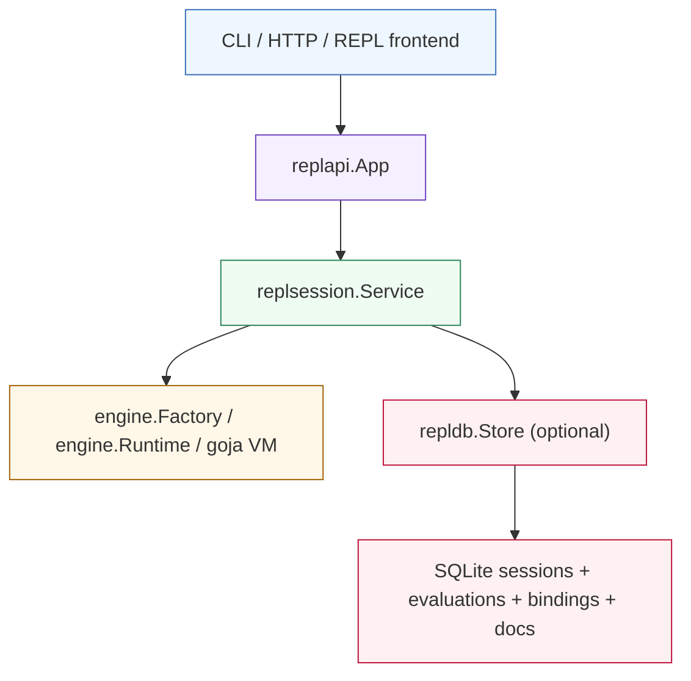
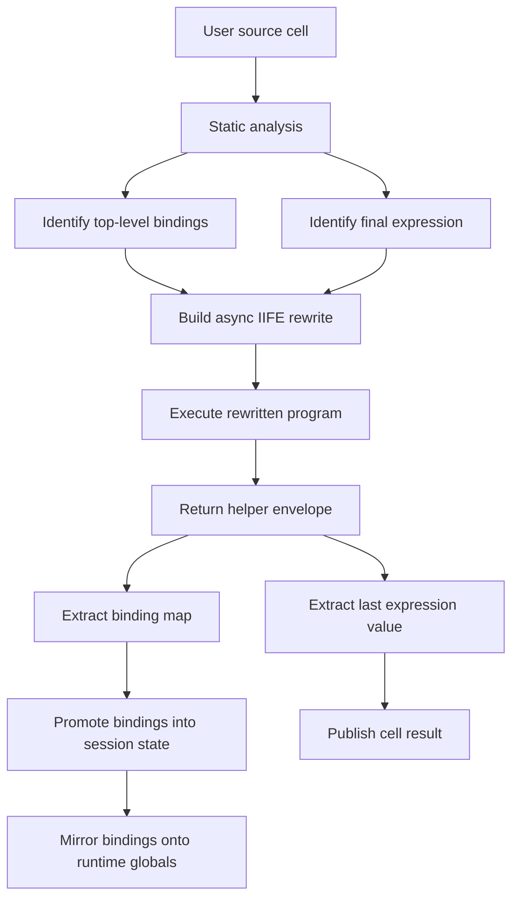
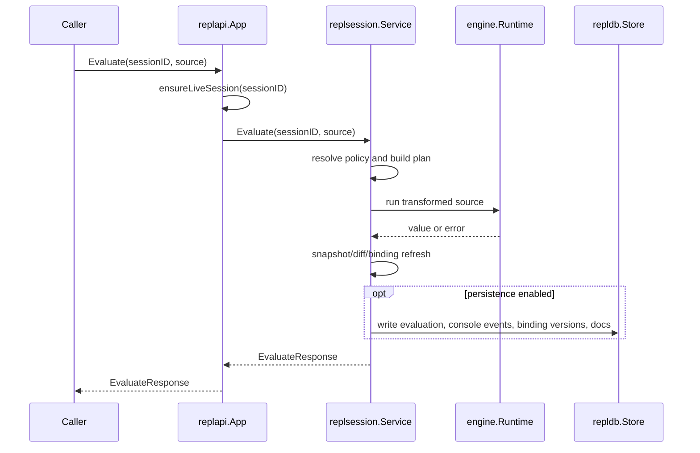

# go-go-goja REPL API: Profiles, IIFE Rewriting, and AST-Driven Session Semantics

This is the interactive-session branch of the [[go-go-goja]] project map.

This part of `go-go-goja` started life as a browser-oriented REPL prototype and then slowly revealed its real shape: not "a web page that can run JavaScript", but a reusable session kernel that can serve a CLI, a JSON server, and eventually multiple interactive clients. Once that becomes the design center, the interesting questions change. The hard part is no longer "how do we evaluate a line of JavaScript?" The hard part is "what counts as a session, what metadata do we preserve, how much of the execution do we observe, and how do we make that behavior configurable without turning the API into an incoherent matrix of flags?"

That is what `replapi` and `replsession` are solving today. The current system deliberately spans a spectrum. At one end, it can act like a near-straight Goja execution wrapper. At the other end, it can behave like a full persistent REPL with session history, replay-based restore, runtime diffing, binding version history, and JSDoc extraction from REPL-authored source. The center of gravity is a profile system that makes these behaviors explicit instead of accidental.

> [!summary]
> The current REPL stack has four important properties:
> 1. `replapi` is now profile-based: `raw`, `interactive`, and `persistent`
> 2. `replsession` is the real session kernel: it owns live runtimes, cell sequencing, rewrite policy, runtime observation, and persistence hooks
> 3. the IIFE rewrite is not a cosmetic trick; it is the core mechanism that lets the REPL preserve lexical declarations across cells without lying about JavaScript scoping
> 4. restore is replay-based, not VM-serialization-based: persisted source is re-executed into a fresh runtime, and the session's stored profile/policy is restored with it

## Why this subsystem exists

The repository has more than one way to run JavaScript:

- direct script execution through an owned runtime
- the older line REPL in `cmd/repl`
- the Bubble Tea UI in `cmd/js-repl`
- the persistent CLI in `cmd/goja-repl`
- the JSON server in `pkg/replhttp`

At first glance those look like separate products. They are not. They are really different frontends on top of a shared question: how should a stateful JavaScript session behave over time?

That question has real consequences:

- Should `const x = 1` in one cell still be available in the next cell?
- Should a session remember its history after process restart?
- Should the system compute AST, CST, scope, unresolved identifiers, and binding references for every cell?
- Should we capture `console.log` output?
- Should we extract docs written inline in REPL source?
- Should raw callers be forced through the same transformation path as a full auditable persistent REPL?

The current architecture says: no single answer is right for every caller. Instead, there is one session engine with explicit policies.

## Current project status

As of this report, the current state is:

- `replapi` is implemented and configurable
- `replsession` supports raw and instrumented execution modes
- persistent sessions are backed by SQLite in `pkg/repldb`
- the `goja-repl` CLI explicitly uses the persistent profile
- `cmd/repl` now explicitly uses the interactive profile
- `cmd/js-repl` has not yet been migrated onto `replapi`; it still uses the older evaluator-oriented path

The most important implementation files are:

- `/home/manuel/workspaces/2026-04-03/js-repl-smailnail/go-go-goja/pkg/replapi/config.go`
- `/home/manuel/workspaces/2026-04-03/js-repl-smailnail/go-go-goja/pkg/replapi/app.go`
- `/home/manuel/workspaces/2026-04-03/js-repl-smailnail/go-go-goja/pkg/replsession/policy.go`
- `/home/manuel/workspaces/2026-04-03/js-repl-smailnail/go-go-goja/pkg/replsession/service.go`
- `/home/manuel/workspaces/2026-04-03/js-repl-smailnail/go-go-goja/pkg/replsession/rewrite.go`
- `/home/manuel/workspaces/2026-04-03/js-repl-smailnail/go-go-goja/pkg/repldb/schema.go`
- `/home/manuel/workspaces/2026-04-03/js-repl-smailnail/go-go-goja/cmd/goja-repl/root.go`
- `/home/manuel/workspaces/2026-04-03/js-repl-smailnail/go-go-goja/cmd/repl/main.go`

The ticket trail for the current design is:

- `GOJA-20` architectural analysis and extraction plan
- `GOJA-21` SQLite persistence and replay/export
- `GOJA-22` CLI and JSON server surfaces
- `GOJA-23` configurable `replapi` profiles and policies

## The language fundamentals the REPL is actually fighting

Before reading the implementation, it helps to slow down and name the underlying problem precisely. A lot of JavaScript REPL confusion comes from treating three different things as if they were interchangeable:

- the JavaScript global object
- the top-level lexical environment
- the user-facing notion of a session binding

They are related, but they are not the same.

If you only think in terms of "a runtime with a global object", a REPL looks easy. Evaluate some code, leave the runtime alive, evaluate more code, and call it a day. That model works for a surprisingly small subset of what users expect. It starts failing the moment you care about modern JavaScript declaration forms, last-expression semantics, top-level await convenience, or durable replay.

The current architecture is stronger because it stops pretending that JavaScript itself already provides a perfect notion of REPL session state. Instead, it defines session semantics as a product concern and then implements them explicitly.

### Global object versus lexical environment

This distinction is the beginning of everything else.

In JavaScript, top-level `var` and function declarations interact with the global execution context differently from top-level `let` and `const`. A property-oriented mental model gets part of the way there and then breaks. Some names are accessible through the global object surface. Some are lexical bindings with their own redeclaration and visibility rules. Some effects are easy to observe through `globalThis`. Some are not.

That is why a persistent REPL cannot just say "the session is whatever is on the global object". That definition is too small for the user experience we want, and too blurry for an auditable runtime model.

The better mental model is:

```text
REPL session
  = live runtime
  + lexical execution of individual cells
  + explicit export/promotion rules
  + optional durable history and metadata
```

Once you adopt that model, the rest of the design starts making sense.

### Why `globalThis` is not the answer

A natural first design is: run each cell, inspect `globalThis`, and use it as the session snapshot. That works for demos and then collapses under real use.

It collapses because:

- lexical declarations are not simply global-object writes
- user-visible "cell result" is not a native JavaScript runtime concept
- top-level await convenience needs translation in many execution contexts
- durable export and replay need a cell-shaped history, not just a mutable heap

So the implementation needs more than post-hoc global inspection. It needs:

- a static understanding of what the source declares
- a controlled wrapper for how the source executes
- a deliberate promotion step after execution
- a persistence model that stores cells as first-class events

That layered solution is what `replsession` now provides.

### The real product tension: truth versus usability

Every REPL has to choose where it sits between two poles.

At one pole is semantic literalism: run source as directly as possible and do not help the user much beyond that. At the other pole is ergonomic session behavior: preserve bindings across cells, expose last-expression values, make top-level await work, and record useful metadata.

Neither pole is universally correct. That is why the profile system matters. It turns an implementation compromise into an explicit API choice:

- `raw` is closest to straight runtime execution
- `interactive` prefers useful REPL ergonomics
- `persistent` prefers auditable, durable, replayable session behavior

That is not just configuration. It is the architectural acknowledgement that "JavaScript REPL semantics" are not singular.

## The mental model

The easiest way to understand the code is to separate four layers:

1. **frontends**
   - `cmd/goja-repl`
   - `cmd/repl`
   - `pkg/replhttp`
2. **application facade**
   - `pkg/replapi`
3. **session kernel**
   - `pkg/replsession`
4. **durable store**
   - `pkg/repldb`



The architectural split matters:

- `replapi` answers "how should a caller create and access sessions?"
- `replsession` answers "what happens when a session evaluates source?"
- `repldb` answers "what durable records do we keep, and how do we restore/export them?"

If you lose this separation, the code starts to look more complicated than it really is.

## `replapi`: the product boundary

`replapi` is intentionally small. It is not where the interesting AST or runtime logic lives. It is where the system becomes usable.

The public design starts in `pkg/replapi/config.go`:

- `ProfileRaw`
- `ProfileInteractive`
- `ProfilePersistent`

These are not just labels. They are preset bundles of session behavior:

- `raw`
  - near-straight execution
  - no persistence
  - no auto-restore
- `interactive`
  - instrumented REPL semantics
  - in-memory by default
  - runtime observation enabled
- `persistent`
  - instrumented REPL semantics
  - SQLite-backed persistence
  - auto-restore enabled

The key types are:

```go
type Config struct {
    Profile        Profile
    Store          *repldb.Store
    AutoRestore    bool
    SessionOptions replsession.SessionOptions
}

type SessionOptions struct {
    ID        string
    CreatedAt time.Time
    Profile   *Profile
    Policy    *replsession.SessionPolicy
}
```

This design is doing two jobs at once:

- **app defaults**
  - what kind of sessions this app tends to create
- **per-session override**
  - how one particular session should behave

That second point is subtle but important. A persistent app can still create a raw scratch session. The API is not "one app, one irreversible mode".

## `replapi.App`: what it actually does

`pkg/replapi/app.go` turns configuration into behavior.

The constructor:

```go
app, err := replapi.New(
    factory,
    logger,
    replapi.WithProfile(replapi.ProfilePersistent),
    replapi.WithStore(store),
)
```

does three things:

1. normalize and validate config
2. construct a `replsession.Service` with default session options
3. optionally wire in the SQLite store

The important methods on `App` are:

- `CreateSession(...)`
- `CreateSessionWithOptions(...)`
- `Evaluate(...)`
- `Snapshot(...)`
- `Restore(...)`
- `DeleteSession(...)`
- `ListSessions(...)`
- `History(...)`
- `Export(...)`
- `ReplaySource(...)`
- `Bindings(...)`
- `Docs(...)`

The most important behavior is hidden in `ensureLiveSession(...)`.

When a caller evaluates a session ID, the app first checks whether a live session exists in memory. If yes, the request proceeds immediately. If not:

- if auto-restore is disabled, the call fails
- if auto-restore is enabled and a store exists, the app loads the durable session and replays its source into a new live runtime

This is the moment where the system becomes more than "a persistent log". It becomes a restart-tolerant runtime model.

### API reference: the shape a caller actually programs against

For a new engineer, it is worth seeing the API not as abstract nouns but as a concrete, opinionated surface. The important point is that `replapi` is intentionally small. It is trying to be the layer you can hand to a CLI author, a server author, or a TUI author without forcing them to understand every implementation detail in `replsession`.

At a high level, the current surface looks like this:

```go
func New(
    factory engine.RuntimeFactory,
    logger zerolog.Logger,
    opts ...Option,
) (*App, error)

func NewWithConfig(
    factory engine.RuntimeFactory,
    logger zerolog.Logger,
    cfg Config,
) (*App, error)

func (a *App) CreateSession(ctx context.Context) (*replsession.SessionSummary, error)

func (a *App) CreateSessionWithOptions(
    ctx context.Context,
    opts SessionOptions,
) (*replsession.SessionSummary, error)

func (a *App) Evaluate(
    ctx context.Context,
    sessionID string,
    source string,
) (*replsession.EvaluateResponse, error)

func (a *App) Snapshot(
    ctx context.Context,
    sessionID string,
) (*replsession.SessionSummary, error)

func (a *App) Restore(
    ctx context.Context,
    sessionID string,
) (*replsession.SessionSummary, error)
```

The store-backed query methods sit beside that:

```go
func (a *App) ListSessions(ctx context.Context) ([]repldb.SessionRecord, error)
func (a *App) History(ctx context.Context, sessionID string) ([]repldb.EvaluationRecord, error)
func (a *App) Bindings(ctx context.Context, sessionID string) ([]repldb.BindingRecord, error)
func (a *App) Docs(ctx context.Context, sessionID string) ([]repldb.BindingDocRecord, error)
func (a *App) Export(ctx context.Context, sessionID string) (*repldb.ExportBundle, error)
func (a *App) ReplaySource(ctx context.Context, sessionID string) ([]string, error)
func (a *App) DeleteSession(ctx context.Context, sessionID string) error
```

The most useful way to think about this split is:

- `CreateSession` and `Evaluate` are live runtime operations
- `ListSessions`, `History`, `Bindings`, `Docs`, and `Export` are durable data operations
- `Restore` is the bridge between durable records and live runtime state

That shape matters because it prevents frontend code from smuggling runtime policy into storage code or vice versa. It also keeps the future migration of `cmd/js-repl` conceptually simple: the TUI does not need to become a storage engine, it just needs to call into `App`.

### Worked API examples

The simplest possible caller can treat `replapi` as a lightweight wrapper around a runtime factory:

```go
app, err := replapi.New(
    factory,
    zerolog.Nop(),
    replapi.WithProfile(replapi.ProfileRaw),
)
if err != nil {
    return err
}

session, err := app.CreateSession(ctx)
if err != nil {
    return err
}

resp, err := app.Evaluate(ctx, session.ID, "1 + 2")
if err != nil {
    return err
}

fmt.Println(resp.Cell.Execution.Result)
```

A persistent caller looks almost the same, which is exactly the point:

```go
app, err := replapi.New(
    factory,
    logger,
    replapi.WithProfile(replapi.ProfilePersistent),
    replapi.WithStore(store),
)
if err != nil {
    return err
}

session, err := app.CreateSessionWithOptions(ctx, replapi.SessionOptions{
    ID: "demo-session",
})
if err != nil {
    return err
}

_, _ = app.Evaluate(ctx, session.ID, `
/** add one to a number */
const inc = (n) => n + 1;
inc(41)
`)

history, err := app.History(ctx, session.ID)
if err != nil {
    return err
}

docs, err := app.Docs(ctx, session.ID)
if err != nil {
    return err
}
```

The deeper architectural point here is that the caller does not choose individual implementation steps such as "run AST analysis now" or "diff globals now". The caller chooses a profile or policy. The kernel then executes the right pipeline for that choice. That is how the API stays opinionated without becoming rigid.

### The Goja and `engine.Runtime` layer underneath the API

It is also worth understanding what `replapi` is not. It is not a replacement for the JavaScript engine. It is a policy-bearing orchestration layer on top of `engine.Runtime`, which itself wraps the actual Goja execution environment and module plumbing used by the repository.

That means there are three different responsibilities in play:

- Goja is responsible for actually parsing and evaluating JavaScript and representing values
- `engine.Runtime` is responsible for repository-level runtime assembly such as modules and execution helpers
- `replsession` is responsible for session semantics across multiple cells

This is an important distinction for new contributors, because it tells you where a bug probably lives:

- if a language feature fails to execute at all, the issue may be in Goja or runtime setup
- if a binding is not preserved across cells, the issue is likely in `replsession`
- if a session cannot be restored or exported, the issue is likely in `repldb` or `replapi`

### Promise handling and async boundaries

Another foundational detail is that the REPL is not merely running strings and dumping values. It is also trying to present a coherent experience around asynchronous results.

In practice that means the evaluation path needs to detect when a result is promise-like and decide whether to wait for fulfillment before building the cell response. This is true in both the full instrumented path and in the raw path with top-level await support.

Conceptually, the runtime-facing part looks like:

```go
value, err := runtime.RunString(transformedSource)
if err != nil {
    return failure(err)
}

if looksLikePromise(value) {
    value, err = awaitPromise(value)
    if err != nil {
        return failure(err)
    }
}

return buildExecutionResult(value)
```

The key architectural consequence is that the response model is not just "whatever `RunString` returned". It is "the semantically completed result of the cell according to the current policy". That sounds subtle, but it is one of the reasons the REPL surface feels like a product instead of a raw embedding.

## Profiles versus policies

A profile is the human-facing shape. A policy is the machine-facing shape.

The real knobs live in `pkg/replsession/policy.go`:

```go
type SessionPolicy struct {
    Eval    EvalPolicy
    Observe ObservePolicy
    Persist PersistPolicy
}
```

Those split into:

- **EvalPolicy**
  - raw vs instrumented execution
  - capture last expression
  - support top-level await
- **ObservePolicy**
  - static analysis
  - runtime snapshots
  - binding tracking
  - console capture
  - JSDoc extraction
- **PersistPolicy**
  - whether any durable writes happen at all
  - whether sessions/evaluations/binding versions/binding docs are stored

This split is the design improvement that makes the whole subsystem intelligible. It means:

- raw execution can still do some observation
- interactive sessions can be instrumented without being durable
- persistent sessions can remember their exact behavior in session metadata

## Session creation: what a session really is

`replsession.Service` is the actual session owner.

A session is not just a session ID. It is:

- a live `engine.Runtime`
- an execution profile and policy
- a creation timestamp
- a cell counter
- a list of prior cell reports
- a map of tracked bindings
- a console sink
- a set of ignored globals used by REPL helpers and doc sentinels

In the code, that state is mostly held in `sessionState`.

The creation path:

1. resolve session options against service defaults
2. build a fresh runtime from `engine.Factory`
3. assign session ID and timestamps
4. optionally install console capture
5. optionally install JSDoc sentinel functions
6. optionally persist the session row to SQLite

This is where profile and policy stop being abstract metadata. They now determine the shape of the runtime itself.

## Why the IIFE rewrite exists

This is the heart of the subsystem.

A JavaScript REPL wants contradictory things:

- lexical declarations like `const x = 1` should feel like they "stick around" across cells
- but lexical declarations are not normal properties on the global object
- and `let` / `const` are not supposed to be naïvely reassignable through a fake global map

The rewrite solves this by treating a cell as a tiny local program, not as direct mutation of the long-lived top-level lexical scope.

The strategy in `pkg/replsession/rewrite.go` is:

1. analyze the cell
2. find top-level declared names
3. detect whether the last top-level statement is an expression
4. wrap the whole thing in an async IIFE
5. return two helper values:
   - one hidden helper object containing the declared bindings
   - one hidden helper carrying the final expression value

Conceptually, a cell like:

```js
const x = 1;
x + 1
```

becomes something structurally like:

```js
(async function () {
  let __ggg_repl_last_1__;
  const x = 1;
  __ggg_repl_last_1__ = (x + 1);
  return {
    "__ggg_repl_bindings_1__": {
      "x": (typeof x === "undefined" ? undefined : x)
    },
    "__ggg_repl_last_1__": (
      typeof __ggg_repl_last_1__ === "undefined"
        ? undefined
        : __ggg_repl_last_1__
    )
  };
})()
```

This gives the kernel three things it cannot get reliably from direct `RunString(...)` alone:

- a lexical sandbox for the cell
- a reliable exported set of declared bindings
- a stable notion of "the last expression result"

The follow-up step is equally important: after execution, `persistWrappedReturn(...)` takes those returned bindings and mirrors them back onto the runtime's global object so later cells can see them.

That is the REPL illusion, implemented honestly:

- lexical declarations are local while the cell runs
- then selected values are promoted into long-lived session state

### The deeper semantic reason the IIFE is the right tool

The IIFE is doing more than giving us a convenient wrapper. It creates a boundary between two different semantic domains.

Inside the IIFE, the code behaves like a small program with an ordinary lexical life. `const`, `let`, nested scopes, helper functions, and the final expression all belong to that local execution. Outside the IIFE, the REPL kernel can decide what parts of that local execution should become part of the longer-lived session model.

That separation matters because it keeps the implementation intellectually clean:

- execution semantics happen inside the IIFE
- session semantics happen after the IIFE returns

Without that separation, the kernel would be reduced to inferring too much from runtime side effects alone. It would have to guess which names matter, which values count as exports, and what the user would expect to persist. The explicit return envelope avoids that ambiguity.

### Why not build one giant synthetic source file?

New contributors often propose an alternative design: append every cell to one ever-growing source buffer, keep re-running or extending it, and let the runtime accumulate state naturally.

That sounds simpler than it is.

It creates several problems immediately:

- it weakens cell boundaries
- it makes error localization worse
- it makes "what was the result of cell 12?" harder to answer
- it complicates replay, export, and audit
- it still does not solve last-expression capture cleanly

The current architecture wants each cell to remain a first-class event. The IIFE strategy supports that directly. Each cell is analyzed, rewritten, executed, observed, and optionally persisted as an independent step in the session timeline.

### Rewrite invariants

The transform is only acceptable if it preserves a strict set of invariants. These are useful review questions when reading `pkg/replsession/rewrite.go`:

1. the original cell order must stay meaningful
2. top-level declarations must execute exactly once
3. the final expression must execute exactly once
4. helper names must not collide with user names
5. declared exports must correspond to real top-level declarations
6. "no final expression" must remain distinguishable from "final expression evaluated to undefined"

These invariants are the difference between a toy transform and a trustworthy REPL kernel.

### A worked cell example from source to runtime state

The easiest way to understand the rewrite is to follow a single cell all the way through the pipeline. Consider this input:

```js
const base = 40;
const inc = (n) => n + 1;
inc(base) + 1
```

Static analysis identifies three facts that matter immediately:

- `base` is a top-level declaration
- `inc` is a top-level declaration
- the final top-level statement is an expression whose value should become the cell result

The transformed source is conceptually shaped like this:

```js
(async function () {
  let __ggg_repl_last_7__;

  const base = 40;
  const inc = (n) => n + 1;
  __ggg_repl_last_7__ = (inc(base) + 1);

  return {
    "__ggg_repl_bindings_7__": {
      "base": typeof base === "undefined" ? undefined : base,
      "inc": typeof inc === "undefined" ? undefined : inc,
    },
    "__ggg_repl_last_7__": typeof __ggg_repl_last_7__ === "undefined"
      ? undefined
      : __ggg_repl_last_7__,
  };
})()
```

From there, the runtime does four conceptually separate things:

1. execute the local lexical program
2. capture the return envelope
3. mirror selected returned bindings into durable session state and the runtime global object
4. publish the last-expression value as the user-visible result

The session after that cell feels as if it now "contains" both `base` and `inc`. The important nuance is that this is not because the original lexical scope stayed alive. It is because the REPL kernel intentionally promoted selected values into the session model after the cell completed.

That distinction becomes even clearer on the next cell:

```js
inc(base + 1)
```

The second cell does not magically resume the first cell's lexical environment. It simply sees `base` and `inc` as runtime-accessible session bindings because the first cell exported them. This is why the implementation can be both honest and user-friendly at the same time.

### Diagram: source, rewrite, execution, promotion



## Why we still use an IIFE in raw mode sometimes

Raw mode is intentionally lighter, but it still has one small rewrite case: top-level await.

If raw mode has `SupportTopLevelAwait` enabled and the source begins with `await ...`, the system wraps only that expression in a tiny async IIFE:

```js
(async () => { return await something(); })()
```

This is a narrower rewrite than instrumented mode. It is there for convenience, not for binding capture.

So there are really two rewrite stories:

- **instrumented mode**
  - full cell rewrite for binding capture and last-expression semantics
- **raw mode**
  - usually no rewrite
  - optional narrow await wrapper for direct `await ...`

### Top-level await is a language-boundary problem

It is tempting to describe `SupportTopLevelAwait` as just a pleasant convenience feature. It is more fundamental than that. It exists because the user's model of a REPL and the parser's model of a script are not always the same.

From the user's point of view, typing:

```js
await fetchSomething()
```

is a perfectly natural interactive command. From the runtime's point of view, bare top-level `await` may or may not be valid depending on the parse context. The wrapper solves that mismatch by translating an interactive intent into an executable async expression without also imposing the full instrumented export model.

That is why the raw-mode await wrapper is deliberately narrow. It solves one language-boundary issue and nothing else.

## AST, CST, and static analysis: what the analysis layer actually computes

When static analysis is enabled, the kernel uses `jsparse` plus a Tree-sitter parser to compute a cell's static report before execution.

The main path is:

- `jsparse.Analyze(...)`
- optional Tree-sitter CST parse
- `buildStaticReport(...)`

The static report includes:

- diagnostics
- top-level bindings
- unresolved identifiers
- grouped references per binding
- scope tree
- AST rows
- CST rows
- final expression range

This is not "analysis for analysis's sake". Each part has a job:

- **diagnostics**
  - parse errors and static issues
- **top-level bindings**
  - tells the rewrite what names should be exported
- **final expression detection**
  - tells the REPL what to show as the cell's result
- **references and scope**
  - feed richer debugging and introspection views
- **AST/CST snapshots**
  - make the system inspectable in a way a normal REPL usually is not

The implementation is interesting because it uses AST and CST differently:

- the Goja/parser-driven analysis provides semantic structure and resolution
- Tree-sitter provides a CST snapshot that is useful for structural debugging and UI inspection

This is why the reports contain both "what the program means" and "how the source was shaped".

### AST versus CST: why the distinction matters

The note would be incomplete without stating this directly. An AST and a CST are not interchangeable representations with different names. They preserve different truths about the same source.

The AST is optimized for meaning. It collapses syntax into semantic structure so questions like "what bindings are declared here?" and "is the last statement an expression?" become answerable in a tractable way.

The CST is optimized for structure. It preserves more of the literal shape of the original source. That makes it useful for tooling, visual inspection, and future UI work where the way code was written matters as much as what it means.

For this subsystem:

- the AST drives decisions
- the CST supports inspection

That is a healthy split. It keeps the decision pipeline semantic while still preserving a rich source-oriented view for debugging and interfaces.

### Why static analysis still matters when we also inspect runtime state

A reasonable challenge is: if the runtime layer already snapshots globals and diffs them after execution, why do we need static analysis at all?

Because runtime observation and static analysis answer different questions.

Static analysis answers:

- what names does the source declare?
- what expression should be treated as the cell's result?
- what unresolved identifiers does this cell depend on?
- what scope structure exists even if execution later fails?

Runtime observation answers:

- what actually changed in the VM?
- what leaked onto the global surface?
- what do the resulting values look like right now?

The architecture is better because it refuses to collapse those questions into one mechanism. Source intent and runtime effect are not the same thing.

### What a static report feels like in practice

A newcomer can read "diagnostics, bindings, unresolved identifiers, scope tree" and still not develop a good mental model. The missing piece is seeing how these data sets cooperate during one evaluation.

Take this source:

```js
const total = items.reduce((acc, item) => acc + item.price, 0);
total
```

A useful static report conceptually says something like:

- declarations:
  - `total`
- unresolved identifiers:
  - `items`
- references:
  - `total` is declared once and referenced once
  - `acc` and `item` are function-local names, not top-level session bindings
- final expression:
  - the second statement is an expression statement containing identifier `total`
- diagnostics:
  - none, if the code parses successfully

That report answers several questions at once:

- the rewrite should export `total`
- the cell result should be the value of the final expression `total`
- a frontend could highlight that `items` is required from surrounding session state
- the binding tracker should not treat `acc` or `item` as session-level exports

This is the reason the static layer exists. It is not only for pretty debug output. It is a decision engine for the rest of the REPL pipeline.

### Pseudocode: analysis and rewrite planning

```go
func buildPlan(source string, policy SessionPolicy) Plan {
    plan := Plan{Source: source}

    if policy.Observe.StaticAnalysis {
        analysis := jsparse.Analyze(source)
        plan.Static = buildStaticReport(analysis)
        plan.TopLevelBindings = analysis.TopLevelBindings()
        plan.FinalExpression = analysis.FinalExpression()
    }

    switch policy.Eval.Mode {
    case EvalModeInstrumented:
        plan.Transformed = rewriteInstrumentedCell(
            source,
            plan.TopLevelBindings,
            plan.FinalExpression,
        )
    case EvalModeRaw:
        if policy.Eval.SupportTopLevelAwait && beginsWithAwaitExpression(source) {
            plan.Transformed = wrapTopLevelAwaitExpression(source)
        } else {
            plan.Transformed = source
        }
    }

    return plan
}
```

## What happens during evaluation

The evaluation pipeline in `replsession.Service.Evaluate(...)` is easier to follow if you think of it as a staged pipeline:

```text
resolve session
  -> choose policy
  -> optional static analysis
  -> build rewrite plan
  -> choose execution path
      -> instrumented
      -> raw
  -> optional runtime observation
  -> optional persistence
  -> build response
```

Here is the same flow rendered as a sequence between the major components:



The architectural significance of this sequence is easy to miss. `replapi.App` is intentionally not doing AST work, runtime diffs, or SQLite row assembly. It is orchestrating session access. The heavy semantics live one layer down, which is what allows multiple frontends to share one execution model.

### Instrumented path

The instrumented path is the "full REPL semantics" mode.

It does this:

1. snapshot globals before execution
2. clear console sink
3. execute transformed source
4. wait for promise fulfillment if needed
5. extract returned binding set and final value
6. snapshot globals after execution
7. diff globals
8. classify:
   - new bindings
   - updated bindings
   - removed bindings
   - leaked globals
9. map declared bindings from static analysis into tracked binding metadata
10. refresh runtime details for tracked bindings
11. persist the cell if policy says to

This path is what makes the session feel like a REPL rather than a sequence of unrelated scripts.

### Raw path

The raw path is intentionally simpler.

It does not try to capture lexical declarations through the helper object trick. It just executes the source, optionally awaits promises, and optionally computes runtime snapshots and binding diffs.

That means raw mode is useful when:

- you want minimal transformation
- you still want some observation
- you do not want the kernel to pretend every lexical declaration is a session binding

This distinction is one of the most important architectural decisions in the current codebase.

## Runtime observation: the system's "x-ray mode"

Static analysis only sees source. The runtime observation layer sees what actually happened to the VM.

The main runtime tools are:

- `snapshotGlobals(...)`
- `diffGlobals(...)`
- `refreshBindingRuntimeDetails(...)`
- `snapshotBindingExports(...)`

The system snapshots non-builtin globals before and after execution, then compares:

- preview string
- kind
- object identity
- property count

That diff is what drives:

- "new binding"
- "updated binding"
- "removed binding"
- "leaked global"

This is especially useful because JavaScript code can create state in ways the static layer does not predict cleanly. For example:

- assignment to undeclared globals
- mutation of existing values
- function/object creation with runtime shape differences

`refreshBindingRuntimeDetails(...)` then performs a deeper inspection for tracked bindings:

- value kind
- preview
- own properties
- prototype chain
- function-to-source mapping where possible

So the session model is not only "what names exist". It is also "what shape do these values currently have?"

## Console capture and doc sentinels

Two small pieces of runtime setup are easy to overlook, but they matter a lot.

### Console capture

If `Observe.ConsoleCapture` is enabled, the session installs its own `console` object and records:

- `log`
- `info`
- `debug`
- `warn`
- `error`
- `table`

Instead of printing directly, these methods append structured `ConsoleEvent` entries to the session's sink. Frontends can then decide how to render them.

### JSDoc sentinels

If `Observe.JSDocExtraction` is enabled, the session installs no-op helpers:

- `__doc__`
- `__package__`
- `__example__`
- `doc`

These are deliberately ignored globals. They are not there for runtime semantics. They are there so a REPL cell can contain documentation-oriented markup without crashing execution.

Later, `extractBindingDocs(...)` runs `extract.ParseSource(...)` over the original cell source and turns those docs into structured binding-doc records.

This means the REPL can become a documentable workspace, not just an evaluator.

## Persistence: what SQLite actually stores

The durable schema in `pkg/repldb/schema.go` stores much more than a transcript.

Tables:

- `sessions`
- `evaluations`
- `console_events`
- `bindings`
- `binding_versions`
- `binding_docs`

The key durable ideas are:

- **session row**
  - ID, timestamps, engine kind, metadata JSON
- **evaluation row**
  - raw source
  - rewritten source
  - success flag
  - serialized result
  - error text
  - static analysis JSON
  - globals-before and globals-after JSON
- **binding version row**
  - insert/update/remove action
  - runtime type
  - display value
  - serialized binding summary
  - exportability classification
  - associated doc digest
- **binding doc row**
  - symbol name
  - raw doc payload
  - normalized JSON

The crucial design detail is `sessions.metadata_json`.

That field now stores the session's:

- profile
- policy

This prevents a subtle restore bug. Without that metadata, a session created under one set of defaults could later be restored under another.

## Restore: why replay beats VM serialization here

The system does not serialize a live Goja VM. It reconstructs one.

The restore sequence is:

1. load session row
2. load evaluation history
3. recover stored profile/policy from `metadata_json`
4. create a temporary service with the same session behavior but persistence disabled
5. replay raw source cell by cell into that temporary service
6. move the rebuilt state into the target session ID

That design looks indirect until you compare it with the alternatives.

A serialized-VM approach would be:

- harder to make safe
- tightly coupled to engine internals
- much less exportable

Replay-based restore has better failure properties:

- the persisted history is human-readable
- export and restore use the same conceptual model
- failures are localized to specific replay cells

### A restore example

Suppose a persistent session evaluated the following three cells:

```js
const x = 1
```

```js
const y = x + 1
```

```js
y + 10
```

The durable store now contains:

- one session row with profile and policy metadata
- three evaluation rows with original source
- any captured console events
- binding version history for `x` and `y`

If the process exits, a later `Restore("session-123")` does not load a frozen runtime image. Instead it conceptually does this:

```go
meta := store.LoadSession("session-123")
history := store.LoadHistory("session-123")
opts := SessionOptionsFromMetadata(meta)

tmp := replsession.NewService(factory, logger,
    replsession.WithDefaultSessionOptions(opts),
)

session := tmp.CreateSessionWithOptions(ctx, opts)
for _, cell := range history {
    _, err := tmp.Evaluate(ctx, session.ID, cell.Source)
    if err != nil {
        return err
    }
}
```

That is a simple model, and that simplicity is doing real architectural work. A new engineer can inspect the database, inspect the replayed source, reproduce failures one cell at a time, and export the session as a human-readable artifact. Those are strong operational properties.

The tradeoff is obvious too: replay only works as well as deterministic re-execution works. But for this subsystem, that is the right trade.

## How the frontends consume it today

### `cmd/goja-repl`

This is the first-class persistent frontend.

It opens a SQLite store, builds an engine factory, then creates:

```go
replapi.New(
    factory,
    log.Logger,
    replapi.WithProfile(replapi.ProfilePersistent),
    replapi.WithStore(store),
)
```

This is exactly what the architecture wants. The command is not "special". It simply chooses the persistent profile explicitly.

### `cmd/repl`

This is now the simplest example of the interactive profile.

In interactive mode it does:

```go
replapi.New(factory, zerolog.Nop(), replapi.WithProfile(replapi.ProfileInteractive))
```

then creates one session and evaluates each line through `app.Evaluate(...)`.

This is important because it proves `replapi` is no longer only for the store-backed server world.

### `cmd/js-repl`

This one is the notable holdout.

It still uses the older evaluator-centered path built around:

- `pkg/repl/evaluators/javascript`
- `pkg/repl/adapters/bobatea`

That stack is richer in editor-assistance behavior today:

- completion
- help bar
- help drawer

but it is not yet the same thing as the new `replapi` session kernel.

The eventual migration path is clear:

- keep the UI and editor-assistance surface
- move execution/session ownership onto `replapi`

## The most important design tradeoffs

This subsystem is full of deliberate compromise. The most important ones are worth naming explicitly.

### 1. Instrumented execution is not raw JavaScript execution

The IIFE rewrite changes how a cell runs. That is the whole point. It is also why raw mode exists.

The architecture does not pretend otherwise. It says:

- if you want REPL semantics, use the instrumented path
- if you want minimal interference, use raw mode

That honesty is what makes the API defensible.

### 2. Session bindings are a product concept, not a JavaScript language primitive

When instrumented mode mirrors returned declarations back onto the runtime global object, it is implementing a session model, not preserving source-level lexical truth.

That is acceptable because the system exposes this clearly in reports and policies.

### 3. Replay restore favors inspectability over perfect snapshot fidelity

A replayed runtime is not a bit-for-bit memory snapshot. It is a reconstructed session. But it is inspectable, exportable, and debuggable.

### 4. The static and runtime layers are intentionally redundant

At first this can look wasteful:

- static bindings
- runtime diffs
- binding runtime inspection

But these answer different questions:

- what source declares
- what runtime actually changed
- what values currently look like

The redundancy is a feature.

## If you are new to the project, how should you read the code?

Read it in this order:

1. `pkg/replapi/config.go`
   - understand profiles and app/session config
2. `pkg/replapi/app.go`
   - understand live session lookup and restore behavior
3. `pkg/replsession/policy.go`
   - understand the machine-level policy shape
4. `pkg/replsession/service.go`
   - read:
     - `CreateSessionWithOptions`
     - `Evaluate`
     - `evaluateInstrumented`
     - `evaluateRaw`
     - `RestoreSession`
5. `pkg/replsession/rewrite.go`
   - understand why the IIFE transform exists
6. `pkg/repldb/schema.go`
   - understand what the system chooses to remember

If you do it in the reverse order, the code feels larger than it is.

## Pseudocode summary

This is the shortest accurate summary of the system:

```go
app := replapi.New(factory, logger, profile, maybeStore)

session := app.CreateSession(...)

for each cell:
    policy := session.policy

    if policy wants static analysis:
        analysis := jsparse.Analyze(source)
        static := buildStaticReport(analysis)

    rewrite := chooseRewrite(source, analysis, policy)

    if policy is instrumented:
        before := snapshotGlobals()
        result := run(rewrite.TransformedSource)
        persistedBindings := extractReturnedBindings(result)
        mirrorBindingsIntoRuntime(persistedBindings)
        after := snapshotGlobals()
        diff := diffGlobals(before, after)
        refreshBindingRuntimeDetails()
    else:
        maybeBefore := snapshotGlobalsIfRequested()
        result := run(rewrite.TransformedSource)
        maybeAfter := snapshotGlobalsIfRequested()
        maybeDiff := diffGlobals(...)

    if persistence enabled:
        write session/evaluation/binding/doc rows to SQLite

    return session summary + cell report
```

## What should happen next

The next natural step is not another major redesign. The current architecture is good enough to start consuming.

The main next step is:

- migrate `cmd/js-repl` onto `replapi` for execution/session ownership while preserving its completion/help stack

After that, the older prototype-oriented surfaces can be retired more confidently.

The important thing now is not to lose the clarity of the current split. `replapi` should stay small and explicit. `replsession` should stay the session brain. `repldb` should stay the durable memory. As long as those boundaries remain clear, the subsystem can keep growing without collapsing back into "just a web REPL with some SQLite attached".

## KB reviews

- [[KB-BATCH3-goja-ecosystem]] (2026-05-11) — concept extraction + classification

## Related KB entries

- [[Tribal/goja-embedding-in-go]] — the Go+JS runtime pattern
- [[Tribal/goja-execution-model]] — sessions + thread discipline (CREATED)

**Tribal candidates** (not yet at 3-project threshold):
- REPL session semantics (3/3) → **READY**
- IIFE cell rewrite (2/3)
- Runtime owner thread discipline (3/3) → **READY**
- Promise handling in evaluation (2/3)
- Replay-based restore (1/3)
