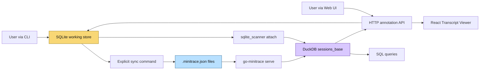

# go-minitrace Annotation System

This note describes the annotation subsystem inside `go-minitrace`: what problem it solves, how a user works with it, how the storage model is designed, how it plugs into DuckDB and the web UI, and how it was implemented across the repo. It is best read as a follow-up to [[PROJ - go-minitrace - Web UI and Transcript Explorer]], but focused narrowly on the new human-annotation layer.

> [!summary]
> The annotation system currently has three important identities:
> 1. a human-authored metadata layer over sessions, turns, and tool calls
> 2. a split-storage architecture: SQLite for fast working writes, explicit sync back to `.minitrace.json`, and DuckDB for live read-side analytics
> 3. a multi-surface workflow exposed through CLI, HTTP API, transcript UI, and SQL queries

## Why this functionality exists

Before this feature, minitrace sessions could theoretically carry an `annotations` array, but there was no practical workflow around it. In real use, that meant several things were missing at once:

- no fast way to mark a session as interesting while reading it
- no structured place to record AI failures, user errors, environment issues, or questions
- no way to attach notes to a specific turn or tool call from the CLI or UI
- no cross-session search surface for human judgments layered on top of the raw transcript data
- no safe write path that preserved `.minitrace.json` as a portable interchange format

The annotation system exists to make minitrace useful not only as a transcript archive, but as an analysis tool.

The underlying use case is very practical: once a repository contains dozens or hundreds of agent sessions, the raw transcript is not enough. A human wants to record judgments such as:

- “this was an AI failure, not a tool failure”
- “the user prompt was ambiguous here”
- “this tool call shows a reproducible environment issue”
- “this session should be revisited later”
- “this turn is a good example of success / improvement / regression risk”

That is the level at which a research notebook, postmortem process, or failure-taxonomy workflow starts to become genuinely useful.

## What the annotation system is for

At a user level, the annotation system turns minitrace from a passive archive into an actively curated corpus.

It supports four kinds of work:

1. **Session review**
   - mark entire sessions as important, confusing, successful, broken, or worth discussing
2. **Transcript-local analysis**
   - attach a note to a specific turn or tool call while reading the transcript
3. **Cross-session querying**
   - search annotations with SQL, or join annotations against session metadata in DuckDB
4. **Portable archival output**
   - write annotations back into `.minitrace.json` so the enriched artifact remains shareable and tool-independent

That last point matters. The SQLite database is not meant to replace the session file format. It is meant to make annotation authoring fast and ergonomic while keeping the file format stable and portable.

## Current project status

The annotation functionality is mostly implemented and usable today.

What is already implemented and committed:

- SQLite-backed annotation store in `output/annotations.db`
- atomic sync from SQLite back into `.minitrace.json`
- `go-minitrace annotate` CLI with add/list/edit/delete/sync/import
- live DuckDB access to annotations via `sqlite_scanner`
- HTTP API under `/api/sessions/{id}/annotations` and `/api/annotations`
- web Annotation panel inside the Transcript Viewer
- transcript-linked navigation from annotation cards to transcript targets
- inline transcript markers on turns and tool calls
- turn-level and tool-call-level `Annotate` affordances
- Session Browser annotation badges
- validation of annotation structure in `go-minitrace validate`
- E2E and smoke scripts collected under the ticket’s `scripts/` folder

What is still evolving:

- Phase 8 polish for transcript annotation workflow is in progress locally:
  - inline annotation composer without tab switch
  - URL-backed tab / focus / selected annotation state
  - richer hover-preview and click-through behavior
- query-builder UX for cross-session annotation search is still optional; raw SQL already works well
- classification escalation rules are defined but not yet enforced as a workflow constraint

So the right mental model is: **the core annotation system exists and works; final workflow polish is still being explored.**

## What annotations look like conceptually

An annotation is human-authored metadata attached to one of three scopes:

- `session`
- `turn`
- `tool_call`

It carries:

- an ID
- timestamp
- annotator
- scope (`type` + `target_id`)
- category
- title
- optional detail
- optional tags
- optional taxonomy mappings
- optional classification

The system currently ships with these annotation categories:

- `observation`
- `ai-failure`
- `user-error`
- `environment-issue`
- `success`
- `question`
- `to-discuss`
- `to-improve`

And these classification levels are recognized by validation:

- `public`
- `internal`
- `confidential`
- `customer-confidential`

The important point is that the schema supports a serious review workflow, not just freeform sticky notes.

## How a user works with it

There are four main entry points: CLI, HTTP API, web UI, and SQL.

### CLI workflow

The CLI is the most explicit and scriptable interface.

Typical workflow:

```bash
go-minitrace annotate add \
  --output-dir ./output \
  --session sess-001 \
  --scope turn \
  --target-id 14 \
  --category ai-failure \
  --title "Model used wrong tool" \
  --detail "It ignored the prior shell result and retried a stale path" \
  --tags tools,reasoning \
  --taxonomy-minitrace F-AUT \
  --annotator manuel

# inspect
go-minitrace annotate list --output-dir ./output --session sess-001

# persist back to canonical JSON
go-minitrace annotate sync --output-dir ./output
```

This is useful when annotating from shell-driven analysis, test scripts, or ticket workflows.

### HTTP API workflow

When `go-minitrace serve` is running, the annotation store is exposed through REST endpoints.

```text
GET    /api/sessions/{id}/annotations
POST   /api/sessions/{id}/annotations
GET    /api/annotations
PUT    /api/annotations/{annId}
DELETE /api/annotations/{annId}
POST   /api/annotations/sync
```

This is the integration surface used by the React frontend, but it is also convenient for ad hoc automation.

### Web UI workflow

The current committed UI supports these patterns:

- open a session transcript
- switch to the `Annotations` tab
- add a session annotation from the panel
- click an annotation card to jump to its transcript target
- see inline markers on turn rows and tool-call rows
- click `Annotate` on a turn or tool call to start a scoped workflow
- see per-session annotation badges in the Session Browser

The web UI matters because annotation is fundamentally a reading task. The faster the reader can jump between transcript evidence and annotation records, the more useful the system becomes.

### SQL / analytical workflow

DuckDB can query annotations live alongside loaded sessions.

```sql
SELECT
    a.session_id,
    sb.environment->>'agent_framework' AS framework,
    a.category,
    a.title,
    a.target_id
FROM annotations a
JOIN sessions_base sb ON sb.id = a.session_id
WHERE a.category = 'ai-failure'
ORDER BY a.created_at DESC;
```

This is the most important “power user” part of the system: annotations do not only live in a review UI. They become joinable analysis data.

## Project shape

At a high level the annotation subsystem adds five layers to `go-minitrace`:

1. **interchange layer**
   - `Session.Annotations []Annotation` inside `.minitrace.json`
2. **working storage layer**
   - SQLite DB at `output/annotations.db`
3. **sync layer**
   - explicit write-back from SQLite into JSON
4. **query / serve layer**
   - DuckDB attaches SQLite live via `sqlite_scanner`
   - HTTP handlers expose CRUD operations
5. **UI layer**
   - annotation panel, transcript markers, target navigation, browser badges

Key code locations:

- `/home/manuel/code/wesen/corporate-headquarters/go-minitrace/pkg/annotate/store.go`
- `/home/manuel/code/wesen/corporate-headquarters/go-minitrace/pkg/annotate/sync.go`
- `/home/manuel/code/wesen/corporate-headquarters/go-minitrace/pkg/annotate/duckdb.go`
- `/home/manuel/code/wesen/corporate-headquarters/go-minitrace/cmd/go-minitrace/cmds/annotate/`
- `/home/manuel/code/wesen/corporate-headquarters/go-minitrace/cmd/go-minitrace/cmds/serve/handlers_annotations.go`
- `/home/manuel/code/wesen/corporate-headquarters/go-minitrace/web/src/api/minitrace.ts`
- `/home/manuel/code/wesen/corporate-headquarters/go-minitrace/web/src/components/TranscriptViewer/AnnotationPanel.tsx`
- `/home/manuel/code/wesen/corporate-headquarters/go-minitrace/web/src/components/TranscriptViewer/TranscriptViewer.tsx`
- `/home/manuel/code/wesen/corporate-headquarters/go-minitrace/web/src/components/TranscriptViewer/BlockCard.tsx`
- `/home/manuel/code/wesen/corporate-headquarters/go-minitrace/web/src/components/TranscriptViewer/ToolCallRow.tsx`
- `/home/manuel/code/wesen/corporate-headquarters/go-minitrace/web/src/pages/SessionBrowserPage.tsx`

## Architecture



The central design idea is that the system is intentionally split across three storage roles:

- `.minitrace.json` is the **portable interchange format**
- SQLite is the **working write store**
- DuckDB is the **read-side analytical engine**

That split is not accidental complexity. It is the whole point.

If the implementation had tried to make one layer do everything, it would have become awkward in exactly the wrong places:

- JSON is too expensive and fragile for per-annotation edits
- DuckDB is the wrong tool for high-frequency OLTP-style edits and file patching
- SQLite is great for writes but not the existing query engine that `go-minitrace serve` already uses

## Implementation details

This is the heart of the system. The simplest useful mental model is:

1. author annotations quickly in SQLite
2. query them live through DuckDB
3. export them back into JSON only when explicitly requested

### 1. The storage split

The storage model is the most important architectural decision in the whole feature.

The working database lives at:

```text
output/annotations.db
```

The session files live under:

```text
output/active/.../*.minitrace.json
```

The session JSON still contains an `annotations` array, but that array is not mutated on every user action. Instead, the SQLite DB acts as the operational store and the JSON file is updated only by `annotate sync`.

That makes several workflows better at once:

- individual add/edit/delete operations are fast
- mutations are transactional
- the web UI and HTTP API do not have to rewrite large JSON blobs constantly
- the user controls when the canonical file artifact changes

### 2. SQLite schema and sync tracking

The SQLite DB has two conceptual tables:

- `annotations`
- `sync_state`

`annotations` stores the annotation records themselves.

`sync_state` answers a different question: *which sessions have unsynced changes?*

That second table is easy to miss, but it is what makes sync practical. Without it, sync would either have to:

- rescan every annotation every time, or
- compare database rows and JSON files expensively, or
- blindly rewrite everything

Instead, every mutation marks the owning session as dirty.

A simplified version of the write path looks like this:

```go
func AddAnnotation(a Annotation) {
    INSERT INTO annotations (...)
    markUnsynced(a.SessionID)
}

func Update(id string, patch AnnotationPatch) {
    UPDATE annotations SET ... WHERE id = ?
    markUnsynced(sessionID)
}

func Delete(id string) {
    sessionID := lookupSession(id)
    DELETE FROM annotations WHERE id = ?
    markUnsynced(sessionID)
}
```

The interesting implementation detail is that `markUnsynced` ended up using an `UPDATE`-then-`INSERT` pattern because of an SQLite limitation around the attempted `ON CONFLICT DO UPDATE` shape. That is the kind of small but real implementation wrinkle that would be easy to lose without a diary.

### 3. Atomic sync back to JSON

The sync layer is intentionally conservative.

The feature does **not** stream annotations back into JSON on every edit. Instead, it uses an explicit export-style command:

```bash
go-minitrace annotate sync --output-dir ./output
```

The internal algorithm is roughly:

```go
func SyncSession(filePath string, annotations []Annotation) {
    raw := readFile(filePath)
    obj := json.Unmarshal(raw, &map[string]any{})
    obj["annotations"] = serializeAnnotations(annotations)

    bytes := json.MarshalIndent(obj)
    writeFile(filePath + ".tmp", bytes)
    os.Rename(filePath + ".tmp", filePath)
}
```

There are two important details here.

First, the code patches generic JSON rather than round-tripping through a strongly typed `Session` struct. That preserves the rest of the file shape and avoids making the sync step responsible for reconstructing the entire session object.

Second, the write is atomic in the usual POSIX same-filesystem sense: write temp file, then rename.

That means a crash during sync is much less likely to leave a half-written `.minitrace.json` behind.

### 4. DuckDB live read path via `sqlite_scanner`

This is the part that turns the storage split into a coherent system instead of three disconnected ones.

When `go-minitrace serve` starts, it already keeps a DuckDB connection open for session analysis. The annotation feature extends startup by attaching the SQLite DB directly into DuckDB using DuckDB’s built-in `sqlite_scanner` extension.

The essential sequence is:

```sql
INSTALL sqlite_scanner;
LOAD sqlite_scanner;
CALL sqlite_attach('/abs/path/to/annotations.db', overwrite => true);
```

After that, the `annotations` table can be queried directly from DuckDB.

This solved a major architectural problem elegantly.

An earlier design idea involved exporting annotations out of SQLite and loading them into DuckDB as JSON or as a temp table. That would have created stale-state issues immediately:

- write annotation in UI
- remember to rebuild temp table
- hope query results are refreshed everywhere

With `sqlite_scanner`, DuckDB reads the SQLite file directly. The annotation table is therefore live from the perspective of analytical queries.

This is the reason the feature feels coherent rather than bolted on.

### 5. Serve startup and output-root inference

A subtle but important part of the backend is output-root inference.

The annotation DB is expected at the output root:

```text
output/annotations.db
```

But `serve` is often launched with an archive glob that points deeper into the tree, for example:

```text
output/active/*/*.minitrace.json
```

So the code needs to infer that the real output directory is `output/`, not `output/active/`.

That sounds small, but it caused a real bug during implementation: the first version walked too few directory levels upward and ended up looking for the DB in the wrong place.

The corrected behavior is critical because if the output root is wrong:

- `serve` opens or expects the wrong `annotations.db`
- API writes and SQL reads disagree
- the UI appears inconsistent in a very confusing way

This is exactly the kind of systems bug that only appears when file-layout conventions meet real tooling.

### 6. HTTP API shape

The HTTP API is intentionally narrow and boring, which is correct.

It provides CRUD and sync, and nothing more ambitious than that.

The two especially important decisions are:

- session-scoped endpoints for the per-session UI workflow
- a global `/api/annotations` list endpoint for cross-session listing and badge aggregation

That second endpoint became useful not only for future cross-session views, but also immediately for the Session Browser annotation badges.

One nice side effect of the architecture is that the API layer is not responsible for query refresh logic. Since the SQL view is live via `sqlite_scanner`, the backend does not need a separate “rebuild annotation cache” path after mutation.

### 7. Web UI integration

The first committed UI version added an `AnnotationPanel` to the Transcript Viewer.

That gave the browser three basic annotation actions:

- load session annotations
- create a new session annotation
- delete and sync annotations

The later transcript-linked work made the UI much more interesting.

The core insight there was that annotation UX is not primarily a form problem. It is a **navigation problem**.

If a user cannot move quickly between:

- annotation card
- turn row
- tool-call row
- session-level context

then the annotation system feels detached from the transcript it is supposed to explain.

So the next phase added:

- DOM anchors for session, turn, and tool-call targets
- focused highlight state in `TranscriptViewer`
- click annotation card → switch to transcript tab and jump to target
- inline chips on turns and tool calls
- scoped `Annotate` affordances on turns and tool calls
- automatic expansion of the containing block when a target is focused

That is a meaningful evolution in the product shape. The UI stopped being “a panel next to a transcript” and became “a transcript-aware annotation workflow.”

### 8. Session Browser badges

The Session Browser badges are a small feature with outsized value.

They summarize per-session annotation counts and categories directly in the session list. That means a user can scan the archive and answer questions like:

- which sessions have already been reviewed?
- which sessions have failure annotations?
- which sessions are still unlabeled?

without opening each session one by one.

This is a good example of a light-weight derived feature built on top of the global list API rather than a special-purpose backend endpoint.

### 9. Validation path

The validation work matters because annotations are not just UI state. They are part of the minitrace data model.

By extending `go-minitrace validate`, the system ensures that once annotations are synced into `.minitrace.json`, they can be checked for:

- known categories
- valid scope types
- valid arrays for tags and taxonomy fields
- recognized classification values

This keeps the interchange format honest.

Without validation, the whole design would drift toward “SQLite schema is real, JSON is best effort.” The current implementation resists that drift.

## How it was built

The subsystem was built in layered phases, and the phase ordering was good.

### Phase 1 — SQLite store

Commit: `238aba7`

This created the durable working store first:

- schema
- migrations
- CRUD operations
- sync-state tracking
- unit tests

That was the correct foundation because every higher layer depends on stable write semantics.

### Phase 2 — Sync layer

Commit: `6c71f31`

This made the JSON export path real and crash-safe. At that point the design had a complete write story instead of only an internal DB.

### Phase 3 — CLI

Commit: `eec4611`

The CLI made the system operational immediately, even before UI work. That also forced clarity around categories, flags, filters, and output-dir handling.

### Phase 4 — DuckDB integration

Commit: `4116a58`

This was the architectural unlock: attach SQLite live to DuckDB via `sqlite_scanner`.

The biggest discovery here was that the right solution was simpler than the earlier export-based plan, but only after careful investigation scripts and live tests.

### Phase 5 — HTTP API

Commit: `f155b6e`

This exposed the storage layer to the web frontend in a thin and conventional way.

### Phase 6 — Initial web UI

Commit: `7421127`

This added annotation management to the Transcript Viewer through an `AnnotationPanel` and RTK Query endpoints.

### Phase 7 — Transcript-linked UI

Main commit: `87e6659`

Follow-up fixes and extensions:

- `9379cdd` UI smoke test + focused tool target expansion fix
- `f523af9` Session Browser annotation badges
- `48ede0f` null `/api/annotations` response fix in frontend normalization

This phase made annotations feel attached to the transcript rather than merely stored near it.

### Phase 8 — Workflow polish

This is the current area of in-progress local work:

- reusable `AnnotationComposer`
- URL-backed tab/focus/selected annotation state
- inline creation without forcing a tab switch
- richer hover-preview / click-through behavior

That work is important, but the system is already substantial without it.

## Tricky details and failure modes

This feature produced several non-obvious implementation lessons.

### SQLite UPSERT shape was not the obvious one

The original `markUnsynced` idea hit an SQLite restriction around the attempted `ON CONFLICT DO UPDATE` usage. The practical fix was a two-step `UPDATE` then `INSERT` pattern.

This is a good example of the difference between “portable SQL in theory” and “the shape that the actual SQLite engine accepts here.”

### Empty JSON arrays are easy to get subtly wrong

Go’s JSON handling around `nil` versus empty slices matters more than it first appears.

If empty tags or taxonomy arrays round-trip as `null` when the consuming code expects `[]`, the resulting data feels structurally inconsistent. The implementation had to normalize empty arrays explicitly.

The same kind of issue showed up when syncing `annotations`: a nil slice must become `[]`, not `null`.

### DuckDB’s `sqlite_attach` signature had a real gotcha

The correct call shape required a named parameter:

```sql
CALL sqlite_attach('/path/to/annotations.db', overwrite => true);
```

A positional boolean looked plausible but was wrong. This was investigated and captured in scripts because it is exactly the kind of low-level tooling detail that would otherwise get rediscovered painfully later.

### Output-root inference can silently break the whole system

The mismatch between `output/` and `output/active/` produced a real bug that made the backend read and write from the wrong DB location.

That was not a glamorous bug, but it was one of the most important ones to fix because it affected the consistency of the entire system.

### Frontend null-handling mattered

`/api/annotations` could return `null`, while the frontend initially assumed an array. That caused a Session Browser crash when iterating.

The correct fix was not only backend purity. The frontend was updated to defensively normalize non-array responses to `[]`.

That is a good reminder that a UI consuming real APIs should not assume perfect shape stability at all boundaries.

### Focused UI targets can be hidden behind collapsed affordances

One real UI bug appeared when a focused tool-call target existed inside a block section that still only showed the first few tool calls. The target was “focused” logically but not actually visible.

The fix was to auto-expand the tool-call list when the focused target is inside it.

This is a nice example of transcript-linked UX being mostly about state coordination, not storage.

## How to retrace the implementation

The ticket collected a solid set of scripts under:

`/home/manuel/code/wesen/corporate-headquarters/go-minitrace/ttmp/2026/04/04/ANNOTATE-CLI--go-minitrace-annotation-cli-and-storage-backend-design/scripts/`

Important ones:

- `08-e2e-annotate-cli.sh`
  - CLI add/list/edit/delete/sync path
- `09-e2e-duckdb-sqlite-live.sh`
  - prove that DuckDB sees SQLite annotations live
- `10-e2e-api.sh`
  - HTTP API CRUD and sync checks
- `11-ui-smoke-annotation-navigation.mjs`
  - transcript-linked navigation smoke
- `12-real-sessions-annotation-smoke.sh`
  - real-session smoke workflow
- `13-setup-ui-smoke-fixture.sh`
  - deterministic fixture generation from a real Codex session
- `14-start-ui-smoke-tmux.sh`
  - tmux-backed backend/frontend launcher
- `15-ui-workflow-live-stack-smoke.mjs`
  - live-stack browser smoke for the newer workflow polish

That script set is valuable because it records not only the final system, but also the way the implementation was actually validated.

## Important project docs

Repo-local docs worth keeping together with this note:

- `/home/manuel/code/wesen/corporate-headquarters/go-minitrace/README.md`
- `/home/manuel/code/wesen/corporate-headquarters/go-minitrace/ttmp/2026/04/04/ANNOTATE-CLI--go-minitrace-annotation-cli-and-storage-backend-design/design-doc/01-annotation-storage-backend-and-cli-design-decision.md`
- `/home/manuel/code/wesen/corporate-headquarters/go-minitrace/ttmp/2026/04/04/ANNOTATE-CLI--go-minitrace-annotation-cli-and-storage-backend-design/design-doc/02-annotation-cli-implementation-guide.md`
- `/home/manuel/code/wesen/corporate-headquarters/go-minitrace/ttmp/2026/04/04/ANNOTATE-CLI--go-minitrace-annotation-cli-and-storage-backend-design/design-doc/03-transcript-linked-annotation-ui-design.md`
- `/home/manuel/code/wesen/corporate-headquarters/go-minitrace/ttmp/2026/04/04/ANNOTATE-CLI--go-minitrace-annotation-cli-and-storage-backend-design/POSTMORTEM.md`
- `/home/manuel/code/wesen/corporate-headquarters/go-minitrace/ttmp/2026/04/04/ANNOTATE-CLI--go-minitrace-annotation-cli-and-storage-backend-design/reference/02-diary.md`
- `/home/manuel/code/wesen/corporate-headquarters/go-minitrace/ttmp/2026/04/04/ANNOTATE-CLI--go-minitrace-annotation-cli-and-storage-backend-design/tasks.md`

## Open questions

The main open questions now are not about storage anymore. They are about workflow ergonomics.

- Should transcript-local annotation creation happen entirely inline, without ever requiring a tab switch?
- How much annotation navigation state should be encoded in the URL for shareability?
- Is a dedicated cross-session annotation query UX worth building, or is raw SQL already the right answer for advanced users?
- Should classification levels be actively enforced rather than only validated?
- Should the store eventually expose `GetAnnotationByID`, `annotate get`, `annotate stats`, or pagination metadata?

## Near-term next steps

The most likely near-term steps are:

- finish and validate the Phase 8 transcript workflow polish
- decide whether query-builder sugar for annotations is worth the complexity
- tighten the final README / vault docs around the current stable UX
- consider a few small convenience APIs (`get`, `stats`, diff-oriented sync)

## Project working rule

> [!important]
> Treat SQLite as the working annotation store, DuckDB as the live analytical read layer, and `.minitrace.json` as the canonical interchange format updated only through explicit sync.
>
> That separation is the reason the system is both pleasant to use and structurally sane.
