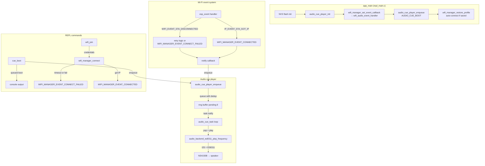

# Wi-Fi Audio Cues Lab

A small ESP-IDF sample project for the M5Stack AtomS3R-CAM AI Chatbot kit wired to an Atomic Echo Base. It provides a console REPL to configure Wi-Fi station connectivity and plays short audio cues on boot and Wi-Fi connection outcomes. The project acts as a reference implementation for future audio-enabled ESP projects on this hardware combination.

> [!summary]
> This project has two distinct concerns running on the same ESP32-S3 firmware:
> 1. a REPL-wrapped Wi-Fi station manager with explicit NVS persistence and event callbacks
> 2. a queued audio cue player driven by data-driven note tables and a vendored ES8311 backend
> Both are wired so that Wi-Fi connection outcomes trigger the corresponding audio cue automatically.

## Why this project exists

The project grew out of a series of ESP-IDF bring-up exercises. The goal was to validate three things simultaneously:

- that a helper-based REPL pattern works cleanly for Wi-Fi configuration on ESP32-S3
- that the AtomS3R-CAM + Atomic Echo Base audio path is fully operational (ES8311 codec, PI4IOE5V6408 expander, I2S framing)
- that audio cues can be wired to application events without tight coupling between the event source and the playback logic

The project is designed to be copied into future ESP audio projects as a starting point, not as a finished product.

## Current project status

Core implementation is complete and the project builds cleanly under ESP-IDF v5.1. The audio path has been validated on hardware and the board-level routing is confirmed to match the correct `AtomS3R-CAM + Atomic Echo Base` pin map.

What already works:

- Wi-Fi scan, join, disconnect, status, and persistence commands from the REPL
- NVS-based profile save/load/clear with an explicit auto-connect flag
- Boot auto-connect using the saved profile
- Audio backend with I2C, I2S, expander unmute, and ES8311 bring-up
- Queued cue playback with pending-only deduplication
- Boot, Wi-Fi success, and Wi-Fi failure cues wired to the Wi-Fi manager's event callbacks
- Manual REPL commands for all cues and a direct tone command for hardware validation

What still needs on-device confirmation:

- queued back-to-back cue behavior (same task plays all queued cues correctly)
- failure cue behavior for real Wi-Fi join failures (beyond manual trigger)
- final gain and note table tuning so all three cues are unambiguously distinct

## Project shape

```
wifi_audio_cues_lab/
├── main/
│   ├── repl_main.c          # NVS init, audio init, boot cue, event wiring, REPL startup
│   ├── wifi_manager.c       # Wi-Fi init, scan/join/disconnect, NVS persistence, event callbacks
│   ├── cmd_wifi_lab.c       # REPL commands: wifi_scan, wifi_join, wifi_status, wifi_save, etc.
│   ├── audio_cue_player.c   # Cue definitions, queue, deduplication, playback task
│   ├── audio_cue_player.h   # audio_cue_id_t enum, public API
│   ├── audio_backend_es8311.c  # I2C, I2S, expander, codec, sine wave generator
│   ├── audio_notes.h        # Note frequency constants and step struct
│   ├── vendor_es8311.c      # Minimal vendored ES8311 bring-up
│   ├── cmd_audio_cues.c     # REPL commands: cue_boot, cue_success, cue_failure, audio_diag, tone
│   └── CMakeLists.txt
├── CMakeLists.txt
├── sdkconfig.defaults       # Target ESP32-S3, 2MB flash, USB Serial/JTAG console
├── PLAYBOOK.md              # Hardware bring-up order, audio debug workflow, command reference
└── README.md
```

## Architecture



## Implementation details

### Wi-Fi manager (`wifi_manager.c`)

The Wi-Fi manager is a stateful singleton that wraps the ESP-IDF Wi-Fi stack. It owns the station netif, the event group, and the NVS namespace `wifi_repl`.

The core state machine lives in `wifi_event_handler`. On `WIFI_EVENT_STA_DISCONNECTED` it increments a retry counter and calls `esp_wifi_connect()` up to `WIFI_MANAGER_CONNECT_RETRIES` (3) times before posting `WIFI_MANAGER_FAILED_BIT` and invoking the failure callback. On `IP_EVENT_STA_GOT_IP` it posts `WIFI_MANAGER_CONNECTED_BIT` and invokes the success callback. The `wifi_manager_connect()` function is a blocking call that waits on the event group with a caller-supplied timeout.

```c
// Pseudocode for the event-driven connection flow
connect() {
    set credentials on wifi_config.sta
    connect_in_progress = true
    retry_count = 0
    clear event bits

    esp_wifi_set_config(WIFI_IF_STA, &wifi_config)
    esp_wifi_connect()

    bits = xEventGroupWaitBits(
        event_group,
        CONNECTED_BIT | FAILED_BIT,
        pdFALSE, pdFALSE,
        pdMS_TO_TICKS(timeout_ms))

    connect_in_progress = false

    if bits & CONNECTED_BIT → return ESP_OK
    if bits & FAILED_BIT    → return ESP_FAIL
    else                    → return ESP_ERR_TIMEOUT
}
```

Persistence is stored in NVS under the `wifi_repl` namespace with keys `version`, `ssid`, `password`, and `auto_conn`. The profile version field allows future schema migrations. `wifi_manager_restore_profile()` loads the profile and, if `auto_connect` is set, immediately calls `wifi_manager_connect()` with the timeout.

### Audio cue player (`audio_cue_player.c`)

The cue player owns a ring buffer of 8 pending cue IDs, a mutex, and a FreeRTOS task. The playback task waits on a task notification, then drains the queue in order.

```c
// Ring buffer enqueue with deduplication
esp_err_t audio_cue_player_enqueue(audio_cue_id_t cue_id) {
    if (pending_contains(cue_id)) {
        return ESP_OK;  // dedup: do not queue a second copy of a cue already pending
    }
    if (count >= QUEUE_CAPACITY) {
        return ESP_ERR_NO_MEM;
    }
    pending[tail] = cue_id;
    count++;
    xTaskNotifyGive(task_handle);  // wake up the playback task
}
```

Cue definitions are data-driven tables of `(frequency_hz, duration_ms)` step pairs. This makes it easy to retune timing and contour without changing any playback logic.

```c
// Example: Wi-Fi success cue
static const audio_note_step_t s_wifi_success_steps[] = {
    { AUDIO_NOTE_C4_HZ, 150 },   // C4 150ms
    { AUDIO_NOTE_REST_HZ, 15 },  // 15ms silence
    { AUDIO_NOTE_E4_HZ, 150 },   // E4 150ms
    { AUDIO_NOTE_REST_HZ, 15 },  // 15ms silence
    { AUDIO_NOTE_G4_HZ, 170 },   // G4 170ms (arpeggio, ~485ms total)
};
```

The deduplication strategy is *pending-only*: if a cue is already playing, a new enqueue of the same cue will still queue it. This ensures you never lose a cue, but you also don't stack 10 copies of the same beep. A `0.0f` frequency is treated as a rest step, generating silence for the given duration.

### Audio backend (`audio_backend_es8311.c`)

The backend owns three hardware subsystems:

1. **I2C** on `I2C_NUM_0` — used to talk to the ES8311 codec (address `VENDOR_ES8311_ADDRESS_0`) and the `PI4IOE5V6408` I/O expander (address `0x43`)
2. **I2S** on `I2S_NUM_0` — Philips stereo slot, 32-bit wide, master mode, BCLK/WS/DOUT/DIN on the Echo Base pin map
3. **Expander** — the Echo Base uses a PI4IOE5V6408 to gate the output path. The bring-up sequence sets push-pull mode, enables pull-ups, sets direction to output, and drives `0xFF` to unmute.

Tone generation is a simple sine wave with a fast attack/release envelope (4ms each) to avoid clicks:

```c
// Per-frame tone generation with envelope
float envelope = 1.0f;
uint32_t ramp_frames = SAMPLE_RATE_HZ * ATTACK_RELEASE_MS / 1000;
if (frame_index < ramp_frames) {
    envelope = (float)frame_index / (float)ramp_frames;  // attack
}
if (frame_index + ramp_frames > total_frames) {
    uint32_t release_index = total_frames - frame_index;
    envelope = (float)release_index / (float)ramp_frames;  // release
}
float sample = sinf(phase) * AMPLITUDE * envelope;
```

Samples are written as stereo interleaved 32-bit PCM, where the upper 16 bits of each channel hold the signed 16-bit sample. The I2S slot is configured for 32-bit width so the top 16 bits are used.

### Event wiring (`repl_main.c`)

The event handler is a small adapter function that maps `wifi_manager_event_t` values to `audio_cue_id_t` values and calls `audio_cue_player_enqueue()`:

```c
static void wifi_audio_event_handler(wifi_manager_event_t event, void *context) {
    (void)context;
    audio_cue_id_t cue_id = AUDIO_CUE_WIFI_FAILURE;
    if (event == WIFI_MANAGER_EVENT_CONNECTED) {
        cue_id = AUDIO_CUE_WIFI_SUCCESS;
    }
    audio_cue_player_enqueue(cue_id);
}
```

This keeps the Wi-Fi manager decoupled from the audio system — it just calls a callback. The callback happens in the Wi-Fi event loop context, so it is safe to call into the cue player from there.

### Bring-up lessons (from PLAYBOOK.md)

The audio path has three distinct validation stages: codec/expander reachability, direct tone playback, and event-driven cues. Trying to debug all three at once causes confusion. The recommended bring-up order is: REPL first, then `sdkconfig` validation, then I2C probe, then `tone`, then queued cues, then manual REPL cue commands, and only then wire to application events.

The most common trap is a silent cue while `tone` works — this is almost always a gain or note table problem, not a transport problem. Cue identity is determined by rhythm and contour, not volume.

## Current user-facing commands

All commands are available from the REPL prompt `wifi_audio>`.

**Wi-Fi commands:**

| Command | Description |
|---|---|
| `wifi_scan` | Scan visible access points |
| `wifi_join <ssid> [pass]` | Set credentials and connect as a station |
| `wifi_status` | Print current Wi-Fi state |
| `wifi_disconnect` | Disconnect the station |
| `wifi_save` | Write current profile to NVS |
| `wifi_load` | Load saved profile from NVS without connecting |
| `wifi_clear` | Remove saved profile from NVS |
| `wifi_autoconnect <on\|off>` | Set boot auto-connect preference |

**Audio commands:**

| Command | Description |
|---|---|
| `cue_boot` | Queue the boot cue manually |
| `cue_success` | Queue the Wi-Fi success cue manually |
| `cue_failure` | Queue the Wi-Fi failure cue manually |
| `audio_diag` | Print backend state and key codec/expander registers |
| `tone [hz] [ms]` | Play a direct test tone through the speaker path |
| `help` | Show all registered commands |

**Build and flash workflow:**

```bash
cd /home/manuel/code/others/kball/esp-projects/wifi_audio_cues_lab
source ../../esp-idf/export.sh
idf.py reconfigure
idf.py build
idf.py -p /dev/cu.usbmodem2101 flash monitor
```

## Current cue definitions

| Cue            | Notes                                             | Total duration |
| -------------- | ------------------------------------------------- | -------------- |
| `boot`         | A4 sustained                                      | ~500ms         |
| `wifi_success` | C4 → E4 → G4 arpeggio with short rests            | ~485ms         |
| `wifi_failure` | G4 × 2 short beeps, then G4 → Eb4 → C4 descending | ~490ms         |

All cues use the same note frequency constants defined in `audio_notes.h`. Rest steps use `AUDIO_NOTE_REST_HZ (0.0f)`.

## Important project docs

- `/home/manuel/code/others/kball/esp-projects/wifi_audio_cues_lab/PLAYBOOK.md` — hardware bring-up order, audio debug workflow, command reference, validation checklist
- `/home/manuel/code/others/kball/esp-projects/wifi_audio_cues_lab/README.md` — project goals, status, remaining validation

## Open questions

- How should the queued back-to-back cue behavior be stress-tested on the device? (e.g., rapid repeated `cue_boot` calls while a cue is playing)
- Should the project add indefinite background reconnect behavior, or keep connection attempts explicit?
- Is there a use case for additional cue types beyond the three current ones?

## Near-term next steps

- validate the queued back-to-back cue behavior on real hardware
- confirm the failure cue fires on a real incorrect-credential Wi-Fi join attempt
- finalize cue gain and note table tuning so all three cues are unambiguously distinct
- move the ES8311 vendor code into a proper component structure for reuse

## Project working rule

> [!important]
> The audio debug sequence is always: confirm backend state → prove direct tone → then diagnose cues. Never try to debug event-driven cues while the tone command is still silent.