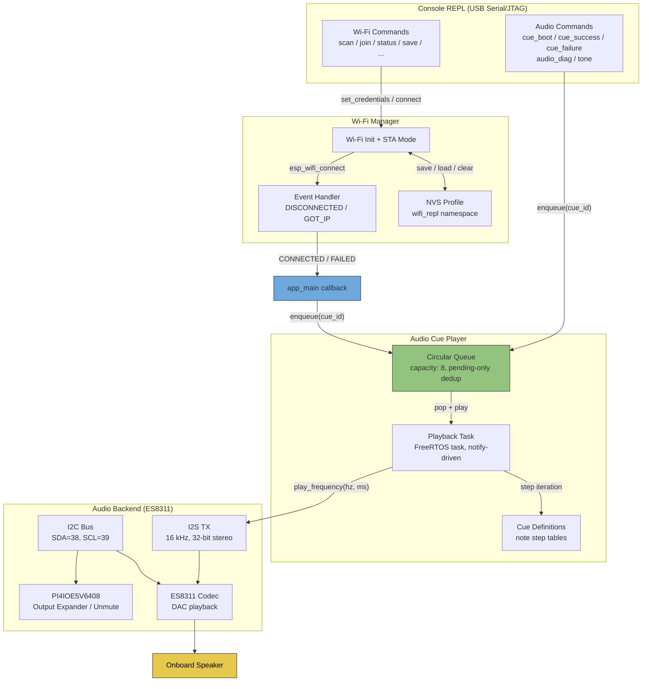

# Wi-Fi Audio Cues Lab

Wi-Fi Audio Cues Lab is an ESP-IDF firmware project for the M5Stack AtomS3R-CAM AI Chatbot kit (ESP32-S3) that combines a USB Serial/JTAG console REPL for Wi-Fi station management with short, data-driven audio cues played through the onboard speaker. The firmware gives audible feedback for boot, successful Wi-Fi connection, and failed connection attempts, while exposing a full set of REPL commands for Wi-Fi scanning, joining, persistence, and manual cue testing.

> [!summary]
> The project has two important identities:
> 1. a console-driven Wi-Fi station manager for an ESP32-S3 board, with NVS-backed profile persistence and boot auto-connect
> 2. a data-driven audio cue system that maps device lifecycle events to distinguishable tone sequences on the ES8311 codec speaker path

## Why this project exists

This is a Kevin Ball embedded lab project inside a parent `esp-projects` repo that iteratively explored three concerns in order:

1. getting a USB Serial/JTAG REPL working on ESP-IDF v5.1 (the `console_repl_lab` and `hello_world` phases)
2. building a namespaced Wi-Fi station manager with NVS persistence and REPL commands (the `wifi_repl_lab` phase)
3. adding speaker-path audio feedback for boot and Wi-Fi outcomes on the AtomS3R-CAM + Atomic Echo Base hardware (the `wifi_audio_cues_lab` phase)

The audio cue layer is the most recent and most hardware-specific addition. The hardware kit includes an ES8311 codec and a PI4IOE5V6408 I/O expander that gates the speaker output mute state. Getting the audio path working required identifying the correct pin map for the combined AtomS3R-CAM + Atomic Echo Base assembly — the standalone Atom EchoS3R board uses different pins, and the wrong map makes the codec look dead even though the project builds cleanly.

The project uses a vendored, minimal ES8311 bring-up adapted from Espressif's `esp-bsp` component, stripped down to only what the 16 kHz playback path needs. This avoids pulling in a full BSP dependency for a project that only plays short tone sequences.

## Current project status

The project builds and flashes successfully on ESP-IDF v5.1. The audio backend has been validated on the correct hardware pin map.

What already exists:

- full Wi-Fi station REPL: scan, join, disconnect, status, save/load/clear profile, auto-connect
- NVS-backed Wi-Fi profile persistence in the `wifi_repl` namespace
- vendored ES8311 codec bring-up for the Atom EchoS3R speaker path
- I/O expander (PI4IOE5V6408) output unmute sequence
- queued cue playback with pending-only deduplication
- three cues wired to events: boot, Wi-Fi success, Wi-Fi failure
- manual REPL cue commands (`cue_boot`, `cue_success`, `cue_failure`)
- diagnostic commands (`audio_diag`, `tone`) for hardware bring-up
- cue retuning based on live device feedback

What still needs on-device validation:

- queued back-to-back cue behavior (different cues played sequentially)
- failure cue behavior for real Wi-Fi join failures
- speaker output audibility confirmation on the current hardware

## Project shape

The project is a single ESP-IDF component with a flat source layout under `main/`. There are no external component dependencies beyond the ESP-IDF SDK itself.

```text
wifi_audio_cues_lab/
├── CMakeLists.txt              # project(wifi_audio_cues_lab)
├── sdkconfig.defaults          # ESP32-S3, 2MB flash, USB Serial/JTAG console
├── PLAYBOOK.md                 # bring-up workflow and debug runbook
├── README.md                   # project overview and command reference
└── main/
    ├── CMakeLists.txt          # component registration, REQUIRES list
    ├── repl_main.c             # app_main: NVS init, audio init, boot cue, REPL
    ├── wifi_manager.{c,h}      # Wi-Fi init, scan, join, disconnect, NVS persistence
    ├── cmd_wifi_lab.{c,h}      # REPL Wi-Fi command registration
    ├── audio_cue_player.{c,h}  # data-driven cue definitions, queue, playback task
    ├── audio_backend_es8311.{c,h}  # I2C, I2S, expander unmute, sample generation
    ├── audio_notes.h           # frequency constants (C4, E4, G4, A4, Eb4, REST)
    ├── vendor_es8311.{c,h}     # minimal vendored ES8311 codec driver
    └── cmd_audio_cues.{c,h}    # REPL audio/diagnostic command registration
```

The ticket workspace is at:

- `/home/manuel/code/others/kball/esp-projects/ttmp/2026/03/22/WIFI-AUDIO-CUES-SPIKE--investigate-boot-and-wi-fi-status-audio-cues/`

## Architecture

The system has four layers that communicate in one direction: REPL commands drive the Wi-Fi manager, the Wi-Fi manager fires events back to the main app, and the main app enqueues cues into the audio player. The audio player owns its own FreeRTOS task and pulls cues from a circular buffer.



Key data flow for the Wi-Fi audio feedback path:

1. User runs `wifi_join MyNetwork pass` on the REPL
2. `cmd_wifi_lab.c` calls `wifi_manager_set_credentials()` then `wifi_manager_connect()`
3. `wifi_manager.c` calls `esp_wifi_connect()` and blocks on an `EventGroup` with a timeout
4. On `GOT_IP`: the Wi-Fi event handler fires `WIFI_MANAGER_EVENT_CONNECTED`
5. `repl_main.c` callback receives the event and calls `audio_cue_player_enqueue(AUDIO_CUE_WIFI_SUCCESS)`
6. The cue player task wakes from `ulTaskNotifyTake`, pops the cue, iterates the note step table, and calls `audio_backend_es8311_play_frequency()` for each step
7. The backend generates a sine wave at the given frequency with a short attack/release envelope and writes PCM samples to the I2S TX channel

## Implementation details

### Wi-Fi station management

The Wi-Fi manager (`wifi_manager.c`) wraps ESP-IDF's `esp_wifi` station API behind a stateful interface that tracks initialization, credentials, connection state, retry count, and NVS persistence. The module uses a `FreeRTOS EventGroup` with two bits — `CONNECTED_BIT` and `FAILED_BIT` — to make the synchronous `wifi_manager_connect()` call block until the join outcome is known or the timeout expires.

Connection retries are bounded at 3 attempts. The manager does not run background reconnect logic — after a failed join, the user must explicitly retry. This keeps the Wi-Fi lifecycle simple and predictable for a REPL-driven workflow.

Profile persistence stores SSID, password, auto-connect flag, and a version byte in NVS under the `wifi_repl` namespace. The `wifi_manager_restore_profile()` function loads a saved profile and optionally auto-connects with a configurable timeout, which the main app calls at boot with a 10-second window.

The event callback mechanism is a single registered `(event, context)` function pointer. The main app registers `wifi_audio_event_handler`, which maps `WIFI_MANAGER_EVENT_CONNECTED` → `AUDIO_CUE_WIFI_SUCCESS` and `WIFI_MANAGER_EVENT_CONNECT_FAILED` → `AUDIO_CUE_WIFI_FAILURE`, then enqueues the appropriate cue.

### Audio backend and ES8311 codec

The audio backend (`audio_backend_es8311.c`) handles three distinct hardware concerns:

1. **I2C bus setup** — configures I2C port 0 in master mode on GPIO 38 (SDA) and GPIO 39 (SCL) at 100 kHz
2. **Output expander unmute** — writes to the PI4IOE5V6408 I/O expander at address `0x43` to configure pin directions, pull-ups, and output state so the speaker path is unmuted. This is a prerequisite for any audio output — without it, the codec can be fully initialized but the speaker stays silent
3. **I2S TX channel** — creates a standard I2S channel on port 0 in master mode, 16 kHz sample rate, 32-bit stereo Philips framing, with BCLK on GPIO 8, WS on GPIO 6, DOUT on GPIO 5

The vendored ES8311 driver (`vendor_es8311.c`) is a minimal adaptation from Espressif's `esp-bsp` component. It handles the codec's clock tree configuration (sourcing from BCLK since the Atomic Echo Base does not route a dedicated MCLK), serial port setup, DAC/ADC gain, and mute control. The driver is hardcoded for 16 kHz playback only — the `configure_clock_tree()` function rejects any other sample rate.

### Tone generation

The `audio_backend_es8311_play_frequency()` function generates a sine wave in software using a phase accumulator pattern:

```c
phase += (2.0f * PI * frequency_hz) / sample_rate_hz;
sample = sinf(phase) * amplitude * envelope;
pcm = ((int32_t)sample) << 16;  // scale to 32-bit stereo frame
```

A frequency of 0 Hz is treated as silence (rest). Each tone has a 4 ms attack and release envelope to avoid clicks at note boundaries. Samples are written in 128-frame stereo chunks through the I2S TX channel with `portMAX_DELAY` blocking.

### Cue player queue and deduplication

The cue player (`audio_cue_player.c`) maintains a circular buffer of capacity 8. Enqueue logic checks whether the same `audio_cue_id_t` is already pending — if so, the duplicate is silently dropped. This prevents, for example, rapid boot events from queueing multiple boot cues.

The playback task blocks on `ulTaskNotifyTake`. When notified, it enters an inner loop that pops cues one at a time under mutex protection, plays each cue's full note sequence, and exits when the queue is empty. The currently playing cue is never interrupted by a new enqueue.

### Cue definitions

Cues are defined as static arrays of `audio_note_step_t` structs, each pairing a frequency in Hz with a duration in ms:

| Cue | Sequence | Total Duration |
|-----|----------|----------------|
| boot | A4 (500 ms) | ~500 ms |
| wifi_success | C4 (150 ms) → rest (15 ms) → E4 (150 ms) → rest (15 ms) → G4 (170 ms) | ~500 ms |
| wifi_failure | G4 (70 ms) → rest (30 ms) → G4 (70 ms) → rest (30 ms) → G4 (90 ms) → rest (10 ms) → Eb4 (90 ms) → rest (10 ms) → C4 (100 ms) | ~410 ms |

The success cue is an ascending C major triad (C-E-G). The failure cue uses a distinctive double-beep opening followed by a descending minor contour (G-Eb-C). This rhythmic and melodic contrast makes the two Wi-Fi outcomes easy to distinguish by ear.

Note frequencies are defined as float constants in `audio_notes.h`:

```c
#define AUDIO_NOTE_C4_HZ  261.63f
#define AUDIO_NOTE_EB4_HZ 311.13f
#define AUDIO_NOTE_E4_HZ  329.63f
#define AUDIO_NOTE_G4_HZ  392.00f
#define AUDIO_NOTE_A4_HZ  440.00f
#define AUDIO_NOTE_REST_HZ 0.0f
```

### Build configuration

The project targets `ESP32-S3` with a 2 MB flash size, using USB Serial/JTAG as the sole console transport (no UART). This is configured in `sdkconfig.defaults`:

```
CONFIG_IDF_TARGET="esp32s3"
CONFIG_ESPTOOLPY_FLASHSIZE_2MB=y
CONFIG_ESP_CONSOLE_USB_SERIAL_JTAG=y
CONFIG_ESP_CONSOLE_SECONDARY_NONE=y
```

A notable ESP-IDF pitfall captured in the playbook: `sdkconfig.defaults` only seeds the generated `sdkconfig`. Changing the defaults file does not override an existing conflicting `sdkconfig`. To force regeneration, the workflow is:

```bash
mv sdkconfig sdkconfig.bak
idf.py reconfigure
```

## Current user-facing commands

The REPL prompt is `wifi_audio>`. All commands are registered through ESP-IDF's `esp_console` framework.

### Wi-Fi commands

| Command | Purpose |
|---------|---------|
| `wifi_scan` | Scan visible access points |
| `wifi_join <ssid> [pass]` | Set credentials and connect as station |
| `wifi_status` | Print current Wi-Fi manager state |
| `wifi_disconnect` | Disconnect the station session |
| `wifi_save` | Write current profile to NVS |
| `wifi_load` | Load saved profile from NVS |
| `wifi_clear` | Remove saved profile from NVS |
| `wifi_autoconnect <on\|off>` | Set boot auto-connect preference |

### Audio commands

| Command | Purpose |
|---------|---------|
| `cue_boot` | Queue the boot cue |
| `cue_success` | Queue the Wi-Fi success cue |
| `cue_failure` | Queue the Wi-Fi failure cue |
| `audio_diag` | Print backend state and codec/expander registers |
| `tone [hz] [ms]` | Play a direct test tone (default 440 Hz, 2000 ms) |

### Recommended bring-up sequence

The playbook recommends this validation order:

1. `help` — confirm REPL is responsive
2. `audio_diag` — verify codec/expander reachable
3. `tone` — confirm audible output
4. `cue_boot` / `cue_success` / `cue_failure` — verify cue definitions
5. `wifi_scan` → `wifi_join` → verify success cue
6. `wifi_join WrongNetwork badpass` → verify failure cue

## Hardware context

The target hardware is the M5Stack AtomS3R-CAM AI Chatbot kit, which combines an AtomS3R-CAM (ESP32-S3) with an Atomic Echo Base that provides:

- ES8311 audio codec (I2C address `0x18`)
- PI4IOE5V6408 I/O expander (I2C address `0x43`)
- NS4150B amplifier
- Onboard speaker

Pin map for the combined assembly:

| Function | GPIO |
|----------|------|
| I2C SDA | 38 |
| I2C SCL | 39 |
| I2S DOUT | 5 |
| I2S WS | 6 |
| I2S BCLK | 8 |
| I2S DIN | 7 |

The primary console transport is USB Serial/JTAG (typically `/dev/cu.usbmodem2101` on macOS).

## Important project docs

These are repo-local:

- `/home/manuel/code/others/kball/esp-projects/wifi_audio_cues_lab/README.md` — project overview and command reference
- `/home/manuel/code/others/kball/esp-projects/wifi_audio_cues_lab/PLAYBOOK.md` — detailed bring-up workflow and audio debug runbook
- `/home/manuel/code/others/kball/esp-projects/ttmp/2026/03/22/WIFI-AUDIO-CUES-SPIKE--investigate-boot-and-wi-fi-status-audio-cues/` — ticket workspace with design doc and diary

Sibling lab projects in the same repo:

- `/home/manuel/code/others/kball/esp-projects/console_repl_lab/` — ESP console REPL baseline
- `/home/manuel/code/others/kball/esp-projects/wifi_repl_lab/` — Wi-Fi REPL without audio
- `/home/manuel/code/others/kball/esp-projects/hello_world/` — initial ESP-IDF hello world

## Open questions

- Is the vendored ES8311 driver sufficient long-term, or should it be replaced with the full `esp-bsp` component if more audio features are needed?
- Should Wi-Fi credentials be encrypted at rest in NVS rather than stored as plaintext?
- Should the join command auto-save credentials on successful connection?
- How should the system behave if Wi-Fi drops after a successful boot connect — should it attempt background reconnect?
- Are the current cue durations and contours final, or do they need further retuning based on real-world use?

## Near-term next steps

- validate queued back-to-back cue behavior on the device
- validate failure cue on real Wi-Fi join failures
- confirm speaker audibility with the current gain settings on the production hardware
- consider adding more cues (e.g., low battery, OTA update status) if the project scope expands
- consider extracting the Wi-Fi manager and audio cue player into reusable ESP-IDF components if other projects in the repo need them

## Project working rule

> [!important]
> Bring-up must follow the validated sequence: console first, then codec reachability, then direct tone, then queued cues, then event-driven cues.
> Never debug hardware routing, tone generation, queueing, and event semantics at the same time.
> Use `tone` to prove the audio path before investigating cue-level issues.
