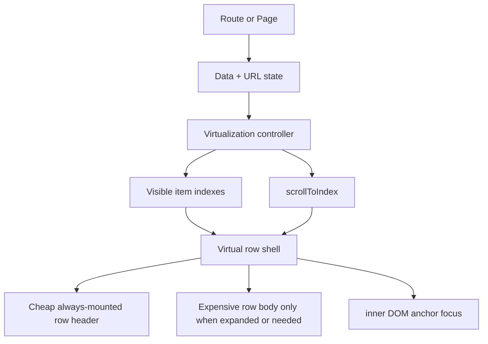
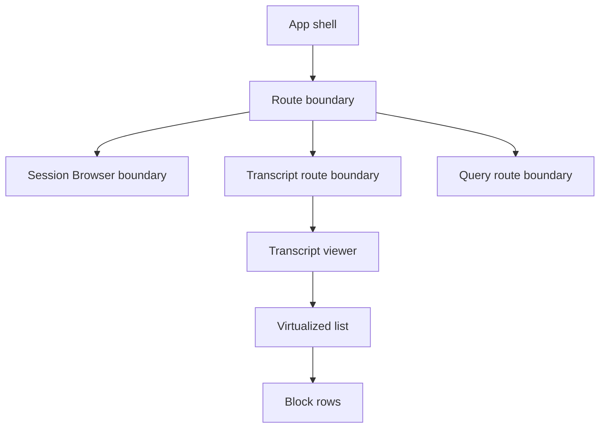

# React Virtualization - Patterns, Failure Modes, and Error Boundaries

This note is a durable engineering knowledge entry about virtualization in React: when to use it, how it changes state ownership and rendering structure, what kinds of bugs it tends to create, and what safety patterns should be used to keep a virtualized UI maintainable. The concrete reference project is `go-minitrace`, especially the transcript viewer and Session Browser, but the patterns here are intentionally more general than that one codebase.

If you are a new intern joining the project, read this note before you modify any large list, timeline, transcript, console, table, feed, log viewer, or inspector UI. Virtualization is one of those techniques that looks like a simple performance trick from a distance and turns into a small UI architecture discipline once you actually build it.

> [!summary]
> The short version is:
> 1. virtualization is not “just render fewer rows”; it changes the lifecycle of your UI and therefore changes where state is allowed to live
> 2. the most common failures are measurement loops, scroll/focus feedback loops, stale assumptions about mounted DOM, and local state getting lost when rows unmount
> 3. error boundaries do not fix virtualization bugs, but they are important containment around high-risk subtrees such as transcript viewers, dynamic tables, and inspection surfaces

## Why this note exists

The `go-minitrace` web UI hit the standard progression that many serious React UIs hit.

At first, the problem looked simple:

- the transcript route was slow
- too many blocks were rendered
- too many turns and tool calls stayed mounted
- tab switches felt heavy

The first fixes were also standard and correct:

- keep expensive panes mounted if remounting is the problem
- unmount collapsed subtrees if hidden content stays mounted
- memoize expensive leaf components
- split cheap headers from expensive bodies

But once the UI moved from “large mounted tree” problems into **virtualized rendering**, the failure modes changed. The question stopped being only “how many nodes are mounted?” and became:

- where is expansion state allowed to live?
- how do we focus a target inside a row that may not currently exist in the DOM?
- when is it safe to measure row height?
- how do scroll, focus, ResizeObserver, and state updates avoid feeding each other?
- how do we keep one broken viewer from crashing the whole application?

That is why this note exists. It is not a transcript-specific note. It is a note about the *class of frontend engineering problem* that transcript-style UIs fall into.

## When to use virtualization

Virtualization is appropriate when a route or component renders a list where:

- the number of items can become large enough to affect responsiveness
- only a small window is visible at a time
- offscreen rows do not need to stay mounted for correctness
- row rendering cost is meaningfully higher than a trivial `<li>`

Typical examples:

- transcript viewers
- chat histories
- trace explorers
- activity logs
- monitoring tables
- file browsers with deep metadata rows
- notebook/document outlines

Do **not** reach for virtualization immediately when the actual problem is simpler.

Sometimes the real fix is:

- unmount collapsed content
- avoid remounting whole panes
- reduce DOM inside expanded rows
- move sorting or formatting out of hot rerender paths
- paginate server-side

Virtualization is powerful, but it introduces structural complexity. Use it when you actually need windowed rendering, not as the first response to every slow list.

## The core mental model

The first thing a new engineer must understand is this:

**A virtualized list is not a normal list that happens to be faster.**

It is a list where only some rows exist in the DOM at any given time. That means you lose several assumptions that are naturally true in a non-virtualized tree.

In a normal list you can often assume:

- every row exists in the DOM after render
- a row-local `useState` survives while the route is open
- `document.querySelector(...)` can find any target row
- measuring a row is just a small implementation detail

In a virtualized list, none of those assumptions are safely true by default.

The better mental model is:

- the parent owns the scroll window
- the parent decides which rows are mounted
- a row may appear, disappear, and reappear many times during normal use
- row measurement is part of layout orchestration, not just presentation
- focus and navigation must often happen in two phases:
  1. scroll the list so the containing row exists
  2. then focus or scroll the inner target

## The three layers of virtualization work

In practice, a virtualized React surface usually has three layers.

### 1. The data layer

This is the list of logical items.

Examples:

- transcript blocks
- sessions
- query result rows
- events

This layer answers:

- how many items exist?
- what order are they in?
- which item contains a focused target?

### 2. The windowing layer

This calculates which subset of items should currently be mounted.

It tracks things like:

- scroll position
- viewport height
- estimated heights
- measured heights
- overscan
- total scrollable size

This is the part that computes:

- visible range
- spacer heights
- scroll-to-index logic

### 3. The row subtree layer
n
This is the actual React subtree for each visible item.

Examples:

- `BlockCard`
- transcript row body
- session table row

This is the layer most developers want to focus on because it is visually concrete. But the hardest bugs usually happen in the seam between the windowing layer and the row subtree layer.

## A good architectural pattern

A healthy virtualized surface usually follows this structure:



This structure is helpful because it makes explicit which state belongs where.

### Rule of thumb

- **parent/page owns virtualization state**
- **parent/page owns focus target and scroll coordination**
- **row owns only disposable presentation state**

That rule is easy to remember and prevents many bugs.

## What must move upward once you virtualize

The most common mistake is virtualizing a list while still letting critical state live inside rows.

That is usually wrong.

Once rows may unmount and remount, any state that matters across time must move upward.

Examples of state that often must become parent-owned:

- which row is expanded
- which block is force-expanded because of deep-link focus
- selected annotation ID
- active scroll/focus target
- “show all tool calls” if it must survive remounts
- active composer target if it is tied to routing or deep linking

Examples of state that may remain row-local:

- pure hover state
- purely cosmetic tooltip open/close state
- transient local affordances that are fine to reset

The key question is:

> If this row unmounts because it scrolled out of view, would the user expect this state to survive?

If the answer is yes, the state probably does not belong in the row.

## Dynamic height virtualization is the dangerous version

Not all virtualization is equally hard.

### Easy case

All rows have basically the same fixed height.

Then the list can do simple arithmetic:

- row 0 starts at 0
- row 1 starts at 48
- row 2 starts at 96
- and so on

### Hard case

Rows can change height dynamically.

That happens when rows contain:

- collapsible bodies
- images
- long prose
- tool outputs
- code blocks
- badges that wrap
- detail panels
- async-loaded content

That is the case transcript viewers often fall into. A collapsed block may be 80px tall and an expanded block may be 1200px tall. Once that is true, the list either needs:

- good measurement,
- good estimation,
- or a library that already solves this class of problem well.

Dynamic height virtualization is where measurement loops and scroll/focus loops become much more likely.

## Standard bug families in virtualized React UIs

This is the most important part of the note.

These bugs are not weird. They are the normal ways virtualized UIs go wrong.

## 1. Measurement update loops

This is the bug family we recently hit in `go-minitrace`.

The rough shape is:

1. render virtual rows
2. attach a ref to a row
3. measure row height
4. call `setState` with measured height
5. render again
6. ref callback runs again
7. repeat until React reports `Maximum update depth exceeded`

The dangerous pattern is especially this one:

```tsx
ref={measureElement(index)}
```

when `measureElement(index)` creates a *new callback* every render and that callback does a synchronous state update.

Why this is dangerous:

- React sees a different ref function identity every render
- old ref detaches, new ref attaches
- the ref callback runs again on every commit
- if the callback writes state, you are very close to a feedback loop

### Working rule

Do not casually do synchronous `setState` from callback refs in a virtualized list.

If measurement is needed:

- prefer a stable ref callback per item
- prefer `ResizeObserver` or effect-driven reconciliation
- avoid writing state during the ref attach path unless you are extremely certain the callback identity is stable and the update is guarded

## 2. Scroll/focus feedback loops

Another common bug family:

- route or app state says “focus item X”
- effect calls `scrollToIndex(X)`
- scroll changes visible range
- visible range mounts/remounts rows
- a second effect sees the newly mounted target and calls `scrollIntoView`
- layout changes again
- more measurement happens
- focus state updates again

This is not always an infinite loop, but it can easily become a jittery or unstable UI.

### Working rule

Split focus behavior into two explicit phases:

1. **ensure containing row exists**
2. **then focus/scroll inner target**

Do not treat “focus a tool call inside a virtualized transcript” as a single operation.

## 3. Lost row-local state after unmount

A frequent surprise for newer engineers is:

> “Why did the row forget it was expanded?”

Answer:

- because the row was unmounted,
- and its `useState` went away,
- and virtualization makes that a normal event.

This is not a React bug. It is the natural consequence of windowing.

### Working rule

Any state that the user expects to persist across scrolling must live above the row.

## 4. DOM-anchor assumptions break

In non-virtualized code, developers often do things like:

```ts
document.querySelector(`[data-turn-idx="${target}"]`)?.scrollIntoView()
```

That is fine only if the target row is guaranteed to exist in the DOM.

In a virtualized list, it may not.

### Working rule

A deep-link target inside a virtualized row is a two-step lookup:

- first map inner target → parent row index
- then scroll parent row into the mounted window
- only after that look for the inner DOM anchor

## 5. Observer churn and ref churn

If your list repeatedly:

- unobserves a node
- observes the same node again
- tears down and recreates callback refs
- rebuilds measurement bookkeeping every render

you may not get an infinite loop, but you often get unstable performance.

### Working rule

Stabilize:

- ref callbacks
- observer registration
- measurement writes
- item identity

## 6. Virtualization plus collapses plus composers plus URL state

This is the compound bug category.

Individually these are all fine:

- virtualized rows
- collapsible bodies
- URL-backed focus state
- inline composer open state
- scroll-to-target behavior

Together they create a tightly coupled layout machine.

### Working rule

When building one of these surfaces, do not add all features blindly at the row level. Treat the whole thing as a coordinated route-level interaction system.

## Common anti-patterns

### Anti-pattern 1: “I’ll just virtualize the existing component tree”

Usually wrong.

You often need to refactor before virtualization:

- split cheap header from expensive body
- move important state upward
- isolate scrolling responsibilities
- identify item lookup paths

### Anti-pattern 2: “Rows are just components; they can own their own state”

Only true before virtualization or for disposable state.

### Anti-pattern 3: “I can use DOM queries the same way as before”

Only true if you know the target row is mounted.

### Anti-pattern 4: “Error boundaries will fix this”

No.

Error boundaries do not stop feedback loops. They only contain crashes.

## A practical implementation sequence

If you are building a virtualized surface from scratch, the safest order is usually:

1. make the non-virtualized surface correct
2. unmount hidden/collapsed content
3. split cheap header and expensive body
4. move durable state to the parent
5. add virtualization
6. add deep-link focus and scroll restoration carefully
7. add error boundaries around the high-risk subtree

This sequence matters because it reduces the number of moving parts introduced at once.

## Error boundaries: what they are for

Error boundaries are not a performance technique. They are a **failure containment technique**.

A good boundary answers:

- if this subtree throws during render/commit, what is the smallest user-visible area that should fail?

In a large SPA, that is often not “the whole app.”

### Good places for boundaries

#### 1. App-shell / routed-content boundary

Put one around major route content so one broken screen does not kill the entire app.

Typical result:

- nav and shell survive
- user can go back to a safe route
- crash stays visible but contained

#### 2. Transcript viewer boundary

A transcript viewer is a high-risk subtree because it often combines:

- virtualization
- nested collapses
- scroll control
- detail panels
- route state
- annotations or selections

This is an excellent place for a dedicated boundary.

#### 3. Session Browser boundary

Especially once it shares the same virtualization infrastructure.

#### 4. Query results boundary

Optional, but often useful for large inspector/workbench routes.

### Bad places for boundaries

Do not add them:

- around every row
- around every block card
- around every tool-call row
- inside hooks

That creates noise and hides the real failure domain.

## A good error-boundary layout



The idea is:

- one coarse boundary at the route level
- optional focused boundaries for the highest-risk routes
- not one boundary per row

## How this applied in go-minitrace

The `go-minitrace` web UI is a good case study because the transcript route evolved through the normal sequence.

### The original performance problems

- transcript tree too large
- collapsed content stayed mounted
- tab switches remounted heavy content

### The first correct optimizations

- keep transcript pane mounted across tab switches
- add `unmountOnExit` for collapsed content
- split block header/body

### The next structural step

- virtualize transcript blocks
- parent owns more state
- focused target scrolling becomes two-phase

### The regression we hit

- shared virtualization hook
- callback-ref measurement path
- synchronous `setMeasuredHeights` write from the ref callback
- focused tool-call deep link made the layout churn worse
- React reported maximum update depth exceeded

That bug is specific in its code path, but standard in its family.

## What a new intern should do before modifying a virtualized surface

Use this checklist.

### Before changing code

Ask:

- Is the real problem DOM size, remounting, sorting, or data fetching?
- Is virtualization actually necessary here?
- Which state must survive row unmount/remount?
- Which deep-link/focus behaviors depend on DOM anchors?
- Are row heights fixed or dynamic?

### Before storing state inside a row

Ask:

- If the row unmounts because it scrolled offscreen, should this state survive?

If yes, move it up.

### Before measuring DOM

Ask:

- Can this be estimated instead?
- Can measurement happen in a controlled observer/effect path?
- Am I about to call `setState` from a callback ref?

If yes, stop and think.

### Before adding focus-to-target behavior

Ask:

- Can I map the inner target to a parent item index first?
- Do I need a two-phase scroll/focus flow?

### Before shipping

Verify:

- deep links into expanded content
- scroll while rows expand/collapse
- route changes with focus state in URL
- recovery behavior if the subtree throws

## Pseudocode: safer patterns

### Parent-owned expansion state

```tsx
const [expandedItems, setExpandedItems] = useState<Record<string, boolean>>({});

function isExpanded(id: string) {
  return expandedItems[id] ?? false;
}

function toggleExpanded(id: string) {
  setExpandedItems((current) => ({
    ...current,
    [id]: !current[id],
  }));
}
```

### Two-phase focus flow

```tsx
useEffect(() => {
  if (!focusTarget) return;

  const rowIndex = findContainingRowIndex(focusTarget);
  if (rowIndex == null) return;

  scrollToIndex(rowIndex);

  queueMicrotask(() => {
    findInnerAnchor(focusTarget)?.scrollIntoView({ block: "center" });
  });
}, [focusTarget]);
```

### Boundary placement

```tsx
<AppErrorBoundary>
  <Routes>
    <Route path="/sessions" element={<SessionBrowserPage />} />
    <Route
      path="/sessions/:sessionId"
      element={
        <TranscriptRouteBoundary>
          <TranscriptViewerPage />
        </TranscriptRouteBoundary>
      }
    />
  </Routes>
</AppErrorBoundary>
```

## Working rules

If you remember only a few rules, remember these.

1. **Virtualization changes where state is allowed to live.**
2. **Never casually put synchronous measurement-driven state writes in ref attachment paths.**
3. **Deep-link focusing inside a virtualized row is a two-step operation.**
4. **Split cheap row structure from expensive row bodies before you virtualize.**
5. **Error boundaries are containment, not a fix.**

## Related notes

- [[PROJ - go-minitrace - Web UI and Transcript Explorer]]
- [[PROJ - go-minitrace - Annotation System]]

## Practical next-step rule for this codebase

When working on the `go-minitrace` transcript or Session Browser surfaces, use this order:

1. fix correctness of the virtualization hook first
2. then add route-level error boundaries
3. then re-test deep links, focus, composer state, and scroll behavior

That order prevents the team from hiding a lifecycle bug behind a fallback component.
