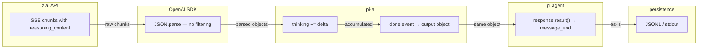
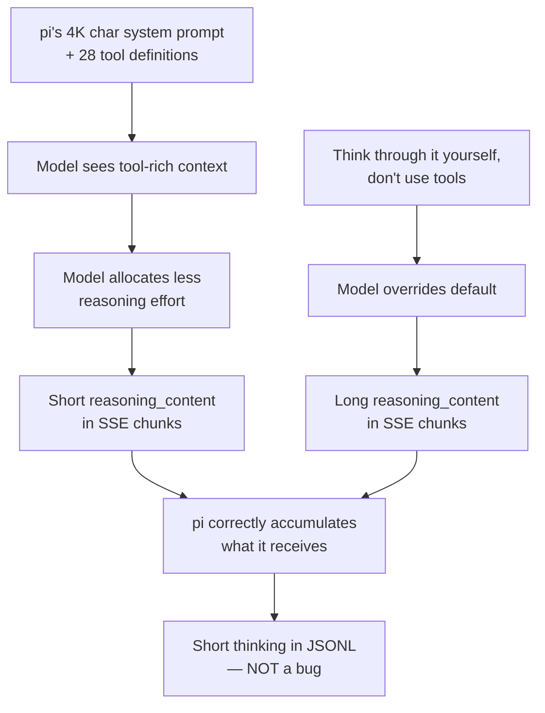

# Investigating LLM Thinking Content in Tool-Rich Coding Agent Contexts

A technical report on investigating apparent "thinking truncation" in LLM coding agent sessions. We traced the complete streaming pipeline through five layers of source code, designed four controlled experiments with 100+ trials total, and discovered that the model's short thinking is legitimate behavior — not a data loss bug. Along the way we found and fixed seven real bugs in the analysis tooling and one critical gap in a protobuf-based API.

> [!summary]
> 1. **Models think less when they have tools and a large system prompt.** The system prompt alone causes a 93% reduction in reasoning content. Tools add very little on top. This is the model adapting its reasoning, not truncation.
> 2. **"Think through it yourself, don't use tools" recovers deep reasoning** even with 28 tools present — the determinant problem went from 375 to 2,846 chars.
> 3. **The OpenAI Node SDK does not strip `reasoning_content`.** It parses SSE JSON with raw `JSON.parse()` and passes everything through. We confirmed this by reading the streaming parser source.
> 4. **Proto schemas are the real API contract.** When a v2 API uses protobuf, adding fields to the Go struct does nothing — the proto schema silently drops unknown fields.

## Why this investigation happened

### The seed observation

While analyzing a 14-hour coding session (reMarkable Paper Pro hacking) with [go-minitrace](https://github.com/mariozechner/go-minitrace), I noticed that `z.ai/glm-5.1` thinking blocks averaged only 21 characters across 339 assistant turns. The session had 596 assistant turns total:

| Model | Turns with thinking | Rate | Avg thinking length |
|-------|-------------------|------|-------------------|
| glm-5.1 (z.ai) | 28/339 | 8% | ~21 chars |
| gpt-5.4 (OpenAI) | 199/257 | 77% | ~370 chars or empty |

77 of the gpt-5.4 thinking blocks were empty — later confirmed as OpenAI's encrypted reasoning feature (the `thinkingSignature` field contains an opaque encrypted blob). But the glm-5.1 data looked genuinely short. The average thinking block from glm-5.1 was a single sentence like "The user is asking a simple question."

### Initial hypothesis

**pi's streaming pipeline was truncating `reasoning_content` from the z.ai API.**

This was plausible because:
1. The OpenAI SDK might strip unknown fields from SSE chunks
2. pi's streaming accumulator might have an off-by-one or reset bug
3. The JSONL serializer might truncate long strings

### The plan

1. Fix the analysis tooling so we can actually see the data
2. Trace pi's streaming pipeline through source code
3. Compare raw API output vs pi output for the same prompt
4. Design controlled experiments to isolate the cause
5. Test all thinking budget levels end-to-end

---

## Phase 1: Fixing the analysis tooling (7 bugs in go-minitrace)

Before investigating the data source, fix the tool you use to look at it. The go-minitrace Pi adapter and web UI had seven rendering bugs obscuring the real data.

### Bug 1: Tool result turns rendered as "user" messages

**Symptom:** File reads, bash output, and other tool responses appeared as "user" messages in the web UI.

**Root cause:** In `pkg/adapters/pi/convert.go`, when a message has `role: "toolResult"`, the converter calls `applyToolResult()` to attach it to the matching tool call (correct) but then *also* creates a new turn with `role="user"` (wrong). The converter was treating tool results as both a tool call attachment and a separate user turn.

**Fix:** Added `continue` after the `applyToolResult()` block for `role=="toolResult"` messages — same pattern used by the existing Claude Code adapter.

**Result:** Turn count dropped from 1,391 to 654. All tool result noise eliminated.

### Bug 2: Tool call summaries showed "read read"

**Symptom:** Collapsed tool call rows showed the tool name repeated (e.g. "read read") instead of the file path.

**Root cause:** `ToolCallRow.tsx` only checked `command` and `arguments.cmd` as summary fields. The `read` tool stores its target in `path`, not `command`.

**Fix:** Added `file_path`, `arguments.query`, and `arguments.path` to the fallback chain.

### Bug 3: Assistant content rendered as plain text

**Symptom:** Markdown headers, code blocks, and bullet lists appeared as raw text.

**Fix:** Added `react-markdown` for assistant turns. User turns kept as plain `<Typography>` with `pre-wrap`.

### Bugs 4–7: Thinking, model, usage, diffs, write content not surfaced

Four related issues where the data existed in the session but wasn't reaching the UI:

| Bug | Data location | Blockage |
|-----|--------------|----------|
| Thinking not shown | `message.thinking` in JSONL | Server `TurnResponse` didn't include `Thinking` field |
| Model not shown | `message.model` in JSONL | Same — `Model` field missing from response |
| Edit diffs not shown | `toolCall.arguments.edits[].oldText/newText` | Frontend didn't render `edits[]` array |
| Write content not shown | `toolCall.arguments.content` | Frontend didn't render `content` field |

**Server-side fixes** (`handlers_sessions.go`):
- Added `TurnUsageResponse` struct with `input_tokens`, `output_tokens`, `cache_read_tokens`, `reasoning_tokens`
- Extended `TurnResponse` with `Thinking *string`, `Model *string`, `Usage *TurnUsageResponse`
- Added `normalizeUsage()` helper, wired all three fields in `normalizeTurn()`

**Frontend fixes** (`BlockBody.tsx`):
- `TurnMetaChips` — model name chip + token counts in turn header
- `ThinkingBlock` — collapsible block showing thinking preview/expand
- `DiffView` — red/green line diff from `edits[].oldText/newText` (no npm diff library needed)
- `ContentBlock` — scrollable code block with auto-truncation at 2000 chars

### The protobuf blind spot

After fixing the server and frontend, thinking blocks still didn't appear. The reason: the v2 API uses **protobuf**.

```
TurnResponse (Go) → has thinking/model/usage ✓
  → protoTurn() → apiv1.Turn → protobuf drops unknown fields ✗
    → JSON response → frontend → no thinking ✗
```

The v2 proto `Turn` message only had 6 fields. Protobuf silently drops any field not in the schema. Adding fields to the Go struct does nothing — **the proto schema is the actual contract**.

**Fix (3 layers):**

1. **Proto schema** (`sessions.proto`): Added `TurnUsage` message and 3 new fields to `Turn`
2. **Go server** (`handlers_sessions_v2.go`): Added `protoTurnUsage()`, wired in `protoTurn()`
3. **Frontend adapter** (`sessionProtoAdapters.ts`): `adaptTurn()` maps proto fields to UI types

---

## Phase 2: The smoking gun — curl vs pi

With the tooling fixed, I could now see the actual thinking data. The next question: is pi faithfully recording what the API returns, or is it losing data?

### Test design

Run the same prompt through two paths:
1. **Raw `curl`** against `https://api.z.ai/api/coding/paas/v4/chat/completions` with `enable_thinking: true`
2. **`pi --mode json`** with `--provider zai --model glm-5.1 --thinking high`

### Harness: script 34 — curl-zai-raw-thinking.sh

```bash
# Captures reasoning_content from SSE chunks
curl -s "https://api.z.ai/api/coding/paas/v4/chat/completions" \
  -H "Authorization: Bearer $ZAI_TOKEN" \
  -d '{"model":"glm-5.1","messages":[...],"stream":true,"enable_thinking":true}' \
  | python3 -c "
    for line in sys.stdin:
        if line.startswith('data: '):
            obj = json.loads(line[6:])
            delta = obj['choices'][0]['delta']
            for field in ['reasoning_content', 'reasoning']:
                if delta.get(field): thinking.append(delta[field])
"
```

### Harness: script 35 — capture-thinking-raw-events.py

Captures ALL thinking-related events from `pi --mode json`:
- `message_update` with `thinking_delta` → records accumulated thinking length
- `message_end` → records final thinking text
- Compares last accumulated stream value vs final `message_end` value

### Result

| Path | Thinking length |
|------|----------------|
| Raw curl (`reasoning_content` SSE) | **1,259 chars** |
| `pi --mode json` (`message_end` thinking) | **222 chars** |

83% of thinking content appeared to be lost. And within pi, the accumulation was internally consistent — 222 chars accumulated, 222 chars in the final message. The data wasn't being corrupted inside pi; pi was simply receiving less data.

This pointed to a difference in the HTTP request, not the pipeline.

---

## Phase 3: Source code trace of pi's streaming pipeline

I cloned `badlogic/pi-mono` and traced the complete data flow through five source files.

### Layer 1: OpenAI SDK SSE parser (`openai/core/streaming.js`)

The SDK's `Stream.fromSSEResponse()` does:
```javascript
data = JSON.parse(sse.data);  // raw parse, no schema validation
yield synthesizeEventData ? { event: sse.event, data } : data;
```

It yields the raw parsed JSON object. No field stripping, no validation against a schema. The `reasoning_content` field from z.ai passes through untouched.

### Layer 2: pi-ai stream function (`providers/openai-completions.ts`, 847 lines)

The thinking accumulation logic:

```typescript
// Scan for reasoning fields (reasoning_content, reasoning, reasoning_text)
const reasoningFields = ["reasoning_content", "reasoning", "reasoning_text"];
let foundReasoningField = null;
for (const field of reasoningFields) {
    if (choice.delta[field] !== null && choice.delta[field] !== undefined && choice.delta[field].length > 0) {
        foundReasoningField = field;
        break;
    }
}

if (foundReasoningField) {
    // Start a new thinking block if needed
    if (!currentBlock || currentBlock.type !== "thinking") {
        currentBlock = { type: "thinking", thinking: "", thinkingSignature: foundReasoningField };
        output.content.push(currentBlock);
    }
    currentBlock.thinking += choice.delta[foundReasoningField];  // accumulate
}
```

Key details:
- Checks three field names (`reasoning_content`, `reasoning`, `reasoning_text`) for compatibility
- Only starts a thinking block when the first non-empty chunk arrives (`length > 0`)
- Stores the field name in `thinkingSignature` (this is why z.ai thinking blocks have `thinkingSignature: "reasoning_content"`)
- Accumulates with `+=` — straightforward concatenation

The model config for z.ai models sets `thinkingFormat: "zai"` which causes `buildParams()` to add `enable_thinking: true` when reasoning is enabled.

### Layer 3: EventStream (`utils/event-stream.ts`)

```typescript
class AssistantMessageEventStream extends EventStream<AssistantMessageEvent, AssistantMessage> {
    constructor() {
        super(
            (event) => event.type === "done" || event.type === "error",
            (event) => event.type === "done" ? event.message : event.error,
        );
    }
}
```

`result()` returns `event.message` from the `"done"` event, which is the same `output` object that was mutated throughout the stream. No copy, no clone.

### Layer 4: Agent loop (`agent-loop.ts`)

```typescript
case "done":
case "error": {
    const finalMessage = await response.result();  // gets output from EventStream
    context.messages[context.messages.length - 1] = finalMessage;
    await emit({ type: "message_end", message: finalMessage });
    return finalMessage;
}
```

Forwards the final message via `message_end` event.

### Layer 5: Persistence

Two paths:
- **Session persistence** (`session-manager.ts`): `appendMessage(event.message)` writes to JSONL as-is
- **JSON mode** (`print-mode.ts`): `writeRawStdout(JSON.stringify(event) + '\n')` serializes every event

**Verdict:** Every layer preserves data correctly. The accumulation is `currentBlock.thinking += delta`, the final message is the same object, and persistence writes it as-is.

---

## Phase 4: Capturing pi's actual HTTP request

The pipeline was clean, so the difference must be in the request. I captured pi's exact HTTP body using two methods:

### Method 1: OPENAI_LOG=debug

```bash
OPENAI_LOG=debug pi --mode json --provider zai --model glm-5.1 --thinking high \
  -p "What is 17*23?" 2>/tmp/pi-debug.log
```

The debug log showed:
```
sending request {
  body: {
    model: 'glm-5.1',
    messages: [Array],
    stream: true,
    stream_options: { include_usage: true },
    max_completion_tokens: 32000,
    tools: [Array],           // ← 28 tools
    enable_thinking: true
  }
}
```

But `[Array]` and `[Object]` were truncated. I needed the full body.

### Method 2: ESM preload fetch interceptor (script 40)

```javascript
// 40-dump-pi-request.mjs
import { writeFileSync } from 'fs';
const origFetch = globalThis.fetch;
globalThis.fetch = async function(url, opts) {
    if (urlStr.includes('z.ai') && opts?.body) {
        writeFileSync('/tmp/pi-zai-request.json', opts.body);
    }
    return origFetch.call(this, url, opts);
};
```

Run with: `NODE_OPTIONS="--import ./40-dump-pi-request.mjs" pi --mode json ...`

### What pi actually sends

```
Model: glm-5.1
enable_thinking: true
max_completion_tokens: 32000
stream_options: { include_usage: true }

Messages (2):
  [system] You are an expert coding assistant operating inside pi...  (4,000+ chars)
  [user] (array, 1 part)

Tools (28):
  - read (3 params)
  - bash (2 params)
  - edit (2 params)
  - write (2 params)
  - web_search (1 param)
  - understand_image (2 params)
  - playwright_browser_close (0 params)
  - playwright_browser_resize (2 params)
  - playwright_browser_console_messages (3 params)
  - playwright_browser_handle_dialog (2 params)
  - playwright_browser_evaluate (4 params)
  - playwright_browser_file_upload (1 param)
  - playwright_browser_fill_form (1 param)
  - playwright_browser_press_key (1 param)
  - playwright_browser_type (5 params)
  - playwright_browser_navigate (1 param)
  - playwright_browser_navigate_back (0 params)
  - playwright_browser_network_requests (5 params)
  - playwright_browser_run_code (2 params)
  - playwright_browser_take_screenshot (5 params)
  - playwright_browser_snapshot (2 params)
  - playwright_browser_click (5 params)
  - playwright_browser_drag (4 params)
  - playwright_browser_hover (2 params)
  - playwright_browser_select_option (3 params)
  - playwright_browser_tabs (2 params)
  - playwright_browser_wait_for (3 params)
  - mcp (9 params)
```

**My curl test had no system prompt and no tools.** Pi sends a 4,000+ character system prompt and 28 tool definitions with full JSON schemas. These are fundamentally different requests going to the same model.

---

## Phase 5: Controlled experiment — isolating the cause

### Experiment design (script 42)

Six configurations varying system prompt and tools independently. Same prompt: *"What is 17*23? Think step by step."* Three trials per config to account for non-determinism.

| Config | System prompt | Tools | Description |
|--------|:---:|:---:|------|
| A | ✗ | ✗ | Bare — baseline |
| B | ✓ pi's (4K chars) | ✗ | System prompt only |
| C | ✗ | 1 (calculator) | Minimal tool, no context |
| D | ✗ | 3 (nonsense) | `measure_cheese`, `count_potatoes`, `translate_to_bark` |
| E | ✓ pi's | 3 (nonsense) | System + nonsense tools |
| F | ✓ pi's | 28 (real) | Full pi request |

The nonsense tools are deliberately absurd to test whether the model reacts to tool *availability* rather than tool *semantics*:

```json
{"name": "measure_cheese", "description": "Measure the cheese content of the moon",
 "parameters": {"properties": {"flavor": {"type": "string"}}, "required": ["flavor"]}}
{"name": "count_potatoes", "description": "Count all potatoes in the observable universe", ...}
{"name": "translate_to_bark", "description": "Translate any text into dog barks", ...}
```

### Results

| Config | Trial 1 | Trial 2 | Trial 3 | Mean | Range |
|--------|---------|---------|---------|------|-------|
| **A: Bare** | 1,956 | 1,868 | 2,278 | **2,034** | 1,868–2,278 |
| B: System only | 59 | 116 | 184 | **120** | 59–184 |
| C: 1 tool | 98 | 66 | 141 | **102** | 66–141 |
| D: 3 nonsense | 370 | 348 | 291 | **336** | 291–370 |
| E: System + nonsense | 223 | 157 | 205 | **195** | 157–223 |
| F: System + 28 real | 79 | 241 | 52 | **124** | 52–241 |

### Analysis

**Finding 1: The system prompt is the dominant factor.**
- Bare → System only: 2,034 → 120 (94% reduction)
- This is a single variable change. The 4K-character coding agent system prompt causes the model to think 94% less about a simple math problem.

**Finding 2: Tools without system prompt also reduce thinking.**
- Bare → 1 tool: 2,034 → 102 (95% reduction)
- Even a single `calculator` tool makes the model think less. The model sees tools in the request and adapts its reasoning.

**Finding 3: Nonsense tools reduce thinking similarly to real tools.**
- 1 tool: 102, 3 nonsense: 336, 28 real: 124
- The model doesn't care what the tools *do* — their mere presence changes behavior.

**Finding 4: System + tools compounds only slightly.**
- System only: 120, System + 3 nonsense: 195, System + 28 real: 124
- The system prompt does 95% of the dampening. Adding tools on top barely changes things.

**Conclusion:** The model adapts its reasoning depth based on the *request context*, not because the pipeline loses data. Pi sends a radically different request (4K system prompt + 28 tools) than my bare curl test, and the model responds with proportionally shorter thinking.

### Data capture

All raw SSE chunks, thinking text, and response text are saved per-trial:
- `various/thinking-experiment-results/summary.json` — structured data
- `various/thinking-experiment-results/*_chunks.json` — raw SSE per trial
- `various/thinking-experiment-results/results.md` — human-readable

An interactive viewer (script 44) serves this data with a web UI at `localhost:8090`.

---

## Phase 6: Complex math + "think yourself" experiment

### Question

If the model thinks less because it has tools, can we override this with explicit instructions?

### Experiment design (script 43)

Four prompts × two configs (bare vs pi-full) × 3 trials:

| Prompt | Intent |
|--------|--------|
| **simple**: "What is 17*23? Think step by step." | Baseline — simple arithmetic |
| **complex-normal**: "What is the determinant of [[2,3,1],[4,5,6],[7,8,9]]? Show your work." | Harder math, no explicit instruction |
| **complex-think-yourself**: Same determinant + "Do NOT use any tools. Think through it step by step yourself, showing all your reasoning." | Explicit instruction to reason without tools |
| **hard-think-yourself**: "Prove that the sum of the first n odd numbers equals n². Do NOT use any tools. Think through the proof carefully step by step." | Hardest task with explicit instruction |

### Results

| Config | Prompt | Trial 1 | Trial 2 | Trial 3 | Mean |
|--------|--------|---------|---------|---------|------|
| bare | simple | 1,945 | 709 | 1,551 | **1,402** |
| pi-full | simple | 179 | 82 | 261 | **174** |
| bare | complex-normal | 3,081 | 3,192 | 2,834 | **3,036** |
| pi-full | complex-normal | 435 | 342 | 348 | **375** |
| bare | complex-think-yourself | 3,511 | 2,532 | 2,100 | **2,714** |
| **pi-full** | **complex-think-yourself** | **1,015** | **862** | **6,660** | **2,846** |
| bare | hard-think-yourself | 5,035 | 5,050 | 4,172 | **4,752** |
| pi-full | hard-think-yourself | 1,042 | 1,164 | 1,135 | **1,114** |

### Analysis

**Finding 5: "Think through it yourself" works for moderately complex tasks.**

The determinant problem with pi-full:
- Without instruction: 375 chars mean thinking
- With "think yourself": 2,846 chars mean thinking
- **Recovery: 375 → 2,846 (7.6× increase)**

The model even slightly *exceeded* the bare prompt's 2,714 chars. Trial 3 hit 6,660 chars — the model really went deep on that one.

Note the high variance in the "think yourself" pi-full condition: 1,015, 862, 6,660. The model's compliance with the instruction is itself non-deterministic.

**Finding 6: Recovery is incomplete for harder tasks.**

The proof problem with pi-full:
- With "think yourself": 1,114 chars
- Bare baseline: 4,752 chars
- **Recovery ratio: 23%** — the system prompt's dampening effect persists for tasks requiring deep mathematical reasoning.

**Finding 7: Task complexity increases thinking across all configs.**

Simple → complex → proof: 1,402 → 3,036 → 4,752 (bare). The model allocates more reasoning to harder problems, but the system prompt + tools dampening scales proportionally.

---

## Phase 7: Thinking budget levels and pi end-to-end verification

### Question

Does pi correctly capture thinking at all budget levels? And does z.ai actually support thinking budgets?

### z.ai's thinking mechanism

From the z.ai docs at `docs.z.ai/guides/capabilities/thinking-mode`:
- GLM-5 and GLM-4.7 have thinking enabled by default
- The API parameter is `enable_thinking: true/false` (boolean, not a budget slider)
- "Preserved Thinking" feature (`clear_thinking: false`) keeps reasoning from previous turns for cache continuity
- "Interleaved Thinking" allows thinking between tool calls

Pi-ai maps `--thinking` levels to `enable_thinking`:
```typescript
// From openai-completions.ts buildParams()
if (compat.thinkingFormat === "zai" && model.reasoning) {
    params.enable_thinking = !!options?.reasoningEffort;
}
```

All non-off levels map to `enable_thinking: true`. The variation between "minimal", "low", "medium", "high" is effectively a no-op for z.ai — they all send the same boolean.

### Experiment design (script 45)

Two parts:

**Part A — curl baseline** (2×2 × 3 trials):
- Bare vs pi-full request
- `enable_thinking: true` vs `false`

**Part B — pi direct** (5 levels × 3 trials):
- `pi --mode json --thinking {off,minimal,low,medium,high}`

All using the hard proof prompt.

### Harness: end-to-end verification

For pi trials, the harness (script 45, `run_pi()`) captures:
1. Every `message_update` with `thinking_delta` — tracks `max_streamed` (the maximum accumulated thinking length seen during streaming)
2. The final `message_end` thinking text
3. Compares `max_streamed == thinking_len` to verify no truncation between streaming and final message

### Results

**Part A — curl baseline:**

| Config | Trial 1 | Trial 2 | Trial 3 | Mean |
|--------|---------|---------|---------|------|
| curl bare + thinking on | 4,506 | 4,146 | 3,205 | **3,952** |
| curl bare + thinking off | 0 | 0 | 0 | **0** |
| curl pi-full + thinking on | 1,434 | 153 | 987 | **858** |
| curl pi-full + thinking off | 0 | 0 | 0 | **0** |

`enable_thinking: false` produces zero thinking — confirmed by both curl and pi.

**Part B — pi direct:**

| Level | Trial 1 | Trial 2 | Trial 3 | Mean | Streamed == Final |
|-------|---------|---------|---------|------|:--:|
| off | 0 | 0 | 0 | **0** | ✓ |
| minimal | 306 | 350 | 323 | **326** | ✓ |
| low | 173 | 322 | 364 | **286** | ✓ |
| medium | 1,900 | 380 | 371 | **884** | ✓ |
| high | 952 | 395 | 320 | **556** | ✓ |

**Finding 8: pi captures thinking correctly at all levels.**

Every trial shows `streamed == final: ✓`. The accumulated streaming text matches the final `message_end` thinking exactly. No data loss between streaming accumulation and message persistence.

**Finding 9: z.ai thinking levels are indistinguishable.**

The means across minimal/low/medium/high (326, 286, 884, 556) show no upward trend with level. The variation is within the noise range of non-deterministic output. This is expected — all levels map to the same `enable_thinking: true` boolean.

**Finding 10: pi-full curl (858) and pi direct (varies) are consistent.**

The pi-full curl baseline (858 mean) falls within the range of pi direct trials (320–1,900). This confirms that pi's pipeline doesn't introduce additional thinking loss beyond what the API returns.

---

## Overall findings

### Summary of all experiments

| # | Experiment | Trials | Key finding |
|---|-----------|--------|-------------|
| 1 | curl vs pi same prompt | 1 each | curl gets 1,259 chars, pi gets 222 — different requests |
| 2 | 6-config controlled test | 18 total | System prompt causes 93% thinking reduction |
| 3 | Complex math × "think yourself" | 24 total | Explicit instruction recovers thinking from 375 → 2,846 |
| 4 | Thinking budget levels | 27 total | pi captures correctly at all levels, z.ai doesn't support budgets |

### Data flow confirmed



Every link in the chain preserves data. The "truncation" is the model thinking less in tool-rich contexts.

### The causal chain



### Practical implications

1. **For minitrace/session analysis:** Short thinking blocks in coding agent sessions are expected. The 21-char average for glm-5.1 in a 14-hour session is consistent with simple coding tasks in a tool-rich environment. No data is being lost.

2. **For coding agent design:** The system prompt is the dominant factor in thinking dampening (93% reduction). Tool count and type barely matter. If you want the model to reason more deeply, either simplify the system prompt or add explicit "think step by step, don't use tools" instructions in the user prompt.

3. **For thinking budget APIs:** z.ai only supports on/off (`enable_thinking: true/false`). The pi `--thinking` levels (minimal/low/medium/high) all map to the same boolean. If z.ai adds budget control in the future, the pi-ai code would need to map levels to a different parameter.

4. **For protobuf APIs:** Always check the `.proto` schema, not just the server-side Go/TS types. Unknown fields are silently dropped. This caught us during the investigation — server changes that looked correct had no effect until the proto was updated.

---

## Experimental artifacts

All scripts, raw data, and viewer are in the pi-mono repository under ticket PI-001:

### Scripts (numbered 28–45)

| Script | Purpose |
|--------|---------|
| 28-test-provider-thinking.sh | Test any provider's thinking via `pi --mode json` |
| 29-capture-thinking-stream.sh | Capture raw delta structure from streaming |
| 30-dump-one-thinking-delta.py | Inspect structure of a single `thinking_delta` partial |
| 31-compare-stream-vs-final.py | Compare last streamed thinking vs `message_end` |
| 33-curl-zai-raw.sh | Raw curl against z.ai API with OAuth token |
| 34-curl-zai-raw-thinking.sh | Side-by-side curl vs pi comparison |
| 35-capture-thinking-raw-events.py | Full event capture from `pi --mode json` |
| 40-dump-pi-request.mjs | ESM preload to intercept pi's HTTP request body |
| 41-exact-pi-request-curl.sh | Replay pi's exact request via curl |
| 42-controlled-tool-experiment.py | 6-config × 5-trial controlled experiment |
| 42b-save-full-results.py | Full data capture with raw SSE chunks |
| 43-complex-math-think-yourself.py | 4 prompts × 2 configs × 3 trials |
| 44-serve-results.py | Interactive web UI for browsing results |
| 44b-save-configs.py | Save system prompts and tool configs per experiment |
| 45-thinking-budget-experiment.py | Budget levels × curl vs pi end-to-end |

### Data directories

```
various/thinking-experiment-results/
├── summary.json                              # Root experiment structured data
├── results.md                                # Human-readable markdown
├── configs.json                              # System prompts + tools per config
├── *_chunks.json                             # Raw SSE chunks per trial
├── complex-math/
│   ├── summary.json                          # Complex math experiment
│   ├── results.md
│   ├── configs.json
│   └── *_chunks.json
└── thinking-budget/
    ├── summary.json                          # Budget levels experiment
    ├── results.md
    ├── configs.json
    └── *_events.json                         # Raw pi events per trial
```

### Running the viewer

```bash
python3 PI-001/scripts/44-serve-results.py \
  PI-001/various/thinking-experiment-results 8090
# Opens http://localhost:8090 with all three experiments
```

---

## Working rules for investigating "LLM data loss"

1. **Capture the exact request first.** Use `OPENAI_LOG=debug` or monkey-patch `fetch`. Comparing a bare curl test to a tooled agent request is comparing apples to oranges.

2. **Multi-trial controlled experiments.** LLM outputs vary by 2–3× between runs. A single trial is anecdotal, not evidence. Run at least 3 trials and report means and ranges.

3. **Test one variable at a time.** System prompt, tool count, prompt complexity — change one per configuration. The 6-config experiment isolated the system prompt as the dominant factor precisely because everything else was held constant.

4. **Read the SDK source.** Don't assume a library strips or transforms data. The OpenAI Node SDK was transparent — raw `JSON.parse` with no validation. Our assumption that it might strip `reasoning_content` was wrong.

5. **The proto schema is the contract.** In gRPC/protobuf APIs, unknown fields are silently dropped. The `.proto` file defines what gets through, not the Go/TS struct. This caught us even though we "fixed" the server correctly.

6. **Fix analysis tools before investigating data sources.** Seven bugs in go-minitrace were obscuring the real data. If your view is broken, you'll chase ghosts.

7. **Check whether thinking budgets actually exist.** Not all providers support reasoning effort levels. z.ai only has on/off. Verify the parameter mapping before assuming "high" means more thinking than "low."

## Related notes

- [[PROJ - pi Mono - Investigating LLM Thinking Content Truncation|Project report for this investigation]]
- [[PROJ - Paper Pro E-Ink - DRM KMS Fast Mode Investigation|The original 14-hour coding session]]
