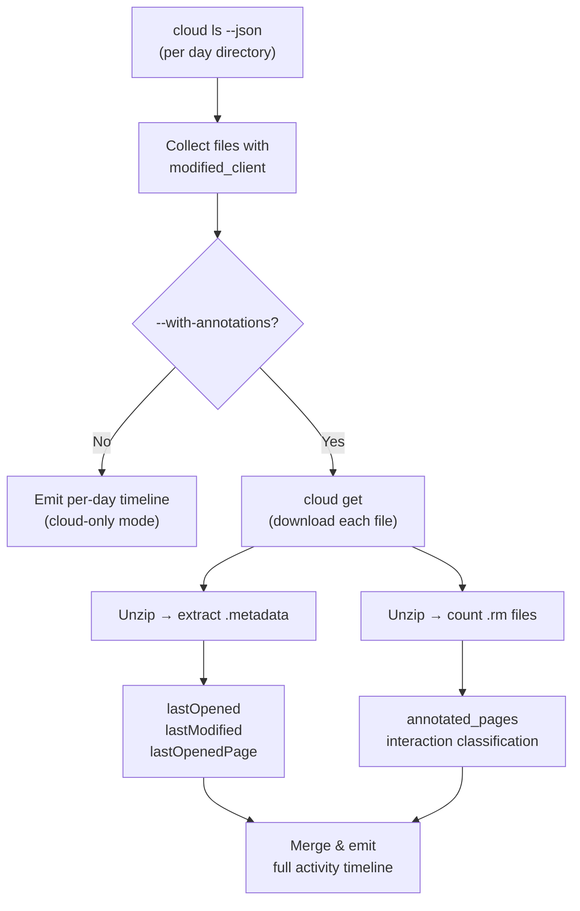

# reMarkable Cloud Activity Timeline

A side-project exploration into what information the reMarkable ecosystem stores about *when* you interacted with a document — and whether remarquee can surface that as a per-day activity timeline. The investigation started from a simple question: *"Which PDFs did I annotate on my reMarkable this week?"* and ended up mapping every timestamp source in the entire reMarkable file format.

> [!summary]
> 1. The reMarkable format stores **document-level wall-clock timestamps** (`lastModified`, `lastOpened`) but **no per-page or per-stroke timestamps** anywhere — despite field names like `timestamp` in the v6 cPages format, those are CRDT ordering counters, not wall-clock time.
> 2. To detect annotations, you must download the `.rmdoc` ZIP and check for `.rm` stroke files inside — there is no cloud-side metadata for this.
> 3. The proposed solution is a `remarquee cloud activity` command in three phases: cloud-only timeline → full activity with downloads → cached incremental scanning.

## Why this project exists

I upload a lot of PDFs to my reMarkable via remarquee's `cloud put` command, organized under `/ai/YYYY/MM/DD/<ticket>/`. After a few intensive days, I lose track of which files I actually opened, read, and annotated on the device versus which ones I just uploaded and forgot about. I wanted a command that would answer "what did I work on yesterday?" by scanning the cloud and showing me a timeline.

The investigation turned into a deeper dive than expected because the reMarkable format has multiple layers with misleadingly-named "timestamp" fields that turn out to be CRDT IDs rather than wall-clock time.

## What we investigated

We examined every place the reMarkable ecosystem stores time-related data, from the cloud API down to individual stroke bytes:

1. **Cloud API** (`remarquee cloud ls --json`, `cloud stat`) — `modified_client` per file and folder
2. **`.metadata` JSON** inside every `.rmdoc` ZIP — `lastModified`, `lastOpened`, `lastOpenedPage` as epoch milliseconds
3. **`.content` JSON** — the `cPages` schema has `value[T].Timestamp` fields, which look like `"1:1"` strings
4. **`.rm` binary stroke files** — v6 format with `RMV6CrdtID { Part1 uint8, Part2 uint64 }` identifiers

## The rmdoc archive structure

Every document on reMarkable is a `.rmdoc` ZIP archive. For annotated PDFs (the most common case when using remarquee for upload), the structure is:

```
<uuid>.rmdoc (ZIP)
├── <uuid>.content     ← Page layout (JSON, "legacy" schema for PDFs)
├── <uuid>.metadata    ← Document timestamps (JSON)
├── <uuid>.pagedata    ← Template per page (text, legacy only)
├── <uuid>.pdf         ← Original PDF
└── <uuid>/
    ├── <page-id>.rm   ← Stroke data (binary, version=6)
    ├── <page-id>.rm
    └── ...
```

The `.content` file for uploaded PDFs uses the **legacy schema** — a flat `"pages": ["uuid1", "uuid2", ...]` array. The **cPages schema** (with structured `value[T]` wrappers) only appears on notebooks created natively on the device.

The actual `.rm` stroke files inside are version 6 binary, even when the `.content` wrapper is legacy. This was a surprise — two different "v6" concepts coexist in the same archive.

## Timestamp sources — the complete picture

### What gives you wall-clock time

| Source | Field | Format | Meaning |
|--------|-------|--------|---------|
| `cloud ls --json` | `modified_client` | ISO 8601 UTC | Last edit time synced to cloud |
| `cloud stat <path>` | `modified_client` | ISO 8601 UTC | Same as above, per file |
| `.metadata` inside ZIP | `lastModified` | epoch ms | Last annotation edit on device |
| `.metadata` inside ZIP | `lastOpened` | epoch ms | Last time opened on device |
| `.metadata` inside ZIP | `lastOpenedPage` | int | Page user was on when closed |

The cloud `modified_client` and the `.metadata` `lastModified` are **the same value** — the device syncs its local timestamp to the cloud.

### What does NOT give you wall-clock time

**cPages `timestamp` fields** — Despite the field name, these are serialized CRDT IDs:

```json
{
  "cPages": {
    "pages": [
      {"id": "page-uuid", "redir": {"timestamp": "1:1", "value": 0}}
    ]
  }
}
```

That `"1:1"` is `CrdtId(part1=1, part2=1)` — a monotonically incrementing counter for conflict resolution across devices. The Go type:

```go
type RMV6CrdtID struct {
    Part1 uint8
    Part2 uint64
}
```

**`.rm` binary CRDT IDs** — Every stroke, group, and scene item in the v6 `.rm` files carries a `RMV6CrdtID`. These establish ordering (which stroke was drawn after which) but contain no wall-clock information.

The misleading field name `timestamp` in cPages caused significant confusion during the investigation. The reMarkable sync protocol uses CRDTs for multi-device consistency, and these "timestamps" are really Lamport-style logical clocks.

## Annotation detection

There is **no cloud-side metadata** that indicates whether a file has annotations. The only way to detect annotations is to download the `.rmdoc` and look for `.rm` files inside:

```python
import zipfile
with zipfile.ZipFile("doc.rmdoc") as zf:
    rm_files = [e for e in zf.namelist() if e.endswith(".rm")]
    annotated = len(rm_files) > 0
    annotated_pages = len(rm_files)
```

This means any tool that wants to distinguish "read" from "annotated" must download each file, which is the main performance bottleneck for bulk scanning.

## Interaction classification

Based on the available signals, we can classify user interaction into three tiers:

| Signal | Classification | Description |
|--------|---------------|-------------|
| `lastOpened` = 0, no `.rm` files | **uploaded** | PDF was pushed to device but never touched |
| `lastOpened` set, no `.rm` files | **read** | Opened and read, but no annotations |
| `.rm` files present | **annotated** | Drew, highlighted, or wrote on the device |

The `lastOpenedPage` field also tells you reading progress — how far into the document the user got.

## Real-world scan results

Scanning `/ai/2026/03/28` through `/ai/2026/04/06` (10 days) found **141 files** across the cloud. Here is a sample of what the activity timeline looks like:

```
📅 2026-04-06 (Monday)
──────────────────────────────────────────────────────
  11:37→11:45  ✏️ CR-DSL-002 — Internal Cross-Linking Design
                  6 pages annotated, last page 11
  15:48        📖 GOJA-25 Code Review - REPL Architecture
                  read to page 4
  18:15→18:26  📖 PPPP-001 Source Code
                  read, no annotations
  21:59→22:29  ✏️ PPPP-003 Paper Pro Fast E-Ink Investigation Guide
                  annotated
```

Files with confirmed annotations from downloaded samples:

| File | Annotated Pages | Last Modified | Last Opened |
|------|:-:|---|---|
| CR-DSL-002 — Internal Cross-Linking Design | 6 | Apr 6, 11:45 EDT | Apr 6, 11:37 EDT |
| GOJA-20 Web REPL Architecture | 4 | Apr 3, 17:16 EDT | Apr 3, 16:52 EDT |
| GL-009 vault-backed secrets and redaction | 3 | Apr 2, 20:06 EDT | Apr 2, 19:56 EDT |

## Proposed solution: `remarquee cloud activity`

The design document in the ticket proposes a new remarquee subcommand:

```bash
# Cloud-only timeline (fast, no downloads)
remarquee cloud activity /ai/2026/04 --since 2026-04-03

# Full activity with annotation detection (downloads each file)
remarquee cloud activity /ai/2026/04 --since 2026-04-03 --with-annotations

# JSON output for scripting
remarquee cloud activity /ai/2026/04 --with-annotations --with-glaze-output --output json
```

The data flow:



### Implementation phases

1. **Phase 1: Cloud-only timeline** — wraps `cloud ls --json` output into a formatted per-day view. No downloads, immediately useful for "what did I upload when?"

2. **Phase 2: Full activity scan** — downloads each file, extracts `.metadata`, counts `.rm` files, classifies interaction type. The expensive but complete version.

3. **Phase 3: Caching** — stores results keyed by cloud path + `modified_client`. On re-run, skips files whose cloud timestamp hasn't changed.

## Key code locations

The investigation touched these files in the remarquee codebase:

- `pkg/rmdoc/content.go` — Legacy vs cPages `.content` parsing, the `value[T]` type with its misleading `Timestamp` field
- `pkg/rmdoc/rmv6_crdt_sequence.go` — `RMV6CrdtID` type definition
- `pkg/rmdoc/rmv6_scene_tree.go` — V6 scene tree parser for `.rm` stroke files
- `pkg/rmdoc/rmv6_tagged_block_values.go` — LWW (Last-Writer-Wins) values with CRDT timestamps
- `pkg/rmdoc/content_test.go` — Test fixture showing cPages `timestamp: "1:1"` format

## Important project docs

The investigation produced a docmgr ticket with two main documents:

- **Ticket RMQ-0017** at `ttmp/2026/04/07/RMQ-0017--cloud-activity-timeline-track-remarkable-file-edits-and-annotations-per-day/`
- **Analysis doc** — complete timestamp source inventory with real-world data samples
- **Design doc** — `remarquee cloud activity` command design, architecture, and phased plan
- **Scanning script** — `scripts/scan-activity.sh` for quick cloud-only activity scanning

## Open questions

- Should `cloud activity` also support non-`/ai/` paths, or keep the date-structured assumption?
- Could the v6 parser distinguish highlights from freehand drawings to classify annotation types?
- Is there a way to get per-page timestamps from the reMarkable cloud API directly, bypassing the format limitation?
- Should this integrate with `remarquee-ui` for a calendar-style activity view?

## Near-term next steps

- Implement Phase 1 (cloud-only timeline) as a new Cobra command under `cmd/cloud_activity.go`
- Extract the `.metadata` epoch-ms parser into a reusable internal package
- Wire the JSON output through Glazed for table/JSON/TSV output flexibility
- Test against the full `/ai/2026/03/` directory (~1050 files) for performance baseline

## Project working rule

> [!important]
> Every "timestamp" in the reMarkable format must be verified — the field names are misleading.
> CRDT IDs are ordering counters, not wall-clock time, despite being stored in fields named `timestamp`.
