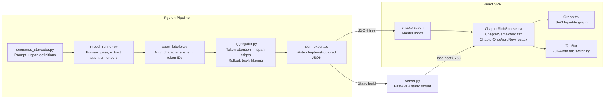

# Deep Dive: Building an Interactive Attention Visualization Notebook

This article documents every technical decision, algorithm, and failure mode encountered while building an interactive notebook that visualizes real transformer attention data. The project serves a thesis argument: language is not a sequence of instructions but a graph of relationships, and prompting is graph engineering. The notebook runs at `localhost:8768` and shows attention graphs extracted from a 164M-parameter code model running on CPU.

> [!summary]
> This article covers:
> 1. Why the attention extraction pipeline works the way it does — model selection, tensor shapes, the `output_attentions=True` landmine in transformers 5.x
> 2. How token-level attention becomes semantic span edges — the rollout algorithm, the opacity normalization problem, and why raw attention lies
> 3. The React rendering architecture — SVG graph layout, hover-driven edge highlighting, the tab-based chapter narrative, and the hooks ordering crash that blocked the project for a full debugging cycle
> 4. The scenario design philosophy — how each chapter's prompts were engineered to demonstrate a specific claim about language-as-graph

## Why this note exists

This is the technical companion to a philosophical thesis. The thesis argues that when you write a prompt, you are not "instructing" a model — you are engineering a weighted directed graph over semantic concepts. The word "Redis" does not mean "a cache." It activates a specific neighborhood of the training corpus: connection pooling, TTL semantics, `SETNX` patterns, serialization formats. The word "cache" activates nothing in particular. The visualization makes this visible.

The article exists because the implementation is non-trivial and the failure modes are instructive for anyone building transformer interpretability tooling. It is also a record of what a one-day sprint from model selection to interactive browser visualization actually looks like.

## When to use these patterns

Use the attention extraction pipeline pattern when:

- you need to visualize what a small transformer is actually attending to, not just its outputs
- you want to compare attention patterns across different prompts programmatically
- you are building interpretability tooling for a code model on CPU

Use the span-aggregation pattern when:

- raw token-to-token attention matrices are too large and noisy to reason about directly
- you want to show humans meaningful concept-level relationships instead of subword-level noise

Use the SVG chapter narrative pattern when:

- you are building an "explorable explanation" that tells a story through data
- you need hover-driven edge highlighting without a heavy graph rendering library like D3

## Architecture overview

The system has two halves: a Python pipeline that runs the model and exports JSON, and a React SPA that renders the data as interactive SVG graphs.



## Core mental model: attention as span-to-span flow

The fundamental insight driving the architecture is that raw attention — a `(layers, heads, seq_len, seq_len)` tensor — is useless for human interpretation. A 164M-parameter model with 20 layers, 12 heads, and a 200-token prompt produces `20 × 12 × 200 × 200 = 9.6 million` attention weights. Nobody can reason about this.

The pipeline collapses this into something meaningful through three transformations:

1. **Label semantic spans** — define named regions in the text (technology names, tool calls, code entities)
2. **Run attention rollout** — propagate attention through all 20 layers accounting for residual connections
3. **Aggregate to span edges** — sum token-to-token weights within span boundaries, normalize, filter top-k

The result is a list of `{from: "Redis", to: "redis_cache.get", weight: 0.0014}` edges — a weighted directed graph over human-meaningful concepts.

## Part I: The Python attention extraction pipeline

### Model selection: why tiny_starcoder_py

The model must satisfy three constraints: small enough for CPU inference, trained on code (not natural language), and outputs attention tensors. The choice was `bigcode/tiny_starcoder_py`:

| Property | Value |
|----------|-------|
| Parameters | 164M |
| Layers | 20 |
| Attention heads | 12 |
| Training data | Code (GitHub) |
| Tokenizer | BPE, code-aware |
| Context window | 8192 tokens |

Why not GPT-2? GPT-2's tokenizer splits code identifiers aggressively: `redis_cache.get` becomes `["redis", "_", "cache", ".", "get"]` — five tokens for one concept. The StarCoder tokenizer treats it as a single token or at most two, which produces cleaner span-to-token alignment and more meaningful attention patterns.

The code-trained nature of the model matters fundamentally. When the model sees `redis_cache.set(key, value, ttl)` in a prompt, it activates training-corpus knowledge about TTL semantics, key-value stores, and cache invalidation patterns. A general-language model like GPT-2 would see these as opaque strings.

### The `output_attentions=True` landmine

In transformers 5.x, passing `output_attentions=True` as a keyword argument to the `forward()` call silently does nothing. The model returns `attentions=None` and you get a crash downstream. The fix is to set it on the model's config object before loading:

```python
# WRONG — silently ignored in transformers >= 5.x
outputs = model(input_ids, output_attentions=True)

# CORRECT — set on config before model loading
config = AutoConfig.from_pretrained(model_name)
config.output_attentions = True
model = AutoModelForCausalLM.from_pretrained(model_name, config=config)
```

This is documented in the transformers changelog but it is not flagged as a breaking change. The behavior is silent: no warning, no error, just `None`. This single issue consumed significant debugging time.

### Tensor shapes through the pipeline

Understanding the tensor shapes is essential for anyone modifying the pipeline:

```python
# After forward pass:
outputs.attentions  # Tuple of 20 tensors, each shape (batch=1, heads=12, q_len, k_len)

# Stack and remove batch dimension:
attentions = torch.stack(outputs.attentions)[:, 0]
# Shape: (20, 12, seq_len, seq_len)

# After head averaging:
layer_attn = attentions[layer].mean(dim=0)
# Shape: (seq_len, seq_len)

# After rollout:
rollout_matrix  # Shape: (seq_len, seq_len)
```

The attention matrix `attn[q, k]` represents "how much does query position q attend to key position k." In causal (autoregressive) models, positions can only attend to earlier positions, so the upper triangle is zero.

### Span labeling and token alignment

The `span_labeler.py` module defines semantic spans as character-offset regions in the raw text. Each span has a type (technology, concept, tool_call, code_entity) and a layer (prompt vs. generated). The key operation is `align_spans_to_tokens()`, which maps character offsets to token indices using the tokenizer's offset mapping:

```python
# For each span, find all tokens whose character range overlaps:
for span in labeled.spans:
    token_ids = []
    for i, (tok_start, tok_end) in enumerate(offset_mapping):
        if tok_start == tok_end == 0:
            continue  # skip special tokens
        if tok_end <= span.char_start or tok_start >= span.char_end:
            continue  # no overlap
        token_ids.append(i)
    span.token_ids = token_ids
```

The overlap check is important because BPE tokenization can split a word at any boundary. The span "Redis" might align to token 5, while "redis_cache.get" might span tokens 8–10. The alignment must handle both cases.

### Attention rollout: why raw attention lies

Raw last-layer attention does not represent information flow. It represents one layer's local view. Earlier layers may route information through completely different paths. Attention rollout (Abnar & Zuidema, 2020) approximates the cumulative information flow by multiplying attention matrices across all layers, accounting for residual connections:

```python
def attention_rollout(attentions, discard_ratio=0.0, head_fusion="mean"):
    # attentions shape: (num_layers, num_heads, seq_len, seq_len)
    result = torch.eye(seq_len)  # identity: start with self-attention

    for layer_idx in range(num_layers):
        # Fuse heads (mean or max)
        fused = attentions[layer_idx].mean(dim=0)  # (seq, seq)

        # Residual connection: A' = 0.5 * A + 0.5 * I
        residual = 0.5 * fused + 0.5 * torch.eye(seq_len)

        # Accumulate: multiply with previous rollout
        result = torch.matmul(residual, result)

    return result  # (seq, seq) — approximate information flow
```

The residual connection term `0.5 * A + 0.5 * I` is critical. Without it, deep layers "wash out" — the identity component ensures that each position retains some of its original signal. The `0.5` coefficient comes from the standard transformer residual connection where the layer output is `x + layer(x)`, giving equal weight to the skip connection and the attention output.

### Span-to-span edge aggregation

The final step converts the `(seq_len, seq_len)` rollout matrix into a list of span-to-span edges:

```python
for src in spans:
    for dst in spans:
        if src.name == dst.name:
            continue
        # Extract the submatrix where rows=dst tokens, cols=src tokens
        sub_attn = attn[dst_tokens][:, src_tokens]
        # Sum and normalize by number of target tokens
        weight = sub_attn.sum().item() / len(dst_tokens)
        edges.append(SemanticEdge(source=src.name, target=dst.name, weight=weight))
```

The normalization by `len(dst_tokens)` prevents spans with more tokens from dominating. A 3-token span like "redis_cache.get" should not automatically get 3× the weight of a 1-token span like "Redis."

Top-k filtering (`max_edges=25`) keeps the graph readable. Without it, a 16-span scenario would produce `16 × 15 = 240` edges — a hairball. The top-25 edges show the strongest connections while remaining visually parseable.

### The CHAPTERS data structure

Scenarios are organized into a `CHAPTERS` dict in `scenarios_starcoder.py`:

```python
CHAPTERS = {
    "rich-vs-sparse": {
        "title": "Rich vs. Sparse Prompting",
        "argument": "Specific technology names create stronger attention edges.",
        "examples": {
            "cache": {
                "title": "Redis/PostgreSQL Caching",
                "rich": build_cache_rich,   # returns LabeledText
                "sparse": build_cache_sparse,
            },
            ...
        },
    },
    "same-word-different-domain": { ... },
    "one-word-rewires": { ... },
}
```

This structure drives both the JSON export and the React chapter rendering. Each chapter has an `argument` (the thesis claim it demonstrates) and `examples` (the concrete data). Chapter 1 has rich/sparse pairs. Chapters 2 and 3 have single scenarios with tab switching.

### JSON export pipeline

`json_export.py` runs all scenarios through the model and writes chapter-structured JSON:

```bash
python -m attention_vis.json_export --data-dir web/public/data
```

The output is a master `chapters.json` index plus individual scenario files:

```text
web/public/data/
├── chapters.json                                    # master index
├── rich-vs-sparse_cache_rich.json                   # 13 spans, 25 edges
├── rich-vs-sparse_cache_sparse.json                 # 9 spans, 25 edges
├── same-word-different-domain_logistics-zoo.json     # 16 spans, 25 edges
├── one-word-rewires_save.json                       # 12 spans, 25 edges
├── one-word-rewires_persist.json                    # 15 spans, 25 edges
└── ...
```

Each scenario JSON has the shape:

```json
{
  "prompt": "# System\nAvailable tools: redis_cache.get(key)...",
  "spans": [
    {"id": "redis", "label": "Redis", "type": "technology"},
    {"id": "redis_cache-get", "label": "redis_cache.get", "type": "tool_call"}
  ],
  "attention": [
    {"from": "redis", "to": "redis_cache-get", "weight": 0.0014},
    {"from": "postgresql", "to": "pg-query", "weight": 0.0009}
  ]
}
```

The React app fetches `chapters.json` first, then lazy-loads individual scenario files as the user navigates between chapters and tabs.

## Part II: The React interactive notebook

### Design philosophy: narrative chapters, not a dashboard

The original design had a selector-driven UI: pick a scenario, see a graph. This was wrong for the thesis. The thesis tells a story in three acts:

1. **Rich vs. Sparse** — naming specific technologies creates 4–7× stronger attention edges
2. **Same Word, Different Domain** — the word "order" activates completely different subgraphs in zoo vs. ecommerce context
3. **One Word Rewires the Graph** — changing "save" to "persist transactionally" restructures the entire attention topology

The UI was rebuilt as a scrolling narrative with fixed chapters. Each chapter has its own interaction pattern: tabs for Ch 1 and Ch 2 (switching between comparable views), variant buttons for Ch 3 (watching the graph rewire in real-time).

### Typography and visual identity

The dark editorial aesthetic uses three typefaces:

- **Fraunces** (display) — for the main title, with its distinctive variable-font optical sizing
- **Literata** (body) — for prose paragraphs, with comfortable reading weight at 15px
- **JetBrains Mono** (code/data) — for labels, stats, prompts, and edge weights

The color system in `theme.ts`:

```typescript
export const T = {
  bg: "#0a0a0f",      // near-black with blue undertone
  surface: "#111118",  // card backgrounds
  border: "#252530",   // subtle dividers
  text: "#e8e4df",     // warm white (not pure white)
  muted: "#8a8698",    // secondary text
  dim: "#4a4658",      // tertiary/hint text
  accent: "#f0c040",   // gold — the signature color
  red: "#dc4a3f",      // technology spans
  purple: "#b8a0ff",   // concept spans
  green: "#7ee787",    // code entity spans
  orange: "#f0884a",   // tool call spans
  cyan: "#56d4c0",     // modifier spans
};
```

Each span type gets its own color, creating immediate visual parsing: red dots are technologies, purple dots are concepts, orange dots are tool calls, green dots are code entities.

### The Graph component: SVG bipartite layout

The core `Graph.tsx` renders a bipartite (two-row) SVG graph. Prompt concepts sit in the top row, tool calls and code entities in the bottom row. Edges are cubic Bézier curves connecting them.

The layout algorithm is simple but effective:

```typescript
// Distribute nodes evenly across the width
sources.forEach((s, i) => {
  pos[s.id] = {
    x: sources.length === 1 ? W/2 : 60 + (i * (W - 120)) / (sources.length - 1),
    y: 55,
  };
});
targets.forEach((s, i) => {
  pos[s.id] = {
    x: targets.length === 1 ? W/2 : 60 + (i * (W - 120)) / (targets.length - 1),
    y: H - 45,
  };
});
```

This produces a clean, readable layout without any force-directed simulation. Force layouts would be inappropriate here because the bipartite structure (prompt → generated) is the core visual message.

### The opacity normalization problem

This was the single most impactful bug in the project. The initial opacity formula was:

```typescript
opacity = weight * 0.4  // WRONG
```

For the rich prompt, `maxWeight ≈ 0.0014`, giving the strongest edge an opacity of `0.0014 × 0.4 = 0.00056`. That is literally invisible. The sparse prompt was even worse: `0.000343 × 0.4 = 0.000137`.

The fix was to normalize within the graph and apply a visibility floor:

```typescript
const maxW = Math.max(...data.attention.map(a => a.weight), 1e-9);
const norm = e.weight / maxW;  // 0..1
opacity = 0.1 + norm * 0.5;   // always 0.1–0.6
```

This ensures:
- The strongest edge in any graph gets `opacity = 0.6` — clearly visible
- The weakest edges get `opacity = 0.1` — faint but present
- The visual scale is relative to the specific graph, so both rich and sparse graphs show meaningful structure
- The difference between rich and sparse shows in the *number* of visible edges, not their opacity

### Hover-driven edge highlighting

When a user hovers a node, the component:

1. Finds all edges connected to that node
2. Highlights connected edges at full opacity (0.9) with increased stroke width
3. Dims all other edges to opacity 0.03
4. Dims all unconnected nodes to opacity 0.1
5. Shows a glow ring around the hovered node

This is implemented with a `connected` set computed via `useMemo`:

```typescript
const connected = useMemo(() => {
  if (!hovered) return new Set<string>();
  const s = new Set<string>();
  data.attention.forEach(e => {
    if (e.from === hovered) s.add(e.to);
    if (e.to === hovered) s.add(e.from);
  });
  return s;
}, [hovered, data]);
```

The `useMemo` dependency on `data` ensures the set recomputes when the scenario changes. The CSS transitions (`transition: all 0.3s ease`) produce smooth opacity changes without any animation library.

### Tab-based navigation for full-width graphs

The original side-by-side layout made graphs too small to read at `max-width: 860px`. Each graph got roughly 400px of horizontal space — enough for 4–5 nodes before they overlapped.

The solution was a shared `TabBar` component that renders full-width tabs with colored underlines and badge metadata:

```typescript
<TabBar
  tabs={[
    { key: "rich", label: "Rich prompt", color: T.accent, badge: "1.4e-3" },
    { key: "sparse", label: "Sparse prompt", color: T.muted, badge: "3.4e-4" },
  ]}
  active={mode}
  onSelect={(k) => setMode(k as "rich" | "sparse")}
/>
```

Each tab shows its max edge weight as a badge, making the rich-vs-sparse comparison quantitatively visible even before seeing the graph. The stats strip between tabs and graph shows the ratio (4.1×, 7.3×).

### The React hooks ordering crash

The most insidious runtime bug was a React error #310 in `ChapterOneWordRewires.tsx`: "Rendered fewer hooks than expected." The cause was a `useMemo` hook placed after an early return:

```typescript
// WRONG — hooks must not be conditional
if (variants.length === 0) return null;
const connected = useMemo(...);  // VIOLATION: hook after conditional return
if (!current) return null;
```

React's rules of hooks require that hooks are always called in the same order on every render. An early return before a hook call means the hook is called on some renders but not others. The fix was to move the `useMemo` before all early returns and make it handle the null case:

```typescript
const current = variants[selected] || null;

const connected = useMemo(() => {
  if (!hovered || !current) return new Set<string>();
  // ... compute connected set
}, [hovered, current]);

if (variants.length === 0) return null;
if (!current) return null;
```

### The rewiring chapter: left-right column layout

Chapter 3 uses a different graph layout from Chapters 1 and 2. Instead of the bipartite top/bottom split, it arranges prompt concepts in a left column and generated code in a right column, with the verb displayed in a centered pill:

```
PROMPT                 GENERATED
  save ──────────→ tool_writefile
  web app ───────→ tool_localstorage
  User model ────→ handle_user
  Node.js ───────→ stringify_call
  Express ───────→ writefile_call
  JSON ──────────→ localstorage_call
```

The variant selector buttons show the span count as a badge (save: 12 spans, store: 11 spans, persist: 15 spans). The "persist transactionally" variant is visibly different — 15 spans means the graph has more nodes and edges, and unique spans get a dashed ring highlight.

### Server architecture

The FastAPI server (`server.py`) serves two things:
1. Static JSON files from `web/public/data/` (attention data)
2. The React production build from `web/dist/` (SPA)

```python
def mount_production_spa(app):
    app.mount("/assets", StaticFiles(directory=WEB_DIST / "assets"))
    
    @app.get("/{full_path:path}")
    async def serve_spa(full_path: str):
        static_file = WEB_DIST / full_path
        if static_file.exists() and static_file.is_file():
            return FileResponse(static_file)
        return FileResponse(WEB_DIST / "index.html")
```

The catch-all route serves `index.html` for any path that doesn't match a static file, enabling client-side routing. Run in production with:

```bash
python server.py --production --port 8768
```

## Part III: Scenario design philosophy

### Chapter 1: Rich vs. Sparse

Two example pairs demonstrate that specific technology names produce stronger attention edges than generic words:

- **Cache pair**: "Redis for caching user sessions… redis_cache.get… pg.query" vs. "checks a cache… cache.get… db.query"
- **Ecommerce pair**: "Shopify… Stripe… inventory.decrement… postgres.insert" vs. "purchase… stock… billing… db.save"

The rich prompts are ~3× longer, include explicit tool definitions, and name specific technologies. The sparse prompts express the same intent with generic words. The result: 4.1× and 7.3× stronger max edge weights for the rich variants.

### Chapter 2: Same Word, Different Domain

Both scenarios are logistics pipelines using "order," "warehouse," and "shipping." But the surrounding context activates completely different training-corpus neighborhoods:

- **Zoo**: animal feed, cold storage, perishable, FedEx, supplier catalog → replenishment subgraph
- **Ecommerce**: fulfillment, Shopify, refunds, DHL, out of stock → customer purchase subgraph

The word "order" appears in both prompts, but the model routes attention through entirely different paths. This demonstrates that words are not labels — they are subgraph activation keys.

### Chapter 3: One Word Rewires the Graph

Three prompts share the same domain context (web app, User model, Node.js, Express, JSON) and differ only in the verb and the available tools:

- **save**: `fs.writeFile`, `localStorage.setItem` → scatters across file I/O and serialization (12 spans)
- **store persistently**: `pg.insert`, `redis.set` → narrows toward PostgreSQL and Redis (11 spans)
- **persist transactionally**: `pg.transaction`, `pg.insert`, `pg.commit` → focuses on ACID, transactions, PgBouncer (15 spans)

The "persist" variant has the most spans (15) because the transactional semantics introduce additional concepts (atomicity, ACID compliance, PgBouncer) that the model has learned to associate with the verb "persist" in a database context.

### Prompt engineering for attention visualization

The prompts are not random. They were designed to produce clear, interpretable attention patterns:

1. **Explicit tool definitions** in the System section (`Available tools: redis_cache.get(key), redis_cache.set(key, value, ttl), pg.query(sql)`) ensure the model has concrete tokens to attend to
2. **Narrative code** that uses the tools directly (`cached = redis_cache.get(session_id)`) creates measurable prompt-to-code edges
3. **Consistent domain scaffolding** across rewiring variants (same User model, same Node.js/Express context) isolates the variable — the verb — as the only change

## Common failure modes

### 1. Invisible edges (opacity math)

The opacity formula `weight * 0.4` produced values in the range `0.0001–0.0006` — completely invisible. The fix was to normalize within the graph: `0.1 + (weight/maxWeight) * 0.5`. This ensures edges are always in the visible range (0.1–0.6).

**Lesson**: When rendering attention weights as visual properties, always normalize within the dataset first. Raw float values from neural networks are typically in ranges that make no sense as CSS values.

### 2. Dead code paths for logistics

The original `json_export.py` only handled rich/sparse pairs (Chapter 1 pattern). Adding Chapters 2 and 3 required extending the export logic to handle single-scenario examples with a `build` key instead of `rich`/`sparse` keys.

### 3. Empty WordRewiring (wrong span IDs)

The original rewiring prompts were too short (2–3 sentences) and produced only 1–2 spans. The model concentrated all attention on the verb itself, making the "rewiring" invisible. The fix was to write much longer prompts (8–10 sentences with full tool definitions) that gave the model enough context to distribute attention across 11–15 spans.

### 4. React hooks ordering violation

A `useMemo` hook placed after an early return caused React error #310. The error message ("Rendered fewer hooks than expected") is cryptic. The rule: all hooks must be called unconditionally, before any `return null` guards.

### 5. transformers 5.x silently ignoring `output_attentions=True`

Passing `output_attentions=True` as a `forward()` keyword argument is silently ignored in newer transformers versions. Must be set on the model config. This produces no error — just `attentions=None` downstream.

## Recommended implementation sequence

For someone building a similar system:

1. **Model selection first** — pick a small model with code training and a good tokenizer. `bigcode/tiny_starcoder_py` is ideal for CPU work.
2. **Set `config.output_attentions = True`** — before loading the model. This is the most common silent failure.
3. **Build the span labeler** — define your semantic regions and test alignment with the tokenizer's offset mapping.
4. **Implement attention rollout** — start with head-averaging and the 0.5 residual coefficient. Add discard_ratio later if needed.
5. **Aggregate to span edges** — normalize by target span length, filter to top-25 edges.
6. **Build the React app last** — start with a single `Graph.tsx` component rendering one scenario. Add chapters and tabs only after the graph rendering is correct.
7. **Fix opacity early** — use `0.1 + (weight/maxWeight) * 0.5` from the start. Do not use raw weights as CSS values.

## Key quantitative findings

| Scenario | Max edge weight | Spans | Edges shown |
|----------|----------------|-------|-------------|
| Cache (rich) | 1.40 × 10⁻³ | 13 | 25 |
| Cache (sparse) | 3.43 × 10⁻⁴ | 9 | 25 |
| Ecommerce (rich) | 3.20 × 10⁻³ | 17 | 25 |
| Ecommerce (sparse) | 4.39 × 10⁻⁴ | 10 | 25 |
| Zoo logistics | 2.30 × 10⁻³ | 16 | 25 |
| Ecommerce logistics | 2.02 × 10⁻³ | 16 | 25 |
| Rewiring: save | 5.28 × 10⁻⁴ | 12 | 25 |
| Rewiring: store | 4.41 × 10⁻⁴ | 11 | 25 |
| Rewiring: persist | 4.43 × 10⁻⁴ | 15 | 25 |

The rich/sparse ratios are the headline numbers: 4.1× for the cache pair, 7.3× for the ecommerce pair. The rewiring variants show that "persist transactionally" produces more spans (15) than "save" (12) or "store" (11), even though the max edge weights are similar — the verb changes the topology (more nodes), not the peak attention strength.

## Project file map

```text
/home/manuel/code/wesen/2026-04-08--attention-visualization/
├── src/attention_vis/
│   ├── model_runner.py          # Load model, run forward pass, extract attention tensors
│   ├── span_labeler.py          # Define semantic spans, align to tokenizer offsets
│   ├── aggregator.py            # Token attention → span edges, rollout, top-k filtering
│   ├── scenarios_starcoder.py   # All prompt definitions + CHAPTERS registry
│   ├── json_export.py           # Run model on all scenarios, write JSON
│   ├── pipeline.py              # CLI for static matplotlib visualizations
│   ├── viz_graph.py             # Static graph rendering (matplotlib)
│   ├── viz_heatmap.py           # Attention heatmap rendering
│   └── viz_layered.py           # Layered conceptual diagram
├── web/
│   ├── src/
│   │   ├── App.tsx              # Main layout, header, chapter ordering, compute notes
│   │   ├── types.ts             # ScenarioData, AttentionEdge, Span, ChaptersIndex
│   │   ├── theme.ts             # Color system, typefaces, SPAN_COLORS
│   │   └── components/
│   │       ├── Graph.tsx         # Core SVG bipartite graph with hover highlighting
│   │       ├── ChapterRichSparse.tsx   # Ch 1: tabbed rich/sparse comparison + TabBar
│   │       ├── ChapterSameWord.tsx     # Ch 2: tabbed zoo/ecommerce comparison
│   │       ├── ChapterOneWordRewires.tsx  # Ch 3: verb switching, left/right layout
│   │       └── shared.tsx       # SectionTitle, Pill, Caption, PromptBox
│   ├── public/data/             # JSON files served to React (40+ files)
│   └── dist/                    # Production build served by FastAPI
├── server.py                    # FastAPI server, production SPA mount
├── tests/                       # 20 unit tests for pipeline components
└── output/                      # Static PNG/HTML visualizations from matplotlib
```

## Open questions

- Can the pipeline scale to larger models (1B+ params) on CPU, or is GPU required for practical iteration?
- Would head-level analysis (instead of head averaging) reveal specialized attention patterns (e.g., a "technology routing" head)?
- Can the opacity normalization formula be made adaptive based on the distribution shape rather than just max weight?
- Should the React app add animated transitions between rewiring variants (morphing edges instead of instant swap)?
- Is the bipartite layout sufficient, or would a force-directed layout reveal cross-category connections that the current layout hides?

## Related notes

- The thesis article draft arguing that prompting is graph engineering (in progress)
- The design doc proposing 8 diagrams in 3 tiers (`ttmp/.../01-proposed-diagrams-and-examples-for-the-article.md`)
- The assessment identifying 4 core problems before the rewrite (`ASSESSMENT.md`)
