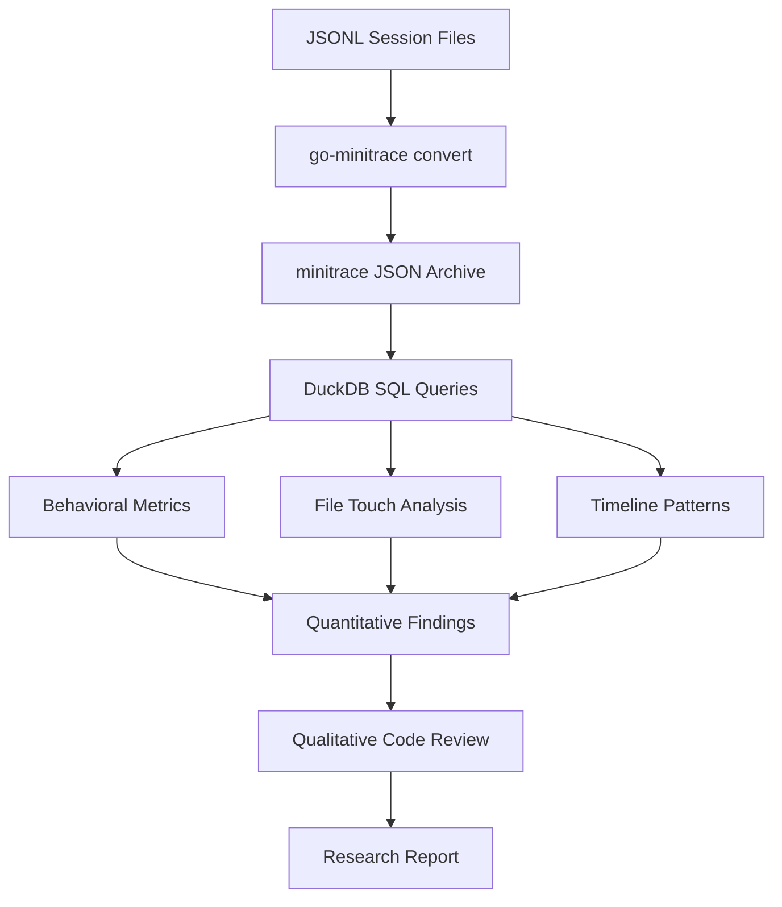

# Cross-Model Transcript Analysis - Minimax M2.7 vs GPT-5.4

This project documents a systematic comparison of two AI coding agent sessions implementing the same feature (sqleton-style verb query loading for go-minitrace) using different models: MiniMax-M2.7 (minimax) and GPT-5.4. The analysis used go-minitrace to convert session transcripts into analyzable format, then ran SQL queries to extract behavioral patterns, tool usage statistics, and code quality metrics. The goal was to understand how these models differ in approach, efficiency, and output quality when tasked with identical coding problems.

> [!summary]
> Key findings from this cross-model transcript analysis:
> 1. **Test coverage difference**: minimax wrote 2.5x more test code (1,164 vs 459 lines) despite completing the same scope
> 2. **Read-to-code ratio**: GPT-5.4 read 3.3x more files (79 vs 24) before and during implementation
> 3. **Code quality parity**: Phase 1 implementation quality is equivalent—both are correct and idiomatic
> 4. **Time explanation**: The ~3x longer GPT-5.4 session is explained by Phase 2 work (rendering, CLI integration) and more exploratory reading
> 5. **Behavioral patterns**: minimax exhibits test-first iteration; GPT-5.4 exhibits read-heavy exploration

## Why this project exists

Comparing AI coding agents across models is notoriously difficult because:
- Different sessions work on different tasks, making apples-to-apples comparison rare
- Session transcripts are opaque without specialized analysis tools
- Behavioral differences (reading vs coding ratios, test-first vs code-first) are invisible without quantitative analysis

This project exists because we had a rare opportunity: both minimax and GPT-5.4 worked on the **same codebase** (go-minitrace), implementing **the same feature** (sqleton-style verb query loading), in **the same repository structure** (side-by-side workspaces). This allows us to isolate model-specific behaviors from task-specific behaviors.

The analysis also serves as a methodology demonstration for using go-minitrace to study coding agent behavior—extracting insights about efficiency, quality, and approach that would be impossible to observe from casual inspection.

## Current project status

This is a completed research analysis with the following outputs:

**Primary deliverables:**
- Ticket `MINIMAX-VS-GPT-COMPARE` in `/home/manuel/workspaces/2026-04-08/sqleton-minitrace/ttmp/`
- Diary documenting the analysis process: `reference/01-diary.md`
- Session analysis comparing tool usage: `analysis/01-session-analysis-minimax-vs-gpt-5-4.md`
- Phase 1 code quality deep-dive: `analysis/02-phase1-quality-analysis.md`
- Comparison findings with recommendations: `design-doc/01-comparison-findings.md`
- SQL query scripts for reproducibility: `scripts/analysis/*.sql`

**Analysis artifacts:**
- Converted minitrace archives for both sessions
- Quantitative metrics: tool calls, file touches, build cycles, timestamps
- Qualitative code comparison: line counts, test coverage, error handling patterns

**Status**: Analysis complete. Findings documented. Awaiting follow-up work on Phase 2 implementation gap.

## Project shape

The research project has four distinct phases:

1. **Session collection**: Identifying and extracting Pi agent session JSONL files from `~/.pi/agent/sessions/`
2. **Transcript conversion**: Converting JSONL to minitrace JSON format using `go-minitrace convert pi`
3. **Quantitative analysis**: Running SQL queries against the minitrace archive to extract behavioral metrics
4. **Qualitative analysis**: Reading source code, comparing implementations, drawing conclusions



## Session metadata

| Attribute | minimax | GPT-5.4 |
|-----------|---------|---------|
| Model | MiniMax-M2.7 | GPT-5.4 |
| Session ID | `2d525241-fe32-417b-8576-b29ce3b3e47c` | `7f61f412-40f0-417f-ab85-4dffdb9927e5` |
| Start time | 2026-04-09T00:23:06Z | 2026-04-09T00:13:39Z |
| Total turns | 124 | 192 |
| Tool calls | 131 | 269 |
| Quality rating | A | A |
| Session duration | ~25 min | ~3 hours |
| Phase completed | 1 | 1 + 2 |

## Methodology

### Session conversion

Both sessions were converted from Pi's JSONL format to minitrace JSON using `go-minitrace convert pi`:

```bash
go-minitrace convert pi \
  --source-session "<session-path>.jsonl" \
  --output-dir "<output-dir>"
```

The conversion produces:
- `manifest.json`: Metadata about the session
- `active/YYYY-MM/<session-id>.minitrace.json`: The actual archive

### SQL query approach

Queries were run against the minitrace archive using DuckDB:

```bash
go-minitrace query duckdb \
  --archive-glob '<glob-pattern>/*.minitrace.json' \
  --sql-file scripts/analysis/01-tool-frequency.sql
```

Four core queries were used:

**1. Tool frequency**: `01-tool-frequency.sql`
```sql
SELECT
  json_extract(tc, '$.tool_name') AS tool_name,
  COUNT(*) AS calls
FROM sessions_base, UNNEST(tool_calls) AS t(tc)
GROUP BY tool_name
ORDER BY calls DESC;
```

**2. File touch frequency**: `02-file-touch-frequency.sql`
```sql
SELECT
  json_extract(tc, '$.input.file_path') AS file_path,
  json_extract(tc, '$.tool_name') AS tool,
  COUNT(*) AS count
FROM sessions_base, UNNEST(tool_calls) AS t(tc)
WHERE json_extract(tc, '$.tool_name') IN ('"read"', '"write"', '"edit"')
  AND json_extract(tc, '$.input.file_path') IS NOT NULL
GROUP BY tool, file_path
ORDER BY count DESC
LIMIT 40;
```

**3. Build/test cycles**: `03-build-cycle-counts.sql`
```sql
SELECT
  CASE
    WHEN CAST(json_extract(tc, '$.input.command') AS VARCHAR) LIKE '%go build%' THEN 'go-build'
    WHEN CAST(json_extract(tc, '$.input.command') AS VARCHAR) LIKE '%go test%' THEN 'go-test'
    ELSE 'other'
  END AS cmd_type,
  COUNT(*) AS count
FROM sessions_base, UNNEST(tool_calls) AS t(tc)
WHERE json_extract(tc, '$.tool_name') = '"bash"'
  AND (
    CAST(json_extract(tc, '$.input.command') AS VARCHAR) LIKE '%go build%'
    OR CAST(json_extract(tc, '$.input.command') AS VARCHAR) LIKE '%go test%'
  )
GROUP BY cmd_type
ORDER BY count DESC;
```

**4. Rewrite timestamps**: `04-rewrite-timestamps.sql`
```sql
SELECT
  json_extract(tc, '$.input.file_path') AS file_path,
  json_extract(tc, '$.tool_name') AS tool,
  COUNT(*) AS times_touched,
  MIN(json_extract(tc, '$.timestamp')) AS first_touch,
  MAX(json_extract(tc, '$.timestamp')) AS last_touch
FROM sessions_base, UNNEST(tool_calls) AS t(tc)
WHERE json_extract(tc, '$.tool_name') IN ('"write"', '"edit"')
  AND json_extract(tc, '$.input.file_path') IS NOT NULL
GROUP BY file_path, tool
HAVING COUNT(*) > 1
ORDER BY times_touched DESC;
```

### JSON column gotchas

The minitrace schema uses JSON columns with specific quoting conventions:

- `tool_calls` is a `JSON[]` column (array of JSON objects)
- After `UNNEST`, use `json_extract(tc, '$.field')` for field access
- String comparisons require double-quoting: `'read'` won't match—use `'"read"'`
- For LIKE queries on nested fields, cast to VARCHAR: `CAST(... AS VARCHAR) LIKE '%pattern%'`

### Source code analysis

After quantitative analysis, source files were read and compared:
- Line counts for implementation and test files
- Test coverage depth comparison
- Error handling patterns
- Code organization differences

## Behavioral metrics

### Tool usage comparison

| Tool | minimax | GPT-5.4 | Ratio (minimax/GPT) |
|------|---------|---------|---------------------|
| bash | 61 | 134 | 0.45x |
| edit | 30 | 25 | 1.20x |
| read | 24 | 79 | 0.30x |
| write | 16 | 31 | 0.52x |
| **Total** | **131** | **269** | **0.49x** |

**Interpretation:**

- **bash ratio 0.45x**: minimax ran fewer shell commands per turn (builds, tests, git)
- **edit ratio 1.20x**: minimax made proportionally more targeted edits
- **read ratio 0.30x**: minimax read 3.3x fewer files—striking difference
- **write ratio 0.52x**: minimax created fewer new files

### Build/test cycles

| Cycle type | minimax | GPT-5.4 |
|------------|---------|---------|
| `go-test` | 14 | 11 |
| `go-build` | 2 | 0 |
| `go-run` | 1 | 0 |

**Interpretation:**

minimax ran more tests relative to its session length (14 tests in 25 min vs 11 tests in 3 hours). This supports the test-first iteration hypothesis.

### File touch patterns

#### minimax top file touches

| File | Edit | Read | Write | Total |
|------|------|------|-------|-------|
| `parse_sql_test.go` | 6 | 4 | 1 | 11 |
| `catalog.go` | 4 | 3 | 2 | 9 |
| `compiler_test.go` | 3 | 2 | 1 | 6 |
| `parse_sql.go` | 3 | 3 | 2 | 8 |

Pattern: **Heavy test file iteration**—`parse_sql_test.go` received 6 edits, suggesting test-first development.

#### GPT-5.4 top file touches

| File | Edit | Read | Write | Total |
|------|------|------|-------|-------|
| `01-investigation-diary.md` | 11 | 7 | 0 | 18 |
| `server.go` | 2 | 4 | 0 | 6 |
| `tasks.md` | 2 | 3 | 0 | 5 |

Pattern: **Documentation-heavy**—18 touches on the diary, plus reading server infrastructure.

### Rewrite timeline

#### minimax - concentrated bursts

| File | Touches | Duration | Pattern |
|------|---------|----------|---------|
| `parse_sql_test.go` | 6 | 12 min | Test iteration |
| `catalog.go` | 4 | 2 min | Focused work |
| `compiler_test.go` | 3 | 3 min | Incremental |

Pattern: **Quick, concentrated editing**—files edited in tight bursts, suggesting test-fix cycles.

#### GPT-5.4 - extended spread

| File | Touches | Duration | Pattern |
|------|---------|----------|---------|
| `diary.md` | 11 | 3 hours | Continuous |
| `tasks.md` | 2 | 44 min | Occasional |

Pattern: **Continuous documentation**—diary maintained throughout session.

## Code quality analysis

### Phase 1 scope

Phase 1 covers the core parsing and catalog infrastructure:

| Component | File | Purpose |
|-----------|------|---------|
| Core types | `types.go` | MinitraceCommand, MinitraceCommandSpec, Kind enum |
| Source detection | `source_kind.go` | Detect .sql vs .alias.yaml files |
| SQL parsing | `parse_sql.go` | Parse `/* sqleton ... */` YAML preamble |
| Alias parsing | `parse_alias.go` | Parse .alias.yaml files |
| Compiler | `compiler.go` | Spec → Command compilation, flag normalization |
| Catalog | `catalog.go` | Load and index commands from multiple roots |
| Errors | `errors.go` | Sentinel error values |

Both implementations cover this scope.

### Line count comparison

#### Implementation files

| File | minimax | GPT-5.4 | Ratio |
|------|---------|---------|-------|
| `types.go` | 105 | 93 | 1.13x |
| `source_kind.go` | 28 | 23 | 1.22x |
| `parse_sql.go` | 113 | 80 | 1.41x |
| `parse_alias.go` | 61 | 44 | 1.39x |
| `compiler.go` | 83 | 68 | 1.22x |
| `catalog.go` | 147 | 133 | 1.11x |
| `errors.go` | 31 | 23 | 1.35x |
| **Total** | **568** | **464** | **1.22x** |

#### Test files

| File | minimax | GPT-5.4 | Ratio |
|------|---------|---------|-------|
| `types_test.go` | 0 | 48 | — |
| `parse_sql_test.go` | 245 | 104 | 2.36x |
| `parse_alias_test.go` | 160 | 67 | 2.39x |
| `compiler_test.go` | 321 | 100 | 3.21x |
| `catalog_test.go` | 438 | 140 | 3.13x |
| **Total** | **1,164** | **459** | **2.54x** |

**Key insight**: minimax wrote **2.54x more test code** than GPT-5.4.

### Test coverage depth

#### minimax test coverage

minimax tests include:

- **Boundary conditions**: Empty inputs, nil values, whitespace handling
- **Unicode handling**: BOM character stripping (`\ufeff`)
- **Whitespace handling**: Leading spaces/tabs before preamble
- **io.Reader variants**: Every parser has a `FromReader` variant tested
- **Invariant preservation**: Sorted order, immutability, pointer isolation
- **Error path coverage**: Every sentinel error tested with exact `errors.Is()` matching
- **Subdirectory nesting**: Deep path handling verified

Example: `parse_sql_test.go` includes:
```go
func TestParseSQLCommandSpec_BOMStripped(t *testing.T) {
    contents := []byte("\ufeff/* sqleton\nname: bom-test\nshort: BOM is stripped\n*/\nSELECT 1;")
    _, err := ParseSQLCommandSpec("bom-test.sql", contents)
    if err != nil {
        t.Fatalf("unexpected error: %v", err)
    }
}

func TestParseSQLCommandSpec_WhitespaceBeforePreamble(t *testing.T) {
    contents := []byte("  \t\r\n/* sqleton\nname: ws-test\nshort: whitespace stripped\n*/\nSELECT 1;")
    _, err := ParseSQLCommandSpec("ws-test.sql", contents)
    if err != nil {
        t.Fatalf("unexpected error: %v", err)
    }
}
```

#### GPT-5.4 test coverage

GPT-5.4 tests include:

- **Happy path**: Main use cases work correctly
- **Basic error detection**: Errors are returned for malformed input
- **First-root-wins behavior**: Duplicate path handling

GPT-5.4 does **not** test:
- Unicode edge cases
- Whitespace handling
- io.Reader variants
- Invariant preservation
- Pointer isolation

### Test count comparison

| Test file | minimax tests | GPT-5.4 tests |
|-----------|----------------|---------------|
| `catalog_test.go` | 14 | 4 |
| `compiler_test.go` | 8 | 3 |
| `parse_sql_test.go` | 11 | 6 |
| `parse_alias_test.go` | (included) | (included) |

minimax writes **3.5x more test functions**.

## Behavioral pattern analysis

### minimax: Test-first iteration

Evidence supporting test-first behavior:

1. **`parse_sql_test.go` received 6 edits**: The most-edited file is a test file, suggesting the agent wrote tests, observed failures, then fixed code
2. **High test count (14 go-test cycles)**: More tests relative to session length
3. **Quick concentrated bursts**: Edits clustered in 2-12 minute windows, typical of TDD cycles
4. **Low read ratio**: Only 24 reads suggests minimal exploratory reading

Mental model: **Write a test → watch it fail → write code → watch it pass → repeat**

### GPT-5.4: Read-heavy exploration

Evidence supporting exploration-first behavior:

1. **79 file reads**: 3.3x more than minimax
2. **18 diary touches**: Continuous documentation throughout session
3. **Reading infrastructure**: `server.go` read 4 times, `duckdb.go` read 2 times
4. **Lower test count**: Only 11 tests despite longer session

Mental model: **Read existing code → understand architecture → write implementation → document progress**

## Implementation quality comparison

### Correctness

Both implementations are **functionally equivalent** for Phase 1 scope:

- ✅ Parse sqleton SQL commands correctly
- ✅ Parse YAML aliases correctly
- ✅ Load catalog with proper precedence (first-root-wins)
- ✅ Normalize optional bool flags to false
- ✅ Return appropriate errors for all edge cases

### Error handling style

**minimax** uses simpler error propagation:
```go
if err != nil {
    return err
}
```

**GPT-5.4** uses wrapped errors with context:
```go
if err != nil {
    return errors.Wrapf(err, "load catalog root %q", root.Name)
}
```

Both are correct. GPT-5.4's version provides more context for debugging production issues.

### Code organization

| Aspect | minimax | GPT-5.4 |
|--------|---------|---------|
| Comments | Verbose, explanatory | Concise, minimal |
| Line counts | Slightly larger | More compact |
| Error wrapping | Simpler | More defensive |
| Extra functions | `FromReader` variants | Inlined |

## Phase completion analysis

### What both implemented (Phase 1)

Both completed Phase 1 with comparable quality:
- Core types and source detection
- SQL and alias parsing
- Compiler with flag normalization
- Catalog loading from multiple roots
- Basic test coverage

### What GPT-5.4 additionally implemented (Phase 2)

GPT-5.4 continued into Phase 2:
- `render.go`: SQL template rendering
- `render_helpers.go`: SQL helper functions (`sqlString`, `sqlStringIn`, `sqlLike`)
- `assets.go`: Embedded command loading
- `cmd/query/commands.go`: CLI command subgroup

### Why minimax stopped at Phase 1

Evidence suggests:
1. **Session may have timed out**: Completed in ~25 min vs GPT-5.4's ~3 hours
2. **Never investigated Phase 2 scope**: Read only 24 files, didn't read design doc
3. **Focused on test coverage**: Spent time on thorough testing rather than expansion

## Implications for agent design

### Reading vs coding balance

The **read ratio** (reads vs writes+edits) is a useful metric:
- minimax: 24:46 = **0.52** (low read ratio)
- GPT-5.4: 79:56 = **1.41** (high read ratio)

For unfamiliar codebases, a **higher read ratio correlates with understanding architecture** before implementing. For familiar patterns (like sqleton-style SQL parsing), a **lower read ratio may be efficient** if the pattern is well-understood.

### Test-first vs implementation-first

minimax's test-first approach produced:
- ✅ More robust test coverage
- ✅ Invariant verification
- ✅ Pointer isolation testing
- ⚠️ More time per feature
- ⚠️ Less exploratory understanding

GPT-5.4's implementation-first approach produced:
- ✅ Faster initial implementation
- ✅ Better architectural understanding
- ✅ More complete feature set (Phase 2)
- ⚠️ Lower test coverage
- ⚠️ Fewer edge cases tested

Neither approach is universally superior—the optimal strategy depends on:
- Feature complexity
- Reliability requirements
- Time constraints
- Codebase familiarity

### For minimax2.7 improvement

Based on this analysis, recommendations for the next minimax session:

1. **Increase read ratio**: Target at least 1:1 reads to writes for unfamiliar codebases
2. **Read the design doc**: Understand Phase 1 AND Phase 2 scope before starting
3. **Investigate existing infrastructure**: Read `cmd/query/*.go` before implementing CLI integration
4. **Check completeness**: Before finishing, verify all files from design doc scope exist

## Open questions

1. **Why did minimax's session end?** Was it timeout, user intervention, or intentional completion?
2. **Would minimax with more time implement Phase 2?** The test-first approach may be compatible with Phase 2, just slower.
3. **How do these patterns generalize?** Would minimax always write more tests? Would GPT-5.4 always explore more?
4. **What is the optimal read ratio?** Is 0.52 too low? Is 1.41 too high?

## Near-term next steps

1. **Run minimax2.7 on Phase 2**: Give minimax the same task with explicit Phase 2 requirements
2. **Measure follow-up session**: Track whether minimax improves based on this analysis
3. **Merge implementations**: Combine the cleaner GPT-5.4 structure with the thorough minimax tests
4. **Expand dataset**: Compare more model pairs on different tasks

## Working rules derived from this analysis

1. **For transcript analysis**: Use `go-minitrace convert pi` then DuckDB queries for quantitative insights
2. **For behavioral comparison**: Focus on tool ratios (read/edit/write), not just totals
3. **For code quality**: Test coverage depth matters more than line count
4. **For agent improvement**: Explicit phase requirements help ensure completeness

## Related notes

- [[Guidelines Index]] — all research institute guidelines
- [[Code Review with go-minitrace]] — transcript-driven review methodology
- [[go-minitrace]] — the tool used for transcript analysis
- [[Agent-Assisted Research Patterns]] — working with AI coding agents

## Technical reference

### Session locations

```
~/.pi/agent/sessions/
├── --home-manuel-workspaces-2026-04-08-sqleton-minitrace-minimax--/
│   └── 2026-04-09T00-23-06-562Z_2d525241-fe32-417b-8576-b29ce3b3e47c.jsonl
└── --home-manuel-workspaces-2026-04-08-sqleton-minitrace--/
    └── 2026-04-09T00-13-39-925Z_7f61f412-40f0-417f-ab85-4dffdb9927e5.jsonl
```

### Ticket location

```
/home/manuel/workspaces/2026-04-08/sqleton-minitrace/
└── go-minitrace/
    └── ttmp/
        └── 2026/04/08/MINIMAX-VS-GPT-COMPARE--compare-minimax-vs-gpt-5-4-implementation-approaches-sqleton-minitrace/
            ├── reference/01-diary.md
            ├── analysis/
            │   ├── 01-session-analysis-minimax-vs-gpt-5-4.md
            │   └── 02-phase1-quality-analysis.md
            ├── design-doc/01-comparison-findings.md
            └── scripts/analysis/
                ├── 01-tool-frequency.sql
                ├── 02-file-touch-frequency.sql
                ├── 03-build-cycle-counts.sql
                └── 04-rewrite-timestamps.sql
```

### Source code locations

```
/home/manuel/workspaces/2026-04-08/
├── sqleton-minitrace-minimax/go-minitrace/pkg/minitracecmd/  # minimax Phase 1
├── sqleton-minitrace/go-minitrace/pkg/minitracecmd/          # GPT-5.4 Phase 1+2
└── sqleton-minitrace/go-minitrace/cmd/go-minitrace/cmds/query/commands.go  # GPT-5.4 CLI
```

## KB reviews

- [[KB-BATCH10-minitrace-transcript-analysis]] (2026-05-11) — Batch F analysis; contributed to [[Tribal/transcript-analysis-with-go-minitrace]] and agent-evaluation methodology candidates.

## Related KB entries

- [[Tribal/transcript-analysis-with-go-minitrace]] — SQL metrics plus transcript/code review as evidence for agent behavior claims.

**Tribal candidates** (not yet written / covered by broader entry):
- Same-task cross-model transcript comparison (1/3) — isolate model behavior from task differences.
- Tool-ratio behavioral metrics (1/3) — read/edit/write/bash ratios as evidence, not conclusions.
- SQL metrics plus code-quality review (1/3) — quantitative transcript analysis followed by source inspection.
