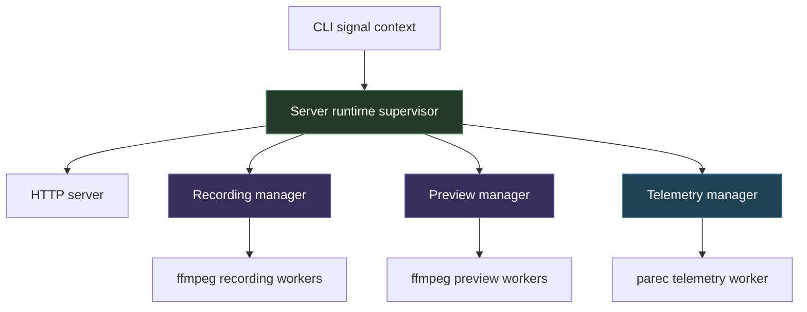
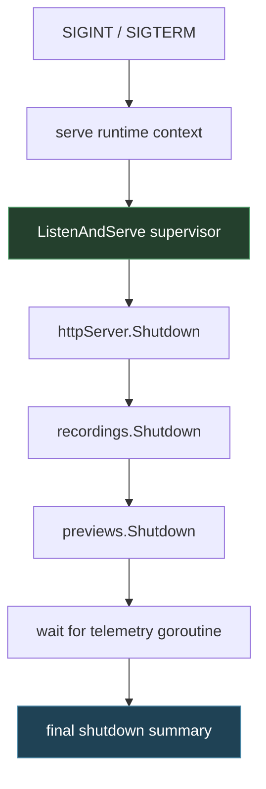

# Process Supervision and Cancellation: Designing Reliable Long-Lived Local Servers

This note captures the process-management and cancellation design work that came out of the `screencast-studio` repository. It is not just a writeup of one bug fix. It is a reusable pattern for a broad class of local tools: CLI-launched servers that own background managers, managers that own subprocesses, and subprocesses that need to stop cleanly under `Ctrl-C`, internal errors, and bounded shutdown deadlines.

> [!summary]
> 1. A local server that starts background work is a **runtime supervisor**, not just an HTTP listener.
> 2. Cancellation must follow an explicit ownership tree: CLI context → server runtime → managers → subprocesses.
> 3. The most reliable design is staged shutdown: stop intake, cancel owned work, wait, escalate, summarize.
> 4. Rich lifecycle logging is not decoration; it is the difference between understanding shutdown races and guessing at them.

## Why this note exists

The triggering incident was a real one: `screencast-studio serve` could appear to hang on `Ctrl-C`, and there was evidence that `ffmpeg` might remain running after the top-level process had exited. Once the code was inspected, it became clear that this was not a one-line signal bug. It was a runtime-ownership problem.

The repository had all the usual ingredients of a subtle cancellation system:

- a CLI command creating a long-lived context,
- an HTTP server,
- a recording manager,
- a preview manager,
- a telemetry manager,
- Unix subprocesses such as `ffmpeg` and `parec`,
- a mixture of `context.Context`, channels, goroutines, and `exec.Cmd`.

That combination is exactly where superficially simple shutdown logic goes wrong. The lesson is reusable far beyond this repo.

## When to use this pattern

Use this design pattern when you have a process that looks like this:

- a user launches a local server from a CLI,
- the server can start multiple kinds of work over time,
- some of that work persists beyond a single request,
- some of that work owns OS subprocesses,
- you need reliable `Ctrl-C` handling,
- you need bounded shutdown behavior,
- you need enough observability to diagnose hangs and leaks.

Typical examples:

- local recording tools,
- media-processing control servers,
- dev servers that spawn workers,
- notebook-like runtimes,
- browser/desktop automation servers,
- daemon-ish CLIs that still run in the foreground.

Do **not** use a fully elaborate supervision design when:

- the program is one-shot and exits after a single subprocess,
- there is no background work beyond one request,
- the subprocess lifecycle is already delegated to a stronger supervisor such as systemd, Kubernetes, or a job queue.

## The core mental model

The most important shift is conceptual: once a local server can start long-lived work, it is no longer “just a web server.” It is a **runtime supervisor**.

The supervisor owns:

- the runtime context,
- the network intake surface,
- the managers that create long-lived work,
- the shutdown policy,
- the evidence trail explaining what stopped and what did not.

If you fail to think of it as a supervisor, the code tends to grow the wrong way:

- each manager invents its own lifetime,
- subprocesses are tied to ad hoc contexts,
- shutdown becomes implicit rather than orchestrated,
- the top-level process can die while child work is still draining.

That is how “I pressed Ctrl-C but ffmpeg was still running” happens.

## The ownership tree

The central design rule is that cancellation should mirror ownership.



This is not just documentation. It should be visible in code.

If a manager owns work, the manager should expose a bounded shutdown contract. If the server owns managers, the server should call those contracts explicitly during shutdown.

## The original failure mode in Screencast Studio

The key architectural problem in `screencast-studio` was that ownership was only partially encoded.

At a high level, the repository had:

- `pkg/cli/serve.go` creating the serve context,
- `internal/web/server.go` constructing managers,
- `internal/web/session_manager.go` for recording,
- `internal/web/preview_manager.go` for previews,
- `internal/web/telemetry_manager.go` for audio/disk telemetry,
- `pkg/recording/run.go` for actual `ffmpeg` lifecycle management.

The important subtlety was that recording and preview work were initially rooted in detached `context.Background()`-based contexts rather than in an explicitly server-owned runtime context. That meant the code could *look* like the server owned the managers while, in practice, the work created by those managers had partially independent lifetimes.

This is the most common kind of cancellation bug in real systems: the ownership picture is true structurally but false operationally.

## The repaired model

The improved design in `screencast-studio` now has four layers of discipline.

### 1. Constructor-time parent-context ownership

The server runtime context is created before the server is constructed, and that parent context is passed into the recording and preview managers at construction time.

That change matters because it turns ownership into a constructor invariant instead of a later mutation.

Bad shape:

```text
construct manager
later bind context somehow
hope no work started too early
```

Better shape:

```text
construct runtime context
construct server with runtime context
construct managers with runtime context
start work only under that tree
```

### 2. Explicit manager shutdown APIs

The recording and preview managers now expose explicit `Shutdown(ctx)` methods.

This is a major design improvement because it gives the server something better than “cancel the root context and pray.”

A good manager shutdown contract means:

- the manager knows how to stop its own work,
- the server does not need to know the manager’s internal channels and cancel funcs,
- timeout semantics are local and explicit,
- logging can be emitted at the right abstraction level.

### 3. Staged runtime shutdown in the server

The server now shuts down in a deliberate order:

1. begin shutdown,
2. stop accepting new HTTP work,
3. drain recordings,
4. drain previews,
5. wait for HTTP and telemetry goroutines,
6. emit a final runtime component summary.

This order matters because it prevents new work from entering the system while the existing work is draining.

### 4. Lifecycle logging everywhere

Structured lifecycle logs were added across:

- server start/shutdown,
- recording session lifecycle,
- preview lifecycle,
- telemetry loop lifecycle,
- ffmpeg/parec process start/wait/stop events.

This turns shutdown from an invisible side effect into an explainable sequence.

## The distinction between cancellation and shutdown

A common mistake is to treat these as the same thing.

They are related but distinct.

### Cancellation

Cancellation means: a context becomes done.

This is just a signal.

By itself, cancellation does not answer:

- who must stop,
- in what order,
- how long to wait,
- how to escalate,
- what to report if something does not stop.

### Shutdown

Shutdown means: the system runs a **policy** after cancellation.

That policy includes:

- ordering,
- waiting,
- deadlines,
- escalation,
- summary reporting.

A good runtime uses context cancellation as the trigger and explicit shutdown code as the policy.

## Managers as bounded drains

A useful design principle is to think of each manager as a **bounded drainable unit**.

A bounded drainable unit has three properties:

1. it knows how to stop its active work,
2. it can wait for that work to finish,
3. it respects a caller-provided shutdown deadline.

That is what `RecordingManager.Shutdown(ctx)` and `PreviewManager.Shutdown(ctx)` now do.

### Recording manager

The recording manager owns at most one live recording session.

A good shutdown contract for that shape is simple:

```go
func (m *RecordingManager) Shutdown(ctx context.Context) error {
    snapshot current session
    if none: return nil
    if active: cancel it
    wait for done or timeout
}
```

The non-obvious but critical rule is: **do not hold the manager lock while waiting**.

That lesson was learned the hard way during the refactor. A first constructor-injection pass accidentally caused a self-deadlock because a helper tried to acquire an `RLock` while the caller already held the write lock.

This is exactly why cancellation code needs to be designed carefully rather than accreted casually.

### Preview manager

The preview manager owns multiple previews and therefore has a slightly richer shutdown shape:

```go
func (m *PreviewManager) Shutdown(ctx context.Context) error {
    snapshot active previews under lock
    mark them stopping under lock
    unlock
    publish state updates
    cancel all preview contexts
    wait for each done channel
    return timeout with pending preview IDs if needed
}
```

Again, the crucial detail is separating:

- **mutate shared state under lock**
- from
- **wait and publish outside the lock**

That lock discipline is the difference between a robust shutdown path and a shutdown path that hangs only under pressure.

## Why telemetry stayed context-driven

One design decision in this work is intentionally asymmetric: the telemetry manager does **not** currently have its own `Shutdown(ctx)` method.

That is not an oversight.

The current reasoning is:

- telemetry already has a natural `Run(ctx)` lifetime,
- the server now explicitly waits for the telemetry goroutine to exit,
- adding a second shutdown API right now would not buy much additional clarity,
- it is better to keep telemetry context-driven until a stronger need appears.

This is a good example of a broader rule:

> not every subsystem needs the same API shape; it needs the API shape that best matches its ownership model.

The important thing is not symmetry for its own sake. The important thing is bounded, understandable shutdown behavior.

## Unix subprocess details

This part is where many otherwise good designs become fragile.

### The recording path

The recording runtime in `pkg/recording/run.go` owns `ffmpeg` processes through a `ManagedProcess` abstraction.

Its current stop path is roughly:

- try graceful ffmpeg shutdown by writing `q\n` to stdin,
- wait for a timeout,
- if still alive, force kill the process,
- wait for reap,
- return the final wait result.

This is a good baseline, but it is still the next obvious place for hardening.

### What a mature stop policy usually needs

A more hardened Unix stop policy often looks like this:

1. request graceful application-level stop (`q\n` for ffmpeg),
2. wait briefly,
3. send `SIGTERM`,
4. wait again,
5. send `SIGKILL` as last resort,
6. ensure the process is fully reaped.

And in more stubborn systems:

- start the process in its own process group,
- on escalation, kill the whole group rather than only the parent PID.

This note is not claiming the current Screencast Studio code fully implements that final hardened shape yet. It does not. But the new supervision structure makes that next layer feasible and reviewable.

## The role of logs in cancellation work

Cancellation systems often fail in one of two ways:

- they leak children,
- or they hang while waiting for something that is no longer obvious from logs.

That is why lifecycle logs matter.

A good shutdown trace should answer questions like:

- what triggered shutdown,
- whether HTTP intake stopped first,
- which manager began shutdown,
- which session or preview was canceled,
- whether subprocesses exited due to cancellation or due to error,
- which runtime participants were still being waited on,
- what remained live at the final summary point.

This is much more useful than dumping raw process stderr and hoping a human reconstructs the sequence manually.

## A worked architecture sketch

Here is the practical architecture pattern that emerged from the work:



The most important property of this sequence is that it is understandable. A future engineer should be able to read the shutdown code and predict what happens next.

## Failure modes to watch for

### 1. Detached background ownership

If a manager starts work from `context.Background()` instead of from a runtime-owned parent, shutdown correctness becomes accidental.

### 2. Waiting while holding locks

This is the classic deadlock shape in cancellation code.

### 3. Treating context cancellation as a complete shutdown strategy

Cancellation is only the trigger. The system still needs explicit orchestration.

### 4. Killing only the parent process when the real problem is a child group

This shows up especially in ffmpeg-like or wrapper-heavy subprocess trees.

### 5. Relying only on broad integration tests

You need focused contract tests too. The Screencast Studio work benefited from adding manager-level shutdown tests before attempting broader runtime validation.

## Recommended implementation sequence

If I were doing this pattern from scratch in another repository, I would follow this order:

1. add lifecycle logs,
2. make runtime ownership explicit at constructor time,
3. add explicit manager shutdown APIs,
4. wire manager shutdown into the server supervisor,
5. manually validate a real shutdown,
6. only then harden lower-level subprocess escalation behavior,
7. only then add the trickier real-runtime process-leak tests.

That sequence matters because each stage gives better visibility and stronger invariants for the next one.

## Pseudocode reference

```go
func Serve(ctx context.Context) error {
    runtimeCtx := signalBoundContext(ctx)
    server := NewServer(runtimeCtx)

    start http goroutine
    start telemetry goroutine

    wait until runtimeCtx.Done()

    shutdownCtx := context.WithTimeout(background, 5*time.Second)

    httpServer.Shutdown(shutdownCtx)
    server.recordings.Shutdown(shutdownCtx)
    server.previews.Shutdown(shutdownCtx)
    waitFor(http goroutine, shutdownCtx)
    waitFor(telemetry goroutine, shutdownCtx)

    log final summary
    return aggregatedErrorIfAny
}
```

The details vary by language and repo, but that is the stable pattern.

## Working rules

> [!important]
> If a server can start long-lived work, treat it as a supervisor.

> [!important]
> Constructor-time ownership is almost always easier to reason about than post-construction lifecycle mutation.

> [!important]
> Never wait on a worker completion channel while holding the manager lock.

> [!important]
> Add lifecycle logs before attempting “smart” shutdown fixes.

> [!important]
> Context cancellation is not the shutdown policy; it is only the shutdown trigger.

## Related notes

- [[PROJ - Screencast Studio - Architecture and Runtime Deep Dive]]
- [[Designing Process Supervision and Cancellation in Local Tools]]
