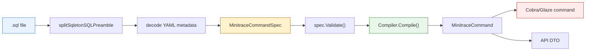
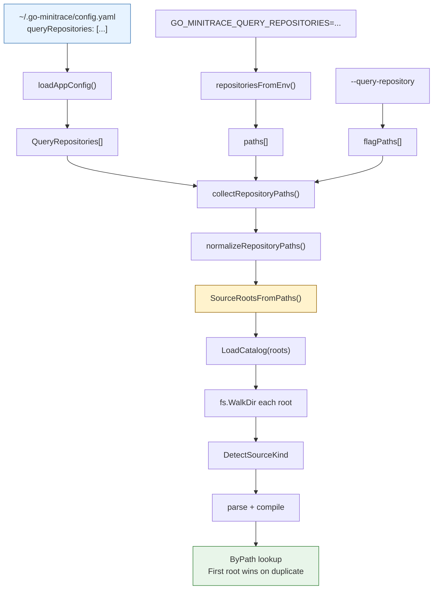
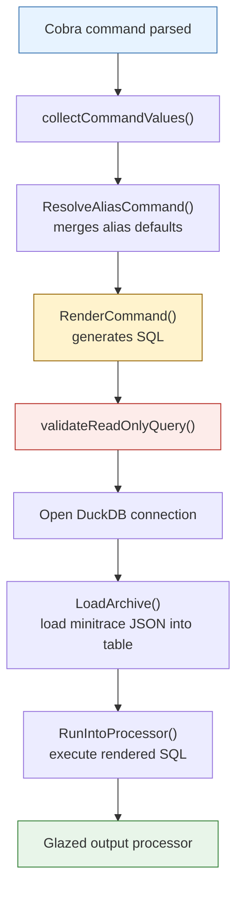

# Minitrace Query Commands - Sqleton-Inspired SQL Verb System

This project documents the addition of a sqleton-inspired SQL verb/query command system to go-minitrace. The feature adds a structured query catalog layer that lets teams define, discover, and execute parameterized SQL queries as named commands. Commands are defined in source files (`.sql` with YAML preambles, `.alias.yaml` for shortcuts), loaded from embedded and external repositories, and exposed through both a CLI subgroup (`go-minitrace query commands`) and a v2 HTTP API for the web UI.

> [!summary]
> The feature adds a complete repository-backed query command system to go-minitrace, inspired by sqleton's SQL command file format and Glazed's parameter definition system:
> 1. **Source layer**: SQL commands as `.sql` files with `/* sqleton ... */` YAML preambles; shortcuts as `.alias.yaml`
> 2. **Catalog layer**: `pkg/minitracecmd` loads and indexes commands from embedded and external repository roots
> 3. **CLI layer**: `go-minitrace query commands <name>` exposes repository commands as a Glazed-powered CLI subgroup
> 4. **API layer**: `GET/POST /api/v2/query-commands` exposes the catalog and execution through HTTP
> 5. **UI layer**: Query Editor sidebar gets a new "Commands" section with dynamic forms and SQL preview

## Why this work existed

### The gap

Before this work, go-minitrace had two query surfaces:

1. **Ad hoc raw SQL**: pass any SQL to `go-minitrace query duckdb --sql "SELECT ..."` or the web UI editor
2. **Named presets**: a fixed set of embedded SQL files resolved by name only

Neither surface supported:
- parameterized queries with typed flags
- repository-based discovery of shared team queries
- aliases / shortcuts with pre-applied defaults
- structured help metadata for UI form rendering
- a clean CLI verb model for analytics workflows

The gap mattered because serious transcript analysis quickly becomes repetitive. The same query patterns (session lists, framework breakdowns, tool timing, failure analysis) get rewritten in slightly different forms across investigations. A shared command library solves that the same way shell aliases solve repeated command patterns.

### What sqleton already solved

Sqleton had already designed and implemented the right source model:

```sql
/* sqleton
name: session-list
short: List minitrace sessions
flags:
  - name: framework
    type: stringList
    help: Filter by agent framework
*/
SELECT id, title, ...
FROM {{TABLE_NAME}}
WHERE ...
```

This format is:
- Human-readable SQL first
- Machine-parseable metadata
- File-system-discoverable
- Version-controllable

The question was not "should go-minitrace use this format?" It was: "how should go-minitrace implement the catalog, CLI, API, and UI layers around it?"

### What the design process found

The docmgr tickets GMT-002 and GMT-003 went through an extensive design phase before any code was written. Two design docs were produced:

- **01-sqleton-style-verb-query-loading**: An exhaustive analysis comparing sqleton's architecture to go-minitrace's current query system, proposing a full implementation plan across six phases
- **02-minitracecommand-implementation-plan**: A concrete type design and file-by-file implementation plan using the name `MinitraceCommand` and reusing Glazed's `fields.Definition` directly

The key design decision was: **reuse the sqleton source format and Glazed parameter definitions, but build go-minitrace-native catalog, renderer, and execution**.

## Current project status

The feature is implemented and merged (PR #5: "feat(query): Add support for repository-backed SQL commands"). The core deliverables are:

**Done:**
- `pkg/minitracecmd` package with types, parsing, compilation, and catalog loading
- `pkg/minitracecmd/render.go` + `render_helpers.go` for safe SQL template rendering
- Repository discovery via config file, environment variable, and CLI flags
- Embedded command catalog with three initial commands (`session-list`, `framework-summary`, `timing-analysis`)
- One alias example (`codex-framework-summary.alias.yaml`)
- CLI subgroup `go-minitrace query commands ...` with Glazed-powered flags and sections
- v2 API handlers for catalog listing and command execution
- Protobuf schema for the API transport contract
- Frontend: Query Editor sidebar "Commands" section, dynamic `QueryCommandForm`, SQL preview panel
- SQL validation helpers (`sqlString`, `sqlStringIn`, `sqlIntIn`, `sqlLike`, plus `sqlIntIn` now accepts JSON numeric arrays)
- Repository config support via `queryRepositories` in app config and `GO_MINITRACE_QUERY_REPOSITORIES` env

**Done as follow-up:**
- Legacy HTTP v1 endpoints removed (GMT-004)
- Dagger-based pnpm frontend builds in release pipeline (GMT-005)
- Proper repository flag splitting before subprocess startup

**In progress:**
- Continued smoke test coverage
- Documentation of the command authoring workflow

## Project shape

The feature spans four layers across three packages:

```
pkg/minitracecmd/          # Core catalog and rendering
  types.go                 # MinitraceCommandSpec / MinitraceCommand / Kind enum
  source_kind.go           # DetectSourceKind (sql vs alias vs unknown)
  parse_sql.go             # ParseSQLCommandSpec with preamble splitting
  parse_alias.go           # ParseAliasSpec from .alias.yaml
  compiler.go              # Compile spec -> runtime command, bool flag normalization
  catalog.go               # LoadCatalog from multiple SourceRoots, alias resolution
  render.go                # RenderCommand with template execution
  render_helpers.go        # sqlString, sqlStringIn, sqlIntIn, sqlLike helpers
  repositories.go         # Config/env/flag repository discovery
  errors.go                 # Sentinel error values
  core/                    # Embedded command repository
    session-list.sql
    framework-summary.sql
    timing-analysis.sql
    aliases/
      codex-framework-summary.alias.yaml

cmd/go-minitrace/cmds/query/  # CLI integration
  commands.go                 # NewCommandsCommand, mounts catalog under query subgroup
  command_runtime.go          # MinitraceCatalogGlazeCommand, executes rendered SQL
  runtime_section.go          # Shared query runtime flags (archive-glob, db-path, etc.)

cmd/go-minitrace/cmds/serve/  # HTTP API integration
  handlers_query_commands_v2.go  # GET /api/v2/query-commands, POST .../execute

web/src/                      # Frontend integration
  types/queryCommand.ts       # UI-facing QueryCommand type
  api/queryCommandAdapter.ts  # Fetches commands, decodes protobuf
  pages/QueryEditorPage.tsx   # Updated with Commands sidebar section
  components/QueryEditor/
    QueryCommandForm.tsx      # Dynamic form from parameter definitions
    SqlCodeViewer.tsx         # SQL preview panel with highlighting
```

## Architecture

### Source file format

SQL commands are defined as regular `.sql` files with a YAML metadata preamble:

```sql
/* sqleton
name: session-list
short: List minitrace sessions
flags:
  - name: framework
    type: stringList
    help: Filter by agent framework
  - name: title_like
    type: string
    help: Filter titles with LIKE
  - name: limit
    type: int
    default: 100
    help: Limit the number of rows returned
*/
SELECT
  id,
  environment->>'agent_framework' AS framework,
  title,
  ...
FROM {{TABLE_NAME}}
WHERE 1=1
{{ if .framework -}}
AND (environment->>'agent_framework') IN ({{ .framework | sqlStringIn }})
{{ end -}}
{{ if .title_like -}}
AND title LIKE {{ .title_like | sqlLike }}
{{ end -}}
ORDER BY timing->>'started_at' DESC
LIMIT {{ .limit }};
```

Aliases are defined as `.alias.yaml` files:

```yaml
name: codex-framework-summary
short: Summarize only codex sessions
aliasFor: framework-summary
flags:
  framework:
    - codex
```

### Parsing pipeline



The preamble splitting enforces three rules:
1. The file must start with `/* sqleton` (stripping BOM, leading whitespace)
2. The preamble must close with `*/`
3. The metadata must not be empty, and a SQL body must exist after the preamble

### Repository discovery

Commands are loaded from multiple repository roots with deterministic precedence:



The precedence rule is: **first root wins on duplicate paths**. Earlier repositories override later ones. The embedded repository is always mounted last, so external repositories can override built-in commands.

### SQL rendering

Rendering produces a final read-only SQL string from a command and a values map:

```go
func RenderCommand(cmd *MinitraceCommand, ctx RenderContext) (string, error) {
    // 1. Replace {{TABLE_NAME}} with the validated table name
    // 2. Execute template with values map + safe helper funcs
    // 3. Return trimmed SQL string
}
```

The helper funcs make parameter injection safe:

- `sqlString` - single string with escaping
- `sqlLike` - LIKE pattern with escaping
- `sqlStringIn` - comma-separated single-quoted strings
- `sqlIntIn` - comma-separated integers (now accepts JSON numeric arrays too)

All helpers escape single quotes. The template uses `missingkey=zero` so omitted values produce empty results rather than template errors.

### CLI execution flow

```
go-minitrace query commands session-list \
  --archive-glob './output/active/*/*.minitrace.json' \
  --framework codex --limit 50
```



### API execution flow

The v2 API exposes two endpoints:

- `GET /api/v2/query-commands` — lists all commands with parameter metadata
- `POST /api/v2/query-commands/{path...}/execute` — renders and optionally executes a command

The execution path is the same as the CLI: resolve alias → render SQL → validate → execute.

## Key implementation decisions

### 1. Reusing Glazed field definitions directly

The most important structural decision was storing `[]*fields.Definition` directly on `MinitraceCommand`, rather than inventing a parallel parameter schema:

```go
type MinitraceCommand struct {
    Flags     []*fields.Definition
    Arguments []*fields.Definition
    // ...
}
```

This pays off in two ways:
- CLI compilation can pass them directly to `cmds.WithFlags(...)` without an adapter layer
- The same definitions drive both CLI and UI form rendering

The tradeoff is that the canonical in-memory type is coupled to Glazed's internal structure. That was accepted because go-minitrace already depends on Glazed heavily.

### 2. Bool flag normalization at compile time

Optional boolean flags without explicit defaults are normalized to `false` at compilation:

```go
func normalizeOptionalBoolFlags(flags []*fields.Definition) []*fields.Definition {
    for _, flag := range flags {
        if flag.Type == TypeBool && !flag.Required && flag.Default == nil {
            cloned.Default = ptr(false)  // safe non-nil default
        }
    }
}
```

This matters for template rendering: without a default, omitted bool flags produce `<no value>` in templates. With the normalization, `{{ .only_active }}` renders as `false` and produces sensible conditional output.

### 3. Source-kind detection is deterministic

File identity is determined by extension before parsing:

```go
func DetectSourceKind(path string) SourceKind {
    switch {
    case strings.HasSuffix(lower, ".alias.yaml"), strings.HasSuffix(lower, ".alias.yml"):
        return SourceYAMLAlias
    case strings.HasSuffix(lower, ".sql"):
        return SourceSQLCommand
    default:
        return SourceUnknown
    }
}
```

A `.sql` file is only treated as a SQL command if it also has a valid `/* sqleton ... */` preamble. Plain `.sql` files without preambles are silently skipped.

### 4. First root wins on duplicate paths

When multiple repository roots contain commands at the same relative path, the first root's version wins. This lets teams override embedded commands by placing a file at the same path in an earlier repository.

### 5. Protobuf schema mirrors, but does not expose, Go types

The API transport uses an explicit protobuf contract rather than directly exposing Glazed structs:

```proto
message QueryCommandParam {
  string name = 1;
  string type = 2;
  string help = 3;
  bool required = 4;
  string default_json = 5;
  repeated string choices = 6;
  bool positional = 7;
}

message QueryCommand {
  string name = 1;
  string folder = 2;
  string path = 3;
  repeated QueryCommandParam flags = 6;
  repeated QueryCommandParam arguments = 7;
  string kind = 10;  // "verb" or "alias"
  string alias_for = 11;
}
```

This keeps the wire contract stable independently of Go implementation details.

## Key files

### Core library

| File | Purpose |
|------|---------|
| `pkg/minitracecmd/types.go` | `MinitraceCommandSpec`, `MinitraceCommand`, `MinitraceCommandKind` |
| `pkg/minitracecmd/source_kind.go` | `DetectSourceKind`, `LooksLikeSqletonSQLCommand` |
| `pkg/minitracecmd/parse_sql.go` | `ParseSQLCommandSpec`, `splitSqletonSQLPreamble` |
| `pkg/minitracecmd/parse_alias.go` | `ParseAliasSpec` |
| `pkg/minitracecmd/compiler.go` | `Compiler.Compile`, bool flag normalization |
| `pkg/minitracecmd/catalog.go` | `LoadCatalog`, multi-root merge, alias resolution |
| `pkg/minitracecmd/render.go` | `RenderCommand`, `ResolveAliasCommand` |
| `pkg/minitracecmd/render_helpers.go` | `sqlString`, `sqlStringIn`, `sqlIntIn`, `sqlLike` |
| `pkg/minitracecmd/repositories.go` | Config/env/flag repository discovery |
| `pkg/minitracecmd/errors.go` | Sentinel errors |

### CLI integration

| File | Purpose |
|------|---------|
| `cmd/go-minitrace/cmds/query/commands.go` | `NewCommandsCommand` — mounts catalog as CLI subgroup |
| `cmd/go-minitrace/cmds/query/command_runtime.go` | `MinitraceCatalogGlazeCommand` — CLI execution adapter |
| `cmd/go-minitrace/cmds/query/runtime_section.go` | Shared query runtime flags (archive-glob, db-path, etc.) |

### API integration

| File | Purpose |
|------|---------|
| `cmd/go-minitrace/cmds/serve/handlers_query_commands_v2.go` | v2 API handlers |
| `proto/go_go_golems/minitrace/api/v1/query_commands.proto` | Transport schema |

### Embedded commands

| File | Purpose |
|------|---------|
| `pkg/minitracecmd/core/session-list.sql` | List sessions with filtering |
| `pkg/minitracecmd/core/framework-summary.sql` | Framework-level timing and metrics summary |
| `pkg/minitracecmd/core/timing-analysis.sql` | Timing comparison by framework |
| `pkg/minitracecmd/core/aliases/codex-framework-summary.alias.yaml` | Example alias |

## Design doc references

The feature was designed across two docmgr tickets:

- `GMT-002` (`ttmp/2026/04/08/`): sqleton-style verb query loading — architecture analysis, design, and implementation guide
- `GMT-003` (`ttmp/2026/04/09/`): repository config and flag support

The key design doc files are:

- `design-doc/01-sqleton-style-verb-query-loading-for-go-minitrace-analysis-design-and-implementation-guide.md` — exhaustive gap analysis and phased implementation plan
- `design-doc/02-minitracecommand-implementation-plan-with-glazed-parameter-definition-reuse.md` — concrete type design and file-by-file PR plan

## Related work

### Sqleton SQL Command Cleanup (April 2)

The sqleton side cleaned up its own command loader in parallel. That work:
- moved from YAML-encapsulated SQL to SQL-first files with metadata preambles
- separated app config from command config (removing Viper from sqleton startup)
- added explicit `.alias.yaml` support
- proved the source format end-to-end with smoke tests

The go-minitrace work built directly on that proven format. The commit sequence in sqleton (`f3c8e23` through `afadbf9`) shows the cleanup arc that validated the format before go-minitrace adopted it.

### Cross-Model Transcript Analysis

During the implementation, both MiniMax-M2.7 and GPT-5.4 worked on implementing the same feature (Phase 1 of the go-minitrace work) in separate workspaces. A comparative transcript analysis was conducted using go-minitrace itself, which produced:

- Behavioral metrics: minimax wrote 2.5x more test code; GPT-5.4 read 3.3x more files
- Pattern analysis: minimax exhibits test-first iteration; GPT-5.4 exhibits read-heavy exploration
- Code quality parity: Phase 1 implementations are equivalent in correctness

That analysis is documented in the vault at [[PROJ - Cross-Model Transcript Analysis - Minimax M2.7 vs GPT-5.4]].

### Annotation System

The annotation system (implemented before this feature, documented in [[PROJ - go-minitrace - Annotation System]]) provides the boundary event metadata that makes structured query analysis meaningful. Commands like `timing-analysis` depend on annotation data being present in the archive.

## Open questions

1. **Should the raw SQL editor and the command forms coexist permanently?** The current design keeps both. Is there a consolidation point where most raw SQL work moves to command forms?
2. **Should command authors have a publishing/registry story?** Currently repositories are directory-based. Is there value in a versioned command registry?
3. **Should the embedded command set grow?** The current three commands + one alias are a minimal viable set. What commands would most improve day-to-day transcript analysis?
4. **Should aliases appear as separate sidebar entries?** Currently they do. Should they be resolved into the target command with a "via alias" indicator instead?
5. **Should the template helper surface expand?** Currently: `sqlString`, `sqlLike`, `sqlStringIn`, `sqlIntIn`. What else would command authors need?

## Near-term next steps

1. Document the command authoring workflow: how to create a new `.sql` command and `.alias.yaml` shortcut
2. Expand the embedded command set with additional analysis commands
3. Add Storybook coverage for each QueryCommandForm parameter type
4. Consider a "render-only" mode in the UI to show the generated SQL before execution
5. Validate whether future analysis investigations use fewer ad hoc SQL scripts thanks to the command library

## Project working rule

> [!important]
> Commands should feel like first-class named tools, not like parameterized SQL snippets. If a user cannot describe what a command does in one sentence, the command's metadata needs work.

## Related vault notes

- [[PROJ - Improving Minitrace and Transcript Analysis]] — broader improvement agenda
- [[PROJ - Cross-Model Transcript Analysis - Minimax M2.7 vs GPT-5.4]] — comparative analysis using this feature
- [[PROJ - Sqleton SQL Command Cleanup]] — the sqleton-side work that validated the format
- [[PROJ - go-minitrace - Annotation System]] — prerequisite boundary event metadata
- [[Code Review with go-minitrace]] — methodology for transcript-driven review

## KB reviews

- [[KB-BATCH5-infra-secrets-glazed]] (2026-05-11) — concept extraction + classification
