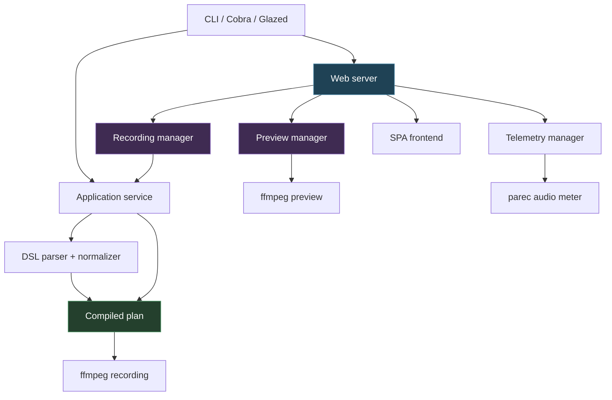
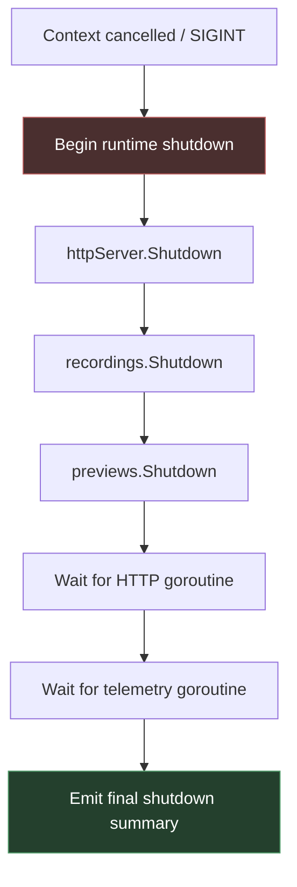

# Screencast Studio

Screencast Studio is a local, CLI-first screencast system that combines a compiled setup DSL, a web control server, ffmpeg-based recording and preview pipelines, and runtime telemetry for media-oriented workflows. It sits in an interesting design space: more structured than a pile of shell scripts, but intentionally lighter and more local than a full desktop application stack.

> [!summary]
> 1. The project is built around a **compiled recording plan** rather than directly around ffmpeg command lines.
> 2. The web server is not only a transport layer; it is also the runtime host for recording, preview, and telemetry managers.
> 3. ffmpeg remains the execution engine, but the repository adds a strong intermediate model: DSL → normalized config → compiled plan → managed processes.
> 4. The most interesting engineering work in the current state is around runtime ownership, cancellation, and subprocess supervision.

## Why this project exists

A lot of recording workflows start as ad hoc command lines, desktop automation, and half-remembered ffmpeg incantations. That works for one-off captures, but it degrades quickly when the user wants:

- repeatable setup descriptions,
- preview streams,
- a local control surface,
- multiple capture source types,
- audio mixing,
- runtime state tracking,
- bounded stop and shutdown behavior.

Screencast Studio exists to turn that class of work into a real local system instead of a loose bundle of commands.

The project is especially interesting because it does **not** try to replace ffmpeg with a custom media engine. Instead, it embraces ffmpeg as the low-level execution tool and focuses on the layers above it:

- modeling,
- normalization,
- planning,
- transport,
- manager ownership,
- user-facing orchestration.

## Current project status

The repository already has a substantial skeleton and several functioning runtime pieces.

What exists today:

- a Go CLI entrypoint,
- a `serve` mode with an HTTP API and frontend,
- a `record` mode for compiled-plan execution,
- a DSL for video/audio setup descriptions,
- plan compilation into concrete recording jobs,
- ffmpeg-backed recording workers,
- ffmpeg-backed preview workers,
- a `parec`-backed telemetry loop for audio metering,
- ticketed design work around cancellation and subprocess lifecycle management.

What still feels in-progress:

- final output-policy features (templating/overwrite semantics still need explicit productization work),
- higher-confidence subprocess hardening in the recording path,
- more complete manual validation scenarios for mixed runtime shutdown,
- likely further polish in the serve UX and output review workflow.

## Project shape

At a high level, the repository has five layers.

1. **CLI layer**
   - user entrypoints such as `serve` and `record`
2. **Application layer**
   - service-shaped methods for discovery, normalization, compilation, and recording execution
3. **Web layer**
   - HTTP handlers and a local SPA control surface
4. **Runtime manager layer**
   - recording, preview, telemetry ownership and state
5. **Execution layer**
   - ffmpeg and parec subprocesses

That layering is what makes the project more than “a server that shells out.”

## Architecture



## Entry points and top-level runtime

The main binary entrypoint is minimal:

- `cmd/screencast-studio/main.go`

That file delegates almost immediately into the CLI package, which is where the real runtime shape begins.

Primary CLI wiring lives in:

- `pkg/cli/root.go`
- `pkg/cli/serve.go`
- `pkg/cli/record.go`

This is a useful design choice. It keeps the binary entrypoint boring and pushes meaningful behavior into testable package code.

## The CLI model

The CLI uses a Glazed/Cobra-based structure and exposes two main runtime faces:

### `record`

This path compiles a setup file and executes it directly. It is the simpler execution mode for one-shot use.

### `serve`

This path launches the local control server and web frontend. This is the more interesting mode architecturally because it creates a persistent runtime that can start and stop additional work over time.

That distinction matters. The `record` command is mostly a single execution pipeline. The `serve` command is a long-lived orchestration runtime.

## The DSL and normalized config layer

The DSL types live in:

- `pkg/dsl/types.go`
- `pkg/dsl/normalize.go`

The DSL shape includes:

- `destination_templates`
- video source definitions
- audio source definitions
- video defaults
- audio defaults
- audio mix configuration

The important conceptual shift is that the raw config is not executed directly. It is first normalized into an `EffectiveConfig`.

That normalized config does several jobs:

- fills defaults,
- canonicalizes source identity and names,
- checks template existence,
- chooses default codecs and capture settings,
- accumulates warnings for partially specified or not-yet-implemented features.

This is a good design. It means the project can tell the user “your setup is structurally valid, but here are warnings” instead of forcing every edge case to surface later as a runtime ffmpeg failure.

## Destination templates and output planning

The destination model is driven by `destination_templates`, referenced by name from sources and audio mix definitions.

The key types are:

- `DestinationTemplates map[string]string`
- `DestinationTemplate string` on video sources
- `AudioMixTemplate string` in the effective config
- `PlannedOutput` in the compiled plan

This means output paths are not hardcoded per runtime job. They are part of the plan-building stage.

That is important because it gives the system a place to add future policy such as:

- richer path templating,
- safer output naming conventions,
- collision policies,
- “fail if exists” behavior,
- review-time output summaries.

Right now the repo already has the structural place for those capabilities even if some product-level behavior remains to be added.

## The compiled plan as the central abstraction

The compiled plan is the conceptual heart of the system.

Relevant type:

- `pkg/dsl/types.go` → `CompiledPlan`

The plan contains:

- `SessionID`
- `VideoJobs []VideoJob`
- `AudioJobs []AudioMixJob`
- `Outputs []PlannedOutput`
- `Warnings []string`

This is the right abstraction boundary.

Instead of asking “what ffmpeg command should I run?”, the runtime asks:

- what jobs exist,
- which outputs do they produce,
- what warnings already exist,
- what session ID identifies this run,
- what should the web layer present back to the user.

That separation is the reason the project can support both `record` and `serve` without duplicating its core logic.

## Application service layer

The application facade lives in:

- `pkg/app/application.go`

It exposes methods such as:

- `DiscoverySnapshot(...)`
- `NormalizeDSL(...)`
- `CompileDSL(...)`
- `RecordPlan(...)`
- `RecordFile(...)`

This layer is intentionally thin. It is not trying to own long-lived runtime work itself. Instead, it gives the CLI and web layers a stable service boundary over the DSL, discovery, and recording runtime.

That makes the rest of the project easier to reason about because transport concerns do not need to know how planning and execution are implemented internally.

## The web server as runtime host

The web server is implemented in:

- `internal/web/server.go`
- `internal/web/routes.go`
- `internal/web/handlers_api.go`
- related handler files

This layer is more than request routing. It constructs and owns:

- a recording manager,
- a preview manager,
- a telemetry manager,
- the HTTP listener,
- the event hub that feeds websocket-style runtime updates.

This is the point where the architecture became especially interesting: once the web server starts owning background work, it becomes a **runtime supervisor**, not just a transport layer.

That insight drove the later cancellation refactor work.

## Runtime managers

### Recording manager

Implemented in:

- `internal/web/session_manager.go`

Responsibilities:

- compile DSL into a plan for recording,
- start a managed recording session,
- expose current recording state,
- stop the active recording,
- publish session state and process logs,
- now also support explicit `Shutdown(ctx)`.

It is the web-facing owner of one live recording session.

### Preview manager

Implemented in:

- `internal/web/preview_manager.go`
- `internal/web/preview_runner.go`

Responsibilities:

- ensure a preview exists for a source,
- reuse or create preview workers,
- manage preview leases,
- expose current preview state and latest frame,
- cancel previews on release,
- now also support explicit `Shutdown(ctx)`.

This is a subtly different ownership model from recording because previews are multiplexed and can exist in plural.

### Telemetry manager

Implemented in:

- `internal/web/telemetry_manager.go`

Responsibilities:

- track current telemetry target from the compiled plan,
- emit disk telemetry snapshots,
- spawn an audio meter subprocess (`parec`) when an audio target exists,
- publish telemetry events for the frontend.

The telemetry manager remains context-driven rather than exposing a separate `Shutdown(ctx)` API. That is a deliberate design choice in the current state, not an omission.

## Recording execution internals

The low-level recording runtime lives in:

- `pkg/recording/run.go`
- `pkg/recording/session.go`
- `pkg/recording/events.go`

This part of the repo is where the actual process supervision semantics live.

The key pieces are:

- `ManagedProcess`
- `Run(...)`
- `stopProcesses(...)`
- session state transitions (`starting`, `running`, `stopping`, `finished`, `failed`)

### Mental model

A compiled plan becomes a set of managed processes.

The runtime:

1. builds process arguments for each video/audio job,
2. starts managed ffmpeg processes,
3. tracks state transitions through a session event loop,
4. on cancellation or failure, begins a stop sequence,
5. attempts graceful stop before forced kill.

This is exactly the right level of abstraction for a media-oriented local tool. It is lower-level than the web manager, but higher-level than raw `exec.Command(...)` calls scattered across the codebase.

## Preview execution internals

Preview execution is lighter than full recording.

The preview runner uses ffmpeg to emit MJPEG frames over a pipe. The web layer then exposes those frames through a preview endpoint so the frontend can show live preview streams.

This is an elegant design because it reuses ffmpeg’s strengths:

- source capture,
- scaling,
- frame-rate reduction,
- JPEG encoding.

The Go code then focuses on:

- process lifecycle,
- frame piping,
- HTTP transport,
- runtime ownership.

## Telemetry execution internals

The telemetry path uses:

- disk telemetry from filesystem stats,
- audio telemetry from `parec` raw audio samples.

The telemetry manager then converts raw samples into peak levels and publishes higher-level events to the rest of the system.

This is a nice example of using small Unix tools for capture while keeping domain logic in Go.

## Contexts, ownership, and cancellation

This is the deepest part of the current architecture work.

The main cancellation lesson from the repository is that it is not enough for the server to *contain* managers structurally. The work started by those managers must also be rooted in the server’s runtime context operationally.

The refactor that now exists in the repo did three important things:

1. the serve runtime context is created before `NewServer(...)`,
2. the recording and preview managers receive that context at construction time,
3. the server now explicitly drains those managers on shutdown.

That moves the system toward a much more trustworthy ownership model.

## Staged shutdown in practice

The current shutdown sequence in `internal/web/server.go` is now intentionally ordered.



That sequence matters because it closes the intake surface before asking background work to drain.

## What the manual serve run showed

A useful real-world validation run was done by:

- building the binary,
- running `serve`,
- interrupting it with `SIGINT` via `timeout -s INT`.

The interesting surprise was that browser auto-open meant the supposedly idle run was not idle at all. The frontend immediately started hitting backend endpoints and creating a preview.

That turned out to be helpful because it validated a more realistic shutdown path:

- telemetry started,
- preview ffmpeg started,
- MJPEG streaming began,
- shutdown was triggered,
- telemetry exited,
- preview ffmpeg exited on context cancellation,
- HTTP shutdown finished,
- manager shutdown hooks saw no remaining active work,
- final summary reported no active recording and no remaining previews.

This is exactly the kind of “better than synthetic” local validation that makes systems like this easier to trust.

## Code locations worth reading first

If I were onboarding a new engineer to this repo, I would start in this order:

1. `pkg/cli/root.go`
2. `pkg/cli/serve.go`
3. `internal/web/server.go`
4. `internal/web/routes.go`
5. `internal/web/handlers_api.go`
6. `internal/web/session_manager.go`
7. `internal/web/preview_manager.go`
8. `internal/web/preview_runner.go`
9. `internal/web/telemetry_manager.go`
10. `pkg/app/application.go`
11. `pkg/dsl/types.go`
12. `pkg/dsl/normalize.go`
13. `pkg/recording/run.go`
14. `pkg/recording/session.go`

That order reveals the system from outside inward.

## Implementation details

### The main architectural bet

The central bet in Screencast Studio is that **planning** should be a first-class runtime layer.

This is what makes the repo coherent.

Without that layer, the project would devolve into:

- web handlers directly building ffmpeg arguments,
- UI concepts leaking into execution code,
- output handling being an afterthought,
- cancellation being spread across unrelated files.

Instead, the current design lets each layer do one main job:

- DSL layer describes intent,
- app layer compiles and delegates,
- web layer supervises runtime behavior,
- recording layer owns subprocess execution.

### A simplified flow

```text
user edits setup DSL
→ NormalizeDSL
→ CompileDSL
→ CompiledPlan
→ web manager starts recording or preview
→ ffmpeg / parec process starts
→ runtime events flow back through managers
→ frontend observes session/preview/telemetry state
```

This is a strong architecture for a project of this size.

## Open questions

- How rich should destination templating become?
- Should output collision policy be configurable (fail if exists vs timestamped unique names vs overwrite)?
- How far should process hardening go in the recording layer — `SIGTERM`, process groups, deeper wait semantics?
- Should browser auto-open remain always-on, or become configurable for debugging and tests?
- Should telemetry eventually get its own explicit shutdown API for symmetry, or stay context-driven?

## Near-term next steps

- harden `ManagedProcess.Stop(...)` further if needed,
- add more manual validation scenarios:
  - active recording + `Ctrl-C`
  - mixed preview + recording + `Ctrl-C`
- productize output policy choices,
- continue documenting the actual live runtime behavior as it evolves.

## Project working rule

> [!important]
> Treat the web server as a runtime supervisor, not just as a transport surface.
> That one design choice makes the rest of the process-management story much easier to keep coherent.

## Related notes

- [[Process Supervision and Cancellation: Designing Reliable Long-Lived Local Servers]]
- [[Designing Process Supervision and Cancellation in Local Tools]]
