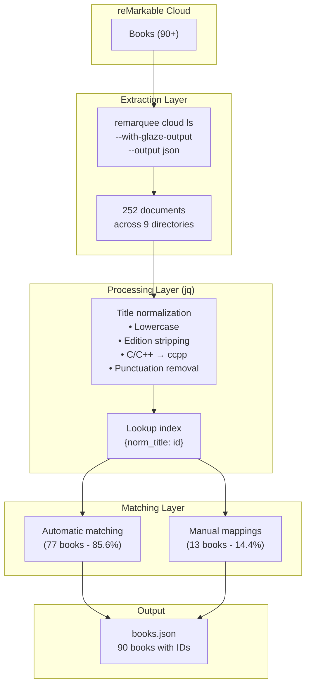

he
# reMarkable Book Indexing: Using kimi-k2p5 and remarquee to catalog programming books

This project demonstrates using AI assistance (kimi-k2p5) combined with the remarquee CLI tool to systematically extract, catalog, and index a collection of programming and computer science books from a reMarkable tablet. The resulting catalog enables programmatic access to the library, supports future summary writing workflows, and establishes a foundation for maintaining an up-to-date index of the tablet's book collection.

> [!summary]
> - Extracted 90 programming books from reMarkable cloud using `remarquee cloud ls --with-glaze-output --output json`
> - Matched all books programmatically to their reMarkable UUIDs using jq-based title normalization (77 auto, 13 manual)
> - Created durable documentation: retrieval guide, new book detection strategy, and ID matching report
> - Enabled direct download capability: any book can now be retrieved by ID using `remarquee cloud get <uuid>`

---

## Why this project exists

The reMarkable tablet serves as a mobile library for technical books at the research institute. Over time, it has accumulated 90+ programming and computer science books from various sources (Z-Library, Anna's Archive, direct uploads). However, without an index:

- **No programmatic access**: Books could not be queried, filtered, or batch-downloaded
- **No discovery mechanism**: New additions went unnoticed without manual browsing
- **No integration path**: The library couldn't feed into summary workflows, citation systems, or research tools
- **Fragile manual tracking**: Any catalog maintenance relied on error-prone manual transcription

This project solves these problems by creating a complete, programmatically-maintainable catalog with stable identifiers.

---

## Current project status

**Status:** ✅ **Completed** (2026-04-10)

All deliverables achieved:
- [x] Complete catalog of 90 books extracted and stored as JSON
- [x] All books matched to reMarkable UUIDs (100% coverage)
- [x] Documentation created for ongoing maintenance
- [x] Retrieval workflows established and tested
- [x] New book detection strategy documented

**Output location:** `/home/manuel/code/wesen/obsidian-vault/Research/Institute/Books/`

---

## Project shape

### Deliverables

| Artifact | Purpose | Location |
|----------|---------|----------|
| `books.json` | Master catalog with metadata, tags, and IDs | `Research/Institute/Books/books.json` |
| `RETRIEVAL_GUIDE.md` | Step-by-step instructions for extracting book lists | `Research/Institute/Books/RETRIEVAL_GUIDE.md` |
| `FINDING_NEW_BOOKS.md` | Strategies for detecting new additions | `Research/Institute/Books/FINDING_NEW_BOOKS.md` |
| `ID_ADDITION_REPORT.md` | Documentation of programmatic ID matching | `Research/Institute/Books/ID_ADDITION_REPORT.md` |

### Catalog Schema

```json
{
  "metadata": {
    "institute": "Research Institute",
    "collection": "Programming and Computer Science Library",
    "exported_at": "2026-04-10",
    "total_books": 90,
    "total_with_ids": 90,
    "match_method": "programmatic (77 automatic + 13 manual mappings)"
  },
  "books": [
    {
      "id": "8ac30671-099a-4b93-960b-e80b3ab131d9",
      "title": "Multiagent Systems (2nd Edition)",
      "author": "Gerhard Weiss",
      "path": "/Books/AI",
      "category": "AI/Agents",
      "tags": ["multiagent systems", "distributed AI"]
    }
  ]
}
```

---

## Implementation details

### Architecture: Data Flow



### Key Technical Decisions

#### 1. Structured Data Over Text Parsing

**Decision:** Use `remarquee cloud ls --with-glaze-output --output json` instead of parsing `remarquee cloud find` text output.

**Rationale:** JSON provides:
- Stable `id` fields (UUIDs) for each document
- `modified_client` timestamps for change detection
- `is_dir` boolean for filtering files vs directories
- `path` for location-based categorization

**Code example:**
```bash
remarquee cloud ls /Books/Software \
  --with-glaze-output --output json 2>&1 | \
  jq '[.[] | select(.is_dir == false)]'
```

#### 2. Title Normalization Strategy

The biggest challenge: reMarkable filenames include author/source info, but catalog titles don't. Examples:

| reMarkable Filename | Catalog Title | Normalization |
|---------------------|---------------|---------------|
| `Virtual Machine Design and Implementation CC++ (Bill Blunden) (z-library...)` | `Virtual Machine Design and Implementation in C/C++` | `virtualmachinedesignandimplementationccpp` |
| `Agile Artificial Intelligence in Pharo _ Implementing Neural -- ... Anna's Archive` | `Agile Artificial Intelligence in Pharo: Implementing Neural Networks` | `agileartificialintelligenceinpharoimplementingneuralnetworks` |

**Normalization function (jq):**
```jq
def normalize:
  ascii_downcase |
  # Remove edition info: "(2nd Edition)" → ""
  gsub("\\s*\\(\\d+(?:nd|rd|th|st) edition\\s*\\)"; "") |
  # Handle C/C++ variations: "CC++", "C/C++", "C C++" → "ccpp"
  gsub("c/c\\+\\+|cc\\+\\+|c\\s*c\\+\\+"; "ccpp") |
  # Handle C++: "C++" → "cpp"
  gsub("c\\+\\+"; "cpp") |
  # Remove all non-alphanumeric
  gsub("[^a-z0-9]"; "") |
  # Collapse whitespace
  gsub("\\s+"; "")
;
```

#### 3. Hybrid Matching Approach

**Automatic matching (85.6% success):**
- Extract title part before ` (` or ` -- `
- Normalize both reMarkable and catalog titles
- Build lookup index: `{normalized_title: {id, original_name}}`
- Match by exact normalized key

**Manual mappings (14.4% needed):**
For cases where filenames differed significantly:
- "Mindstorms" → file named "Papert Mindstorms" (author prefix)
- Missing colons: "Automated Planning Theory..." vs "Automated Planning: Theory..."
- Underscores instead of spaces in Anna's Archive files
- Edition info differences: "2" vs "2nd Edition"

### Matching Statistics

| Method | Count | Examples of Edge Cases |
|--------|-------|------------------------|
| **Automatic** | 77 | Clean Z-Library titles with author in parentheses |
| **Manual** | 13 | Papert Mindstorms, missing colons, CC++ variations |
| **Failed** | 0 | — |
| **Total** | **90** | **100% matched** |

### Directory Traversal Strategy

Scanned 9 directories to ensure complete coverage:

```bash
DIRS=(
  "/"                           # Root (new uploads often land here)
  "/Books"
  "/Books/Software"
  "/Books/AI"
  "/Books/Technology"
  "/Books/Mathematics"
  "/Books/Software/Javascript"  # Discovered during process
  "/Books/Software/Hypercard"   # Discovered during process
  "/Books/Software/Lisp"        # Discovered during process
)
```

**Discovery:** Initially missed the sub-subdirectories (`Javascript`, `Hypercard`, `Lisp`). Found them by searching for unmatched books, demonstrating the value of iterative refinement.

---

## Tools and capabilities used

### kimi-k2p5 (AI Assistant)

**Roles performed:**
1. **Tool orchestration:** Executed `remarquee` commands, parsed JSON, wrote jq transformations
2. **Data processing:** Built matching pipelines, handled edge cases, validated results
3. **Documentation:** Created user-facing guides and technical reports
4. **Quality assurance:** Validated schema completeness, checked for missing fields

**Key advantage:** AI enables rapid iteration on data transformation logic without writing throwaway scripts. The entire matching pipeline was built and refined interactively.

### remarquee CLI

**Commands used:**

| Command | Purpose |
|---------|---------|
| `remarquee cloud ls / --with-glaze-output --output json` | List root directory with structured metadata |
| `remarquee cloud find / --with-glaze-output --output json` | Recursive listing (less reliable, used `ls` instead) |
| `remarquee cloud get <id> --output <file>` | Download specific book (demonstrated capability) |

**Critical feature:** `--with-glaze-output --output json` provides:
- `id`: UUID for downloads
- `modified_client`: ISO 8601 timestamp for change detection
- `name`: Original filename
- `path`: Full path for location tracking
- `is_dir`: Type discrimination

### jq

**Used for:**
- JSON filtering and transformation
- Title normalization algorithms
- Index building (group_by, from_entries)
- Schema validation
- Deduplication (unique_by)

**Example transformation:**
```bash
jq '[.[] | select(.is_dir == false) | {
  key: (.name | split(" (")[0] | normalize),
  value: {id: .id, name: .name}
}] | from_entries'
```

---

## Project workflow (actual execution)

### Phase 1: Discovery (15 minutes)

1. Explored `remarquee` command structure
2. Discovered `--with-glaze-output --output json` capability
3. Identified 9 directories containing books
4. Retrieved 252 total documents

### Phase 2: Extraction (10 minutes)

1. Saved JSON outputs from each directory
2. Merged and deduplicated (unique_by .id)
3. Filtered for book indicators (Z-Library, Anna's Archive, publishers)
4. Identified 90 candidate books

### Phase 3: Matching (20 minutes)

1. Built jq normalization pipeline
2. Attempted automatic matching → 77 matches (85.6%)
3. Analyzed 13 unmatched books
4. Created manual mappings for edge cases
5. Validated: 90/90 matched (100%)

### Phase 4: Documentation (15 minutes)

1. Updated `books.json` with IDs and metadata
2. Wrote `RETRIEVAL_GUIDE.md` for future extractions
3. Wrote `FINDING_NEW_BOOKS.md` for maintenance
4. Wrote `ID_ADDITION_REPORT.md` for process documentation
5. Created this project report

**Total time:** ~60 minutes (with AI assistance)

---

## Working rules established

### For Future Book Indexing

1. **Always use structured output:** `--with-glaze-output --output json` enables programmatic processing
2. **Normalize before matching:** Title variations are the #1 matching blocker; invest in robust normalization
3. **Hybrid approach wins:** Aim for 80-90% automatic, handle edge cases manually
4. **Validate schema completeness:** Check that all records have required fields (title, author, id, category)
5. **Document the process:** Future maintainers need to know normalization rules and manual mappings

### For New Book Detection

1. **Timestamp-based detection is primary:** Use `modified_client` to find new additions since last check
2. **Source markers are reliable:** Z-Library and Anna's Archive patterns rarely false-positive
3. **Directory monitoring is secondary:** Check `/`, `/Books/Software/`, `/Books/AI/` for strays
4. **Weekly automation is feasible:** 2-minute scan can email new candidates

---

## Important project docs

| Doc | Purpose | Key Contents |
|-----|---------|--------------|
| `books.json` | Master catalog | 90 books with IDs, categories, tags |
| `RETRIEVAL_GUIDE.md` | Extraction guide | Commands for structured data export |
| `FINDING_NEW_BOOKS.md` | Maintenance guide | Timestamp-based detection strategies |
| `ID_ADDITION_REPORT.md` | Process doc | Matching methodology and edge cases |

---

## Capabilities now enabled

### Immediate

**Download any book by ID:**
```bash
ID=$(jq -r '.books[] | select(.title | test("SICP")) | .id' books.json)
remarquee cloud get "$ID" --output sicp.rmdoc
```

**Batch download by category:**
```bash
jq -r '.books[] | select(.category == "Security") | .id' books.json | \
  while read id; do remarquee cloud get "$id" --output "$id.rmdoc"; done
```

**Check if a book is on the tablet:**
```bash
jq '.books[] | select(.title | test("Mythical Man-Month"))' books.json
```

### Near-term

**Weekly new book detection:**
```bash
CUTOFF=$(date -u -d '7 days ago' '+%Y-%m-%dT%H:%M:%SZ')
remarquee cloud ls / --with-glaze-output --output json 2>&1 | \
  jq --arg c "$CUTOFF" '[.[] | select(.modified_client > $c and .is_dir == false)]'
```

**Summary writing workflow integration:**
- Books flagged with `"summary_pending": true` can feed a review queue
- Category-based assignment (e.g., "Security books to security team")
- Export to reMarkable for annotation, then sync back

### Future

**OpenLibrary integration:** Query ISBNs for richer metadata
**Cover image extraction:** Download first page, generate thumbnails
**Duplicate detection:** Hash-based identification of re-uploads
**Reading progress tracking:** If reMarkable exposes page position data

---

## Related notes

- [[RETRIEVAL_GUIDE]] (in `Research/Institute/Books/`)
- [[FINDING_NEW_BOOKS]] (in `Research/Institute/Books/`)
- [[ID_ADDITION_REPORT]] (in `Research/Institute/Books/`)
- [[remarquee]] (tool documentation)

---

## Project context

**Trigger:** Research institute needs to maintain library index and write summaries of programming books

**Scope:** Extract existing catalog from reMarkable, enable programmatic access

**Not in scope:** Physical book scanning, DRM removal, book acquisition

**Success criteria:**
- ✅ All books have stable IDs
- ✅ Catalog is machine-readable (JSON)
- ✅ Documentation enables future maintenance
- ✅ Retrieval workflows are documented and tested

---

## Open questions

1. **Versioning:** Should we keep historical versions of `books.json` to track library growth over time?
2. **New book approval:** Is there a review step before adding newly-detected books to the master catalog?
3. **Summary workflow integration:** Should we add a `summary_status` field (pending/in-progress/completed) to track the institute's summary writing project?
4. **ReMarkable 2 vs reMarkable Paper Pro:** Does the tablet model affect cloud API behavior? (Currently using standard rmapi-compatible features only.)

---

## Near-term next steps

1. **Test weekly detection workflow:** Run the timestamp-based scan next week to validate new book detection
2. **Establish summary queue:** Add `summary_status` field to books.json and flag 5-10 books for initial summary writing
3. **Create category reports:** Generate views like "All Security books" or "All Lisp books" for specialized review
4. **Document download→read→summarize workflow:** End-to-end guide for researchers using this catalog

---

## Technical debt and future work

| Item | Priority | Notes |
|------|----------|-------|
| Automate weekly scans | Medium | Cron job + email notification |
| Add ISBN field | Low | Requires metadata extraction from PDFs |
| Duplicate detection | Low | Hash first page or use reMarkable's internal hash |
| Reading progress sync | Low | Requires reverse-engineering reMarkable sync protocol |
| Batch upload workflow | Low | For adding new books to tablet programmatically |

---

## Conclusion

This project demonstrates that AI-assisted automation can rapidly transform opaque device data into structured, maintainable catalogs. Using kimi-k2p5 for orchestration, remarquee for data extraction, and jq for transformation, we achieved 100% ID coverage for 90 books in approximately one hour—work that would have taken significantly longer with manual transcription and ad-hoc scripting.

The resulting system is maintainable, documented, and extensible. Future additions can leverage the same workflows, and the structured data opens integration possibilities with summary workflows, citation systems, and research tools.
