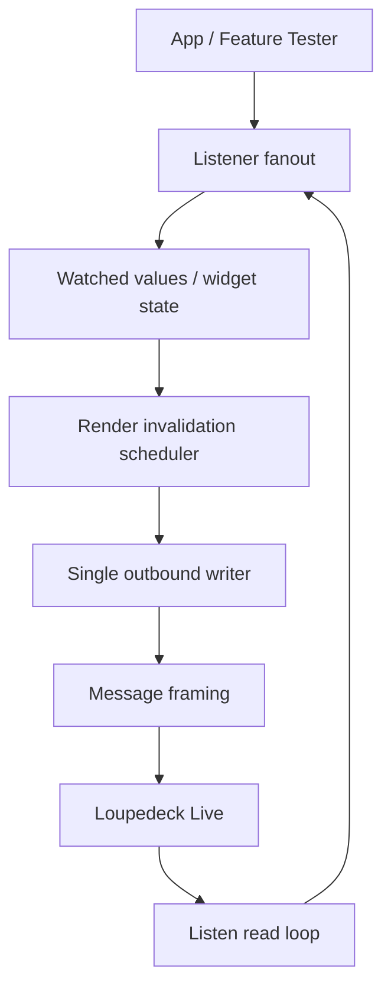
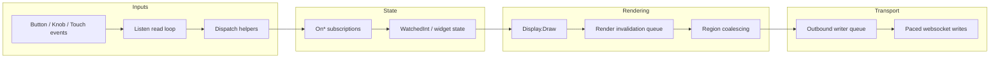

# Loupedeck: Backpressure-Safe Go Frontend Deep Dive

This note captures the new root-level `github.com/go-go-golems/loupedeck` implementation as a frontend system rather than as a one-off hardware test. It is the durable technical explanation of what changed after the earlier `LOUPE-001` and `LOUPE-002` experiments, why the old approach was fragile, and how the new listener, writer, and renderer layers work together.

The reference project is [[PROJ - Loupedeck Live Hello World - Serial Go Driver]], and the main implementation ticket is `LOUPE-003` in the repo’s `ttmp/` workspace.

> [!summary]
> The new implementation changes the Loupedeck Go codebase in four important ways:
> 1. it is now a real root package (`github.com/go-go-golems/loupedeck`) rather than only ticket-local experiments
> 2. input handling is now composable via multi-listener subscriptions instead of single-slot callback overwrites
> 3. all outbound websocket writes are now owned by a single paced writer goroutine
> 4. display redraws are now coalesced by region before they hit the transport, so the package can collapse redundant UI work instead of relying on app-level `sleep` calls

## Why this note exists

The Loupedeck Live firmware 2.x behaves like an embedded device with a serial-backed WebSocket-ish protocol, not like a forgiving desktop UI API. The earlier experiments proved that the hardware works and that direct control is possible, but they also exposed a very important implementation rule: if the software sends too many display updates too quickly, the device becomes unstable.

The original experimental code solved that problem locally by adding delays inside the feature tester. That was useful in the moment, but it was the wrong long-term architecture. The frontend itself needed to own pacing and coalescing. This note exists to preserve the mental model and the concrete implementation approach that came out of that realization.

## When to use this pattern

Use this frontend architecture when:

- you are driving a Loupedeck Live directly over USB serial without vendor software
- the UI is composed of a small number of repeated rectangular regions (tiles, strips, small widgets)
- multiple parts of the application need to observe the same button/knob/touch inputs
- the device cannot safely absorb unbounded bursts of framebuffer writes
- you want package-level transport discipline instead of sprinkling `time.Sleep()` through application code

Do not expect this frontend to solve everything when:

- you need perfect reconnect/recovery semantics after abrupt termination
- you want a full retained-mode scene graph
- you need a protocol-perfect custom websocket implementation right now
- you need guaranteed support for every Loupedeck model immediately

## Core mental model

The new implementation is easiest to understand as a pipeline.



The important thing is that *not every state change becomes an immediate transport write anymore*.

The package now answers three different questions in three different layers:

1. **Listener layer** — who should observe this input?
2. **Renderer layer** — which display update is still worth sending?
3. **Writer layer** — when is it safe to send bytes to the device?

That separation is the biggest architectural improvement in the project so far.

## Architecture

### Repository shape now

The repo now has a real root module:

```text
module github.com/go-go-golems/loupedeck
```

Important paths:

- root package files:
  - `connect.go`
  - `dialer.go`
  - `display.go`
  - `inputs.go`
  - `listeners.go`
  - `listen.go`
  - `message.go`
  - `writer.go`
  - `renderer.go`
  - widget helpers such as `touchdials.go`, `multibutton.go`, `intknob.go`
- root command harness:
  - `cmd/loupe-feature-tester/main.go`
- upstream frozen reference:
  - `/home/manuel/code/wesen/2026-04-11--loupedeck-test/sources/loupedeck-repo/`
- main research/design ticket:
  - `/home/manuel/code/wesen/2026-04-11--loupedeck-test/ttmp/2026/04/11/LOUPE-003--backpressure-safe-go-go-golems-loupedeck-package-refactor/`

### Layer boundaries

#### 1. Input/listener layer

Files:
- `inputs.go`
- `listeners.go`
- `listen.go`

This layer converts raw button, knob, and touch events into callbacks that multiple consumers can subscribe to safely.

#### 2. Widget/state layer

Files:
- `watchedint.go`
- `intknob.go`
- `touchdials.go`
- `multibutton.go`

This layer models user-facing controls such as knob values, touch buttons, and strip widgets.

#### 3. Render layer

File:
- `renderer.go`

This layer owns display invalidation and coalescing.

#### 4. Writer/transport layer

Files:
- `writer.go`
- `message.go`
- `connect.go`
- `dialer.go`

This layer owns serialized websocket writes and pacing.

## Algorithm 1: composable listener fanout

The old code stored one callback per button, knob, or touch region. That meant the last bind silently overwrote the previous one. In practice, this caused real problems:

- `TouchDial` wanted knob ownership
- the app wanted knob logging
- `MultiButton` wanted touch ownership
- the app wanted touch flash effects
- `Circle` wanted LED behavior and exit behavior

The new implementation solves this with subscription-based fanout in `listeners.go`.

### API

```go
func (l *Loupedeck) OnButton(b Button, f ButtonFunc) Subscription
func (l *Loupedeck) OnButtonUp(b Button, f ButtonFunc) Subscription
func (l *Loupedeck) OnKnob(k Knob, f KnobFunc) Subscription
func (l *Loupedeck) OnTouch(b TouchButton, f TouchFunc) Subscription
func (l *Loupedeck) OnTouchUp(b TouchButton, f TouchFunc) Subscription
```

### Algorithm shape

```text
subscribe(eventKey, callback):
    id = nextListenerID()
    registry[eventKey][id] = callback
    return subscription that removes id from registry[eventKey]

dispatch(event):
    snapshot all callbacks for the event under read lock
    unlock
    invoke them one by one
```

### Why this matters

The frontend can now compose:

- widget behavior
- application behavior
- logging
- diagnostics
- temporary testing hooks

without accidental callback replacement.

## Algorithm 2: error-returning read loop and safer lifecycle

The old `Listen()` path panicked on websocket read failure. The new version returns `error`.

### API

```go
func (l *Loupedeck) Listen() error
func (l *Loupedeck) Close() error
func (l *SerialWebSockConn) Close() error
```

### Why this matters

This turns transport failures into data instead of explosions. The root feature tester can now run:

```go
listenErrCh := make(chan error, 1)
go func() {
    listenErrCh <- l.Listen()
}()
```

and decide what to do if the connection fails.

This did **not** eliminate all reconnect issues, but it removed a major category of library-hostile behavior.

## Algorithm 3: single outbound writer with pacing (B-lite)

The B-lite writer in `writer.go` is the first real backpressure control mechanism in the package.

### Core idea

All websocket writes now go through one goroutine.

### Why that matters

Once a single owner exists, the package can control:

- ordering
- pacing
- queue depth
- failure accounting
- synchronous result reporting

### Main types

```go
type WriterOptions struct {
    QueueSize    int
    SendInterval time.Duration
}

type WriterStats struct {
    QueuedCommands int
    SentCommands   int
    SentMessages   int
    FailedCommands int
    MaxQueueDepth  int
}
```

### Algorithm

```text
Send(command):
    enqueue command into writer queue
    wait for result

writer loop:
    receive command
    wait until send interval opens
    expand command into one or more protocol messages
    write them in order
    update stats
    signal completion
```

### Important design decision

`Send()` still behaves synchronously to the caller even though the actual websocket write happens in the writer goroutine. That preserves error semantics while still moving ownership into the package.

## Algorithm 4: grouped display draw commands

A display draw is not one low-level message. It is:

1. `WriteFramebuff`
2. `Draw`

The new implementation groups those into one logical outbound command before they go to the writer.

### Why this matters

This gives the frontend a clean unit of work. The renderer and writer no longer have to think in terms of “half a draw.”

## Algorithm 5: keyed render invalidation and coalescing (full-B groundwork)

The renderer in `renderer.go` is the first true full-B step beyond simple pacing.

### Problem being solved

Even with a paced writer, the package could still queue redundant display commands if the same strip or tile was redrawn repeatedly.

Examples:

- a knob turning quickly causes repeated redraws of the same strip
- a touch press flashes a tile and release redraws it again
- a watched value changes several times before the user could even perceive intermediate states

### Core idea

The renderer keeps the latest pending command per region key.

### Region key

Current key shape:

```text
<display-name>:<x>:<y>:<width>:<height>
```

Examples:

- `left:0:0:60:270`
- `main:0:0:90:90`
- `main:180:180:90:90`

### Algorithm

```text
invalidate(regionKey, command):
    if region already pending:
        count as coalesced replacement
    pending[regionKey] = command

on flush tick:
    sort region keys for stable order
    enqueue only the latest command for each pending region
    clear the pending map
```

### Why this is a good fit for the Loupedeck

The device UI is mostly rectangular regions:

- left strip
- right strip
- 12 main-grid tiles

That makes geometry-derived region keys a very effective first coalescing strategy.

### Render stats

```go
type RenderStats struct {
    Invalidations         int
    CoalescedReplacements int
    FlushedCommands       int
    MaxPendingRegionCount int
}
```

These stats help answer whether the renderer is actually doing useful work or just adding complexity.

## Implementation details

### Runtime pipeline in more detail



### TouchDial after the refactor

`TouchDial` still updates watched values eagerly, but those redraws now travel through a safer stack:

```text
knob event
  -> OnKnob listener
  -> WatchedInt.Set
  -> TouchDial.Draw
  -> Display.Draw
  -> renderer invalidation for left/right strip
  -> writer paced send
```

That means the widget code can remain relatively simple while the lower layers absorb the pressure.

### MultiButton after the refactor

`MultiButton` now benefits from both listener fanout and render coalescing:

```text
touch press
  -> MultiButton state advance
  -> tile redraw invalidation
  -> app touch-flash handler also runs
  -> both target same region key
  -> renderer keeps latest state per region until flush
```

That is exactly the kind of overlap the old architecture handled badly.

## Common failure modes

### 1. Reconnect/handshake corruption after abrupt stop

Observed behavior after forced stop or rapid rerun:

```text
malformed HTTP response "\x82\x05\x05..."
```

This looks more like a device-reset/lifecycle problem than a steady-state draw-storm problem.

### 2. Port temporarily unavailable

```text
unable to open port "/dev/ttyACM0"
```

Typical causes:
- another process still owns the port
- the device has not settled after reconnect
- the prior process exited badly

### 3. Old draw-storm failure class

Earlier experiments showed failures like:

- `websocket: bad opcode 4`
- `websocket: FIN not set on control`

The new writer/renderer stack appears to reduce this failure class during normal interactive use, though more validation is still needed.

## Anti-patterns the new implementation avoids

### Anti-pattern 1: app-level sleeps as the main stability mechanism

The old tester inserted sleeps directly in the app to avoid overwhelming the device. The new frontend moves pacing into the package.

### Anti-pattern 2: overwriting widget behavior with app logging

The old single-slot bind model made logging dangerous. The new `On*` model fixes that.

### Anti-pattern 3: letting display work go straight to the websocket

The new frontend forces display work through at least one control layer before bytes go out.

## Recommended implementation sequence for future work

If continuing this frontend, the safest sequence is:

1. keep validating clean-exit and reconnect behavior
2. tune writer and renderer intervals based on hardware observations
3. add more render metrics if needed
4. only then decide whether a stricter C-style in-flight gate is necessary
5. if reconnect fragility persists, treat reset/handshake hygiene as a separate lifecycle project

## Current status

What is now true:

- root package exists and builds
- listener fanout exists and is tested
- outbound writer exists and is tested
- render invalidation/coalescing exists and is tested
- root feature tester command exists and builds
- hardware smoke test showed clean startup/runtime under B-lite/full-B groundwork in at least one real run

What is still open:

- reconnect behavior after abrupt stop is still fragile
- more clean-exit hardware validation is needed
- C is **not yet clearly justified** based on current evidence

## Working rules

> [!important]
> Treat the writer as the only owner of websocket writes. If a new code path wants to send bytes directly, that is usually a design smell.

> [!important]
> Treat the renderer as the owner of “which display state is still worth sending.” Do not reintroduce app-level throttling when the real question is coalescing.

> [!important]
> Prefer `On*` listeners for new code. Keep `Bind*` only as compatibility glue or as a deliberate primary binding.

> [!important]
> Do not interpret every reconnect failure as evidence that steady-state flow control is still insufficient. Separate lifecycle/reset failures from runtime burst failures.

## Related notes

- [[PROJ - Loupedeck Live Hello World - Serial Go Driver]]
- `ttmp/2026/04/11/LOUPE-003--backpressure-safe-go-go-golems-loupedeck-package-refactor/design-doc/01-go-go-golems-loupedeck-package-backpressure-safe-architecture-and-implementation-guide.md`
- `ttmp/2026/04/11/LOUPE-003--backpressure-safe-go-go-golems-loupedeck-package-refactor/design-doc/02-technical-deep-dive-the-new-go-go-golems-loupedeck-frontend-implementation.md`
- `ttmp/2026/04/11/LOUPE-003--backpressure-safe-go-go-golems-loupedeck-package-refactor/reference/01-investigation-diary.md`
