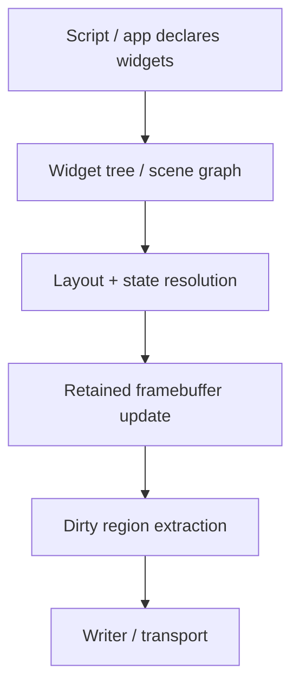

# Loupedeck: Future Directions for the Render Scheduler and Dynamic UI Runtime

This note is the forward-looking companion to [[ARTICLE - Loupedeck - Render Scheduler, Region Coalescing, and Display Blit Path]]. It maps the likely next steps after the current keyed-invalidations + single-writer design: where the renderer could evolve, what a more dynamic UI runtime would need, how dirty-rectangle merging could work, where explicit flush and priority semantics fit, and how transport-aware scheduling might eventually interact with a higher-level scripting interface.

The goal is not to propose one giant rewrite. The goal is to identify the next architectural layers in the order that preserves the most value while minimizing accidental complexity.

> [!summary]
> The most important future directions are:
> 1. move from geometry-key latest-wins invalidation toward **overlap-aware dirty-rectangle scheduling**
> 2. consider a **retained framebuffer or retained scene layer** so widgets update state instead of pushing ad hoc images
> 3. add **explicit flush and priority semantics** for user-interactive regions
> 4. make transport control more observability-driven, and only adopt **ack-gated in-flight rules** if the hardware still needs them
> 5. design the runtime so a future **dynamic JS UI layer** can target stable rendering primitives rather than raw transport calls

## Why this note exists

The current renderer is intentionally small and conservative. That was the right move for getting a fragile hardware integration under control. But it is already clear that the present design is not the end state if the project grows from “safe hardware frontend” into “dynamic programmable control surface runtime”.

As soon as the system wants more of the following, the architecture needs to evolve:

- overlapping visual regions
- more widgets than one screen can show at once
- partial redraw composition across multiple sources
- dynamic UI descriptions driven by scripts or configs
- different update urgency classes (interactive vs ambient)
- runtime scheduling informed by actual device/transport behavior

This note exists to preserve a technically grounded roadmap for those next stages.

## Current baseline

The current rendering architecture is roughly:

```mermaid
flowchart TD
    A[Widget or app state change] --> B[Display.Draw(image, x, y)]
    B --> C[displayDrawCommand]
    C --> D[Keyed invalidation map]
    D --> E[Periodic flush]
    E --> F[Single writer queue]
    F --> G[Serial WebSocket transport]
    G --> H[Loupedeck device]
```

Current strengths:

- simple and understandable
- latest-wins per exact geometry key
- transport ownership is centralized
- redundant same-region updates collapse before they hit the wire
- tests verify coalescing and ordering guarantees

Current limitations:

- no overlap awareness
- no retained framebuffer or scene ownership
- no priority bands
- no explicit flush-now contract
- no frame-budget-aware scheduler
- renderer knows only keys, not semantic widget meaning

Those limitations are exactly where the future directions begin.

## Direction 1: Overlap-aware dirty rectangle scheduling

### Why the current geometry-key model is insufficient

Today, the scheduler treats these as completely independent invalidations if their keys differ:

- `main:0:0:90:90`
- `main:45:0:90:90`

Even though they overlap heavily.

That is fine when widgets are arranged in a stable non-overlapping tile grid. It becomes less fine when the system wants:

- overlays
- animations moving across tile boundaries
- popups or temporary highlights
- composited controls that draw into partially shared regions

### The next abstraction: dirty rectangles instead of only dirty keys

A more advanced scheduler would internally represent pending work as geometric dirty regions, not just identity-key replacements.

Conceptually:

```text
invalidate(rect, payload)
=> add dirty rect
=> if overlapping or adjacent to existing dirty rects, merge or split intelligently
=> flush a reduced set of regions
```

The simplest next step is **merge-on-overlap**. If two invalidations overlap or nearly touch, replace them with their bounding union.

Pseudocode:

```text
for each incoming rect R:
    for each pending rect P:
        if overlaps(P, R) or isAdjacent(P, R):
            R = union(P, R)
            remove P from pending
    add R to pending
```

### Tradeoff: fewer commands vs larger payloads

This is where the renderer becomes more interesting. A merged dirty rectangle means:

- fewer region commands
- but a larger framebuffer payload per region

So the right merge policy is not “always merge”. It is something like:

```text
merge if command_count_saved > payload_penalty_threshold
```

or more concretely:

- merge small neighboring regions aggressively
- avoid merging distant regions if the union would include lots of untouched pixels

### A more sophisticated dirty-rect planner

A future planner could score candidate plans:

```text
cost(plan) = sum(regionPixelArea * byteCostWeight) + sum(regionCount * commandOverheadWeight)
```

Then choose the lower-cost region partition. That would make the scheduler much more device- and workload-aware without requiring a full scene graph.

## Direction 2: Retained framebuffer state

### Why current draw-command coalescing is not the same as retained rendering

Right now, the renderer coalesces commands, but it does not own a canonical display image. It has no single source of truth for what the screen “should” look like right now. It only knows the latest command for a key.

That means it cannot easily:

- redraw arbitrary subregions from state
- answer “what pixels are under this overlay?”
- produce consistent output if multiple widgets contribute to one region
- reschedule or reshape dirty regions after the original commands were formed

### The retained framebuffer idea

A future renderer could maintain an in-memory canonical image per display:

```text
DisplayState {
    currentFramebuffer image.RGBA
    dirtyRegions []Rect
}
```

Then widgets would stop saying “send this now” and start saying “update my visual state” or “paint into the retained image”. The renderer would then decide which dirty regions to extract and blit to hardware.

### Benefits of retained framebuffer state

- overlap-aware composition becomes much easier
- dirty-rect merging becomes natural
- redraw-after-overlay removal becomes trivial
- partial refreshes can be regenerated from state instead of replaying prior commands
- render planning becomes independent of widget call order

### Costs and risks

- more memory use
- more code complexity
- need clear display ownership and synchronization
- potential mismatch between retained state and actual device state after transport failures unless resync behavior exists

For this device, the framebuffer sizes are still small enough that a retained image is feasible:

- main: `360×270`
- left/right: `60×270`

So this is not a memory impossibility. It is mainly a complexity decision.

## Direction 3: Retained scene / widget tree above the framebuffer

If the project grows toward dynamic interfaces, a retained framebuffer alone may still be too low-level. The next layer would be a retained scene or widget tree.

### Shape of a retained scene model



Possible node kinds:

- text label
- icon tile
- slider strip
- button bank
- overlay badge
- transient effect

Then the renderer would no longer be driven by arbitrary `Display.Draw(image, x, y)` calls alone. Instead, it would be driven by scene updates.

### Why this matters for a future JS runtime

A JS UI runtime should not be forced to speak raw framebuffer updates unless that is intentionally the low-level API. A higher-level retained scene model would let scripts say things like:

- set this tile icon
- update this label text
- animate this value strip
- flash this overlay

The renderer could then optimize those changes globally.

## Direction 4: Explicit flush-now semantics

### The current scheduler is purely interval-driven

Today, flush happens on a fixed interval. That is good for stability, but it does not distinguish between:

- an ambient spinner animation
- a button press feedback flash
- a critical “armed/disarmed” state change

Those do not all have the same urgency.

### Future API: invalidate vs flush-now

A future scheduler API could distinguish:

```go
Invalidate(region, payload)
InvalidateUrgent(region, payload)
FlushNow()
```

or equivalently via options:

```go
Invalidate(region, payload, RenderPriorityInteractive)
```

### Semantics

- **normal** invalidations wait for the next cadence tick
- **interactive/urgent** invalidations can trigger an immediate or near-immediate flush
- `FlushNow()` can be used at commit points where the application knows the current frame should be pushed immediately

### Why this matters

Human interaction tolerates much less latency than ambient animation. The renderer should eventually encode that distinction explicitly.

## Direction 5: Priority bands and per-region classes

Related to flush-now semantics is the idea of priority bands.

A plausible future model:

- `PriorityCritical`
  - state confirmations, safety cues, current active page
- `PriorityInteractive`
  - touch-down feedback, knob motion readouts
- `PriorityNormal`
  - ordinary tile refreshes
- `PriorityAmbient`
  - decorative animation, idle motion

Then the scheduler can allocate a frame budget across those classes.

Pseudocode:

```text
each flush cycle:
    flush all critical
    flush interactive up to latency budget
    flush normal up to bandwidth budget
    flush ambient only if capacity remains
```

This would make the device feel more responsive under load even before changing transport mechanics.

## Direction 6: Budget-based scheduler instead of fixed flush cadence

### Current model

- every `FlushInterval`, flush everything pending

### More advanced model

- every tick, spend only up to some byte or command budget
- carry remaining work to the next tick

Possible budgets:

- max commands per frame
- max pixels per frame
- max bytes per frame
- max interactive latency

This would make the renderer a true scheduler rather than just a periodic dump of pending work.

### Why byte budget may be best

For this device, pixel payload size matters a lot. A `90×90` tile and a `360×270` full-screen push are not remotely equivalent. So a byte-budgeted scheduler may be more realistic than a command-count budget alone.

## Direction 7: Transport-informed scheduling and ack-gated flow control

### Current writer model

The writer provides:

- single ownership
- optional inter-command pacing
- coarse queue stats

It does not yet use explicit transport acknowledgements to gate scheduling decisions.

### When ack-gating becomes attractive

Ack-gated flow control should only be introduced if measurements show that:

- the current pacing + coalescing model still overloads the device
- acks can be associated with the relevant command classes reliably enough
- the latency cost is acceptable

### Possible future model

```text
writer sends display command
mark region as in-flight
scheduler avoids sending more than N in-flight display commands
when ack arrives:
    clear in-flight slot
    allow next high-priority region
```

### Risk

The device’s response timing is odd enough that a naïve ack-gated design could become brittle or too conservative. This is why it remains a future direction rather than an immediate requirement.

## Direction 8: Device-state resynchronization after transport failure

A retained renderer becomes more valuable if it can also resynchronize device state.

Future idea:

- when reconnect happens, mark all displays fully dirty
- resend retained framebuffer regions or replay retained scene state
- restore the device to known UI state instead of relying on widgets to redraw opportunistically

This is especially important for a scripting runtime, where the UI description may be long-lived even if the underlying transport reconnects.

## Direction 9: Script-facing dynamic UI runtime

If goja or another embedded JS runtime is added later, the renderer should expose stable declarative or semi-declarative primitives, not raw transport calls.

### Bad script API

```javascript
deck.sendRawFramebuffer(...)
deck.sendDraw(...)
```

This would push transport policy back into scripts, recreating the original architecture mistake.

### Better script API

Something more like:

```javascript
screen.tile("main:1,2").setIcon("finder")
screen.tile("main:1,2").animate({ type: "pulse", fps: 10 })
screen.flush()
```

or a retained scene model:

```javascript
const ui = require("loupedeck-ui")

ui.screen("main", screen => {
  screen.tile(0, 0, t => t.icon("finder").pulse())
  screen.tile(1, 0, t => t.icon("trash"))
  screen.tile(2, 0, t => t.text("REC").blink())
})
```

Then the Go renderer can still own:

- dirty-region planning
- coalescing
- pacing
- transport safety

This is the right boundary if the project moves toward dynamic programmable interfaces.

## Direction 10: Scene diffing for scripted UIs

If a JS runtime produces a retained scene description, the natural next optimization is diffing old scene vs new scene.

```text
previous scene
vs
next scene
=> derive minimal set of changed nodes / dirty regions
=> update retained framebuffer / dirty planner
```

This would allow dynamic scripted interfaces without forcing every script tick to regenerate and resend everything.

## Direction 11: Better observability and tuning feedback

The current stats are useful but coarse. A future renderer should probably expose more tuning signals, for example:

- pending region count over time
- pending pixel area over time
- average coalescing ratio
- average flush payload bytes
- interactive vs ambient latency
- in-flight display command count
- reconnect / resync counts

These metrics matter because once the scheduler becomes more adaptive, debugging by intuition alone will stop being good enough.

## Direction 12: Smarter dirty-region merge heuristics

Once dirty rectangles exist, the next real question is merge policy.

Candidate heuristics:

1. **union on overlap**
   - simplest
2. **union on near adjacency**
   - good for neighboring tiles or text runs
3. **maximum expansion threshold**
   - do not merge if the union area is much larger than the sum of actual dirty areas
4. **priority-preserving merge rules**
   - do not merge a critical region into a giant ambient region if it delays urgent feedback
5. **display-specific rules**
   - left/right strips may want different merge thresholds than the main grid

This is one of the places where a retained framebuffer starts paying for itself quickly.

## A plausible staged roadmap

The elegant path forward is not “build everything”. It is staged.

### Stage A: strengthen the current scheduler

- explicit flush-now
- priority classes
- richer stats
- better logging/control of lifecycle edge cases

### Stage B: move from keyed invalidation to dirty rectangles

- overlap-aware rect merging
- byte-budgeted flush planning
- partial-bank and overlay-aware redraw planning

### Stage C: add retained framebuffer state

- canonical display images
- redraw from state after reconnect
- planner independent of immediate draw-call history

### Stage D: add retained scene / widget layer

- scene nodes and layout
- diffing
- renderer updates derived from state changes rather than ad hoc image pushes

### Stage E: add script-facing dynamic runtime

- goja-based UI description layer
- stable declarative interface
- scheduler remains transport owner underneath

This order preserves the current investment and avoids overcommitting too early.

## Anti-patterns to avoid

1. letting scripts send raw transport commands directly
2. jumping straight to a full scene graph before validating dirty-rect scheduling value
3. adding ack-gated complexity before proving pacing+coalescing is insufficient
4. building overlap-aware logic without observability
5. treating all visual updates as equally urgent

## Working rules

1. Preserve the separation between render semantics and transport semantics.
2. Add geometry awareness before adding full scene complexity.
3. Add retention only when the renderer genuinely needs canonical state.
4. Design future script APIs against retained rendering primitives, not raw bytes.
5. Treat resync after reconnect as part of rendering architecture, not only connection architecture.
6. Advance by measurable workload wins, not only elegance.

## Pseudocode for a future retained + dirty-rect scheduler

```text
on widget or script state change:
    mutate retained scene
    rasterize changed nodes into retained framebuffer
    mark resulting dirty rects

on scheduler tick:
    merge dirty rects using cost heuristic
    partition into priority classes
    flush critical first
    flush up to byte budget
    keep remainder pending

on reconnect:
    mark full display dirty
    regenerate dirty plan from retained framebuffer
    flush until device state matches retained state
```

## Related notes

- [[ARTICLE - Loupedeck - Render Scheduler, Region Coalescing, and Display Blit Path]]
- [[ARTICLE - Loupedeck - Backpressure-Safe Go Frontend Deep Dive]]
- [[ARTICLE - Loupedeck - Optimizing Button Animation FPS on a Serial WebSocket Device]]
- [[ARTICLE - Loupedeck - Loading, Animating, and Displaying SVG Button Banks]]
- [[PROJ - Loupedeck Live Hello World - Serial Go Driver]]
