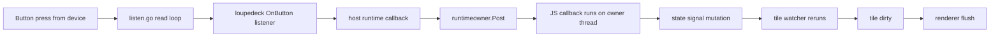

# Loupedeck: Goja JavaScript Runtime and API Deep Dive

This note captures the first real implemented JavaScript runtime in the `github.com/go-go-golems/loupedeck` repository. It is not a speculative brainstorm note about what a future scriptable device *might* look like. It is the technical explanation of what now exists: an owner-thread goja runtime, a pure-Go reactive core, a retained tile UI model, a host event runtime, a small animation system, and a live hardware runner that executes `.js` files on a real Loupedeck Live.

The reference ticket is `LOUPE-005`, and the reference repository is [[PROJ - Loupedeck Live Hello World - Serial Go Driver]]. This note is the implementation-level companion to the earlier design-oriented Loupedeck runtime notes.

> [!summary]
> The current JS runtime is best understood as five stacked layers:
> 1. an **owned goja runtime** that serializes all JS callbacks onto one owner thread
> 2. a pure-Go **reactive state runtime** for signals, computed values, batching, and eager effects
> 3. a pure-Go **retained UI model** for named pages and `4×3` touchscreen tiles
> 4. a pure-Go **host runtime** for buttons, knobs, touch input, and animation timers
> 5. a **live runner** that flushes retained UI through the existing Go renderer/writer/transport stack to real hardware
>
> The most important architectural rule is that JavaScript does **not** own transport. Scripts mutate retained state and UI. Go still owns rendering, pacing, and serial/WebSocket safety.

## Why this note exists

The repository already had multiple Loupedeck articles, but they mostly covered the Go frontend, renderer scheduling, FPS ceilings, and SVG display work. Once the goja runtime became real, there needed to be one note that explained the JS stack itself in the same level of detail:

- what the actual API surface is today
- how the API is implemented internally
- why the owner-thread model matters
- how reactive state and retained UI fit together
- where the live runner plugs into the existing hardware frontend
- what limitations are intentional rather than accidental

Without a note like this, future readers would have to reconstruct the runtime from scattered files and tickets.

## What now exists in the repo

The JS runtime is spread across a few focused package families:

### Runtime ownership and bridge

- `/home/manuel/code/wesen/2026-04-11--loupedeck-test/pkg/runtimeowner/`
- `/home/manuel/code/wesen/2026-04-11--loupedeck-test/pkg/runtimebridge/`

### Pure-Go semantic layers

- `/home/manuel/code/wesen/2026-04-11--loupedeck-test/runtime/reactive/`
- `/home/manuel/code/wesen/2026-04-11--loupedeck-test/runtime/ui/`
- `/home/manuel/code/wesen/2026-04-11--loupedeck-test/runtime/render/`
- `/home/manuel/code/wesen/2026-04-11--loupedeck-test/runtime/host/`
- `/home/manuel/code/wesen/2026-04-11--loupedeck-test/runtime/anim/`
- `/home/manuel/code/wesen/2026-04-11--loupedeck-test/runtime/easing/`

### JS binding layer

- `/home/manuel/code/wesen/2026-04-11--loupedeck-test/runtime/js/runtime.go`
- `/home/manuel/code/wesen/2026-04-11--loupedeck-test/runtime/js/env/env.go`
- `/home/manuel/code/wesen/2026-04-11--loupedeck-test/runtime/js/module_state/module.go`
- `/home/manuel/code/wesen/2026-04-11--loupedeck-test/runtime/js/module_ui/module.go`
- `/home/manuel/code/wesen/2026-04-11--loupedeck-test/runtime/js/module_anim/module.go`
- `/home/manuel/code/wesen/2026-04-11--loupedeck-test/runtime/js/module_easing/module.go`

### Live entry points and examples

- `/home/manuel/code/wesen/2026-04-11--loupedeck-test/cmd/loupe-js-demo/main.go`
- `/home/manuel/code/wesen/2026-04-11--loupedeck-test/cmd/loupe-js-live/main.go`
- `/home/manuel/code/wesen/2026-04-11--loupedeck-test/examples/js/`

That division is deliberate. The Go semantics live below the JS bindings so they can be tested and reasoned about independently.

## Core mental model

The runtime is easiest to understand as a pipeline from a JS script down to hardware.

```mermaid
flowchart TD
    A[JS script] --> B[goja owned runtime]
    B --> C[JS native modules]
    C --> D[reactive runtime]
    C --> E[retained UI]
    C --> F[host runtime]
    C --> G[animation runtime]
    E --> H[retained tile renderer]
    H --> I[Display.Draw]
    I --> J[renderer invalidation scheduler]
    J --> K[single writer]
    K --> L[serial WebSocket transport]
    L --> M[Loupedeck Live]
    M --> F

    style B fill:#214d2f,stroke:#5fbf7a
    style D fill:#1a3a5c,stroke:#4aa3ff
    style E fill:#1a3a5c,stroke:#4aa3ff
    style F fill:#5c3a1a,stroke:#ffad4a
    style J fill:#5c1a3a,stroke:#ff5ca3
    style K fill:#5c1a3a,stroke:#ff5ca3
```



The most important conceptual fact is that the script never pushes a framebuffer directly. It defines pages, tiles, signals, and animations. Those abstractions are realized by Go code, which then flushes the resulting dirty tiles through the existing transport-safe frontend.

That is why the JS runtime can exist without undoing the backpressure and writer work from `LOUPE-003`.

## Layer 1: owner-thread goja runtime

The current runtime bootstrap lives in:

- `/home/manuel/code/wesen/2026-04-11--loupedeck-test/runtime/js/runtime.go`

Its job is to construct:

- a `*goja.Runtime`
- a `goja_nodejs/eventloop.EventLoop`
- a local `runtimeowner.Runner`
- runtime-scoped bindings in `runtimebridge`
- the Loupedeck environment (`Reactive`, `UI`, `Host`, `Anim`)

The important part is not that it creates a VM. The important part is that it creates an **owned** VM.

### Why owner-thread execution matters

goja should be treated as single-threaded. Hardware events, timers, and animation callbacks can all arrive from goroutines or timer callbacks that are not safe places to touch the VM directly.

So the runtime now uses a model like this:

```text
external event arrives
-> Go callback receives it
-> callback posts work onto runtimeowner.Runner
-> Runner executes JS closure on the owner thread
-> JS callback mutates reactive/retained state
```

This is the key convergence toward the `go-go-goja` runtime-ownership model.

### Runtime-scoped bindings

The runtime stores a binding bundle against the VM:

- `Context`
- `Loop`
- `Owner`
- `Values["environment"]`

That means native modules do not have to be wired manually with ad hoc environment threading. They can resolve what they need from the runtime bindings.

## Layer 2: pure-Go reactive runtime

The reactive layer lives in:

- `/home/manuel/code/wesen/2026-04-11--loupedeck-test/runtime/reactive/runtime.go`
- `/home/manuel/code/wesen/2026-04-11--loupedeck-test/runtime/reactive/signal.go`
- `/home/manuel/code/wesen/2026-04-11--loupedeck-test/runtime/reactive/computed.go`
- `/home/manuel/code/wesen/2026-04-11--loupedeck-test/runtime/reactive/effect.go`
- `/home/manuel/code/wesen/2026-04-11--loupedeck-test/runtime/reactive/graph.go`

This layer is intentionally goja-free. That was the right decision because it let the semantics be designed and tested before any VM-bridging concerns entered the picture.

### What the reactive runtime does

It provides:

- `Signal[T]`
- `Computed[T]`
- eager `Watch(...)` / `Effect`
- dependency tracking
- batching
- reentrancy/cycle guards

The semantic rule is simple:

- `Signal` is a mutable state cell
- `Computed` is derived from signals or other computed values
- `Watch` is a side effect that reruns when its dependencies change

### Why "mutate signals" matters

A signal is not just a variable. It is a tracked value cell in a dependency graph.

If a JS callback does:

```javascript
count.update(v => v + 1)
```

that is not merely “increment a number.” It means:

1. read the current signal value
2. compute a next value
3. compare old vs new
4. mark downstream dependents dirty if the value changed
5. flush queued effects at the right time

That is the semantic engine underneath the deceptively small JS API.

## Layer 3: retained page/tile UI model

The retained UI model lives in:

- `/home/manuel/code/wesen/2026-04-11--loupedeck-test/runtime/ui/ui.go`
- `/home/manuel/code/wesen/2026-04-11--loupedeck-test/runtime/ui/page.go`
- `/home/manuel/code/wesen/2026-04-11--loupedeck-test/runtime/ui/tile.go`

The current UI model is intentionally small and concrete:

- named pages
- one active page
- a `4×3` main-display tile grid
- tile properties:
  - `text`
  - `icon`
  - `visible`
- dirty-tile tracking

### Why a retained model matters

The retained model means JavaScript describes **what the current UI state is**, not the immediate framebuffer bytes to send.

That enables this path:

```text
JS callback mutates signal
-> tile binding re-runs
-> tile text changes
-> tile marks itself dirty
-> renderer flushes only dirty tiles
```

That is much more stable than “JS callback emits raw pixels now.”

### Tile bindings are reactive effects

When JavaScript calls:

```javascript
tile.text(() => `COUNT ${count.get()}`)
```

that closure becomes a reactive watcher in Go. When `count` changes, the watcher re-runs, `SetText(...)` sees a new value, and the tile becomes dirty.

In other words, the retained UI model is not only a data structure. It is the bridge where reactive state becomes renderable retained state.

## Layer 4: retained renderer bridge

The retained renderer lives in:

- `/home/manuel/code/wesen/2026-04-11--loupedeck-test/runtime/render/visual_runtime.go`

It maps the retained tile grid to the actual Loupedeck main display geometry:

- tile width: `90`
- tile height: `90`
- main display: `360×270`

### Current renderer semantics

The current renderer is intentionally placeholder/simple:

- background fill
- accent strip at the top of the tile
- centered icon label string
- centered text label string

That means the current JS runtime is already structurally correct even though its tile visuals are still minimal. The JS API is not blocked on the final asset pipeline.

### Why that was a good tradeoff

If the project had waited for full JS asset integration before validating the runtime architecture, the ownership, callback, and retained-UI questions would have stayed muddy much longer. The placeholder renderer was enough to prove the model.

## Layer 5: host runtime and event routing

The host runtime lives in:

- `/home/manuel/code/wesen/2026-04-11--loupedeck-test/runtime/host/runtime.go`
- `/home/manuel/code/wesen/2026-04-11--loupedeck-test/runtime/host/events.go`
- `/home/manuel/code/wesen/2026-04-11--loupedeck-test/runtime/host/pages.go`
- `/home/manuel/code/wesen/2026-04-11--loupedeck-test/runtime/host/timers.go`

This layer is responsible for attaching to a real `loupedeck.Loupedeck` event source and exposing:

- `OnButton`
- `OnTouch`
- `OnKnob`
- page show hooks
- host-owned timers
- reconnect replay hooks

The host layer is the boundary between the real device and the retained runtime stack.

### Event path in practice

A hardware button press now flows roughly like this:



That owner-thread handoff is the important new safety property. Before the convergence work, this boundary was much more ad hoc.

## Layer 6: animation and easing runtime

The animation runtime lives in:

- `/home/manuel/code/wesen/2026-04-11--loupedeck-test/runtime/anim/runtime.go`
- `/home/manuel/code/wesen/2026-04-11--loupedeck-test/runtime/easing/easing.go`

The current animation model is deliberately numeric and host-owned.

It provides:

- numeric tweens (`TweenFloat64`)
- normalized loops (`Loop`)
- sequential timelines (`Timeline`)
- easing functions

### Why numeric targets were the right first abstraction

Instead of animating arbitrary widget trees directly, the first implementation animates **anything with `get()` and `set()`**. In practice that means signals are the natural targets.

That gives simple but powerful composition:

```javascript
const pulse = state.signal(0);
anim.loop(1200, t => pulse.set(t));
tile.text(() => `${Math.round(easing.inOutCubic(pulse.get()) * 100)}%`);
```

The animation engine only knows about numbers. The retained UI layer only knows about text/icon/visible bindings. Together they still produce a useful animated interface.

## The actual JS API surface

The currently implemented JS-facing modules are:

### `require("loupedeck/state")`

Exports:

- `signal(initial)`
- `computed(fn)`
- `batch(fn)`
- `watch(fn)`

Signal object methods:

- `get()`
- `set(value)`
- `update(fn)`

### `require("loupedeck/ui")`

Exports:

- `page(name, fn)`
- `show(name)`
- `onButton(name, fn)`
- `onTouch(name, fn)`
- `onKnob(name, fn)`

Page object methods:

- `tile(col, row, fn)`

Tile object methods:

- `text(valueOrFn)`
- `icon(valueOrFn)`
- `visible(boolOrFn)`

### `require("loupedeck/anim")`

Exports:

- `to(target, to, durationMs, easeFn?)`
- `loop(durationMs, fn)`
- `timeline()`

Timeline object methods:

- `to(target, to, durationMs, easeFn?)`
- `play()`

Animation handle methods:

- `stop()`

### `require("loupedeck/easing")`

Exports:

- `linear(t)`
- `inOutQuad(t)`
- `inOutCubic(t)`
- `outBack(t)`
- `steps(n)`

### What is intentionally missing

Still intentionally absent from the current JS API:

- raw framebuffer access
- raw transport access
- JS-side asset loading
- a JS `assets` module
- direct JS timers like `setTimeout` / `setInterval`
- scene-graph widgets beyond simple retained tiles

Those omissions preserve the Go-side ownership boundary.

## Pseudocode: how a button-triggered counter update works

This is the simplest full-stack JS example in the current runtime.

```text
script installs ui.onButton("Button1", callback)
script binds tile.text(() => "COUNT " + count.get())
script shows page

hardware Button1 press arrives
-> Go listener receives button event
-> host runtime callback fires
-> callback posts work onto runtimeowner
-> JS callback runs
-> count.update(v => v + 1)
-> reactive runtime marks dependents dirty
-> tile text binding re-runs
-> retained tile text changes
-> tile marked dirty
-> live runner flushes dirty tile
-> Go frontend sends display update to hardware
```

That is the simplest mental model that is still faithful to the implementation.

## Live execution path: `loupe-js-live`

The live hardware runner is:

- `/home/manuel/code/wesen/2026-04-11--loupedeck-test/cmd/loupe-js-live/main.go`

Its job is to:

1. load a JS file
2. connect to a real Loupedeck
3. attach the host runtime to the deck event source
4. run the script in the owned runtime
5. flush retained UI to the main display on a ticker
6. optionally log high-level events
7. optionally exit on Circle

### Why the live runner matters

Without it, the runtime would still be a collection of good packages and tests. With it, the runtime becomes something a user can actually point at a `.js` file and run on a device.

That is the moment the API stops being a design exercise and becomes a platform.

## Hardware validation status

The runtime has now been validated on actual hardware for both non-interactive and interactive scripts.

Validated examples:

- `examples/js/01-hello.js`
- `examples/js/02-counter-button.js`
- `examples/js/03-knob-meter.js`
- `examples/js/04-touch-feedback.js`
- `examples/js/05-pulse-animation.js`
- `examples/js/06-page-switcher.js`

What that means concretely:

- retained static rendering works
- button callbacks work
- knob callbacks work
- touch callbacks work
- page switching works
- loop-driven animation works

That is a stronger milestone than the earlier purely internal tests.

## A subtle but important fix: touch-demo labeling

During hardware validation, the touch demo turned out to be logically correct but visually misleading. The script listened to `Touch1`, `Touch6`, and `Touch12`, but only the top row had visible labels.

That mattered because it weakened the validation artifact itself. A technically correct example can still be a bad example if the operator cannot tell what to touch.

The fix in:

- `/home/manuel/code/wesen/2026-04-11--loupedeck-test/examples/js/04-touch-feedback.js`

was to align the visible labels with the actual touched regions:

- `Touch1` at top-left
- `Touch6` at middle row, second tile
- `Touch12` at bottom-right
- status at top-right

This is a small implementation detail, but it reflects a bigger engineering lesson: validation artifacts need good UX too.

## Failure modes and rough edges

The runtime architecture is now substantially better, but some rough edges remain.

### 1. reconnect / handshake fragility

Still-seen symptoms include:

- `malformed HTTP response ...`
- `Port has been closed`
- short `Version` responses
- device-busy failures when an earlier child process still owns `/dev/ttyACM0`

These are not primarily JS runtime semantics bugs. They are lower-level lifecycle and reconnect hygiene issues.

### 2. placeholder icon rendering

The JS API already has `tile.icon(...)`, but the retained JS renderer currently renders that string as text. That is enough for architecture validation, but not yet the full final UX.

### 3. no JS-side asset module yet

The more advanced SVG/icon pipeline already exists in Go, but it has not yet been surfaced to JavaScript.

### 4. current JS API is intentionally narrow

The API is useful today, but it is still the first real slice, not the endpoint. That is a feature, not a defect. The runtime got validated with a minimal but coherent surface instead of waiting for a giant framework.

## Anti-patterns the current runtime avoids

### Anti-pattern 1: JS-owned transport

A bad scriptable control-surface system would let scripts do things like:

```javascript
deck.sendFramebuffer(...)
deck.sendDraw(...)
```

That would move transport policy back into scripts and undo the writer/renderer ownership work.

### Anti-pattern 2: direct goroutine-to-goja callbacks

It is tempting to let a Go callback invoke a JS closure directly, especially for small demos. That is the fastest way to get racey, shutdown-hostile, impossible-to-reason-about runtime behavior.

The owner-thread model is not optional ceremony. It is what makes the runtime survivable.

### Anti-pattern 3: binding JS directly to transient pixel pushes

If the JS API had started as “draw this image now,” it would have been hard to compose, hard to coalesce, and hard to reconnect. The retained model was the right first abstraction.

## Working rules

> [!important]
> Treat goja as single-threaded. Any deferred or external callback must settle back onto the runtime owner thread before it executes JS.

> [!important]
> Treat JavaScript as the owner of **state and UI description**, not the owner of the serial/WebSocket transport.

> [!important]
> Prefer adding pure-Go semantics first and JS bindings second. The runtime is easier to test and easier to reason about when the semantic layers exist below the VM boundary.

> [!important]
> Keep the retained model honest. If a feature cannot be described as state, retained UI, or an animation over state, it is a sign that the abstraction boundary may still need work.

## Recommended next steps

The likely next useful steps are:

1. expose more user-facing documentation and help pages for the JS runtime
2. decide whether the JS layer should grow an asset/icon module next
3. keep improving reconnect and lifecycle hygiene in the lower-level hardware stack
4. consider whether timer helpers should be exposed to JS or whether animation/state/page APIs already cover most needs
5. keep converging toward the `go-go-goja` ownership model where it improves correctness without importing unnecessary dependency weight

## Related notes

- [[ARTICLE - Loupedeck - Backpressure-Safe Go Frontend Deep Dive]]
- [[ARTICLE - Loupedeck - Render Scheduler, Region Coalescing, and Display Blit Path]]
- [[ARTICLE - Loupedeck - Future Directions for the Render Scheduler and Dynamic UI Runtime]]
- [[ARTICLE - Loupedeck - Loading, Animating, and Displaying SVG Button Banks]]
- [[PROJ - Loupedeck Live Hello World - Serial Go Driver]]
