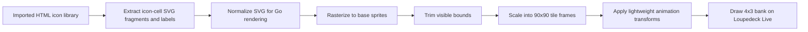
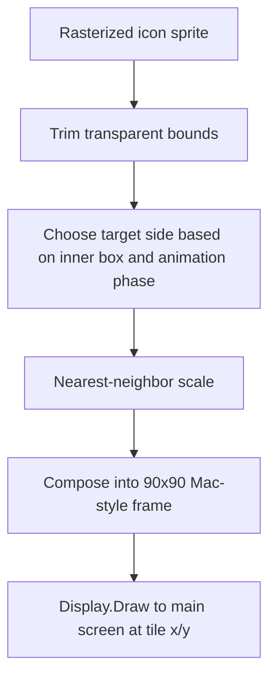

# Loupedeck: Loading, Animating, and Displaying SVG Button Banks

This note captures the full pipeline for taking a browser-oriented HTML icon library, extracting its inline SVG icons in Go, normalizing them for non-browser rendering, rasterizing them into sprites, and displaying them as animated 4×3 button banks on a Loupedeck Live. The immediate source project is [[PROJ - Loupedeck Live Hello World - Serial Go Driver]], and the concrete implementation lives in the `LOUPE-004` work inside `/home/manuel/code/wesen/2026-04-11--loupedeck-test`.

The important detail is that this is not a browser demo copied onto a device. It is a Go-side rendering frontend that treats the imported HTML file as an asset library, converts the icons into cached image sprites, and then animates those sprites in device-sized `90×90` button tiles.

> [!summary]
> This SVG button-bank implementation has four important moving parts:
> 1. an HTML/SVG extraction layer that pulls icon labels and inline SVG fragments out of the imported icon-library file
> 2. a normalization layer that removes browser-only assumptions such as CSS variables, dither classes, and animation styles
> 3. a sprite pipeline that rasterizes, trims, and scales icons so they fit the Loupedeck Live touchscreen tiles cleanly
> 4. a device demo command that animates one bank of 12 icons at a time, while supporting curated icon lists, offsets, and bank paging controls

## Why this note exists

The imported icon source is not a directory of `.svg` files. It is a single HTML document containing around 40 icon tiles, each with an inline `<svg>` fragment, labels, shared dither-pattern defs, CSS custom properties, and browser animation styles. That makes it a good design source but a poor direct runtime artifact for a Go hardware program.

This note exists to preserve the reusable pattern that came out of the implementation work: when a device UI needs to reuse browser-authored SVG assets, the best path is often to treat the HTML page as a source library, not as an executable rendering environment. Extract the assets, normalize them, cache them, and do the actual device animation in your own rendering loop.

## When to use this pattern

Use this pattern when:

- the source artwork exists as inline SVG inside HTML rather than as neat standalone asset files
- the output device wants fixed-size tiles or regions, not an open-ended browser canvas
- you want predictable rendering and animation under your own control
- the device transport is constrained enough that you cannot afford to send arbitrary browser-like redraw storms
- you want to support curated icon subsets and device-native paging controls

Do not use this pattern when:

- you need exact fidelity to browser CSS animation semantics
- the source page depends on rich layout, fonts, filters, or script execution that materially change the asset geometry
- you only need one or two icons and manual export is cheaper than building an extractor

## Core mental model

The whole system is easiest to think about as a conversion and playback pipeline.



The critical trick is that animation happens **after** rasterization, not by trying to execute the page’s original CSS keyframes.

## Source and implementation files

Important files in the repo:

- imported source library:
  - `/home/manuel/code/wesen/2026-04-11--loupedeck-test/ttmp/2026/04/11/LOUPE-004--animated-svg-icon-buttons-for-loupedeck-live/sources/local/macos1-icon-library.html`
- extraction / normalization / rasterization helpers:
  - `/home/manuel/code/wesen/2026-04-11--loupedeck-test/svg_icons.go`
- tests for that path:
  - `/home/manuel/code/wesen/2026-04-11--loupedeck-test/svg_icons_test.go`
- device demo command:
  - `/home/manuel/code/wesen/2026-04-11--loupedeck-test/cmd/loupe-svg-buttons/main.go`
- related package/runtime context:
  - `/home/manuel/code/wesen/2026-04-11--loupedeck-test/display.go`
  - `/home/manuel/code/wesen/2026-04-11--loupedeck-test/writer.go`
  - `/home/manuel/code/wesen/2026-04-11--loupedeck-test/connect.go`

## Pattern shape

### 1. Import the source into a tracked workspace

The HTML library is first imported into the ticket workspace using `docmgr import file`. This matters because the source asset should live alongside the implementation docs and not remain an ad hoc file in `Downloads`.

### 2. Extract icon entries from the HTML

The extraction pass pulls out:

- the inline `<svg>...</svg>` fragment from each `.icon-cell`
- the visible icon label from `.icon-label`
- root CSS variables such as `--white` and `--black`
- the hidden shared `<defs>` block for dither patterns

The extraction logic is intentionally pragmatic rather than browser-complete. It is tailored to the imported source format.

### 3. Normalize the SVG fragments

The normalization pass resolves the pieces that browsers handle automatically but a Go rasterizer does not:

- replace `var(--white)` / `var(--black)` with concrete colors
- expand dither classes such as `dither-25` and `dither-50` into explicit `fill="url(#...)"`
- inject shared `<defs>` into icons that use dither fills
- strip browser animation declarations from `style="..."`
- ensure the SVG root has an XML namespace when needed

This preserves the icon geometry and basic styling while discarding the browser-only animation model.

## Architecture

### Extraction and normalization layer

The loader in `svg_icons.go` exposes a small library-level surface:

```go
func LoadSVGIconLibrary(path string) (*SVGIconLibrary, error)
```

Conceptually, the algorithm is:

```text
read HTML file
extract root variables
extract shared defs
for each icon-cell:
    extract raw SVG fragment
    extract label
    normalize SVG fragment
    append SVGIcon{Name, SVG}
return SVGIconLibrary
```

The key design point is that the output is not a browser DOM tree. The output is a simple Go structure containing named normalized SVG strings that can be rasterized deterministically.

### Rasterization layer

Each normalized icon can then be rasterized:

```go
func (icon SVGIcon) Rasterize(size int) (*image.RGBA, error)
```

The current implementation uses Go-side SVG rasterization libraries and renders to transparent RGBA images. This is intentionally decoupled from device geometry. The rasterizer produces a base sprite; later stages decide how that sprite fits inside a button tile.

### Visible-bounds trimming

The most important visual-quality step is trimming the alpha bounds of the rasterized icon before final scaling.

Without trimming, icons with large internal whitespace in their viewbox look too small on the device. With trimming, scaling is based on visible content rather than empty padding.

Pseudocode:

```text
visibleBounds(image):
    scan pixels
    find min/max x/y where alpha > 0
    return bounding rectangle

crop(image, visibleBounds)
```

This is a very simple algorithm, but it is the difference between “technically displayed” and “visually well-scaled”.

## Device tile composition

The Loupedeck Live touchscreen grid is:

- main display: `360×270`
- layout: `4×3`
- each button tile: `90×90`

The current composition pipeline is:



### Why nearest-neighbor scaling is correct here

The imported icon set has a retro pixel-art aesthetic. Using nearest-neighbor scaling preserves that visual style better than a blurrier interpolation method would.

### Why the frame is not just a plain background

The demo wraps the scaled icon in a simple Macintosh-inspired tile frame:

- off-white background
- dark border
- subtle top-bar stripe accent
- optional blank placeholders for partial banks

This helps the bank look like a coherent UI rather than a pile of floating sprites.

## Animation model

The system deliberately does **not** attempt to execute the original page’s CSS keyframes. Instead, each prepared icon gets a small Go-side animation descriptor:

- mode (`pulse`, `bob`, `slide`, `blink`)
- speed
- phase offset
- inner-box size
- base scale
- optional invert behavior

That makes the animation model device-native and cheap.

Pseudocode:

```text
for each frame:
    for each visible icon in current bank:
        phase = elapsed * speed + phaseOffset
        derive scale / x offset / y offset / invert flag from mode
        fit sprite into target box
        compose final 90x90 tile image
        draw tile to device
```

This is enough to make the buttons feel alive without binding the runtime to browser semantics.

## Banking and browsing the full icon set

The device only shows 12 icons at once, but the imported library contains many more. The solution is to treat the selected icon list as a long ordered stream and slice it into banks of 12.

### Command-line controls

The demo supports:

- `--icons 'Finder,Trash,...'`
  - curated case-insensitive exact-name icon selection
- `--offset N`
  - rotate the selected list so a later icon becomes the first one shown
- `--page-every 2s`
  - automatically cycle through banks on a fixed interval

### Live hardware controls

The current control mapping is:

- `Button1` / `Touch1` → previous bank
- `Button2` / `Touch12` → next bank
- `Button3` / `Touch6` → toggle auto-cycle
- `Circle` → exit

This turns the demo into a device-side icon browser rather than a fixed bank.

## Common failure modes

### 1. Busy device / serial port unavailable

If another process has the device open, the command fails with something like:

```text
unable to open port "/dev/ttyACM0"
```

This is not an SVG issue. It is just normal exclusive access to the USB serial device.

### 2. Lifecycle noise from the underlying package

The lower-level serial/WebSocket package still sometimes produces warnings like:

- `dial failed ... Port has been closed`
- short `Version` response warnings
- close-time read-exit warnings

Those are inherited transport/lifecycle rough edges rather than problems in the SVG extraction or scaling logic.

### 3. Partial banks leaving stale images behind

If the last bank has fewer than 12 icons and the command does not explicitly blank or replace the remaining tiles, stale images from the previous bank remain visible. The current implementation fixes this by rendering placeholder tiles for empty slots.

## Working rules

1. Treat imported HTML as a source asset library, not as a browser runtime.
2. Normalize SVGs aggressively enough that the rasterizer sees only concrete, self-contained icon fragments.
3. Trim alpha bounds before final scaling.
4. Animate sprites after rasterization, not by replaying browser CSS.
5. Keep the device-facing tile contract explicit: `90×90` per button.
6. Bank the icon set instead of trying to overfit all assets into one screen.
7. Separate asset correctness from transport/lifecycle correctness when debugging.

## Example commands

Basic run:

```bash
go run ./cmd/loupe-svg-buttons
```

Curated bank:

```bash
go run ./cmd/loupe-svg-buttons --icons 'Finder,Trash,Clock,Document,Disk,Folder,Key,Mic,Music,Network,Pause,Play'
```

Curated bank with offset and auto-cycle:

```bash
go run ./cmd/loupe-svg-buttons \
  --icons 'Finder,Trash,Clock,Document,Disk,Folder,Key,Mic,Music,Network,Pause,Play,Record,Speaker,Stop' \
  --offset 3 \
  --page-every 2s \
  --fps 10
```

## Related notes

- [[PROJ - Loupedeck Live Hello World - Serial Go Driver]]
- [[ARTICLE - Loupedeck - Backpressure-Safe Go Frontend Deep Dive]]
