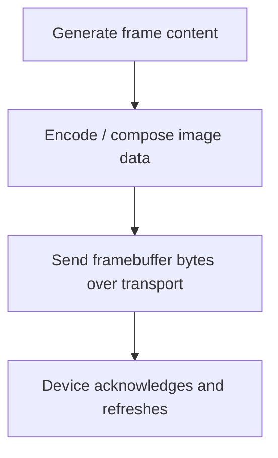

# Loupedeck: Optimizing Button Animation FPS on a Serial WebSocket Device

This note captures the practical performance rules that came out of benchmarking and implementing animated Loupedeck Live button rendering. The important lesson is that the device does not have one single “FPS limit”. It has multiple ceilings depending on update granularity, packet size, and whether the software is sending full-screen frames or small tile updates.

The reference implementation is in `/home/manuel/code/wesen/2026-04-11--loupedeck-test`, especially the `cmd/loupe-fps-bench` and `cmd/loupe-svg-buttons` commands, plus the root package’s writer and renderer layers. The originating project note is [[PROJ - Loupedeck Live Hello World - Serial Go Driver]], and the lower-level architecture context is described in [[ARTICLE - Loupedeck - Backpressure-Safe Go Frontend Deep Dive]].

> [!summary]
> The key FPS optimization rules are:
> 1. optimize for **tile-sized updates**, not full-screen redraws
> 2. precompute and cache everything you can before entering the animation loop
> 3. treat the device as a paced transport, not a free framebuffer
> 4. benchmark raw writer throughput separately from renderer-enabled UX throughput
> 5. bank the icon set and only animate the 12 currently visible tiles

## Why this note exists

When animating buttons on the Loupedeck Live, the real question is not “can it animate?” but “what exactly is being animated, how much data is that, and where is the throughput limit actually coming from?” A single full-screen draw and twelve independent tile draws are not equivalent workloads even if the frame rate number looks similar on paper.

This note exists to preserve the stable optimization heuristics that came out of the benchmark work. They apply not only to the current SVG demo, but to any future small-widget animation workload on top of the serial/WebSocket transport.

## When to use this pattern

Use these optimization rules when:

- your device UI is region-based or tile-based
- the transport is serial or otherwise constrained
- the rendering loop is under your control
- you need to choose reasonable animation rates rather than just “as fast as possible”
- you want to separate CPU/image-generation work from transport/display work

Do not use these numbers blindly when:

- the renderer layer is enabled and coalescing changes the effective UX rate
- the workload contains large full-screen repaints rather than small tile updates
- you have different hardware, firmware, or transport pacing settings

## Measured throughput summary

The current benchmark harness is:

- `/home/manuel/code/wesen/2026-04-11--loupedeck-test/cmd/loupe-fps-bench/main.go`

The raw benchmark mode disables the render scheduler and sets the writer interval to `0`, so the measurements represent approximate transport/display ceilings rather than the default coalesced-renderer user experience.

Measured on the Loupedeck Live (`product 0004`):

| Scenario | Geometry | Best stable target FPS | Peak achieved FPS before falling behind |
|---|---:|---:|---:|
| Full main touchscreen | `360×270` | `36` | `37.65` |
| Single touch-button tile | `90×90` | `320` | `314.44` |
| 12 animated button tiles aggregate | `12 × 90×90` | `288 total` | `314.02 total` |

That table is the core optimization clue: small-tile animation has a much higher practical ceiling than full-screen pushes.

## Core mental model

The most useful way to think about the problem is to separate three costs.



For the current project, the bottleneck is mostly on the right-hand side:

- pixel payload size
- command rate
- transport pacing
- device-side protocol tolerance

This means FPS optimization is less about clever trigonometry and more about sending fewer, smaller, more targeted updates.

## Architecture and performance-relevant files

Important files:

- raw benchmark harness:
  - `/home/manuel/code/wesen/2026-04-11--loupedeck-test/cmd/loupe-fps-bench/main.go`
- animated SVG demo:
  - `/home/manuel/code/wesen/2026-04-11--loupedeck-test/cmd/loupe-svg-buttons/main.go`
- SVG asset prep and rasterization:
  - `/home/manuel/code/wesen/2026-04-11--loupedeck-test/svg_icons.go`
- writer / transport ownership:
  - `/home/manuel/code/wesen/2026-04-11--loupedeck-test/writer.go`
- renderer / coalescing layer:
  - `/home/manuel/code/wesen/2026-04-11--loupedeck-test/renderer.go`
- display draw path:
  - `/home/manuel/code/wesen/2026-04-11--loupedeck-test/display.go`

## Optimization rule 1: prefer tile updates over full-screen redraws

The benchmark numbers make this unavoidable.

A full main-display update pushes `360×270` worth of framebuffer data. A single tile update pushes only `90×90`. Even if both are conceptually “one frame”, the transport payload sizes are drastically different.

That is why these ceilings differ so much:

- full-screen stable: ~`36 FPS`
- single-tile stable: ~`320 FPS`

The practical consequence is:

- if only one button changed, redraw one button
- if twelve buttons changed independently, redraw twelve tiles
- only redraw the full screen when the whole screen truly changed

## Optimization rule 2: precompute and cache sprites before the animation loop

The SVG button demo gets much of its stability from moving work out of the live frame loop.

Before animation starts, it:

1. loads the SVG icon library
2. normalizes the SVG fragments
3. rasterizes each icon into a base sprite
4. trims transparent bounds
5. stores the prepared sprites in memory

Then the frame loop only has to:

- choose the current bank
- compute small animation transforms
- scale and composite a tile
- draw it

This is much cheaper and more predictable than reparsing or rerasterizing SVG on every frame.

Pseudocode:

```text
startup:
    load icons
    normalize SVGs
    rasterize sprites
    trim bounds
    cache prepared icons

per frame:
    for each visible tile:
        compute animation phase
        scale cached sprite
        compose final 90x90 tile
        draw tile
```

## Optimization rule 3: benchmark raw-writer mode separately from renderer mode

The benchmark command uses a very specific measurement mode:

```go
writerOptions := loupedeck.WriterOptions{QueueSize: 4096, SendInterval: 0}
l, err := loupedeck.ConnectAutoWithWriterAndRenderOptions(writerOptions, nil)
```

That means:

- the writer is unconstrained by an extra interval
- the renderer is disabled
- every draw goes straight to the writer

This is good for finding the transport/display ceiling, but it is not the same thing as the best UX defaults for an application. A coalescing renderer may intentionally reduce the visible frame rate while improving stability and eliminating redundant work.

So there are really two distinct questions:

1. **What is the raw ceiling?**
2. **What is the best end-user animation rate with coalescing/pacing enabled?**

Do not confuse them.

## Optimization rule 4: only animate the visible bank of 12 icons

The imported icon library contains more than 12 icons, but the device only displays 12 at a time. That means there is no performance reason to animate off-screen icons.

The current banked demo does the right thing:

- prepare the full selected icon list once
- slice that list into banks of 12
- only render the current bank
- switch banks on demand or at a page interval

That keeps the live work proportional to the actual screen, not the total library size.

## Optimization rule 5: choose conservative demo rates even when the ceiling is high

A single tile can approach the low `300 FPS` range in raw measurements, but that does **not** mean a real demo should aim anywhere near that number.

Why not?

- the device transport still has lifecycle quirks
- higher rates make logs and debugging harder
- visually, small icon motions do not need hundreds of FPS
- lower rates are more forgiving when the rest of the system is busy

For the SVG demo, rates like `10–15 FPS` are already visually active and comfortably within the device’s capabilities for tile-based animation.

## Common failure modes

### 1. Optimizing the wrong layer

If you spend time micro-optimizing math expressions but still redraw the full `360×270` display every frame, you are optimizing the wrong layer. The dominant cost is likely transport payload size, not a handful of floating-point operations.

### 2. Measuring with logging turned on

The package has historically emitted `INFO`-level draw logs. If benchmarking or demoing with per-draw logging enabled, you can easily end up measuring log overhead and console spam rather than the display path itself.

### 3. Treating all FPS values as equivalent

`40 FPS` full-screen is not equivalent to `40 FPS` for a `90×90` tile. The payload sizes and therefore the device stress are very different.

### 4. Forgetting the transport is stateful and fragile

The system still has known lifecycle warnings such as:

- `Port has been closed`
- short `Version` response warnings
- occasional reconnect oddities after prior runs

These do not negate the FPS results, but they are a reminder that the device should be treated like a constrained embedded endpoint, not an infinitely forgiving graphics API.

## Recommended optimization sequence

If a future Loupedeck animation workload feels too slow, optimize in this order:

1. **Reduce update area**
   - full screen → per region / per tile
2. **Cache more aggressively**
   - precompute sprites, text, or geometry
3. **Reduce frame rate**
   - aim for a visually sufficient rate, not a heroic benchmark number
4. **Coalesce redundant updates**
   - let the renderer collapse repeated invalidations
5. **Tune writer pacing**
   - only after workload shape is already sane
6. **Rebenchmark**
   - measure the new actual workload, not assumptions

## Practical working rules

1. Always ask “what is the updated region?” before asking “what FPS do I want?”
2. Cache rasterized art and only animate transforms/composition.
3. Benchmark the current workload shape, not an imagined average case.
4. Keep raw-ceiling measurements separate from UX-target decisions.
5. Use tile banking and pagination to keep live work bounded.
6. Favor predictable stability over chasing the highest possible frame number.

## Example commands

Raw throughput benchmark:

```bash
go run ./cmd/loupe-fps-bench
```

Animated SVG demo at a conservative rate:

```bash
go run ./cmd/loupe-svg-buttons --fps 12
```

Banked SVG demo with controlled paging:

```bash
go run ./cmd/loupe-svg-buttons \
  --icons 'Finder,Trash,Clock,Document,Disk,Folder,Key,Mic,Music,Network,Pause,Play,Record,Speaker,Stop' \
  --offset 3 \
  --page-every 2s \
  --fps 10
```

## Related notes

- [[PROJ - Loupedeck Live Hello World - Serial Go Driver]]
- [[ARTICLE - Loupedeck - Backpressure-Safe Go Frontend Deep Dive]]
- [[ARTICLE - Loupedeck - Loading, Animating, and Displaying SVG Button Banks]]
