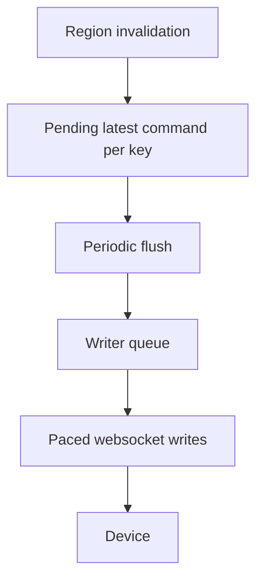

# Loupedeck: Render Scheduler, Region Coalescing, and Display Blit Path

This note is the technical deep dive into the current rendering path in the root `github.com/go-go-golems/loupedeck` package: how an `image.Image` becomes RGB565 bytes, how a display update becomes a logical blit command, how repeated invalidations collapse into one latest-state region update, and how the render scheduler sits above the outbound writer to keep the device from being flooded with redundant work.

The concrete implementation lives in:

- `/home/manuel/code/wesen/2026-04-11--loupedeck-test/display.go`
- `/home/manuel/code/wesen/2026-04-11--loupedeck-test/renderer.go`
- `/home/manuel/code/wesen/2026-04-11--loupedeck-test/writer.go`
- `/home/manuel/code/wesen/2026-04-11--loupedeck-test/message.go`
- `/home/manuel/code/wesen/2026-04-11--loupedeck-test/renderer_test.go`
- `/home/manuel/code/wesen/2026-04-11--loupedeck-test/writer_test.go`

This article complements [[ARTICLE - Loupedeck - Backpressure-Safe Go Frontend Deep Dive]] and [[ARTICLE - Loupedeck - Optimizing Button Animation FPS on a Serial WebSocket Device]]. The former explains the broader package architecture; this one zooms all the way in on the rendering and blit mechanics.

> [!summary]
> The current rendering path has four core ideas:
> 1. `Display.Draw()` converts an image region into a logical **display draw command** containing exactly two protocol messages: framebuffer upload + draw trigger
> 2. the render scheduler does **latest-wins keyed invalidation**, so repeated draws to the same region collapse before hitting the transport
> 3. the writer owns **serialized, paced websocket output**, so transport order and spacing are controlled in one place
> 4. the actual performance win comes not from a fancy retained scene graph, but from refusing to send overwriteable intermediate display states

## Why this note exists

The Loupedeck Live is not a normal GPU-backed windowing target. It is a serially attached embedded device that expects a weird WebSocket-like protocol and does not tolerate unbounded redraw traffic well. Early versions of the code pushed every draw immediately. That was simple, but it turned widget redraws into transport storms.

The render scheduler and grouped blit path are the first real answer to that problem. They are small enough to read in one sitting, but subtle enough that it is easy to miss why they matter if you only skim the code. This note exists to preserve the mental model, algorithms, and tradeoffs behind them.

## When to use this pattern

Use this rendering pattern when:

- the output device is rectangular-region oriented
- the screen can be updated in small subrectangles
- many successive updates target the same regions
- transport capacity is limited enough that redundant writes matter
- the application wants immediate-ish UI behavior without giving every widget direct transport ownership

This is especially well suited to:

- tile-based UIs
- knob strips
- button banks
- display widgets that naturally redraw the same small regions over and over

## Core mental model

The rendering path is a staged pipeline, not one direct function call.

```mermaid
flowchart LR
    A[Widget / App state change] --> B[Display.Draw(image, x, y)]
    B --> C[Build logical display draw command]
    C --> D[Render scheduler invalidation]
    D --> E[Flush latest command per region key]
    E --> F[Single outbound writer]
    F --> G[Framebuffer message]
    G --> H[Draw trigger message]
    H --> I[Loupedeck device]
```

The single most important concept is that **drawing** and **sending** are no longer the same thing.

- `Display.Draw()` describes a desired display region update
- the renderer decides whether that update is still worth sending
- the writer decides when the underlying bytes are emitted

## System layers relevant to rendering

### 1. Display layer (`display.go`)

This layer knows:

- which physical display is being targeted (`left`, `main`, `right`, etc.)
- how to encode pixels into the Loupedeck’s RGB565 payload format
- how to package one display update as a logical command

It does **not** decide pacing policy.

### 2. Render scheduler (`renderer.go`)

This layer knows:

- which region key a display update belongs to
- whether a newer command for the same key has replaced an older one
- when to flush pending regions

It does **not** write bytes directly to the socket.

### 3. Writer (`writer.go`)

This layer knows:

- queue ownership
- command ordering
- optional send interval pacing
- per-command result propagation

It does **not** know anything about region identity.

That separation is what keeps the architecture understandable.

## Display geometry and partial updates

For the Loupedeck Live (`product 0004`), the relevant display configuration is:

- `left`: `60×270`
- `main`: `360×270`
- `right`: `60×270`

The important property is that `Display.Draw()` already supports partial display writes. A `90×90` image drawn at `(180, 90)` affects only one touch-button tile-sized region on the main display.

That means the package does not need a huge retained framebuffer just to get region updates. The protocol already supports region-local blits. The real job is therefore to manage **which** blits are sent and **when**.

## The display blit path

### Step 1: application code calls `Display.Draw()`

At the API level, the blit path begins here:

```go
func (d *Display) Draw(im image.Image, xoff, yoff int)
```

Inputs:

- `im`: image to draw
- `xoff`, `yoff`: destination offset within the display region

The function computes:

- target display ID
- absolute x/y within that display mapping
- width and height

### Step 2: the image is encoded as RGB565 framebuffer bytes

The Loupedeck display protocol does not accept arbitrary Go images directly. `Display.Draw()` iterates over every pixel in the source image and converts it to RGB565.

Conceptually:

```text
for each pixel in source image:
    rgb565 = convert pixel color
    append low/high bytes in device endian order
```

The current code uses `pixelcolor.ToRGB565` and appends either little-endian or big-endian byte order depending on the display.

### Step 3: build the framebuffer message

The framebuffer payload begins with a 10-byte header describing the target region:

- display ID
- x
- y
- width
- height

Then the RGB565 pixel bytes are appended.

This message becomes a `WriteFramebuff` message.

### Step 4: build the draw-trigger message

The Loupedeck protocol needs a second message, `Draw`, to actually refresh the display after framebuffer upload.

That means one logical blit consists of two protocol messages:

1. `WriteFramebuff`
2. `Draw`

The current code models that pair explicitly as a single logical command:

```go
type displayDrawCommand struct {
    framebuffer *Message
    draw        *Message
}
```

This is a very important design decision. Before this existed, the two messages were just “send one thing, then send another thing” at application time. Now they are one command unit that can be coalesced and paced coherently.

## Why this is a blit algorithm even without a GPU

In desktop graphics, “blit” usually implies copying pixel data from one bitmap buffer into another region. That is effectively what this code is doing, just across a serial device protocol boundary:

- source bitmap: `image.Image`
- destination: device display subrectangle
- copy operation: RGB565 region upload + refresh trigger

So the current blit algorithm is:

```text
input image
-> encode to protocol region payload
-> upload payload to framebuffer region
-> issue draw trigger
```

It is a software-driven, transport-bound rectangular blit pipeline.

## The render scheduler algorithm

The scheduler in `renderer.go` is intentionally small. Its power comes from choosing the right abstraction: **keyed invalidation**.

### Core types

```go
type RenderOptions struct {
    FlushInterval time.Duration
    QueueSize     int
}

type RenderStats struct {
    Invalidations         int
    CoalescedReplacements int
    FlushedCommands       int
    MaxPendingRegionCount int
}
```

The scheduler accepts invalidation requests of the form:

```go
Invalidate(key string, cmd outboundCommand)
```

### Region key shape

The current key is derived from:

```text
<display-name>:<x>:<y>:<width>:<height>
```

Example:

```text
main:180:90:90:90
```

This is geometry-based identity. It says: “these two draws refer to the same destination region if their display name and rectangle are identical.”

### Latest-wins map

Internally, the scheduler keeps a map:

```text
pending[key] = latest command for that region
```

When a new invalidation arrives:

- increment invalidation count
- if the key already exists, increment coalesced replacement count
- replace the previous command for that key with the new one

Pseudocode:

```text
on Invalidate(key, cmd):
    invalidations += 1
    if pending[key] exists:
        coalescedReplacements += 1
    pending[key] = cmd
```

This is the heart of the coalescing model.

### Flush loop

A ticker fires every `FlushInterval`.

On each tick:

1. if there is no pending work, do nothing
2. collect all region keys
3. sort the keys for deterministic order
4. extract their commands
5. clear the pending map entries
6. enqueue each command to the writer
7. count flushed commands

Pseudocode:

```text
on tick:
    if pending empty:
        return
    keys = sorted(pending.keys)
    commands = [pending[k] for k in keys]
    delete all pending[k]
    for cmd in commands:
        writer.enqueue(cmd)
        flushedCommands += 1
```

### Why sorting matters

A Go map iteration order is not stable. Sorting keys before flushing gives deterministic region order, which is useful for:

- predictability
- tests
- debugging
- reproducible behavior when many regions are invalidated at once

## What coalescing actually buys us

Imagine a knob strip redraws five times during one flush interval because the watched value changed repeatedly. Without the scheduler, the transport sees five full strip blits. With the scheduler, if all five redraws target the same region key, only the **last** one survives to be flushed.

That is exactly the right policy for display state:

- intermediate states are visually obsolete
- the device should receive only the latest visible state
- transport bandwidth should not be spent on images the user will never meaningfully see

This is not a full retained-mode renderer. It is a latest-state collapse mechanism, and for this hardware that is already a huge win.

## Test-proven guarantees

The renderer tests document the intended semantics.

### Coalescing repeated same-region invalidations

`renderer_test.go` verifies that two successive draws to the same region produce:

- two invalidations
- at least one coalesced replacement
- only one flushed command
- a framebuffer whose pixel payload matches the **last** image, not the first

That is the concrete proof that the scheduler is latest-wins, not first-wins.

### Display draw command ordering

`writer_test.go` verifies that one display draw command still emits exactly two low-level messages in order:

1. `WriteFramebuff`
2. `Draw`

That means coalescing happens at the logical-command level, not by independently shuffling the underlying protocol messages.

## Interaction with the writer

The render scheduler does not write bytes to the device directly. It forwards logical commands to the single outbound writer.

That is important because the writer already owns:

- websocket write serialization
- optional send interval pacing
- queueing
- success/failure accounting

So the stacked model is:



The renderer answers “what is still worth sending?”
The writer answers “when do we actually send it?”

That is the correct division of responsibility.

## Why the scheduler lives above the writer

It would be tempting to put coalescing logic directly into the writer queue. That would be the wrong place.

The writer sees only generic commands. It should not need to know:

- which commands are display-related
- which rectangles overlap
- which regions are semantically replaceable

The scheduler has display semantics; the writer has transport semantics. Keeping those separate makes both layers simpler.

## Performance implications

This design improves performance in two different ways:

### 1. Fewer commands reach the transport

If ten redraws to the same tile happen in one interval, only one reaches the writer.

### 2. Work stays proportional to visible region count, not state-churn count

The cost becomes closer to:

```text
number of distinct dirty regions per flush
```

instead of:

```text
number of state changes that happened during the frame window
```

That is a much better scaling law for widget-driven UI code.

## Limitations of the current algorithm

This is a strong first step, but it is intentionally not a perfect renderer.

### Geometry-keyed, not overlap-aware

Two overlapping rectangles with different key geometry are treated as distinct pending regions. The scheduler does not merge or split overlaps.

### No retained framebuffer state

The renderer does not own a canonical scene or framebuffer image. It only coalesces commands before they are sent.

### No priority system

All invalidations are treated equally. There is no “flush this now” or “interactive regions first” policy.

### No explicit frame budget

Flush cadence is fixed by `FlushInterval`; there is not yet a more adaptive frame scheduler.

These are acceptable limitations for the current device and project stage.

## Common failure modes and misconceptions

### Misconception 1: the scheduler makes all drawing asynchronous

Not exactly. `Display.Draw()` now invalidates rather than necessarily sending immediately, but the eventual low-level send path still uses the writer’s synchronous enqueue-and-wait semantics per command.

### Misconception 2: this is a full scene graph

It is not. It is a keyed invalidation queue. That is intentionally much smaller and simpler.

### Misconception 3: coalescing alone solves all transport problems

It helps a lot with redundant display work, but reconnect and lifecycle quirks can still exist elsewhere in the stack.

### Failure mode: stale visual state in distinct overlapping regions

If the application uses overlapping draws with different geometry keys, the current scheduler will not understand that relationship. It will happily flush both commands.

## Recommended working rules

1. Treat one visual region update as one logical command.
2. Coalesce at the region level before transport pacing.
3. Use geometry-stable region keys for widgets that redraw frequently.
4. Keep the writer ignorant of display semantics.
5. Prefer small region blits over whole-screen redraws.
6. Test the coalescing guarantees explicitly, because map/timer behavior is easy to get subtly wrong.

## Pseudocode: end-to-end render path

```text
Display.Draw(image, x, y):
    encode image as RGB565 region payload
    framebufferMsg = WriteFramebuff(regionHeader + pixels)
    drawMsg = Draw(displayID)
    cmd = displayDrawCommand{framebufferMsg, drawMsg}

    if renderer enabled:
        key = displayName + x + y + width + height
        renderer.Invalidate(key, cmd)
    else:
        writer.enqueue(cmd)

renderer loop:
    pending = map[key]command
    every flushInterval:
        sort keys(pending)
        for key in keys:
            writer.enqueue(pending[key])
        clear pending

writer loop:
    every queued command:
        optionally wait for pacing interval
        for each message in command.Messages():
            conn.WriteMessage(BinaryMessage, messageBytes)
```

## Related notes

- [[ARTICLE - Loupedeck - Backpressure-Safe Go Frontend Deep Dive]]
- [[ARTICLE - Loupedeck - Optimizing Button Animation FPS on a Serial WebSocket Device]]
- [[ARTICLE - Loupedeck - Loading, Animating, and Displaying SVG Button Banks]]
- [[PROJ - Loupedeck Live Hello World - Serial Go Driver]]
