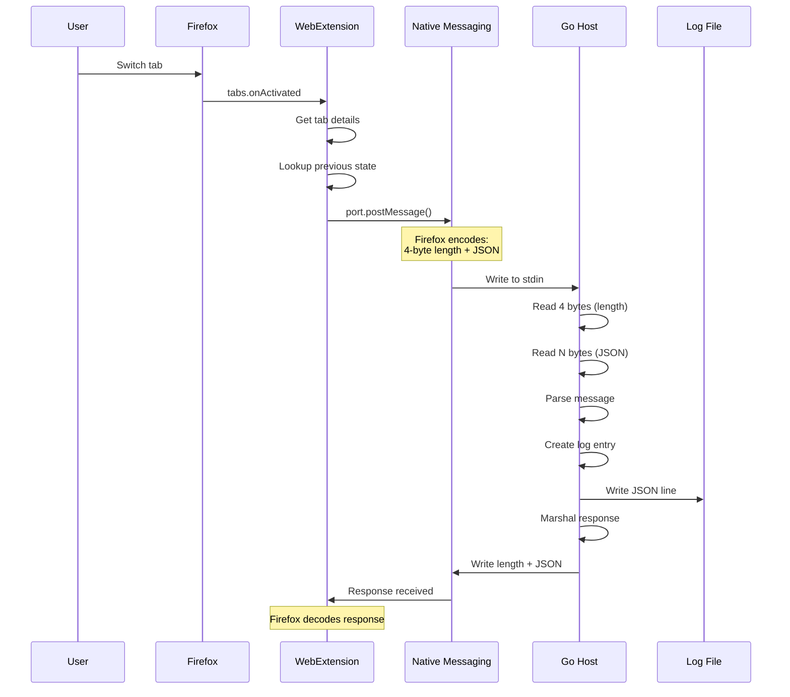
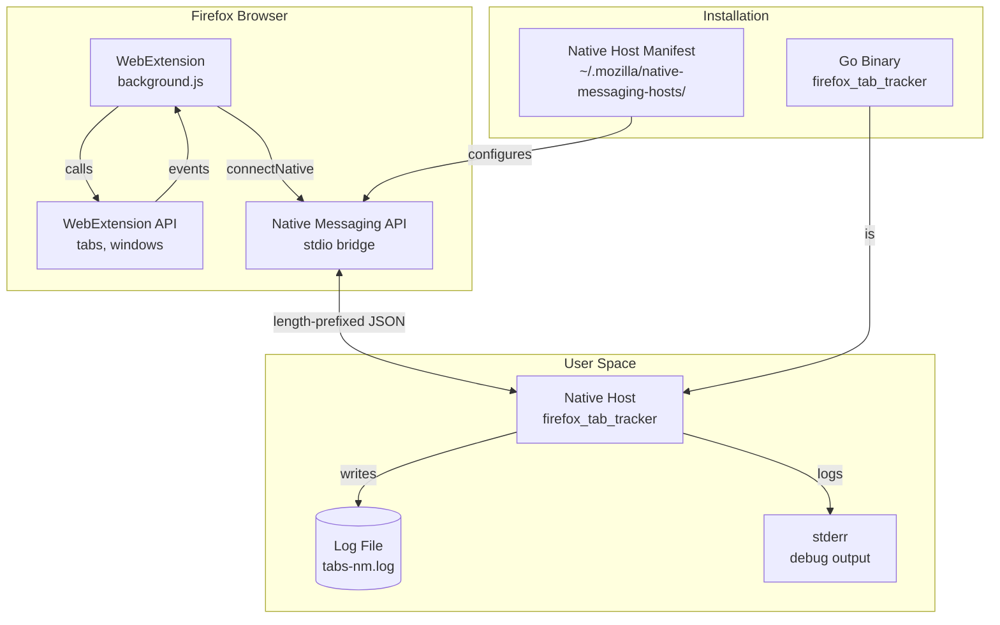

# Firefox Tab Tracker

A real-time Firefox tab tracking system using the WebExtension API and Native Messaging protocol. Unlike window manager-level tracking (i3/sway) which can only see window titles, this system monitors actual browser tabs—including URLs, navigation events, and lifecycle changes—by running privileged JavaScript inside Firefox and communicating with a native Go binary via Firefox's sanctioned Native Messaging API.

> [!summary]
> This project implements two distinct approaches for Firefox tab monitoring:
> 1. **Chrome DevTools Protocol (CDP)** via WebSocket—requires Firefox remote debugging enabled
> 2. **WebExtension + Native Messaging**—works with any Firefox, no special settings required (this is the production-ready approach)
> 
> The Native Messaging implementation creates a privileged bridge between sandboxed extension code (which can see all tab events) and a native host binary (which can write to the filesystem and integrate with system tooling).

## Why this project exists

Firefox internal state (tabs, URLs, navigation history) is **not exposed to the window manager**. Unlike window titles which Firefox updates for the WM to display, tabs are internal browser state rendered by Gecko. The window manager (i3, sway, etc.) can only see:

- Window title (which reflects the **active tab** only)
- Window class (`firefox_firefox`)
- Window geometry and focus state

What the WM **cannot** see:
- Inactive tabs and their URLs
- Tab switch events (only sees resulting title change)
- Tab lifecycle (create, destroy)
- Navigation within tabs

This project exists to fill that gap with a **production-ready, stable, and secure** mechanism for real-time tab tracking that doesn't require experimental Firefox settings.

## Core problem and solution

### The Problem

Browser automation typically requires:
- **Selenium/WebDriver**: Heavy, slow, designed for testing not monitoring
- **CDP (Remote Debugging)**: Requires `about:config` changes, experimental in Firefox, port conflicts
- **Browser extensions alone**: Sandboxed, cannot write to filesystem or talk to system processes

### The Solution: Native Messaging

Firefox's Native Messaging API provides a **sanctioned escape hatch** from the extension sandbox:

```
┌────────────────────────────────────────────────────────────────┐
│                     Firefox Browser                            │
│  ┌────────────────────┐        ┌────────────────────────────┐  │
│  │  WebExtension      │        │  Native Messaging API      │  │
│  │  (JavaScript)      │◄──────►│  (Firefox internal)        │  │
│  │                    │        │                            │  │
│  │  • Full tabs API   │        │  • Spawns native process   │  │
│  │  • All tab events  │        │  • Manages stdio pipes     │  │
│  │  • Sandboxed       │        │  • Enforces manifest       │  │
│  └────────────────────┘        └──────────────┬─────────────┘  │
└───────────────────────────────────────────────┼────────────────┘
                                                │
                    stdin/stdout                │
                    length-prefixed JSON        │
                                                ▼
┌────────────────────────────────────────────────────────────────┐
│              Native Host (Go binary)                           │
│                                                                │
│  • Reads length-prefixed messages from stdin                   │
│  • Parses JSON tab events                                     │
│  • Writes structured logs to file                              │
│  • Sends required response back to extension                   │
│                                                                │
│  stdout ──► length + {"status": "ok"}                          │
│                                                                │
└──────────────────────────┬─────────────────────────────────────┘
                           │
                           ▼
              ┌────────────────────────┐
              │  ~/.local/share/       │
              │  firefox-tab-tracker/ │
              │  /tabs-nm.log          │
              └────────────────────────┘
```

## Project structure

```
ttmp/2026/04/11/firefox-tab-tracker--firefox-tab-tracking-real-time-browser-tab-monitoring/
├── analysis/
│   └── 01-firefox-tab-tracking-architecture-and-implementation-analysis.md
│       (Detailed comparison of CDP vs Native Messaging approaches)
├── extension/
│   ├── manifest.json              # Extension configuration
│   └── background.js              # Tab event tracking (8,600+ lines)
├── scripts/
│   ├── firefox_tab_tracker.go     # CDP WebSocket client (13,000+ lines)
│   ├── native_host.go             # Native Messaging host (8,100+ lines)
│   ├── firefox_tab_tracker.json   # Native host manifest template
│   ├── setup-firefox-cdp.sh       # CDP setup helper
│   └── setup-native-messaging.sh # Native Messaging installer
├── go.mod, go.sum
└── (docmgr metadata)
```

## Implementation details

### The Native Messaging Protocol

This is the foundational protocol that makes everything work. Firefox uses a **binary length-prefixed JSON protocol** over stdio:

#### Message Format (Firefox → Host)

```
┌─────────────────────────────────────────────────────────┐
│  4 bytes: message length (uint32, little-endian)        │
├─────────────────────────────────────────────────────────┤
│  N bytes: UTF-8 encoded JSON payload                     │
└─────────────────────────────────────────────────────────┘
```

**Example:** When you switch tabs, Firefox sends:
```
Length:  0x00000180 (384 bytes, little-endian)
Payload: {"event":"tab.activated","timestamp":"2026-04-11T22:30:15.123Z",
          "tabId":42,"windowId":1,"tab":{"id":42,"title":"GitHub",
          "url":"https://github.com/...","active":true},...}
```

#### Response Format (Host → Firefox)

The host **must** respond to every message:

```
Length:  0x0000000F (15 bytes)
Payload: {"status":"ok"}
```

### Go Implementation: Reading Messages

The core read loop in `native_host.go`:

```go
func (h *NativeHost) readMessage() (*NativeMessage, error) {
    // Read 4-byte length header (little-endian uint32)
    lengthBytes := make([]byte, 4)
    if _, err := io.ReadFull(h.reader, lengthBytes); err != nil {
        return nil, err
    }
    
    length := binary.LittleEndian.Uint32(lengthBytes)
    
    // Firefox limits messages to 1MB
    if length > maxMessageSize {
        return nil, fmt.Errorf("message too large: %d bytes", length)
    }
    
    // Read the JSON payload
    body := make([]byte, length)
    if _, err := io.ReadFull(h.reader, body); err != nil {
        return nil, err
    }
    
    // Parse into structured message
    var msg NativeMessage
    if err := json.Unmarshal(body, &msg); err != nil {
        return nil, fmt.Errorf("failed to parse JSON: %w", err)
    }
    
    return &msg, nil
}
```

### Go Implementation: Writing Responses

```go
func (h *NativeHost) writeResponse(response map[string]interface{}) error {
    // Marshal response to JSON
    data, err := json.Marshal(response)
    if err != nil {
        return fmt.Errorf("failed to marshal response: %w", err)
    }
    
    // Write 4-byte length prefix (little-endian)
    length := uint32(len(data))
    lengthBytes := make([]byte, 4)
    binary.LittleEndian.PutUint32(lengthBytes, length)
    
    if _, err := h.writer.Write(lengthBytes); err != nil {
        return err
    }
    
    // Write JSON body
    if _, err := h.writer.Write(data); err != nil {
        return err
    }
    
    // Must flush - responses are buffered
    return h.writer.Flush()
}
```

### JavaScript Implementation: Extension Side

The extension uses the `browser.runtime.connectNative()` API:

```javascript
// Connect to the native host binary
const NATIVE_HOST = 'firefox_tab_tracker';
let port = browser.runtime.connectNative(NATIVE_HOST);

// Send a tab event
port.postMessage({
    event: 'tab.activated',
    timestamp: new Date().toISOString(),
    tabId: activeInfo.tabId,
    windowId: activeInfo.windowId,
    tab: {
        id: tab.id,
        title: tab.title,
        url: tab.url,
        active: tab.active
    }
});

// Firefox handles the length-prefix encoding internally
```

### Tab Event Tracking in JavaScript

The extension tracks all tab lifecycle events via the WebExtension API:

```javascript
// Tab created
browser.tabs.onCreated.addListener(async (tab) => {
    const details = await getTabDetails(tab.id);
    sendToNative({
        event: 'tab.created',
        timestamp: new Date().toISOString(),
        tab: details
    });
});

// Tab activated (switched to)
browser.tabs.onActivated.addListener(async (activeInfo) => {
    const details = await getTabDetails(activeInfo.tabId);
    const prevState = tabState.get(activeInfo.tabId) || {};
    
    sendToNative({
        event: 'tab.activated',
        timestamp: new Date().toISOString(),
        tabId: activeInfo.tabId,
        windowId: activeInfo.windowId,
        tab: details,
        previousState: prevState
    });
});

// Tab updated (URL change, title change, status change)
browser.tabs.onUpdated.addListener(async (tabId, changeInfo, tab) => {
    const prevState = tabState.get(tabId) || {};
    const changes = {};
    
    // Detect meaningful changes
    if (changeInfo.url && changeInfo.url !== prevState.url) {
        changes.url = { old: prevState.url, new: changeInfo.url };
    }
    if (changeInfo.title && changeInfo.title !== prevState.title) {
        changes.title = { old: prevState.title, new: changeInfo.title };
    }
    if (changeInfo.status) {
        changes.status = changeInfo.status;
    }
    
    // Update stored state
    tabState.set(tabId, {
        url: tab.url || prevState.url,
        title: tab.title || prevState.title,
        active: tab.active
    });
    
    // Only send if there are meaningful changes
    if (Object.keys(changes).length > 0) {
        sendToNative({
            event: 'tab.updated',
            timestamp: new Date().toISOString(),
            tabId: tabId,
            changes: changes,
            tab: await getTabDetails(tabId)
        });
    }
});

// Tab removed (closed)
browser.tabs.onRemoved.addListener((tabId, removeInfo) => {
    const prevState = tabState.get(tabId) || {};
    tabState.delete(tabId);
    
    sendToNative({
        event: 'tab.removed',
        timestamp: new Date().toISOString(),
        tabId: tabId,
        windowId: removeInfo.windowId,
        isWindowClosing: removeInfo.isWindowClosing,
        previousState: prevState
    });
});
```

### State Tracking for Change Detection

The extension maintains an in-memory `Map` of tab state to detect meaningful changes:

```javascript
const tabState = new Map(); // tabId -> {url, title, active}

// Before sending update, compare with stored state
const prev = tabState.get(tabId);
if (prev && (prev.url !== current.url || prev.title !== current.title)) {
    // Only send if actually changed
}
```

This prevents log spam from redundant events (e.g., title updates when the title hasn't actually changed).

## Security architecture

Native Messaging is **not** an open door. Firefox enforces strict security at multiple levels:

### 1. Manifest Whitelist

The native host manifest (`~/.mozilla/native-messaging-hosts/firefox_tab_tracker.json`) explicitly lists which extensions can connect:

```json
{
  "name": "firefox_tab_tracker",
  "description": "...",
  "path": "/absolute/path/to/binary",
  "type": "stdio",
  "allowed_extensions": ["tab-tracker@wesen.io"]
}
```

Only the extension with ID `tab-tracker@wesen.io` can spawn this binary.

### 2. Path Verification

- Binary must exist at the exact path in the manifest
- Binary must be executable
- Manifest must be in the user's Firefox profile directory

### 3. No Network Access

- Communication is via local pipes (stdio), not TCP
- No open ports
- No network stack involvement

### 4. Process Isolation

- Native host is spawned as a child process of Firefox
- Firefox manages the process lifecycle
- Host receives stdin from Firefox, stdout to Firefox
- stderr is separate (can be used for debugging)

### 5. User Consent

- Extension must be installed manually or signed by Mozilla
- User must approve the native messaging permission
- Firefox shows a permission prompt when extension requests native messaging

## Installation and setup

### Step 1: Build and install native host

```bash
cd ttmp/2026/04/11/firefox-tab-tracker--firefox-tab-tracking-real-time-browser-tab-monitoring/scripts
./setup-native-messaging.sh
```

This:
1. Builds the Go binary (`go build -o firefox_tab_tracker`)
2. Creates `~/.mozilla/native-messaging-hosts/` if needed
3. Installs the manifest with correct absolute path

### Step 2: Load extension in Firefox

1. Open Firefox → `about:debugging`
2. Click "This Firefox" → "Load Temporary Add-on..."
3. Navigate to `extension/` folder
4. Select `manifest.json`

The extension will immediately:
- Connect to the native host
- Send `extension.started` event
- Send `tabs.initial` snapshot of all open tabs
- Begin monitoring all tab events

### Step 3: Verify operation

```bash
# Watch logs in real-time
tail -f ~/.local/share/firefox-tab-tracker/tabs-nm.log

# Or run native host manually for debugging
./firefox_tab_tracker --verbose
```

## Event types and log format

### Logged Events

| Event | Trigger | Data Included |
|-------|---------|---------------|
| `extension.started` | Extension initializes | Timestamp |
| `tabs.initial` | Initial tab snapshot | All tabs with URLs, titles, IDs |
| `tab.created` | New tab opened | Full tab details |
| `tab.activated` | Tab switch | Previous state + new state |
| `tab.updated` | Navigation/title change | Diff of what changed |
| `tab.removed` | Tab closed | Previous state + cleanup info |
| `window.focusChanged` | Window switch | Window ID |
| `window.created` | New window | Window type, incognito status |
| `window.removed` | Window closed | Window ID |

### Log Format (JSON Lines)

```json
{
  "timestamp": "2026-04-11T22:30:15.123456789Z",
  "source": "firefox.extension",
  "event": "tab.activated",
  "data": {
    "event": "tab.activated",
    "timestamp": "2026-04-11T22:30:15.123Z",
    "tabId": 42,
    "windowId": 1,
    "tab": {
      "id": 42,
      "windowId": 1,
      "index": 3,
      "title": "GitHub - Firefox Tab Tracker",
      "url": "https://github.com/...",
      "active": true,
      "pinned": false,
      "incognito": false
    },
    "previousState": {
      "url": "https://google.com/",
      "title": "Google",
      "active": false
    }
  },
  "processed_at": "2026-04-11T22:30:15.124Z"
}
```

## Architecture diagrams

### Data Flow: Tab Switch Event



### Component Architecture



## Comparison: CDP vs Native Messaging

| Aspect | CDP (WebSocket) | Native Messaging |
|--------|-----------------|------------------|
| **Setup complexity** | Requires Firefox settings + port binding | One script setup + extension load |
| **Firefox settings** | `devtools.chrome.enabled`, `remote-enabled` | None |
| **Restart required** | Yes (for port) | No |
| **Stability** | Experimental, Firefox CDP incomplete | Production API, stable |
| **Multi-profile** | Global setting | Per-profile |
| **Port conflicts** | Port 9222 may be taken | No ports |
| **Security model** | Port accessible to all local users | Extension whitelist + manifest |
| **Tab granularity** | Full | Full |
| **Navigation tracking** | Via CDP events | Via `tabs.onUpdated` |
| **Window events** | Limited | Full (`windows` API) |
| **Incognito handling** | Can be excluded | Respects `incognito` flag |
| **Performance** | WebSocket overhead | Minimal (stdio) |
| **Auto-reconnect** | Manual | Extension manages lifecycle |

## Current status and future directions

### What works today

- [x] Native host builds and installs via setup script
- [x] Extension loads and connects to host
- [x] All tab events tracked and logged
- [x] Initial tab snapshot on startup
- [x] Change detection to avoid log spam
- [x] Structured JSON logging
- [x] Verbose mode for debugging
- [x] Reconnection after browser sleep/resume

### Open questions and next steps

- [ ] **Permanent extension signing**: Currently requires temporary add-on loading. For daily use, extension should be signed by Mozilla or use Firefox Developer Edition
- [ ] **Integration with i3-logging**: Combine window manager events with browser tab events for unified activity tracking
- [ ] **Tab content extraction**: Use `executeScript` API to get page text content for full-text search indexing
- [ ] **Session analytics**: Build tooling to analyze tab patterns (most visited sites, tab switch frequency, dwell time)
- [ ] **Firefox for Android**: Native Messaging not available—would need different approach

## Key project files

| File | Purpose | Lines |
|------|---------|-------|
| `extension/manifest.json` | Extension permissions and metadata | 30 |
| `extension/background.js` | Tab event tracking and native messaging | 8,600+ |
| `scripts/native_host.go` | Native host binary, protocol implementation | 8,100+ |
| `scripts/firefox_tab_tracker.go` | CDP WebSocket client (alternative) | 13,000+ |
| `scripts/setup-native-messaging.sh` | One-command installer | 150 |
| `analysis/01-firefox-tab-tracking-architecture-and-implementation-analysis.md` | Approach comparison and research | 10,000+ |

## Working rules

1. **Prefer Native Messaging over CDP** for production use—it's stable, requires no Firefox settings, and has better security
2. **Always use absolute paths** in the native host manifest—Firefox resolves paths relative to the manifest directory
3. **Handle all errors gracefully** in the native host—Firefox will terminate the host if it crashes or writes invalid data
4. **Maintain tab state** in the extension—this prevents redundant events and enables meaningful diffs
5. **Log to stderr for debugging**—stdout is the protocol channel, stderr is free for human-readable debug output
6. **Use JSON Lines format** for logs—easy to process with `jq`, append-only, streaming-friendly

## Related notes

- [[i3-logging]] - Complementary window manager tracking (workspace/window focus)
- [[ARTICLE - Native Messaging Protocol]] - Deep dive on the binary protocol (if created)
- [[Firefox Remote Debugging Protocol]] - CDP approach details

## References

- [Mozilla Native Messaging Documentation](https://developer.mozilla.org/en-US/docs/Mozilla/Add-ons/WebExtensions/Native_messaging)
- [WebExtension tabs API](https://developer.mozilla.org/en-US/docs/Mozilla/Add-ons/WebExtensions/API/tabs)
- [Native Messaging manifest format](https://developer.mozilla.org/en-US/docs/Mozilla/Add-ons/WebExtensions/Native_manifests)
- Project analysis: `ttmp/2026/04/11/firefox-tab-tracker--firefox-tab-tracking-real-time-browser-tab-monitoring/analysis/01-firefox-tab-tracking-architecture-and-implementation-analysis.md`
