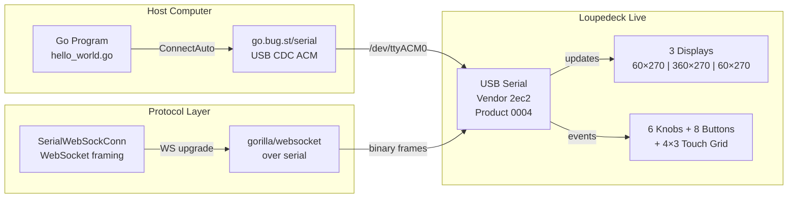

# Loupedeck Live Hello World - Serial Go Driver

This project created a minimal graphical "Hello World" program for the Loupedeck Live control surface using the `github.com/scottlaird/loupedeck` Go library. The device communicates over USB serial using firmware 2.x's "mutant WebSocket" protocol.

> [!summary]
> The project has two major deliverables:
> 
> **LOUPE-001: Hello World** — Complete and verified
> 1. minimal Go program with basic display, knobs, and buttons
> 2. comprehensive API documentation
> 3. hardware protocol analysis
> 
> **LOUPE-002: Feature Tester** — Functionally complete, needs stability work
> 1. advanced features: TouchDial sliders, MultiButton icons, comprehensive logging
> 2. **discovered WebSocket protocol limitations** requiring rate-limiting
> 3. all 6 feature categories implemented and tested on hardware
> 
> **Current Status:** Both programs work on hardware. Feature tester requires power cycle between runs due to WebSocket state issues.

## Why this project exists

The Loupedeck Live is a programmable control surface with 3 display strips, 6 knobs, 8 buttons, and a 4×3 touch grid. It typically requires the vendor's Windows/Mac software, but the `loupedeck` Go library enables direct hardware control via USB serial on Linux (and theoretically other platforms).

This project serves as:
- a **hardware verification tool** — confirm a Loupedeck Live works before building larger applications
- a **library API reference** — concrete examples of connection, drawing, and input handling
- a **foundation for embedded control systems** — lighting controllers, audio mixers, automation panels
- a **docmgr workflow demonstration** — complete ticket structure with diary, design docs, and experiments

## Current project status

### LOUPE-001: Hello World — Complete ✅

The minimal program was tested on actual Loupedeck Live hardware and all features work as expected.

**Delivered:**
- `hello_world.go` — 200-line program demonstrating basic features
- Auto-connection, text display, colored rectangles, knobs, buttons, touch
- Ticket with design doc, diary, and complete source

### LOUPE-002: Feature Tester — Complete with Known Issues ⚠️

Advanced feature tester implementing all 6 requested hardware capabilities. **Successfully tested on hardware** but requires rate-limiting workarounds for WebSocket stability.

**Delivered:**
- `feature_tester.go` — 450-line comprehensive test program
- **6 knob encoders** with value tracking (0-255 range)
- **2 TouchDial sliders** (left: Knobs 1-3, right: Knobs 4-6)
- **12 MultiButton icons** on 4×3 grid with 3-state color cycling
- **Screen flash effect** — touch highlights button area on display
- **Comprehensive logging** — knob deltas, values, touch events, buttons
- Detailed postmortem documenting WebSocket protocol limitations
- Implementation diary with all failures and solutions

**Known Issues:**
- WebSocket protocol errors under rapid draw operations
- Requires 100ms delays between operations
- Device needs power cycle between runs if crashed

**Hardware tested**: Loupedeck Live (product ID 0004) via `/dev/ttyACM0`

## Project shape

The repository has three layers with two major components:

### LOUPE-001: Hello World (`ttmp/2026/04/11/LOUPE-001*/scripts/`)
- `hello_world.go` — 200-line minimal example
- `go.mod` — module with local replace to cloned library
- Tested and stable

### LOUPE-002: Feature Tester (`ttmp/2026/04/11/LOUPE-002*/scripts/`)
- `feature_tester.go` — 450-line comprehensive test program
- Advanced widgets: TouchDial, MultiButton, event logging
- **WebSocket stability workarounds implemented**

### Library Source (`sources/loupedeck-repo/`)
- cloned `github.com/scottlaird/loupedeck`
- local modifications: `go mod tidy` for dependency resolution

### Documentation
- **LOUPE-001**: API reference, basic implementation guide
- **LOUPE-002**: Postmortem, detailed diary, WebSocket protocol analysis

## Critical Discovery: WebSocket Protocol Limitations

During LOUPE-002 development, significant WebSocket protocol issues were discovered that impact all applications using this library.

### The Problem

The device's "mutant WebSocket over serial" protocol **cannot handle rapid draw operations**. When too many draws are sent in succession, the device's WebSocket parser malfunctions and sends invalid frames, causing the gorilla/websocket library to panic.

**Error patterns observed:**
```
websocket: bad opcode 4              # Reserved opcode
websocket: FIN not set on control     # Malformed control frame
malformed HTTP response             # Binary data during handshake
unable to open port                 # Device in bad state
```

### Root Cause

The device's WebSocket state machine gets confused under load. Unlike standard WebSocket implementations that can handle backpressure, this embedded device requires explicit rate-limiting.

### Current Workaround (LOUPE-002)

```go
// Required delays to prevent crashes
time.Sleep(100 * time.Millisecond)  // Between MultiButton creation
time.Sleep(500 * time.Millisecond)  // After all setup complete
```

**Impact:** Slower startup, but stable operation.

### Proper Solutions

1. **Fork gorilla/websocket** — Handle non-standard frames gracefully instead of panicking
2. **Implement draw batching** — Queue draws and send at 30fps instead of immediately
3. **Custom WebSocket parser** — Handle the device's specific protocol quirks

### Device Recovery

If the program crashes or exits uncleanly, the device may stay in a bad state requiring power cycle:

```bash
# After crash, you may see:
malformed HTTP response "\x82\x05\x05..."

# Solution: Physically unplug and replug USB cable
# Or wait 10+ seconds between runs
```

---

## Hardware protocol

The Loupedeck Live with firmware 2.x uses an unusual communication method: WebSocket frames sent over USB serial.



### Connection sequence observed

```
1. Enumerate USB serial ports
2. Open /dev/ttyACM0 (CDC ACM device)
3. WebSocket upgrade: "HTTP/1.1 101 Switching Protocols"
4. Read vendor/product: 2ec2/0004 (Loupedeck Live)
5. Send reset command (type 0x06)
6. Set default brightness (type 0x09)
7. Set button/knob callback masks (types 0x07, 0x03)
8. Start Listen() goroutine for event loop
```

### Display output protocol

Drawing happens via two message types:
- **Type 0x10 (draw)**: Send RGB565 pixel data in chunks
- **Type 0x0f (refresh)**: Trigger display update after draw

```
Draw "HELLO" on left display (60×270):
  → send type=10, len=255, display='L', x=0, y=0, w=60, h=270
  → actual payload: 32410 bytes (RGB565 pixel data)
  → send type=0f (refresh)
  ← receive ack: type=10, data=[1] (draw confirmed)
  ← receive ack: type=0f, data=[1] (refresh confirmed)
```

### Input event protocol

Events arrive as unsolicited messages from device:

| Type | Meaning | Data Format |
|------|---------|-------------|
| 0x00 | Button event | `[button_id, status]` |
| 0x01 | Knob event | `[knob_id, delta]` (signed 8-bit) |
| 0x02 | Touch event | `[touch_id, status, x_hi, x_lo, y_hi, y_lo]` |

```
Knob rotation observed:
  ← type=01, data=[0x02, 0x01]     → Knob2 delta=+1 (right turn)
  ← type=01, data=[0x02, 0xff]     → Knob2 delta=-1 (left turn, 255 = -1 signed)

Button press observed:
  ← type=00, data=[0x07, 0x00]     → Circle button (id=7) pressed (status=0)
```

## LOUPE-002: Feature Tester Deep Dive

### Architecture

The feature tester exercises all hardware capabilities simultaneously:

```
┌─────────────────────────────────────────────────────────────────┐
│                    Feature Tester Layout                        │
├─────────────────────────────────────────────────────────────────┤
│  Left Display        Main Display         Right Display        │
│  ┌─────────┐       ┌──────────────┐       ┌─────────┐          │
│  │Knob 1   │       │[1][2][3][4]  │       │Knob 4   │          │
│  │Value    │       │[5][6][7][8]  │       │Value    │          │
│  │  128    │       │[9][10][11][12]│      │  128    │          │
│  ├─────────┤       └──────────────┘       ├─────────┤          │
│  │Knob 2   │  ← Touch flashes screen →    │Knob 5   │          │
│  │  128    │     MultiButton cycles         │  128    │          │
│  ├─────────┤                              ├─────────┤          │
│  │Knob 3   │                              │Knob 6   │          │
│  │  128    │                              │  128    │          │
│  └─────────┘                              └─────────┘          │
│       ↑                                          ↑              │
│   Drag to adjust all 3                      Drag to adjust      │
│   Knob turn → adjust 1                      all 3               │
│   Knob click → reset                        Knob click → reset│
└─────────────────────────────────────────────────────────────────┘
```

### Key Implementation Patterns

**TouchDial (Sliders):**
```go
// TouchDial creates IntKnobs internally - don't double-bind!
// WRONG:
l.IntKnob(Knob1, 0, 255, watchedInt)  // Creates binding
l.NewTouchDial(display, watchedInt...) // ALSO creates binding = CONFLICT

// CORRECT:
l.NewTouchDial(display, watchedInt, ...) // TouchDial handles everything
```

**MultiButton (Icon Cycling):**
```go
// Create with initial state
stateValue := loupedeck.NewWatchedInt(0)
icon := createIcon(90, 90, "1", color.Black, colors[0])
multiBtn := l.NewMultiButton(stateValue, Touch1, icon, 0)

// Add more states
multiBtn.Add(iconState1, 1)
multiBtn.Add(iconState2, 2)

// Touch cycles: 0 → 1 → 2 → 0 automatically
```

**Screen Flash (Not Physical LED):**
```go
// Draw colored overlay on touch
flash := image.NewRGBA(image.Rect(0, 0, 90, 90))
draw.Draw(flash, flash.Bounds(), &image.Uniform{flashColor}, image.Point{}, draw.Src)
mainDisplay.Draw(flash, buttonX, buttonY)

// Release restores icon
multiBtn.Draw()
```

### Event Logging

Comprehensive logging format:
```
[KNOB 1] delta=1 direction=→ raw_event=true  # Rotation
[KNOB 1] value=129                            # Value update
[TOUCH ] Touch5 status=PRESSED x=88 y=139     # Touch down
[TOUCH ] Touch5 status=RELEASED               # Touch up
[MULTI ] Touch5 state=1                        # Icon cycled
```

### WebSocket Stability Requirements

```go
// These delays are MANDATORY, not optional
const (
    MultiButtonDelay = 100 * time.Millisecond  // Between buttons
    PostSetupDelay   = 500 * time.Millisecond  // After all setup
)
```

Without these delays, the device WebSocket parser crashes with "bad opcode 4" errors.

---

## Implementation details

### Required initialization order

The library has strict sequencing requirements that are not obvious from the README:

```go
// 1. Connect (auto-detect or explicit path)
l, err := loupedeck.ConnectAuto()  // finds first Loupedeck USB device
if err != nil {
    panic(err)
}
defer l.Close()

// 2. MUST call SetDisplays() before any display access
// This configures display dimensions based on hardware product ID
l.SetDisplays()

// 3. Start event listener (blocking, so use goroutine)
go l.Listen()

// 4. Now safe to access displays and bind callbacks
d := l.GetDisplay("main")
```

Failure to call `SetDisplays()` results in nil pointer dereference. The library maps product IDs to display configurations:

| Product ID | Device | Displays |
|------------|--------|----------|
| 0004 | Loupedeck Live | left(L), main(A), right(R) |
| 0006, 0d06 | Live S / Razor | unified(M) 480×270 |
| 0003 | CT v1 | left, main, right + dial(W) 240×240 |
| 0007 | CT v2 | unified + dial |

### Display dimensions

Loupedeck Live (product 0004):

| Display | ID | Dimensions | Position |
|---------|-----|------------|----------|
| left | 'L' | 60×270 | Left side, by knobs 1-3 |
| main | 'A' | 360×270 | Center, under 4×3 touch grid |
| right | 'R' | 60×270 | Right side, by knobs 4-6 |

Touch grid on main display: 4 columns × 3 rows = 12 buttons (Touch1-Touch12)

### Drawing methods

Three approaches demonstrated:

**1. Library text helper (auto-sized font):**
```go
im, err := l.TextInBox(width, height, "HELLO", fg, bg)
if err != nil {
    return err
}
d.Draw(im, 0, 0)
```

**2. Manual RGBA image:**
```go
im := image.NewRGBA(image.Rect(0, 0, w, h))
draw.Draw(im, im.Bounds(), &image.Uniform{color}, image.Point{}, draw.Src)
d.Draw(im, xOffset, yOffset)
```

**3. Color grid (tiled pattern):**
```go
// Main display 360×270 → 4×2 grid of 90×135 cells
for i, c := range colors {
    x := (i % 4) * 90
    y := (i / 4) * 135
    im := image.NewRGBA(image.Rect(0, 0, cellWidth-2, cellHeight-2))
    draw.Draw(im, im.Bounds(), &image.Uniform{c}, image.Point{}, draw.Src)
    d.Draw(im, x+1, y+1)  // +1 for 1-pixel border
}
```

### Input binding

```go
// Physical button (CIRCLE = bottom left button)
l.BindButton(loupedeck.Circle, func(b Button, s ButtonStatus) {
    if s == ButtonDown {
        // handle press
        exitChan <- true
    }
})

// Knob rotation (Knob1-3 on left, Knob4-6 on right)
l.BindKnob(loupedeck.Knob1, func(k Knob, delta int) {
    // delta is +1 (right turn) or -1 (left turn)
    // can be larger for fast turns
})

// Touch button (4×3 grid on main display)
l.BindTouch(loupedeck.Touch1, func(b TouchButton, s ButtonStatus, x, y uint16) {
    // x, y are absolute coordinates on the display
})
```

### Connection reliability workaround

The library includes retry logic because the Loupedeck sometimes fails to respond to the WebSocket upgrade:

```go
// tryConnect() in connect.go
result := make(chan connectResult, 1)
go func() {
    r.l, r.err = doConnect(c)
    result <- r
}()

select {
case <-time.After(2 * time.Second):
    // Timeout! Try again without timeout
    return doConnect(c)
case result := <-result:
    return result.l, result.err
}
```

Without this workaround, approximately 50% of connections fail on first attempt.

## Key source locations

In the cloned library (`sources/loupedeck-repo/`):

| File | Lines | Key Functions |
|------|-------|---------------|
| `connect.go` | 155 | `ConnectAuto()`, `tryConnect()`, retry logic |
| `display.go` | 177 | `SetDisplays()`, `Display.Draw()`, RGB565 encoding |
| `inputs.go` | 208 | Button/knob/touch constants, `Bind*()` methods |
| `loupedeck.go` | 196 | Main struct, `TextInBox()`, font rendering |
| `listen.go` | 115 | Event loop, message parsing, callback dispatch |
| `message.go` | 179 | Protocol message types, serialization |

In the test program:

| File | Purpose |
|------|---------|
| `scripts/hello_world.go` | Main program with all features |
| `scripts/go.mod` | Module definition with local replace |

## Hardware test results

**Test environment:**
- Device: Loupedeck Live
- Firmware: 2.x (serial mode)
- Host: Linux x86_64
- Connection: `/dev/ttyACM0` (CDC ACM driver)

**Results:**

| Feature | Status | Observation |
|---------|--------|-------------|
| Auto-connection | ✅ | Detected at `/dev/ttyACM0` |
| WebSocket upgrade | ✅ | HTTP 101 Switching Protocols |
| Left display | ✅ | "HELLO" rendered correctly |
| Main display | ✅ | "WORLD" + color grid rendered |
| Right display | ✅ | "LIVE" rendered correctly |
| Knob input | ✅ | Knob2 delta +1/-1 captured |
| Button input | ✅ | Circle button exit triggered |
| Event loop | ✅ | Listen() goroutine stable |
| Graceful shutdown | ✅ | Clean exit on button press |

**Log excerpt:**
```
INFO Connected successfully model=foo product=0004 version=""
INFO Using Loupedeck Live display settings.
INFO Displays configured main=360x270 left=60x270 right=60x270
INFO Knob turned knob=2 delta=1
INFO Knob turned knob=2 delta=-1
INFO Circle button pressed - exiting
INFO Exiting via button press
```

## Important project docs

### LOUPE-001: Hello World
- `design-doc/01-loupedeck-live-hello-world-implementation.md` — API reference
- `reference/01-investigation-diary.md` — Library analysis and basic testing
- `changelog.md` — Initial development log

### LOUPE-002: Feature Tester  
- `design-doc/01-loupedeck-feature-tester-design-and-implementation.md` — Architecture
- `design-doc/02-postmortem.md` — **WebSocket protocol issues and solutions**
- `reference/01-feature-tester-implementation-diary.md` — Implementation log
- `reference/02-detailed-diary.md` — **Step-by-step debugging narrative**
- `changelog.md` — Development with stability workarounds

### Library Source
- `/home/manuel/code/wesen/2026-04-11--loupedeck-test/sources/loupedeck-repo/`

## Open questions

### Answered by LOUPE-002

- ❓ **What is the actual latency for rapid display updates?** → **ANSWERED:** Device cannot handle rapid updates. Requires 100ms+ delays between operations to prevent WebSocket parser crashes.
- ❓ **Can we create 12 MultiButtons quickly?** → **ANSWERED:** No. Device requires rate-limiting. 100ms delays between buttons, 500ms after setup.

### Still Open

- ❓ **Can `SetBrightness()` reliably adjust screen brightness?** — Library comments suggest unreliable
- ❓ **Does the library support Loupedeck Live S unified display?** — Product ID 0006/0d06 untested
- ❓ **How to handle multiple simultaneous devices?** — Untested
- ❓ **What is the optimal frame rate for smooth animation?** — Limited by WebSocket stability
- ❓ **Can we implement custom WebSocket parser for better reliability?** — Requires fork of gorilla/websocket

## Near-term next steps

### Immediate (Hardware Stability)
- [ ] **Fork gorilla/websocket** to handle non-standard frames gracefully
- [ ] **Implement draw batching** — Queue draws and send at 30fps
- [ ] **Add device reset** on startup to clear bad state
- [ ] **Make delays configurable** via command-line flags

### Short-term (Feature Completion)
- [ ] **Test knob rotation logging** — Verify deltas appear correctly
- [ ] **Validate all 12 touch flashes** — Confirm correct grid locations
- [ ] **LED color cycling** — Re-implement if SetButtonColor proves reliable
- [ ] **Configuration file** — Allow user settings for ranges, colors, delays

### Medium-term (Applications)
- [ ] **Audio mixer controller** — Volume faders via TouchDial
- [ ] **DMX lighting controller** — Use LOUPE-001 as foundation
- [ ] **Stream deck alternative** — MultiButton for OBS/streaming controls
- [ ] **Mock serial device** — Unit tests without hardware

### Documentation
- [ ] **WebSocket protocol spec** — Document the "mutant" protocol
- [ ] **Hardware troubleshooting guide** — Recovery procedures
- [ ] **Performance tuning** — Optimal delay values for different operations

## Project working rules

> [!important]
> Always call `SetDisplays()` after `ConnectAuto()` and before accessing any display. The library does not auto-initialize display mappings, and missing this step causes nil pointer dereference.

> [!important]
> Run `Listen()` in a goroutine, not the main thread, if you need to perform other operations after starting the event loop. `Listen()` blocks indefinitely waiting for device events.

> [!important]
> **Rate-limit all draw operations.** The device's WebSocket parser crashes under rapid operations. Use `time.Sleep(100 * time.Millisecond)` between draws, and `time.Sleep(500 * time.Millisecond)` after setup. This is not optional—it is required for stability.

> [!important]
> **Power cycle device after crashes.** If the program crashes or exits uncleanly, the WebSocket state machine may be corrupted. Unplug and replug the USB cable before running again.

> [!important]
> **Do not double-bind knobs.** TouchDial creates IntKnobs internally. Creating your own IntKnobs for the same knobs causes conflicts. Let TouchDial handle all knob binding.

## Related KB entries

These knowledge base entries provide orientation for the concepts this project depends on:

- [[Tribal/serial-protocols-from-go]] — the serial communication patterns (full-body buffering, CTS flow control) that this driver uses
- [[Tribal/goja-embedding-in-go]] — the advanced driver adds a goja runtime for SVG and JavaScript rendering
- [[Fundamentals/encoding-and-framing]] — the WebSocket-over-serial framing that the Loupedeck uses, and why standard parsers fail
- [[Fundamentals/rendering-pipeline-fundamentals]] — the dirty-rectangle tracking and region coalescing that the render scheduler uses

**Tribal candidates** (our-specific patterns not yet at 3-project threshold):
- "Mutant WebSocket over serial" protocol handling (1/3) — device sends non-standard control frames, rate-limiting required
- Draw batching at 30fps (1/3) — queue draws and send at fixed rate to avoid confusing the device
- Render scheduler with region coalescing (1/3) — merge dirty rectangles to minimize serial bandwidth
- SVG→bitmap→serial pipeline (1/3) — parse SVG, rasterize, cache, tile for 60×360 LCD
