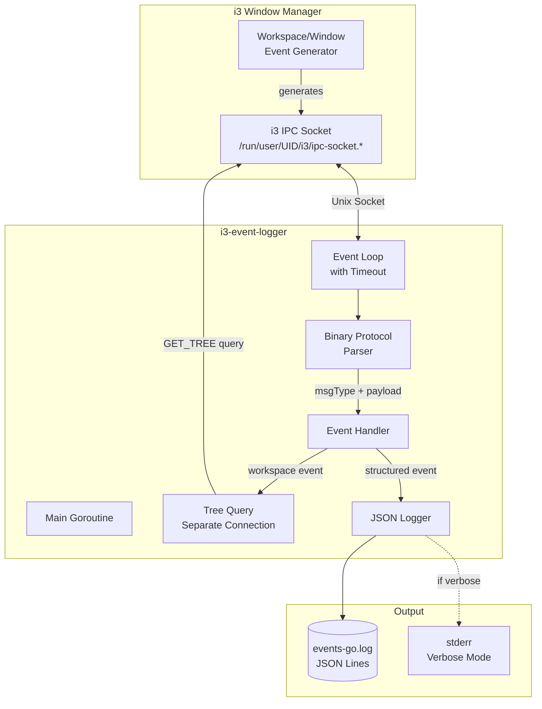
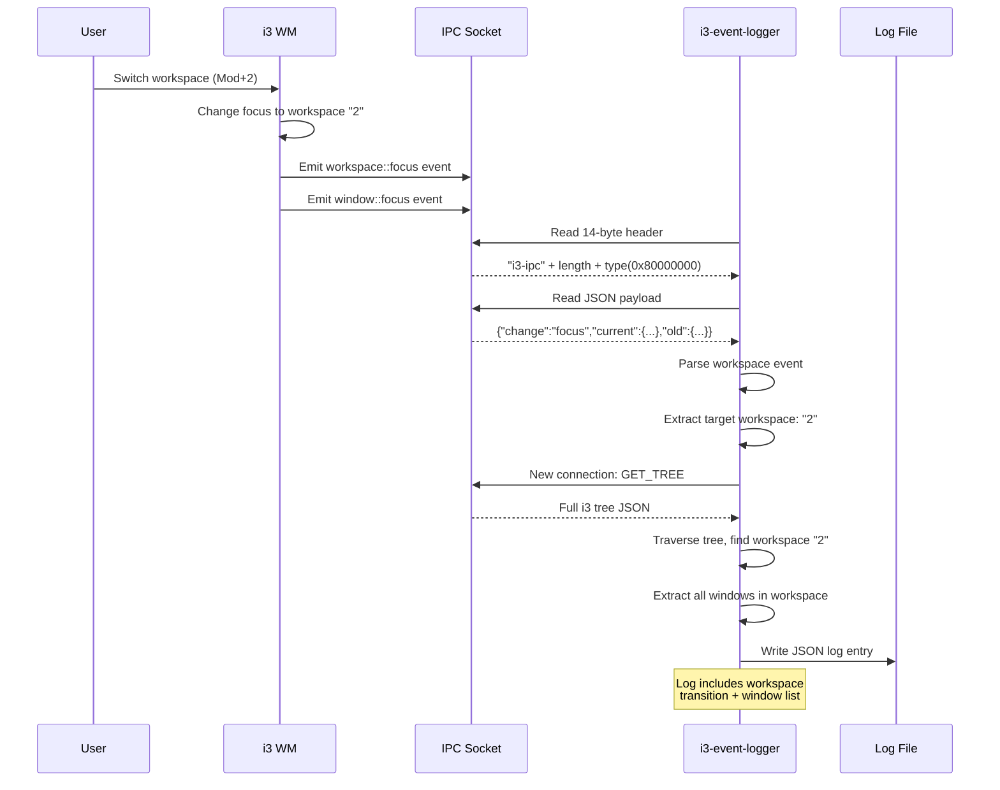

# i3 Event Logger

A native Go implementation of the i3 window manager IPC protocol for real-time tracking of workspace switches and window focus changes. Unlike polling-based solutions, this uses event-driven subscriptions via i3's Unix socket, capturing every workspace transition and window focus event with nanosecond timestamps and structured JSON logging.

> [!summary]
> This project implements a complete i3 IPC client from scratch, including:
> 1. **Native i3 IPC protocol implementation** - Binary protocol parsing without external dependencies
> 2. **Event-driven architecture** - Subscribes to workspace and window events via `i3-msg -t subscribe -m` equivalent
> 3. **Workspace window enumeration** - When switching workspaces, queries the full i3 tree to list all windows with titles and classes
> 4. **Structured logging** - JSON Lines format with ISO 8601 timestamps for downstream analysis

## Why this project exists

Tracking desktop activity for productivity analysis, context switching research, or automated workspace management requires reliable data about when and where focus changes occur. Existing solutions have limitations:

| Approach | Limitations |
|----------|-------------|
| **Polling `i3-msg -t get_tree`** | High CPU usage, misses rapid switches, coarse timestamps |
| **Shell scripts with `xprop -spy`** | X11 only, no Wayland support, fragile parsing |
| **Python `i3ipc` library** | External dependency, doesn't support workspace window enumeration |
| **Log parsing** | Post-hoc, not real-time |

This project exists to provide a **production-grade, minimal-dependency, real-time** solution that captures every event the moment it happens with full workspace context.

## Core problem and solution

### The Problem

i3/sway provide an IPC socket for external control and monitoring, but:
- The protocol is **binary and undocumented** beyond source code
- Event subscriptions require **continuous reading** or i3 drops the connection
- Events and command replies **interleave** on subscribed sockets
- **No built-in way** to get window list when switching workspaces from events alone

### The Solution: Native Protocol Implementation

This project implements the **complete i3 IPC protocol** in Go, connecting to the Unix socket, subscribing to events, and parsing the binary protocol natively.

## Project structure

```
2026-04-11--i3-logging/
├── ttmp/
│   └── 2026/04/11/i3-logging--i3-event-logger-workspace-and-window-focus-tracking/
│       ├── analysis/
│       │   └── 01-i3-ipc-event-analysis-and-implementation-strategy.md
│       ├── scripts/
│       │   ├── main.go                 # Go implementation (~18,000 bytes)
│       │   ├── go.mod                  # Go module
│       │   └── i3_event_logger.py      # Python prototype (legacy)
│       └── (docmgr metadata)
└── .ttmp.yaml                          # Docmgr configuration
```

## The i3 IPC Protocol

The i3 IPC protocol uses a binary message format over Unix domain sockets.

### Message Format

Every i3 IPC message has a 14-byte header followed by JSON payload:

| Offset | Size | Field | Description |
|--------|------|-------|-------------|
| 0 | 6 bytes | magic | Literal "i3-ipc" |
| 6 | 4 bytes | length | uint32 little-endian payload length |
| 10 | 4 bytes | type | uint32 little-endian message type |
| 14 | N bytes | payload | JSON data |

### Message Types

| Type | Value | Purpose |
|------|-------|---------|
| RUN_COMMAND | 0 | Execute i3 commands |
| GET_WORKSPACES | 1 | Query workspace list |
| SUBSCRIBE | 2 | Subscribe to events |
| GET_OUTPUTS | 3 | Query outputs (monitors) |
| GET_TREE | 4 | Query full container tree |
| GET_VERSION | 7 | Get i3 version info |
| WORKSPACE_EVENT | 0x80000000 | Workspace change event |
| WINDOW_EVENT | 0x80000003 | Window change event |

Event types have the high bit set (0x80000000 + offset).

## Implementation details

### Socket Discovery

The logger discovers the i3 socket through multiple methods:

1. **Environment variable**: `$I3SOCK` or `$SWAYSOCK`
2. **Standard path**: `/run/user/{UID}/i3/ipc-socket.*`
3. **Sway fallback**: `/run/user/{UID}/sway-ipc.{UID}.sock`

```go
func discoverSocket() string {
    // 1. Check environment
    if sock := os.Getenv("I3SOCK"); sock != "" {
        return sock
    }
    
    // 2. Look in /run/user/UID/i3/
    uid := os.Getuid()
    sockDir := fmt.Sprintf("/run/user/%d/i3/", uid)
    // Find ipc-socket.* files
    
    // 3. Try sway socket
    swaySock := fmt.Sprintf("/run/user/%d/sway-ipc.%d.sock", uid, uid)
    
    return ""
}
```

### Binary Protocol Parsing

The core read loop parses the 14-byte header:

```go
func (c *I3IPCClient) readMessage() (uint32, []byte, error) {
    // Read 14-byte header
    header := make([]byte, i3IPCHeaderLen) // 14 bytes
    if _, err := io.ReadFull(c.conn, header); err != nil {
        return 0, nil, fmt.Errorf("failed to read header: %w", err)
    }
    
    // Verify magic "i3-ipc"
    if string(header[0:6]) != "i3-ipc" {
        return 0, nil, fmt.Errorf("invalid magic: %q", header[0:6])
    }
    
    // Parse length and type (little-endian)
    payloadLen := binary.LittleEndian.Uint32(header[6:10])
    msgType := binary.LittleEndian.Uint32(header[10:14])
    
    // Read payload
    payload := make([]byte, payloadLen)
    if _, err := io.ReadFull(c.conn, payload); err != nil {
        return 0, nil, fmt.Errorf("failed to read payload: %w", err)
    }
    
    return msgType, payload, nil
}
```

### Event Subscription

To receive events, send a SUBSCRIBE message:

```go
func (c *I3IPCClient) Subscribe(events []string) error {
    // Marshal event list as JSON: ["workspace", "window"]
    payload, _ := json.Marshal(events)
    
    // Send SUBSCRIBE message (type 2)
    c.sendMessage(msgTypeSubscribe, payload)
    
    // Read success response
    msgType, payload, _ := c.readMessage()
    // Response: {"success": true}
    
    return nil
}
```

After subscription, i3 begins streaming events on the socket.

### Event Loop with Timeout

The event loop uses read timeouts to enable clean shutdown:

```go
func (c *I3IPCClient) Run() {
    for {
        // Set 100ms timeout to check for shutdown signal
        c.conn.SetReadDeadline(time.Now().Add(100 * time.Millisecond))
        
        msgType, payload, err := c.readMessage()
        if err != nil {
            // Check if timeout (normal) or real error
            if netErr, ok := err.(net.Error); ok && netErr.Timeout() {
                continue // Check shutdown signal, retry
            }
            // Handle real error
        }
        
        // Process event (high bit set = event, not reply)
        if msgType & 0x80000000 != 0 {
            c.handleEvent(msgType, payload)
        }
    }
}
```

### Workspace Window Enumeration

When a workspace switch occurs, the logger queries the full i3 tree to get all windows in the target workspace:

```
Workspace Event ──► Parse target workspace name ──► Send GET_TREE query
                                                          │
                    ┌─────────────────────────────────────┘
                    ▼
           Traverse tree: root ──► outputs ──► workspaces ──► containers
                    │
                    ▼
           Extract window titles, classes, IDs
                    │
                    ▼
           Include in log entry
```

The tree traversal:

```go
func extractWindowsFromTree(tree map[string]interface{}, workspaceName string) []WorkspaceWindow {
    // i3 tree structure:
    // root
    //   └── nodes[] (outputs)
    //       └── nodes[] (workspaces or containers)
    //           └── nodes[] (nested containers)
    //               └── window (has "window" property)
    
    // Recursively search for workspace by name
    // Then collect all windows (containers with "window" property)
}
```

### Separate Connection for Queries

i3 warns that subscribed sockets can have events interleaved with replies. The logger uses a **separate connection** for tree queries:

```go
// Event listener uses main connection
client, _ := NewI3IPCClient("")
client.Subscribe([]string{"workspace", "window"})

// For workspace events, open second connection
if msgType == eventTypeWorkspace {
    queryClient, _ := client.Clone()  // New socket connection
    tree, _ := queryClient.GetTree()   // Query
    windows = extractWindowsFromTree(tree, workspaceName)
    queryClient.Close()
}
```

This prevents event/reply interleaving issues.

## Log format and event types

### Event Types

| Event | Trigger | Data Fields |
|-------|---------|-------------|
| `startup` | Logger starts | Timestamp |
| `workspace` | Workspace switch | `from_workspace`, `to_workspace`, `old_workspace_num`, `current_workspace_num`, `windows[]` |
| `window` | Window focus change | `title`, `window_class`, `container_id`, `window_id` |
| `shutdown` | Logger stopped | Timestamp |

### JSON Log Format

```json
{
  "timestamp": "2026-04-11T22:04:05.936141058Z",
  "event_type": "workspace",
  "change": "focus",
  "from_workspace": "3",
  "to_workspace": "2",
  "old_workspace_num": 3,
  "current_workspace_num": 2,
  "windows": [
    {
      "title": "PROJ - Loupedeck Live Hello World",
      "class": "obsidian",
      "container_id": 94980126263072,
      "window_id": 39845891
    },
    {
      "title": "π - pinocchiorc",
      "class": "kitty",
      "container_id": 94980126255952,
      "window_id": 96469006
    }
  ],
  "window_count": 2
}
```

### Window Event Example

```json
{
  "timestamp": "2026-04-11T22:04:05.943982486Z",
  "event_type": "window",
  "change": "focus",
  "title": "PROJ - Loupedeck Live Hello World",
  "window_class": "obsidian",
  "container_id": 94980126263072,
  "window_id": 39845891
}
```

## Architecture diagrams

### System Architecture



### Data Flow: Workspace Switch



### Protocol Parsing

```mermaid
flowchart TD
    A[Start Read] --> B[Read 14 bytes]
    B --> C{Magic == "i3-ipc"?}
    C -->|No| D[Error: Invalid Magic]
    C -->|Yes| E[Parse length: binary.LittleEndian.Uint32]
    E --> F[Parse type: binary.LittleEndian.Uint32]
    F --> G{Type & 0x80000000?}
    
    G -->|Yes: Event| H[Read N bytes payload]
    G -->|No: Reply| I[Read N bytes payload]
    
    H --> J[Parse JSON]
    I --> K[Handle Reply]
    J --> L{Event Type}
    
    L -->|workspace| M[Handle Workspace Event]
    L -->|window| N[Handle Window Event]
    
    M --> O[Query GET_TREE for windows]
    O --> P[Build Log Entry]
    N --> P
    K --> Q[Continue Loop]
    P --> Q
    Q --> A
```

## Implementation challenges

### Challenge 1: Event/Reply Interleaving

**Problem:** After subscribing, i3 can send events interleaved with command replies on the same socket.

**Solution:** Use **separate connections** for event listening vs. command queries. The event connection stays subscribed, while short-lived connections handle `GET_TREE` queries.

### Challenge 2: Read Blocking on Shutdown

**Problem:** `io.ReadFull()` blocks indefinitely waiting for data, preventing clean shutdown on Ctrl+C.

**Solution:** Use **read timeouts** with `SetReadDeadline()`:

```go
tcpConn.SetReadDeadline(time.Now().Add(100 * time.Millisecond))
```

This allows checking for shutdown signals between reads.

### Challenge 3: Socket Path Discovery

**Problem:** i3 socket path varies by setup (i3 vs. sway, different UIDs, environment variables).

**Solution:** **Multi-strategy discovery** with fallbacks:
1. Environment variables first (`$I3SOCK`)
2. Standard runtime directory
3. Sway-specific paths

### Challenge 4: Tree Traversal Performance

**Problem:** Traversing the full i3 tree for every workspace switch adds latency.

**Solution:** The tree query is **fast enough** (< 10ms) for interactive use. For high-frequency tracking, could implement caching, but the current approach prioritizes accuracy over micro-optimization.

## Usage

### Build

```bash
cd ttmp/2026/04/11/i3-logging--i3-event-logger-workspace-and-window-focus-tracking/scripts
go build -o i3-event-logger main.go
```

### Run

```bash
# Default: log to ~/.local/share/i3-events/events-go.log
./i3-event-logger

# Verbose mode (print to stderr)
./i3-event-logger --verbose

# Custom log file
./i3-event-logger --log-file /tmp/i3.log --verbose

# Specific socket (if auto-discovery fails)
./i3-event-logger --socket /run/user/1000/i3/ipc-socket.1234
```

### Analyze logs

```bash
# Pretty-print workspace switches
jq -r 'select(.event_type == "workspace") | "\(.timestamp): ws \(.from_workspace) → \(.to_workspace) (\(.window_count) windows)"' ~/.local/share/i3-events/events-go.log

# Count window focus events by class
jq -r 'select(.event_type == "window") | .window_class' ~/.local/share/i3-events/events-go.log | sort | uniq -c | sort -rn

# Find all Firefox windows
jq -r 'select(.event_type == "window" and .window_class == "firefox_firefox") | "\(.timestamp): \(.title)"' ~/.local/share/i3-events/events-go.log
```

## Current status

### Implemented

- [x] Native i3 IPC protocol (header parsing, type detection)
- [x] Socket discovery (environment + filesystem)
- [x] Event subscription (workspace, window)
- [x] Event loop with timeout-based shutdown
- [x] Workspace window enumeration via GET_TREE
- [x] Tree traversal (find workspace, extract windows)
- [x] Structured JSON logging
- [x] Signal handling (SIGINT, SIGTERM)
- [x] Separate connection for queries

### Limitations

- **Firefox tabs:** Cannot see internal browser tabs (only window title). Use [[Firefox Tab Tracker]] for browser tab tracking.
- **Tab content:** Does not capture window content, only titles and classes
- **History:** Only captures events while running (no retroactive data)

### Future directions

- [ ] Integration with [[Firefox Tab Tracker]] for unified activity tracking
- [ ] Real-time analytics dashboard (process log stream)
- [ ] Window content OCR for image-based context
- [ ] Screenshot capture on focus change (optional)
- [ ] Export to SQLite for complex queries
- [ ] D-Bus interface for other applications to consume events

## Key implementation files

| File | Purpose | Lines |
|------|---------|-------|
| `scripts/main.go` | Complete i3 IPC implementation | ~500 |
| `scripts/go.mod` | Go module definition | 3 |
| `analysis/01-i3-ipc-event-analysis-and-implementation-strategy.md` | Protocol analysis and design | 186 |

## Working rules

1. **Use separate connections** for subscriptions vs. queries—prevents event/reply interleaving
2. **Always set read timeouts**—enables clean shutdown without dropping events
3. **Filter for "focus" changes only**—i3 sends many event types, we only care about focus
4. **Query tree immediately** on workspace switch—captures accurate window state
5. **Use JSON Lines** for logs—streaming-friendly, easy to process with `jq`
6. **Handle all errors gracefully**—i3 can disappear, sockets can break

## Comparison: i3-msg vs. Native Implementation

| Aspect | `i3-msg -t subscribe -m` | Native Go Implementation |
|--------|---------------------------|---------------------------|
| **Dependencies** | i3-msg binary | None (pure Go) |
| **Parsing** | Shell + jq | Native binary protocol |
| **Performance** | Spawns processes | Single binary, zero spawn |
| **Flexibility** | Limited to what jq can do | Full Go ecosystem |
| **Window list on switch** | Requires second query | Built-in with tree traversal |
| **Structured output** | Manual JSON construction | Native struct marshaling |
| **Integration** | Shell pipelines | Can be imported as library |
| **Resource usage** | Higher (pipes, processes) | Minimal (single goroutine) |

## References

- [i3 IPC Documentation](https://i3wm.org/docs/ipc.html)
- [i3 IPC Source](https://github.com/i3/i3/blob/next/src/ipc.h)
- [sway IPC](https://github.com/swaywm/sway/blob/master/include/sway/ipc-json.h)
- Project analysis: `ttmp/2026/04/11/i3-logging--i3-event-logger-workspace-and-window-focus-tracking/analysis/01-i3-ipc-event-analysis-and-implementation-strategy.md`

## Related notes

- [[Firefox Tab Tracker]] - Complementary browser tab tracking via Native Messaging
- [[i3wm]] - Window manager documentation
- [[Desktop Activity Tracking]] - Conceptual overview of activity monitoring approaches
