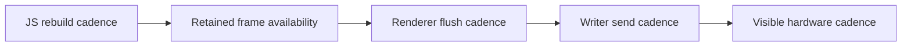

# Loupedeck: 12-Tile Cyb-Ito Performance Investigation

This note captures the current state of the cyb-ito-inspired JavaScript performance investigation in the `github.com/go-go-golems/loupedeck` repository. It is the durable knowledge note corresponding to the newer `LOUPE-007` ticket work: not just what the latest code does, but what we have learned from trying several different rendering strategies and measuring them on real Loupedeck Live hardware.

The core problem is easy to describe and hard to solve well: we want a `4×3` grid of animated `90×90` tiles, based on the imported `cyb-ito.html` reference, to feel coherent and responsive on the actual device. The hard part is that the system is not just one renderer. It is a layered pipeline of JavaScript scene logic, goja/native-call boundaries, retained grayscale surfaces, Go-side flush logic, package-owned writer pacing, and a fragile serial-WebSocket hardware protocol.

> [!summary]
> The most important conclusions so far are:
> 1. **Tile mode** (`12` separate `90×90` commands) is strongly penalized by the current writer’s **per-command pacing**.
> 2. **Full-page mode** (`1` `360×270` command) avoids that command explosion, but exposed a different problem: **frame availability** and scene rebuild cadence.
> 3. A real bug in the first full-page approach was **mid-frame snapshotting** of a shared retained surface. That is now fixed with `surface.batch(() => ...)` and stable-read batching semantics in Go.
> 4. The first combined render/writer/JS instrumentation run showed that JavaScript scene rebuilds are expensive but **not by themselves enough** to explain the multi-second visible updates.
> 5. The best next experiments are about **cadence control, selective redraw, and possibly stronger full-page snapshot/swap semantics**, not random micro-optimizations.

## Why this note exists

The repository already had multiple Loupedeck articles:

- the backpressure-safe Go frontend
- the goja runtime/API deep dive
- SVG button rendering
- renderer scheduling and FPS optimization

What was missing was one article that explains the newer performance investigation as a coherent technical story:

- why tile mode looked like the right first choice,
- why full-page mode looked like the right second choice,
- what each one revealed,
- why batching had to exist before performance measurements were trustworthy,
- and what the evidence now says about where the real bottlenecks are.

Without a note like this, a future reader would have to reconstruct the performance model from ticket docs, changelog entries, and terminal logs.

## Reference materials

Primary ticket and report:

- `LOUPE-007`
- `/home/manuel/code/wesen/2026-04-11--loupedeck-test/ttmp/2026/04/12/LOUPE-007--layered-animation-pacing-measurement-and-tuning-for-loupedeck-js-scenes/`
- `/home/manuel/code/wesen/2026-04-11--loupedeck-test/ttmp/2026/04/12/LOUPE-007--layered-animation-pacing-measurement-and-tuning-for-loupedeck-js-scenes/design/02-project-technical-report-performing-the-12-tile-javascript-canvas-cyb-ito-port.md`

Most relevant code paths:

- `/home/manuel/code/wesen/2026-04-11--loupedeck-test/examples/js/08-cyb-ito-tile-port-first3.js`
- `/home/manuel/code/wesen/2026-04-11--loupedeck-test/examples/js/09-cyb-ito-tile-port-all12.js`
- `/home/manuel/code/wesen/2026-04-11--loupedeck-test/examples/js/10-cyb-ito-full-page-all12.js`
- `/home/manuel/code/wesen/2026-04-11--loupedeck-test/runtime/gfx/surface.go`
- `/home/manuel/code/wesen/2026-04-11--loupedeck-test/runtime/render/visual_runtime.go`
- `/home/manuel/code/wesen/2026-04-11--loupedeck-test/cmd/loupe-js-live/main.go`
- `/home/manuel/code/wesen/2026-04-11--loupedeck-test/writer.go`
- `/home/manuel/code/wesen/2026-04-11--loupedeck-test/runtime/metrics/metrics.go`
- `/home/manuel/code/wesen/2026-04-11--loupedeck-test/pkg/jsmetrics/jsmetrics.go`

Key evidence log:

- `/tmp/loupe-cyb-ito-full10-stats-1776020694.log`

## The source artifact and the actual hardware target

The source scene is not a simple sprite sheet. It is a procedural browser canvas reference:

- one grayscale scene
- a `4×3` tile grid
- additional strip content
- scene-wide effects and continuous animation

The hardware target is the Loupedeck Live:

- main display: `360×270`
- left strip: `60×270`
- right strip: `60×270`
- tile geometry: `90×90`

Important adaptation constraints from the project:

- tile art should be judged in **monochrome** while fidelity work is ongoing
- the visible top of each tile is effectively about **3px down** because of the bezel
- side strips should be treated as **60px wide**
- JavaScript should **not** own raw transport or raw framebuffer access
- Go must continue to own rendering and transport policy

## Core mental model

The most important mental model for this project is that “the JS scene” is not the same thing as “what the hardware sees.” There are several stages in between.

```mermaid
flowchart TD
    A[JavaScript scene code] --> B[goja owner-thread runtime]
    B --> C[retained gfx surfaces]
    C --> D[retained UI dirty tracking]
    D --> E[Go retained renderer]
    E --> F[package-owned writer]
    F --> G[Loupedeck Live]

    style B fill:#214d2f,stroke:#5fbf7a
    style C fill:#1a3a5c,stroke:#4aa3ff
    style E fill:#5c3a1a,stroke:#ffad4a
    style F fill:#5c1a3a,stroke:#ff5ca3
```



This means one visible slowdown can come from very different causes:

- scene rebuilds that are too frequent
- scene rebuilds that are too expensive
- renderer snapshots that happen at the wrong time
- too many outbound commands
- or writer pacing that is safe but overly conservative for a given workload

## Four clocks, not one

A big part of the investigation was learning not to collapse everything into one fuzzy idea of “FPS.”



These are not interchangeable.

- **JS rebuild cadence** asks how often the scene tries to repaint retained state.
- **Retained frame availability** asks how often a coherent frame is available to snapshot.
- **Renderer flush cadence** asks how often Go actually flushes something meaningful.
- **Writer send cadence** asks how often commands can be emitted under current pacing rules.
- **Visible hardware cadence** asks how often the human actually sees a useful new frame.

The investigation became much clearer once these clocks were treated separately.

## Approach 1: establish the raw transport/display baseline first

Before blaming the JS scene, the project measured the raw hardware path with a dedicated benchmark.

Relevant command:

- `cmd/loupe-fps-bench/main.go`

Headline earlier measurements:

- full main display `360×270`: about **36 FPS stable**
- single `90×90` tile: about **314 FPS practical ceiling**
- 12-tile aggregate: about **288 FPS stable aggregate**

This mattered because it immediately showed that the hardware path is not inherently stuck at “a couple of frames per second.” The raw device path is significantly faster than the first live scene results suggested.

## Approach 2: per-tile retained subimage blits

The first serious tile-fidelity path was based on true `90×90` tile surfaces.

Relevant files:

- `runtime/ui/tile.go`
- `runtime/render/visual_runtime.go`
- `examples/js/08-cyb-ito-tile-port-first3.js`
- `examples/js/09-cyb-ito-tile-port-all12.js`

This branch added:

- tile-owned retained `gfx.Surface`
- JS `tile.surface(surface)`
- renderer support for flushing tile surfaces as individual `90×90` hardware draws

### Why it looked promising

This approach maps naturally to the source artifact:

- each tile is a retained subimage
- each tile can be tuned independently
- it is easy to debug fidelity issues tile-by-tile
- it is a good long-term fit for selective redraw

### What it revealed

Under the current writer defaults:

- `send-interval = 35ms`
- therefore max commands/sec is only about `28.6`

If a visible 12-tile frame becomes `12` separate tile commands, then the best-case full-grid rate is only about:

- `28.6 / 12 ≈ 2.4 full-grid frames/sec`

That explains why the all-12 tile scene felt so slow even though earlier raw tile benchmarks were excellent. The writer is paced **per command**, not per pixel budget. Tile mode therefore loses badly when the whole grid animates at once.

### Key lesson

Small draw regions are not automatically better. Under the current policy, **command count** dominates.

## Approach 3: one full-page `360×270` redraw instead of twelve tile redraws

To test the opposite strategy, the project added a full-page scene:

- `examples/js/10-cyb-ito-full-page-all12.js`

The goal was simple:

- one visible frame
- one retained main surface
- one draw command

### Why it looked promising

Full-page mode avoids the `12 commands per visible frame` explosion.

Under the same `35ms` send interval, it should in principle be able to send far more whole-scene frames than tile mode can send whole-grid tile sets.

### First failure mode

The first full-page version looked strange in a very specific way:

- earlier tiles looked more stable
- later tiles only appeared correctly on some frames
- the corruption had a directional feel

That was the clue that the problem was not generic slowness.

## Approach 4: fix frame atomicity with retained surface batching

The first full-page problem turned out to be a real correctness bug.

The shared `main` surface was being rebuilt in JavaScript while the Go renderer was still allowed to snapshot it. So the device could receive partially painted full-page frames.

Relevant files:

- `runtime/gfx/surface.go`
- `runtime/gfx/text.go`
- `runtime/js/module_gfx/module.go`
- `examples/js/10-cyb-ito-full-page-all12.js`

### Fix

The graphics layer gained:

- `Surface.Batch(func())`
- coalesced change notifications
- stable read behavior during in-flight batches
- JS `surface.batch(() => { ... })`

The full-page scene now does:

```javascript
main.batch(() => {
  main.clear(0);
  // rebuild all 12 tiles
});
```

### Result

This solved the “later tiles only appear on some frames” issue.

After that fix, the user reported:

- all tiles are there
- but the updates are still **extremely slow**

That was actually a good outcome for the investigation, because it separated:

1. **frame correctness**
2. **performance**

## Approach 5: instrument from both Go and JavaScript

Once the full-page scene was coherent, the next step was to stop guessing.

Relevant files:

- `runtime/metrics/metrics.go`
- `pkg/jsmetrics/jsmetrics.go`
- `cmd/loupe-js-live/main.go`
- `examples/js/10-cyb-ito-full-page-all12.js`

The live runner gained:

- `--log-render-stats`
- `--log-writer-stats`
- `--log-js-stats`
- `--stats-interval`

The JS runtime gained:

- `loupedeck/metrics`
- `loupedeck/scene-metrics`

The full-page scene then recorded:

- loop ticks
- renderAll calls
- rebuild reasons
- activation reasons
- per-tile timing
- overall `renderAll()` timing

## The first evidence run and what it actually showed

Evidence log:

- `/tmp/loupe-cyb-ito-full10-stats-1776020694.log`

Important observations:

### JS-side numbers

Approximate values from the first measured run:

- `scene.loopTicks = 72..77` per one-second window
- `scene.renderAll.calls = 72..78` per one-second window
- `scene.renderAll avg ≈ 18..22 ms`
- hottest tile:
  - `scene.tile.SPIRAL avg ≈ 5..6 ms`

### Go-side render numbers

- only one non-empty full-page flush in a stats window
- flush duration around `1.1–1.5 s`

### Writer numbers

- one command sent in the same window
- queue depth remained `0`

### Interpretation

This is the most important current result.

It means:

- JavaScript scene construction is real work, but it is **not obviously enough** to explain multi-second visible update spacing on its own.
- The writer queue is **not** simply backing up under load.
- The full-page mode is therefore not behaving like a simple queue-pressure problem.

The strongest current hypothesis is:

- the scene is rebuilding the shared full-page retained surface almost continuously,
- each rebuild is not terribly cheap,
- but the bigger problem is that the renderer only occasionally gets a stable frame worth flushing,
- so visible updates collapse even though the queue itself does not look saturated.

## Rebuilds versus rendered full pages

One very useful distinction from the newer instrumentation is the difference between a **rebuild** and a **rendered full page**.

### Rebuild

A rebuild means:

- JavaScript ran `renderAll()`
- the retained main surface was repainted
- the retained surface became dirty

### Rendered full page

A rendered full page means:

- Go snapshotted that retained surface
- converted it to RGBA
- called `Display.Draw(...)`
- writer sent the `360×270` command to hardware

These are separate clocks.

The evidence so far suggests there are many more rebuilds than meaningful visible full-page flushes.

That matters because a scene can be “busy” in JavaScript without the hardware actually benefiting from most of that work.

## Current hypotheses

### Hypothesis 1: tile mode is command-count bound

**Status:** strongly supported

Reason:

- writer pacing is per command
- a 12-tile full-grid frame is 12 commands
- therefore tile mode loses under current conservative settings

### Hypothesis 2: full-page mode solved command explosion but exposed frame-availability starvation

**Status:** strongly supported

Reason:

- batching fixed the incoherent-frame bug
- full-page mode still feels extremely slow
- queue depth stays zero
- rebuilds keep happening frequently

### Hypothesis 3: the scene rebuild cadence is too aggressive for the current full-page path

**Status:** plausible and currently the leading explanation

Reason:

- rebuilds are frequent
- renderer flushes are rare
- queue is calm
- visible cadence is still terrible

### Hypothesis 4: repeated JS→Go raster calls are still too expensive in aggregate

**Status:** supported, but probably not the whole story

Reason:

- tiles like `SPIRAL` are significantly more expensive than others
- many drawing patterns rely on a large number of small native calls

### Hypothesis 5: batching was necessary, but stronger snapshot/swap semantics may still be needed

**Status:** plausible

Reason:

- batching ensures coherent frame construction
- it does not necessarily ensure good frame availability under constant rebuild pressure

## The reusable metrics extraction matters too

One useful side result of this investigation is that the JS metrics implementation was extracted into a more reusable layer:

- `runtime/metrics/metrics.go`
- `pkg/jsmetrics/jsmetrics.go`

This matters because the underlying instrumentation is no longer conceptually tied only to the Loupedeck environment. It now looks more like something that could later move into `go-go-goja` and be reused across unrelated goja runtimes.

That is an important architectural win independent of the cyb-ito scene itself.

## Recommended next experiments

The current best next steps are not random micro-optimizations. They are targeted experiments.

### 1. Reduce full-page scene rebuild cadence explicitly

Instead of rebuilding on every loop tick, rebuild at a controlled cadence.

Example idea:

```javascript
let lastFrameMs = 0;
const targetFrameMs = 100;

anim.loop(1400, t => {
  phase.set(t);
  const now = metrics.now();
  if (now - lastFrameMs >= targetFrameMs) {
    lastFrameMs = now;
    renderAll("loop");
  }
});
```

### 2. Stagger or decimate background tile updates

Possible strategy:

- active tile updates every tick
- background tiles update every N ticks
- status/UI chrome updates only on meaningful changes

### 3. Consider coarser Go-native helpers for hot raster patterns

The obvious candidates are the most procedural tile renderers:

- spiral
- hole/radial patterns
- crack/branch recursion
- dense noise/crosshatch patterns

### 4. Consider stronger full-page snapshot/swap semantics

If cadence reduction still leaves frame starvation, a future step may be:

- back buffer
- front buffer
- swap once complete

rather than rebuilding the same visible retained surface continuously.

### 5. Revisit writer pacing only after the scene-side experiments above

Tile mode and full-page mode fail differently.

That means lowering `send-interval` blindly is not a good first move unless the next evidence actually points back toward writer-limited behavior.

## Working rules that seem durable

- Do not assume raw transport benchmarks tell the whole story of a retained JS scene.
- Do not assume a visually slow scene is primarily a JS problem.
- Do not assume a calm writer queue means the system is healthy; it may be stalling earlier.
- Fix frame correctness before trusting performance measurements.
- Treat rebuild cadence and visible flush cadence as different clocks.
- Preserve Go ownership of rendering and transport policy.
- Prefer instrumentation before major optimization guesses.

## Pseudocode summary of the current problem shape

```text
animation loop ticks often
-> JS rebuilds retained full-page scene often
-> retained surface becomes dirty often
-> renderer can only occasionally snapshot + flush a stable frame
-> writer sends infrequent full-page commands
-> human sees extremely slow updates
```

That is the current best system-level model.

## Related notes

- [[ARTICLE - Loupedeck - Goja JavaScript Runtime and API Deep Dive]]
- [[PROJ - Loupedeck Live Hello World - Serial Go Driver]]
- `docs/help/topics/02-reusable-goja-js-metrics-subpackage.md`
- `LOUPE-006`
- `LOUPE-007`
