# Loupedeck: Font and Text Rendering Pipeline and Kanji Support

This note explains how text rendering currently works in the `github.com/go-go-golems/loupedeck` repository from JavaScript and Go all the way down to the Loupedeck framebuffer, and then proposes the cleanest way to add kanji rendering support for the Junji Ito / `cyb-ito` graphics work.

The most important thing to understand is that there are **two different text paths** in the repo today. One is the older root-package text path used by package-owned button/display helpers and it already uses an OpenType font. The other is the newer JS-facing `runtime/gfx` path used by the goja scene runtime, and it currently uses Go's tiny built-in bitmap font. The kanji problem lives almost entirely in that second path.

> [!summary]
> 1. The current JS scene/runtime text path does **not** use a full Unicode/OpenType font. It hardcodes `basicfont.Face7x13` in `runtime/js/module_gfx/module.go`.
> 2. The `runtime/gfx` text renderer already has the right *shape* for real font rendering: it rasterizes into an `image.Alpha` and then copies brightness into a custom grayscale surface.
> 3. The older root package already demonstrates OpenType loading with `golang.org/x/image/font/opentype`, but that path is not yet wired into the JS `gfx` API.
> 4. The cleanest long-term solution is to add `gfx.font(...)` / font-handle support so JS can use a real CJK font such as Noto Sans CJK.
> 5. The fastest scene-specific solution for the Junji Ito graphics is to pre-render the small fixed set of needed kanji as sprites or cached glyph surfaces.

## Why this note exists

The `cyb-ito.html` reference uses browser canvas text drawing, so kanji like `眼`, `渦`, and `歯` work there naturally as long as the browser has a suitable font. In the Loupedeck runtime, the same labels currently degrade because the JS-facing text renderer does not yet use a CJK-capable font.

There was therefore a need for one durable note that explains:

- how text works today in the repo,
- which code path is actually relevant for JS scenes,
- what libraries are already in use,
- how text gets turned into the device pixel map,
- and what the best implementation path is for kanji support in the Junji Ito work.

## Relevant files

Primary files discussed in this note:

- `/home/manuel/code/wesen/2026-04-11--loupedeck-test/runtime/gfx/text.go`
- `/home/manuel/code/wesen/2026-04-11--loupedeck-test/runtime/gfx/surface.go`
- `/home/manuel/code/wesen/2026-04-11--loupedeck-test/runtime/js/module_gfx/module.go`
- `/home/manuel/code/wesen/2026-04-11--loupedeck-test/runtime/render/visual_runtime.go`
- `/home/manuel/code/wesen/2026-04-11--loupedeck-test/display.go`
- `/home/manuel/code/wesen/2026-04-11--loupedeck-test/loupedeck.go`
- `/home/manuel/code/wesen/2026-04-11--loupedeck-test/ttmp/2026/04/11/LOUPE-006--full-animated-javascript-uis-for-loupedeck-from-cyb-ito-html-reference/sources/local/cyb-ito.html`

## The two text pipelines in the repo

## 1. The newer JS/goja scene path

This is the path used by the retained JavaScript runtime and all `gfx.surface(...).text(...)` calls.

### Entry point

JavaScript calls into:

- `require("loupedeck/gfx")`
- `surface.text(text, options)`

That API is implemented in:

- `runtime/js/module_gfx/module.go`

### Important current limitation

`runtime/js/module_gfx/module.go` currently hardcodes:

- `Face: basicfont.Face7x13`

inside `textOptionsFromValue(...)`.

That means JS text currently uses:

- Go's built-in tiny bitmap font
- no configurable font handle
- no CJK glyph support

This is the main reason kanji do not currently render properly in the JS scene path.

## 2. The older root-package text path

The older root package has its own text support for generating button/display images and it already uses an OpenType font path.

Relevant file:

- `loupedeck.go`

Important details:

- `SetDefaultFont()` parses `goregular.TTF`
- it uses `golang.org/x/image/font/opentype`
- it creates a sized `font.Face` with `opentype.NewFace(...)`
- `TextInBox(...)` uses `font.Drawer.DrawString(...)`

So the repo already contains a working example of **OpenType font loading and rasterization in Go**. It is just not the same path currently used by JS `gfx.surface.text(...)`.

## Core mental model

Text is never sent to the Loupedeck as text. It is always turned into pixels first.

```mermaid
flowchart TD
    A[JS or Go text API] --> B[font.Face selected]
    B --> C[font.Drawer rasterizes glyphs]
    C --> D[bitmap or alpha mask]
    D --> E[gfx.Surface grayscale pixel map]
    E --> F[RGBA image]
    F --> G[RGB565 conversion]
    G --> H[Loupedeck framebuffer upload]

    style B fill:#214d2f,stroke:#5fbf7a
    style D fill:#1a3a5c,stroke:#4aa3ff
    style E fill:#5c3a1a,stroke:#ffad4a
    style H fill:#5c1a3a,stroke:#ff5ca3
```



This matters because “adding kanji support” does **not** mean sending vector font data or Unicode text to the device. It means:

- load a font in Go,
- rasterize glyphs in Go,
- copy resulting pixels into the repo's own grayscale surface,
- then send the resulting bitmap to the Loupedeck.

## How the JS text path currently works

## Step 1: JS calls `surface.text(...)`

Typical call shape:

```javascript
surface.text("HELLO", {
  x: 0,
  y: 0,
  width: 80,
  height: 14,
  brightness: 255,
  center: true,
});
```

That goes through:

- `runtime/js/module_gfx/module.go`

### What `module_gfx` does

The JS module:

- converts JS options into `gfx.TextOptions`
- hardcodes `Face: basicfont.Face7x13`
- calls `surface.Text(text, opts)`

So the API already separates:

- text content
- placement
- width/height
- brightness
- centering
- font face

but the last part is not yet exposed to JS in a meaningful way.

## Step 2: `runtime/gfx/text.go` rasterizes text into an alpha bitmap

Inside `runtime/gfx/text.go`, `Surface.Text(...)` does this:

1. picks the face (`opts.Face` or default `basicfont.Face7x13`)
2. allocates an `image.Alpha`
3. creates a `font.Drawer`
4. draws the string into the alpha image with `DrawString(...)`

In pseudocode:

```go
alpha := image.NewAlpha(image.Rect(0, 0, w, h))
d := &font.Drawer{
    Dst:  alpha,
    Src:  image.White,
    Face: face,
}
d.DrawString(text)
```

That is the actual text rasterization step.

### Important observation

This code does **not care** whether the face came from:

- `basicfont.Face7x13`, or
- a real OpenType face created from Noto Sans CJK

As long as it gets a valid `font.Face`, the rasterization model is already correct.

This is why the kanji problem is mostly a **font selection / font loading / JS API exposure** problem, not a “rewrite the text renderer from scratch” problem.

## Step 3: Rasterized alpha gets copied into the custom grayscale surface

After rasterizing into `image.Alpha`, `runtime/gfx/text.go` loops through the alpha pixels and adds brightness into the custom `gfx.Surface` pixel map.

Conceptually:

```go
for each pixel in alpha {
    a := alpha.AlphaAt(x, y).A
    if a == 0 {
        continue
    }
    v := scale(alpha, brightness)
    surface.addLocked(px, py, v)
}
```

This means the internal `gfx.Surface` is:

- not a font object
- not an RGBA image
- not a vector surface
- just a grayscale/intensity pixel buffer (`[]uint8`)

That grayscale pixel map is the main in-memory scene representation used by the current JS runtime.

## Step 4: `gfx.Surface` becomes RGBA for rendering

Later, in `runtime/gfx/surface.go`, `Surface.ToRGBA(fg, bg)` maps grayscale intensity to actual colors.

This is where grayscale values turn into visible RGB output.

Example mental model:

- `0` = background color
- `255` = foreground color
- values in between = blended shades

## Step 5: the renderer composites those images

In `runtime/render/visual_runtime.go`, surfaces are composited into display-sized `image.RGBA` images.

For example:

- main display surface
- optional named layers
- themed foreground/background colors

This is where scene layers, tinting, and final display composition happen.

## Step 6: final image is converted to device RGB565

In `display.go`, the final image pixels are converted to:

- RGB565

The code loops over every pixel in the image and uses:

- `pixelcolor.ToRGB565(im.At(x, y))`

The resulting bytes are packaged into the Loupedeck protocol's framebuffer message.

## Step 7: framebuffer upload + draw trigger

Still in `display.go`, the image data is sent through:

- `WriteFramebuff`
- then `Draw`

So the actual device never receives text, glyphs, font names, or vector paths. It only receives the final bitmap pixels.

## The older OpenType path in `loupedeck.go`

The root package already demonstrates real OpenType usage.

## `SetDefaultFont()`

This function does:

```go
f, err := opentype.Parse(goregular.TTF)
face, err := opentype.NewFace(f, &opentype.FaceOptions{ Size: 12, DPI: 150 })
```

So:

- a TTF font is parsed
- a sized face is created
- that face is stored for later drawing

## `TextInBox(...)`

This function then:

- creates an RGBA image
- repeatedly measures the string at different sizes
- creates a centered layout
- uses `font.Drawer.DrawString(...)`

This path is important because it proves the repo already knows how to:

- parse a real font file
- create a real `font.Face`
- rasterize text with Go's text stack

The missing link is bringing that capability into the JS/gfx scene system.

## Why `cyb-ito.html` can render kanji easily

In `cyb-ito.html`, text is rendered with browser canvas:

- offscreen canvas `_tc`
- `CanvasRenderingContext2D`
- `_tctx.font = size + 'px ' + font`
- `_tctx.fillText(...)`

The browser provides:

- font lookup
- Unicode text layout
- glyph rasterization
- likely fallback fonts for CJK characters

That is why `cyb-ito.html` can draw:

- `眼`
- `渦`
- `歯`
- and the scrolling horror kanji string

with almost no explicit font-pipeline code in the scene logic itself.

Our Go/JS runtime does not currently have browser-like font fallback. It must be told explicitly which font face to use.

## Why kanji currently fail in the JS path

The problem is **not** that the Loupedeck cannot show kanji pixels.

The problem is:

- the JS scene text path uses `basicfont.Face7x13`
- that font does not contain kanji glyphs
- therefore the rasterizer cannot draw those glyphs correctly

So the failure is entirely on the host-side text pipeline before the framebuffer is even built.

## What library would do the OTF rasterization?

The main Go library to use is:

- `golang.org/x/image/font/opentype`

The actual rasterization call remains:

- `font.Drawer.DrawString(...)`

using a `font.Face` created by:

- `opentype.NewFace(...)`

So the rasterizer stack is effectively:

```go
fontBytes -> opentype.Parse(...) -> opentype.NewFace(...) -> font.Drawer.DrawString(...)
```

That yields bitmap pixels, which are then copied into our surface.

## Project report section: adding kanji support for the Junji Ito graphics

## Requirement shape

For the Junji Ito / `cyb-ito` work, the immediate need is not arbitrary Japanese paragraph layout. The visible needs are much narrower:

- tile title kanji like `眼`, `渦`, `歯`, `溶`, `穴`, `狂`, `蟲`, `砂`, `歪`, `裂`, `脈`, `闇`
- possibly side-strip or HUD kanji strings later
- consistent monochrome or tinted rendering that fits the retained-surface pipeline

That means there are really two viable implementation strategies.

## Strategy A: add generic CJK font support to `gfx`

This is the clean, reusable approach.

### Proposed shape

Add a JS-visible font API, for example:

```javascript
const gfx = require("loupedeck/gfx");
const kanji = gfx.font("./assets/NotoSansCJKjp-Regular.otf", {
  size: 14,
  dpi: 72,
});

surface.text("渦", {
  x: 4,
  y: 4,
  width: 24,
  height: 18,
  brightness: 220,
  center: true,
  font: kanji,
});
```

### Go work needed

Likely files:

- `runtime/gfx/font.go` — font loading/cache abstraction
- `runtime/js/module_gfx/module.go` — expose `gfx.font(...)` and allow `surface.text(..., { font })`
- `runtime/gfx/text.go` — mostly unchanged, but now uses the supplied face

### Good properties

- reusable beyond `cyb-ito`
- supports arbitrary kanji strings
- future-proofs the JS runtime
- matches the browser mental model most closely

### Risks / costs

- font handle lifetime and caching need design
- font files must be stored and referenced cleanly
- potentially more API surface than needed for the immediate scene

## Strategy B: pre-render the small fixed kanji set as sprites or cached surfaces

This is the fast scene-specific approach.

### Shape

- choose a CJK font offline or in a small Go helper
- rasterize the needed glyphs once
- store them as:
  - cached `gfx.Surface`s,
  - a bitmap atlas,
  - or tiny embedded PNG assets
- composite them like normal scene sprites

### Good properties

- quickest path to visual correctness for `cyb-ito`
- no general font API needed first
- easy to tune per glyph for horror styling
- cheap at runtime once cached

### Risks / costs

- not general-purpose text support
- awkward if later scenes need arbitrary kanji strings
- asset pipeline becomes more custom

## Recommended implementation sequence

For this project, the best sequence is probably:

### Phase 1: scene-specific win
Implement **cached kanji glyph surfaces** for the small fixed `cyb-ito` kanji set.

Why first:

- small scope
- directly useful for `LOUPE-006`
- gets visible results quickly
- minimal API risk

### Phase 2: real runtime capability
After that, add **generic `gfx.font(...)` CJK support** to the JS runtime.

Why second:

- turns the scene-specific experiment into a reusable engine feature
- avoids overdesigning the generic API before confirming the visual requirements on hardware

## A clean canonical Go-side implementation shape

```go
// Load or cache an OTF/TTF once.
fontData, _ := os.ReadFile("NotoSansCJKjp-Regular.otf")
parsed, _ := opentype.Parse(fontData)
face, _ := opentype.NewFace(parsed, &opentype.FaceOptions{
    Size: 14,
    DPI:  72,
})

// Rasterize text into alpha.
alpha := image.NewAlpha(image.Rect(0, 0, w, h))
d := &font.Drawer{
    Dst:  alpha,
    Src:  image.White,
    Face: face,
}
d.Dot = fixed.P(x, baseline)
d.DrawString("渦")

// Copy alpha into gfx.Surface grayscale pixels.
for each alpha pixel {
    surface.Add(px, py, scaledBrightness)
}
```

That is the core implementation. Everything else is API shape and caching strategy.

## Working rules for the kanji feature

- Do not try to send text or vector paths to the device directly; always rasterize on the host.
- Keep the Loupedeck transport/presentation model unchanged. Kanji support belongs in the text/glyph pipeline, not the transport layer.
- Prefer caching. For scene glyphs rendered every frame, avoid repeated font parsing and repeated rasterization if the glyph/size do not change.
- For `cyb-ito`, start narrow: fixed glyph set before fully generic font UX.
- Keep grayscale composition as the default unless a color/tint layer is explicitly useful.

## Recommended next implementation ticket

If this becomes active work, the next ticket should probably be scoped as one of:

### Narrow ticket
**Add cached kanji glyph surfaces for `cyb-ito` titles in the JS scene runtime**

or

### Broader ticket
**Add generic OpenType/CJK font loading and `gfx.font(...)` support to the Loupedeck JS runtime**

My recommendation is to do the narrow one first if the immediate goal is Junji Ito scene fidelity, then generalize afterward.


## Related notes

- [[ARTICLE - Loupedeck - Goja JavaScript Runtime and API Deep Dive]]
- [[ARTICLE - Loupedeck - Render Scheduler, Region Coalescing, and Display Blit Path]]
- [[ARTICLE - Loupedeck - 12-Tile Cyb-Ito Performance Investigation]]
