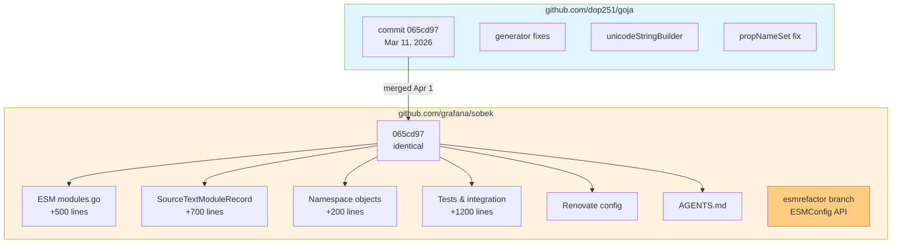
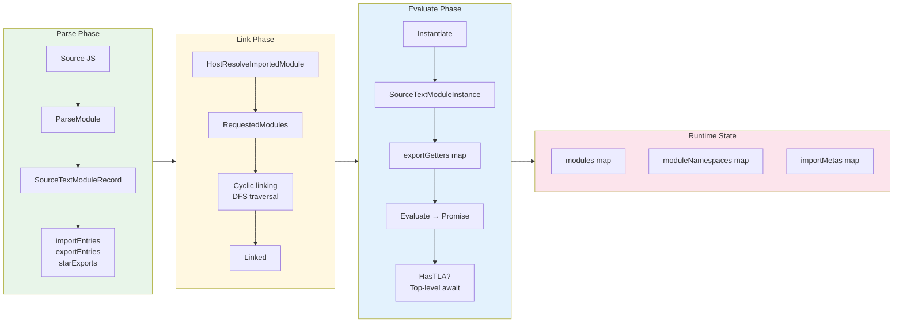
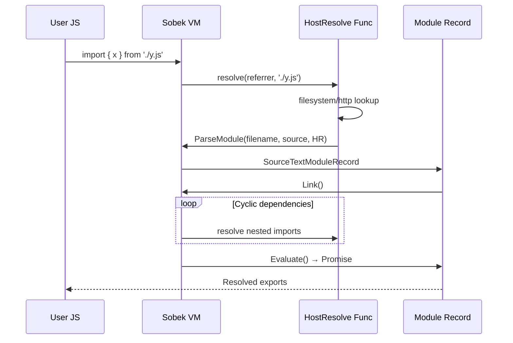

# Goja vs Sobek Deep Analysis

This project is a comprehensive technical comparison of two Go-based JavaScript engines: [goja](https://github.com/dop251/goja) by Dmitry Panov and [sobek](https://github.com/grafana/sobek), a Grafana-maintained fork. The analysis covers their architectural differences, tracking relationship, and the single most important differentiator: **ECMAScript Modules (ESM) support**.

> [!summary]
> Three key findings from this analysis:
> 1. **Sobek tracks Goja very closely** - they're currently 100% synced with zero lag on the core engine
> 2. **ESM is the only major difference** - Sobek adds ~3,600 lines for ES Module support (import/export, dynamic imports, top-level await)
> 3. **Sobek is k6-driven** - the fork exists to power Grafana's k6 load testing tool with modern JavaScript module capabilities

## Why this project exists

The JavaScript ecosystem has shifted decisively toward ES Modules (`import`/`export`) over CommonJS (`require`/`module.exports`). Most modern npm packages, build tools, and browser-native code now use ESM. Yet many embedded JavaScript engines in Go still lack first-class ESM support.

This analysis was needed to understand:
- Whether Sobek is a viable alternative to Goja for modern JavaScript workloads
- How much ESM actually adds to the codebase and complexity
- Whether the fork is maintained or diverging
- What migration looks like for existing Goja users

The research is immediately relevant to anyone building:
- JavaScript plugin systems in Go
- Custom JS runtimes with modern module support
- Tools that need to execute modern npm packages
- Projects considering k6 integration

## Current project status

The repository contains a **complete analysis** with three deliverable documents and full source code comparison.

What was accomplished:

- **Cloned both repositories** at latest `main` branches
- **Mapped the fork relationship** - confirmed perfect sync (commit `065cd97` is identical in both)
- **Quantified the difference** - 78,113 lines (Goja) vs 81,725 lines (Sobek) = +4.6% for ESM
- **Identified all new files** - 5 module-related files (~3,600 lines)
- **Analyzed merge cadence** - Sobek merges from Goja every 1-4 weeks via true merge commits
- **Documented ESM capabilities** - static imports, dynamic imports, top-level await, import.meta
- **Compared APIs** - full API surface analysis with migration guidance
- **Generated three reports** for different use cases

What remains:

- No runtime benchmarks (only static analysis)
- No testing of the esmrefactor branch's new ESMConfig API in production
- No comparison with other Go JS engines (otto, v8go, etc.)

## Project shape

The analysis has three layers:

1. **Repository archaeology**
   - Git history analysis
   - Commit mapping between forks
   - File-level diff comparison
   
2. **Feature analysis**
   - ESM system architecture
   - API surface comparison
   - Dependency and infrastructure differences
   
3. **Deliverable documentation**
   - Deep technical analysis (architects/maintainers)
   - Structure comparison (visual learners)
   - Quick reference (developers making choices)

## Architecture

### Fork Relationship



### ESM Architecture (Sobek only)



### Key Data Flow: Import Resolution



## Implementation details

### The Module System Files

Sobek adds exactly 5 new files for ESM support (not in Goja):

| File | Lines | Purpose |
|------|-------|---------|
| `modules.go` | ~500 | Core interfaces: `ModuleRecord`, `CyclicModuleRecord`, linking algorithm |
| `modules_sourcetext.go` | ~700 | `SourceTextModuleRecord` - parsing and AST → module transform |
| `modules_namespace.go` | ~200 | Module namespace objects (`import * as x`) |
| `modules_test.go` | ~600 | Unit tests for exports, imports, circular deps |
| `modules_integration_test.go` | ~600 | Real-world scenarios with custom resolvers |

### Compiler Changes for ESM

The compiler gains indirect binding support (critical for module imports):

```go
// New flag in compiler.go
maskIndirect = 1 << 28  // For imported bindings that resolve dynamically

// Modified binding struct
type binding struct {
    scope        *scope
    name         unistring.String
    getIndirect  func(vm *vm) Value  // NEW: indirect getter for imports
    accessPoints map[*scope]*[]int
    // ... other fields
}

// New VM instructions
type loadIndirect struct { getter func(*vm) Value }
type initIndirect struct { idx uint32; getter func(*vm) Value }
type export struct { idx uint32; callback func(*vm, func() Value) }
type exportLex struct { idx uint32; callback func(*vm, func() Value) }
```

Why this matters: when you write `import { foo } from './bar.js'`, the compiler can't know at compile time where `foo` will resolve (the module might not be parsed yet). So it emits an `loadIndirect` instruction that calls a closure at runtime to get the value.

### Runtime Changes

The `Runtime` struct grows module-specific fields:

```go
type Runtime struct {
    // ... all original Goja fields ...
    
    // NEW: Module system state
    modules          map[ModuleRecord]ModuleInstance
    moduleNamespaces map[ModuleRecord]*namespaceObject
    importMetas      map[ModuleRecord]*Object
    
    // NEW: ESM hooks (user-provided callbacks)
    hostResolveImportedModule HostResolveImportedModuleFunc
    importModuleDynamically   ImportModuleDynamicallyCallback
    getImportMetaProperties   func(ModuleRecord) []MetaProperty
    finalizeImportMeta        func(*Object, ModuleRecord)
    
    // NEW: Evaluation state for async modules
    evaluationState           *evaluationState
    jobQueue                  []func()
    promiseRejectionTracker   PromiseRejectionTracker
}
```

### Tracking Verification

Confirmed perfect sync at commit `065cd97`:

```bash
# Goja HEAD
$ git log -1 --oneline
065cd97 Ensure the environment is properly restored before entering 'finally'

# Sobek latest shared commit  
$ git log -1 --oneline 065cd97
065cd97 Ensure the environment is properly restored before entering 'finally'

# Zero lag - identical commit hash
```

Merge history shows regular cadence:
- Apr 1, 2026: Merged `065cd97` (21 days after Goja)
- Mar 6, 2026: Merged generator fixes (~6 days after)
- Feb 19, 2026: Merged test262 bump (~1 day after)
- Feb 17, 2026: Merged unicodeStringBuilder fixes (~7 days after)
- Nov 3, 2025: Same-day merge for propNameSet fix

### API Surface Comparison

**Goja public API** (~40 exported functions/types):
```go
New() *Runtime
RunString(string) (Value, error)
RunProgram(*Program) (Value, error)
Compile(string, string, bool) (*Program, error)
ToValue(interface{}) Value
Export(Value) interface{}
AssertFunction(Value) (Callable, bool)
SetFieldNameMapper(FieldNameMapper)
Interrupt(string)
NewPromise() *Promise
// ... plus Value/Object/Runtime methods
```

**Sobek public API** (Goja + 15 new ESM exports):
```go
// Module parsing and evaluation
ParseModule(filename, source string, hostResolve HostResolveImportedModuleFunc) (*SourceTextModuleRecord, error)
(*SourceTextModuleRecord) Link() error
(*SourceTextModuleRecord) Evaluate(*Runtime) *Promise
(*SourceTextModuleRecord) RequestedModules() []string

// Namespace and meta
(*Runtime) NamespaceObjectFor(ModuleRecord) *Object
(*Runtime) FinishLoadingImportModule(...)
(*Runtime) SetImportModuleDynamically(ImportModuleDynamicallyCallback)
(*Runtime) SetGetImportMetaProperties(func(ModuleRecord) []MetaProperty)
(*Runtime) SetFinalizeImportMeta(func(*Object, ModuleRecord))

// ESMConfig API (esmrefactor branch)
NewESMConfig() *ESMConfig
(*ESMConfig) WithHostResolveImportedModule(HostResolveImportedModuleFunc)
(*ESMConfig) WithImportModuleDynamically(ImportModuleDynamicallyCallback)
(*ESMConfig) AttachESM(*Runtime)
(*ESMConfig) EvaluateModule(ModuleRecord) *ModulePromise
```

## Important project docs

Three analysis documents generated in the repo:

| Document | Purpose | Audience |
|----------|---------|----------|
| `Goja_vs_Sobek_Deep_Analysis.md` | 376 lines, comprehensive technical comparison | Architects making technology choices |
| `STRUCTURE_COMPARISON.md` | 271 lines, visual architecture diagrams | Developers understanding system structure |
| `QUICK_REFERENCE.md` | 274 lines, decision matrix and migration guide | Engineers choosing between the two |

Key repo locations:
- `/home/manuel/code/wesen/2026-04-12--goja-vs-sobek/goja/` - upstream clone
- `/home/manuel/code/wesen/2026-04-12--goja-vs-sobek/sobek/` - fork clone
- `sobek/modules*.go` - all 5 ESM implementation files
- `sobek/cmd/sobek/` - CLI tool with ESM examples (esmrefactor branch)

## Open questions

- Should this analysis be updated when the esmrefactor branch merges to sobek main?
- Would runtime benchmarks (memory, execution speed) show meaningful differences?
- How does this compare to other Go JS engines (otto, v8go, quickjs bindings)?
- Is there value in testing real-world npm packages for compatibility?
- Should the new ESMConfig API be evaluated separately from the old API?

## Near-term next steps

- Monitor sobek's esmrefactor branch for merge to main
- Consider benchmarking if choosing between the two for a production system
- Evaluate whether ESM support is actually needed (many use cases work fine with scripts)
- Check k6's adoption of new ESM features for real-world validation

## Project working rule

> [!important]
> Prefer the upstream (Goja) unless you specifically need ES Modules. The tracking is so close that you're not missing bugfixes or features by using Goja. Only choose Sobek if:
> 1. You need `import`/`export` syntax support
> 2. You're integrating with k6
> 3. You want Renovate-managed dependencies
>
> The ~4.6% code size increase is modest, but the conceptual overhead of ESM (event loops, module resolution, async evaluation) is significant if you don't actually need it.
