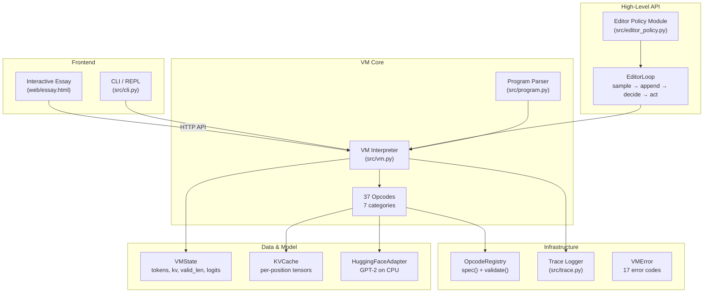

# KV-Cache VM — Token-Editing Decoding VM for CPU-Side LLM Inference

A register-based decoding virtual machine that runs GPT-2 on CPU and supports exact token-level editing by rewinding the KV cache to the earliest changed token and replaying the suffix. The project includes 37 self-describing opcodes across 7 categories, a FastAPI HTTP backend, an interactive computational essay with 10 live widgets, and 112 passing tests including 35 randomized fuzz tests verified against a full-recomputation oracle.

> [!summary]
> The project has three important identities:
> 1. a **correctness-first research prototype** — every edit path is verified against a full-recomputation oracle with logit diff tolerance 1e-3
> 2. a **self-describing VM architecture** — 37 opcodes carry their own metadata (description, operands, side effects, examples) with reflection-based spec generation
> 3. an **interactive educational tool** — a web-based computational essay where every widget runs real GPT-2 inference

## Why this project exists

Autoregressive language models generate tokens left-to-right, maintaining a KV cache that stores key/value pairs for all previously processed positions. This cache makes append cheap — each new token only needs one forward pass. But editing a token in the middle invalidates everything after it, because the cached values were computed while attending to the old token.

This project answers a specific question: **what does a minimal but correct VM for token-level editing look like?** The answer is a register-based architecture with composite edit opcodes that follow a fixed edit → rewind → replay pattern, backed by per-position tensor storage that makes cache truncation O(1).

The secondary goal is educational: the interactive essay lets readers run real experiments — generate text, edit tokens, watch the cache grow, verify correctness against an oracle — without installing anything beyond a browser.

## Current project status

**Complete.** All 14 phases finished, 112 tests passing, 28 commits.

What exists:
- full VM interpreter with 37 opcodes across 7 categories
- structured error handling with 17 error codes and suggested fixes
- instruction trace logger (JSONL) with formatted summary output
- checkpoint system with disk serialization (torch.save/load)
- spec generator with validation and drift detection
- editor policy module with 5 built-in policies
- FastAPI HTTP backend with 15 API endpoints
- single-page interactive essay (HTML+CSS+JS, no build step)
- comprehensive test suite (reference correctness, fuzz, checkpoint, serialization, trace, spec, editor policy)

## Architecture



### Key design decisions

| Decision | Rationale |
|----------|-----------|
| **Register-based VM (Option C)** | Named registers + domain-specific accelerator instructions — more readable than stack-based, more flexible than high-level-only |
| **Per-position tensor storage** | O(1) truncate/append at the cost of O(n) read — acceptable because model forward pass dominates |
| **Composite edit opcodes** | DELETE/INSERT/REPLACE = edit + rewind + replay in one instruction — always correct by construction |
| **DynamicCache compatibility** | Modern transformers v4.48+ returns DynamicCache, not tuples — adapter constructs real DynamicCache for model calls |
| **Truncate-before-clone for checkpoints** | Memory proportional to checkpoint position, not total sequence length |
| **Self-describing opcodes with OpcodeMeta** | Reflection-based spec generation, validation, and drift detection — the spec is never stale |
| **Structured VMError** | 17 error codes with PC tracking and suggested fixes — errors tell you what to do |
| **Editor policy as separate module** | VM executes instructions; policy decides *which* instructions — clean separation of concerns |

### State model

The VM maintains a single `VMState` with a strict invariant:

```
tokens:    list[int]       ← source of truth
kv:        KVCache         ← valid for tokens[:valid_len]
valid_len: int             ← 0 ≤ valid_len ≤ len(tokens)
logits:    Tensor | None   ← next-token distribution for tokens[:valid_len]
```

**Core invariant:** `kv` and `logits` are always consistent with `tokens[:valid_len]`.

### KVCache design

Per-position tensor storage: each layer stores a list of `(1, n_heads, 1, head_dim)` tensors.

```python
class KVCache:
    keys:   dict[int, list[Tensor]]   # layer → [pos_0, pos_1, ...]
    values: dict[int, list[Tensor]]   # layer → [pos_0, pos_1, ...]
    
    def append_row(self, layer_data):     # O(1) — append to each list
    def truncate(self, pos):              # O(1) — slice each list
    def clone(self):                      # deep copy for checkpoints
    def to_model_format(self) -> DynamicCache:  # O(n) cat for model
    def save(self, path):                 # torch.save for disk persistence
    def load(cls, path):                  # torch.load round-trip
```

The O(1) truncate is the key property — it means REWIND is instant regardless of sequence length. The O(n) read happens when constructing a DynamicCache for the model, but this is dominated by the forward pass itself.

## Instruction set

37 opcodes across 7 categories:

| Category | Count | Key opcodes |
|----------|-------|-------------|
| **Register** | 12 | SET, ADD, SUB, MUL, INC, DEC, CMP_LT, CMP_EQ, LOAD_SCORE, LOAD_LOGIT, LOAD_SEQ_LEN, LOAD_VALID_LEN |
| **Control** | 6 | LOOP, END_LOOP, BREAK_IF, CONTINUE_IF, HALT, NOP |
| **Decoding** | 6 | LOAD_PROMPT, LOAD_TOKENS, PREFILL, SAMPLE, APPEND, CONTINUE |
| **Cache** | 3 | REWIND, REPLAY, TRIM_TOKENS |
| **Edit** | 4 | DELETE, INSERT, REPLACE, DROP_SUFFIX |
| **Checkpoint** | 2 | CHECKPOINT (with persist=), RESTORE (with from_disk=) |
| **Inspect** | 4 | SHOW_STATE, SHOW_TOKENS, SHOW_REGISTER, DECODE |

### Composite edit semantics

All four edit opcodes follow the same edit → rewind → replay pattern:

```
DELETE(pos):       del tokens[pos];        REWIND(pos); REPLAY()
INSERT(pos, tok):  tokens.insert(pos, tok); REWIND(pos); REPLAY()
REPLACE(pos, tok): tokens[pos] = tok;       REWIND(pos); REPLAY()
DROP_SUFFIX(pos):  tokens = tokens[:pos];   REWIND(pos); REPLAY()
```

This makes correctness automatic — the composite pattern is always correct by construction, because REPLAY recomputes every cache entry from the rewind point.

### Self-describing opcodes

Every opcode carries its own metadata via `OpcodeMeta`:

```python
class OpcodeMeta:
    name: str
    category: str
    description: str
    long_description: str
    operands: list[Operand]
    side_effects: list[str]
    invariant_after: str
    examples: list[str]
```

The registry provides `spec()` for full spec generation and `validate()` for checking metadata completeness. A `--diff` flag detects spec drift against a saved baseline.

## Editor policy module

The editor policy lifts the low-level opcode API into a high-level generate-then-edit loop:

```python
class EditorLoop:
    def run(self, prompt, max_tokens) -> GenerationResult:
        prefill(prompt)
        for step in range(max_tokens):
            token = sample()
            append(token)
            action = policy.decide(state, step)
            apply(action)
        return result
```

Five built-in policies:

| Policy | Behavior |
|--------|----------|
| `KeepAllPolicy` | Never edit, stop on EOS |
| `StopAfterPolicy` | Stop after N tokens |
| `CallbackPolicy` | Wrap any `fn(state, step) → EditAction` |
| `RegexReplacePolicy` | Replace token patterns at decode time |
| `WindowedEditPolicy` | Only allow edits within the last W tokens |

The `CallbackPolicy` is the primary extension point — users can define arbitrary editing strategies as plain Python functions without subclassing.

## Testing

### Test suite (112 tests across 9 files)

| Category | Count | What it tests |
|----------|-------|---------------|
| Reference correctness | 12 | Every edit path matches full recomputation |
| Checkpoint | 5 | Save/restore/replay correctness |
| Fuzz | 35 | Random sequences + random edits vs baseline |
| Parser | 9 | Program text → Instruction list |
| VM errors | 13 | Error codes, suggested fixes, PC tracking |
| Trace | 6 | JSONL recording, state snapshots, query |
| Spec | 9 | Metadata validation, drift detection, determinism |
| Serialization | 6 | KVCache save/load, cross-session restore |
| Editor policy | 17 | All policies, loop integration, correctness |

### Correctness oracle

Every optimized path is validated against full recomputation:

```python
def full_recompute(tokens):
    kv = model.empty_cache()
    for tok in tokens:
        kv_row, logits = model.decode_one(tok, kv)
        kv.append(kv_row)
    return kv, logits
```

Logit diff tolerance: 1e-3 (float32 accumulation noise).

## Benchmarks (GPT-2 on CPU)

| Operation | Time | Notes |
|-----------|------|-------|
| Prefill 128 tokens | 161 ms | One forward pass |
| Append (single decode) | 25–35 ms | Scales linearly with seq_len |
| Delete at tail (pos=127) | 184 ms | Replay 1 token |
| Delete at mid (pos=64) | 924 ms | Replay 64 tokens |
| Delete at start (pos=8) | 1,700 ms | Replay 120 tokens |

**Key insight:** Edit cost is linear in the number of replayed tokens. CPU inference is the bottleneck (~30ms per decode step), not cache operations.

## Interactive essay

The web frontend (`web/essay.html`) is a single-page app with 8 chapters and 10 interactive widgets:

1. **Cache Growth Visualizer** — watch tokens and cache entries appear one by one
2. **Edit Invalidation** — click a token to see which cache entries become invalid
3. **Rewind-Replay Live** — apply an edit and watch the rewind+replay timeline
4. **Edit Cost Chart** — benchmark bar chart showing edit cost by position
5. **Interactive Token Editor** — click-to-select tokens, delete/replace/insert
6. **Program Runner** — edit and run VM programs with step-by-step trace table
7. **Checkpoint Speedup** — compare edit with and without checkpoints
8. **Policy Playground** — run generation with different editing policies
9. **Correctness Verifier** — compare VM logits against the full-recomputation oracle
10. **Fuzz Test Runner** — run randomized edits and verify each against the oracle

The backend (`web/server.py`) is a FastAPI server with 15 API endpoints, session management, and model pre-loading.

## Project file reference

```
src/
├── cli.py              # CLI / REPL with --generate, --run, --trace
├── editor_policy.py    # EditorLoop + 5 policies + EditAction
├── errors.py           # VMError + VMErrorCode (17 codes)
├── kv_cache.py         # KVCache with save/load
├── model_adapter.py    # ModelAdapter ABC + HuggingFaceAdapter
├── program.py          # Text → list[Instruction] parser
├── spec.py             # Spec generator with --validate and --diff
├── trace.py            # TraceEntry, TraceWriter, TraceReader
├── vm.py               # VM interpreter
├── vm_state.py         # VMState + Instruction
└── opcodes/
    ├── base.py         # OpcodeMeta, Operand, Opcode ABC
    ├── registry.py     # OpcodeRegistry with spec() and validate()
    ├── register_ops.py # 12 register manipulation opcodes
    ├── control_ops.py  # LOOP, END_LOOP, BREAK_IF, etc.
    ├── decoding_ops.py # LOAD_PROMPT, PREFILL, SAMPLE, APPEND, etc.
    ├── cache_ops.py    # REWIND, REPLAY, TRIM_TOKENS
    ├── edit_ops.py     # DELETE, INSERT, REPLACE, DROP_SUFFIX
    ├── checkpoint_ops.py # CHECKPOINT, RESTORE (with disk support)
    └── inspect_ops.py  # SHOW_STATE, SHOW_TOKENS, etc.
web/
├── server.py           # FastAPI HTTP API (15 endpoints)
└── essay.html          # Single-page interactive essay
tests/                  # 112 tests across 9 files
```

## Open questions

- Should the per-position tensor storage be replaced with contiguous tensors + offset tracking for better cache locality?
- Would batched decode (processing multiple decode_one calls together) provide meaningful CPU throughput improvement?
- How would the architecture scale to beam search — state clone is already O(n) in cache size?
- Can the editor policy module support RL-style editing policies trained on downstream task quality?

## Near-term next steps

- Mobile-responsive layout for the interactive essay
- Opcode Explorer widget (searchable, expandable spec browser)
- Edit Chain widget (chain multiple edits with verification between each)
- Larger model testing (GPT-2 medium, small Llama)
- Beam search as a state-forking extension

## Project working rule

> [!important]
> Correctness above speed. Every optimization must be validated against the full-recomputation oracle with logit diff < 1e-3. The token list is the source of truth; the cache is derived state.
