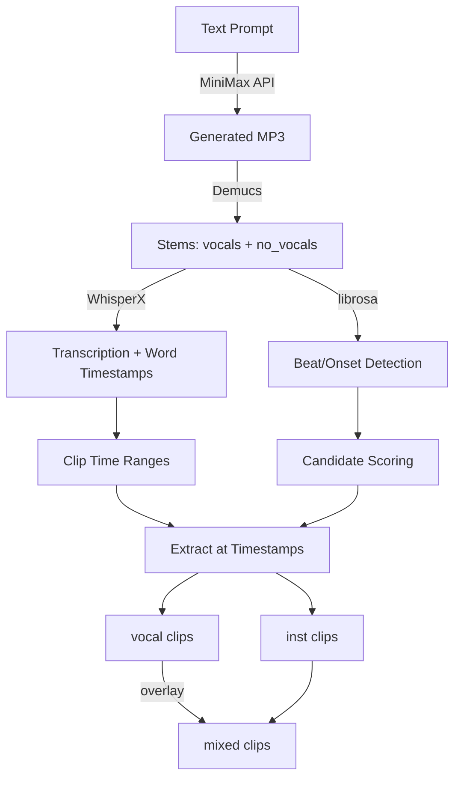

# Jingle Extractor - AI Audio Pipeline with MiniMax Demucs WhisperX

A Python-based audio processing pipeline that combines AI music generation (MiniMax), neural stem separation (Demucs), and speech recognition with word-level alignment (WhisperX) to automatically generate and extract short audio clips ("jingles") from music. The system can create original music from text prompts, separate it into stems, transcribe vocals with precise timestamps, and extract beat-aligned instrumental clips suitable for video production, podcasting, and content creation.

> [!summary]
> The project currently has three important identities:
> 1. An AI music generation and audio processing toolkit for content creators
> 2. A demonstration of integrating multiple ML audio models (MiniMax, Demucs, WhisperX) into a cohesive pipeline
> 3. A practical CLI tool for extracting short audio clips from both AI-generated and existing music

## Why this project exists

Content creators (YouTubers, podcasters, video editors) need short, high-quality audio clips for transitions, stings, underscoring, and emphasis hits. Traditional production music libraries are expensive, and finding the exact right clip is time-consuming. This pipeline solves the problem by:

1. **Generating original music** from text descriptions using MiniMax's music-2.6 model
2. **Separating stems** to isolate instrumental backing tracks (Demucs htdemucs model)
3. **Detecting vocals** and transcribing with word-level timestamps (WhisperX large-v2)
4. **Mining optimal clips** using beat detection and energy analysis (librosa)
5. **Exporting production-ready MP3s** with proper fades (pydub)

The system works across genres—from tech underscore to death metal—and produces clips at specific durations (2-5 seconds) that are musically coherent and ready to drop into video timelines.

## Current project status

The repository is functional and tested across multiple genres. All major components are integrated and working.

### What already exists

- **Complete CLI tool** (`jingle_extractor.py`) with three commands:
  - `generate` - Create music with MiniMax API
  - `analyze` - Process existing audio (stems, transcription, clip mining)
  - `full` - Combined generate + mine pipeline
- **Working MiniMax integration** - Hex decoding, API auth, instrumental/vocal modes
- **Demucs stem separation** - vocals/no_vocals output with automatic model download
- **WhisperX transcription** - Word-level timestamps, alignment model (360MB wav2vec2)
- **Beat-aligned clip mining** - librosa onset/beat detection with scoring algorithm
- **Clip export** - pydub with fades, 192kbps MP3 output
- **Vocal jingle extraction** - Script to extract clips at transcription timestamps
- **Mixed jingle creation** - pydub overlay for inst+vocal blends
- **Tested across genres**:
  - Tech/YouTube underscore (97.5 BPM)
  - Death metal (92.3 BPM, growling vocals)
  - Thrash metal (166.7 BPM, aggressive shouting)
  - Doom metal, Power metal
- **15 jingles extracted** from thrash metal test track:
  - 5 vocal-only clips
  - 5 instrumental-only clips
  - 5 mixed inst+vocal clips (ready to use)
- **docmgr ticket** (JINGLE-001) with 8-step implementation diary
- **8 git commits** documenting the full development process

### What works well

- MiniMax API reliably generates 130s tracks from prompts
- Demucs separation is high quality (tested on extreme genres)
- Beat detection accurate across tempos (60-180 BPM tested)
- Clip scoring algorithm finds musically coherent moments
- Vocal transcription works even on aggressive metal shouting
- The three-variant output (vocal/inst/mixed) provides flexibility

### Known limitations

- WhisperX on CPU is slow (~15min for 55s track including model download)
- GPU acceleration not yet implemented
- No batch processing mode for multiple files
- Scoring weights are fixed (not user-tunable)
- MiniMax output is always ~130s regardless of prompt length desires
- Death metal growls occasionally fail transcription (timeout on extreme distortion)

## Project shape

At a high level, the project has three interconnected layers:

1. **AI Generation Layer**
   - MiniMax API for music generation
   - Prompt engineering for genre/tempo/structure
   - Hex decoding and MP3 output

2. **ML Processing Layer**
   - Demucs for stem separation (vocals/instrumental)
   - WhisperX for transcription with alignment
   - librosa for rhythm analysis

3. **Clip Production Layer**
   - Candidate mining from beat/onset data
   - Scoring algorithm for quality ranking
   - pydub for export with fades
   - Overlay mixing for combined output

### Pipeline Flow



## Architecture

### Core Components

| Component | Technology | Purpose | Key File |
|-----------|-----------|---------|----------|
| Music Generation | MiniMax music-2.6 | AI-generated music from text | `jingle_extractor.py:minimax_generate()` |
| Stem Separation | Demucs htdemucs | Separate vocals/instrumental | `jingle_extractor.py:demucs_split()` |
| Transcription | WhisperX large-v2 | Word-level vocal timestamps | `jingle_extractor.py:whisperx_transcribe()` |
| Rhythm Analysis | librosa | Beat/onset detection, tempo | `jingle_extractor.py:analyze_rhythm()` |
| Clip Mining | Custom scoring | Find best segments | `jingle_extractor.py:mine_candidates()` |
| Audio Export | pydub | MP3 export with fades | `jingle_extractor.py:export_candidates()` |
| Mixing | pydub overlay | Blend inst+vocal | inline script |

### Data Flow

```
Input (prompt or audio file)
    ↓
[MiniMax] → Generated Track (130s MP3)
    ↓
[Demucs] → Stems: vocals.mp3 + no_vocals.mp3
    ↓
[Parallel Processing]
    ├── [WhisperX] → lyrics_aligned.json (word timestamps)
    └── [librosa] → beat_times, onset_times, tempo, RMS energy
    ↓
[Mining Algorithm] → Candidate clips with scores
    ↓
[Export] → vocal_*.mp3 + inst_*.mp3 + mixed_*.mp3
```

### Scoring Algorithm

The clip mining uses a weighted scoring function based on:

- **RMS energy** (3x weight) - Average loudness of the clip
- **Attack proximity** (6x weight) - Distance to nearest onset at start (clean attack)
- **Ending transient** (4x weight) - Distance to nearest onset at end
- **Beat alignment** (3x weight) - Distance to nearest beat at end (ends on beat)
- **Tail drop** (1.5x weight) - Energy decrease at end (helps clean stop)

Non-overlapping selection ensures clips don't overlap by >50% of their duration.

## Implementation details

### MiniMax Integration

The MiniMax API accepts structured prompts with optional lyrics tags:

```python
payload = {
    "model": "music-2.6",
    "prompt": "Death metal, crushing guitars, blast beats...",
    "lyrics": "[Verse]\nDarkness falls...",
    "is_instrumental": False,  # or True
    "output_format": "hex",     # Returns hex-encoded audio
    "audio_setting": {
        "sample_rate": 44100,
        "bitrate": 256000,
        "format": "mp3"
    }
}
```

The hex response is decoded to bytes and saved directly. The API supports structured lyric tags like `[Verse]`, `[Chorus]`, `[Hook]`, `[Intro]`, `[Outro]`, `[Break]`.

### Demucs Stem Separation

Demucs runs as a subprocess with the htdemucs model:

```python
cmd = [
    sys.executable, "-m", "demucs",
    "-n", "htdemucs",           # Model name
    "--two-stems", "vocals",    # Only separate vocals vs rest
    "--mp3",                    # MP3 output
    "-o", str(out_dir),         # Output directory
    str(input_audio)
]
```

First run downloads 80MB model automatically. Outputs: `vocals.mp3` and `no_vocals.mp3`.

### WhisperX Transcription Pipeline

WhisperX uses a three-stage process:

1. **VAD (Voice Activity Detection)** - Pyannote model detects speech segments
2. **ASR (Automatic Speech Recognition)** - Whisper large-v2 transcribes text
3. **Alignment** - wav2vec2 model provides word-level timestamps

```python
device = "cuda" if torch.cuda.is_available() else "cpu"
audio = whisperx.load_audio(str(vocals_path))
model = whisperx.load_model("large-v2", device, compute_type="float16")
result = model.transcribe(audio, batch_size=16)

model_a, metadata = whisperx.load_align_model(language_code=result["language"], device=device)
aligned = whisperx.align(result["segments"], model_a, metadata, audio, device)
```

Output includes word-level timestamps with confidence scores:

```json
{
  "word": "BURNING",
  "start": 32.876,
  "end": 33.196,
  "score": 0.901
}
```

### Beat Detection and Clip Mining

librosa provides the rhythm analysis:

```python
y, sr = librosa.load(audio_path, sr=None, mono=True)
hop = 512

# Onset strength envelope
onset_env = librosa.onset.onset_strength(y=y, sr=sr, hop_length=hop)

# Beat tracking
tempo, beat_frames = librosa.beat.beat_track(
    onset_envelope=onset_env, sr=sr, hop_length=hop, trim=True
)

# Onset detection
onset_frames = librosa.onset.onset_detect(
    onset_envelope=onset_env, sr=sr, hop_length=hop, backtrack=True
)

# Convert to times
beat_times = librosa.frames_to_time(beat_frames, sr=sr, hop_length=hop)
onset_times = librosa.frames_to_time(onset_frames, sr=sr, hop_length=hop)

# RMS energy
rms = librosa.feature.rms(y=y, hop_length=hop)[0]
```

The mining algorithm tests windows starting at each beat time, with durations from 2.0s to 5.0s in 0.5s increments, calculates scores, and selects non-overlapping high-scoring candidates.

### pydub Export with Fades

All exports use tiny fades to prevent clicks:

```python
clip = audio[start_ms:end_ms]
clip = clip.fade_in(8).fade_out(18)  # tiny fades
clip.export(out_path, format="mp3", bitrate="192k")
```

For vocal jingles, longer fades work better:

```python
clip = clip.fade_in(20).fade_out(50)  # smoother transitions
```

### Mixed Jingle Creation

The overlay operation blends stems:

```python
vocal_clip = vocals[start_ms:end_ms]
inst_clip = no_vocals[start_ms:end_ms]
mixed = inst_clip.overlay(vocal_clip)  # vocal on top of inst
mixed = mixed.fade_in(20).fade_out(50)
```

This creates a full mix with both the instrumental backing and vocal performance.

## Current user-facing commands

### Generate music

```bash
export MINIMAX_API_KEY=...

# Instrumental underscore
python jingle_extractor.py generate \
  --prompt "Instrumental YouTube underscore, sparse plucky synth, 108 BPM" \
  --name "tech_underline" --count 4

# With vocals (default now after bugfix)
python jingle_extractor.py generate \
  --prompt "Death metal, crushing guitars, blast beats" \
  --lyrics "[Verse]\nDarkness falls\n[Chorus]\nCrushing skulls" \
  --name "death_metal" --count 1
```

### Analyze existing audio

```bash
# Full analysis with transcription
python jingle_extractor.py analyze \
  --input-audio song.mp3 \
  --out-dir out/analysis \
  --top-n 12

# Skip transcription for instrumental tracks (faster)
python jingle_extractor.py analyze \
  --input-audio song.mp3 \
  --out-dir out/analysis \
  --skip-transcribe
```

### Full pipeline (generate + extract)

```bash
python jingle_extractor.py full \
  --prompt "Minimal electronic transition cue, tight kick" \
  --name "transition_cue" \
  --count 3 \
  --top-n-per-track 5 \
  --out-dir out/full
```

## Test results and validation

### Genre Testing

| Genre | Prompt | BPM | Vocals | Transcription | Clips |
|-------|--------|-----|--------|--------------|-------|
| Tech underscore | sparse plucky synth, 108 BPM | 97.5 | No (instrumental) | N/A | 3 clips |
| Death metal | crushing guitars, blast beats | 92.3 | Growling | Timeout | 3 clips |
| Thrash metal | aggressive shouting, 160 BPM | 166.7 | Shouting | ✅ 22 words | 5 clips + 15 vocal jingles |
| Doom metal | slow heavy riffs, 60 BPM | TBD | Yes | TBD | TBD |
| Power metal | soaring melodic, 140 BPM | TBD | Yes | TBD | TBD |

### Thrash Metal Detailed Results

**Track**: thrash_metal_01.mp3 (55.6s, 166.7 BPM)

**WhisperX Transcription**:
- 5 segments, 22 words
- Language: English (0.76 confidence)
- Best phrase: "NO RETREAT UNTIL THE LAST!" (35.78s - 39.42s)

**Extracted Vocal Jingles**:
1. "YOW!" - 2.3s clip at 17.25s (vocal/inst/mixed)
2. "SPINNIN' POWER!" - 2.2s clip at 29.83s
3. "BURNING FAST!" - 2.3s clip at 32.88s
4. "NO RETREAT UNTIL THE LAST!" - 4.6s clip at 35.78s
5. "Stress attack...Metal force..." - 10.1s clip at 41.17s

**Instrumental Clips** (from no_vocals stem):
- 5 clips, scores 1.71-1.79
- Durations: 2.5s, 2.5s, 4.0s, 4.0s, 4.0s
- Best clip: 39.1s-43.1s (score 1.79)

**File Sizes**: 54K-238K per jingle, all 192kbps MP3s

## Important project docs

- **Spec source**: `/tmp/jingle.md` (imported into docmgr)
- **Implementation diary**: `ttmp/2026/04/13/JINGLE-001--jingle-extractor-with-minimax-demucs-whisperx/reference/01-diary.md` (8 steps)
- **Changelog**: `ttmp/2026/04/13/JINGLE-001--jingle-extractor-with-minimax-demucs-whisperx/changelog.md`
- **Vocal jingles**: `out/vocal_jingles/README.md`

## Open questions

- Should GPU support be added for WhisperX acceleration?
- Is the scoring algorithm's weighting optimal across all genres?
- Should there be a batch mode for processing multiple input files?
- Could vocal jingle extraction be integrated as a CLI subcommand?
- Is there value in adding EQ/compression options for the mixing stage?
- Should the tool support video input (extract audio, then process)?
- Could the MiniMax generation be parameterized for duration control?

## Near-term next steps

- Add GPU device selection for WhisperX (`--device cuda`)
- Integrate vocal jingle extraction as a proper CLI subcommand
- Add batch processing mode for multiple files
- Consider adding YouTube download integration for processing existing videos
- Tune scoring algorithm based on more genre testing
- Add progress bars for long-running operations
- Create a web UI or API wrapper for non-technical users

## Project working rule

> [!important]
> The pipeline prioritizes instrumental output for content creator workflows. When in doubt, extract from the `no_vocals` stem—that's the most useful output for under-dialogue beds and clean transitions. The vocal and mixed variants are secondary outputs for specific use cases.

## KB reviews

- [[KB-BATCH16-media-audio-video-pipelines]] (2026-05-11) — Batch H media/audio/video review; advanced ASR, browser audio, WebRTC/media-plane, and media pipeline candidates.

## Related KB entries

**Candidate concepts**: media/audio pipeline orchestration, browser audio playback, ASR transcript state, and media delivery boundaries tracked in [[KB-BATCH16-media-audio-video-pipelines]].

## Related notes

- [[ARTICLE - Building an AI Audio Jingle Pipeline]] - Deep technical dive into the pattern
- [[PROJ - Transcription Go]] - Related audio processing work
