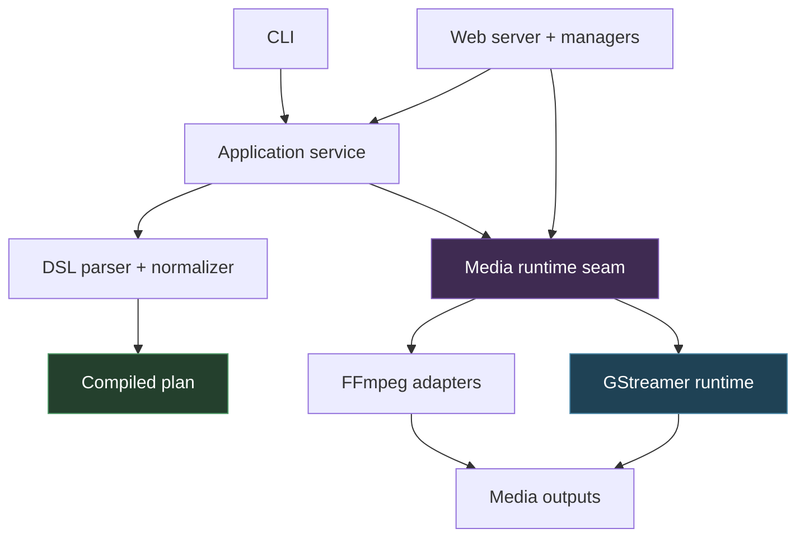

# Screencast Studio - GStreamer Migration and Media Runtime Intern Guide

This note is a deep technical project report for the `screencast-studio` repository, with a specific focus on the ongoing migration from FFmpeg-driven subprocess pipelines to native GStreamer pipelines managed from Go. It is written for an intern who is new to media pipelines, audio/video capture, and the shape of this codebase.

The shortest version is: Screencast Studio is a local recording system with a DSL, a compiler, a web control surface, and runtime managers for preview, recording, and telemetry. Historically it delegated real media work to FFmpeg subprocesses. The migration work replaces that with a native media runtime seam and GStreamer pipelines built inside the process, while keeping the higher-level application and web architecture largely intact.

> [!summary]
> 1. Screencast Studio is **not just a wrapper around FFmpeg**. It already has a strong internal model: DSL → normalized config → compiled plan → runtime managers → media execution engine.
> 2. The GStreamer migration is primarily about replacing the **execution engine**, not rewriting the entire app.
> 3. The key mental model for GStreamer is: **a pipeline is a graph of elements** connected by pads, negotiated by caps, and controlled through state transitions and bus messages.
> 4. The most important engineering questions are not only “can we capture pixels and audio?” but also “who owns shutdown?”, “how are preview and recording related?”, and “how do we finalize media files correctly?”
> 5. The migration is already materially underway: runtime seams exist, native GStreamer preview exists and is validated, native video recording exists and is validated, and native audio mixing exists and is validated.

## Why this project exists

A lot of recording workflows begin life as shell commands and desktop shortcuts. That is fine for one-off captures, but it gets painful when the user wants repeatability, previews, multiple sources, mixed audio, a local web UI, and a bounded shutdown story.

Screencast Studio exists to turn that class of workflow into a real local system. The project does not start from “what FFmpeg command should I run?” It starts from “what recording setup do I want?”, “how should the outputs be organized?”, and “what runtime experience should the user have while previewing and recording?”

That distinction is why the repository matters. Even before the GStreamer migration, it already had a real architecture instead of a pile of shell snippets.

## Relationship to the earlier project note

This note should be read as a follow-on to [[PROJ - Screencast Studio - Architecture and Runtime Deep Dive]]. The earlier note explains the original FFmpeg-centered system. This note focuses on:

- the media concepts an intern needs,
- why the GStreamer migration is happening,
- how the runtime seam works,
- what has already been implemented,
- what the next engineering phases are.

Think of the earlier note as the “how the old system works” document, and this one as the “how the migration works and how to think about media pipelines” document.

## Current project status

The project currently has **two overlapping media runtimes**:

1. the older **FFmpeg-backed runtime**, which is still the default in some higher-level paths,
2. the newer **GStreamer-backed runtime**, which now exists behind explicit interfaces and has been validated in multiple slices.

What is already implemented and validated:

- media runtime seam in `pkg/media/`
- FFmpeg adapters behind the new seam
- native GStreamer preview runtime
- native GStreamer window preview geometry fallback
- end-to-end web preview validation with GStreamer
- native GStreamer video recording runtime
- native GStreamer audio recording / mixing runtime
- dedicated smoke harnesses for preview, recording, and audio mixing
- ticketed investigation and diary work in `ttmp/2026/04/13/SCS-0012--gstreamer-migration-deep-analysis-experiments-and-intern-guide/`

What is still incomplete:

- recording stop/event semantics still need cleanup work for full parity
- max-duration handling and more formal recording event mapping still need to be finished
- screenshots, live audio effects, VU meter, shared capture graphs, and transcription are not complete yet
- FFmpeg has not been fully removed

So the migration is **real but incomplete**. The project is not “considering GStreamer”; it is actively becoming a mixed-runtime system on the way to a GStreamer-native one.

## Project shape

At a high level, Screencast Studio has six layers.

1. **CLI layer**
   - commands like `serve`, `record`, and setup-related workflows
2. **Application layer**
   - service boundary for normalize, compile, discovery, and recording operations
3. **DSL / planning layer**
   - user setup description → normalized config → compiled plan
4. **Web/runtime manager layer**
   - preview manager, recording manager, telemetry manager
5. **Media runtime seam**
   - `PreviewRuntime`, `RecordingRuntime`, `PreviewSession`, `RecordingSession`
6. **Concrete media engine**
   - FFmpeg adapters today
   - GStreamer runtime increasingly replacing them



## The most important mental model: plan first, runtime second

An intern’s first temptation is often to focus entirely on the media engine: FFmpeg command lines, GStreamer elements, codecs, muxers, and so on. Those are important, but they are **not** the first abstraction in this repository.

The first abstraction is the **compiled plan**.

A user setup file describes desired video sources, audio sources, defaults, and destination templates. The code normalizes that into an effective config, then builds a compiled plan containing concrete video jobs and audio jobs.

Only after that does the media runtime come into play.

That means the migration is intentionally structured like this:

```text
DSL
  -> EffectiveConfig
  -> CompiledPlan
  -> RecordingRuntime / PreviewRuntime
  -> concrete engine (FFmpeg or GStreamer)
```

This is why the migration can happen incrementally. The plan format does not need to be thrown away just because the media engine changes.

## Core media concepts an intern needs to understand

### 1. Source vs transform vs sink

In both FFmpeg and GStreamer, a media pipeline always has the same broad shape:

- **source**: where pixels or samples come from
- **transform**: how they are converted, resized, mixed, filtered, or encoded
- **sink**: where they go

Examples in this project:

- source:
  - X11 screen capture
  - window capture
  - webcam capture via V4L2
  - PulseAudio/PipeWire audio capture
- transform:
  - video color conversion
  - frame-rate conversion
  - scaling
  - JPEG/H.264 encoding
  - audio gain
  - audio mixing
- sink:
  - appsink callback into Go
  - file output
  - browser MJPEG stream (indirectly through Go)

### 2. Container vs codec

Interns often mix these up.

- A **codec** is how audio or video is compressed.
  - H.264 is a video codec.
  - Opus is an audio codec.
  - PCM S16LE is uncompressed audio format.
- A **container** is how encoded streams are packaged into a file.
  - MP4 is a container.
  - MOV is a container.
  - Ogg is a container.
  - WAV is a container around PCM-style audio.

A useful rule:

- “H.264 in MP4” means codec = H.264, container = MP4.
- “Opus in Ogg” means codec = Opus, container = Ogg.

### 3. Live pipeline vs bounded file pipeline

Preview and recording are not the same type of workload.

**Preview** is a live pipeline:
- low latency matters
- file finalization does not matter
- appsink callbacks matter a lot
- stopping should be quick

**Recording** is a file pipeline:
- correct file finalization matters a lot
- EOS behavior matters a lot
- a slow stop can still be acceptable if the file is finalized cleanly
- muxers and encoders must drain properly

This is why preview and recording should not be treated as identical just because they both handle video.

### 4. Why EOS matters

EOS means **End of Stream**.

If you are writing a muxed output file, you usually cannot just kill the process/pipeline and expect a valid file. The muxer may still need to write trailer data, finalize indexes, or flush delayed encoder output.

That is why the migration work repeatedly emphasizes:

- send EOS,
- wait for the bus to report EOS,
- only then set pipeline state to NULL / finish shutdown.

If you skip that, you often get empty, truncated, or corrupt media outputs.

## GStreamer concepts an intern must understand

### Elements

An element is one processing node in the graph.

Examples used here:

- `ximagesrc`
- `v4l2src`
- `pulsesrc`
- `videoconvert`
- `videoscale`
- `videorate`
- `jpegenc`
- `x264enc`
- `audiomixer`
- `volume`
- `wavenc`
- `opusenc`
- `mp4mux`
- `qtmux`
- `oggmux`
- `appsink`
- `filesink`

### Pads

Pads are the connection points on elements.

- source pads push data out
- sink pads receive data in

For most simple pipelines, you can just link elements linearly. But for things like `audiomixer`, you need **request pads** because the mixer creates input pads dynamically as you add sources.

That is why the native audio runtime uses request-pad APIs for `audiomixer`.

### Caps

Caps are capability descriptions: format, width, height, frame rate, sample rate, channels, and so on.

They are how pipeline segments agree on what shape the data should have.

Examples:

- `video/x-raw,width=640,framerate=5/1`
- `audio/x-raw,format=S16LE,rate=48000,channels=2`
- `image/jpeg`

The easiest way to explain caps is:

> Caps are type-and-shape constraints for media buffers.

### Bus messages

The GStreamer bus is how pipelines report things like:

- errors
- state changes
- EOS
- element-generated messages

For this project, the most important bus messages are:

- `MessageError`
- `MessageEOS`

The preview and recording runtimes both use bus watches so the Go side can react correctly.

### GLib main loop

Some GStreamer bus/watch behavior depends on a GLib main loop being active. This feels surprising if you come from ordinary Go server code.

A useful mental model is:

- Go owns the high-level application lifecycle
- GLib owns the internal event-loop machinery GStreamer expects for certain asynchronous behaviors

You do not replace the Go runtime with GLib. You run just enough GLib main-loop infrastructure for GStreamer bus handling where needed.

## The old FFmpeg model

Historically, the project used FFmpeg roughly like this:

- preview:
  - start FFmpeg subprocess
  - emit MJPEG to stdout
  - parse JPEG frames in Go
  - expose those frames through an HTTP MJPEG endpoint
- recording:
  - compile video/audio jobs
  - start one subprocess per job
  - supervise them through a Go state machine
  - stop gracefully using stdin and signal escalation

This model works, but it has drawbacks:

- preview and recording are separate capture graphs
- the preview path has to parse MJPEG byte streams manually
- runtime capabilities like live effects or shared capture graphs are awkward
- the lifecycle code is split between media-engine assumptions and higher-level orchestration logic

## Why GStreamer is attractive here

GStreamer is attractive because it gives the project a richer in-process media graph model.

What becomes easier or cleaner:

- appsink delivery into Go callbacks instead of MJPEG stdout parsing
- tee-based shared capture graphs
- live parameter changes on elements like `volume`
- screenshots by simply grabbing a frame or using a one-buffer pipeline
- better composition capabilities (for example greenscreen)
- native graph branching for preview, recording, monitoring, and transcription

This does not mean GStreamer is “simpler.” It means it gives the project a better native vocabulary for the kinds of runtime features it wants.

## The new runtime seam

The migration introduced a media runtime seam in `pkg/media/`.

The important interfaces are:

- `PreviewRuntime`
- `PreviewSession`
- `RecordingRuntime`
- `RecordingSession`

This is the architectural pivot that makes the migration safe.

The higher layers now ask for abstract behavior like:

- start preview
- wait for preview
- start recording
- wait for recording
- stop preview / recording

They do **not** have to know whether the underlying implementation is FFmpeg or GStreamer.

That is what allowed the migration to proceed in slices:

1. create seam
2. wrap FFmpeg behind seam
3. add GStreamer preview behind seam
4. add GStreamer recording behind seam
5. switch defaults later when confidence is high

## Current GStreamer implementation status

### Preview runtime

Implemented in:

- `/home/manuel/code/wesen/2026-04-09--screencast-studio/pkg/media/gst/preview.go`

What it supports:

- display preview
- region preview
- camera preview
- window preview via geometry fallback
- JPEG delivery through `appsink`
- bus watch handling
- context-driven shutdown
- screenshot-style access through latest-frame retrieval

Typical preview pipeline shape:

```text
[source]
  -> videoconvert
  -> optional videoflip
  -> videoscale
  -> capsfilter(width=640)
  -> videorate
  -> capsfilter(framerate=5/1)
  -> jpegenc
  -> appsink
```

### Video recording runtime

Implemented in:

- `/home/manuel/code/wesen/2026-04-09--screencast-studio/pkg/media/gst/recording.go`

What it supports today:

- display / region / camera / window-geometry video recording
- H.264 encoding through `x264enc`
- MP4 and MOV output
- EOS-driven finalization
- recording runtime event emission

Typical video recording pipeline shape:

```text
[source]
  -> videoconvert
  -> optional videoflip
  -> videorate
  -> capsfilter(framerate=N/1)
  -> x264enc
  -> mp4mux / qtmux
  -> filesink
```

### Audio recording and mixing runtime

Also implemented in `pkg/media/gst/recording.go`.

What it supports today:

- one or more Pulse/PipeWire-backed sources
- per-source gain using `volume`
- mixing using `audiomixer`
- WAV output
- Opus/Ogg output

Typical audio graph shape:

```text
for each source:
  pulsesrc
    -> capsfilter
    -> audioconvert
    -> audioresample
    -> volume
    -> audiomixer request pad

post-mix:
  audioconvert
    -> audioresample
    -> capsfilter
    -> wavenc/filesink OR opusenc/oggmux/filesink
```

## Why window preview needed special investigation

One of the more educational migration findings was window capture.

The naïve assumption was that a GStreamer `window` preview should use direct XID-based capture via `ximagesrc xid=...`.

That turned out to be unreliable in this environment. Some windows worked, others failed with X11 MIT-SHM / `BadMatch` errors. The investigation showed that **geometry capture** of the same window rectangle was more reliable.

That led to a practical design rule for preview:

> For `window` preview, resolve the window geometry first and capture that rectangle.

This is a great example of the kind of engineering lesson that is easy to lose if it is not written down:

- the theoretical API exists,
- the direct path is not always the operationally correct path,
- the robust solution is sometimes a simpler fallback.

## Preview and recording are still manager-owned

The migration does **not** mean media code now owns the whole app lifecycle.

The project still has a very important manager layer:

- `PreviewManager`
- `RecordingManager`
- `TelemetryManager`

This is good architecture.

The media runtime should own media-session behavior, but the manager layer should still own:

- server-facing state
- publish/subscribe events
- preview leasing
- suspend/restore behavior
- current-session summaries
- integration with the browser API

That separation makes the media engine replaceable without destroying the app structure.

## Preview suspend and restore

One of the current runtime behaviors is that previews are suspended during recording start and restored afterwards.

That behavior exists because the older FFmpeg-based system used separate capture graphs, and simultaneous preview + recording could conflict.

This is a temporary architectural compromise.

Long-term, Phase 4 of the migration aims to replace that with a **shared capture graph** using tee branches so preview and recording can observe the same source without stop/restart churn.

That is an important concept for an intern:

- current behavior: suspend/restore workaround
- target behavior: one capture graph, multiple branches

## Screenshots, live effects, and transcription

These are not complete yet, but the project report should explain why they fit the new architecture.

### Screenshots

There are two obvious approaches:

1. use the latest preview frame
2. build a one-buffer capture pipeline

The migration plan currently treats “latest preview frame” as the simplest initial screenshot model.

### Live audio effects

GStreamer makes runtime audio effects much more natural because many elements expose controllable properties.

Example:
- keep a reference to the `volume` element
- change `volume` while the pipeline is running

That is a much better fit than trying to reconfigure whole FFmpeg command lines during a live session.

### Live transcription

The current design direction is:

- branch audio using `tee`
- send one branch to recording
- send another branch to an `appsink`
- accumulate chunks in Go
- pass chunks to a transcription backend (Whisper CLI, API, or binding)

This is a good example of GStreamer’s graph model paying off: the media graph provides the audio stream, while transcription stays a separate concern.

## Migration phases

The current ticket plan is organized into phases.

### Phase 0 — runtime seam

Goal: create interfaces and adapters so FFmpeg and GStreamer can coexist.

Status: complete.

### Phase 1 — preview

Goal: implement native GStreamer preview, validate source handling, validate web path.

Status: complete.

### Phase 2 — recording

Goal: implement native GStreamer video and audio recording.

Status: partially complete.

Implemented already:
- video runtime
- audio mixing/runtime

Still remaining in this broad phase:
- stop semantics cleanup
- event/state parity cleanup
- max-duration handling
- deeper end-to-end recording validation

### Phase 3 — new capabilities

Goal: screenshots, live effects, VU meter, and similar runtime features.

Status: not complete.

### Phase 4 — shared capture and FFmpeg removal

Goal: remove the duplicate capture workaround and fully retire FFmpeg paths.

Status: not complete.

### Phase 5 — transcription

Goal: live transcription branch and browser delivery.

Status: not complete.

## What an intern should read first in the repo

If you are new to the codebase, read in this order.

### First: conceptual entry points

- `/home/manuel/code/wesen/2026-04-09--screencast-studio/pkg/dsl/types.go`
- `/home/manuel/code/wesen/2026-04-09--screencast-studio/pkg/dsl/compile.go`
- `/home/manuel/code/wesen/2026-04-09--screencast-studio/pkg/app/application.go`

These tell you what the app thinks it is doing.

### Second: runtime seam

- `/home/manuel/code/wesen/2026-04-09--screencast-studio/pkg/media/types.go`
- `/home/manuel/code/wesen/2026-04-09--screencast-studio/pkg/media/ffmpeg/preview.go`
- `/home/manuel/code/wesen/2026-04-09--screencast-studio/pkg/media/ffmpeg/recording.go`

These show how the migration boundary is encoded.

### Third: GStreamer preview

- `/home/manuel/code/wesen/2026-04-09--screencast-studio/pkg/media/gst/preview.go`
- `/home/manuel/code/wesen/2026-04-09--screencast-studio/pkg/media/gst/bus.go`
- `/home/manuel/code/wesen/2026-04-09--screencast-studio/pkg/media/gst/pipeline.go`

These are the cleanest first GStreamer-native pieces.

### Fourth: GStreamer recording

- `/home/manuel/code/wesen/2026-04-09--screencast-studio/pkg/media/gst/recording.go`

This is where the more complex pipeline and EOS logic now lives.

### Fifth: web/runtime integration

- `/home/manuel/code/wesen/2026-04-09--screencast-studio/internal/web/preview_manager.go`
- `/home/manuel/code/wesen/2026-04-09--screencast-studio/internal/web/session_manager.go`
- `/home/manuel/code/wesen/2026-04-09--screencast-studio/internal/web/handlers_preview.go`
- `/home/manuel/code/wesen/2026-04-09--screencast-studio/internal/web/server.go`

These show how media sessions become browser-visible behavior.

## The dedicated research workspace

The migration work is documented in a ticket workspace:

- `/home/manuel/code/wesen/2026-04-09--screencast-studio/ttmp/2026/04/13/SCS-0012--gstreamer-migration-deep-analysis-experiments-and-intern-guide/`

Important artifacts there include:

- `design-doc/01-gstreamer-migration-analysis-and-intern-guide.md`
- `reference/01-diary.md`
- `tasks.md`
- `changelog.md`
- multiple numbered experiment scripts under `scripts/`

An intern should treat that workspace as the project’s active migration lab notebook.

## Common failure modes and engineering rules

### Failure mode: killing instead of finalizing

If you stop recording pipelines too aggressively, outputs may be corrupt or empty.

**Rule:** prefer EOS + wait over immediate teardown.

### Failure mode: debugging the wrong layer

If a behavior already fails in `gst-launch-1.0`, it is probably not a Go-wrapper bug.

**Rule:** reproduce at the raw pipeline layer before blaming the runtime glue.

### Failure mode: confusing preview semantics with recording semantics

Preview wants low latency. Recording wants correct file finalization.

**Rule:** do not force one stop strategy onto both workloads.

### Failure mode: thinking “window capture” means “use the XID path directly”

Sometimes geometry capture is the robust path.

**Rule:** prefer the operationally reliable behavior over the theoretically neat one.

### Failure mode: letting media-engine details leak too high

If the web layer starts depending directly on FFmpeg/GStreamer specifics, migrations get harder.

**Rule:** keep manager and application code talking to runtime interfaces, not concrete engines.

## Open questions

- Should GStreamer become the default preview runtime now that preview is heavily validated?
- When should the web/app recording path switch over to the native GStreamer recording runtime by default?
- How should stop semantics and event parity be polished before that switch?
- When should shared capture graphs replace suspend/restore?
- Should FFmpeg remain as a fallback runtime for a while, or should the project aim for a cleaner hard cut?

## Near-term next steps

- finish the remaining Phase 2 recording-runtime cleanup tasks
- implement screenshots / live effects / VU meter work from Phase 3
- implement shared capture graphs and remove preview suspend/restore from Phase 4
- decide on rollout policy for making GStreamer the default runtime

## KB reviews

- [[KB-PLAYBOOK-TRIAL - Intern Reports for 6 Projects]] (2026-05-11) — concept extraction + classification; opens new media domain (zero KB coverage); GStreamer on-ramp at 2/5, runtime seam at 1/3

## Related KB entries This project opens a new technology domain for the KB.)

**Tribal candidates** (our-specific patterns not yet at 3-project threshold):
- GStreamer pipeline construction from Go (1/3) — building native media pipelines using go-gst bindings; appsink delivery, bus watch handling
- Runtime seam for engine migration (1/3) — PreviewRuntime/RecordingRuntime interfaces behind which FFmpeg and GStreamer coexist; allows incremental migration
- GLib main loop coexistence with Go (1/3) — running enough GLib for GStreamer bus handling inside a Go server without replacing the Go runtime
- DSL → normalized config → compiled plan (2/3) — user description → media-engine-independent plan; seen in Screencast Studio, Almanach Studio

**On-Ramp candidates** (lookupable concepts our angle is missing, not yet at 5-project threshold):
- GStreamer for Go programmers (2/5) — elements, pads, caps, bus, state transitions, EOS, pipeline construction; the 10-minute orientation for reading our media code
- Preview vs recording lifecycle (1/5) — live pipeline (low latency) vs file pipeline (correct finalization); the different stop strategies each demands

## Project working rule

> [!important]
> Treat the migration as a replacement of the **media execution engine**, not a rewrite of the whole application. Preserve the higher-level model—DSL, compiled plan, managers, and web contracts—unless there is a strong reason to change them.

## Related notes

- [[PROJ - Screencast Studio - Architecture and Runtime Deep Dive]]
- [[ARTICLE - Process Supervision and Cancellation - Designing Reliable Long-Lived Local Servers]]
