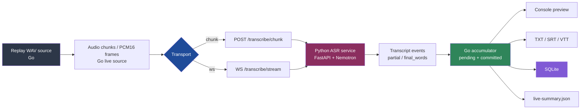
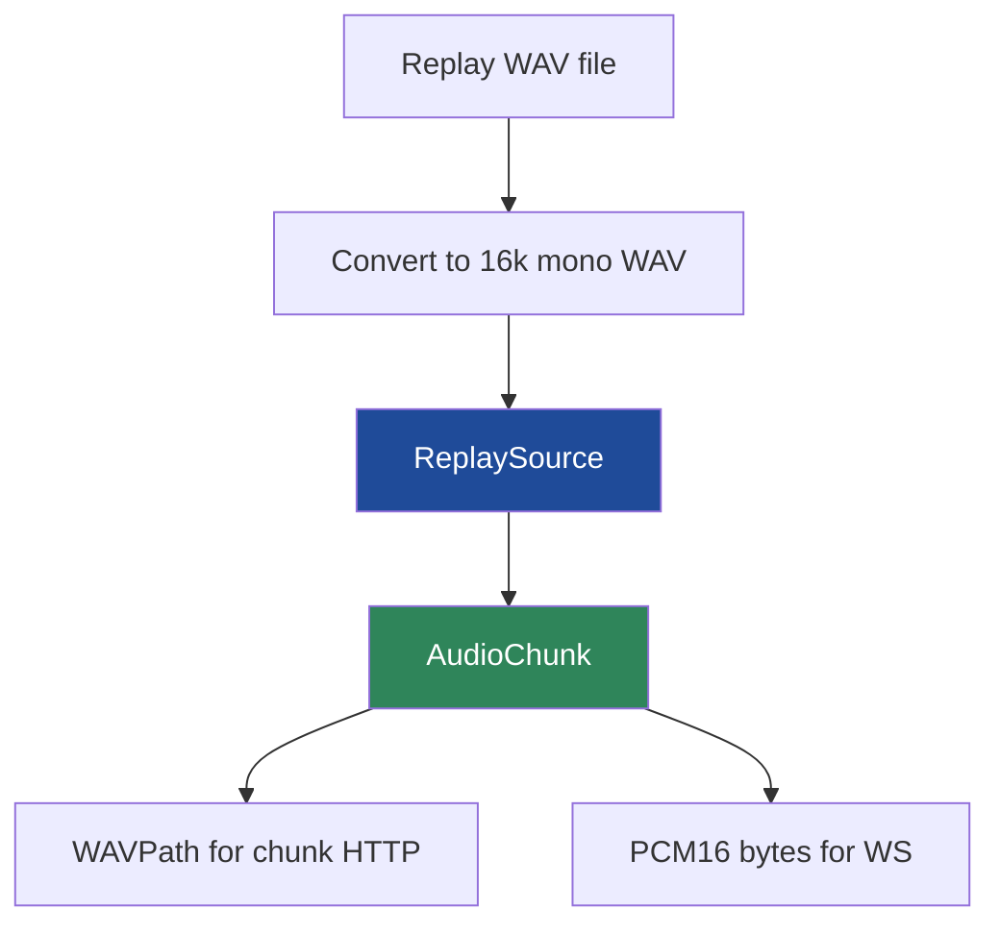
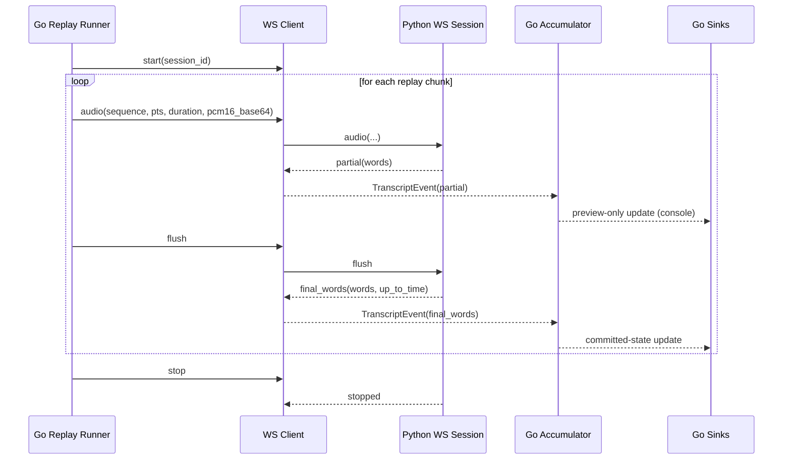

# Transcription Go Streaming Architecture and Implementation Report

This note documents the entire streaming-transcription part of the `transcription-go` system: why it was added, how it evolved, what architectural compromises were made along the way, what turned out to be trickier than expected, and where the implementation stands now. The batch transcription path was already useful before this work began, but the streaming subsystem is where the project became genuinely interesting. It forced careful decisions about boundaries, state, pacing, transport shape, timing semantics, persistence rules, and the surprisingly subtle difference between “a stream over WebSocket” and “a system that is truly incremental.”

The most satisfying part of this work is that it did not end as a vague prototype. The streaming subsystem now exists as a real, documented, runnable part of the project. There is a session-oriented WebSocket transport, explicit partial/final transcript state in Go, a fallback HTTP chunk path for comparison, replay-driven validation over real WAV recordings, persisted transcript artifacts, machine-readable metrics, ticket-local comparison tools, and a practical tmux-based operator workflow. In other words: this is not just an architectural idea anymore. It is a real subsystem with real evidence.

> [!summary]
> The streaming subsystem currently has five important identities:
> 1. a replay-driven near-live proving path built on top of chunk uploads
> 2. a formal Go-side transcript-state model with explicit pending vs committed semantics
> 3. a real server/client WebSocket transport with live sessions and event flow
> 4. a carefully debugged timing model where incoming `pts` is the authority for streaming timestamps
> 5. a WS-first operational stance, with chunk mode retained only as a fallback/debug comparison path

## Why this note exists

The broader project already has a general project note, but the streaming portion grew into its own engineering story. It is worth documenting separately because it is where the repository stopped being “a Go wrapper around a Python ASR service” and became a more layered live-transcription system.

This note exists for three reasons:

1. to preserve the architecture and the implementation narrative in one place,
2. to explain the final shape of the system to a future engineer who did not live through the build/debug process,
3. to capture the specific lessons that only become obvious when you actually try to make near-live and streaming transcription work against a real ASR backend.

The key lesson is that the hard part of streaming transcription is not just transport. It is the interaction between transport, timing, decoder behavior, transcript state, and persistence. The system only became coherent once those layers were separated properly.

## Why streaming transcription was added at all

The batch pipeline was already useful. It could:

- convert local WAV recordings to `16kHz mono PCM16` in pure Go,
- start a Dagger-managed Python ASR service,
- upload a file to the service,
- get back word-level timestamps,
- write SRT, VTT, TXT, and SQLite outputs from Go.

That was enough for offline transcription. But it still had a fundamental limitation: it was not a live system. There was no persistent live session, no notion of partial vs final state, no incremental transcript durability, and no clear path to something that could eventually accept ongoing audio and produce evolving results.

The user question that changed the scope was essentially: *can this do live transcription too?* The answer quickly became: **yes, but not with the current API shape**.

That led to the core architectural split that shaped the entire subsystem:

- **batch mode** remains the stable reference implementation,
- **chunked near-live mode** becomes the proving path,
- **session-oriented WebSocket streaming** becomes the real long-term target.

That framing turned out to be exactly right.

## Current subsystem status

The streaming subsystem is now real and usable.

What exists today:

- explicit `batch` and `live` command separation in the CLI,
- a replay-driven live runner in Go,
- a chunk-based HTTP live path,
- a session-oriented WebSocket live path,
- explicit partial/final transcript state in Go,
- persisted live outputs (`transcript.db`, `transcript.txt`, optional subtitles),
- replay metrics in `live-summary.json`,
- tmux-based validation workflow,
- comparison tooling for SQLite transcript DBs,
- documented operator playbook,
- WS as the default live transport.

What the current operational stance is:

- **primary live path:** `ws`
- **fallback/debug path:** `chunk`
- **stable offline reference:** `batch`

This is important. The streaming work is no longer in the purely speculative design phase. It has crossed into “operationally meaningful” territory.

## High-level architecture

At a high level, the streaming system is a three-boundary architecture:

1. **audio source / pacing boundary** in Go,
2. **transport + session boundary** between Go and Python,
3. **transcript state + output boundary** back in Go.

That split is what made the system manageable.



The most important architectural principle is that the **Python side is still inference-oriented**, while **the Go side owns user-visible transcript behavior**.

That means:

- Python is responsible for model serving, session lifecycle, and emission of timestamped words.
- Go is responsible for transcript accumulation, durability rules, formatting, persistence, and CLI behavior.

This is the same good boundary that made the batch system clean, extended into the streaming domain.

## Evolution of the subsystem

The streaming system did not appear fully formed. It evolved in layers, and each layer answered a different architectural question.

## Phase 0: make room for live work without destabilizing batch

The first step was surprisingly mundane but essential: separate the CLI shape so live work did not break batch behavior.

That led to:

- explicit `batch` and `live` subcommands,
- extracted shared server startup helpers,
- initial `internal/live/` package boundaries.

This was not “live transcription” yet. It was simply preparation. But it mattered because it made the streaming work a coherent sibling of batch mode instead of a pile of flags bolted onto the old command.

The key lesson from this phase is worth preserving:

> live work is much easier to reason about once it has its own package boundaries and command surface, even if the first implementation is still skeletal.

## Phase 1: chunked near-live as the proving path

The first real live implementation was deliberately not WebSocket streaming. It was chunked near-live processing.

The reason was practical: chunk mode is much easier to validate because each unit is discrete and easier to reason about. That gave the project a proving ground for:

- session IDs,
- chunk metadata,
- overlap handling,
- incremental committed transcript state,
- rolling output sinks,
- live metrics,
- replay-driven validation.

### The chunk API

The Python service grew a new endpoint:

```text
POST /transcribe/chunk
```

It accepts:

- uploaded WAV chunk,
- `session_id`,
- `chunk_index`,
- `chunk_start`,
- `overlap_seconds`,
- `is_final_chunk`.

It returns:

- word-level timestamps for that chunk,
- timing metadata,
- processing time.

This was the first time the service became externally chunk-aware instead of only chunking internally behind `/transcribe/full`.

### Why replayed WAV won over directory watching

There was an early fork in the design: watch a chunk directory, or replay a WAV on a synthetic timeline. Replay won, and that was the right call.

Why:

- the intended destination architecture was WebSocket streaming,
- replayed WAV maps naturally to “send frames/chunks over a transport,”
- directory watching introduces unrelated filesystem integration concerns,
- replayed WAV gives a deterministic input source for comparison and testing.

That decision made later WS work much easier.

### Phase 1 accumulator and overlap handling

The first accumulator in Go was built around a simple truth:

> for near-live chunk uploads, only committed/final words should be durable.

The early logic maintained:

- committed words,
- a monotonic final time,
- overlap-deduplication heuristics.

It was not elegant, but it was the correct first proving mechanism.

### Persisted outputs and metrics

Once chunk mode could produce a committed transcript, the next step was to make it operationally inspectable:

- rolling console output,
- rolling SRT/VTT/TXT output,
- rolling SQLite output,
- machine-readable `live-summary.json`.

This was a major milestone because it made live runs inspectable in tmux in the same way batch runs were inspectable after completion.

### Why chunk mode mattered even though it was not the end goal

Chunk mode served three essential purposes:

1. it proved the machine could sustain near-live processing,
2. it forced the first transcript-state and durability semantics into existence,
3. it created a comparison baseline for later WS work.

That last point is especially important. The old chunk-live path is no longer the preferred operational path, but it remains extremely valuable as a debugging reference.

## Phase 1 validation and the first quality question

Once the chunk-live path worked, the obvious question became: how close is it to batch?

That led to a very useful short-loop workflow:

- create a clipped 120-second WAV subset,
- run batch on it,
- run live on it,
- compare the resulting transcript DBs.

This turned out to be one of the best decisions in the whole subsystem.

### The 120-second subset workflow

A small ticket-local helper was added to extract WAV segments without transcoding. That made iteration fast.

The first interesting result was:

- **batch (120s):** `323` words
- **HTTP chunk-live (120s):** `302` words
- **delta:** `-21`

That was already much more actionable than the earlier long-run `-403` comparison against the older reference DB.

### What direct word inspection revealed

The next step was to stop reasoning only from counts and inspect the actual words directly.

That revealed something important:

- some of the gap was real word loss,
- some was substitution/corruption,
- some of the “missing” words were actually duplicated junk that batch had preserved.

This was a major interpretive shift. It meant the objective was not “make the counts match at all costs.” The real objective was transcript quality and sane finalization semantics.

This insight directly supported the later decision *not* to over-invest in perfecting chunk overlap logic once the WS path started to work.

## Phase 2: explicit transcript-state model in Go

This was one of the most important architectural upgrades in the entire subsystem.

The early chunk accumulator was good enough for Phase 1, but the future WS path required something more explicit. That led to:

- `TranscriptEvent`
- `TranscriptEventType`
- `TranscriptState`
- explicit `partial` vs `final_words`
- pending vs committed state
- monotonic finalization rules
- out-of-order sequence rejection

This step mattered because it changed the live path from “a flow of chunk responses” into “a flow of transcript events.”

That is a much better abstraction.

### Why explicit state mattered so much

Without explicit state, it is too easy to conflate:

- preview text,
- final text,
- durable transcript state,
- ephemeral local revisions.

Once the state model became explicit, the sink rules became much cleaner:

- console may surface preview state,
- durable outputs derive only from committed words.

That is exactly the kind of invariant a live transcription system needs.

## Phase 3: server-side WebSocket sessions

Once the Go side could represent transcript events, the next real architectural step was the server-side WS/session boundary.

The Python side gained:

- `WS /transcribe/stream`
- a live session registry,
- per-session buffered decoder object,
- structured live session errors,
- cleanup policy.

This was the point where the project stopped merely *simulating* a future streaming architecture and started implementing one.

### Why this was interesting

The WS server implementation surfaced a subtle but important truth:

> transport correctness and true incremental decoding are not the same thing.

The system became session-oriented and WS-based, but the initial decoder still buffered audio and re-materialized it into a WAV for decode.

That was acceptable. It was an honest intermediate step:

- get real sessions first,
- get real event semantics first,
- get cleanup and sequencing right first,
- improve the decoder internals later.

That sequencing was a good engineering trade.

## Phase 3 on the Go side: WS client, sender, receiver, transport-aware runner

The next step was to make the Go CLI actually speak the new WS protocol.

That added:

- Go WS client,
- WS sender loop,
- WS receiver loop,
- transport-aware runner,
- replay PCM16 support,
- WS integration tests.

### The first important compromise: chunk-paced WS

The first WS path in Go was not fully continuous. Instead it deliberately behaved like this:

1. send one replay chunk over WS,
2. `flush`,
3. wait for that chunk’s finalization,
4. send the next chunk.

This might sound disappointing, but it was exactly the right trade at the time.

Why:

- it exercised the real WS transport and session protocol,
- it kept metrics attribution simple,
- it limited sequencing complexity while the server-side decoder was still buffered,
- it provided a stable end-to-end baseline before attempting more continuous behavior.

This is a recurring pattern in the subsystem: choose the smallest version that preserves the *important* shape of the final system.

## The most interesting WS bug: timestamp drift

The most instructive streaming bug in the whole project was the timestamp drift bug.

The first 120-second WS run produced a transcript DB whose `max_end` reached **`133.12s`**.

That was clearly wrong.

The cause was subtle:

- replay chunks intentionally overlapped,
- the WS buffered decoder advanced its timeline by cumulative buffered duration,
- it ignored the incoming chunk’s absolute `pts`,
- so overlap got double-counted into the streaming timeline.

This is the kind of bug that would be easy to misdiagnose if the system were not instrumented and compared carefully.

### Why the fix mattered conceptually

The fix was not just a patch. It clarified the real authority in the system:

> in replay-driven streaming, incoming `pts` is the timeline authority.

That led to the correct decoder behavior:

- each buffered span remembers its starting `pts`,
- decode timestamps are anchored to that `pts`,
- finalized duration becomes the maximum finalized end time, not cumulative overlap-additive duration.

This immediately fixed the validation numbers.

Corrected results:

- **15s WS run:** DB ends at `15.02s`
- **120s WS run:** DB ends at `120.12s`

This was one of the most satisfying fixes in the whole subsystem because it turned a fuzzy “WS seems off” concern into a precise timing-model correction.

## Where the subsystem stands now, quantitatively

The corrected 120-second comparison is a very good summary of the system’s current state.

### Same 120s clip

- **batch:** `323` words
- **HTTP chunk-live:** `302` words
- **corrected WS live:** `318` words

So the corrected WS path is:

- `-5` vs batch,
- `+16` vs the earlier HTTP chunk-live path.

That is a strong result.

It does not mean the system is “perfect streaming ASR.” But it does mean the WS path is already outperforming the old chunk-live fallback on the same material while preserving correct timing.

## Implementation details

## Subsystem shape inside the repo

The most important streaming-specific files are:

```text
cmd/transcribe/live.go
internal/live/source.go
internal/live/replay_source.go
internal/live/types.go
internal/live/accumulator.go
internal/live/runner.go
internal/live/sinks.go
internal/live/console_sink.go
internal/live/subtitle_sink.go
internal/live/sqlite_sink.go
internal/live/wsclient.go
internal/live/stream_sender.go
internal/live/stream_receiver.go
server/server.py
server/live_sessions.py
server/live_decoder.py
```

A useful mental map is:

- **source**: where audio units come from
- **transport**: how audio crosses the boundary into Python
- **events**: what comes back
- **accumulator**: what becomes committed
- **sinks**: what gets persisted or shown

## Go transcript-state model

The Go-side state model is the best long-term architectural decision in this subsystem.

Conceptually it looks like this:

```go
TranscriptEvent {
    Type: partial | final_words
    SessionID
    Sequence
    UpToTime
    Words
    ProcessingMS
}

TranscriptState {
    Committed []Word
    Pending   []Word
    LastFinalTime float64
}
```

The accumulator rules are roughly:

```go
if event is partial:
    replace pending preview words
    keep committed untouched

if event is final_words:
    append only monotonic non-duplicate words to committed
    update last final time
    drop/trim pending if it overlaps committed
```

This is the right abstraction because it lets multiple transports converge onto the same transcript-state machinery.

## Replay source shape

The replay source emits `AudioChunk` values that now include both:

- `WAVPath`
- `PCM16`

That dual form is very useful:

- HTTP chunk transport uses `WAVPath`
- WS transport uses `PCM16`

The source therefore serves as a transport-neutral live input abstraction.



This is a very clean design choice. It keeps the source independent of transport.

## Current WS flow

The current WS implementation still uses a chunk-paced rhythm, but it is now fully session-oriented.



This is not yet the final continuous streaming model, but it is a good and honest intermediate form.

## Durable output rule

One of the most important working rules in the subsystem is simple:

> only committed/final words are durable.

That means:

- preview/partial text may be shown,
- preview/partial text must not be written into SQLite, subtitles, or final text outputs.

This rule made the whole system easier to reason about. It also sharply reduced the risk of later cleanup work caused by “temporary” transcript content leaking into durable artifacts.

## Current operator workflow

The project now has a practical tmux-first operator workflow.

That matters because Dagger-hosted model startup and live replay runs are long enough that blocking on them directly is annoying and fragile.

The standard shape is now:

- start a run in `tmux`,
- write logs to `logs/...`,
- poll pane output with `tmux capture-pane`,
- inspect `live-summary.json` and `transcript.db` while or after the run completes.

This is one of those small quality-of-life details that becomes part of the real architecture because it changes how the system is practically used.

## Current user-facing commands

### Default live path

```bash
go run ./cmd/transcribe live \
  -i /path/to/input.wav \
  -o ./out-live \
  --live-format console,db,txt
```

This now defaults to:

- `--transport ws`

### Explicit WS run

```bash
go run ./cmd/transcribe live \
  -i /tmp/transcription-live-clip-000-120.wav \
  -o ./out-live-ws-clip-000-120 \
  --transport ws \
  --live-format console,db,txt \
  --chunk-duration 5 \
  --overlap-seconds 0.5 \
  --replay-speed 0
```

### Explicit chunk fallback/debug run

```bash
go run ./cmd/transcribe live \
  -i /tmp/transcription-live-clip-000-120.wav \
  -o ./out-live-chunk-clip-000-120 \
  --transport chunk \
  --live-format console,db,txt \
  --chunk-duration 5 \
  --overlap-seconds 0.5 \
  --replay-speed 0
```

## Important docs and artifacts

Important repo docs:

- `ttmp/2026/04/13/LIVE-TRANSCRIPTION--live-transcription-architecture-and-implementation-plan/design-doc/01-live-transcription-architecture-design-and-implementation-guide.md`
- `ttmp/2026/04/13/LIVE-TRANSCRIPTION--live-transcription-architecture-and-implementation-plan/reference/02-api-contracts.md`
- `ttmp/2026/04/13/LIVE-TRANSCRIPTION--live-transcription-architecture-and-implementation-plan/reference/03-word-analysis-report.md`
- `ttmp/2026/04/13/LIVE-TRANSCRIPTION--live-transcription-architecture-and-implementation-plan/playbooks/01-live-transcription-operator-playbook.md`

Useful comparison helper:

- `ttmp/2026/04/13/LIVE-TRANSCRIPTION--live-transcription-architecture-and-implementation-plan/scripts/01-compare_transcript_dbs.py`

Useful replay helper:

- `ttmp/2026/04/13/LIVE-TRANSCRIPTION--live-transcription-architecture-and-implementation-plan/scripts/02-extract_wav_segment.py`

## What makes this subsystem interesting, technically

There are several reasons this subsystem was especially interesting to build.

### 1. It is about boundary placement, not just feature addition

The streaming work was not simply “add WS.” It forced a careful answer to:

- what belongs in Go,
- what belongs in Python,
- what belongs in transport,
- what belongs in transcript state,
- what belongs in persistence,
- what belongs in operator workflow.

That is why it feels like a real subsystem rather than a feature flag.

### 2. It produced useful intermediate architectures

A lot of projects either build the final thing or get stuck in prototype land. This work produced multiple *useful* intermediate architectures:

- batch reference,
- chunk near-live proving path,
- explicit transcript-state model,
- buffered-but-session-oriented WS transport,
- WS-first operational mode.

That sequence was not wasted motion. Each step taught something and left behind a usable system.

### 3. The most important bugs were conceptual, not syntactic

The best bugs in a project like this are the ones that teach you something structural.

The timestamp-drift bug is a perfect example. It was not a typo. It was a conceptual mismatch between:

- cumulative buffered duration,
- absolute replay timeline position.

Those are exactly the kinds of bugs worth preserving in durable notes because they teach future design intuition.

## Current open questions

Even though the subsystem is in a good place, a few longer-term questions remain.

### True incremental decoder state

The current WS path is real and usable, but the server-side decoder is still buffered rather than truly incremental.

A future version could:

- keep decoder state more continuously,
- reduce repeated re-decode of buffered spans,
- relax the current flush-per-chunk pacing,
- produce more naturally evolving partial/final behavior.

This is probably the biggest remaining long-term technical upgrade.

### Continuous WS behavior

Right now WS is the default, but it is still somewhat chunk-shaped because it flushes once per replay chunk.

A more mature version would:

- send smaller frames continuously,
- allow richer partial revision flow,
- not require per-chunk flush+ack pacing.

That said, this is not urgent. The current system is already useful and stable enough.

### Chunk path longevity

Chunk mode is still useful as:

- fallback,
- debug path,
- comparison baseline.

At some point the project will need to decide whether it remains permanently or eventually gets deprecated. There is no need to answer that yet.

## Near-term next steps

If work resumes later, the most sensible next steps would be:

1. keep using WS as the primary live path,
2. only use chunk mode for debugging/comparison,
3. consider true incremental decoder work only if it becomes operationally valuable,
4. do larger WS validation runs only when they answer a real question,
5. avoid polishing for its own sake now that the subsystem is already good enough.

## Project working rule

> In this repository, “live transcription” now means a WS-first, session-oriented path with Go-owned transcript state and persistence. Chunk mode still exists, but only as a fallback/debug comparison path. Do not collapse those roles back together.

## KB reviews

- [[KB-BATCH16-media-audio-video-pipelines]] (2026-05-11) — Batch H media/audio/video review; advanced ASR, browser audio, WebRTC/media-plane, and media pipeline candidates.

## Related KB entries

**Candidate concepts**: media/audio pipeline orchestration, browser audio playback, ASR transcript state, and media delivery boundaries tracked in [[KB-BATCH16-media-audio-video-pipelines]].

## Related notes

- [[PROJ - Transcription Go - Dagger Nemotron ASR Pipeline]]
- [[ARTICLE - Playbook - Debugging Dagger Service and Host Tunnel Lifecycle]]

## Closing reflection

The streaming part of this system ended up being much more than a transport upgrade. It became a case study in how to evolve a working batch architecture into a live architecture without throwing away the good parts of the existing system.

The project kept the right stable center throughout:

- Go owns orchestration, transcript semantics, formatting, and persistence.
- Python owns inference and live session serving.
- Dagger keeps the model runtime warm and reproducible.
- replay-driven validation keeps the system testable.

That is why the subsystem feels coherent now. It did not become “interesting” because it used WebSockets. It became interesting because it learned how to represent time, state, transport, and durability as separate concerns — and then reassembled them into something that actually works.