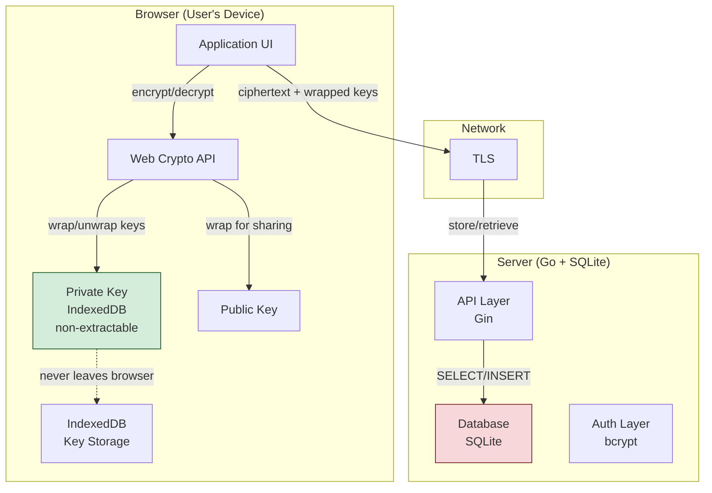

# Browser-Based End-to-End Encryption: The Per-Transcript Key Architecture

This is a comprehensive technical deep dive into building browser-based end-to-end encrypted storage systems. We examine the architecture where each document ("transcript") gets its own random symmetric key, which is then wrapped (encrypted) separately for each authorized user's public key. This approach—sometimes called "envelope encryption"—is the gold standard for E2E systems that support sharing.

The concrete implementation discussed here is a Go backend with SQLite storage and a vanilla HTML/JavaScript frontend using the Web Crypto API. All encryption happens in the browser. The server stores and serves only ciphertext, nonces, and wrapped keys. It never possesses the unwrapped keys or the plaintext content.

> [!summary]
> 1. **Per-transcript symmetric keys**: Each document gets a unique AES-GCM key generated in the browser. This enables granular access control—sharing one document does not expose others.
> 2. **Envelope encryption**: The transcript key is wrapped (encrypted) to each user's RSA public key. The server stores multiple wrapped copies, one per authorized user. Sharing is cheap: just add another wrapped copy.
> 3. **Web Crypto API**: Native browser cryptography means no external libraries, no trust assumptions about npm packages, and non-extractable private keys stored in IndexedDB.
> 4. **Honest security claims**: We can truthfully say "the server cannot read stored documents" but not "the operator can cryptographically guarantee they will never read documents" because we control the JavaScript delivery.

## When to use this pattern

Use browser-based E2E with per-transcript keys when:

- You want server-side storage (convenience, backup, sync) without server-side readability (privacy, compliance, user trust)
- Users need to selectively share specific documents with other users—not an all-or-nothing access model
- You want to avoid trusting the server operator with plaintext, even under legal compulsion
- You can accept that key recovery is hard—if a user loses all their devices, their documents are unrecoverable

Do not use this pattern when:

- You need to search, index, or process document content server-side (the server only sees ciphertext)
- You need strong guarantees against a malicious operator who might serve evil JavaScript to exfiltrate plaintext
- Users expect password-based recovery—if they forget everything and lose all devices, documents are gone
- The threat model requires protection against the operator *right now*—this pattern protects against server compromise and honest-but-curious operators, not against actively malicious operators who push malicious frontend updates

## The threat model: what we protect against

Understanding what the architecture achieves requires a precise threat model. We follow the OWASP Cryptographic Storage guidance: start from threats, then design the system.

### What this protects against

| Threat | Protection | Mechanism |
|--------|------------|-----------|
| Database breach | ✅ Full protection | Server stores only ciphertext; attacker gains no plaintext |
| Server operator reading at rest | ✅ Full protection | Operator has ciphertext + wrapped keys, but no private keys |
| Network eavesdropper | ✅ Full protection | TLS in transit; encryption at rest is E2E |
| Compromised backup | ✅ Full protection | Backups contain only ciphertext |
| Accidental server log exposure | ✅ Full protection | Logs contain ciphertext, not plaintext |

### What this does NOT protect against

| Threat | Why not protected | Mitigation options |
|--------|-------------------|-------------------|
| Malicious frontend update | Operator controls JS delivery | Static signed builds, CSP/SRI, browser extension, desktop app |
| Key exfiltration via XSS | Attacker runs JS in user's browser | Strict CSP, no inline scripts, input sanitization |
| User loses all devices | Private keys never leave devices | Encrypted backup phrase, hardware security keys, social recovery |
| Operator serves evil code today | Same as malicious update | Code transparency, reproducible builds, third-party audits |
| Post-decryption exfiltration | Plaintext exists in browser memory | Sandboxing, minimizing plaintext lifetime, wasm memory isolation |

### Honest claims we can make

✅ **"The server cannot read your stored documents."** True—the server never possesses the unwrapped transcript keys.

✅ **"Decryption happens only in your browser."** True—the private key is in IndexedDB, used by Web Crypto API, never sent to server.

✅ **"We cannot decrypt your documents even if compelled."** True—we have no access to users' private keys.

❌ **"We cryptographically guarantee we can never read your documents."** False—we control the JavaScript that runs in your browser. A future malicious update could capture plaintext after decryption.

## Core mental model: envelope encryption in the browser

The mental model is simple once you grasp the separation between **transcript encryption** (bulk data) and **key wrapping** (access control).

### The encryption hierarchy

```
┌─────────────────────────────────────────────────────────────────┐
│  TRANSCRIPT (the actual document content)                        │
│  Encrypted with: AES-GCM, random 256-bit key (transcriptKey)     │
│  Result: ciphertext + nonce (IV)                                  │
└─────────────────────────────────────────────────────────────────┘
                              │
                              │ wraps (encrypts)
                              ▼
┌─────────────────────────────────────────────────────────────────┐
│  TRANSCRIPT KEY (small, 32 bytes)                                │
│  Encrypted for each authorized user with their RSA public key   │
│  Result: wrappedKey_1, wrappedKey_2, ..., wrappedKey_n          │
└─────────────────────────────────────────────────────────────────┘
                              │
                              │ unwraps (decrypts)
                              ▼
┌─────────────────────────────────────────────────────────────────┐
│  USER'S PRIVATE KEY (stored in browser IndexedDB)                │
│  Never leaves the device. Never seen by server.                  │
└─────────────────────────────────────────────────────────────────┘
```

### Why this is elegant

1. **Sharing is cheap**: To share with a new user, Alice doesn't re-encrypt the entire document. She just wraps the same transcript key with Bob's public key. A 256-byte wrapped key instead of re-encrypting megabytes.

2. **Revocation is possible (with caveats)**: If Alice removes Bob, she rotates the transcript key (generates a new one), re-encrypts the document, and re-wraps the new key for remaining users. Bob's old wrapped key becomes useless. Caveat: Bob may have already downloaded and saved the plaintext.

3. **Compromise is contained**: If Bob's private key is compromised, only documents shared with Bob are at risk. Documents only Alice can see remain secure because they use different transcript keys.

## Architecture

### System components



### Database schema

The schema separates authentication data from encrypted content. This is intentional—if the encrypted content database is breached, attackers don't get password hashes, and vice versa.

```sql
-- Users: authentication + public encryption key
CREATE TABLE users (
    id INTEGER PRIMARY KEY AUTOINCREMENT,
    username TEXT UNIQUE NOT NULL,
    password_hash TEXT NOT NULL,           -- bcrypt hash
    enc_public_key BLOB NOT NULL,          -- RSA public key (SPKI format)
    key_version INTEGER DEFAULT 1,
    created_at DATETIME DEFAULT CURRENT_TIMESTAMP
);

-- Transcripts: encrypted content (server never sees plaintext)
CREATE TABLE transcripts (
    id INTEGER PRIMARY KEY AUTOINCREMENT,
    owner_id INTEGER NOT NULL,
    blob_ciphertext BLOB NOT NULL,         -- AES-GCM encrypted content
    blob_nonce BLOB NOT NULL,              -- 12-byte IV/nonce
    meta_ciphertext BLOB,                  -- Encrypted metadata (title, etc.)
    created_at DATETIME DEFAULT CURRENT_TIMESTAMP,
    FOREIGN KEY (owner_id) REFERENCES users(id)
);

-- Transcript Access: wrapped keys per user (envelope encryption)
CREATE TABLE transcript_access (
    transcript_id INTEGER NOT NULL,
    user_id INTEGER NOT NULL,
    wrapped_file_key BLOB NOT NULL,          -- transcript key encrypted for this user
    wrapped_key_alg TEXT NOT NULL,         -- e.g., "RSA-OAEP"
    granted_at DATETIME DEFAULT CURRENT_TIMESTAMP,
    revoked_at DATETIME,                    -- for soft revocation
    PRIMARY KEY (transcript_id, user_id),
    FOREIGN KEY (transcript_id) REFERENCES transcripts(id),
    FOREIGN KEY (user_id) REFERENCES users(id)
);
```

### Key observation: no plaintext in the database

If you dump the database, you see:

```
transcripts.blob_ciphertext: BF3B8A488FA56CB7... (random bytes)
transcripts.blob_nonce: D81805C6B04F6B21... (12 bytes)
transcript_access.wrapped_file_key: A4E08E641F5BC52A... (256 bytes, encrypted)
```

There is no column for plaintext content, no column for unwrapped keys. The server literally cannot decrypt the documents.

## Cryptographic implementation with Web Crypto API

### Key generation on registration

When a user registers, the browser generates an RSA keypair. The private key is marked `non-extractable` and stored in IndexedDB. The public key is exported and sent to the server.

```javascript
async function generateKeyPair() {
    return await crypto.subtle.generateKey(
        {
            name: "RSA-OAEP",
            modulusLength: 2048,
            publicExponent: new Uint8Array([1, 0, 1]),
            hash: "SHA-256"
        },
        true,  // extractable for the public key (need to export to server)
        ["encrypt", "decrypt", "wrapKey", "unwrapKey"]
    );
}

async function exportPublicKey(keyPair) {
    const exported = await crypto.subtle.exportKey("spki", keyPair.publicKey);
    return arrayBufferToBase64(exported);
}
```

### Transcript encryption on upload

The flow: generate random AES key → encrypt content → encrypt metadata → wrap key with owner's public key → upload everything.

```javascript
async function uploadTranscript(plaintext, title) {
    // 1. Generate random 256-bit AES key
    const transcriptKey = await crypto.subtle.generateKey(
        { name: "AES-GCM", length: 256 },
        true,  // extractable so we can wrap it
        ["encrypt", "decrypt"]
    );
    
    // 2. Encrypt the content
    const iv = crypto.getRandomValues(new Uint8Array(12));
    const encoded = new TextEncoder().encode(plaintext);
    const ciphertext = await crypto.subtle.encrypt(
        { name: "AES-GCM", iv },
        transcriptKey,
        encoded
    );
    
    // 3. Encrypt metadata (title, timestamp, etc.)
    const metadata = JSON.stringify({ title, createdAt: new Date().toISOString() });
    const metaIv = crypto.getRandomValues(new Uint8Array(12));  // separate IV!
    const metaCiphertext = await crypto.subtle.encrypt(
        { name: "AES-GCM", iv: metaIv },
        transcriptKey,
        new TextEncoder().encode(metadata)
    );
    
    // 4. Wrap the transcript key for the owner
    const wrappedKey = await crypto.subtle.wrapKey(
        "raw",
        transcriptKey,
        ownerPublicKey,  // from IndexedDB or fetched from server
        { name: "RSA-OAEP" }
    );
    
    // 5. Upload to server
    return fetch('/api/transcripts', {
        method: 'POST',
        headers: { 'Authorization': `Bearer ${token}` },
        body: JSON.stringify({
            ciphertext: arrayBufferToBase64(ciphertext),
            nonce: arrayBufferToBase64(iv),
            encryptedMetadata: arrayBufferToBase64(metaCiphertext),
            metadataNonce: arrayBufferToBase64(metaIv),  // store separately!
            wrappedKey: arrayBufferToBase64(wrappedKey),
            keyAlg: "RSA-OAEP"
        })
    });
}
```

### Sharing: the re-wrap operation

Sharing is the core elegance of envelope encryption. Alice has the document. She wants Bob to read it. She doesn't re-encrypt the document—she just re-wraps the key.

```javascript
async function shareTranscript(transcriptId, targetUserId) {
    // 1. Fetch Bob's public key from server
    const users = await fetch('/api/users').then(r => r.json());
    const bob = users.find(u => u.id === targetUserId);
    
    // 2. Import Bob's public key
    const bobPublicKey = await crypto.subtle.importKey(
        "spki",
        base64ToArrayBuffer(bob.publicKey),
        { name: "RSA-OAEP", hash: "SHA-256" },
        false,
        ["wrapKey"]
    );
    
    // 3. Get the wrapped key for Alice (she needs to unwrap it first)
    const { wrappedKey: wrappedForAlice, transcriptKeyAlg } = 
        await fetch(`/api/transcripts/${transcriptId}`)
            .then(r => r.json())
            .then(t => ({ 
                wrappedKey: base64ToArrayBuffer(t.wrappedKey),
                transcriptKeyAlg: t.keyAlg 
            }));
    
    // 4. Unwrap using Alice's private key
    const alicePrivateKey = (await getKeyPair(currentUser.id)).privateKey;
    const transcriptKey = await crypto.subtle.unwrapKey(
        "raw",
        wrappedForAlice,
        alicePrivateKey,
        { name: transcriptKeyAlg },
        { name: "AES-GCM", length: 256 },
        true,  // make extractable so we can re-wrap it for Bob
        ["decrypt"]
    );
    
    // 5. Re-wrap the SAME key for Bob
    const wrappedForBob = await crypto.subtle.wrapKey(
        "raw",
        transcriptKey,
        bobPublicKey,
        { name: "RSA-OAEP" }
    );
    
    // 6. Send wrapped key to server (server adds to transcript_access table)
    return fetch(`/api/transcripts/${transcriptId}/share`, {
        method: 'POST',
        headers: { 'Authorization': `Bearer ${authToken}` },
        body: JSON.stringify({
            userId: targetUserId,
            wrappedKey: arrayBufferToBase64(wrappedForBob),
            keyAlg: "RSA-OAEP"
        })
    });
}
```

Notice: the server only sees the wrapped key for Bob. It never sees the unwrapped transcript key.

### Decryption on download

Bob downloads the ciphertext and his wrapped key. He unwraps the key using his private key, then decrypts the content.

```javascript
async function decryptTranscript(transcriptData) {
    // 1. Decode base64 values
    const wrappedKey = base64ToArrayBuffer(transcriptData.wrappedKey);
    const ciphertext = base64ToArrayBuffer(transcriptData.transcript.ciphertext);
    const nonce = base64ToArrayBuffer(transcriptData.transcript.nonce);
    const encryptedMetadata = base64ToArrayBuffer(transcriptData.transcript.encryptedMetadata);
    
    // 2. Get Bob's private key from IndexedDB
    const bobPrivateKey = (await getKeyPair(currentUser.id)).privateKey;
    
    // 3. Unwrap the transcript key
    const transcriptKey = await crypto.subtle.unwrapKey(
        "raw",
        wrappedKey,
        bobPrivateKey,
        { name: transcriptData.keyAlg },
        { name: "AES-GCM", length: 256 },
        false,  // keep non-extractable
        ["decrypt"]
    );
    
    // 4. Decrypt content
    const decryptedContent = await crypto.subtle.decrypt(
        { name: "AES-GCM", iv: nonce },
        transcriptKey,
        ciphertext
    );
    
    // 5. Decrypt metadata
    const decryptedMetadata = await crypto.subtle.decrypt(
        { name: "AES-GCM", iv: transcriptData.transcript.metadataNonce },
        transcriptKey,
        encryptedMetadata
    );
    
    return {
        content: new TextDecoder().decode(decryptedContent),
        metadata: JSON.parse(new TextDecoder().decode(decryptedMetadata))
    };
}
```

## API design

The API is intentionally simple. The server is a dumb storage layer—it doesn't understand the content or the encryption.

### Authentication

```
POST /api/register
  { username, password, publicKey: base64 }
  → { id, username }

POST /api/login
  { username, password }
  → { token, user: { id, username, publicKey, ... } }
```

### Transcript management

```
POST /api/transcripts
  Authorization: Bearer <token>
  {
    ciphertext: base64,        // AES-GCM encrypted content
    nonce: base64,             // 12-byte IV
    encryptedMetadata: base64, // AES-GCM encrypted metadata
    metadataNonce: base64,     // separate IV for metadata
    wrappedKey: base64,        // RSA-OAEP encrypted transcript key
    keyAlg: "RSA-OAEP"
  }
  → { id }

GET /api/transcripts
  Authorization: Bearer <token>
  → [{ id, ownerId, createdAt, wrappedKey, keyAlg }]  // no ciphertext in list

GET /api/transcripts/:id
  Authorization: Bearer <token>
  → {
      transcript: { id, ownerId, ciphertext, nonce, encryptedMetadata, createdAt },
      wrappedKey: base64,  // the wrapped key for THIS user
      keyAlg: "RSA-OAEP"
    }

DELETE /api/transcripts/:id
  Authorization: Bearer <token>
  → { deleted: true }
```

### Sharing

```
POST /api/transcripts/:id/share
  Authorization: Bearer <token>
  {
    userId: number,
    wrappedKey: base64,  // transcript key wrapped for target user
    keyAlg: "RSA-OAEP"
  }
  → { shared: true }

GET /api/transcripts/:id/access
  Authorization: Bearer <token>
  → [{ userId, wrappedKey, keyAlg, grantedAt }]
```

## Common failure modes and how to avoid them

### 1. Reusing IVs across different ciphertexts

**The bug**: Using the same nonce for both content and metadata encryption.

**Why it matters**: AES-GCM with the same key and nonce leaks the XOR of plaintexts. This is catastrophic.

**The fix**: Generate separate nonces for each encryption operation:

```javascript
const contentIv = crypto.getRandomValues(new Uint8Array(12));
const metadataIv = crypto.getRandomValues(new Uint8Array(12));
```

### 2. Storing IVs/nonce wrong

**The bug**: Treating IVs as secrets and trying to encrypt them, or forgetting to store them alongside ciphertext.

**Why it matters**: IVs are not secrets—they're required for decryption. AES-GCM needs the same IV for decryption that was used for encryption.

**The fix**: Store IVs alongside ciphertext. They're public information.

### 3. Key confusion: symmetric vs asymmetric

**The bug**: Trying to encrypt large documents with RSA directly, or trying to wrap keys with AES.

**Why it matters**: RSA is slow and has size limits (~190 bytes for 2048-bit RSA with OAEP). AES is fast but requires both parties to have the same key.

**The fix**: Use the right tool for each job:
- AES-GCM for bulk data encryption (fast, authenticated)
- RSA-OAEP for key wrapping (asymmetric, so users can have separate keys)

### 4. Extractable private keys

**The bug**: Marking the private key as `extractable: true`.

```javascript
// WRONG - key can be exported to JavaScript and stolen
await crypto.subtle.generateKey(
    { name: "RSA-OAEP", ... },
    true,  // ← WRONG
    ["decrypt"]
);
```

**Why it matters**: Malicious JavaScript could export the key and exfiltrate it.

**The fix**: Mark the private key as `extractable: false`. It stays in the browser's secure key store.

```javascript
// CORRECT - key stays in browser, never exposed to JavaScript
await crypto.subtle.generateKey(
    { name: "RSA-OAEP", ... },
    false,  // ← CORRECT - non-extractable
    ["decrypt"]
);
```

### 5. Forgetting to verify access on download

**The bug**: Server returns ciphertext to anyone who asks for it, trusting the client to check permissions.

**Why it matters**: Clients are untrusted. An attacker could request any transcript ID.

**The fix**: Server must verify the requesting user has a `transcript_access` record before returning the ciphertext.

```go
// Server-side check
var wrappedKey []byte
var keyAlg string
err := DB.QueryRow(`
    SELECT wrapped_file_key, wrapped_key_alg
    FROM transcript_access
    WHERE transcript_id = ? AND user_id = ? AND revoked_at IS NULL
`, transcriptId, currentUserId).Scan(&wrappedKey, &keyAlg)

if err != nil {
    return 403, "access denied"
}
```

## Implementation sequence: how to build this

### Phase 1: Single-user E2E (MVP)

1. **Backend**: User registration, login, transcript storage, transcript retrieval
2. **Frontend**: Key generation, transcript upload, transcript download and decryption
3. **Goal**: One user can encrypt and decrypt their own documents. Server never sees plaintext.

### Phase 2: Sharing

1. **Backend**: `transcript_access` table, share endpoint, access verification
2. **Frontend**: Re-wrap key for target user, share UI, list of users to share with
3. **Goal**: Alice can share a document with Bob. Bob can decrypt it. Server never sees unwrapped key.

### Phase 3: Security hardening

1. **CSP headers**: Strict Content Security Policy to prevent XSS
2. **SRI**: Subresource Integrity for all scripts
3. **Audit trail**: Logging who accessed what (without seeing content)
4. **Key recovery**: Optional encrypted backup phrase for key recovery

## Working rules

1. **Server is dumb storage**: Never implement server-side encryption or decryption. If the server can decrypt, it's not E2E.

2. **Private keys stay in browser**: IndexedDB with `extractable: false`. Never send private keys to the server. Never log them. Never `console.log()` them.

3. **Generate random keys per document**: Never reuse transcript keys. Each document gets its own random AES key.

4. **Separate IVs for each encryption**: Content gets one nonce, metadata gets another. Never reuse nonces with the same key.

5. **Authenticate the ciphertext**: AES-GCM provides authentication automatically. Don't use unauthenticated modes like CTR or CBC without HMAC.

6. **Be honest about security claims**: Say "server cannot read" not "operator can never read." The difference matters.

## Related patterns and alternatives

| Pattern | When to use | Tradeoff |
|---------|-------------|----------|
| **This pattern** (per-transcript keys) | Selective sharing, many users | Complexity of key management |
| Single key for all docs | Simplest E2E, no sharing | All-or-nothing access |
| libsodium.js instead of Web Crypto | Need Ed25519/X25519, easier API | External dependency, larger bundle |
| Password-derived keys | Users don't want to manage keys | Weaker than random keys, brute-force risk |
| Double ratchet (Signal protocol) | Real-time messaging | Overkill for document storage |

## References

- [Web Crypto API - MDN](https://developer.mozilla.org/en-US/docs/Web/API/Web_Crypto_API)
- [SubtleCrypto: unwrapKey() - MDN](https://developer.mozilla.org/en-US/docs/Web/API/SubtleCrypto/unwrapKey)
- [OWASP Cryptographic Storage Cheat Sheet](https://cheatsheetseries.owasp.org/cheatsheets/Cryptographic_Storage_Cheat_Sheet.html)
- [libsodium sealed boxes](https://libsodium.gitbook.io/doc/public-key_cryptography/sealed_boxes) - higher-level alternative to Web Crypto
- NIST SP 800-38D: AES-GCM specification
- RFC 5649: AES Key Wrap with Padding (alternative wrapping scheme)

---

*This note was created from the implementation at `/home/manuel/code/wesen/2026-04-14--browser-e2e-encryption`. The concrete code demonstrates all patterns described here.*
