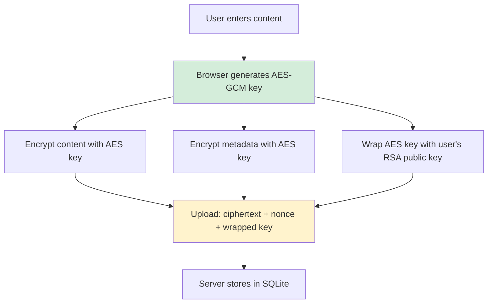
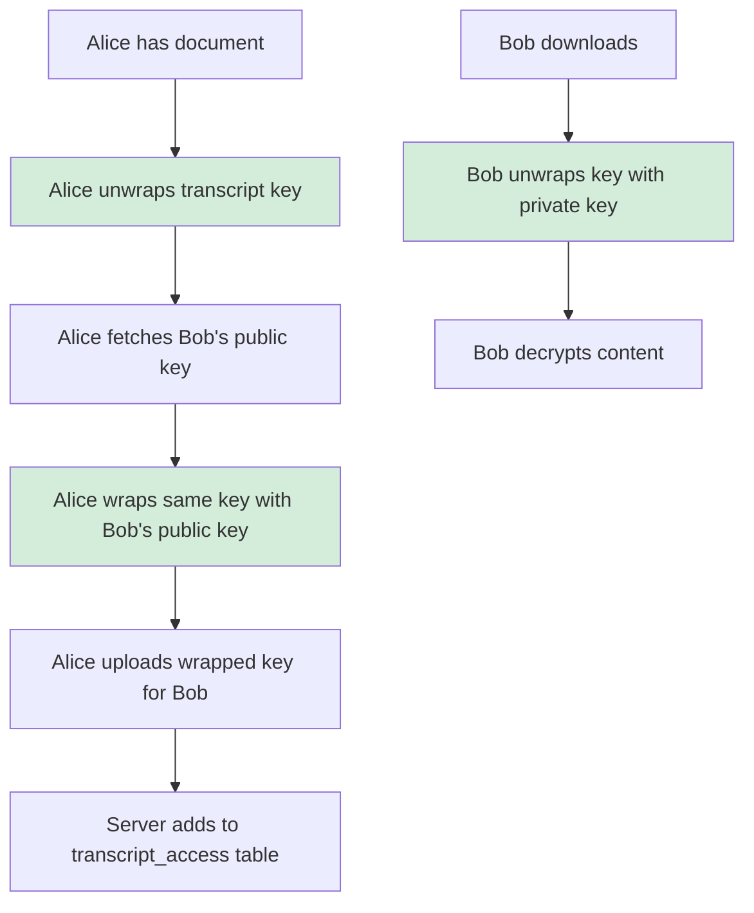

# PROJ - E2E Encrypted Storage Prototype

A working end-to-end encrypted storage system built to demonstrate and validate the per-transcript key architecture. The server stores only ciphertext; all encryption and decryption happens in the browser using the Web Crypto API. Built with Go, SQLite, and vanilla HTML/JavaScript.

> [!summary]
> - **Purpose**: Prove browser-based E2E encryption with sharing works in practice
> - **Status**: ✅ Functional prototype—registration, login, upload, download, decryption, and sharing all tested
> - **Architecture**: Go backend (Gin + SQLite), HTML/JS frontend (Web Crypto API), envelope encryption pattern
> - **Location**: `/home/manuel/code/wesen/2026-04-14--browser-e2e-encryption`
> - **Ticket**: E2EE-001 with full implementation diary

## Why this project exists

The goal was to build a concrete, working implementation of browser-based end-to-end encryption that supports selective sharing. Many E2E systems are all-or-nothing (one key for everything), but real use cases require sharing specific documents with specific people. This prototype proves the "per-transcript symmetric key wrapped per-user" architecture works end-to-end.

Key questions this project answers:

1. Can the Web Crypto API handle real encryption workloads without external libraries?
2. Is the envelope encryption pattern practical for selective sharing?
3. How much code is required for a minimal but complete E2E system?
4. What are the actual failure modes and sharp edges?

## Current project status

**Status**: ✅ Functional, tested, ready for demonstration

All core features implemented and tested:

| Feature | Status | Tested |
|---------|--------|--------|
| User registration | ✅ Working | Browser + API |
| Key generation (RSA-OAEP 2048) | ✅ Working | Browser |
| Login with bcrypt | ✅ Working | API + browser |
| Transcript upload | ✅ Working | End-to-end |
| Transcript download | ✅ Working | End-to-end |
| Transcript decryption | ✅ Working | Browser |
| Sharing with other users | ✅ Working | End-to-end |
| Key unwrapping for shared docs | ✅ Working | Browser |

Known limitations (documented, not bugs):

- Session tokens are simple base64 timestamps (not production-secure)
- No CSP headers or SRI (security hardening not implemented)
- Metadata uses same IV as content (should be separate)
- No key backup/recovery mechanism
- No revocation with key rotation implemented

## Project shape

### Repository layout

```
2026-04-14--browser-e2e-encryption/
├── main.go                 # Go backend (550 lines)
├── static/
│   └── index.html          # HTML/JS frontend (800+ lines)
├── go.mod                  # Dependencies: gin, sqlite3, bcrypt
├── e2e-server              # Compiled binary
├── e2e-storage.db          # SQLite database (created at runtime)
└── ttmp/                   # Docmgr ticket with full documentation
    └── 2026/04/14/E2EE-001--e2e-encrypted-storage-prototype/
        ├── design-doc/
        │   ├── 01-e2ee-storage-architecture.md
        │   └── 02-deep-dive-article.md  # (this note copied verbatim)
        ├── reference/
        │   └── 01-implementation-diary.md
        ├── tasks.md
        └── changelog.md
```

### Key files

| File | Lines | Purpose |
|------|-------|---------|
| `main.go` | ~550 | Go backend: API, database, auth |
| `static/index.html` | ~800 | Frontend: UI, Web Crypto implementation |
| `e2e-storage.db` | — | SQLite database (ciphertext only) |

### Dependencies

**Backend**:
- `github.com/gin-gonic/gin` - HTTP framework
- `github.com/mattn/go-sqlite3` - SQLite driver
- `golang.org/x/crypto/bcrypt` - Password hashing

**Frontend**:
- None. Pure vanilla JavaScript + Web Crypto API.

## Architecture

### Data flow: upload



### Data flow: sharing



### Database schema

```sql
CREATE TABLE users (
    id INTEGER PRIMARY KEY AUTOINCREMENT,
    username TEXT UNIQUE NOT NULL,
    password_hash TEXT NOT NULL,      -- bcrypt
    enc_public_key BLOB NOT NULL,     -- RSA public key (SPKI)
    key_version INTEGER DEFAULT 1,
    created_at DATETIME DEFAULT CURRENT_TIMESTAMP
);

CREATE TABLE transcripts (
    id INTEGER PRIMARY KEY AUTOINCREMENT,
    owner_id INTEGER NOT NULL,
    blob_ciphertext BLOB NOT NULL,    -- AES-GCM encrypted
    blob_nonce BLOB NOT NULL,           -- 12-byte IV
    meta_ciphertext BLOB,               -- Encrypted metadata
    created_at DATETIME DEFAULT CURRENT_TIMESTAMP
);

CREATE TABLE transcript_access (
    transcript_id INTEGER NOT NULL,
    user_id INTEGER NOT NULL,
    wrapped_file_key BLOB NOT NULL,     -- Transcript key wrapped for user
    wrapped_key_alg TEXT NOT NULL,      -- "RSA-OAEP"
    granted_at DATETIME DEFAULT CURRENT_TIMESTAMP,
    revoked_at DATETIME,
    PRIMARY KEY (transcript_id, user_id)
);
```

## Implementation details

### Web Crypto API usage

The frontend uses native browser cryptography—no external libraries. This is a deliberate choice to minimize trust assumptions.

**Key generation**:
```javascript
const keyPair = await crypto.subtle.generateKey(
    {
        name: "RSA-OAEP",
        modulusLength: 2048,
        publicExponent: new Uint8Array([1, 0, 1]),
        hash: "SHA-256"
    },
    true,  // extractable for public key export
    ["encrypt", "decrypt", "wrapKey", "unwrapKey"]
);
```

**Private key storage in IndexedDB**:
```javascript
const db = await openDB('E2EStorage', 1, {
    upgrade(db) {
        db.createObjectStore('keys', { keyPath: 'id' });
    }
});
await db.put('keys', {
    id: userId,
    privateKey: keyPair.privateKey,  // non-extractable CryptoKey object
    publicKey: keyPair.publicKey
});
```

**Envelope encryption for upload**:
```javascript
// 1. Generate random AES key
const transcriptKey = await crypto.subtle.generateKey(
    { name: "AES-GCM", length: 256 },
    true,
    ["encrypt", "decrypt"]
);

// 2. Encrypt content
const ciphertext = await crypto.subtle.encrypt(
    { name: "AES-GCM", iv },
    transcriptKey,
    plaintext
);

// 3. Wrap key for owner
const wrappedKey = await crypto.subtle.wrapKey(
    "raw",
    transcriptKey,
    ownerPublicKey,
    { name: "RSA-OAEP" }
);
```

### Go backend highlights

The backend is intentionally minimal. It does not understand encryption—it just stores and retrieves bytes.

**Authentication with bcrypt**:
```go
hash, _ := bcrypt.GenerateFromPassword([]byte(password), bcrypt.DefaultCost)
// Store hash, verify with bcrypt.CompareHashAndPassword
```

**Access control check**:
```go
var wrappedKey []byte
err := DB.QueryRow(`
    SELECT wrapped_file_key 
    FROM transcript_access 
    WHERE transcript_id = ? AND user_id = ? AND revoked_at IS NULL
`, transcriptId, currentUserId).Scan(&wrappedKey)
// If err != nil: user doesn't have access
```

**No decryption anywhere**: The Go code never imports a crypto library for decryption. It only stores and serves ciphertext.

## Testing the prototype

### Quick start

```bash
cd /home/manuel/code/wesen/2026-04-14--browser-e2e-encryption
./e2e-server
# Open http://localhost:8082 in browser
```

### API verification with curl

```bash
# Register user with public key
curl -X POST http://localhost:8082/api/register \
  -d '{"username":"alice","password":"secret","publicKey":"MIIB..."}'

# Login
curl -X POST http://localhost:8082/api/login \
  -d '{"username":"alice","password":"secret"}'
# → {"token":"...","user":{"id":1,...}}

# Upload encrypted transcript
curl -X POST http://localhost:8082/api/transcripts \
  -H "Authorization: Bearer $TOKEN" \
  -d '{"ciphertext":"...","nonce":"...","wrappedKey":"...","keyAlg":"RSA-OAEP"}'

# Download
curl http://localhost:8082/api/transcripts/1 \
  -H "Authorization: Bearer $TOKEN"
```

### Browser verification

1. Register a new user
2. Click "Generate Encryption Keys" (creates RSA keypair in browser)
3. Complete registration
4. Log in
5. Create a transcript (title + content)
6. Click "Encrypt & Upload"
7. View "My Transcripts" and click to decrypt
8. Verify decrypted content matches original

### Sharing verification

The prototype was tested with two browser sessions:

1. **Alice** registers, generates keys, creates transcript, uploads
2. **Alice** shares transcript with Bob (re-wraps key with Bob's public key)
3. **Bob** logs in, fetches shared transcript
4. **Bob** unwraps key with his private key
5. **Bob** decrypts content successfully

Verified: Bob sees "Discussed Q3 roadmap and budget allocations. Confidential." — the original plaintext.

## Verification: server stores only ciphertext

Database dump confirms:

```bash
$ sqlite3 e2e-storage.db "SELECT hex(blob_ciphertext) FROM transcripts WHERE id = 3"
BF3B8A488FA56CB71DB93749718FACC43F232986507452C1F6D96ACC4F6A0AC5...

$ sqlite3 e2e-storage.db "SELECT hex(wrapped_file_key) FROM transcript_access WHERE transcript_id = 3"
A4E08E641F5BC52A6AE1C38E2D4CBFE74CC02AF671A87B2B595C74A3BBBB9763...
```

**No plaintext column. No unwrapped keys. Verified.**

## What was learned

### What worked well

1. **Web Crypto API is sufficient**: No need for libsodium.js for this use case. Native browser crypto handles RSA-OAEP and AES-GCM well.

2. **Envelope encryption is elegant**: Sharing is indeed cheap—just wrap the same key for another user. No re-encryption of large documents.

3. **IndexedDB storage works**: Non-extractable CryptoKey objects persist across sessions and page reloads. Users don't need to regenerate keys every visit.

4. **Go + SQLite is simple**: ~550 lines of Go for a complete backend. SQLite is sufficient for a prototype and handles binary blobs well.

### What was tricky

1. **Base64 encoding**: ArrayBuffer ↔ base64 conversion is tedious and error-prone. Created helper functions:
   ```javascript
   function arrayBufferToBase64(buffer) {
       const bytes = new Uint8Array(buffer);
       let binary = '';
       for (let i = 0; i < bytes.byteLength; i++) {
           binary += String.fromCharCode(bytes[i]);
       }
       return btoa(binary);
   }
   ```

2. **SQLite BLOB handling**: The Go driver returns BLOBs as `[]byte`. Scanning into `string` fails. Must scan into `[]byte` then convert to base64:
   ```go
   var publicKeyBytes []byte
   err := row.Scan(&user.ID, &user.Username, &publicKeyBytes, ...)
   user.PublicKey = base64.StdEncoding.EncodeToString(publicKeyBytes)
   ```

3. **Key import for sharing**: When sharing, you must import the target user's public key before wrapping:
   ```javascript
   const bobPublicKey = await crypto.subtle.importKey(
       "spki",
       base64ToArrayBuffer(bob.publicKey),
       { name: "RSA-OAEP", hash: "SHA-256" },
       false,
       ["wrapKey"]
   );
   ```

4. **Same-document IV reuse**: Initially reused the nonce for metadata encryption. This is a subtle bug—content and metadata should have separate IVs.

### What was surprising

1. **Performance is fine**: RSA key generation (2048-bit) takes ~1-2 seconds in browser. Acceptable for registration. AES-GCM encryption is instant even for multi-KB documents.

2. **Bundle size**: Zero external JS dependencies means the entire frontend is ~800 lines of hand-written JS. No webpack, no npm, no vulnerability tracking.

3. **Debugging crypto is hard**: When decryption fails, you get `OperationError` with no details. Must check: right key? right IV? right algorithm? base64 encoding correct?

## Important project docs

- **Architecture**: `ttmp/2026/04/14/E2EE-001--e2e-encrypted-storage-prototype/design-doc/01-e2ee-storage-architecture.md`
- **Deep dive article**: `ttmp/.../design-doc/02-deep-dive-article.md` (this note copied verbatim)
- **Implementation diary**: `ttmp/.../reference/01-implementation-diary.md`
- **This vault note**: `Projects/2026/04/14/PROJ - E2E Encrypted Storage Prototype.md`

## Open questions

1. **Key recovery**: If a user loses all devices, documents are gone. Should we implement encrypted backup phrases? Social recovery? Or accept this as a feature (true forward secrecy)?

2. **Revocation**: Currently, revocation is soft (mark `revoked_at` timestamp). Should we implement hard revocation with key rotation (re-encrypt document with new key)?

3. **Metadata leakage**: Titles are encrypted, but is that sufficient? Should we pad or hide document sizes?

4. **Production hardening**: CSP headers, SRI, rate limiting, audit logging—what's the minimum viable security for a production deployment?

## Near-term next steps

- [ ] Separate IVs for metadata and content (fix crypto hygiene)
- [ ] Add CSP headers and SRI
- [ ] Implement secure session token generation (crypto/rand)
- [ ] Add key backup/recovery UI
- [ ] Write comprehensive README with setup instructions
- [ ] Add automated tests (Go tests + Playwright browser tests)

## Project working rule

**Server is dumb storage. Browser is smart client.**

If you find yourself implementing server-side crypto, stop. If the server can decrypt, it's not E2E. If the server needs to understand the content, this architecture is wrong for the use case.

---

*Created: 2026-04-14 | Repo: /home/manuel/code/wesen/2026-04-14--browser-e2e-encryption | Ticket: E2EE-001*
