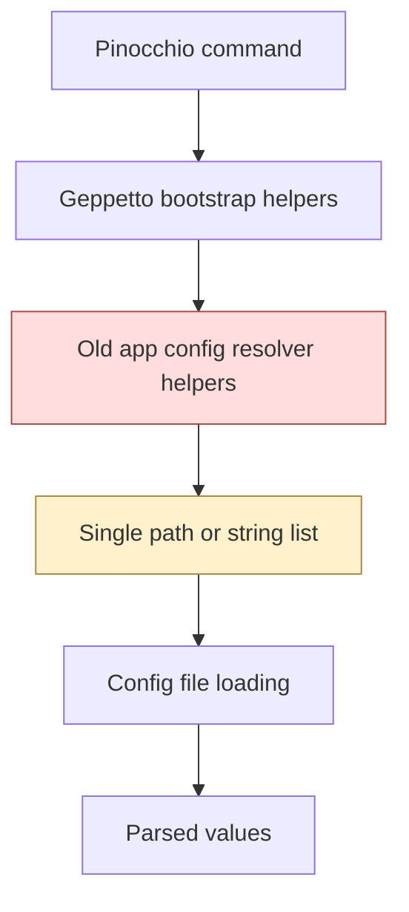
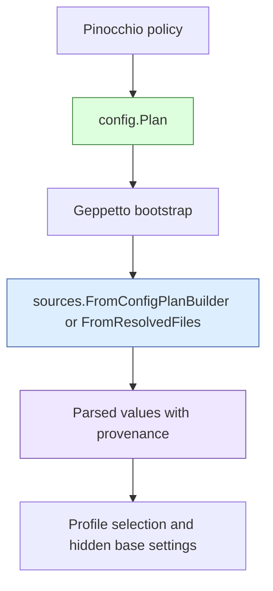

# PinocchioRC Declarative Config Plans and Cleanup

This project report captures a fairly deep configuration-system refactor across the local `pinocchiorc` worktree. The work started as a focused Pinocchio feature request — support local project profile files from the current directory and git root — but it quickly turned into a larger architectural cleanup across Glazed, Geppetto, Pinocchio, and the local Clay worktree.

The final result is not just “Pinocchio can find `.pinocchio-profile.yml` locally.” The more important outcome is that the active config-loading model is now explicit, layered, provenance-aware, and much simpler than the old mixture of Viper-era helpers, path-list hooks, and compatibility facades.

> [!summary]
> This work ended up being four linked projects in one:
> 1. design and implement a declarative config-plan API in Glazed
> 2. wire Geppetto and Pinocchio to consume plans instead of hidden path helpers
> 3. remove old config/Viper-era APIs (`ConfigFilesFunc`, `ConfigPath`, `pkg/appconfig`, `ResolveAppConfigPath`, local `clay.InitViper`)
> 4. preserve traceability so parsed field history explains **which config layer** wrote each value

## Why this project exists

The immediate feature request was practical: Pinocchio needed project-local profile behavior so a repo could carry its own `.pinocchio-profile.yml`, with clear precedence between:

- system config
- home config
- XDG config
- repo-local config
- current-working-directory config
- explicit `--config-file`

The old stack could be made to do that, but only awkwardly. The pre-existing model had several problems:

- config discovery was hidden behind helper functions instead of represented as explicit data
- precedence was spread across control flow rather than readable in one place
- the old Cobra parser surface (`ConfigFilesFunc`, `ConfigPath`) only returned `[]string`, which lost config provenance
- Viper-era compatibility helpers still existed in enough places to confuse the current architecture
- parse-step history could say a value came from “a config file,” but not always **which layer** or **which source rule** produced it

Once local profile loading became the requirement, it was clear that simply adding another hardcoded lookup path would make the system worse. The better answer was to replace hidden resolver logic with a declarative, layered plan model.

## Current project status

The core implementation work is complete in the `pinocchiorc` workspace.

### What is now implemented

- Glazed has a reusable declarative config-plan API.
- Config files can be resolved with layer/source metadata.
- Field parse history preserves config provenance such as:
  - `config_file`
  - `config_index`
  - `config_layer`
  - `config_source_name`
  - `config_source_kind`
- Geppetto bootstrap now consumes explicit config plans.
- Pinocchio now declares local profile precedence explicitly:
  - `system -> home -> xdg -> repo -> cwd -> explicit`
- Active workspace code no longer depends on:
  - `ConfigFilesFunc`
  - `ConfigPath`
  - `pkg/appconfig`
  - `ResolveAppConfigPath(...)`
  - local `clay.InitViper(...)`

### What was also cleaned up

- dead Viper-based config/editor paths in Glazed
- deprecated Viper-based logging/config helpers in the local workspace path
- local Clay bootstrap so workspace tests no longer fail on removed Glazed Viper logger APIs
- active current docs so they teach plans and plan middleware instead of removed compatibility hooks

### What remains intentionally rough

Some legacy `corporate-headquarters` programs were swept off removed startup APIs textually, but they were not treated as a real modernization project. That work was intentionally pragmatic and unvalidated because many of those repos are already legacy and dirty, especially under `go-go-labs`.

## Project shape

This was not a single-repo feature branch. It was a multi-repo refactor carried out in one local worktree.

### Main repos involved

- `/home/manuel/workspaces/2026-04-10/pinocchiorc/glazed`
- `/home/manuel/workspaces/2026-04-10/pinocchiorc/geppetto`
- `/home/manuel/workspaces/2026-04-10/pinocchiorc/pinocchio`
- `/home/manuel/workspaces/2026-04-10/pinocchiorc/clay`

### Main ticket/doc streams

This implementation was documented through two ticket tracks under Pinocchio’s `ttmp/` area:

1. `PI-LOCAL-PROFILES`
   - feature/design track for local project profile loading and provenance-aware layered config discovery
2. `PI-CONFIGFILESFUNC-REMOVAL`
   - cleanup track for removing old parser/config-loading APIs and compatibility facades

### Main code ownership boundaries

- **Glazed** owns generic config discovery primitives, source middlewares, provenance metadata, and docs.
- **Geppetto** owns CLI/bootstrap integration, profile selection, hidden base settings, and inference debug traces.
- **Pinocchio** owns app-specific policy such as `.pinocchio-profile.yml` naming and runtime profile behavior.
- **Clay** only needed compatibility cleanup so the local workspace could stop referencing removed Viper logger paths.

## Architecture

The biggest improvement is that config discovery is now represented as data instead of hidden helper behavior.

### Before



The old shape encouraged code like “ask a helper for a path” or “return `[]string` from a callback,” which hid why a file existed and what precedence rule it represented.

### After



### Layer model

The local Pinocchio policy now reads as an explicit ordered plan rather than implicit append/prepend logic:

```text
system -> home -> xdg -> repo -> cwd -> explicit
```

That order is low-to-high precedence.

### Mental model

The clean mental model now looks like this:

1. **Build a plan** that says what sources exist.
2. **Resolve the plan** into explicit files with layer/source metadata.
3. **Load those files** into parsed values while preserving provenance.
4. **Let higher-level bootstrap code** make profile/runtime decisions using those parsed values.

That sounds obvious, but this explicit separation is the real architectural win.

## Implementation details

This project has two intertwined technical themes:

1. design a better generic config-loading API
2. remove old paths that would let the codebase drift back into implicit or Viper-driven behavior

### 1. Declarative config-plan API in Glazed

The new generic machinery lives primarily under `glazed/pkg/config/` and `glazed/pkg/cmds/sources/`.

Key types added or emphasized:

- `ConfigLayer`
- `SourceSpec`
- `ResolvedConfigFile`
- `ResolvedSource`
- `Plan`
- `PlanReport`

Key built-in source constructors:

- `SystemAppConfig(...)`
- `XDGAppConfig(...)`
- `HomeAppConfig(...)`
- `ExplicitFile(...)`
- `WorkingDirFile(...)`
- `GitRootFile(...)`

The core idea is that an application no longer asks “what is my config path?” It instead declares a plan.

#### Pseudocode shape

```go
plan := config.NewPlan(
    config.WithLayerOrder(
        config.LayerSystem,
        config.LayerUser,
        config.LayerRepo,
        config.LayerCWD,
        config.LayerExplicit,
    ),
    config.WithDedupePaths(),
).Add(
    config.SystemAppConfig("pinocchio").Named("system"),
    config.HomeAppConfig("pinocchio").Named("home"),
    config.XDGAppConfig("pinocchio").Named("xdg"),
    config.GitRootFile(".pinocchio-profile.yml").Named("repo-local"),
    config.WorkingDirFile(".pinocchio-profile.yml").Named("cwd-local"),
    config.ExplicitFile(explicitPath).Named("explicit"),
)
```

This one block expresses most of the interesting policy.

### 2. Provenance-aware config loading

The loader layer was extended so config history is not just “came from config file N.” It now carries enough metadata to explain layered precedence.

Important loader paths:

- `sources.FromFiles(...)`
- `sources.FromResolvedFiles(...)`
- `sources.FromConfigPlan(...)`
- `sources.FromConfigPlanBuilder(...)`

The useful distinction is:

- `FromFiles(...)` is for simple ordered file lists
- `FromResolvedFiles(...)` is the lower-level provenance-preserving seam
- `FromConfigPlan(...)` and `FromConfigPlanBuilder(...)` are higher-level convenience wrappers over plan resolution

#### Provenance metadata

The standardized metadata shape now includes:

```text
config_file
index
config_index
config_layer
config_source_name
config_source_kind
```

That made it possible for both parsed field history and higher-level inference/debug output to answer questions like:

- did this value come from the repo layer or cwd layer?
- which source spec discovered the winning file?
- was the final override explicit or local-project-driven?

### 3. Geppetto bootstrap integration

Once the low-level plan machinery existed, Geppetto bootstrap had to become the consumer.

Important bootstrap changes:

- `ConfigPlanBuilder` added to `AppBootstrapConfig`
- `ResolvedCLIConfigFiles` added
- `ResolveCLIConfigFilesResolved(...)` added
- profile selection, hidden base settings, and inference debug paths updated to consume resolved files and provenance metadata
- legacy fallback behavior removed later, so current bootstrap requires plans rather than silently resolving old-style config paths

This matters because Geppetto is where the higher-level semantics live:

- hidden base settings
- stripped parsed base settings
- final active runtime settings
- inference debug trace

A major requirement throughout the project was: **do not lose traceability while simplifying the architecture**.

### 4. Pinocchio policy wiring

Pinocchio stays thin, which is the right place for it to land.

Pinocchio’s job is mostly to declare app-specific policy:

- the local file name is `.pinocchio-profile.yml`
- repo-local files are valid
- cwd-local files are valid
- precedence is explicit

That logic now lives in a much more honest form than before. Pinocchio no longer needs to smuggle config behavior through old generic parser hooks.

### 5. Aggressive cleanup of old APIs

The second half of the project was deliberately destructive.

Removed or deleted from the active workspace path:

- `CobraParserConfig.ConfigFilesFunc`
- `CobraParserConfig.ConfigPath`
- `pkg/appconfig`
- `ResolveAppConfigPath(...)`
- dead Viper-based config/editor paths in Glazed
- deprecated Viper logging bootstrap functions in the active Glazed worktree
- local `clay.InitViper(...)`

This was not just aesthetic cleanup. The point was to remove alternate architecture stories.

As long as those older APIs still existed, future code could continue to bypass the new plan model.

### 6. Clay cleanup and validation unblock

A practical blocker showed up during validation: the workspace had a local Clay module path that still imported a removed Glazed Viper logger symbol.

That issue blocked command-package tests with errors like:

```text
undefined: logging.InitLoggerFromViper
```

The fix sequence was:

- first, replace the stale logger dependency with `logging.InitEarlyLoggingFromArgs(...)`
- later, remove local `clay.InitViper(...)` entirely

That turned the local workspace from “architecturally right but partially blocked by old helper residue” into something testable again.

## Key implementation sequence

The work unfolded in a sequence that was more coherent than it might look from the outside.

### Phase 1: design and feature delivery

- create ticket/docs for local profile loading
- map the current bootstrap flow across Pinocchio → Geppetto → Glazed
- implement plan primitives and built-in sources in Glazed
- implement provenance-aware resolved-file loading
- integrate plans into Geppetto bootstrap
- wire Pinocchio local profile policy
- add docs and runnable examples

### Phase 2: cleanup of old config APIs

- remove dead Viper/editor paths
- fix explicit missing-file behavior in `ExplicitFile(...)`
- remove `ConfigFilesFunc` and `ConfigPath`
- delete `pkg/appconfig`
- remove `ResolveAppConfigPath(...)`
- require plans in current bootstrap paths
- add `FromConfigPlan(...)` and `FromConfigPlanBuilder(...)`
- refresh docs to teach the new middleware-level API

### Phase 3: workspace hygiene and legacy edges

- fix local Clay compatibility issues
- remove local `clay.InitViper(...)`
- update active workspace docs still showing the removed helper
- do a pragmatic sweep across active legacy `corporate-headquarters` programs so they stop referencing removed startup APIs

## Validation and evidence

A lot of this project was intentionally backed by focused tests rather than “trust the refactor.”

### Focused validations that passed

Glazed:

```bash
cd glazed
go test ./pkg/config/... ./pkg/cmds/sources/... -count=1
go test ./pkg/cmds/sources/... ./pkg/cli/... -count=1
```

Geppetto:

```bash
cd geppetto
go test ./pkg/cli/bootstrap/... -count=1
```

Pinocchio:

```bash
cd pinocchio
go test ./pkg/cmds/profilebootstrap/... ./cmd/web-chat/... -count=1
```

Later, after Clay cleanup:

```bash
cd pinocchio
go test ./cmd/web-chat ./cmd/examples/simple-chat ./cmd/agents/simple-chat-agent ./cmd/pinocchio/... -count=1
```

Clay:

```bash
cd clay
go test ./pkg/... -count=1
```

### Important project tests added

- plan resolution tests in Glazed
- resolved-file metadata tests in source loaders
- parser regression tests for `ConfigPlanBuilder`
- Geppetto bootstrap tests proving layered precedence and `config_layer` propagation
- Pinocchio precedence tests for repo/cwd/explicit profile behavior

## Important code locations

### Glazed

- `/home/manuel/workspaces/2026-04-10/pinocchiorc/glazed/pkg/config/plan.go`
- `/home/manuel/workspaces/2026-04-10/pinocchiorc/glazed/pkg/config/plan_sources.go`
- `/home/manuel/workspaces/2026-04-10/pinocchiorc/glazed/pkg/cmds/sources/load-fields-from-config.go`
- `/home/manuel/workspaces/2026-04-10/pinocchiorc/glazed/pkg/cli/cobra-parser.go`
- `/home/manuel/workspaces/2026-04-10/pinocchiorc/glazed/pkg/cli/cobra_parser_config_test.go`

### Geppetto

- `/home/manuel/workspaces/2026-04-10/pinocchiorc/geppetto/pkg/cli/bootstrap/config.go`
- `/home/manuel/workspaces/2026-04-10/pinocchiorc/geppetto/pkg/cli/bootstrap/profile_selection.go`
- `/home/manuel/workspaces/2026-04-10/pinocchiorc/geppetto/pkg/cli/bootstrap/engine_settings.go`
- `/home/manuel/workspaces/2026-04-10/pinocchiorc/geppetto/pkg/cli/bootstrap/inference_debug.go`

### Pinocchio

- `/home/manuel/workspaces/2026-04-10/pinocchiorc/pinocchio/pkg/cmds/profilebootstrap/profile_selection.go`
- `/home/manuel/workspaces/2026-04-10/pinocchiorc/pinocchio/pkg/cmds/profilebootstrap/local_profile_plan_test.go`
- `/home/manuel/workspaces/2026-04-10/pinocchiorc/pinocchio/cmd/pinocchio/main.go`
- `/home/manuel/workspaces/2026-04-10/pinocchiorc/pinocchio/pkg/doc/topics/pinocchio-profile-resolution-and-runtime-switching.md`

### Workspace docs and design records

- `/home/manuel/workspaces/2026-04-10/pinocchiorc/pinocchio/ttmp/2026/04/10/PI-LOCAL-PROFILES--add-local-directory-profile-support-for-pinocchio/design-doc/01-declarative-config-resolution-plan-and-trace-guide.md`
- `/home/manuel/workspaces/2026-04-10/pinocchiorc/pinocchio/ttmp/2026/04/10/PI-LOCAL-PROFILES--add-local-directory-profile-support-for-pinocchio/reference/01-diary.md`
- `/home/manuel/workspaces/2026-04-10/pinocchiorc/pinocchio/ttmp/2026/04/14/PI-CONFIGFILESFUNC-REMOVAL--remove-configfilesfunc-and-migrate-cli-config-resolution-to-declarative-plans/reference/01-diary.md`

## Important commits

### Glazed

- `b9628f7` — config plan primitives
- `0bf7314` — resolved config metadata in sources
- `2088c59` — docs and example for declarative config plans
- `5c04291` — remove unused Viper editor command
- `ef3fdf7` — remove deprecated Viper paths
- `3392768` — explicit missing plan file should fail loudly
- `0e0f443` — switch Cobra config loading to plans
- `c850f23` — remove `pkg/appconfig`
- `a94d873` — remove legacy app config resolver
- `f13b8df` — add config-plan middleware wrappers
- `fcfe018` — teach config plan middleware in docs

### Geppetto

- `ce7f03d` — integrate declarative config plans
- `8ef6188` — require config plans
- `2d14df5` — drop local doc example referencing removed `InitViper`

### Pinocchio

- `56bb1f6` — layered local profile plan
- `8765765` — drop no-op parser shims
- `3118d0c` — repository config loading via plans

### Clay

- `20a8a9d` — remove stale Viper logger dependency
- `84c0ae7` — remove local `InitViper` helper entirely

## Important project docs

If I needed to onboard someone into this work quickly, I would point them here first:

- design guide:
  - `/home/manuel/workspaces/2026-04-10/pinocchiorc/pinocchio/ttmp/2026/04/10/PI-LOCAL-PROFILES--add-local-directory-profile-support-for-pinocchio/design-doc/01-declarative-config-resolution-plan-and-trace-guide.md`
- feature diary:
  - `/home/manuel/workspaces/2026-04-10/pinocchiorc/pinocchio/ttmp/2026/04/10/PI-LOCAL-PROFILES--add-local-directory-profile-support-for-pinocchio/reference/01-diary.md`
- cleanup diary:
  - `/home/manuel/workspaces/2026-04-10/pinocchiorc/pinocchio/ttmp/2026/04/14/PI-CONFIGFILESFUNC-REMOVAL--remove-configfilesfunc-and-migrate-cli-config-resolution-to-declarative-plans/reference/01-diary.md`
- active Glazed config docs:
  - `/home/manuel/workspaces/2026-04-10/pinocchiorc/glazed/pkg/doc/topics/24-config-files.md`
  - `/home/manuel/workspaces/2026-04-10/pinocchiorc/glazed/pkg/doc/topics/27-declarative-config-plans.md`
- runnable example:
  - `/home/manuel/workspaces/2026-04-10/pinocchiorc/glazed/cmd/examples/config-plan/README.md`

## Open questions

A few architectural questions remain, though none block the current result.

- Should Glazed eventually add an even higher-level helper like `sources.FromConfigPlanBuilderForCobra(...)`, or is the current split already clean enough?
- Should Geppetto’s older section-helper paths eventually be retired entirely in favor of the bootstrap package?
- Is a dedicated runnable example for `FromConfigPlanBuilder(...)` still worth adding, now that the tests and docs explain it clearly?
- If any `corporate-headquarters` legacy apps are revived later, should they get a real config/parser migration instead of more textual cleanup?

## Near-term next steps

For the active workspace, the most important engineering work is done.

The sensible next steps are now smaller and more selective:

- keep using declarative plans as the only active config discovery path
- avoid reintroducing alternate helper-based discovery APIs
- add new config sources only by extending the plan/source model
- if another app needs project-local config behavior, copy the same pattern Glazed → Geppetto → app policy rather than inventing an app-local resolver

## Project working rule

> [!important]
> When config precedence matters, represent it as explicit layered policy in code.
> Do not hide it behind “find me a config path” helpers or string-list callbacks that lose provenance.

## Related notes

- [[PROJ - GO GO GOLEMS - GLAZED]]
- [[PROJ - GO GO GOLEMS - GEPPETTO]]

## KB reviews

- [[KB-BATCH11-geppetto-runtime-evolution]] (2026-05-11) — Batch B analysis; contributed to [[Tribal/geppetto-engine-config-vs-runtime-behavior]] and reinforced config-separation patterns.

## Related KB entries

- [[Tribal/geppetto-engine-config-vs-runtime-behavior]] — generic infrastructure owns plan machinery; apps own local runtime/config policy.
- [[Tribal/app-config-vs-command-config-separation]] — config discovery and provenance should not be hidden inside command parsing.

**Tribal candidates** (not yet written / partially covered):
- Declarative layered config plan (2/3) — precedence as explicit data, not hidden path helpers.
- Provenance-aware config loading (1/3).
- Remove old architecture stories (1/3) — delete obsolete APIs so new code cannot bypass the plan model.
