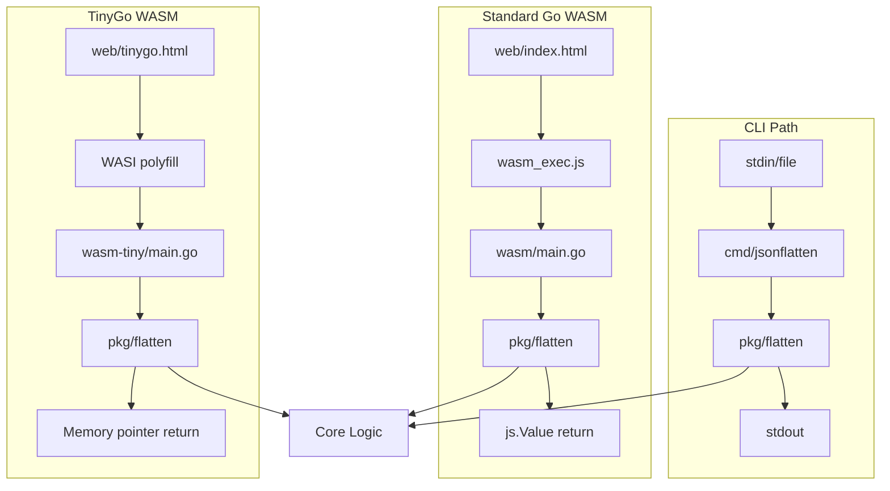

# WASM JSON Flattener

A Go-based tool that transforms nested JSON structures into flat key-value pairs using dot-notation keys. The project demonstrates Go's dual-target capability: the same core logic powers both a command-line utility for shell pipelines and a WebAssembly module that runs entirely in the browser via a self-contained HTML interface.

> [!summary]
> This project has two key identities:
> 1. A practical CLI tool for JSON data processing in shell scripts and pipelines
> 2. A proof-of-concept for Go-to-WASM compilation showing both standard Go (3.1MB) and TinyGo (171KB) targets with a 95% size reduction

## Why this project exists

The project was built to explore Go's WebAssembly compilation capabilities while creating a genuinely useful JSON utility. JSON flattening is a common data transformation task—converting nested structures into flat key-value pairs makes data easier to query, index, and process in systems that don't handle nested JSON well.

The dual-target architecture (CLI + WASM) demonstrates that Go can truly "write once, run anywhere"—the same `pkg/flatten` core logic runs on the command line, in a browser, and could potentially run on embedded systems via TinyGo.

## Current project status

The repository is feature-complete and stable. All planned functionality works:

**What exists:**
- Core `pkg/flatten` package with recursive flattening algorithm
- CLI binary with Unix-friendly flags (stdin/file input, configurable separator, prefix, depth limiting, bracket notation)
- WASM module (standard Go) with `syscall/js` bindings
- WASM module (TinyGo) with `//go:export` bindings and 95% smaller binary
- Self-contained web interface with two-pane UI and example loaders
- Comprehensive test suite (18 test cases, all passing)
- Makefile with targets for all build variants
- Full documentation in README

**Ticket tracking:**
- Ticket: WASM-JSON-001 in `remarquee/ttmp/`
- Design doc: `01-wasm-json-converter-design-and-implementation.md`
- Implementation diary: `reference/01-implementation-diary.md`

## Project shape

The project has three logical layers:

1. **Core flattening logic** (`pkg/flatten/`)
   - Pure Go, no platform dependencies
   - Configurable separator, prefix, max depth, bracket notation
   - Handles nested objects, arrays, and primitive types

2. **CLI wrapper** (`cmd/jsonflatten/`)
   - Flag parsing, stdin/file input, error handling
   - Unix-friendly: pipes, exit codes, help text with examples

3. **WASM bindings** (`wasm/`, `wasm-tiny/`)
   - Standard Go: `syscall/js` with automatic string conversion
   - TinyGo: `//go:export` with manual memory management
   - Both expose `flattenJSON()` and `flattenJSONPretty()` to JavaScript

## Architecture



**Key code locations:**

| Component | Path |
|-----------|------|
| Core flatten | `pkg/flatten/flatten.go` |
| Tests | `pkg/flatten/flatten_test.go` |
| CLI entry | `cmd/jsonflatten/main.go` |
| WASM (standard) | `wasm/main.go` |
| WASM (TinyGo) | `wasm-tiny/main.go` |
| Web UI | `web/index.html`, `web/tinygo.html` |
| Build automation | `Makefile` |

## Implementation details

### Flattening algorithm

The core algorithm uses recursive descent with a configuration struct:

```go
type Config struct {
    Separator            string  // default: "."
    Prefix               string  // prepend to all keys
    MaxDepth             int     // 0 = unlimited
    UseBracketsForArrays bool    // "items[0]" vs "items.0"
}
```

The recursive `flattenValue()` function handles four cases:
1. **Objects** (`map[string]any`): recurse with prefixed keys
2. **Arrays** (`[]any`): index each element, optionally with brackets
3. **Primitives**: store directly in output map
4. **Depth limit**: when `depth >= MaxDepth`, store entire value unflattened

```
Input:  {"user": {"name": "John", "items": ["a", "b"]}}
Output: {"user.name": "John", "user.items.0": "a", "user.items.1": "b"}
```

### Standard Go WASM interop

The standard Go WASM uses `syscall/js` which provides a high-level JavaScript bridge:

```go
func main() {
    js.Global().Set("flattenJSON", js.FuncOf(flattenJSONWrapper))
    select {} // Keep runtime alive
}

func flattenJSONWrapper(this js.Value, args []js.Value) any {
    input := args[0].String()  // Automatic string conversion
    result, err := flatten.FlattenJSON([]byte(input), cfg)
    // Return string directly - Go runtime handles conversion
    return string(result)
}
```

**Pros:** Simple API, automatic type conversion, familiar Go patterns  
**Cons:** Large binary (3.1MB), requires Go runtime in WASM

### TinyGo WASM interop

TinyGo uses a lower-level approach with direct memory access:

```go
//go:export flattenJSON
func flattenJSON(inputPtr *byte, inputLen int32) *byte {
    // Read input from WASM linear memory
    input := make([]byte, inputLen)
    for i := int32(0); i < inputLen; i++ {
        input[i] = *(*byte)(addUnsafe(inputPtr, i))
    }
    
    // Process...
    
    // Write output to global buffer, return pointer
    return &outputBuffer[0]
}
```

JavaScript side allocates WASM memory, writes input bytes, calls the exported function, then reads the result from the returned pointer:

```javascript
const encoder = new TextEncoder();
const inputBytes = encoder.encode(jsonInput);
const mem = new Uint8Array(wasmMemory.buffer);
mem.set(inputBytes, inputOffset);

const outputPtr = wasmModule.exports.flattenJSON(inputOffset, inputBytes.length);
const outputView = new Uint8Array(wasmMemory.buffer, outputPtr, maxLen);
const result = new TextDecoder().decode(outputView);
```

**Pros:** Tiny binary (171KB), suitable for web distribution  
**Cons:** Manual memory management, requires WASI polyfill, limited stdlib

### WASI polyfill

TinyGo still imports basic WASI functions even with `-target wasm-unknown`. The polyfill provides minimal implementations:

```javascript
const wasiPolyfill = {
    fd_write: (fd, iovs, iovsLen, nwritten) => {
        // Console output for debugging
        return 0;
    },
    fd_close: () => 0,
    proc_exit: (code) => { /* Handle exit */ }
};
```

This satisfies the imports without requiring a full WASI runtime.

## Build system

The Makefile supports multiple targets:

| Target | Output | Description |
|--------|--------|-------------|
| `make build` | `jsonflatten` | CLI binary |
| `make wasm` | `jsonflatten.wasm` | Standard Go WASM (3.1MB) |
| `make wasm-tiny` | `jsonflatten-tiny.wasm` | TinyGo WASM (171KB) |
| `make web` | WASM + `wasm_exec.js` | Full web build |
| `make web-tiny` | Tiny WASM | TinyGo web build |
| `make test` | - | Run all tests |
| `make demo` | - | CLI demo with sample JSON |

**Size comparison:**

```
Standard Go:  3,226,548 bytes (3.1 MB)
TinyGo:         174,816 bytes (171 KB)
Reduction:      3,051,732 bytes (94.6% smaller)
```

## Current user-facing commands

### CLI usage

```bash
# From stdin
echo '{"user":{"name":"John"}}' | ./jsonflatten
# Output: {"user.name":"John"}

# Pretty print
./jsonflatten -pretty sample.json

# Custom separator
./jsonflatten -separator="_" input.json

# With prefix
./jsonflatten -prefix="CONFIG" input.json

# Array brackets
./jsonflatten -brackets '{"items":["a","b"]}'
# Output: {"items[0]":"a","items[1]":"b"}
```

### Web interface

```bash
# Standard Go version
make web
python3 -m http.server 8888
# Open: http://localhost:8888/web/

# TinyGo version
make web-tiny
python3 -m http.server 8888
# Open: http://localhost:8888/web/tinygo.html
```

The web interface provides:
- Two-pane layout (input on left, output on right)
- Example loaders (Simple, Nested, With Array, Complex)
- Configurable options (separator, prefix, brackets, pretty print)
- Copy buttons for both panels
- Status messages (loading, success, error)

All processing happens client-side—no data leaves the browser.

## Testing

The test suite covers 18 cases including:
- Empty objects and primitives
- Simple and deeply nested objects
- Arrays with various element types
- Bracket notation vs dot notation
- Max depth limiting
- Custom separators and prefixes
- Invalid JSON error handling
- Number precision preservation (`UseNumber`)

Run tests:
```bash
cd jsonflatten
make test
make test-race
make bench
```

## Important project docs

Repository-local documentation:
- `/home/manuel/code/wesen/2026-04-14--wasm-transcript-conversation/jsonflatten/README.md` - Full project documentation
- `/home/manuel/code/wesen/2026-04-14--wasm-transcript-conversation/remarquee/ttmp/2026/04/14/WASM-JSON-001--wasm-json-converter-tool-in-go/design-doc/01-wasm-json-converter-design-and-implementation.md` - Design document
- `/home/manuel/code/wesen/2026-04-14--wasm-transcript-conversation/remarquee/ttmp/2026/04/14/WASM-JSON-001--wasm-json-converter-tool-in-go/reference/01-implementation-diary.md` - Step-by-step implementation diary

## Open questions

- Should the web UI options (separator, prefix, brackets) be wired to the WASM functions? Currently they are displayed but not connected.
- Would a streaming JSON processor be worth adding for very large files? Currently loads all into memory.
- Should we implement `Unflatten` for round-trip testing?
- Is there value in embedding the WASM as a base64 data URI for a true single-file HTML solution?
- How do performance characteristics compare between standard Go WASM and TinyGo WASM for large payloads?

## Near-term next steps

- Add drag-and-drop JSON file loading to web interface
- Add JSON validation indicators (green/red border on valid/invalid)
- Wire the web UI configuration options to the WASM functions
- Implement syntax highlighting for input/output panels
- Add benchmarks comparing standard Go vs TinyGo performance
- Create CI/CD pipeline with automated size regression tests

## Project working rule

> [!important]
> Always test both CLI and WASM paths after changes to `pkg/flatten`. The core logic is shared—regressions affect both targets.

## KB reviews

- [[KB-BATCH12-wasm-browser-runtime]] (2026-05-11) — Batch J analysis; reinforced [[On-Ramp/wasm-from-go]] and [[Tribal/go-to-wasm-compilation]].

## Related KB entries

- [[On-Ramp/wasm-from-go]] — direct example of one pure-Go core compiled to browser WASM.
- [[Tribal/go-to-wasm-compilation]] — standard Go vs TinyGo tradeoffs over the same utility kernel.

**Tribal candidates** (not yet written / needs review):
- Standard Go vs TinyGo comparison harness (3/3 across JSON Flattener, Goja WASM Web REPL, WASM Plugin REPL) — covered by existing WASM KB entries.
- Dual-target utility with shared pure-Go kernel (2/3) — same core serving CLI and browser targets.
- Minimal WASI polyfill for TinyGo browser target (1/3).

