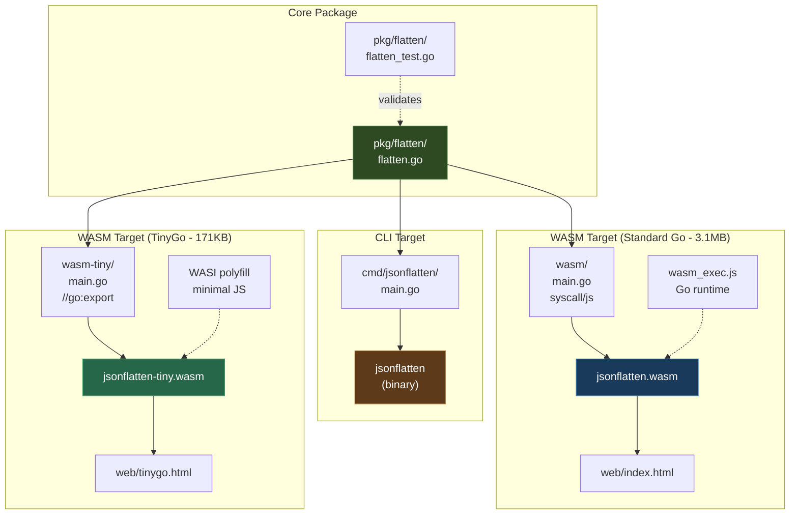

# Building a Dual-Target Go CLI and WASM JSON Tool with Reusable Core Package

This article documents the complete implementation of a Go-based JSON flattener tool that compiles to both a native CLI binary and WebAssembly for browser usage. The pattern demonstrates how to structure a Go project with a reusable core package that serves multiple frontend targets (CLI and WASM) while maintaining a single source of truth for the business logic.

The implementation includes: recursive JSON flattening with dot-notation keys, comprehensive test coverage, flag-based CLI configuration, `syscall/js` bridge for browser integration, and a self-contained HTML interface.

> [!summary]
> This note preserves the engineering patterns for building dual-target Go tools that work both as command-line utilities and browser-based WebAssembly modules. Key takeaways:
> 1. Separate core logic into a `pkg/` package for reuse across CLI and WASM targets
> 2. Use `GOOS=js GOARCH=wasm` cross-compilation for browser deployment (3.1MB)
> 3. The `syscall/js` bridge requires `select {}` to keep the Go runtime alive
> 4. WASM must be served via HTTP (CORS prevents `file://` loading)
> 5. **TinyGo alternative:** Use `//go:export` with `-target wasm-unknown` for 95% size reduction (171KB vs 3.1MB)

## Project Context and Goals

### Problem Statement

Working with deeply nested JSON structures is common in data processing, but inspecting and transforming these structures can be cumbersome. Existing tools like `jq` are powerful but have steep learning curves. We wanted:

1. A simple "flatten" operation that transforms `{"user": {"name": "John"}}` into `{"user.name": "John"}`
2. A tool that works both in shell pipelines (CLI) and interactively in a browser (WASM)
3. Zero runtime dependencies when deployed as WASM
4. Consistent behavior across both targets from a single codebase

### Why This Pattern Matters

This pattern demonstrates how to share Go code between native binaries and browsers without duplication. The same flattening algorithm, configuration options, and error handling work identically in both environments. This approach is valuable when:

- You have existing Go logic that you want to expose in a browser without rewriting
- You need both programmatic (CLI) and interactive (web) interfaces
- You want offline-capable browser tools without backend infrastructure
- Type safety and Go's standard library are preferable to JavaScript reimplementation

## Architecture Overview

### System Design



### Key Design Decisions

| Decision | Choice | Rationale |
|----------|--------|-----------|
| Core package location | `pkg/flatten/` | Standard Go layout, reusable by both targets |
| CLI entry point | `cmd/jsonflatten/` | Standard Go CLI convention |
| WASM entry point | `wasm/` (not `cmd/`) | Clear separation of concerns |
| Config passing | Struct pointer (`*Config`) | Nil-safe with defaults, extensible |
| JS bridge data format | JSON strings | Simple, type-safe, language-agnostic |
| Standard Go WASM | `syscall/js` | Familiar API, full stdlib support (~3.1MB) |
| TinyGo WASM | `//go:export` | Minimal size (~171KB), manual memory management |
| Depth limiting | `depth >= maxDepth` | Boundary condition tested and verified |

## Project Structure

```
jsonflatten/
├── go.mod                          # Module: jsonflatten
├── Makefile                        # Build automation (targets: build, wasm, web, test)
├── README.md                       # Usage documentation
│
├── pkg/flatten/                    # CORE LOGIC (reusable)
│   ├── flatten.go                  # 170 lines: algorithm + public API
│   └── flatten_test.go             # 330 lines: 18 comprehensive test cases
│
├── cmd/jsonflatten/                # CLI TARGET
│   └── main.go                     # 90 lines: flags, I/O, error handling
│
├── wasm/                           # WASM TARGET
│   └── main.go                     # 58 lines: syscall/js bindings
│
├── web/                            # BROWSER INTERFACE
│   └── index.html                  # 400 lines: HTML/CSS/JS UI
│
├── wasm_exec.js                    # Go WASM runtime (16KB, copied from GOROOT)
├── jsonflatten.wasm                # Compiled WASM module (3.2MB)
└── jsonflatten                     # Compiled CLI binary
```

## Implementation Details

### Phase 1: Core Flattening Algorithm

The core algorithm performs recursive depth-first traversal of JSON structures, producing dot-notation keys for nested objects and index notation for arrays.

**Key algorithm characteristics:**

```go
// Flatten transforms nested map to flat map using dot notation
func Flatten(input map[string]any, cfg *Config) (map[string]any, error)

// Key generation logic:
// - Objects: parentKey + separator + childKey
//   {"user": {"name": "John"}} → "user.name": "John"
// - Arrays: parentKey + separator + index
//   {"items": ["a", "b"]} → "items.0": "a", "items.1": "b"
// - Primitives: stored directly at computed key
```

**Depth limiting implementation:**

The depth check uses `>=` not `>` because we want to stop AT the max depth, not after exceeding it:

```go
func flattenValue(key string, value any, result map[string]any, cfg *Config, depth int) error {
    // Stop when we reach max depth (boundary condition)
    if cfg.MaxDepth > 0 && depth >= cfg.MaxDepth {
        result[key] = value  // Store remaining structure as-is
        return nil
    }
    // ... recurse into nested structures with depth+1
}
```

**Bug discovered during testing:** The initial implementation used `>` which allowed flattening at exactly `MaxDepth`. The test case `MaxDepth: 2` with 3-level nesting exposed this. Fix: change `depth > cfg.MaxDepth` to `depth >= cfg.MaxDepth`.

### Phase 2: CLI Implementation

The CLI uses Go's standard `flag` package with custom usage text:

```go
flag.Usage = func() {
    fmt.Fprintf(os.Stderr, "Usage: %s [options] [file]\n\n", os.Args[0])
    fmt.Fprintf(os.Stderr, "Examples:\n")
    fmt.Fprintf(os.Stderr, "  %s input.json                    # Flatten file\n", os.Args[0])
    fmt.Fprintf(os.Stderr, "  cat input.json | %s              # Flatten from stdin\n", os.Args[0])
    // ...
}
```

**I/O handling:** The `readInput()` function accepts either a filename or stdin:

```go
func readInput(filename string) ([]byte, error) {
    var reader io.Reader
    if filename == "" {
        reader = os.Stdin  // Pipe mode
    } else {
        file, err := os.Open(filename)
        // ... file mode
    }
    return io.ReadAll(reader)
}
```

**Exit codes:** Error conditions return exit code 1 (standard Unix convention):

```go
if err != nil {
    fmt.Fprintf(os.Stderr, "Error: %v\n", err)
    os.Exit(1)
}
```

### Phase 3: WASM Bridge Implementation

The WASM entry point uses `syscall/js` to register Go functions as JavaScript globals:

```go
func main() {
    js.Global().Set("flattenJSON", js.FuncOf(flattenJSONWrapper))
    js.Global().Set("flattenJSONPretty", js.FuncOf(flattenJSONPrettyWrapper))
    
    // CRITICAL: Block forever to keep Go runtime alive
    select {}
}
```

**Why `select {}` is required:** When Go's `main()` returns, the WASM runtime tears down and all exported functions become invalid. The program must block forever to maintain the JavaScript-to-Go bridge.

**Error handling in JS bridge:** Return JSON-encoded errors as strings:

```go
func flattenJSONWrapper(this js.Value, args []js.Value) any {
    if len(args) < 1 {
        return js.ValueOf(`{"error":"missing input: expected JSON string"}`)
    }
    
    result, err := flatten.FlattenJSON([]byte(args[0].String()), cfg)
    if err != nil {
        return js.ValueOf(`{"error":"` + err.Error() + `"}`)
    }
    return js.ValueOf(string(result))
}
```

**WASM compilation:**

```bash
GOOS=js GOARCH=wasm go build -o jsonflatten.wasm ./wasm
```

The resulting binary is ~3.2MB (Go runtime overhead). This is acceptable for local usage but large for web distribution. TinyGo can reduce this to ~100KB but with stdlib limitations.

### Phase 4: Browser Interface

The web UI is a single HTML file with embedded CSS and JavaScript:

```mermaid
flowchart LR
    subgraph "Web UI"
        A[Input textarea] --> B[Flatten Button]
        B --> C{WASM loaded?}
        C -->|Yes| D[Go flattenJSON()]
        C -->|No| E[Show loading spinner]
        D --> F[Output textarea]
    end

    subgraph "WASM"
        G[wasm_exec.js runtime]
        H[jsonflatten.wasm]
    end

    E --> I[Load WASM]
    I --> G
    I --> H
    H --> D
```

**Loading sequence:**

```javascript
const go = new Go();
const result = await WebAssembly.instantiateStreaming(
    fetch('jsonflatten.wasm'),
    go.importObject
);
go.run(result.instance);  // Never settles - blocks forever

// Poll for the global function that Go registers
while (!globalThis.flattenJSON) {
    await new Promise(r => setTimeout(r, 10));
}
```

**Critical constraint:** WASM modules cannot be loaded via `file://` protocol due to CORS. The HTML must be served via HTTP (even `localhost`).

## Testing Strategy

### Unit Tests (18 test cases)

The core package has comprehensive test coverage:

| Test Category | Cases |
|---------------|-------|
| Simple objects | `TestFlatten_SimpleObject` |
| Nested objects | `TestFlatten_NestedObject`, `TestFlatten_DeeplyNested` |
| Arrays | `TestFlatten_WithArray`, `TestFlatten_ArrayWithObjects` |
| Mixed types | `TestFlatten_MixedTypes` |
| Configuration | `TestFlatten_CustomSeparator`, `TestFlatten_WithPrefix`, `TestFlatten_MaxDepth`, `TestFlatten_BracketNotation` |
| Edge cases | `TestFlatten_EmptyObject`, `TestFlatten_EmptyArray` |
| API variants | `TestFlattenJSON`, `TestFlattenJSONPretty` |
| Error handling | `TestFlattenJSON_InvalidJSON` |

**Boundary condition test:** The `MaxDepth` test was crucial for catching the `>` vs `>=` bug:

```go
func TestFlatten_MaxDepth(t *testing.T) {
    input := map[string]any{
        "level1": map[string]any{
            "level2": map[string]any{
                "level3": "value",
            },
        },
    }
    cfg := &Config{Separator: ".", MaxDepth: 2}
    
    // Should stop at level 2, keeping level 3 as a nested map
    expected := map[string]any{
        "level1.level2": map[string]any{"level3": "value"},
    }
    // ...
}
```

### CLI Testing

Manual testing covered:
1. **Stdin pipeline:** `cat file.json | jsonflatten`
2. **File input:** `jsonflatten file.json`
3. **Flag combinations:** All flags tested individually and together
4. **Error handling:** Invalid JSON produces exit code 1
5. **Help text:** `-h` flag displays usage with examples

### Browser Testing

Playwright automated testing verified:
1. WASM module loads without errors
2. UI renders correctly with two-pane layout
3. Example JSON loaders populate input
4. Flatten button triggers Go function
5. Output displays correctly formatted JSON

**Test execution:**

```bash
# Start HTTP server
python3 -m http.server 8888

# Navigate and test
playwright open http://localhost:8888/web/
# Type JSON, click Flatten, verify output
```

## Build Automation

### Makefile Targets

```makefile
.PHONY: all build wasm web test clean

all: build wasm

build:                    # CLI binary
	go build -o jsonflatten ./cmd/jsonflatten

wasm:                     # WASM module
	GOOS=js GOARCH=wasm go build -o jsonflatten.wasm ./wasm

web: wasm                 # Web components
	cp "$(shell go env GOROOT)/misc/wasm/wasm_exec.js" .

test:
	go test -v ./...

clean:
	rm -f jsonflatten jsonflatten.wasm
```

### CI/CD Considerations

For automated builds, ensure:
1. Go version is consistent (WASM output varies by version)
2. `wasm_exec.js` is copied from the same Go version
3. WASM binary is included in release artifacts
4. Web assets are tested in headless browser

## Alternative: TinyGo for Smaller Binaries

While standard Go produces ~3.2MB WASM binaries, **TinyGo achieves 95% size reduction (~171KB)** with a different interop model.

### Size Comparison

```
Standard Go WASM:  3,226,548 bytes (3.1 MB)
TinyGo WASM:         174,816 bytes (171 KB)
─────────────────────────────────────────────
Size reduction:     3,051,732 bytes (94.6% smaller)
```

### Interop Model Differences

| Aspect | Standard Go | TinyGo |
|--------|-------------|--------|
| Export mechanism | `syscall/js` + `js.Global().Set()` | `//go:export` directive |
| Data passing | JavaScript values (`js.Value`) | Raw WASM memory pointers |
| Runtime size | Full Go runtime (~3MB) | Minimal runtime (~170KB) |
| Memory management | Garbage collected | Manual (or `-gc=leaking`) |
| Stdlib support | Complete | Limited |

### TinyGo Implementation

**Entry point (`wasm-tiny/main.go`):**

```go
//go:export flattenJSON
func flattenJSON(inputPtr *byte, inputLen int32) *byte {
    // Read from WASM linear memory
    input := make([]byte, inputLen)
    for i := int32(0); i < inputLen; i++ {
        input[i] = *(*byte)(addUnsafe(inputPtr, i))
    }
    
    // Process
    result, err := flatten.FlattenJSON(input, flatten.DefaultConfig())
    
    // Write to global buffer and return pointer
    // JavaScript will read from this pointer
    return &outputBuffer[0]
}
```

**Build command:**

```bash
tinygo build \
    -o jsonflatten-tiny.wasm \
    -target wasm-unknown \
    -gc=leaking \
    -no-debug \
    ./wasm-tiny/
```

**JavaScript interop:**

```javascript
// Write input to WASM memory
const encoder = new TextEncoder();
const inputBytes = encoder.encode(input);
const mem = new Uint8Array(wasmMemory.buffer);
mem.set(inputBytes, inputOffset);

// Call exported function
const outputPtr = wasmModule.exports.flattenJSON(inputOffset, inputBytes.length);

// Read output from WASM memory
const outputView = new Uint8Array(wasmMemory.buffer, outputPtr, maxLen);
// ... find null terminator, decode ...
```

### WASI Polyfill

TinyGo's `wasm-unknown` target still requires minimal WASI imports:

```javascript
const wasiPolyfill = {
    fd_write: (fd, iovs, iovsLen, nwritten) => {
        // Write to console for stdout/stderr
        const view = new DataView(wasmMemory.buffer);
        let total = 0;
        for (let i = 0; i < iovsLen; i++) {
            const ptr = view.getUint32(iovs + i * 8, true);
            const len = view.getUint32(iovs + i * 8 + 4, true);
            const bytes = new Uint8Array(wasmMemory.buffer, ptr, len);
            console.log(new TextDecoder().decode(bytes));
            total += len;
        }
        view.setUint32(nwritten, total, true);
        return 0;
    },
    fd_close: () => 0,
    proc_exit: (code) => { console.log('Exit', code); }
};

// Instantiate with WASI imports
const result = await WebAssembly.instantiate(bytes, {
    wasi_snapshot_preview1: wasiPolyfill
});
```

### When to Use TinyGo

**Use TinyGo when:**
- Binary size matters (public web apps, mobile networks)
- You accept manual memory management complexity
- Limited stdlib support is acceptable

**Use standard Go when:**
- You need full standard library compatibility
- You prefer the familiar `syscall/js` API
- 3MB overhead is acceptable (intranets, developer tools)

## Lessons Learned

### What Worked Well

1. **Package separation:** The `pkg/flatten/` core made both CLI and WASM trivial to implement
2. **Config struct pattern:** Nil-safe defaults with `DefaultConfig()` worked cleanly
3. **JSON string bridge:** Using JSON for JS↔Go communication was simple and type-safe
4. **Go standard library:** `encoding/json` and `syscall/js` provided everything needed

### What Was Tricky

1. **Depth limit boundary condition:** The `>` vs `>=` bug in `flattenValue()` required careful tracing and testing to catch
2. **Finding `wasm_exec.js`:** Different Go installations place it in different paths (`misc/wasm/`, `lib/wasm/`). The Makefile now tries multiple locations
3. **CORS and `file://` protocol:** WASM cannot load via filesystem URLs. This surprised initial testing attempts
4. **Go WASM size:** 3.2MB is larger than expected for simple functionality. TinyGo is an alternative but has different API constraints

### Anti-Patterns to Avoid

| Anti-Pattern | Why It's Wrong | Correct Approach |
|--------------|--------------|------------------|
| Duplicating logic in CLI and WASM | Creates inconsistency bugs | Single `pkg/` core shared by both |
| Using `js.Value` for complex data | Loses type safety, verbose | Marshal to JSON strings |
| Forgetting `select {}` in WASM | Runtime exits, functions die | Always block in `main()` |
| Not testing boundary conditions | Depth, empty arrays, nil | Explicit test cases |
| Hardcoding paths to `wasm_exec.js` | Installation-dependent | Try multiple common paths |

## Common Failure Modes

### "WASM loaded but functions return undefined"

**Cause:** `wasm_exec.js` version mismatch with compiled binary.
**Fix:** Always copy from `$(go env GOROOT)/misc/wasm/wasm_exec.js`.

### "Please enter some JSON to flatten" with visible text in textarea

**Cause:** HTML `placeholder` attribute looks like content but is not value.
**Fix:** Actually type or paste JSON, placeholder is just hint text.

### "CompileError: WebAssembly.instantiate()"

**Cause:** Server not serving `.wasm` with `Content-Type: application/wasm`.
**Fix:** Python's `http.server` handles this; custom servers need MIME type.

### "Go/Wasm bridge did not register in time"

**Cause:** `main()` panicked before registering globals.
**Fix:** Check browser console for Go panic messages.

## Future Extensions

### Implemented ✓

1. **TinyGo build:** Reduced 3.2MB → 171KB (95% smaller) using `//go:export` interop

### Potential Future Improvements

1. **Config passing to WASM:** Currently web UI shows options but uses defaults. Pass config struct to WASM.
2. **Unflatten operation:** Reverse the transformation for round-trip testing.
3. **Streaming JSON:** Process large files without loading all into memory.
4. **Syntax highlighting:** Add JSON validation indicators in web UI.
5. **Performance benchmarks:** Compare TinyGo vs standard Go WASM execution speed.

### Related Patterns

This pattern generalizes to any data transformation tool:

```
Input Parser → Core Transform → Output Formatter
                    ↑
              pkg/transform (reusable)
                    ↓
            CLI wrapper    WASM wrapper
```

Examples: CSV converter, format validator, protocol encoder, data anonymizer.

## Repository Reference

**Location:** `/home/manuel/code/wesen/2026-04-14--wasm-transcript-conversation/jsonflatten`

**Key files:**
- Core: `pkg/flatten/flatten.go` (170 lines)
- Tests: `pkg/flatten/flatten_test.go` (330 lines, 18 tests)
- CLI: `cmd/jsonflatten/main.go` (90 lines)
- WASM: `wasm/main.go` (58 lines)
- Web UI: `web/index.html` (400 lines)
- Build: `Makefile`
- Docs: `README.md`

**Ticket tracking:** `WASM-JSON-001` in docmgr with full implementation diary

**Commits:**
- `3b62134` - Phase 1: Core flatten package
- `d9433be` - Phase 2: CLI tool
- `6dfaea0` - Phase 3-4: WASM and web interface

## Conclusion

This implementation demonstrates a practical pattern for building dual-target Go tools. The separation of core logic into a reusable package enables consistent behavior across CLI and browser environments. The `syscall/js` bridge, while initially surprising in its requirements (`select {}`, polling for globals), provides a robust foundation for Go-in-browser applications.

The ~3.2MB WASM overhead is acceptable for developer tools and internal applications. For public web distribution, TinyGo offers a compelling size reduction at the cost of standard library compatibility.

The complete working implementation serves as both a functional JSON flattener and a reference architecture for future dual-target Go projects.
