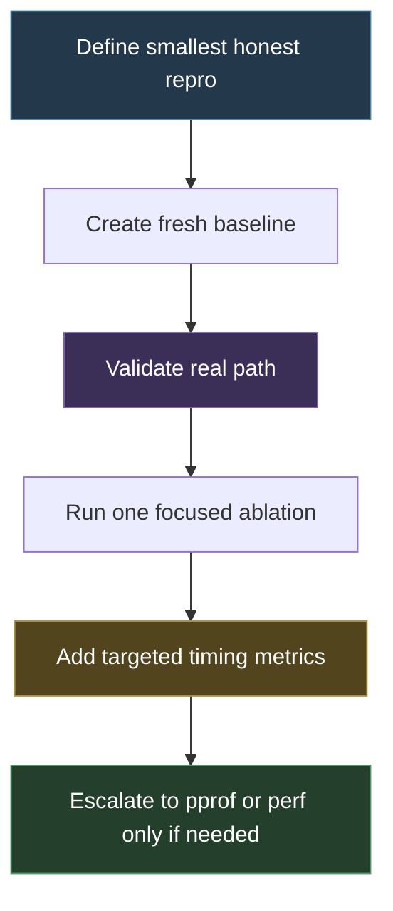

# Screencast Studio - Performance Investigation Approaches and Tricks

This note captures the practical playbook that emerged while investigating the Screencast Studio preview and recording performance issues. It is not just a summary of results. It is a summary of **how** the team got useful answers without getting lost too early in opaque profiler output.

The short version is that the investigation worked because it progressed from **small honest scenario comparisons**, to **focused ablations**, to **targeted timing metrics**, and only then to **lower-level profiling**. That sequence mattered more than any single tool.

> [!summary]
> 1. Start with the smallest honest repro and compare scenarios directly rather than theorizing abstractly.
> 2. Keep all experiments ticket-local, reproducible, and saved with raw artifacts plus a human-readable summary.
> 3. Distinguish fresh-server synthetic baselines from real browser-backed runs — that split revealed the browser-path gap.
> 4. Treat negative findings as progress. Ruling out MJPEG write cost, PreviewManager cost, and EventHub cost is what justified moving to pprof/perf.

## Why this note exists

There are now enough performance tickets, experiment families, and narrowing steps that the investigation method itself is worth preserving. A new investigator should not have to rediscover the same rules by trial and error.

This note exists to answer questions like:

- Which investigation moves were actually high-signal?
- Which kinds of results turned out to be misleading when interpreted carelessly?
- When should app-level metrics stop and lower-level profilers begin?

## When to use this pattern

Use this investigation pattern when:

- the system spans Go, CGO, GStreamer, and browser/UI layers
- you have a user-visible performance complaint but do not yet know which layer owns it
- you need a continuation-friendly record that someone else can pick up later

Do not jump straight to low-level profilers when:

- the repro itself is still vague
- you have not yet separated synthetic baselines from real-path runs
- you are still mixing multiple hypotheses together in one experiment

## Core mental model

The investigation worked best as a staircase:



The important lesson is that **lower-level tooling becomes useful only after higher-level narrowing has done its job**.

## The approaches that worked best

### 1. Start with the smallest honest question

The earliest useful questions were simple:

- what does recorder-only cost?
- what does preview-only cost?
- what happens when preview and recorder share the same source?
- does a plain MJPEG client materially change server CPU?
- does a real browser tab behave differently from a plain client?

Those small comparisons produced more clarity than any early profiler would have.

### 2. Keep experiments reproducible and ticket-local

The recurring winning structure was:

- `scripts/NN-something/run.sh`
- `scripts/NN-something/results/YYYYMMDD-HHMMSS/`
- raw artifacts: `pidstat`, `.prom`, JSON snapshots, ffprobe, stdout/stderr
- summary artifact: `01-summary.md`

That pattern prevented memory drift and made later reinterpretation possible.

### 3. Separate fresh-server baselines from real browser-backed runs

This was one of the most important methodological choices.

The investigation explicitly separated:

- fresh dedicated-server MJPEG baseline runs
- real Studio-page browser runs against the live `:7777` app

That separation revealed the key SCS-0015 finding: plain MJPEG fan-out alone did not explain the much hotter browser-connected recording path.

### 4. Do not trust averages alone

Averages are helpful, but only after checking what the sample window actually contained.

A browser run that includes preview-only warmup before the recording phase fully ramps may still be valuable, but it is not directly comparable to a tightly aligned hot-window recording sample.

The practical rule became:

- always read the per-second trace
- always interpret the scenario window honestly

### 5. Use one A/B at a time

The most valuable narrowing experiments were focused ablations.

Examples:

- one MJPEG client only
- one MJPEG client plus one synthetic websocket consumer

That kind of A/B told the team that websocket fanout was real but too small by itself to explain the full browser-path spike.

### 6. Add timing metrics only after a suspect survives coarse measurement

The project did **not** add timing metrics everywhere at once.

Instead, it added timing counters in layers:

1. final MJPEG write/flush timing
2. PreviewManager store/copy/publication timing
3. EventHub publish timing

That made every new metric slice easy to interpret and prevented the metrics from turning into noise.

### 7. Treat disproven hypotheses as progress

Several of the most useful outcomes were negative findings:

- final MJPEG write/flush is too cheap to explain the hot phase
- PreviewManager frame-store/copy is too cheap
- EventHub `preview.state` publish is too cheap
- synthetic websocket fanout alone is too cheap

Those are not failures. They are exactly what made it rational to start SCS-0016 and move into pprof/perf territory.

## Practical tricks that saved time

### Save raw artifacts, not just conclusions

Later interpretation often depended on raw `.prom`, `pidstat`, or ffprobe outputs.

### Keep labels low-cardinality in metrics

This made the metrics easy to compare across many short experiments.

### Reuse the same high-signal repro repeatedly

The most valuable recurring scenario became:

```text
desktop preview + recording + one real browser tab
```

Using the same repro repeatedly made it much easier to compare new slices against earlier findings.

### Be explicit about comparability

The investigation consistently distinguished between:

- standalone runtime harnesses
- fresh dedicated-server synthetic baselines
- real browser-backed runs

That prevented a lot of false confidence.

## Common failure modes

### Interpreting a synthetic client as a browser substitute

A synthetic MJPEG or websocket client is excellent for narrow ablations. It is not a complete browser model.

### Relying only on average CPU

You can hide the real hot phase if the sample window includes warmup or mixed phases.

### Adding more app-level metrics after app-level timing is already too small

Once the obvious upper layers are ruled out, continuing to add only application counters can waste time. That is the point where pprof/perf starts making sense.

## Recommended implementation sequence

If I had to reproduce this playbook from scratch, I would do it in this order:

1. define the smallest honest repro
2. create a fresh synthetic baseline
3. validate the real path
4. run one focused ablation per hypothesis
5. add only the timing metrics needed to test the surviving suspect
6. move to lower-level profilers only after upper-layer costs look too small

## Working rules

- never broaden scenarios when one high-signal repro is already enough
- never headline an average before checking the actual sample window
- save every meaningful run under a ticket-local `scripts/results/` directory
- if a hypothesis is disproven, document that as a narrowing win
- if timing metrics are tiny, escalate down the stack instead of inventing more app-level explanations

## Important source docs

The ticket-local source documents for this note are:

- `/home/manuel/code/wesen/2026-04-09--screencast-studio/ttmp/2026/04/14/SCS-0016--investigate-low-level-performance-hot-path-with-pprof-perf-and-ebpf/reference/02-performance-investigation-approaches-and-tricks-report.md`
- `/home/manuel/code/wesen/2026-04-09--screencast-studio/ttmp/2026/04/14/SCS-0015--investigate-browser-preview-streaming-pipeline-and-web-ui-performance-matrix/reference/02-browser-preview-streaming-lab-report.md`

## Related notes

- [[ARTICLE - Screencast Studio - Prometheus Metrics Architecture and Field Guide]]
- [[Research Brief - Preview and Recording Performance Investigation Handoff]]
