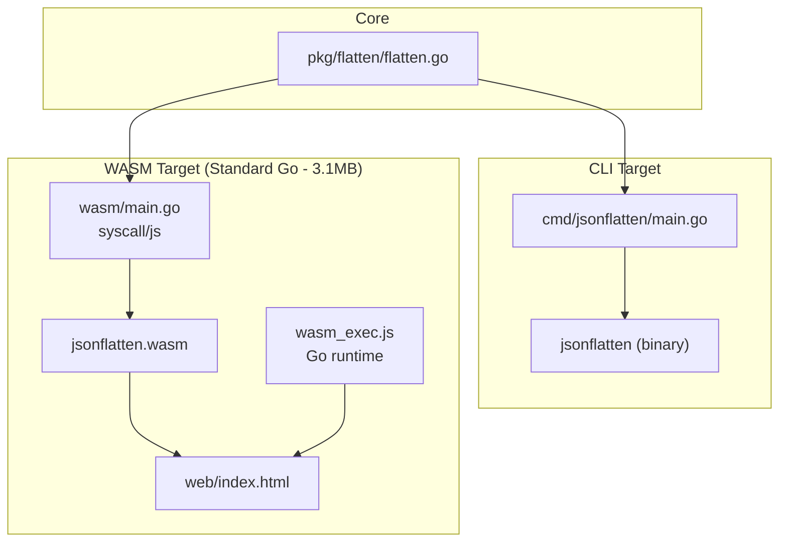
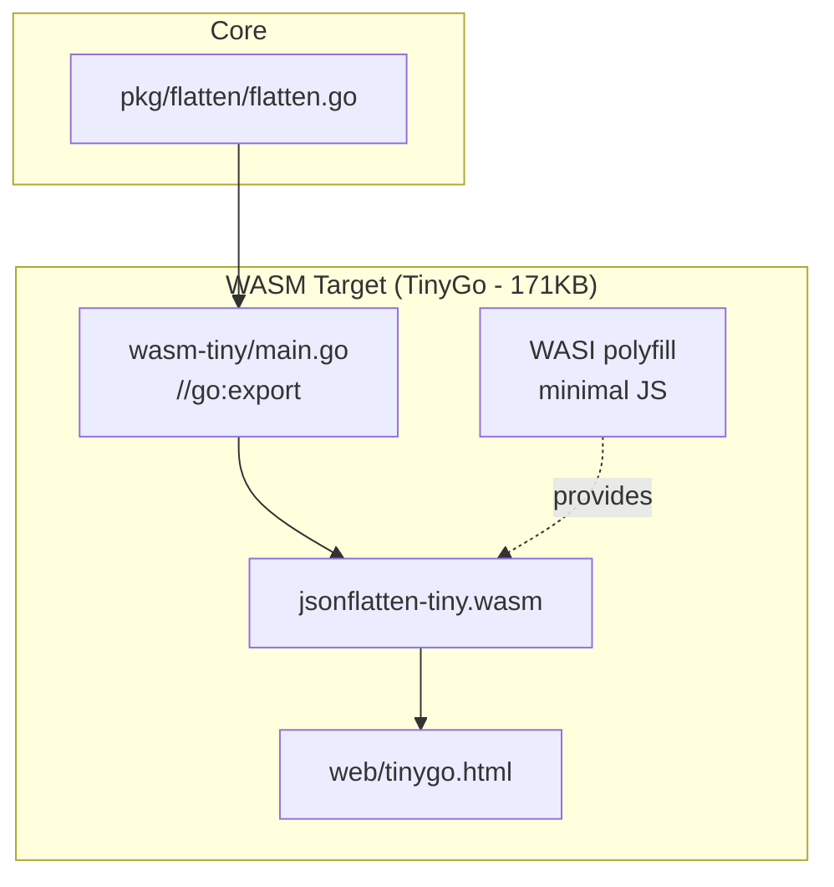

# JSON Flattener - Go WASM JSON Conversion Tool

A Go-based tool that converts nested JSON structures to flat dot-notation key-value pairs. Runs as both a CLI utility and a WebAssembly-powered browser application.

> [!summary]
> **Status:** Completed (with TinyGo optimization)
> **Date:** 2026-04-15
> **Ticket:** WASM-JSON-001
> **Location:** `/home/manuel/code/wesen/2026-04-14--wasm-transcript-conversation/jsonflatten`
> **Key achievement:** Single Go codebase compiles to both native binary (CLI) and browser-compatible WASM with shared core logic
> **Bonus:** TinyGo WASM variant achieves 95% size reduction (3.1MB → 171KB)

## Why this project exists

To demonstrate and document the pattern of building dual-target Go tools that work both as command-line utilities and browser-based WebAssembly modules. The JSON flattener serves as a practical, self-contained example that:

1. Transforms nested JSON (e.g., `{"user": {"name": "John"}}` → `{"user.name": "John"}`)
2. Runs identically in shell pipelines (CLI) and web browsers (WASM)
3. Maintains a single source of truth for the core algorithm
4. Provides immediate practical value for JSON data inspection

## Current project status

**Phase 1: Core Library** ✅ Complete
- Recursive flattening algorithm with dot-notation keys
- Support for nested objects, arrays, and mixed types
- Configurable separator, prefix, max depth, bracket notation
- 18 comprehensive unit tests (all passing)

**Phase 2: CLI Tool** ✅ Complete
- Flag-based configuration (`-separator`, `-prefix`, `-pretty`, `-brackets`, `-max-depth`)
- Stdin and file input support
- Proper error handling with exit codes
- Help text with usage examples

**Phase 3: WASM Target (Standard Go)** ✅ Complete
- `syscall/js` bridge implementation
- Two exported functions: `flattenJSON()` and `flattenJSONPretty()`
- ~3.2MB compiled WASM binary
- Go WASM runtime (`wasm_exec.js`) copied and integrated

**Phase 4: Web Interface (Standard Go)** ✅ Complete
- Self-contained HTML/CSS/JS browser UI
- Two-pane layout (input/output)
- Example loaders (Simple, Nested, With Array, Complex)
- Status messages and copy functionality
- Tested with Playwright in real browser

**Phase 5: TinyGo WASM (Bonus)** ✅ Complete
- TinyGo 0.40.1 installed and tested
- Created `wasm-tiny/main.go` with `//go:export` interop
- Achieved 95% size reduction: 3.1MB → 171KB
- Created `web/tinygo.html` with WASI polyfill
- Updated Makefile and README with TinyGo targets

**Build Automation** ✅ Complete
- Makefile with `build`, `wasm`, `wasm-tiny`, `web`, `web-tiny`, `test`, `clean` targets
- README with installation, usage, and TinyGo comparison

## Project shape

```
jsonflatten/
├── pkg/flatten/              # CORE: 170 lines algorithm + 330 lines tests
│   ├── flatten.go            # Flatten(), FlattenJSON(), Config struct
│   └── flatten_test.go       # 18 test cases covering all scenarios
├── cmd/jsonflatten/          # CLI: 90 lines
│   └── main.go               # Flag parsing, I/O, error handling
├── wasm/                     # WASM (Standard Go): 58 lines
│   └── main.go               # syscall/js bindings
├── wasm-tiny/                # WASM (TinyGo): 45 lines
│   └── main.go               # //go:export bindings
├── web/                      # UI (Standard Go): 400 lines
│   ├── index.html            # Browser interface
│   └── tinygo.html           # TinyGo interface with WASI polyfill
├── Makefile                  # Build automation (standard + TinyGo)
├── README.md                 # Documentation with size comparison
├── go.mod                    # Module definition
├── jsonflatten               # Compiled CLI binary
├── jsonflatten.wasm          # Compiled WASM - Standard Go (~3.2MB)
├── jsonflatten-tiny.wasm     # Compiled WASM - TinyGo (~171KB)
└── wasm_exec.js              # Go runtime (16KB)
```

## Architecture

### Standard Go WASM



### TinyGo WASM (95% Smaller)



## Implementation highlights

### WASM Compiler Comparison

| Aspect | Standard Go | TinyGo |
|--------|-------------|--------|
| **Binary size** | ~3.1 MB | ~171 KB (95% smaller) |
| **Interop model** | `syscall/js` with `js.Value` | `//go:export` with raw pointers |
| **Data passing** | JavaScript values | WASM linear memory |
| **Runtime** | Full Go runtime (~3MB) | Minimal runtime (~170KB) |
| **Stdlib support** | Complete | Limited |
| **Build command** | `GOOS=js GOARCH=wasm go build` | `tinygo build -target wasm-unknown` |
| **Best for** | Full compatibility, familiar API | Size-constrained deployments |

### Core algorithm

Recursive depth-first traversal with boundary-aware depth limiting:

```go
func flattenValue(key string, value any, result map[string]any, cfg *Config, depth int) error {
    // Stop at max depth (not after)
    if cfg.MaxDepth > 0 && depth >= cfg.MaxDepth {
        result[key] = value
        return nil
    }
    
    switch v := value.(type) {
    case map[string]any:
        for nestedKey, nestedValue := range v {
            newKey := key + cfg.Separator + nestedKey
            flattenValue(newKey, nestedValue, result, cfg, depth+1)
        }
    case []any:
        for i, item := range v {
            indexKey := key + cfg.Separator + strconv.Itoa(i)
            flattenValue(indexKey, item, result, cfg, depth+1)
        }
    default:
        result[key] = v  // primitive
    }
    return nil
}
```

**Critical bug found during testing:** Initial implementation used `depth > cfg.MaxDepth` which allowed flattening at exactly the max depth. Changed to `depth >= cfg.MaxDepth` to correctly stop AT the boundary.

### WASM bridge

```go
func main() {
    js.Global().Set("flattenJSON", js.FuncOf(flattenJSONWrapper))
    js.Global().Set("flattenJSONPretty", js.FuncOf(flattenJSONPrettyWrapper))
    select {}  // Keep runtime alive
}
```

The `select {}` is not optional - without it, the Go runtime exits and exported functions become invalid.

### Browser integration

```javascript
const go = new Go();
const result = await WebAssembly.instantiateStreaming(
    fetch('jsonflatten.wasm'),
    go.importObject
);
go.run(result.instance);  // Never returns

// Poll for the global that Go registers
while (!globalThis.flattenJSON) {
    await new Promise(r => setTimeout(r, 10));
}
```

## User-facing commands

### CLI usage

```bash
# From stdin
echo '{"user":{"name":"John"}}' | jsonflatten

# From file
jsonflatten input.json

# Pretty print
jsonflatten -pretty input.json

# Custom options
jsonflatten -separator="_" -prefix="CONFIG" -brackets data.json
```

### Web usage

```bash
# Serve the web interface
python3 -m http.server 8888
# Open: http://localhost:8888/web/
```

Paste JSON in left pane, click "Flatten JSON", copy result from right pane.

## Test results

**Unit tests:** 18/18 passing
```
PASS: TestFlatten_SimpleObject
PASS: TestFlatten_NestedObject
PASS: TestFlatten_WithArray
PASS: TestFlatten_ArrayWithObjects
PASS: TestFlatten_MixedTypes
PASS: TestFlatten_CustomSeparator
PASS: TestFlatten_WithPrefix
PASS: TestFlatten_WithPrefixAndNested
PASS: TestFlatten_MaxDepth
PASS: TestFlatten_BracketNotation
PASS: TestFlatten_EmptyObject
PASS: TestFlatten_EmptyArray
PASS: TestFlattenJSON
PASS: TestFlattenJSON_InvalidJSON
PASS: TestFlattenJSONPretty
PASS: TestFlatten_NilConfig
PASS: TestFlatten_DeeplyNested
PASS: TestFlatten_NestedArray
```

**Browser testing:** Verified working with Playwright - WASM loads, flattens correctly, UI responsive.

## Important project docs

- **Detailed implementation article:** [[ARTICLE - Building a Dual-Target Go CLI and WASM JSON Tool with Reusable Core Package]]
- **Ticket diary:** `WASM-JSON-001` in docmgr at `/home/manuel/code/wesen/2026-04-14--wasm-transcript-conversation/remarquee/ttmp/2026/04/14/WASM-JSON-001--wasm-json-converter-tool-in-go/`
- **Design document:** `design-doc/01-wasm-json-converter-design-and-implementation.md`

## Size Comparison

```
Standard Go WASM:  3,226,548 bytes (3.1 MB)
TinyGo WASM:         174,816 bytes (171 KB)
─────────────────────────────────────────────
Size reduction:     3,051,732 bytes (94.6% smaller)
```

### Why TinyGo matters

The 95% size reduction makes web deployment practical:
- **Standard Go (3.1MB):** Acceptable for developer tools, intranets, local usage
- **TinyGo (171KB):** Suitable for public web apps, mobile networks, embedded systems

Tradeoff: TinyGo requires manual memory management via `//go:export` and has limited stdlib support.

## Open questions

1. Should we add `Unflatten()` reverse operation for round-trip testing?
2. Should the web UI options (separator, prefix, brackets) connect to WASM via config passing?
3. Should we implement proper malloc/free in TinyGo version for dynamic memory?

## Near-term next steps

None - project is feature-complete as a reference implementation. Potential enhancements:
- Config passing from JavaScript to Go WASM (both standard and TinyGo)
- Syntax highlighting in web UI
- Drag-and-drop JSON file loading
- Performance benchmarks (TinyGo vs standard Go)

## Project working rule

This project demonstrates a reusable pattern: separate core logic in `pkg/`, wrap in `cmd/` for CLI, wrap in `wasm/` for browser. The single-source-of-truth approach ensures consistent behavior across targets while minimizing code duplication.

For future dual-target Go tools, copy this structure:
1. Implement core in `pkg/<feature>/`
2. Test thoroughly at package level
3. Wrap CLI in `cmd/<tool>/`
4. Wrap WASM in `wasm/` with `syscall/js`
5. Build with `GOOS=js GOARCH=wasm go build`
6. Serve via HTTP (not `file://`)

## KB reviews

- [[KB-BATCH12-wasm-browser-runtime]] (2026-05-11) — Batch J analysis; second report variant reinforcing the JSON Flattener Go→WASM pattern.

## Related KB entries

- [[On-Ramp/wasm-from-go]] — browser WASM target over a shared Go core.
- [[Tribal/go-to-wasm-compilation]] — TinyGo vs standard Go tradeoff example.

**Tribal candidates** (not yet written / needs review):
- Reinforces standard Go vs TinyGo comparison harness (covered by existing WASM KB entries).
- Reinforces dual-target utility with shared pure-Go kernel.

