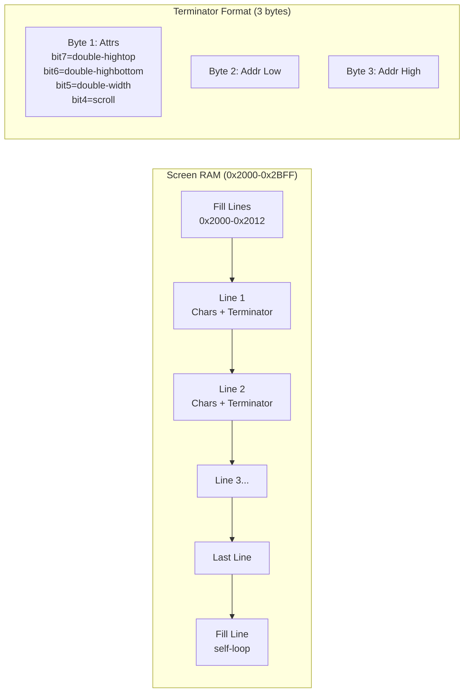

# VT100 WASM Emulator

A WebAssembly-based emulator for the DEC VT100 terminal that runs original 8080 firmware in the browser. Unlike protocol-level terminal emulators, this project simulates the actual VT100 hardware—the Intel 8080 CPU, custom video processor with DMA, keyboard UART, and the full 8KB ROM firmware.

> [!summary]
> This project has two main goals:
> 1. Preserve and make accessible the VT100's hardware architecture through accurate emulation
> 2. Create a reusable pattern for vintage computing emulation in Rust/WebAssembly

## Why this project exists

The VT100 is one of the most influential terminals in computing history—it established ANSI escape sequences as a standard and introduced features like smooth scrolling, 80/132 column modes, and programmable function keys. Most "VT100 emulators" today only implement the escape sequence protocol. This project goes deeper: it runs the actual 1978 DEC firmware by simulating the underlying hardware.

The project also serves as a concrete study in:
- Intel 8080 CPU emulation (registers, flags, interrupt handling)
- Custom video processor architecture with DMA-based line buffers
- Linked-list screen memory organization
- Non-volatile RAM (ER1400 shift register) simulation
- Bridging Rust/WASM to JavaScript for interactive web UI

## Current project status

The repository is in early implementation phase. Core components exist but are not yet integrated into a working web UI.

### What exists today

| Component | File | Status | Notes |
|-----------|------|--------|-------|
| 8080 CPU emulator | `src/cpu8080.rs` | Functional | Complete instruction set, flags, register pairs, interrupts |
| VT100 system | `src/vt100.rs` | Partial | Memory map, screen state, keyboard/serial I/O |
| Build system | `Cargo.toml` | Ready | wasm-bindgen, web-sys dependencies configured |
| Character generator | (planned) | Not started | Needs 23-018E2 ROM or reconstructed glyph data |
| Web UI | (planned) | Not started | Canvas-based display, keyboard capture, debugger |

### Key implemented details

**8080 CPU (`cpu8080.rs`)**:
- All 78 instructions with correct cycle counts
- Register pairs (BC, DE, HL) and accumulator/flags
- Stack pointer and program counter management
- RST interrupt vectors (0x00, 0x08, 0x20, 0x28, 0x30)
- Parity flag calculation for all relevant operations
- I/O port read/write abstraction

**VT100 System (`vt100.rs`)**:
- Memory map: 8KB ROM (0x0000-0x1FFF), 3KB RAM (0x2000-0x2BFF)
- ROM loading from 4x 2KB chips (E56, E52, E45, E40) or combined 8KB image
- Screen state tracking for 80-column and 132-column modes
- Keyboard buffer with interrupt generation (RST 6)
- Serial port buffer with interrupt generation (RST 5)
- I/O port mapping matching VT100 hardware

### What is still incomplete

- WebAssembly bindings and JavaScript glue code
- HTML5 Canvas renderer for the CRT display
- Character generator ROM integration
- Web-based debugger (disassembly, register view, memory dump)
- Original VT100 ROM loading (needs `23-061E2.bin`, `23-032E2.bin`, `23-033E2.bin`, `23-034E2.bin`)
- Screen RAM linked-list parsing for accurate line structure
- Smooth scroll simulation via DC011/DC012 register emulation
- NVR (ER1400) simulation for SET-UP parameter persistence

## Project shape

The emulator has three layers:

1. **CPU emulation layer**
   - Instruction decode and execute
   - Memory and I/O access
   - Interrupt handling (RST vectors)

2. **System integration layer**
   - Memory map (ROM + RAM)
   - Video processor state (line buffers, attributes)
   - Keyboard and serial I/O
   - I/O port decoding

3. **Web interface layer** (planned)
   - Canvas-based CRT simulation
   - Keyboard event capture
   - Debugger UI
   - Serial port connection to host (WebSocket/Worker)

## Architecture

### Data flow

```mermaid
flowchart TD
    subgraph "Web UI"
        A[Keyboard Events] --> B[JS Glue Layer]
        C[Canvas Display] <-- D[Frame Buffer]
        E[Debugger UI] <-- F[State Query]
    end

    subgraph "WASM Core"
        B --> G[VT100 System]
        G --> H[8080 CPU]
        G --> I[Memory: ROM+RAM]
        G --> J[I/O Ports]
        J --> K[Keyboard Buffer]
        J --> L[Serial Buffer]
        J --> M[Video Registers]
        G --> D
        F --> H
    end

    subgraph "Original Hardware"
        N[DEC ROM Firmware] --> I
        O[Character Generator] -.-> G
    end

    style A fill:#e1f5e1
    style C fill:#e1f5e1
    style E fill:#e1f5e1
    style N fill:#fff2cc
```

### Memory organization

The VT100 uses a unique linked-list screen memory format:



Each line ends with a 3-byte terminator containing:
- Line attributes (double-width, double-height top/bottom, scroll flag)
- 16-bit pointer to next line's starting address

This allows the VT100 to:
- Implement smooth scrolling by changing line pointers
- Support double-width/height characters
- Create split-screen scrolling regions
- Reorder lines without moving character data

### Key code locations

```
vt100-wasm-emulator/
├── Cargo.toml              # Rust/WASM build configuration
├── src/
│   ├── lib.rs             # WASM exports, module glue
│   ├── cpu8080.rs         # Complete 8080 CPU emulation
│   ├── vt100.rs           # VT100 system integration
│   └── charset.rs         # (planned) Character generator
└── www/                   # (planned) Web UI
    ├── index.html
    ├── vt100.js           # JS/WASM interface
    └── display.js         # Canvas renderer
```

## Implementation details

### 8080 CPU emulation

The CPU is implemented as a cycle-accurate interpreter:

```rust
pub struct Cpu8080 {
    pub regs: Registers,          // A, B, C, D, E, H, L, flags, SP, PC
    pub halted: bool,
    pub interrupts_enabled: bool,
    pub interrupt_pending: Option<u8>,
    pub cycles: u64,
}
```

Key design decisions:
- **Flag handling**: The 8080 has five flags (Sign, Zero, Aux Carry, Parity, Carry). Parity is calculated as even parity across all 8 bits—this is non-obvious and often emulated incorrectly.
- **Interrupt system**: The VT100 uses RST vectors at 0x00 (reset), 0x08 (keyboard), 0x20 (vertical blank), 0x28 (serial), and 0x30 (auxiliary). Interrupts are disabled on entry and must be re-enabled by the handler.
- **I/O abstraction**: Memory-mapped I/O lets the CPU read/write ports abstractly, making the core reusable for other 8080 systems.

### VT100 memory map

```rust
const ROM_SIZE: usize = 8192;     // 0x0000-0x1FFF
const RAM_SIZE: usize = 3072;     // 0x2000-0x2BFF

// ROM chip layout (4x 2KB mask ROMs)
// E56: 0x0000-0x07FF  (23-061E2)
// E52: 0x0800-0x0FFF  (23-032E2)
// E45: 0x1000-0x17FF  (23-033E2)
// E40: 0x1800-0x1FFF  (23-034E2)
```

The RAM region contains:
- **0x2000-0x2012**: Fill lines (vertical blanking synchronization)
- **0x2012-0x204E**: Stack area (grows down from 0x204E)
- **0x204F-0x22D0**: Scratch pad (variables, SET-UP area, answerback)
- **0x22D0-0x2C00**: Screen RAM (linked-list character buffer)

### Video processor simulation

The VT100 video processor is unusual—it doesn't use a linear framebuffer. Instead:

1. **DMA-based line fetching**: During horizontal retrace, the VP DMAs one complete line from RAM into an internal line buffer
2. **Character generator lookup**: Each character code + scan line number addresses the 2KB character ROM
3. **Linked lines**: After displaying a line, the VP reads a 3-byte terminator to find the next line's address
4. **Attributes**: The terminator includes line-level attributes (double-width, double-height, scroll region)

For the emulator, we approximate this by:
- Parsing the linked list each frame
- Rendering characters to a grid-based buffer
- Supporting both 80-column (10x10 cell) and 132-column (9x10 cell) modes

### I/O port mapping

The VT100 uses port-mapped I/O with these key addresses:

| Port | R/W | Function |
|------|-----|----------|
| 0x00 | RW | PUSART data |
| 0x01 | RW | PUSART command |
| 0x42 | R | Flags buffer (keyboard ready, NVR clock, etc.) |
| 0x42 | W | Brightness D/A |
| 0x82 | R | Keyboard UART data |
| 0xA2 | W | Video DC012 (attributes) |
| 0xC2 | W | Video DC011 (timing: 80/132 col, 50/60Hz) |

The `IoPorts` struct tracks these states and is read/written by CPU instructions.

## Important project docs

- `/home/manuel/code/wesen/2026-04-15--8080-rom/VT100-Intern-Textbook.md` - Comprehensive technical reference created during research
- `/home/manuel/code/wesen/2026-04-15--8080-rom/vt100-wasm-emulator/src/cpu8080.rs` - 8080 implementation
- `/home/manuel/code/wesen/2026-04-15--8080-rom/vt100-wasm-emulator/src/vt100.rs` - System integration
- [VT100 Technical Manual (Jul 1982)](http://www.vt100.net/docs/vt100-tm/ek-vt100-tm-003.pdf) - DEC's official documentation
- [vt100.net](https://vt100.net) - Richard Shuford's VT100 resource collection
- [Annotated VT100 Firmware](https://vt100.net/dec/vt100/rom/) - Fully commented disassembly

## Open questions

- Should the emulator include a debugger UI (step, breakpoints, register view) or focus on faithful terminal reproduction?
- How should the character generator be handled—require original ROM dump or include reconstructed glyphs?
- What's the best approach for smooth scroll visualization—CSS animations or Canvas-based CRT simulation?
- Should the web UI support direct serial connection to a host, or only local/loopback mode?
- How complete should the SET-UP mode simulation be—all parameters or just the commonly used ones?

## Near-term next steps

1. Create minimal web UI with Canvas display and keyboard input
2. Add WebAssembly build target and JavaScript glue layer
3. Load and run original VT100 ROM (once ROM files are obtained)
4. Implement character generator from ROM or reconstructed data
5. Add visual feedback: cursor blinking, LED indicators (L1-L4, CAPS)
6. Create debugger interface for stepping through 8080 code

## Project working rule

> [!important]
> Preserve historical accuracy where possible, but prioritize making the emulator runnable and understandable. When accuracy and clarity conflict, add documentation explaining the simplification.

The firmware should eventually run unmodified—that's the proof that the hardware emulation is correct. But the web UI can be modern and approachable, not a literal recreation of the physical terminal's styling unless that serves educational purposes.
