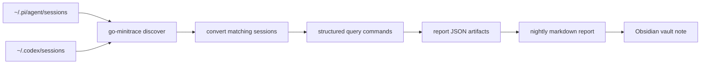

# Nightly Transcript Review - 2026-04-16

> [!warning] Deprecated command examples — rewritten below
> This note's query bundle invokes `go-minitrace query duckdb` and references the DuckDB static-link build conflict. The DuckDB backend has been removed entirely, which also resolves the build conflict described here. Run the nightly query bundle with `go-minitrace query run` instead. The nightly-review methodology (convert, run a query catalog, synthesize a report) is unchanged. Full deprecation map and migration table: [[ARTICLE - go-minitrace Query Engine Migration - DuckDB to Normalized SQLite]].
>
> ```bash
> # was: go-minitrace query duckdb --archive-glob ... --sql-file scripts/01-tool-frequency.sql
> go-minitrace query run \
>   --archive-glob '<glob-pattern>/*.minitrace.json' \
>   --sql-file scripts/01-tool-frequency.sql
> ```
>
> The tool-frequency SQL migrates from `UNNEST(tool_calls)` to a join on the `tool_calls` table:
>
> ```sql
> -- was: FROM sessions_base, UNNEST(tool_calls) AS t(tc)
> --      SELECT json_extract(tc, '$.tool_name') AS tool_name, COUNT(*) AS calls
> SELECT tc.tool_name, COUNT(*) AS calls
> FROM tool_calls tc
> JOIN sessions s USING (session_id)
> GROUP BY tc.tool_name
> ORDER BY calls DESC;
> ```

This note is a manager-style technical report for the work captured across the previous day’s Pi and Codex sessions. It is based on the nightly minitrace analysis bundle, the generated markdown report, and the ticket docs that were built around the review workflow.

> [!summary]
> - The day was dominated by two large technical workstreams: a long `crib-k3s` homelab session and a deep `go-minitrace` analysis / bug-fix session.
> - The most concrete engineering progress came from fixing Pi transcript fidelity, tightening schema and documentation gaps, and validating the nightly review pipeline.
> - The biggest unresolved risk is still the DuckDB static-link conflict that blocks a clean full CLI rebuild, even though package-level tests now pass.

## Executive summary

If I were reporting this day upward, I would describe it as a high-output, highly tool-driven day with strong investigative depth. The work was not a single feature launch; it was a mix of infrastructure bring-up, transcript-analysis tooling, schema cleanup, and a small amount of research/documentation work.

The overall shape of the day was:

- one very large operational / homelab work block in `~/code/wesen/crib-k3s`
- one very large `go-minitrace` work block that crossed midnight and drove actual code fixes
- a smaller but meaningful round of schema documentation and transcript-surface validation
- a short research and guidance update in the Obsidian vault

## What was accomplished

### 1) Homelab / Proxmox / k3s work dominated the day’s execution time

The largest session was the `crib-k3s` thread:

- workspace: `~/code/wesen/crib-k3s`
- duration: **18.8 hours**
- turns: **813**
- tool calls: **777**
- avg read ratio: **0.21**

That is the clearest sign that the day contained a long, iterative operational task rather than a short code edit. The session title makes the intent pretty plain: setting up Jellyfin on Proxmox with k3s already in the picture.

Manager interpretation:
- this was likely the day’s biggest time sink
- the low read ratio suggests a lot of hands-on execution, edits, and command attempts rather than passive reading
- it should be treated as an infrastructure workstream, not a small side task

#### Proxmox / Jellyfin session split: planning day vs execution day

The `crib-k3s` work is easier to understand if it is split into two layers. The first layer is the prior-day planning and decision work that established the constraints; the second layer is the execution work that actually liberated storage and deployed Jellyfin. That keeps the narrative honest instead of flattening the whole thing into one long homelab blur.

| Date / phase                                  | What happened                                                                                                                                                                                             | Outcome                                                                                       |
| --------------------------------------------- | --------------------------------------------------------------------------------------------------------------------------------------------------------------------------------------------------------- | --------------------------------------------------------------------------------------------- |
| **2026-04-15 — planning / discovery**         | Created the Jellyfin ticket, confirmed the Proxmox + k3s environment, checked hardware for transcoding, inventoried storage, and chose k3s over a separate VM/LXC.                                        | The deployment shape was fixed: k3s + GitOps, software transcoding, storage still unresolved. |
| **2026-04-16 — storage recovery / execution** | Investigated the hidden disks, stopped the TrueNAS VM, unbound `vfio-pci`, rebound the controller to `ahci`, recovered `sda`/`sdb`, and confirmed the disks were actually present as 4TB IronWolf drives. | The storage blocker was removed and the media disks became usable again.                      |
| **2026-04-16 — deployment completion**        | Reinstalled TrueNAS SCALE, created the mirrored ZFS pool, exported NFS, mounted it on the k3s VM, deployed Jellyfin with ArgoCD, wired up Traefik/DNS, and uploaded test media.                           | Jellyfin ended the day live on `watch.crib.scapegoat.dev`.                                    |

| Area | Decision / result | Why it mattered |
| --- | --- | --- |
| Platform | k3s on VM 301 | Kept the deployment in the existing GitOps-friendly control plane. |
| Transcoding | Software only | The Xeon E-2224 iGPU was present but disabled, so hardware transcoding was not a safe assumption. |
| Storage | TrueNAS SCALE + mirrored 2x4TB IronWolf pool | Gave Jellyfin durable media storage instead of forcing a tiny local VM disk. |
| Exposure | `watch.crib.scapegoat.dev` | Made the service reachable under the existing `*.crib.scapegoat.dev` DNS/TLS setup. |
| Delivery model | ArgoCD GitOps | Kept the deployment declarative and in line with the rest of the cluster. |

| Issue                            | Evidence                                                                         | Resolution                                                | Status              |
| -------------------------------- | -------------------------------------------------------------------------------- | --------------------------------------------------------- | ------------------- |
| iGPU not enabled                 | Xeon E-2224 had UHD P630 present, but BIOS/UEFI did not expose it                | Accepted software transcoding                             | Resolved / accepted |
| Disks disappeared behind VFIO    | `lsblk` initially showed only the USB boot stick; `dmesg` still showed ATA disks | Unbound `vfio-pci`, rebound the SATA controller to `ahci` | Resolved            |
| TrueNAS pool access blocked      | VM 106 had PCI passthrough on the SATA controller                                | Reinstalled TrueNAS SCALE after controller recovery       | Resolved            |
| Storage location still undecided | Multiple storage options were weighed early in the day                           | Chose TrueNAS-backed NFS for the Jellyfin media path      | Resolved            |

The most important managerial takeaway from the split is that the prior-day work was mostly **decision making and environment discovery**, while the current-day work was **mechanical execution and recovery**. That is a very different kind of labor, and the report should show that distinction clearly.

### 2) `go-minitrace` had a deep bug-fix and analysis block

The second major workstream was in the `go-minitrace` repo:

- workspace: `~/code/wesen/corporate-headquarters/go-minitrace`
- sessions: **3**
- combined duration: **18.3 hours**
- tool calls: **423**
- turns: **375**
- avg read ratio: **0.55**

This block mattered because it produced concrete code changes and validated analysis artifacts.

The most important result was the Pi adapter fix for message-level `toolResult.isError` handling:

- `pkg/adapters/pi/convert.go` was updated to read `msg["isError"]` / `msg["is_error"]`
- a regression test was added in `pkg/adapters/pi/convert_test.go`
- the fix was verified against the real Jellyfin session
- the verification surfaced **59 failed tool calls**, which is exactly the kind of fidelity improvement the team needed

That is a meaningful quality-of-data improvement, not just a cosmetic change.

### 3) Schema and documentation work narrowed the real gap list

The `schema-docs-001` workstream also produced useful output. The ticket history shows that the team started with a broader schema-gap analysis and then narrowed the actionable scope based on validation against raw transcripts and converter behavior.

The validated first-wave items were:

- `tool_calls[].output.exit_code`
- `tool_calls[].input.justification`
- richer metadata preservation for Codex and Claude Code transcripts

The important managerial point here is that the team did not just speculate about missing fields; it rechecked the evidence and reduced the scope to the fields that are clearly worth promoting first.

### 4) The nightly review workflow itself became more robust

The nightly transcript review pipeline was also improved during the day:

- the report bundle was generated successfully
- the query-command path was updated to reuse Clay/sqleton SQL date helpers
- the query catalog was restored to date-typed `day` flags
- local string escaping helpers were preserved so SQL rendering stays safe

That means the analysis path is more reusable now, even though the full CLI rebuild remains blocked by a dependency conflict.

### 5) Small but relevant research and documentation work still happened

There were also smaller sessions that matter because they show the day was not monolithic:

- a short `pinocchiorc` PR review session
- a research session in the Obsidian vault about philosophical foundations of mathematics
- a short guidelines update in the Obsidian vault

These are not the day’s headline items, but they do show the day had a small amount of context-switching beyond the main infrastructure and analysis threads.

## What the numbers say

| working directory | sessions | hours | tools | turns | avg read ratio |
| --- | ---:| ---:| ---:| ---:| ---:|
| `~/code/wesen/crib-k3s` | 1 | 18.8 | 777 | 813 | 0.21 |
| `~/code/wesen/corporate-headquarters/go-minitrace` | 3 | 18.3 | 423 | 375 | 0.55 |
| `~/code/wesen/obsidian-vault/Research/Institute/Research/2026/04/16/philosophical-foundations-of-mathematics` | 1 | 0.9 | 173 | 203 | 0.26 |
| `~/workspaces/2026-04-10/pinocchiorc` | 1 | 0.3 | 61 | 60 | 0.28 |
| `~/code/wesen/obsidian-vault/Research/Institute/Guidelines` | 1 | 0.1 | 5 | 8 | 0.40 |
| `~/code/wesen/corporate-headquarters/go-go-labs` | 1 | 0 | 0 | 2 | — |

The biggest managerial takeaway from this table is that the day was split between a very heavy operational session and a very heavy analysis/session-fidelity session.

## Issues encountered

### 1) Pi transcript fidelity was wrong in at least one important place

The Pi adapter had been dropping message-level `toolResult.isError` information. That means failure reporting was too lossy, and failed tool calls could look cleaner than they really were.

Why this matters:
- management reports become misleading if failures are hidden
- analysis tools cannot distinguish a real success from an error-shaped success
- downstream schema work becomes harder because the raw signal is already flattened

The fix was already implemented and verified, so this is a resolved issue, not an open one.

### 2) The transcript schema still has real information loss

The schema-gap analysis found several important losses in the current transcript model:

- exit codes are flattened too aggressively
- tool-use justification is not first-class enough
- sandbox policy is too coarse
- stdout/stderr are not preserved with enough structure
- collaboration / phase / mode switches are invisible

The validation work narrowed the highest-priority items, but the broader point remains: the raw transcript stores contain richer data than the current schema exposes.

### 3) The nightly query rendering path had helper mismatches

The nightly review query catalog needed date-typed flags and `sqlDate` support. That surfaced a practical tooling issue:

- the renderer now reuses Clay/sqleton-style SQL date helpers
- local helpers still override the string-escaping behavior so quoting stays safe
- package tests pass
- the full CLI rebuild does **not** yet pass because of the DuckDB static library collision between `github.com/marcboeker/go-duckdb` and `github.com/duckdb/duckdb-go-bindings`

That is a real blocker, but it is a build/integration issue, not a logic bug in the nightly report code.

### 4) Annotation quality is uneven

The annotation summary showed deduplication and a missing tool result record:

- 9 duplicate Pi tool calls were removed in one session
- 62 duplicate Pi tool calls were removed in another session
- one `edit` call had no matching tool result record

This suggests some of the source data is noisy. The nightly workflow handled it, but the report should treat annotation output as evidence that the logging pipeline still has rough edges.

### 5) One major session ran across midnight

The `go-minitrace` work block started on 2026-04-16 and ended the next day. That is important context for a manager-style report because the day boundary does not perfectly align with the work boundary.

In practical terms:
- the day’s numbers are accurate for the start-date filter
- the real working block spilled into the next morning
- that makes the day feel even more like a sustained investigation cycle than a tidy calendar day

## Management interpretation

The right high-level read is:

- **Productivity was real.** The team produced a concrete adapter fix, better schema understanding, and a working nightly analysis workflow.
- **Most of the day was investigative.** The tool counts and read ratios show a lot of iterative diagnosis and verification.
- **The risk surface is known.** The biggest remaining pain point is build/release fragility around DuckDB linking, not lack of understanding.
- **The transcript analysis workflow now has useful output.** The nightly report is no longer just a raw artifact dump; it can be turned into a readable, management-friendly summary.

If I were summarizing this in one sentence for a manager, I would say:

> Yesterday was a deep technical day split between infrastructure bring-up and transcript-analysis/tooling work; the team made tangible progress on transcript fidelity and schema clarity, but the build pipeline still needs dependency cleanup before the analysis tooling can be treated as fully stable.

## Technical analysis method

The nightly report was built from a repeatable pipeline:

```text
raw Pi sessions (~/.pi/agent/sessions)
raw Codex sessions (~/.codex/sessions)
  -> discovery
  -> conversion into a queryable minitrace archive
  -> reusable structured queries
  -> session inventory / workspace summary / follow-up candidates / annotation summary
  -> synthesized markdown report
  -> Obsidian note
```

### Core command flow

```bash
go-minitrace discover pi --source-dir ~/.pi/agent/sessions --output json
go-minitrace discover codex --source-dir ~/.codex --output json
go-minitrace convert pi ...
go-minitrace query commands ...
python3 scripts/render-nightly-report.py ...
```

### Diagram



This matters because it makes the report resumable: if a later pass needs more detail, the analysis can restart from the report JSON rather than from raw session files.

## Source artifacts consulted

- `/tmp/nightly-review-run/2026-04-16/nightly-review.md`
- `/tmp/nightly-review-run/2026-04-16/report/session-inventory.json`
- `/tmp/nightly-review-run/2026-04-16/report/workspace-summary.json`
- `/tmp/nightly-review-run/2026-04-16/report/followup-candidates.json`
- `/tmp/nightly-review-run/2026-04-16/report/annotation-summary.json`
- `/home/manuel/code/wesen/corporate-headquarters/go-minitrace/ttmp/2026/04/16/bug-iserror-001--pi-adapter-iserror-not-mapped-to-output-success/`
- `/home/manuel/code/wesen/corporate-headquarters/go-minitrace/ttmp/2026/04/16/schema-docs-001--fix-minitrace-schema-and-duckdb-query-documentation/`

## Recommended next steps

1. Keep the nightly review workflow in the Obsidian vault as a reusable management report format.
2. Fix the DuckDB dependency collision if a full `go-minitrace` rebuild becomes a priority.
3. Continue annotating the highest-value sessions so the next nightly report can identify follow-up work more cleanly.
4. Treat `~/code/wesen/crib-k3s` and `~/code/wesen/corporate-headquarters/go-minitrace` as the two main workstreams from this day.

## Bottom line

The day was productive, but it was not simple. It contained one very large operational effort, one very large tooling-analysis effort, and a smaller amount of research/documentation work. The strongest signal is that the analysis pipeline now produces a real narrative view of the work, not just a table of sessions.

## KB reviews

- [[KB-BATCH10-minitrace-transcript-analysis]] (2026-05-11) — Batch F analysis; contributed to [[Tribal/transcript-analysis-with-go-minitrace]] and nightly-review methodology candidates.

## Related KB entries

- [[Tribal/transcript-analysis-with-go-minitrace]] — repeatable transcript analysis pipeline from raw sessions to management report.

**Tribal candidates** (not yet written / covered by broader entry):
- Nightly transcript review pipeline (1/3) — discover, convert, query, synthesize report, write durable note.
- Transcript fidelity before management conclusions (1/3) — adapter bugs can materially change failure counts.
- Report from query artifacts, not raw rereading every time (1/3).
