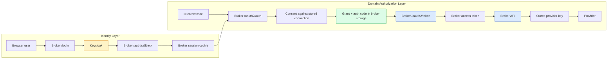

# Brokered BYOK with Keycloak and SQLite - A Technical Deep Dive

This note preserves the technical story behind a very specific kind of migration: taking a browser-facing delegated-auth demo that already has the right *product* semantics, and replacing its *foundations* without breaking the thing that made the product interesting in the first place. In this case the foundations were a custom local login flow and in-memory state; the replacement was Keycloak in Docker Compose plus a broker-owned pluggable storage layer with SQLite as the first implementation.

The most important lesson is that introducing a “real identity provider” does **not** mean handing your whole authorization model to that provider. If your product’s core value is brokered custody of provider credentials and broker-owned consent/grant logic, then the identity provider should solve identity — and stop there.

> [!summary]
> The deepest lessons from this migration are:
> 1. **Keycloak should authenticate the user, not replace the broker’s domain model**
> 2. **storage should be modeled around broker concepts, not around SQLite tables**
> 3. **the browser flow is two auth systems layered together: broker login and broker delegation**
> 4. **the hardest bugs were boundary bugs** — import cycles, return-target loss, and host-port collisions — not “big architecture” mistakes

## Why this note exists

A lot of engineering migrations fail for a subtle reason: the team knows *what tool they want to add* but not *which boundary must remain owned by the original system*. That is especially dangerous in auth projects because the external tool — in this case Keycloak — is powerful and tempting. Once it is available, there is a natural urge to keep moving more and more logic into it.

This project is a useful counterexample. The right move was not “replace the broker auth story with Keycloak.” The right move was:

- keep the broker’s product boundary,
- swap out the demo-grade login foundation,
- persist broker-owned state cleanly,
- keep the user-facing delegation story intact.

That makes this a useful article for an intern or future collaborator who needs to think clearly about where identity ends and domain authorization begins.

## The before-and-after in one paragraph

Before the migration, the demo already proved something important: a user could connect a provider key to a broker, authorize a client website, and run browser-visible chat without exposing the raw provider key to the site. But the whole thing rested on demo-only foundations: a custom login page and in-memory state.

After the migration, the same visible flow still works, but now:

- Keycloak handles broker-user login,
- the broker stores users by Keycloak subject,
- the broker persists connections, grants, auth codes, tokens, and audit events,
- SQLite survives broker restarts,
- the browser client still uses Authorization Code + PKCE against the broker,
- the site still never sees the provider key.

That is the core success criterion.

## The core mental model

The simplest accurate mental model is this:

- **Keycloak answers:** “Who is this broker user?”
- **The broker answers:** “What provider connection, scopes, and model access may this site use?”

Those are different questions.

If you collapse them into one question, you are likely to overfit the auth provider and under-model your product.

### The two stacked auth layers

There are really two auth stories in the system.

#### Layer 1: broker user login

This is a normal OIDC story:

- redirect to Keycloak,
- validate state and nonce,
- verify ID token,
- write a signed broker session cookie,
- map Keycloak subject to a broker user.

#### Layer 2: website delegation through the broker

This is a broker-specific authorization story:

- the client website starts Authorization Code + PKCE against the broker,
- the user chooses which stored provider connection the site may use,
- the broker persists a grant,
- the broker mints a broker-scoped access token,
- the site calls broker APIs with that token.

The two layers share a user, but they should not be confused with each other.

## Pattern shape



The idea worth preserving is not “OIDC plus SQLite.” The idea worth preserving is the **separation of identity and broker-specific delegation**.

## Triggering incident: why the migration was necessary

The original demo had the right user experience but not the right operational story.

Its weak points were exactly what you would expect:

- restart the broker and everything disappears,
- no stable storage interface exists,
- auth/session behavior is custom and local,
- no durable operator story exists for booting a real identity provider,
- there is no realistic handoff from “demo” to “local alpha.”

So the migration had to solve two problems at once:

1. **identity realism** — use a proper local OIDC provider
2. **state realism** — persist the broker’s own data model

The danger would have been solving those by weakening the product boundary. Instead, the implementation kept the boundary and changed the substrate.

## Architecture in prose

The easiest way to think about the implementation is to follow the lifecycle of a user who starts from the client website while logged out.

1. The client site begins Authorization Code + PKCE against the broker.
2. The broker sees there is no broker session.
3. The broker redirects the user to `/login?return_to=<original consent URL>`.
4. `/login` starts an OIDC flow with Keycloak.
5. Keycloak authenticates the user.
6. `/auth/callback` verifies the result, writes a signed broker session cookie, and redirects back to the original consent URL.
7. The broker consent page shows which stored provider connection the site may use.
8. The broker stores a grant and a short-lived auth code.
9. The browser client exchanges the auth code plus PKCE verifier for a broker access token.
10. The browser uses that broker token to call `/v1/models` and `/v1/chat/completions`.
11. The broker loads the stored provider key from SQLite and forwards the request upstream.

In other words: Keycloak gets the user *into* the broker, but the broker still decides what the website can *do* with the user’s provider relationship.

## Implementation deep dive

### 1) The storage abstraction was the first real design pivot

The wrong way to add SQLite would have been to start by writing tables and then force the runtime to think in SQL-shaped terms.

The right way, which the project used, was to define the store in broker domain terms first:

```go
type Store interface {
    UserStore
    ConnectionStore
    GrantStore
    OAuthArtifactStore
    AuditStore
    Close() error
}
```

That list encodes the real product:

- users are broker users mapped from Keycloak subjects,
- connections are stored provider credentials,
- grants are per-client approvals tied to connections,
- OAuth artifacts exist because the broker is still an authorization server for the client website,
- audit exists because the broker makes policy-relevant decisions.

This is a subtle but important architectural discipline. The database backend should adapt to the product model, not the other way around.

### 2) The import-cycle bug was a good boundary lesson

One of the first failures was not glamorous, but it was instructive.

The first implementation tried to add a factory function in the parent `storage` package that imported both the `memory` and `sqlite` backends. But those backends already imported the shared `storage` package for interfaces and models. That created a classic Go import cycle.

That bug is worth remembering because it is a structural warning sign. When the interface-defining parent package starts importing its own implementations, the dependency direction is already wrong.

The fix was to move backend selection into the runtime layer:

```go
func openStore(cfg BrokerConfig) (storage.Store, error) {
    switch cfg.StorageDriver {
    case "", "memory":
        return storagememory.New(), nil
    case "sqlite":
        return storagesqlite.Open(cfg.StorageSQLitePath)
    default:
        return nil, fmt.Errorf("unknown storage driver")
    }
}
```

That is not just a Go trick. It is the correct ownership model.

### 3) The Keycloak integration is deliberately small and broker-controlled

The OIDC helper does not try to turn the broker into a generic OIDC framework. It does one concrete job:

- start login,
- verify callback,
- write a signed broker session cookie.

The interesting detail is the `return_to` handling.

Initially, there was a validation bug: when a user started from the client site and got redirected to Keycloak, the system lost the original consent URL and sent the user to `/app` after login. The root cause was that the desired in-app return destination was not being preserved reliably across the IdP round-trip.

The eventual fix was pragmatic and good:

- state and nonce remain separate OIDC cookies,
- `return_to` is stored as its own short-lived broker cookie,
- callback reads and clears that cookie,
- the broker redirects to the original in-app target.

The deeper lesson is that **IdP round-trips are hostile to casual assumptions about extra application-specific query parameters**. If your app needs precise post-login routing, preserve it with an application-owned mechanism.

### 4) The broker still owns consent because consent is not just identity

This is the heart of the design.

A generic identity provider knows about users and clients. It does not, by default, know:

- which provider credential a user has stored in your product,
- which of several provider credentials a website should get,
- which models should be exposed for a particular connection,
- how inference authorization should be scoped for your product.

That is why the broker still presents its own consent page. The user is not merely authorizing “app X to act as me.” The user is authorizing:

- *this website*,
- to use *this broker-managed connection*,
- with *these scopes*,
- against *these allowed models*.

That is domain authorization, not identity authentication.

### 5) Persisting auth codes and access tokens was the quietly correct choice

At first glance, it might seem enough to persist only long-lived entities such as users, connections, and grants. But because the broker still owns the website-facing OAuth layer, its auth codes and access tokens are part of real broker state.

This was a good design move for two reasons.

First, it avoids a weird split-brain architecture where the long-lived state is durable but the broker’s own OAuth artifacts vanish on restart.

Second, it makes the operational story easier to understand: the broker’s entire delegation model lives behind one storage abstraction.

This is one of those implementation choices that feels slightly heavier in the moment but pays off in conceptual cleanliness.

### 6) The launcher became part of the architecture because operator experience matters

A purely design-oriented explanation of the system would talk about Keycloak and SQLite and stop there. The real implementation uncovered a more practical truth: local operator reliability is part of the architecture.

The first validation attempt failed because host port `8080` was already occupied.
The next failed because `18080` was also occupied.

The final solution was to make the launcher auto-pick a free Keycloak host port from a candidate list when `KEYCLOAK_PORT` is unset.

That is not just shell-script polish. It changes whether the system is painful or reliable to operate on a real developer machine.

## Common failure modes

### Failure mode 1: “We have Keycloak now, so the broker should stop owning OAuth state”

This is the most dangerous conceptual mistake.

If the broker remains the system that decides which stored provider connection a website may use, then the broker still owns a meaningful authorization layer. Do not accidentally erase your product boundary because the identity provider also speaks OAuth.

### Failure mode 2: modeling storage around database tables instead of domain concepts

If the code starts talking in terms of table details before it talks in terms of users, connections, grants, and auth artifacts, the architecture is already drifting downward into persistence-specific thinking.

### Failure mode 3: losing the original user intent during login redirects

The `return_to` bug is a textbook example. The user intended to continue a consent flow, not merely to “log in.” If the app forgets that distinction, the user lands in the wrong place even though the authentication technically succeeded.

### Failure mode 4: proving only compile-time success

The project would have looked “done enough” after `go build ./...`, but the meaningful proof came later:

- browser validation,
- successful model listing,
- successful chat call,
- inspection of SQLite state,
- broker restart,
- second successful chat call.

That is the level where architectural migrations become believable.

### Failure mode 5: treating operator scripts as disposable

If your system depends on local Compose + tmux orchestration, the launcher is not a side character. It is part of how the system is understood, reused, and debugged.

## Anti-patterns

### Anti-pattern: “Let’s just put grants into Keycloak too”

If the grant semantics are about broker-managed provider connections and broker-specific inference scopes, that logic belongs to the broker.

### Anti-pattern: “Just use direct browser-to-provider BYOK for now”

That would weaken the product story. The whole point of the broker is that sites do not get raw provider keys.

### Anti-pattern: “Persist only the long-lived tables”

If the broker owns the token exchange that the site depends on, auth codes and access tokens are part of the system’s real state.

### Anti-pattern: “A fixed host port is good enough for local infra”

It rarely is. Real machines already have things running.

## Recommended implementation sequence

If you had to rebuild this pattern from scratch, a good order would be:

1. preserve the original product boundary in writing
2. define broker-owned storage interfaces in domain terms
3. implement an in-memory store first for behavior parity
4. implement SQLite second for persistence
5. add Keycloak only for broker-user identity/login
6. keep client-site delegation broker-owned
7. build the local operator workflow around Compose + logs + tmux
8. browser-validate before declaring success
9. restart the broker and verify persisted state survives

That order matters because it keeps the problem decomposed along the right seams.

## Pseudocode for the final model

### Broker login bootstrap

```text
GET /login?return_to=/oauth2/auth?... 
  -> create state cookie
  -> create nonce cookie
  -> create return_to cookie
  -> redirect to Keycloak

GET /auth/callback?state=...&code=...
  -> verify state cookie
  -> exchange code
  -> verify ID token + nonce
  -> map Keycloak subject to broker user
  -> write signed broker session cookie
  -> redirect to return_to or /app
```

### Website delegation

```text
client website
  -> /oauth2/auth + PKCE challenge
  -> broker checks broker session
  -> broker shows consent against stored connections
  -> broker stores grant
  -> broker stores auth code
  -> redirect to client callback
  -> client exchanges code + verifier at /oauth2/token
  -> broker verifies PKCE
  -> broker stores access token
  -> client calls broker API with broker token
```

### Inference call path

```text
browser token
  -> broker loads access token record
  -> broker loads grant
  -> broker loads selected connection
  -> broker checks scope + model allowlist
  -> broker forwards request with stored provider key
  -> broker returns normalized response to browser
```

## Why this architecture is a good stepping stone

It is tempting to look at a hybrid model like this and call it transitional. That is true, but it undersells its value.

This architecture is good because it proves the hardest product-level constraint survives the move to more realistic infrastructure: the website still does not receive the provider key.

It also keeps future options open.

You could later:

- swap SQLite for Postgres,
- add encrypted secret storage,
- narrow or enrich broker tokens,
- automate browser/integration tests,
- decide whether some client-facing auth semantics should align more directly with Keycloak.

What you should not do is lose sight of the core boundary while making those future changes.

## Related notes

- [[PROJ - BYOK Host - Keycloak and SQLite Broker Intern Research Guide]]
- [[PROJ - Client-side Tool Broker for Chat - Intern Research Guide]]
- [[PROJ - Keycloak Identity Platform on Coolify]]
