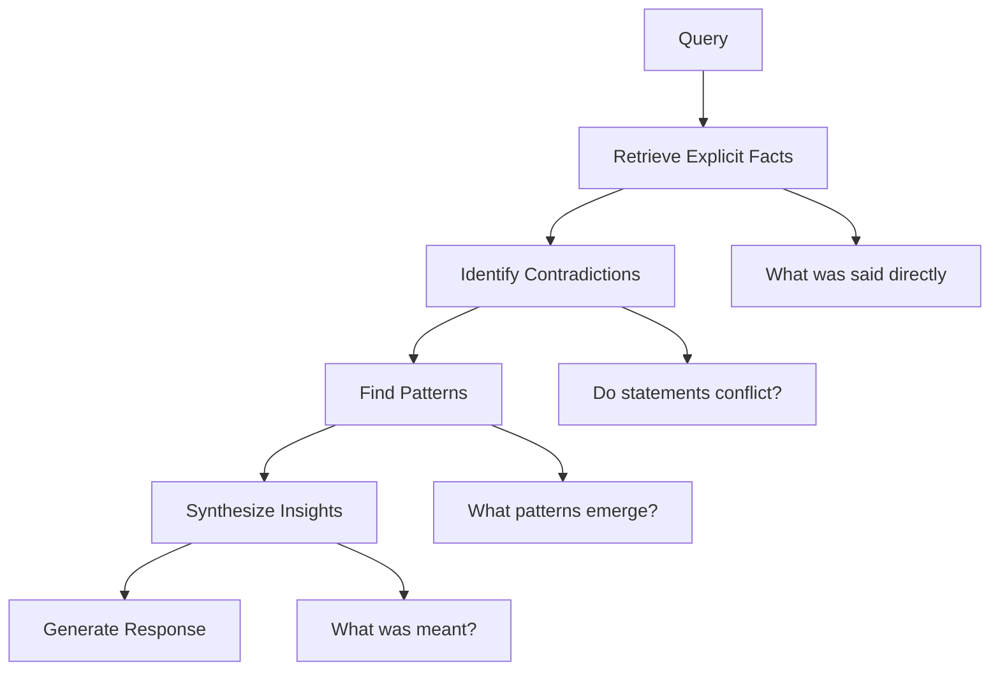
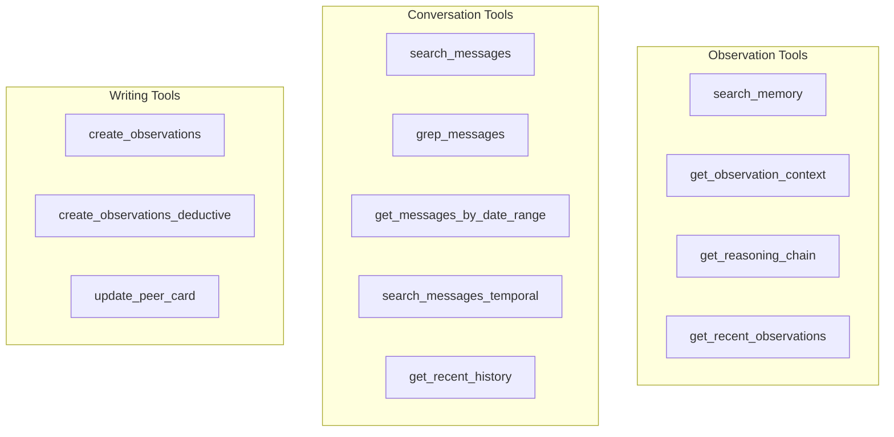
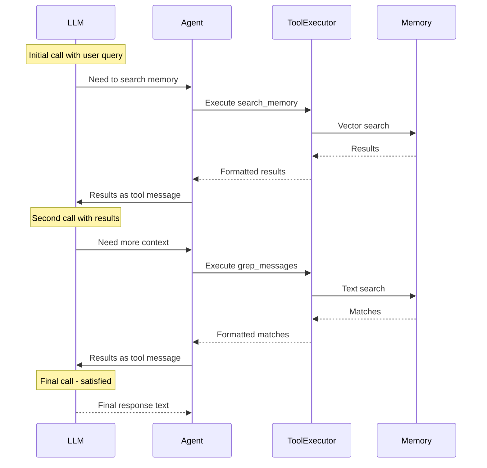

# Dialectic Agent: Implementing Tool-Calling Reasoning for AI Memory Systems

## Preface

This article provides a comprehensive technical explanation of the Dialectic Agent architecture, as implemented in the Honcho memory system by Plastic Labs. The dialectic agent represents a sophisticated approach to reasoning over stored memories—it is not merely a retrieval system, but an active reasoning engine that uses tool-calling to gather context, synthesize insights, and answer questions about users and their behaviors.

The material here is drawn from the Honcho source code, particularly `src/dialectic/core.py`, `src/dialectic/prompts.py`, and `src/utils/agent_tools.py`. This article assumes familiarity with basic machine learning concepts, REST API design, and the principles of retrieval-augmented generation (RAG). Familiarity with async Python programming will be helpful for the implementation sections.

---

## Part I: Conceptual Foundations

### The Limitations of Simple Retrieval

Before we can understand why a dialectic agent is necessary, we must first understand the limitations of simple retrieval systems. Consider a traditional RAG (Retrieval-Augmented Generation) pipeline:

```
┌─────────────────────────────────────────────────────────────┐
│                  Simple RAG Pipeline                             │
├─────────────────────────────────────────────────────────────┤
│                                                              │
│  Query: "What are this user's learning preferences?"        │
│                    │                                           │
│                    ▼                                           │
│  ┌─────────────────────────────────────────────────────┐   │
│  │ 1. Embed query into vector space                        │   │
│  └─────────────────────────────────────────────────────┘   │
│                    │                                           │
│                    ▼                                           │
│  ┌─────────────────────────────────────────────────────┐   │
│  │ 2. Vector similarity search in memory store           │   │
│  └─────────────────────────────────────────────────────┘   │
│                    │                                           │
│                    ▼                                           │
│  ┌─────────────────────────────────────────────────────┐   │
│  │ 3. Return top-k most similar documents                 │   │
│  └─────────────────────────────────────────────────────┘   │
│                    │                                           │
│                    ▼                                           │
│  ┌─────────────────────────────────────────────────────┐   │
│  │ 4. Inject documents into LLM prompt                   │   │
│  └─────────────────────────────────────────────────────┘   │
│                    │                                           │
│                    ▼                                           │
│  Response generated from retrieved documents                 │
│                                                              │
└─────────────────────────────────────────────────────────────┘
```

This architecture has several fundamental limitations:

**First, retrieval is limited to what was explicitly stated.** If a user says "I take the bus to work because my daughter asks about melting ice caps," a simple retriever will store those exact phrases. But the deeper insight—that family relationships drive this user's environmental decisions—requires reasoning that goes beyond literal matching.

**Second, simple retrieval cannot handle contradictions.** A user might say "I never eat red meat" in one conversation and "I had a steak last night" in another. Simple retrieval will return both statements without reconciling them. The system cannot ask which statement is correct.

**Third, retrieval cannot aggregate patterns.** Finding that a user prefers concrete examples requires not just retrieving relevant sentences, but analyzing the *frequency* and *context* of such statements across multiple interactions. This is a reasoning task, not a retrieval task.

### The Dialectic Approach

The term "dialectic" comes from philosophy, referring to the method of discovering truth through the interaction of opposing ideas—thesis, antithesis, and synthesis. The Dialectic Agent applies this principle to memory reasoning:



The agent does not simply retrieve; it *reasons* about retrieved information. It actively searches for contradictions, identifies patterns across multiple observations, and synthesizes new insights that go beyond what was explicitly stated.

### The Observer/Observed Model

Honcho introduces a symmetric model where both users and agents are treated as **Peers**. This enables two types of queries:

1. **Directional queries**: Peer A asks about Peer B ("What does the user prefer?")
2. **Self-reflective queries**: Peer A asks about themselves ("What do I not know about my own preferences?")

The Dialectic Agent supports both through its observer/observed architecture. The system prompt is constructed to answer from the observer's perspective about the observed, incorporating biographical information (peer cards) for both parties.

---

## Part II: System Architecture

### High-Level Component Diagram

```mermaid
flowchart LR
    subgraph Client[Client Application]
        Q[Query]
    end
    
    subgraph Agent[Dialectic Agent]
        SP[System Prompt]
        PF[Prefetch]
        LL[LLM Loop]
        TE[Tool Executor]
    end
    
    subgraph Tools[Memory Tools]
        SM[search_memory]
        GM[grep_messages]
        CR[create_observations]
        RC[get_reasoning_chain]
    end
    
    subgraph Memory[Memory Store]
        OBS[Observations]
        MSG[Messages]
        PC[Peer Cards]
    end
    
    Q --> SP
    SP --> PF
    PF --> LL
    LL <--> TE
    TE --> Tools
    Tools --> Memory
    
    style Agent fill:#e1f5fe
    style Memory fill:#f3e5f5
```



### The Main Components

The dialectic agent is implemented as the `DialecticAgent` class in `src/dialectic/core.py`. Its initialization sets up the core state:

```python
class DialecticAgent:
    def __init__(
        self,
        workspace_name: str,
        session_name: str | None,
        observer: str,
        observed: str,
        observer_peer_card: list[str] | None = None,
        observed_peer_card: list[str] | None = None,
        reasoning_level: ReasoningLevel = "low",
    ):
        self.workspace_name = workspace_name
        self.session_name = session_name
        self.observer = observer
        self.observed = observed
        self.reasoning_level = reasoning_level
        
        # Initialize conversation history with system prompt
        self.messages: list[dict[str, str]] = [
            {
                "role": "system",
                "content": prompts.agent_system_prompt(
                    observer, observed, 
                    observer_peer_card, observed_peer_card
                ),
            }
        ]
```

The class maintains a message history that accumulates throughout the reasoning session. Each tool call and response is appended to this history, allowing the LLM to build upon previous reasoning.

### System Prompt Construction

The system prompt is the foundation of the agent's behavior. It is constructed in `src/dialectic/prompts.py`:

```python
def agent_system_prompt(
    observer: str,
    observed: str,
    observer_peer_card: list[str] | None,
    observed_peer_card: list[str] | None,
) -> str:
    # Build peer card sections if biographical info is available
    if observer != observed:
        # Directional query
        observer_card = format_peer_card(observer, observer_peer_card)
        observed_card = format_peer_card(observed, observed_peer_card)
        perspective = f"""
You are answering queries from the perspective of {observer}'s 
understanding of {observed}.
"""
    else:
        # Self-reflective query
        perspective = f"""
You are answering queries about '{observed}'.
"""
```

The prompt includes detailed instructions for:

1. **When to use each tool** (detailed in Part III)
2. **How to handle contradictions** (explicitly flag, don't resolve unilaterally)
3. **How to handle knowledge updates** (prefer recent statements)
4. **How to abstain** (say "I don't know" rather than fabricate)

### The Reasoning Levels

Honcho supports five reasoning levels, each with different model configurations:

| Level | Default Model | Max Iterations | Prefetch Limit | Use Case |
|-------|--------------|----------------|-----------------|----------|
| `minimal` | Gemini 2.0 Flash | 3 | 10 | Quick facts, UI hints |
| `low` | Gemini 2.0 Flash | 5 | 25 | Simple insights |
| `medium` | Claude Sonnet 4 | 10 | 25 | Complex reasoning |
| `high` | Claude Sonnet 4 | 15 | 25 | Deep analysis |
| `max` | Claude Opus 4 | 20 | 25 | Comprehensive synthesis |

The level determines:
- Which LLM provider/model to use
- How many tool-call iterations are allowed
- How many observations to prefetch
- Maximum output tokens

---

## Part III: The Tool System

### Overview of Available Tools

The dialectic agent has access to twelve tools organized into three categories:



### Observation-Level Semantics

Not all observations are created equal. The system distinguishes between four types:

**Explicit Observations** are direct facts stated in conversation:
```python
{
    "content": "The user takes public transit to work",
    "level": "explicit",
    "source_ids": ["msg_123", "msg_456"]
}
```

**Deductive Observations** are logical conclusions that follow necessarily from explicit facts:
```python
{
    "content": "The user is environmentally motivated in their choices",
    "level": "deductive",
    "source_ids": ["obs_explicit_1", "obs_explicit_2", "obs_explicit_3"],
    "premises": [
        "Takes bus to reduce carbon footprint",
        "Has daughter who cares about environment"
    ]
}
```

**Inductive Observations** are patterns inferred from multiple occurrences:
```python
{
    "content": "The user prefers concrete examples over abstract explanations",
    "level": "inductive",
    "confidence": "high",  # Based on 3+ observations
    "pattern_type": "preference"
}
```

**Contradiction Observations** flag conflicting statements:
```python
{
    "content": "User stated they don't eat red meat but also mentioned having steak recently",
    "level": "contradiction",
    "sources": [
        "I never eat red meat",
        "I had an amazing steak last night"
    ]
}
```

### The search_memory Tool

This is the primary tool for finding relevant observations. It performs vector similarity search:

```python
async def search_memory(
    workspace_name: str,
    observer: str,
    observed: str,
    query: str,
    limit: int = 20,
    levels: list[str] = None,  # Filter by level
    embedding: list[float] = None,  # Pre-computed embedding
) -> SearchResult:
```

The tool:
1. Embeds the query (or uses a pre-computed embedding)
2. Performs vector search against observation embeddings
3. Filters by observation level if specified
4. Returns formatted results with conversation context

### The grep_messages Tool

For enumeration questions ("how many," "list all"), exact text matching is often more reliable than semantic search. The grep tool performs substring matching:

```python
{
    "name": "grep_messages",
    "description": "Search for messages containing specific text (case-insensitive)",
    "input_schema": {
        "type": "object",
        "properties": {
            "text": {"type": "string", "description": "Text to search for"},
            "limit": {"type": "integer", "default": 10},
            "context_window": {"type": "integer", "default": 2},
        },
        "required": ["text"],
    },
}
```

The prompt instructs the agent to use grep for enumeration tasks:
> "For ENUMERATION/AGGREGATION questions: START WITH GREP. Use grep for the UNIT being counted: 'hours', 'dollars', '%', 'times'. Grep catches exact mentions that semantic search might miss."

### The create_observations Tool

This writing tool allows the agent to persist new insights:

```python
{
    "name": "create_observations",
    "description": "Create observations at any level: explicit, deductive, inductive, or contradiction",
    "input_schema": {
        "type": "object",
        "properties": {
            "observations": {
                "type": "array",
                "items": {
                    "properties": {
                        "content": {"type": "string"},
                        "level": {
                            "enum": ["explicit", "deductive", "inductive", "contradiction"]
                        },
                        "source_ids": {"type": "array", "items": {"type": "string"}},
                        "confidence": {"enum": ["high", "medium", "low"]},
                    },
                    "required": ["content", "level"]
                }
            }
        },
        "required": ["observations"]
    },
}
```

---

## Part IV: The Reasoning Loop

### The Main Answer Method

The core reasoning loop is implemented in the `answer` method:

```python
async def answer(self, query: str) -> str:
    # Step 1: Prepare query and tools
    tool_executor, task_name, start_time = await self._prepare_query(query)
    
    # Step 2: Get level-specific settings
    level_settings = settings.DIALECTIC.LEVELS[self.reasoning_level]
    
    # Step 3: Choose tool set based on level
    tools = (
        DIALECTIC_TOOLS_MINIMAL 
        if self.reasoning_level == "minimal" 
        else DIALECTIC_TOOLS
    )
    
    # Step 4: Call LLM with tool execution loop
    response = await honcho_llm_call(
        messages=self.messages,
        tools=tools,
        tool_executor=tool_executor,
        max_tool_iterations=level_settings.MAX_TOOL_ITERATIONS,
        # ... other parameters
    )
    
    return response.content
```

### The Prefetch Optimization

Before the first LLM call, the agent prefetches semantically relevant observations:

```python
async def _prefetch_relevant_observations(self, query: str) -> str | None:
    # Compute embedding once for both searches
    query_embedding = await embedding_client.embed(query)
    
    # Search explicit observations separately from derived
    # (prevents retrieval dilution)
    explicit_repr = await search_memory(
        workspace_name=self.workspace_name,
        observer=self.observer,
        observed=self.observed,
        query=query,
        limit=25,
        levels=["explicit"],
        embedding=query_embedding,
    )
    
    derived_repr = await search_memory(
        workspace_name=self.workspace_name,
        observer=self.observer,
        observed=self.observed,
        query=query,
        limit=25,
        levels=["deductive", "inductive", "contradiction"],
        embedding=query_embedding,
    )
    
    if explicit_repr.is_empty() and derived_repr.is_empty():
        return None
    
    # Format for injection into user message
    return format_observations(explicit_repr, derived_repr)
```

This prefetch serves two purposes:

1. **Reduces tool calls**: For common queries, relevant observations are immediately available
2. **Prevents retrieval dilution**: By searching explicit and derived observations separately, the agent gets higher-quality results

### The Tool Execution Flow

The `honcho_llm_call` function manages the tool-calling loop internally. The flow is:



The loop continues until the LLM returns a text response (rather than tool calls) or max iterations are reached.

---

## Part V: Critical Behavioral Rules

### Handling Contradictions

The prompt includes explicit instructions for contradiction handling:

```python
CRITICAL_SECTION = """
## CRITICAL: HANDLING CONTRADICTORY INFORMATION

As you search, actively watch for contradictions:
- "I have never done X" vs evidence they did X
- Different values for the same fact
- Changed decisions or preferences

**If you find contradictory information:**
1. DO NOT pick one version and present it as definitive
2. Present BOTH pieces of conflicting information
3. State clearly that you found contradictory information
4. Ask the user which statement is correct
"""
```

This is a deliberate design choice. Rather than having the agent silently resolve contradictions (and potentially be wrong), Honcho surfaces them to the user for resolution.

### Handling Knowledge Updates

Information changes over time. The agent is instructed to prefer recent statements:

```python
CRITICAL_SECTION = """
## CRITICAL: HANDLING UPDATED INFORMATION

When you find multiple values for the same fact:
1. ALWAYS search for updates: "changed", "updated", "rescheduled"
2. Look for language indicating updates
3. The MORE RECENT statement supersedes the older one
4. Return the UPDATED value
"""
```

### The Abstention Rule

Perhaps the most important behavioral rule is the requirement to abstain rather than fabricate:

```python
CRITICAL_SECTION = """
## CRITICAL: NEVER FABRICATE INFORMATION

When answering questions, distinguish between:
- Context found: "There was a debate about X"
- Specific answer found: "The arguments were A, B, C"

If you find context but NOT the specific answer:
1. DO NOT fabricate or guess details
2. Report only what you DO know
3. Clearly state what you DON'T know

**A confident "I don't know" is ALWAYS correct;
giving a fabricated answer is ALWAYS wrong.**
"""
```

---

## Part VI: Prompt Engineering Strategies

### Strategic Tool Usage

The system prompt provides detailed guidance for different query types:

**For User Preference Questions:**
```
For questions asking for advice, recommendations, or opinions:
→ Search for "prefer", "like", "want", "always", "never"
→ Apply relevant preferences to response structure
```

**For Enumeration Questions:**
```
For "how many", "list all", or "total" questions:
→ START WITH GREP for exhaustive matching
→ THEN semantic search with multiple phrasings
→ Cross-reference to avoid double-counting
→ MANDATORY: Verify you found ALL items
```

**For Factual Questions:**
```
For questions about specific facts:
→ Cross-reference with related terms
→ Search for CONTRADICTIONS
→ Use get_reasoning_chain to verify premises
```

### The Verification Mandate

The prompt requires verification before final answers:

```python
VERIFICATION_STEP = """
Before stating a final answer:
1. Ask: "Could there be more items I haven't found?"
2. If you haven't done multiple grep searches + semantic search, keep searching
3. For enumeration: Create a deduplication table
4. List each item with distinguishing feature and source date
"""
```

---

## Part VII: Implementation in Go

### The Tool-Calling Interface

Porting the dialectic agent to Go requires implementing a tool-calling client. The interface would be:

```go
type DialecticAgent struct {
    workspaceName  string
    observer       string
    observed       string
    reasoningLevel ReasoningLevel
    
    messages []ChatMessage
    tools    []Tool
    client  LLMClient
}

type Tool struct {
    Name        string
    Description string
    InputSchema map[string]any
    Handler     func(ctx context.Context, args map[string]any) (string, error)
}

func (a *DialecticAgent) Run(ctx context.Context, query string) (string, error) {
    // Build system prompt and initial messages
    messages := []ChatMessage{
        {Role: "system", Content: a.buildSystemPrompt()},
        {Role: "user", Content: query},
    }
    
    // Optionally prefetch observations
    prefetch := await a.prefetchObservations(ctx, query)
    if prefetch != "" {
        messages[1].Content = query + "\n\nRelevant observations:\n" + prefetch
    }
    
    // Tool execution loop
    for iter := 0; iter < a.maxIterations(); iter++ {
        resp, err := a.client.Chat(ctx, ChatRequest{
            Messages: messages,
            Tools:    a.tools,
        })
        if err != nil {
            return "", err
        }
        
        choice := resp.Choices[0]
        
        // Check if we have tool calls
        if len(choice.ToolCalls) == 0 {
            return choice.Content, nil // Done
        }
        
        // Execute each tool call
        for _, call := range choice.ToolCalls {
            result, err := a.executeTool(ctx, call)
            if err != nil {
                return "", err
            }
            
            messages = append(messages, ChatMessage{
                Role:       "tool",
                ToolCallID: call.ID,
                Content:    result,
            })
        }
    }
    
    return "", errors.New("max iterations exceeded")
}
```

### Streaming Considerations

For streaming responses, Go would use HTTP chunked transfer encoding:

```go
func (a *DialecticAgent) RunStream(ctx context.Context, query string) (<-chan string, error) {
    ch := make(chan string)
    
    go func() {
        defer close(ch)
        
        // Non-streaming tool execution phase
        messages := a.prepareMessages(query)
        
        for !a.isSatisfied(messages) {
            resp, err := a.client.Chat(ctx, messages)
            if err != nil {
                return
            }
            
            // Process tool calls
            for _, call := range resp.ToolCalls {
                result := a.executeToolSync(ctx, call)
                messages = append(messages, toolMessage(call.ID, result))
            }
        }
        
        // Streaming response phase
        stream, err := a.client.ChatStream(ctx, messages)
        if err != nil {
            return
        }
        
        for chunk := range stream {
            ch <- chunk.Content
        }
    }()
    
    return ch, nil
}
```

### Tool Handler Registration

Tools would be registered as handlers:

```go
func (a *DialecticAgent) RegisterTools() {
    a.tools = []Tool{
        {
            Name:        "search_memory",
            Description: "Semantic search over observations",
            InputSchema:  searchMemorySchema,
            Handler:      a.searchMemory,
        },
        {
            Name:        "grep_messages",
            Description: "Exact text search in messages",
            InputSchema:  grepMessagesSchema,
            Handler:      a.grepMessages,
        },
        {
            Name:        "create_observations",
            Description: "Persist new observations",
            InputSchema:  createObservationsSchema,
            Handler:      a.createObservations,
        },
    }
}

func (a *DialecticAgent) searchMemory(ctx context.Context, args map[string]any) (string, error) {
    query := args["query"].(string)
    limit := int(args["limit"].(float64)) // JSON numbers are float64
    
    results, err := a.vectorStore.Search(ctx, VectorQuery{
        Collection: "observations",
        Query:      query,
        TopK:       limit,
        Filter: map[string]any{
            "workspace": a.workspaceName,
            "observer":  a.observer,
            "observed":  a.observed,
        },
    })
    if err != nil {
        return "", err
    }
    
    return formatSearchResults(results), nil
}
```

---

## Part VIII: Evaluation and Metrics

### What Gets Measured

The dialectic agent emits comprehensive telemetry:

```python
@dataclass
class DialecticCompletedEvent:
    run_id: str
    workspace_name: str
    peer_name: str
    session_name: str | None
    reasoning_level: str
    total_iterations: int
    prefetched_conclusion_count: int
    tool_calls_count: int
    total_duration_ms: float
    input_tokens: int
    output_tokens: int
    cache_read_tokens: int
    cache_creation_tokens: int
```

Key metrics include:
- **Iterations**: How many tool-call rounds were needed
- **Prefetch hit rate**: How often prefetched observations satisfied the query
- **Token usage**: Input vs. output tokens by reasoning level
- **Latency**: Time to first byte and total duration

### Evaluating Response Quality

Response quality is evaluated through:

1. **Groundedness**: Are claims backed by retrieved observations?
2. **Completeness**: Did the agent find all relevant information?
3. **Accuracy**: Are conclusions supported by premises?
4. **Helpfulness**: Does the response answer the user's question?

These are difficult to measure automatically, which is why Honcho surfaces contradictions rather than silently resolving them.

---

## Part IX: Design Tradeoffs and Alternatives

### Why Tool-Calling vs. Single-Shot?

A single-shot approach would:
1. Fetch all relevant observations upfront
2. Make one LLM call with complete context
3. Return the response

**Advantages of single-shot:**
- Simpler implementation
- Fewer API calls (lower cost)
- Predictable latency

**Advantages of tool-calling:**
- Adaptive context gathering (only fetch what's needed)
- Handles queries that require exploration
- Better for complex multi-step reasoning

Honcho chose tool-calling because user queries often require exploration. The agent cannot know upfront what context will be relevant.

### Why Not Use an Existing Framework?

Options considered:
- **LangChain**: Too generic, poor observability
- **LlamaIndex**: Focused on retrieval, not reasoning
- **AutoGPT-style agents**: No memory layer, no persistence

Honcho needed tight integration with its memory layer, which required building a custom agent.

### Limitations

The dialectic agent has known limitations:

1. **Token budget**: Long conversation histories may exceed context limits
2. **Iteration limits**: Complex queries may not complete within max iterations
3. **Model capability**: Reasoning quality depends on the underlying model
4. **Cost**: Multiple LLM calls per query is expensive

---

## Part X: Practical Usage Patterns

### Basic Query

```python
from honcho import Honcho

honcho = Honcho(workspace_id="my-app")
alice = honcho.peer("alice")

# Simple question
response = alice.chat("What does the user prefer for learning?")
print(response)
```

### Controlled Reasoning Level

```python
# Use deep reasoning for complex questions
response = alice.chat(
    "What patterns have emerged in how this user makes decisions?",
    level="high"  # Uses Claude Opus with 15 iterations
)
```

### Streaming Response

```python
# For long responses, stream to reduce perceived latency
for chunk in alice.chat_stream("Tell me everything about this user"):
    print(chunk, end="", flush=True)
```

---

## Summary

The Dialectic Agent represents a sophisticated approach to reasoning over AI memory systems. Key takeaways:

1. **Tool-calling enables adaptive reasoning** — rather than retrieving everything and hoping, the agent gathers context strategically.

2. **Observation levels create reasoning chains** — explicit facts lead to deductive conclusions, which aggregate into inductive patterns.

3. **Contradiction surfacing empowers users** — rather than silently resolving conflicts, the agent asks for clarification.

4. **The observer/observed model enables bidirectional understanding** — both users and agents can be queried about each other.

5. **Prompt engineering is critical** — the system prompt encodes the agent's reasoning strategy, and small changes have large behavioral effects.

The implementation requires careful orchestration of LLM calls, tool execution, memory queries, and state management. While complex, this architecture enables reasoning capabilities that go far beyond simple retrieval.

---

## Related Notes

- [[ARTICLE - Honcho AI - AI-Native Memory Through Dialectic Reasoning]]
- [[ARTICLE - Hermes Agent - Self-Improving AI Agent with Persistent Memory and Skills]]
- [[PROJ - Hermes Agent Setup]]

## References

- Honcho Repository: `/home/manuel/code/wesen/2026-04-16--hermes-agent-setup/honcho`
- Dialectic Core: `src/dialectic/core.py`
- Dialectic Prompts: `src/dialectic/prompts.py`
- Agent Tools: `src/utils/agent_tools.py`
- Honcho Documentation: https://docs.honcho.dev
