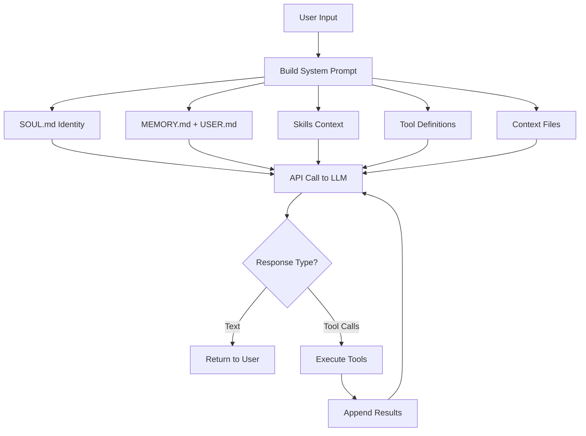
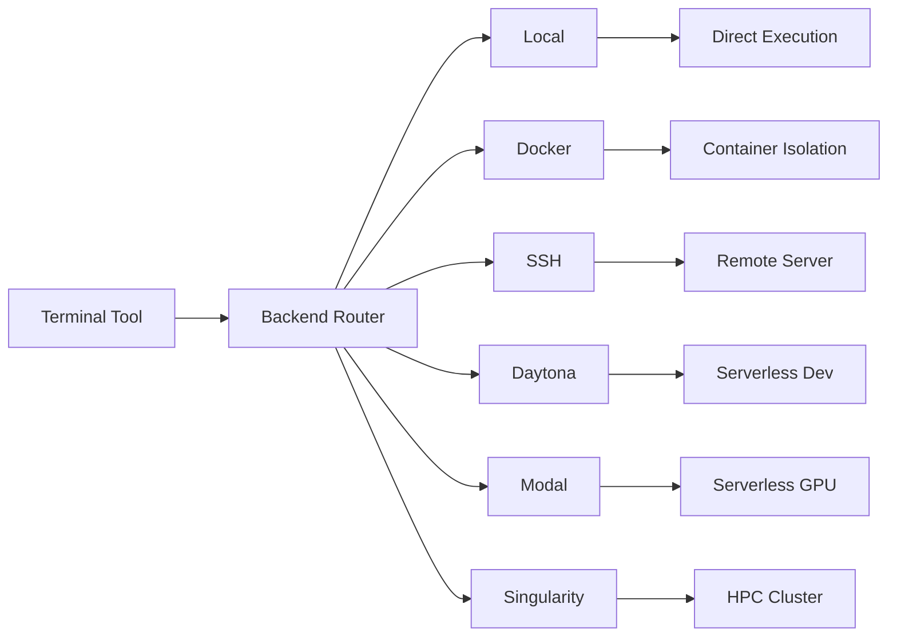
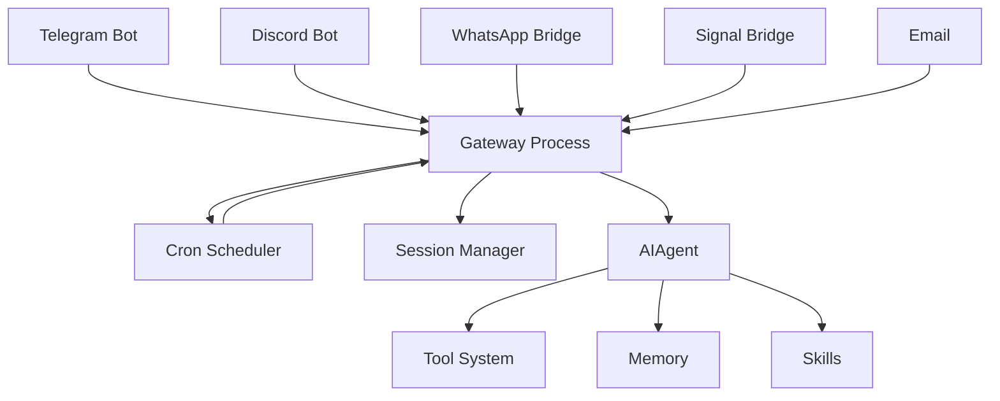

# Hermes Agent - Self-Improving AI Agent with Persistent Memory and Skills

Hermes Agent is an open-source AI agent built by Nous Research that represents a fundamentally different approach to AI assistants. Unlike traditional stateless AI systems that start fresh every conversation, Hermes implements a **closed learning loop** — it creates skills from experience, improves them during use, and maintains persistent memory across sessions. It is the agent that grows with you.

This article is a deep technical exploration of Hermes Agent's architecture, drawing from the official documentation, source code analysis, and research into its design philosophy. The reference implementation is the NousResearch/hermes-agent repository on GitHub.

## Why Hermes Agent Exists

The problem with traditional AI assistants is simple: they are stateless. Each conversation is an island. The assistant does not remember what you asked last week, cannot recall how you prefer your code formatted, and certainly cannot learn from past interactions to get better at helping you.

Hermes Agent was built to solve this. The team at Nous Research — known for their open-source Hermes language models — wanted an agent that could:

1. **Remember across sessions** — Build up knowledge about users, projects, and preferences
2. **Learn from experience** — Create reusable skills from successful task completion
3. **Self-improve** — Refine skills during use without human intervention
4. **Run anywhere** — From a $5 VPS to GPU clusters, with serverless options

The result is an agent that compounds its usefulness over time. The more you use it, the more it understands you, your projects, and your workflows.

> [!summary]
> - **Closed learning loop**: Creates skills from experience, improves them during use
> - **Persistent memory**: FTS5 full-text search across sessions, MEMORY.md + USER.md
> - **Skill system**: Auto-generated, self-improving procedural knowledge
> - **Multi-backend terminal**: Local, Docker, SSH, Daytona, Modal, Singularity
> - **Multi-platform messaging**: Telegram, Discord, Slack, WhatsApp, Signal, Email
> - **15+ LLM providers**: OpenRouter, OpenAI, Anthropic, Google, Ollama, and more

## Core Architecture

### The AIAgent Class

At the heart of Hermes is the `AIAgent` class in `run_agent.py` (~11,500 lines). This class manages the entire conversation lifecycle:

```python
class AIAgent:
    """AI Agent with tool calling capabilities."""
    
    def __init__(self, base_url: str, model: str, ...):
        # Initialize OpenAI-compatible client
        # Load tool definitions
        # Set up context compressor
        # Initialize memory manager
    
    async def run_conversation(self, user_input: str, ...) -> str:
        # Main conversation loop
        # Handle tool calls until completion
        # Manage context window
        # Track usage/costs
```

The conversation loop follows this pattern:



### Prompt Construction

The prompt is assembled dynamically through `agent/prompt_builder.py`. It is not a static template — it is a synthesis of multiple layers:

| Layer | Source | Purpose |
|-------|--------|---------|
| **Identity** | SOUL.md | Agent personality and behavior |
| **Memory** | MEMORY.md, USER.md | Persistent facts about users/projects |
| **Skills** | skills/*.md | Procedural knowledge from past experience |
| **Context Files** | AGENTS.md, .cursorrules | Project-specific instructions |
| **Tool Guidance** | tools/*.py | Available tools and usage hints |
| **Platform Hints** | Gateway | Where the message originated |

**Critical insight**: Memory is injected as a frozen snapshot at session start, not mutated live in the prompt. This preserves Anthropic prompt-caching efficiency. Updates during the session persist immediately but only re-enter the prompt on the next session.

### Tool System

Hermes provides **40+ built-in tools** organized into toolsets. The tool system is managed by a central registry in `tools/registry.py`:

```python
# Tools are self-registering
class ToolEntry:
    schema: dict      # JSON schema for LLM
    handler: Callable # Async handler function
    check_fn: Callable # Availability check

# Toolsets group related tools
class Toolset:
    name: str
    tools: List[ToolEntry]
    dependencies: List[str]
```

Key tool categories:

| Category | Tools | Purpose |
|----------|-------|---------|
| **Terminal** | shell, ssh, docker | Execute commands in various environments |
| **Browser** | web_search, web_extract, automation | Web interaction |
| **File Ops** | read, write, edit, search | File manipulation |
| **Memory** | memory create/search/update | Persistent memory management |
| **Skills** | skill create/execute/manage | Skill lifecycle |
| **MCP** | mcp_connect, mcp_tools | External tool servers |
| **Cron** | cron_create/list/delete | Scheduled automation |
| **TTS** | speak, transcribe | Voice capabilities |

### Terminal Backend Abstraction

One of Hermes' most distinctive features is its terminal backend system. The same tool can execute in six different environments:



This separation of "tool semantics" from "execution substrate" is architecturally elegant. The agent does not care where commands run — it just executes them.

## Memory Architecture

Hermes implements a three-layer memory system:

### Layer 1: Curated Persistent Memory

MEMORY.md and USER.md are bounded stores injected into the system prompt:

```
~/.hermes/memories/
├── MEMORY.md      # Agent's own notes
└── USER.md        # User profile and preferences
```

These are intentionally small and focused — the agent must decide what is worth preserving.

### Layer 2: Session Database

`hermes_state.py` manages a SQLite database with FTS5 full-text search:

```sql
CREATE TABLE sessions (
    session_id TEXT PRIMARY KEY,
    platform TEXT,
    user_id TEXT,
    created_at TIMESTAMP,
    last_accessed TIMESTAMP,
    context_json TEXT,
    parent_session_id TEXT  -- For lineage tracking
);

CREATE VIRTUAL TABLE messages_fts USING fts5(
    content,
    category,
    timestamp
);
```

The session DB enables cross-session recall. The agent can search past conversations and retrieve relevant context.

### Layer 3: Skills as Procedural Memory

Skills are the most distinctive part of Hermes' memory system. They are not facts — they are **procedures**:

| Memory Layer | Content | Purpose |
|-------------|---------|---------|
| MEMORY.md/USER.md | Facts/preferences | Semantic priors |
| SQLite | Episodic history | Full recall |
| Skills | Reusable procedures | Capability growth |

## The Skills System

### What Are Skills?

Skills are reusable knowledge documents that the agent can load when needed. They follow a progressive disclosure pattern to minimize token usage.

```
skills/<category>/<skill-name>/
├── README.md           # Skill documentation
├── SKILL.md           # Main skill file (required)
├── scripts/           # Helper scripts
└── templates/         # Prompt templates
```

A skill's SKILL.md looks like:

```yaml
---
name: git-commit-helper
description: Assists with creating meaningful git commits
version: 1.0.0
author: hermes
platforms: [cli, telegram, discord]
requires_tools: [terminal]
---

# Git Commit Helper

## When to use
When the user wants to commit changes but needs help with the commit message.

## Procedure
1. Run `git status` to see changed files
2. Run `git diff` to review changes
3. Analyze the changes to determine the type:
   - feat: New feature
   - fix: Bug fix
   - docs: Documentation
   - refactor: Code restructuring
   - test: Adding tests
4. Write a conventional commit message
5. Ask user to confirm or modify

## Pitfalls
- Don't include unrelated changes in one commit
- Keep the subject line under 72 characters
```

### Auto-Creation Mechanism

Hermes does not just use skills — it **creates** them. The system periodically reminds the model to consider saving a skill after complex tool-using work:

```yaml
# In config.yaml
skills:
  creation_nudge_interval: 60  # Minutes between nudge reminders
  auto_improve: true           # Update skills during use
```

When the agent completes a complex task, it can:
1. Detect that a new pattern was used successfully
2. Generate a new skill document from the experience
3. Store it in `~/.hermes/skills/`
4. The skill is immediately available for future use

### Self-Improvement During Use

Skills are not static. If the agent discovers a more effective approach while executing a skill, it updates the skill document:

```python
# From skills_tool.py (simplified)
async def execute_skill(skill_name: str, params: dict):
    skill = load_skill(skill_name)
    result = await run_skill_procedure(skill, params)
    
    # Check if execution revealed improvements
    if should_update_skill(skill, result):
        updated_skill = improve_skill(skill, result)
        save_skill(updated_skill)
    
    return result
```

This closed loop means the agent gets better at tasks it has done before.

## Gateway Architecture

Hermes runs a single gateway process that serves all messaging platforms:



### Platform Adapters

Each platform has a specialized adapter that handles transport and format differences:

| Platform | Adapter | Special Features |
|----------|---------|-----------------|
| Telegram | Long polling/Webhooks | Voice memo transcription |
| Discord | Bot API | Slash commands |
| Slack | Event API | App mentions |
| WhatsApp | whatsapp-web.js | Status replies |
| Signal | signal-cli | Message formatting |

### Session Persistence

Sessions persist across messages with configurable reset policies:

```yaml
# ~/.hermes/gateway.json
{
  "session_reset_policy": {
    "type": "idle_timeout",  # or "daily_boundary", "manual"
    "idle_hours": 24
  }
}
```

## Security Model

Hermes implements a seven-layer security model:

### 1. Command Approval

Before executing dangerous commands, Hermes checks against a curated pattern list:

```python
DANGEROUS_PATTERNS = [
    r"rm\s+-r",                    # Recursive delete
    r"rm\s+.*\/",                  # Delete in root
    r"chmod\s+777",               # World writable
    r"chown\s+-R\s+root",         # Recursive chown to root
    r"mkfs",                       # Format filesystem
    r"dd\s+if=",                   # Disk copy
    r"DROP\s+(TABLE|DATABASE)",   # SQL drop
]
```

Approval modes:

| Mode | Behavior |
|------|----------|
| **manual** | Always prompt user |
| **smart** | LLM assesses risk, auto-approves/denies low/high risk |
| **off** | Bypass all checks (YOLO mode) |

### 2. Container Isolation

Docker, Singularity, and Modal backends provide isolation:

```dockerfile
# Non-root user
USER hermes

# Resource limits
# Network namespace isolation
# Read-only root filesystem option
```

### 3. MCP Credential Filtering

MCP servers only receive explicitly declared environment variables:

```yaml
mcp_servers:
  - name: github
    env:
      GITHUB_TOKEN: "${GITHUB_TOKEN}"  # Only this one
    # Other env vars are NOT passed
```

## Deployment Options

Hermes can run in multiple environments:

| Environment | Use Case | Isolation | Cost |
|-------------|----------|-----------|------|
| **Local** | Laptop/development | None | Electricity only |
| **Docker** | General sandboxing | Full container | Electricity + storage |
| **SSH** | Remote servers | Network | Server costs |
| **Daytona** | Serverless dev | Full + hibernation | Near-zero when idle |
| **Modal** | GPU workloads | Full + serverless | Compute only |
| **Singularity** | HPC clusters | Full | Cluster costs |

### Proxmox LXC Deployment

For self-hosting on Proxmox:

```bash
# Create privileged LXC
pct create 201 local:vztmpl/debian-12-standard_12.7-1_amd64.tar.zst \
  --hostname hermes-agent \
  --cores 4 --memory 8192 --rootfs local-lvm:50 \
  --net0 name=eth0,bridge=vmbr0,ip=dhcp \
  --unprivileged 0

# Enable nesting for Docker
echo "features: nesting=1" >> /etc/pve/lxc/201.conf

# Inside container
curl -fsSL https://raw.githubusercontent.com/NousResearch/hermes-agent/main/scripts/install.sh | bash
hermes setup
```

## Hermes vs. Other Agents

| Feature | Hermes | OpenClaw | AutoGPT |
|---------|--------|----------|---------|
| **Self-improving skills** | ✅ Built-in | ❌ Static | ❌ Static |
| **Cross-session memory** | ✅ Persistent | ❌ Stateless | ❌ Limited |
| **Multi-platform** | ✅ 6+ platforms | ✅ Multiple | ❌ CLI only |
| **Skill marketplace** | ✅ agentskills.io | ✅ Some | ❌ No |
| **Serverless** | ✅ Daytona/Modal | ❌ Self-hosted | ❌ Self-hosted |
| **Open source** | ✅ MIT | ✅ MIT | ❌ Proprietary |

## Integration with Honcho

Hermes Agent integrates with Honcho for enhanced memory capabilities:

```
┌─────────────────────────────────────────────────────────────┐
│              Hermes + Honcho Integration                      │
├─────────────────────────────────────────────────────────────┤
│                                                              │
│  ┌─────────────────────────────────────────────────────┐   │
│  │                   Hermes Agent                        │   │
│  │  • Tool calling & execution                          │   │
│  │  • Skills system                                     │   │
│  │  • Multi-platform gateway                           │   │
│  └─────────────────────┬───────────────────────────────┘   │
│                        │                                     │
│                        ▼                                     │
│  ┌─────────────────────────────────────────────────────┐   │
│  │                   Honcho Memory                      │   │
│  │  • Cross-session persistence                         │   │
│  │  • User modeling (Peer Paradigm)                    │   │
│  │  • Dialectic reasoning                             │   │
│  └─────────────────────────────────────────────────────┘   │
│                                                              │
└─────────────────────────────────────────────────────────────┘
```

With Honcho, Hermes gains:
- Dialectic API for deep reasoning about users
- Peer paradigm for bidirectional understanding
- Continual learning that understands entities change over time

## Open Questions

1. **Skill quality over time**: How does skill quality degrade? Is there a skill pruning mechanism?
2. **Context window pressure**: As skills accumulate, how does the agent decide what to include?
3. **Multi-user scenarios**: How does the skill/memory system handle multiple users?
4. **Backup and migration**: What is the story for moving Hermes state between machines?

## Related Notes

- [[ARTICLE - Honcho AI - AI-Native Memory Through Dialectic Reasoning]]
- [[PROJ - Hermes Agent Setup]]
