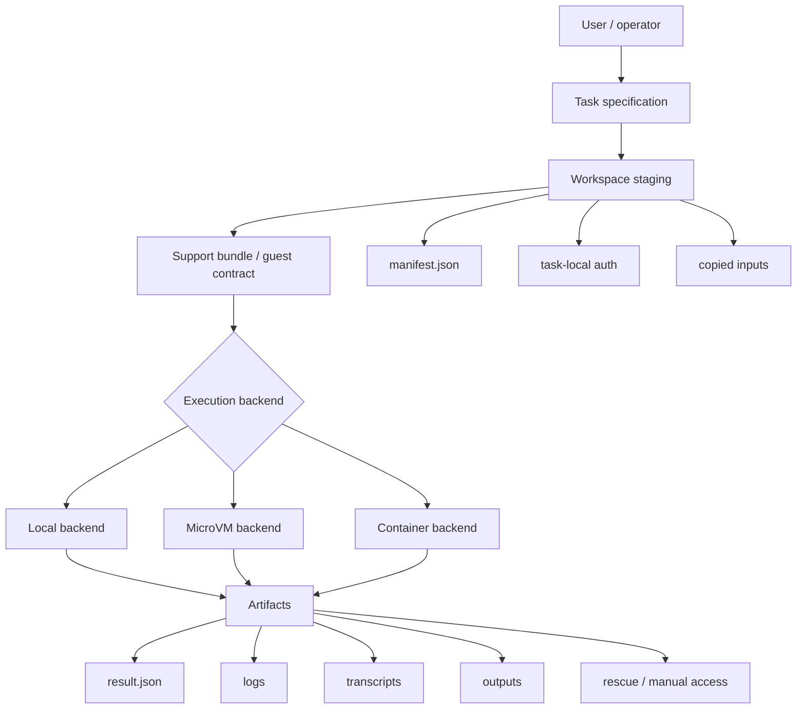
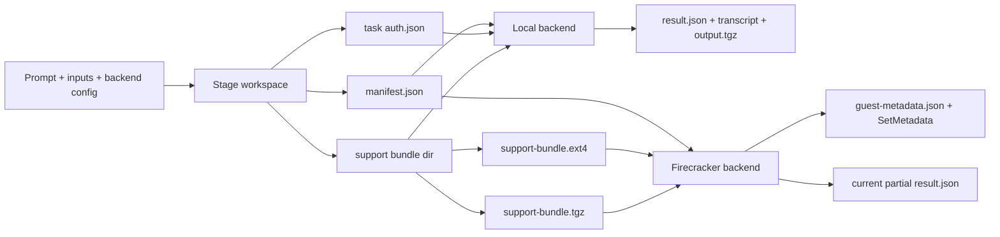

# Playbook: Building a Sandboxed Agent Runner with Go, Glazed, and Firecracker

This note preserves the reusable engineering pattern behind the `pi-sandbox` project: how to take an LLM coding agent that normally runs directly on a host machine and wrap it in a staged, inspectable, increasingly isolated task-execution system. The specific reference implementation is the repository at `/home/manuel/code/wesen/2026-04-17--pi-promox-lxc-setup`, but the goal of this note is broader than one repo. It is a guide for how to think about sandboxed agent execution as a system design problem.

The central lesson is that the hard problem is not “how do I launch a model?” The hard problem is “how do I turn an agent run into a reproducible, inspectable unit of work with explicit inputs, explicit auth, explicit artifacts, and a backend I can strengthen over time?” This playbook is about that transformation.

> [!summary]
> The durable pattern has four core rules:
> 1. define a task as a **staged filesystem contract**, not as an ad hoc process invocation
> 2. make the workspace and artifacts the **source of truth** for what happened
> 3. keep the execution backend behind a stable contract so you can evolve from local runs to microVM runs incrementally
> 4. move toward stronger isolation in **proven slices**, not in one speculative leap

## Why this note exists

Many agent systems begin life in the easiest possible form:

- take a prompt
- run the agent CLI
- let it see the repo
- hope the output is useful

That is often fine for personal experimentation, but it breaks down quickly when you need any of the following:

- to limit what files the agent is allowed to read
- to preserve exactly what prompt and auth were used
- to debug why a run failed after the fact
- to collect durable transcripts and outputs
- to move from host execution to something more isolated
- to leave a human operator a way to recover or intervene

At that point, the problem stops being “prompt engineering” and becomes a systems engineering problem. You need a **task substrate**.

This note exists because the `pi-sandbox` repo already demonstrates a strong version of that substrate, even though its Firecracker path is still incomplete. It shows how to stage the right contracts first, then evolve the backend.

## When to use this pattern

Use this pattern when:

- you have an existing agent CLI such as `pi` and want to wrap it in a safer execution environment
- you need repeatability, artifact capture, and debugging visibility
- you want to move gradually from local execution toward VM or container isolation
- you expect multiple future backends and do not want backend details to leak everywhere
- you need operator-facing rescue paths and explicit run bookkeeping

Do not use this pattern when:

- you only need a quick one-off script around an agent invocation
- the overhead of workspace staging and artifact management would be greater than the value of the task
- you are not prepared to maintain the execution contract as a real piece of software, not just a convenience wrapper

## The core mental model

The cleanest mental model is this:

> A sandboxed agent runner is a **task compiler**.
> It takes a loosely specified human intent and compiles it into a staged runtime environment, a backend-specific execution plan, and a durable artifact trail.

That is the most important idea in this entire note.

The agent runner is not just “a shell command that happens to call an LLM.” It is a system that transforms:

- prompt
- allowed inputs
- auth
- backend choice
- network/debug policy

into:

- a workspace
- a manifest
- a support bundle
- runtime logs
- transcripts
- outputs
- rescue information

Once you think in those terms, many design decisions become easier.

## The five-layer architecture

A strong sandboxed agent runner usually separates into five layers.

### 1. Task specification layer

This is the user-facing intent.

Typical fields:

- task ID
- title
- prompt or prompt file
- input directories
- provider/model
- backend
- auth source
- optional seeded secrets/configs
- network/debug policy

In `pi-sandbox`, this role is represented by `spec.TaskSpec` together with the CLI settings decoded in `cmd/pi-sandbox/commands/task/run.go`.

### 2. Workspace staging layer

This layer converts the task specification into a concrete filesystem tree.

Typical contents:

- copied prompt
- copied inputs
- fake home directory
- staged auth file
- output directory
- logs directory
- state directory
- manifest.json

In `pi-sandbox`, this is implemented in `internal/workspace/workspace.go`.

### 3. Guest contract / support bundle layer

This is the handoff contract between task preparation and task execution.

Typical contents:

- machine-readable plan file
- bootstrap script
- rescue instructions
- manual access notes
- copied prompt and supporting files

In `pi-sandbox`, this is `internal/tasksupport/support.go`.

### 4. Backend execution layer

This is where the system actually runs the task.

Backends might include:

- local process execution
- container runtime execution
- microVM execution
- remote worker execution

The crucial rule is that the backend should consume the same staged task contract rather than redefining the task model.

In `pi-sandbox`, the local backend is complete, while the Firecracker backend is in-progress.

### 5. Artifact and operator layer

This is what makes the system usable in reality.

It includes:

- result manifests
- logs
- transcripts
- rescue scripts
- manual inspection docs
- dry-run visibility
- status reporting

If this layer is weak, the system becomes impossible to debug once anything goes wrong.

## Architecture diagram



## The workspace-first rule

The first major engineering rule is this:

> Never let the backend be the first thing that defines the run.

Instead, define the run as a workspace first.

Why this matters:

- a workspace is inspectable even if execution never starts
- a workspace can be diffed, archived, and audited
- multiple backends can consume the same staged data
- support artifacts can be generated before the runtime exists
- dry-run behavior becomes meaningful, because it stages the same artifacts without side effects

This is one of the best ideas in `pi-sandbox`. The dry-run path is not fake. It stages a real workspace and lets you inspect exactly what would be executed.

## The support-bundle rule

The second major engineering rule is:

> Treat guest execution as a **bundle delivery problem** before you treat it as a process-launch problem.

This is subtle but powerful.

If you jump straight to “how do I run a command inside a VM?”, you usually end up inventing the guest-side contract and the runtime protocol at the same time. That tends to produce brittle systems.

A support bundle avoids this by letting you define, in advance:

- what files the guest needs
- what command the guest should run
- where input and output should live
- how auth should be copied into the guest home
- what rescue information a human should see

In `pi-sandbox`, the support bundle currently includes:

- `plan.json`
- `guest-bootstrap.sh`
- `manual-access.md`
- `rescue.sh`
- a prompt copy

That design generalizes well beyond this repo. If you are building any sandboxed agent runner, you probably want a similar bundle.

## The backend abstraction rule

The third major engineering rule is:

> The local backend should define semantics; stronger backends should preserve those semantics.

This is one of the easiest principles to violate. Teams often think the “real” backend is the sandbox backend, and the local backend is just a dev hack. In practice, the opposite is often true:

- the local backend is where you learn the real artifact contract
- the sandbox backend should imitate those semantics as closely as possible

In `pi-sandbox`, the local backend already defines the intended success contract:

- run `pi`
- preserve the JSONL session
- export the HTML transcript
- write `result.json`
- archive outputs

That is the semantic model the Firecracker backend should eventually match.

## The isolation ladder

A reusable way to think about agent sandboxing is as an isolation ladder.

### Level 0: raw host run

- agent sees the host filesystem directly
- auth is inherited from the real user environment
- little or no artifact discipline

Good for: experiments.

Bad for: repeatability and safety.

### Level 1: staged local run

- workspace is task-local
- inputs are copied or narrowed
- auth is staged explicitly
- outputs/logs/transcripts are preserved

Good for: stable semantics, debugability.

This is where `pi-sandbox` already succeeds.

### Level 2: process isolation with the same staged contract

- same workspace contract
- stronger runtime boundary
- still relatively easy to debug

This could be a container path or a local namespace path.

### Level 3: microVM with staged contract delivery

- guest sees only what is delivered into it
- support bundle is packaged as a guest-visible artifact
- runtime metadata becomes explicit
- logs and recovery become more important

This is where the Firecracker work in `pi-sandbox` is heading.

### Level 4: orchestrated remote execution

- tasks run on dedicated workers
- control plane and execution plane may be separate
- infra rendering and artifact plumbing matter much more

This is why the repo also includes Terraform and ArgoCD scaffolding.

## `pi-sandbox` as a concrete example

The project at `/home/manuel/code/wesen/2026-04-17--pi-promox-lxc-setup` is a good reference implementation for the first three levels of the ladder.

### What it already demonstrates well

- task-local workspace staging
- task-local auth staging from `~/.pi/agent/auth.json`
- a reusable support bundle
- a complete local execution path
- Firecracker host preflight
- booting a Firecracker guest through `firecracker-go-sdk`
- host-side guest metadata persistence and propagation
- support bundle delivery as both:
  - `.tgz` archive
  - `.ext4` read-only drive image

### What it does not yet demonstrate

- in-guest mount and use of the delivered support bundle
- in-guest `pi` execution
- artifact copy-back from guest to host
- finished lifecycle control semantics

That incompleteness is not a failure of the pattern; it is just where the implementation currently stops.

## Pattern shape in pseudocode

```text
func runTask(spec):
    workspace = stageWorkspace(spec)
    auth = stageProviderAuth(spec.authSource, spec.provider)
    supportBundle = buildSupportBundle(spec, workspace, auth)

    if spec.backend == "local":
        return runLocal(workspace, supportBundle, spec)

    if spec.backend == "firecracker":
        hostPlan = renderHostLaunchPlan(spec, supportBundle)
        preflight = runHostPreflight(hostPlan)
        if preflight.failed:
            return writeFailureResult(preflight)

        guestArtifacts = packageSupportBundleForGuest(supportBundle)
        runtime = bootMicroVM(spec, guestArtifacts)
        sendMetadata(runtime, workspace, supportBundle)

        // later slice:
        // mount support bundle in guest
        // run guest bootstrap
        // collect transcripts + outputs

        return writeCurrentResult(runtime)
```

## Data flow diagram



## The artifact discipline rule

Another reusable lesson is:

> The system should leave behind useful artifacts even when the task fails early.

This is a major difference between a research-grade tool and a production-worthy operator tool.

Good artifact discipline means:

- preflight failures still write logs and a partial result
- runtime failures still record socket/log/metrics paths
- incomplete guest launches still preserve metadata
- dry-runs still materialize enough state to inspect the contract

This is one of the most transferable ideas in the repo. Even an incomplete sandbox backend can be valuable if it is honest and artifact-rich.

## Firecracker-specific lessons

The Firecracker work in `pi-sandbox` exposes several general lessons that are valuable even outside this repo.

### 1. Booting the VM is not the same as executing the task

This sounds obvious, but it is the source of a lot of confusion. There are at least four separate milestones:

1. host preflight passes
2. VM starts
3. guest receives task artifacts and metadata
4. guest consumes them and runs the task

Many systems accidentally collapse these into one conceptual step and therefore overstate progress. Do not do that.

### 2. Delivery mechanism matters

A task bundle is only useful if the guest can actually consume it. In `pi-sandbox`, the project moved through several conceptual options:

- host-side staging only
- archive staging
- speculative metadata embedding (rolled back)
- ext4 image attachment as a read-only guest drive

The durable lesson is not “use ext4 images always.” The durable lesson is:

> choose a delivery mechanism the runtime already models concretely.

In this case, block devices were a better next step than speculative metadata transport.

### 3. Preflight is a product feature, not just a convenience

Preflight checks feel boring compared to runtime code, but they are often the highest-leverage operator feature in an early sandboxing system. A clean preflight result saves hours of confusing runtime debugging.

## Common failure modes

### Failure mode 1: backend-specific assumptions leak into the task model

This happens when the task spec starts containing fields that only exist because one backend needs them in a weird way.

Mitigation:

- keep task spec focused on user intent
- put backend translation logic in a backend-specific planner layer

`pi-sandbox` does this reasonably well with its Firecracker launch plan.

### Failure mode 2: the guest contract is undefined until too late

This happens when the team boots a VM first and only later tries to decide what should be mounted, copied, or executed.

Mitigation:

- define the support bundle early
- write the bootstrap contract before the guest delivery mechanism is finished

### Failure mode 3: dry-run is fake

A fake dry-run only prints what it might do. That is not enough.

Mitigation:

- dry-run should stage the real workspace and support artifacts
- only the final side-effecting process execution should be skipped

### Failure mode 4: results are process-centric instead of artifact-centric

This happens when success/failure is mostly a process exit code and the operator cannot reconstruct anything else.

Mitigation:

- write `result.json`
- preserve logs and transcript paths
- stage rescue and manual-access information

### Failure mode 5: “stronger sandbox” work outruns the evidence

This is a research-style failure mode: the implementation starts claiming guest delivery or metadata consumption before the runtime really supports it.

Mitigation:

- advance one proved slice at a time
- keep docs and tasks honest
- maintain a diary of what was actually validated

## Anti-patterns

Do not do these things unless you have a very strong reason.

### Anti-pattern 1: using the real user home directly

If the task runs with the host user’s real HOME, you lose the ability to reason clearly about:

- which auth/configs were used
- what session state belongs to the task
- what host state was mutated accidentally

### Anti-pattern 2: letting the backend generate the task contract implicitly

This makes the local backend and the VM backend drift immediately.

### Anti-pattern 3: hiding partial success behind vague messaging

A message like “VM launch failed” is not enough. You want paths, logs, and explicit status states.

### Anti-pattern 4: inventing delivery paths the runtime does not support yet

This is one of the most important lessons from the `pi-sandbox` evolution. If you need a guest-visible artifact, prefer a delivery path the platform already understands, such as an attached drive, over an imagined side channel.

## Recommended implementation sequence

If I were building a new project from scratch using this pattern, I would follow this order.

1. Define the task spec.
2. Implement workspace staging.
3. Implement provider auth staging.
4. Implement a support bundle.
5. Implement a complete local backend.
6. Define `result.json` and artifact paths.
7. Add dry-run.
8. Add host preflight for the sandbox backend.
9. Boot the sandbox guest.
10. Deliver the support bundle into the guest in a concrete way.
11. Only then run the guest bootstrap contract.
12. Only then add transcript and output copy-back.
13. Only then add richer lifecycle and operator controls.

That sequence is not arbitrary. It is ordered so every later step builds on a tested semantic contract.

## Working rules

> [!important]
> Build the task contract first, then the backend.

> [!important]
> Treat the workspace as the source of truth, not the process state.

> [!important]
> Keep the local backend as the semantic reference model.

> [!important]
> Move to stronger isolation in proven slices, and keep the docs honest about which slice is actually done.

## Applying the playbook to the current `pi-sandbox` repo

If a new intern were joining the project today, I would tell them to read the repo in this order:

1. `README.md`
2. `internal/spec/spec.go`
3. `internal/workspace/workspace.go`
4. `internal/auth/auth.go`
5. `internal/tasksupport/support.go`
6. `internal/pi/runner.go`
7. `cmd/pi-sandbox/commands/task/runner_local.go`
8. `cmd/pi-sandbox/commands/task/runner_backend.go`
9. `internal/firecracker/*.go`
10. the PI-001 and PI-002 ticket docs under `ttmp/`

That order works because it moves from the generic execution contract to the backend-specific details.

## Related project note

For the project-specific state of the actual repo, see:

- [[PROJ - pi-sandbox - Sandboxed Pi Runner and Firecracker Research Guide]]

That note is about this concrete repo. The current note is about the reusable engineering pattern behind it.