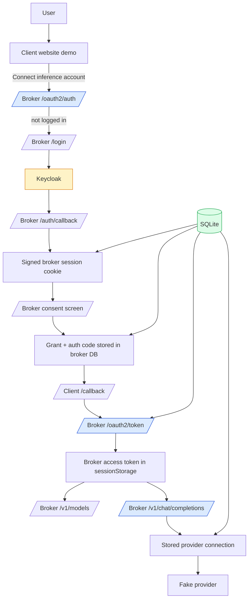

# BYOK Host

This project is the next foundational step in the BYOK broker story: it takes the earlier browser demo and replaces its demo-grade auth and persistence with a real local identity provider setup and a real persistence boundary. Concretely, that means the broker now logs users in through Keycloak running in Docker Compose, keeps its domain state behind a pluggable storage interface, and uses SQLite as the first persistent backend.

This note is written as an intern research guide. The goal is not just to tell you that the project works, but to help you understand **what problem the migration solved**, **which boundaries matter**, **where the important code lives**, and **how to verify the system end to end without re-deriving the architecture from scratch**.

> [!summary]
> The project currently has four important identities:
> 1. a **brokered BYOK inference demo** where websites never receive the raw provider key
> 2. a **Keycloak-backed broker login system** that replaces the old local login flow
> 3. a **broker-owned storage architecture** with memory and SQLite backends behind a shared interface
> 4. a **ticket-local migration workspace** that preserves the earlier browser UX while swapping out foundational auth and persistence layers

## Why this project exists

The earlier BYOK tickets already proved the product model:

- a user stores a provider credential in the broker,
- a third-party website gets a broker-scoped capability rather than the raw provider key,
- the website can run inference through the broker,
- the broker retains the authority to enforce consent, grants, and connection-specific policy.

What those earlier tickets did **not** prove was whether the model still works once the foundations become more realistic. The earlier demo used:

- a custom local login page,
- in-memory users,
- in-memory provider connections,
- in-memory grants,
- in-memory auth codes and access tokens.

That is fine for proving UX and product semantics, but it is not the right foundation for a persistent local environment or a more serious alpha architecture. This migration exists to answer a more practical engineering question:

**Can we keep the broker’s product boundary intact while replacing demo auth with Keycloak and replacing demo state with a pluggable persistent storage layer?**

The answer, as currently implemented, is yes.

## Suggested reading order for an intern

If you are new to this repo, read in this order:

1. **Ticket docs first**
   - `/home/manuel/code/wesen/2026-04-17--byok-host/ttmp/2026/04/17/BYOK-KEYCLOAK-STORAGE--integrate-keycloak-in-docker-compose-and-add-pluggable-storage-with-sqlite/design-doc/01-keycloak-integration-and-pluggable-storage-design.md`
   - `/home/manuel/code/wesen/2026-04-17--byok-host/ttmp/2026/04/17/BYOK-KEYCLOAK-STORAGE--integrate-keycloak-in-docker-compose-and-add-pluggable-storage-with-sqlite/reference/01-investigation-diary.md`
   - `/home/manuel/code/wesen/2026-04-17--byok-host/ttmp/2026/04/17/BYOK-KEYCLOAK-STORAGE--integrate-keycloak-in-docker-compose-and-add-pluggable-storage-with-sqlite/playbooks/01-local-keycloak-compose-workflow.md`
2. **Broker auth/session boundary**
   - `/home/manuel/code/wesen/2026-04-17--byok-host/ttmp/2026/04/17/BYOK-KEYCLOAK-STORAGE--integrate-keycloak-in-docker-compose-and-add-pluggable-storage-with-sqlite/scripts/byok-keycloak-demo/internal/auth/keycloak/oidc.go`
   - `/home/manuel/code/wesen/2026-04-17--byok-host/ttmp/2026/04/17/BYOK-KEYCLOAK-STORAGE--integrate-keycloak-in-docker-compose-and-add-pluggable-storage-with-sqlite/scripts/byok-keycloak-demo/internal/auth/keycloak/session.go`
3. **Storage abstraction and data model**
   - `/home/manuel/code/wesen/2026-04-17--byok-host/ttmp/2026/04/17/BYOK-KEYCLOAK-STORAGE--integrate-keycloak-in-docker-compose-and-add-pluggable-storage-with-sqlite/scripts/byok-keycloak-demo/internal/storage/interfaces.go`
   - `/home/manuel/code/wesen/2026-04-17--byok-host/ttmp/2026/04/17/BYOK-KEYCLOAK-STORAGE--integrate-keycloak-in-docker-compose-and-add-pluggable-storage-with-sqlite/scripts/byok-keycloak-demo/internal/storage/models.go`
   - `/home/manuel/code/wesen/2026-04-17--byok-host/ttmp/2026/04/17/BYOK-KEYCLOAK-STORAGE--integrate-keycloak-in-docker-compose-and-add-pluggable-storage-with-sqlite/scripts/byok-keycloak-demo/internal/storage/sqlite/store.go`
4. **Broker runtime and consent/token logic**
   - `/home/manuel/code/wesen/2026-04-17--byok-host/ttmp/2026/04/17/BYOK-KEYCLOAK-STORAGE--integrate-keycloak-in-docker-compose-and-add-pluggable-storage-with-sqlite/scripts/byok-keycloak-demo/internal/app/broker.go`
   - `/home/manuel/code/wesen/2026-04-17--byok-host/ttmp/2026/04/17/BYOK-KEYCLOAK-STORAGE--integrate-keycloak-in-docker-compose-and-add-pluggable-storage-with-sqlite/scripts/byok-keycloak-demo/internal/app/templates.go`
   - `/home/manuel/code/wesen/2026-04-17--byok-host/ttmp/2026/04/17/BYOK-KEYCLOAK-STORAGE--integrate-keycloak-in-docker-compose-and-add-pluggable-storage-with-sqlite/scripts/byok-keycloak-demo/internal/app/oauth.go`
5. **Operational startup path**
   - `/home/manuel/code/wesen/2026-04-17--byok-host/ttmp/2026/04/17/BYOK-KEYCLOAK-STORAGE--integrate-keycloak-in-docker-compose-and-add-pluggable-storage-with-sqlite/deploy/docker-compose.yaml`
   - `/home/manuel/code/wesen/2026-04-17--byok-host/ttmp/2026/04/17/BYOK-KEYCLOAK-STORAGE--integrate-keycloak-in-docker-compose-and-add-pluggable-storage-with-sqlite/deploy/keycloak/realm-byok.json`
   - `/home/manuel/code/wesen/2026-04-17--byok-host/ttmp/2026/04/17/BYOK-KEYCLOAK-STORAGE--integrate-keycloak-in-docker-compose-and-add-pluggable-storage-with-sqlite/scripts/run_tmux_keycloak_demo.sh`

If you only read three files, read `broker.go`, `oidc.go`, and `sqlite/store.go`.

## Current project status

The migration is no longer just a design. It has been implemented and validated.

### What works today

- Keycloak runs locally in Docker Compose with a seeded realm import
- the broker UI uses Keycloak OIDC login instead of a custom local login form
- the broker stores users mapped by Keycloak subject (`sub`)
- the broker persists:
  - users,
  - provider connections,
  - grants,
  - broker auth codes,
  - broker access tokens,
  - audit events
- storage is pluggable through a broker-owned interface
- two storage backends exist:
  - in-memory
  - SQLite
- the client website still performs Authorization Code + PKCE against the broker
- the broker still owns consent and connection selection
- the broker still calls the upstream provider with the stored provider key
- SQLite persistence survives a broker restart
- the local operator workflow has been browser-validated end to end

### What is intentionally still scoped as a demo

- the upstream provider is still a fake provider rather than a real vendor API
- secrets are persisted in SQLite for local/dev simplicity, not yet in a production secret store
- the implementation is ticket-local rather than extracted into a canonical app directory
- the client website token remains broker-issued rather than becoming a direct Keycloak audience-specific token model

### Honest one-sentence summary

The project now proves that the brokered BYOK browser flow survives the transition to Keycloak-backed login and SQLite-backed broker persistence without giving up the broker’s authority over consent, grants, and provider-key custody.

## Project shape

The code is intentionally concentrated inside the ticket workspace rather than spread across a production app layout. That makes the migration easier to review and easier to compare against the earlier demos.

### 1. Ticket docs and operator trail

Important docs live under:

- `ttmp/2026/04/17/BYOK-KEYCLOAK-STORAGE--integrate-keycloak-in-docker-compose-and-add-pluggable-storage-with-sqlite/`

That directory contains:

- design docs
- diary
- quick reference
- integration checklist
- playbook
- changelog

### 2. Demo application

The runnable demo lives here:

- `ttmp/2026/04/17/BYOK-KEYCLOAK-STORAGE--integrate-keycloak-in-docker-compose-and-add-pluggable-storage-with-sqlite/scripts/byok-keycloak-demo/`

Key parts:

- `cmd/` — Glazed/Cobra entrypoints
- `internal/app/` — broker, client site, provider, templates, OAuth helpers
- `internal/auth/keycloak/` — OIDC login + signed session cookie helpers
- `internal/storage/` — storage interfaces, models, memory store, SQLite store

### 3. Local infrastructure

Keycloak deployment files live under:

- `deploy/docker-compose.yaml`
- `deploy/keycloak/realm-byok.json`

### 4. Operator scripts and runtime outputs

- `scripts/run_tmux_keycloak_demo.sh`
- `scripts/cleanup_keycloak_demo.sh`
- `various/broker.db`
- `various/tmux-logs/*.log`

## Core mental model

An intern should understand the system in this order.

### 1. Keycloak is the login system, not the product authorization system

Keycloak tells the broker who the user is.

It does **not** decide:

- which provider connection a website may use,
- which scopes a site has for inference,
- which models are allowed,
- whether a grant has been revoked,
- which provider key gets attached to an upstream call.

Those are broker-owned decisions.

### 2. The broker is still the authority over provider-key use

The browser-visible client site never gets the raw provider key. Instead:

- the user logs into the broker through Keycloak,
- the user creates a stored provider connection in the broker,
- the user authorizes a client website against that connection,
- the broker issues a broker-scoped access token,
- the client website calls the broker,
- the broker uses the stored provider key on the server side.

### 3. Storage is a domain boundary, not a database convenience layer

The project deliberately defines storage around domain concepts:

- broker users,
- connections,
- grants,
- auth codes,
- access tokens,
- audit events.

SQLite is just one implementation of those concepts.

### 4. The browser flow is actually two auth stories layered together

There are two separate but connected flows:

1. **Broker user login** — Keycloak OIDC login used by the broker web dashboard
2. **Website delegation** — broker-owned Authorization Code + PKCE flow used by the client website

That split is the core architectural idea of the project.

## Architecture



The most important thing to notice is that Keycloak sits on the **broker login** side of the diagram, not on the **provider credential custody** side.

## Implementation details

This is the section to read if you want to understand how the repo actually works.

### 1) The storage model is intentionally broker-shaped

The storage interfaces are defined in `internal/storage/interfaces.go` and cover five domains:

- `UserStore`
- `ConnectionStore`
- `GrantStore`
- `OAuthArtifactStore`
- `AuditStore`

That gives the broker one composed `Store` interface rather than sprinkling direct SQL assumptions through the runtime.

The core data model in `internal/storage/models.go` is small but important:

```go
type BrokerUser struct {
    ID                string
    KeycloakSubject   string
    PreferredUsername string
    Email             string
}

type Connection struct {
    ID            string
    UserID        string
    Provider      string
    DisplayName   string
    APIKey        string
    AllowedModels []string
}

type Grant struct {
    ID            string
    UserID        string
    ClientID      string
    ConnectionID  string
    Scopes        []string
    AllowedModels []string
}
```

The subtle but important addition compared to the earlier demo is that auth artifacts are also persisted:

- `AuthCode`
- `AccessToken`

That matters because the broker still owns the website-facing OAuth layer.

### 2) The broker runtime chooses the storage backend, not the storage package itself

One real implementation mistake happened during the migration and is worth remembering. The first attempt added a parent-package `open.go` that imported both the `memory` and `sqlite` subpackages. That created an import cycle because the subpackages already depend on the shared `storage` package for interfaces and models.

The fix was architectural as much as mechanical: backend selection moved into the runtime layer in `internal/app/broker.go`.

Pseudocode:

```go
func openStore(cfg BrokerConfig) (storage.Store, error) {
    switch cfg.StorageDriver {
    case "", "memory":
        return storagememory.New(), nil
    case "sqlite":
        return storagesqlite.Open(cfg.StorageSQLitePath)
    default:
        return nil, fmt.Errorf("unknown storage driver")
    }
}
```

The lesson is simple: **the interface-defining parent package should not import the backend implementations that themselves import the parent package**.

### 3) Keycloak login is a broker session bootstrap, not the whole app auth model

`internal/auth/keycloak/oidc.go` builds a small server-side OIDC integration around `go-oidc` and `oauth2`.

The flow is:

1. `/login` creates:
   - an OIDC state token,
   - an OIDC nonce,
   - a short-lived `return_to` cookie
2. the browser is redirected to Keycloak
3. `/auth/callback` verifies:
   - state,
   - nonce,
   - ID token,
   - claims
4. the broker writes its own signed session cookie
5. the broker redirects back to the original in-app target

That last step matters. During validation there was a real bug where starting from the client website while logged out would send the user through Keycloak but then dump them at `/app` instead of returning them to the original broker consent URL. The fix was to store `return_to` in a short-lived broker cookie and clear it on callback.

That detail is easy to miss and very worth remembering if you ever rework this flow.

### 4) The client site still uses broker-owned Authorization Code + PKCE

The earlier design decision survived implementation: the client website does **not** directly become a Keycloak client for provider access.

Instead, the broker still exposes:

- `/oauth2/auth`
- `/oauth2/approve`
- `/oauth2/deny`
- `/oauth2/token`

That lets the broker enforce its own consent semantics:

- which stored connection is selected,
- which scopes the site receives,
- which models are allowed,
- whether a grant is active or revoked.

Pseudo-flow:

```go
if user not logged in:
    redirect to /login?return_to=<original oauth2/auth URL>

show consent screen
select connection
create grant
store short-lived auth code
redirect browser client back to redirect_uri?code=...

on /oauth2/token:
    consume auth code
    verify redirect_uri and client_id
    verify PKCE code_verifier
    load grant and connection
    mint broker access token
    persist token in storage
```

This is the core reason the broker still needs auth-code and access-token tables even after adopting Keycloak.

### 5) SQLite persistence was verified operationally, not just structurally

The project did not stop at `go build ./...`. It was validated in a browser and then verified through a broker restart.

The validated path was:

1. start Keycloak, provider, broker, and client
2. log in as `alice`
3. add a stored provider credential in the broker dashboard
4. authorize the client site
5. complete PKCE token exchange
6. load models through the broker
7. send chat through the broker
8. inspect `various/broker.db`
9. restart only the broker process
10. confirm the dashboard still shows the connection and grant
11. confirm the client can still send chat through the broker

This is the kind of validation that proves the architectural migration actually landed.

## Current user-facing commands

### Build the ticket-local demo

```bash
cd /home/manuel/code/wesen/2026-04-17--byok-host/ttmp/2026/04/17/BYOK-KEYCLOAK-STORAGE--integrate-keycloak-in-docker-compose-and-add-pluggable-storage-with-sqlite/scripts/byok-keycloak-demo
go build ./...
```

### Start the validated local stack

```bash
cd /home/manuel/code/wesen/2026-04-17--byok-host/ttmp/2026/04/17/BYOK-KEYCLOAK-STORAGE--integrate-keycloak-in-docker-compose-and-add-pluggable-storage-with-sqlite/scripts
./run_tmux_keycloak_demo.sh
```

### Stop it

```bash
cd /home/manuel/code/wesen/2026-04-17--byok-host/ttmp/2026/04/17/BYOK-KEYCLOAK-STORAGE--integrate-keycloak-in-docker-compose-and-add-pluggable-storage-with-sqlite/scripts
./cleanup_keycloak_demo.sh
```

### Override the Keycloak host port explicitly

```bash
KEYCLOAK_PORT=38080 ./run_tmux_keycloak_demo.sh
```

### Inspect persisted SQLite state

```bash
sqlite3 /home/manuel/code/wesen/2026-04-17--byok-host/ttmp/2026/04/17/BYOK-KEYCLOAK-STORAGE--integrate-keycloak-in-docker-compose-and-add-pluggable-storage-with-sqlite/various/broker.db \
  ".tables" \
  ".mode column" \
  "select 'broker_users' as table_name, count(*) as count from broker_users \
   union all select 'connections', count(*) from connections \
   union all select 'grants', count(*) from grants \
   union all select 'auth_codes', count(*) from auth_codes \
   union all select 'access_tokens', count(*) from access_tokens \
   union all select 'audit_events', count(*) from audit_events;"
```

## Important project docs

- `/home/manuel/code/wesen/2026-04-17--byok-host/ttmp/2026/04/17/BYOK-KEYCLOAK-STORAGE--integrate-keycloak-in-docker-compose-and-add-pluggable-storage-with-sqlite/design-doc/01-keycloak-integration-and-pluggable-storage-design.md`
- `/home/manuel/code/wesen/2026-04-17--byok-host/ttmp/2026/04/17/BYOK-KEYCLOAK-STORAGE--integrate-keycloak-in-docker-compose-and-add-pluggable-storage-with-sqlite/reference/01-investigation-diary.md`
- `/home/manuel/code/wesen/2026-04-17--byok-host/ttmp/2026/04/17/BYOK-KEYCLOAK-STORAGE--integrate-keycloak-in-docker-compose-and-add-pluggable-storage-with-sqlite/reference/02-keycloak-and-storage-quick-reference.md`
- `/home/manuel/code/wesen/2026-04-17--byok-host/ttmp/2026/04/17/BYOK-KEYCLOAK-STORAGE--integrate-keycloak-in-docker-compose-and-add-pluggable-storage-with-sqlite/playbooks/01-local-keycloak-compose-workflow.md`
- [[ARTICLE - Brokered BYOK with Keycloak and SQLite - A Technical Deep Dive]]

## Open questions

- Should the long-term client website token eventually become more directly aligned with Keycloak audiences and resource servers, or is the current broker-issued token model exactly the right abstraction?
- Should provider secrets stay in SQLite for local/dev only and move behind an encryption or external secret-store boundary in the next phase?
- When should this ticket-local demo be extracted into a more canonical repo location?
- Should there be automated browser/integration tests for the OIDC + consent + token-exchange path?

## Near-term next steps

- extract the most stable code into a canonical app layout once the prototype boundary is no longer useful
- add automated integration coverage for login, consent, token exchange, and persistence
- decide whether to keep one unified store interface or split auth artifacts from longer-lived domain state
- replace the fake provider with the first real provider adapter only after the current boundaries remain stable

## Project working rule

> [!important]
> Do not let Keycloak absorb broker-specific authorization concepts just because it already handles identity. The broker should continue to own provider connections, consent, grants, and inference-time authorization.
