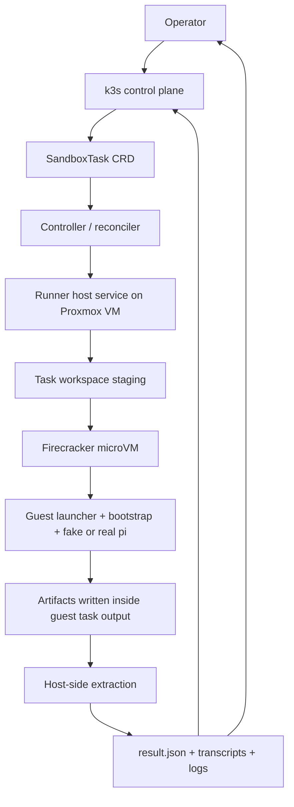
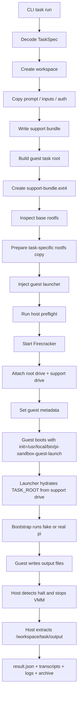

# pi-sandbox Intern Report

This note is the most detailed project-oriented explanation of the `pi-sandbox` repository as it exists today. It is written for a future intern who needs to understand not just what files exist, but what problem the project is solving, what has actually been proven, what has only been scaffolded, why some parts were built in a particular order, and what work should happen next.

The shortest truthful description is this: `pi-sandbox` is becoming a three-plane system for submitting, executing, and recovering sandboxed `pi` tasks. The repo already has a real execution substrate, a real Firecracker backend, real Proxmox runner-host bring-up, and a real nested smoke using a fake `pi` guest. What it does **not** yet have is the finished k3s control-plane loop where CRDs are reconciled into runner-host work. That next step is now becoming explicit work rather than an implied future.

> [!summary]
> The project currently has four important realities:
> 1. it already has a **working task substrate**: prompt staging, input copying, auth staging, workspace creation, result manifests, transcripts, and rescue artifacts
> 2. it already has a **working execution-plane prototype**: local backend and Firecracker backend, including nested Firecracker validation inside Proxmox VM `912`
> 3. it is now clearly aiming for a **k3s control plane** built around CRDs and a controller rather than ad hoc CLI-only execution
> 4. fake-`pi` is currently a feature, not a bug, because it lets us validate the platform architecture before we entangle it with provider/runtime complexity

## Why this project exists

The root problem is that the normal `pi` CLI is powerful but operationally sloppy if you care about isolation, repeatability, debugging, or auditability. A raw agent run on a host machine tends to blur together:

- which prompt was actually used
- which files the agent could read
- where auth came from
- what outputs were created
- what transcript survives afterward
- how an operator should inspect or recover a failed run

`pi-sandbox` exists to turn that fuzzy workflow into a real task system. In the intended end state, a task is no longer “someone ran an agent command.” A task is a first-class object with:

- explicit inputs
- explicit auth staging
- explicit workspace layout
- explicit backend choice
- explicit runtime logs
- explicit artifacts
- explicit recovery paths
- eventually explicit control-plane ownership in k3s

This is why the repo feels more like a systems project than a mere CLI wrapper. The real product is not “a command.” The real product is a contract between operators, the control plane, a runner host, a guest microVM, and the artifact trail left behind afterward.

## The simplest mental model

An intern should understand the project in this order:

1. **A task is compiled into a workspace before it is executed.**
2. **The workspace is the source of truth for what the task really was.**
3. **A backend consumes that staged workspace.**
4. **Artifacts are collected back onto the host.**
5. **Eventually k3s will own task records and status through CRDs.**

That means the project is best thought of as a **task compiler plus execution system**.

A human supplies:

- prompt
- allowed inputs
- auth source
- backend choice
- maybe future policy/debug settings

The system turns that into:

- a structured task workspace
- a support bundle / guest contract
- a backend-specific launch plan
- a guest runtime
- result and artifact manifests

## What has actually been built so far

A lot more exists than a quick skim might suggest.

### Working CLI and task substrate

The repo already contains a Glazed/Cobra Go CLI named `pi-sandbox` with working commands under:

- `cmd/pi-sandbox/commands/task/`
- `cmd/pi-sandbox/commands/infra/`

The task path stages:

- prompt files
- copied input directories
- task-local MiniMax auth from `~/.pi/agent/auth.json`
- a fake task home directory
- output/log/state directories
- a result manifest
- support and rescue artifacts

This work is implemented primarily in:

- `internal/workspace/workspace.go`
- `internal/auth/auth.go`
- `internal/pi/runner.go`
- `internal/tasksupport/support.go`
- `internal/spec/spec.go`

### Working local backend

There is a complete local backend that runs `pi` on the host against the staged task workspace. That backend captures:

- session JSONL
- exported transcript HTML
- transcript text
- output archive
- result manifest

This path matters because it proves that the task/workspace/artifact model is not theoretical. The local backend is the first real execution path and still acts as the baseline for semantics and tests.

### Firecracker backend implemented in code

The Firecracker path is no longer just a boot demo.

The repo now contains code for:

- host preflight validation
- Firecracker launch-plan rendering
- runtime startup via `firecracker-go-sdk`
- metadata propagation into the guest-facing contract
- support-bundle archive staging
- support-bundle ext4 image creation
- task-specific rootfs preparation
- guest launcher injection into the rootfs copy
- guest bootstrap execution through `init=/usr/local/bin/pi-sandbox-guest-launch`
- guest artifact extraction back to the host workspace

This work is centered in:

- `internal/firecracker/plan.go`
- `internal/firecracker/preflight.go`
- `internal/firecracker/runtime.go`
- `internal/firecracker/rootfs.go`
- `internal/firecracker/metadata.go`
- `cmd/pi-sandbox/commands/task/runner_backend.go`
- `cmd/pi-sandbox/commands/task/run.go`

### Proxmox and nested Firecracker runner bring-up

The project now also has real infrastructure bring-up work for a dedicated runner host.

The important current reality is:

- Proxmox host: `root@pve`
- dedicated nested-KVM runner VM: **VM 912**
- VM 912 role: Firecracker-capable runner host for nested validation

That work includes:

- Terraform and cloud-init scaffolding under `deploy/terraform/proxmox-agent-vm/`
- ticket-local scripts for provisioning and verification
- guest-agent based verification and repair
- staged upstream Firecracker demo assets inside VM 912
- repo-level nested smoke tests using the repo’s own Firecracker backend

### Nested repo-level smoke using fake-`pi`

This is one of the most important proven milestones in the whole project.

Inside VM 912, the repo’s own Firecracker backend was exercised with:

- a staged local `pi-sandbox` binary
- a Firecracker guest rootfs
- a fake `pi` executable inside that guest

That smoke validated the loop:

1. host stages workspace and guest contract
2. Firecracker launches inside VM 912
3. guest boots
4. fake `pi` executes
5. guest halts
6. host extracts artifacts back out
7. final task result returns `status=complete`

That means the execution-plane mechanics are now real enough to support further platform work without waiting for a production-grade guest image.

## What is proven today vs. what is not

This distinction matters more than almost any code detail.

### Proven today

The following statements are supported by code, tests, and/or real validation artifacts:

- the repo can stage a real task workspace
- the repo can run tasks through a local backend
- the repo can generate support bundles and rescue artifacts
- the Firecracker backend can boot a guest using a task-specific rootfs copy
- the guest launcher and support-bundle delivery path work in the current design
- guest outputs can be extracted back to the host workspace
- nested Firecracker works inside VM 912
- the repo’s own Firecracker backend can complete a nested smoke in VM 912 using fake `pi`

### Not yet proven today

The following items are still future work or only partially scaffolded:

- a real k3s CRD-driven task submission flow
- a real controller that reconciles `SandboxTask` objects on the cluster
- a real long-running runner service/agent contract between control plane and runner host
- a production-grade guest image containing the actual `pi` runtime and its dependencies
- the full artifact-plane publication story beyond host workspaces and current manifests
- operator-facing task listing and control surfaces in k3s

In other words: the **execution plane is much farther along than the control plane**.

## The three-plane architecture

The best durable architecture for the project is now explicit.

### 1. Control plane

The control plane belongs on the existing k3s cluster and should eventually be deployed via ArgoCD from this repo.

Its responsibilities are:

- defining task objects
- persisting task intent and status
- reconciling desired state into execution requests
- surfacing status and artifacts to operators
- owning stop/retry/debug actions later

### 2. Execution plane

The execution plane belongs on a dedicated Linux runner host with `/dev/kvm`, Firecracker installed, and enough local disk to stage task workspaces.

Its responsibilities are:

- materialize the workspace
- stage auth and inputs
- launch Firecracker locally
- capture runtime logs
- collect artifacts after guest completion
- preserve enough state for rescue and debugging

### 3. Artifact plane

The artifact plane preserves the outputs of execution in a way the control plane and humans can inspect.

Its responsibilities are:

- result manifests
- session JSONL
- transcript HTML/text
- runtime logs
- support bundles
- rescue instructions
- partial-failure evidence

### Architecture diagram

The important conceptual boundary is this: **k3s should own intent and status; the runner host should own execution.**

## Why fake-`pi` is the correct temporary choice

It is tempting to think fake `pi` is a hack. In reality, it is currently a smart testing strategy.

If we introduced the real `pi` guest path too early, we would entangle platform validation with:

- provider auth problems
- missing guest packages
- rootfs userland differences
- export behavior edge cases
- network configuration questions
- MiniMax/runtime changes

That would make it much harder to answer the most important platform question:

> can the system create a task, launch the sandbox, run the guest contract, and return artifacts?

Fake `pi` lets us answer that clearly.

The right order is:

1. prove the platform with fake `pi`
2. prove the real guest image later
3. only then worry about production service hardening

This is the same principle as using stubs or fake services in a distributed system bring-up. The point is to isolate architectural risk first.

## What VM 912 is and what it is not

VM 912 is currently a dedicated nested-KVM Firecracker runner host.

It **is**:

- a place to validate Firecracker and the repo’s backend under realistic host conditions
- the prototype execution-plane host
- the place where future runner-service work will likely start

It is **not yet**:

- the k3s control plane
- the CRD controller
- a finished long-running runner daemon with a stable API

This distinction matters because it shapes the next implementation slices.

## Why the next step is the CRD controller skeleton

The repo began bottom-up, which was the right call. It is easier to build a believable control plane once the execution substrate is real than the other way around.

Now that the execution plane has a real nested smoke, the next safe move is to shift focus upward and give k3s a real first-class task object.

That means the next important milestone is not “more Firecracker cleverness.” It is:

- define a `SandboxTask` CRD
- define its spec and status model
- build an in-cluster controller skeleton
- make the controller own task lifecycle semantics before it owns full runner integration

This creates the right long-term architecture without requiring the whole distributed system to be finished at once.

## Current ticket map

As of now, the project is best understood through the ticket split.

### PI-001 — overall platform design

This is the umbrella design ticket. It captures the big-picture architecture and ticket map.

### PI-002 — Firecracker guest launch and lifecycle control

This is the deepest implementation ticket so far. It owns the executable Firecracker path and nested Proxmox validation work.

### PI-003 — backplane control plane

This is the broader control-plane ticket for the k3s/ArgoCD layer.

### PI-004 — runner service

This is the future long-running runner-host service that will eventually accept dispatched work.

### PI-005 — artifact plane

This is the future work that will make artifacts and recovery flows more durable and operator-facing.

### New direction now emerging

The next slice should carve a more concrete first step out of the control-plane work: the **k3s CRD and controller skeleton**. That gives the control plane a real shape before the VM runner-service contract is fully integrated.

## The current repository shape

A future intern should read the repo in this order.

### 1. Start at the top-level user/documentation surface

- `README.md`
- `ttmp/2026/04/17/PI-001-.../index.md`
- `ttmp/2026/04/17/PI-002-.../index.md`

### 2. Understand the task CLI entrypoints

- `cmd/pi-sandbox/main.go`
- `cmd/pi-sandbox/commands/task/root.go`
- `cmd/pi-sandbox/commands/task/run.go`
- `cmd/pi-sandbox/commands/task/runner_backend.go`
- `cmd/pi-sandbox/commands/task/runner_local.go`

### 3. Understand the shared substrate

- `internal/spec/spec.go`
- `internal/workspace/workspace.go`
- `internal/auth/auth.go`
- `internal/tasksupport/support.go`

### 4. Understand the Firecracker implementation

- `internal/firecracker/plan.go`
- `internal/firecracker/preflight.go`
- `internal/firecracker/runtime.go`
- `internal/firecracker/rootfs.go`
- `internal/firecracker/metadata.go`

### 5. Understand the infra rendering layer

- `internal/infra/render.go`
- `deploy/terraform/proxmox-agent-vm/`
- `deploy/firecracker/host/`
- `deploy/k8s/pi-sandbox/`

### 6. Then read the ticket docs and diary material

The ticket docs are not optional side notes. They are part of the project memory.

## Implementation details: how one Firecracker task works today

The current Firecracker path can be explained as a linear pipeline.

### Why the launcher injection exists

The project currently injects `/usr/local/bin/pi-sandbox-guest-launch` into a task-specific copy of the rootfs. This is a grounded intermediate design that avoids prematurely baking a large permanent guest image contract while still making guest execution deterministic.

That approach has tradeoffs:

- good: per-task reproducibility and low coupling to a canonical image build process
- bad: some lifecycle details become more dynamic and therefore more complex to inspect

This is one of the architectural decisions that may change later, but it was a good decision for getting to a working execution loop quickly.

### Why host-side artifact extraction matters

The current design extracts guest outputs back to the host with host-side image inspection/extraction tools rather than depending on guest networking first. That is important because it keeps the first end-to-end artifact loop independent from TAP/NAT/SSH design.

This is a recurring pattern in the repo: solve the minimum credible contract first, then add convenience later.

## What was hard and what was learned

Several lessons shaped the current state.

### 1. Workspace-first was the right foundation

Because task staging was already explicit, later work on Firecracker did not need to invent task semantics from scratch.

### 2. Support-bundle delivery was a better next slice than speculative metadata hacks

The repo briefly approached guest delivery questions through metadata transport speculation, but the durable path became “attach a real drive image the guest can mount.” That was more concrete and easier to debug.

### 3. Guest completion is not the same thing as VMM process exit

During nested VM validation, the guest could clearly print output and halt while the Firecracker process still appeared alive from the host’s point of view. That forced a more honest host completion strategy based on observed guest halt markers and explicit VMM shutdown.

### 4. Proxmox guest-agent based validation is good enough for early bring-up

Direct SSH is not yet the most reliable control path for the runner VMs. That is annoying, but it is not fatal. Early bring-up can still proceed through `qm guest exec` while better operator paths are designed.

### 5. Fake `pi` lowers ambiguity dramatically

It made the first nested end-to-end validation feasible by removing unrelated runtime variables.

## Important project docs

Repo-local and ticket-local documents worth reading in order:

- `/home/manuel/code/wesen/2026-04-17--pi-promox-lxc-setup/README.md`
- `/home/manuel/code/wesen/2026-04-17--pi-promox-lxc-setup/ttmp/2026/04/17/PI-001-PI-AGENT-SANDBOX--design-a-sandboxed-pi-agent-runner-with-minimax--design-a-sandboxed-pi-agent-runner-with-minimax/design-doc/02-control-plane-execution-plane-and-artifact-plane-architecture-and-ticket-map.md`
- `/home/manuel/code/wesen/2026-04-17--pi-promox-lxc-setup/ttmp/2026/04/17/PI-002-PI-AGENT-FIRECRACKER-GUEST-LAUNCH--firecracker-guest-launch-and-lifecycle-control/design-doc/01-firecracker-guest-launch-implementation-plan.md`
- `/home/manuel/code/wesen/2026-04-17--pi-promox-lxc-setup/ttmp/2026/04/17/PI-002-PI-AGENT-FIRECRACKER-GUEST-LAUNCH--firecracker-guest-launch-and-lifecycle-control/reference/02-diary.md`

Related vault notes:

- [[PROJ - pi-sandbox - Sandboxed Pi Runner and Firecracker Research Guide]]
- [[ARTICLE - Playbook - Building a Sandboxed Agent Runner with Go Glazed and Firecracker]]

## Open questions

The current big open questions are no longer about “can Firecracker boot?” They are more architectural.

- What should the first `SandboxTask` CRD spec look like?
- What should the first status state machine look like?
- Should the first controller be purely in-cluster and only manage status, or should it also own a stub dispatch path immediately?
- What is the cleanest first boundary between the future controller and the future runner-host service?
- When should the project switch from fake `pi` to a production guest image with the real `pi` runtime?
- How should artifacts be surfaced back through the control plane once the CRD path exists?

## Near-term next steps

The near-term implementation order now looks like this.

1. create a new focused ticket for the k3s CRD/controller slice
2. define the `SandboxTask` API shape and state machine in a design doc
3. scaffold the controller in-cluster without forcing full runner-host integration yet
4. only after that, build the runner-host service contract that the controller will call
5. keep fake `pi` until the full control loop is stable enough that real-guest complexity will not obscure platform issues

## Project working rule

> [!important]
> Keep architectural truth ahead of integration speed.
> A fake execution path that proves the real platform loop is better than a “real” path that hides where failures actually come from.

## If I were onboarding to this project tomorrow

I would follow this exact reading and validation sequence.

1. Read `README.md`.
2. Read the PI-001 architecture ticket map.
3. Read the PI-002 index, design doc, and diary.
4. Run `go test ./...` in the repo.
5. Run a local dry-run task to inspect the workspace shape.
6. Read `internal/tasksupport/support.go` and `internal/firecracker/rootfs.go` together.
7. Read the VM 912 provisioning and smoke scripts under the PI-002 ticket.
8. Only then start the k3s CRD/controller work.

That order mirrors how the project itself was successfully discovered: substrate first, execution proof second, control plane third.
