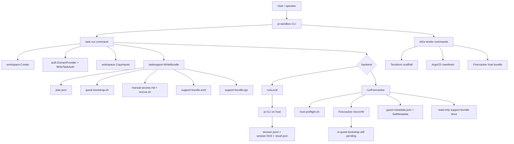
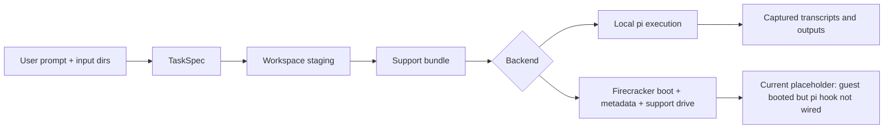

# pi-sandbox

This project is a Go-based runner and infrastructure scaffold for executing `pi` tasks inside a controlled sandbox, with MiniMax authentication staged automatically, transcripts preserved, and enough structure around the run that an operator can inspect, replay, debug, and eventually intervene. The current repository already supports a complete **local** execution path and a partially implemented **Firecracker** path that can boot a guest microVM, attach a support-bundle drive, and propagate runtime metadata, but does not yet execute the in-guest `pi` hook.

The simplest way to think about the project is: it is trying to turn an ad hoc “run `pi` on my machine” workflow into a **reproducible task execution system**. A task should have a prompt, an explicit set of allowed inputs, a staged auth file, a dedicated workspace, a transcript, output artifacts, rescue instructions, and a backend that can evolve from local execution into a real microVM sandbox.

> [!summary]
> The project currently has three important identities:
> 1. a **task runner** that stages prompts, inputs, auth, workspaces, transcripts, and outputs for `pi`
> 2. an **infra renderer** that emits Terraform, ArgoCD, and Firecracker host artifacts for the broader deployment story
> 3. a **sandbox evolution path** from a working local backend to a Firecracker-based microVM backend with explicit runtime contracts and operator visibility

## Why this project exists

The motivating problem is straightforward: the normal `pi` CLI is powerful, but a raw interactive run on the host machine is a poor fit when the user wants isolation, repeatability, or auditability. In practice, there are several related needs:

- limit what files the agent can read by staging only selected input directories
- keep provider auth explicit and task-local rather than implicitly shared from the host
- preserve the raw session JSONL and exported transcript as durable artifacts
- leave behind a structured workspace that another human can inspect after the run
- support a future path to stronger isolation than “just run locally in a temp directory”
- integrate with the user’s actual environment: Proxmox on `root@pve`, a k3s cluster, Terraform, and ArgoCD

The repo exists because these concerns are easier to reason about when they are separated into explicit layers:

1. **task specification** — prompt, inputs, provider, backend, network policy
2. **workspace materialization** — filesystem layout, copied inputs, prompt file, staged auth, manifest
3. **execution backend** — local today, Firecracker in progress
4. **artifact capture** — transcripts, result manifest, logs, archives
5. **infrastructure scaffolding** — the deployment path for the host and control plane

That separation is the project’s main architectural idea. A task is not “some command line invocation.” A task is a structured object that can be staged, executed, inspected, and eventually scheduled.

## Current project status

The repo is well past the “design only” phase. It already contains working code, tests, and ticket documentation for the first meaningful slices.

### What works today

- a Go CLI named `pi-sandbox`
- Glazed/Cobra command wiring for task execution and infra rendering
- workspace creation under a dedicated run directory
- input directory copying into a task-local `input/` tree
- MiniMax auth extraction from `~/.pi/agent/auth.json`
- task-local auth writing to `home/.pi/agent/auth.json`
- a complete local backend that runs `pi`, exports a transcript, and archives outputs
- a support-bundle generator that writes:
  - `plan.json`
  - `guest-bootstrap.sh`
  - `manual-access.md`
  - `rescue.sh`
  - `prompt.md`
- Firecracker host preflight rendering and execution
- Firecracker guest boot via `firecracker-go-sdk`
- Firecracker runtime metadata propagation
- support-bundle archival to `state/support-bundle.tgz`
- support-bundle materialization as a read-only ext4 image `state/support-bundle.ext4`
- attachment of that image as an additional Firecracker guest-visible drive
- task result reporting for logs, runtime state, and support-bundle artifacts

### What is still incomplete

- the guest does **not** yet mount and consume the support-bundle drive
- the guest does **not** yet execute the `guest-bootstrap.sh` contract
- the Firecracker backend does **not** yet run `pi` inside the VM
- the Firecracker backend does **not** yet copy transcripts and outputs back from guest to host
- guest networking / MMDS reachability is not yet a complete, explicit design
- lifecycle controls are still shallow compared to the long-term vision

### Honest current state in one sentence

The repo already proves that it can stage tasks, run them locally, and boot a Firecracker microVM with attached task artifacts — but it has **not yet closed the loop** on in-guest execution.

## Project shape

At a high level, the repository has four major areas.

1. **CLI entrypoints**
   - `cmd/pi-sandbox/main.go`
   - `cmd/pi-sandbox/commands/task/`
   - `cmd/pi-sandbox/commands/infra/`
2. **execution internals**
   - `internal/auth/`
   - `internal/workspace/`
   - `internal/pi/`
   - `internal/tasksupport/`
   - `internal/firecracker/`
   - `internal/spec/`
3. **rendered deployment artifacts**
   - `deploy/terraform/...`
   - `deploy/k8s/...`
   - `deploy/firecracker/host/...`
4. **research and implementation tickets**
   - `ttmp/2026/04/17/PI-001-...`
   - `ttmp/2026/04/17/PI-002-...`

The code is intentionally split so that “what a task is” is separate from “how a task runs.” That is what makes the backend abstraction meaningful.

## Core mental model

An intern should understand the system in this order.

### 1. A task is staged before it is executed

The project does not call `pi` directly against arbitrary host paths. It first constructs a dedicated workspace containing:

- a copied prompt file
- copied input directories
- a manifest of task settings
- a staged task-local auth file
- logs/output/state directories
- a support bundle describing how the guest should run

This staging step is the foundation for all later isolation and debugging.

### 2. The workspace is the unit of truth

After a run starts, the workspace becomes the source of truth for:

- what prompt was actually used
- what inputs were exposed
- which provider/model/backend were selected
- where logs went
- where transcripts and outputs ended up
- what support artifacts exist for rescue or replay

The system is intentionally designed so a human can inspect the workspace after the fact.

### 3. A backend is an implementation detail behind a stable contract

The local backend and the Firecracker backend both consume the same task/workspace/support-bundle concepts. That means the project can evolve from:

- “run `pi` locally but in a staged directory”

to:

- “boot a microVM, deliver the same staged task, and run it in the guest”

without redefining the task model from scratch.

### 4. The support bundle is the guest contract

The support bundle is the most important conceptual artifact in the repo. It is the bridge between host-side task preparation and eventual guest-side execution.

It answers questions like:

- what prompt should the guest run?
- where should input and output live?
- how should auth be copied into the guest home directory?
- what rescue information should an operator see?
- what is the intended `pi` command?

That is why the repo spends so much effort generating, archiving, and now also image-packing the support bundle.

## Architecture



A second useful view is the lifecycle of a single task.



## The CLI fundamentals

The CLI is built from Cobra commands wrapped with Glazed command descriptions. If you are new to Glazed, the important thing is that it gives the command a structured schema for flags and output rows, rather than treating everything as free-form print statements.

### Entry points

- `cmd/pi-sandbox/main.go`
- `cmd/pi-sandbox/commands/task/root.go`
- `cmd/pi-sandbox/commands/task/run.go`
- `cmd/pi-sandbox/commands/infra/root.go`
- `cmd/pi-sandbox/commands/infra/firecracker.go`
- `cmd/pi-sandbox/commands/infra/terraform.go`
- `cmd/pi-sandbox/commands/infra/argocd.go`

### Main user-facing command groups

- `pi-sandbox task run`
- `pi-sandbox infra terraform`
- `pi-sandbox infra argocd`
- `pi-sandbox infra firecracker`

### Why Glazed matters here

This is not just a style preference. Glazed matters because the tool wants to return structured row output for:

- generated infra bundles
- task result summaries
- dry-run inspection

That makes the CLI easier to use both interactively and from scripts.

## Workspace fundamentals

The workspace layout is implemented in `internal/workspace/workspace.go`.

### What a workspace contains

For a given task ID, the project creates:

```text
runs/<task-id>/
├── input/
├── output/
├── state/
├── logs/
├── home/
│   └── .pi/agent/
├── prompt.md
└── manifest.json
```

### Why this layout matters

Each subtree has a distinct responsibility:

- `input/` — only the copied input material the task is allowed to see
- `output/` — final exported artifacts
- `state/` — intermediate state, support bundles, metadata, sockets, images
- `logs/` — runtime and preflight logs
- `home/` — a fake task-local home directory for auth/session state
- `prompt.md` — the exact prompt frozen for the task
- `manifest.json` — an explicit record of how the task was configured

This is the most basic sandboxing move in the entire repo: even before microVM isolation exists, the project narrows the execution universe to a known directory tree.

## Authentication fundamentals

Auth handling lives in `internal/auth/auth.go`.

The project does **not** copy the entire host `auth.json` blindly into the task home. Instead it:

1. reads the host source file, usually `~/.pi/agent/auth.json`
2. extracts the selected provider entry, currently usually `minimax`
3. writes a task-local `home/.pi/agent/auth.json` containing only that provider entry

That means the staged task auth is:

- explicit
- easier to audit
- narrower than the host file
- reproducible from the task manifest and source config

For this repo, the key operating assumption is that MiniMax auth already exists on the machine and should be reused safely.

## Support bundle fundamentals

The support bundle generator lives in `internal/tasksupport/support.go`.

This package is one of the core architectural pieces in the repo.

### Bundle contents

The bundle currently contains:

- `plan.json`
- `guest-bootstrap.sh`
- `manual-access.md`
- `rescue.sh`
- a copied `prompt.md`

### What `plan.json` is for

`plan.json` is a machine-readable guest contract. It includes:

- task ID and title
- provider/model/backend
- prompt path and copied prompt path
- input/output/home/auth paths
- Firecracker host configuration fields when relevant
- debug SSH settings
- network policy
- a system prompt and intended `pi` command
- host recovery notes

### What `guest-bootstrap.sh` is for

The bootstrap script expresses the intended in-guest execution sequence:

1. set up guest-visible task paths
2. copy auth into the guest home
3. export `HOME`, `PI_CODING_AGENT_DIR`, and `XDG_CONFIG_HOME`
4. optionally leave a debug SSH hook
5. read the prompt
6. run `pi --provider ... --model ... --session-dir ...`
7. locate the produced JSONL session
8. export HTML transcript

The key fact for an intern is this:

> the bootstrap script is already written as a contract, but the Firecracker backend does not yet invoke it inside the guest.

### Support bundle archive vs support bundle image

The project now keeps **two** host-side forms of the bundle:

1. `support-bundle.tgz`
   - useful as an inspectable archive
   - useful for recovery or alternate delivery strategies
2. `support-bundle.ext4`
   - useful as an actual guest-visible block device payload
   - attached to Firecracker as a read-only drive

This dual representation is important. The archive is great for humans and host-side tooling; the ext4 image is better aligned with what a guest can mount and consume.

## Local backend fundamentals

The local backend is implemented in `cmd/pi-sandbox/commands/task/runner_local.go` together with `internal/pi/runner.go`.

This is the first fully working backend.

### Local backend flow

```text
stage workspace
-> write support bundle
-> construct task-local HOME
-> run pi with provider/model/session-dir
-> capture stdout/stderr logs
-> locate newest JSONL session
-> export HTML transcript
-> copy artifacts into output/
-> archive output/
-> write result.json
```

### Why this backend matters

Even though the long-term goal is Firecracker, the local backend is not just a fallback. It is the **reference implementation** for the execution contract.

It proves:

- how prompts are passed
- how auth is staged
- where sessions end up
- how transcript export should work
- what a completed `result.json` should contain

Any future Firecracker implementation should imitate the local backend’s artifact semantics wherever possible.

### Pseudocode for the local run

```text
func runLocal(task, workspace, authPath):
    supportBundle = WriteBundle(workspace, task, authPath)

    result = TaskResult(status="running", rescue_path=supportBundle.Dir, ...)

    appendSystem = "You are inside a sandboxed task workspace..."

    runResult = pi.Run(
        workspace_dir = workspace.Root,
        home_dir = workspace.HomeDir,
        prompt = task.Prompt,
        provider = task.Provider,
        model = task.Model,
        append_system = appendSystem,
    )

    copy JSONL into output/session.jsonl
    copy exported HTML into output/session.html
    archive output/ to state/output.tgz
    write output/result.json
```

## Firecracker backend fundamentals

The Firecracker path is implemented primarily in:

- `cmd/pi-sandbox/commands/task/runner_backend.go`
- `internal/firecracker/plan.go`
- `internal/firecracker/preflight.go`
- `internal/firecracker/runtime.go`
- `internal/firecracker/metadata.go`

This backend is the most important active research area in the repo.

### Launch plan fundamentals

`internal/firecracker/plan.go` converts task settings into a host launch plan with:

- Firecracker binary
- jailer binary
- kernel image
- rootfs image
- KVM device path
- rendered bundle paths under `state/support/firecracker-host/`

This does not launch anything by itself. It creates a stable host-side contract.

### Host preflight fundamentals

The rendered Firecracker host bundle includes:

- `launch-plan.json`
- `preflight.sh`
- `README.md`

The preflight verifies the host prerequisites before the runtime tries to boot a VM.

Currently it checks for:

- Firecracker binary
- jailer binary
- `mke2fs`
- kernel image existence
- rootfs image existence
- KVM device existence

This is a crucial design choice: the project prefers to fail with a specific preflight report rather than fail deep in the runtime with a vague VM startup error.

### Runtime fundamentals

The runtime uses `firecracker-go-sdk` directly.

What `StartGuestRuntime(...)` currently does:

1. normalize defaults for socket/log/metrics paths, memory, CPUs, timeout
2. validate kernel and rootfs are set
3. construct the Firecracker process command
4. build the machine configuration
5. attach the rootfs as the root drive
6. attach `support-bundle.ext4` as an additional read-only drive when present
7. start the Firecracker machine
8. poll until the VM reports `Running`

That means the runtime now proves two things:

- the VM can boot
- the support bundle can be delivered to the VM as a block device

What it does **not** yet prove:

- that the guest mounts the drive
- that the guest runs the bootstrap script
- that `pi` executes inside the VM

### Metadata fundamentals

The metadata layer writes `state/guest-metadata.json` and sends the same payload to Firecracker via `SetMetadata`.

The metadata currently includes:

- task identity
- provider/model/backend
- prompt/input/output/home/auth paths
- support bundle directory
- support bundle archive path
- support bundle image path
- launch-plan and preflight paths
- runtime socket/log/metrics paths
- debug/network settings
- timestamps

Conceptually, this is the guest-visible control-plane contract, even though the guest-side consumption path is not finished.

### Pseudocode for the Firecracker run

```text
func runFirecracker(task, workspace, authPath):
    support = WriteBundle(...)
    archive support dir to support-bundle.tgz
    build ext4 image support-bundle.ext4

    launchPlan = BuildLaunchPlan(task, support.Dir)
    render host bundle

    result = prepared TaskResult(...)

    preflight = RunHostPreflight(preflight.sh, host inputs)
    if preflight fails:
        write result.json
        return preflight-failed

    runtime = StartGuestRuntime(
        kernel, rootfs,
        support_bundle_image = support-bundle.ext4,
        socket/log/metrics paths,
    )
    if runtime fails:
        write result.json
        return launch-failed

    metadata = BuildGuestMetadata(...)
    write guest-metadata.json
    runtime.Controller.SetMetadata(metadata)

    write result.json
    return "guest-running but pi hook not yet wired"
```

## Implementation details

This section is the “intern guide” core. If someone had to rebuild the repo’s logic from scratch, these are the ideas they would need to preserve.

### 1. The system is artifact-first, not process-first

A less careful implementation would start from “what process do I run?” This project starts from “what artifacts define and explain the run?” That is why the repo has:

- `manifest.json`
- `prompt.md`
- task-local `auth.json`
- support bundle files
- output archives
- result manifests
- preflight logs
- runtime logs
- guest metadata

The result is that even incomplete backends still leave behind useful evidence.

### 2. The support bundle is the unifying execution abstraction

The support bundle lets the repo define the guest contract before the guest execution hook exists. This is subtle but important.

Without a support bundle, the Firecracker work would have had to invent the entire guest protocol in one step. With it, the project can stage the same semantic bundle today and deliver it in progressively stronger ways tomorrow:

- as host-side files
- as `.tgz`
- as `.ext4`
- eventually as a mounted guest filesystem the bootstrap consumes directly

### 3. Firecracker work is being advanced by proving one layer at a time

The repo is intentionally not claiming “Firecracker backend complete.” Instead it is advancing via proven slices:

1. thread host config through CLI and manifests
2. render host preflight and launch plan
3. execute host preflight
4. boot a VM and wait for `Running`
5. persist and send metadata
6. attach support bundle as a read-only guest drive
7. **still pending:** mount drive, run bootstrap, collect guest artifacts

This is good engineering discipline. Each slice leaves the code in a truthful state.

### 4. The local backend is the semantic reference model

The easiest way to understand what Firecracker still needs to do is to compare it against `runLocal(...)`.

The local backend already defines the desired end state:

- task starts in a staged workspace
- `pi` runs with task-local auth and session dir
- JSONL is preserved
- HTML transcript is exported
- output is archived
- `result.json` is written

The Firecracker backend should eventually match this shape, just with the execution moved into the guest.

## Important project docs

There are two especially important ticket trees in this repo.

### PI-001: initial sandbox runner design and implementation

- `ttmp/2026/04/17/PI-001-PI-AGENT-SANDBOX--design-a-sandboxed-pi-agent-runner-with-minimax--design-a-sandboxed-pi-agent-runner-with-minimax/index.md`
- `ttmp/2026/04/17/PI-001-PI-AGENT-SANDBOX--design-a-sandboxed-pi-agent-runner-with-minimax--design-a-sandboxed-pi-agent-runner-with-minimax/design-doc/01-pi-agent-sandbox-architecture-and-implementation-guide.md`
- `ttmp/2026/04/17/PI-001-PI-AGENT-SANDBOX--design-a-sandboxed-pi-agent-runner-with-minimax--design-a-sandboxed-pi-agent-runner-with-minimax/playbook/01-pi-agent-sandbox-operator-playbook.md`

### PI-002: Firecracker guest launch and lifecycle control

- `ttmp/2026/04/17/PI-002-PI-AGENT-FIRECRACKER-GUEST-LAUNCH--firecracker-guest-launch-and-lifecycle-control/index.md`
- `ttmp/2026/04/17/PI-002-PI-AGENT-FIRECRACKER-GUEST-LAUNCH--firecracker-guest-launch-and-lifecycle-control/design-doc/01-firecracker-guest-launch-implementation-plan.md`
- `ttmp/2026/04/17/PI-002-PI-AGENT-FIRECRACKER-GUEST-LAUNCH--firecracker-guest-launch-and-lifecycle-control/reference/01-firecracker-guest-launch-work-log.md`
- `ttmp/2026/04/17/PI-002-PI-AGENT-FIRECRACKER-GUEST-LAUNCH--firecracker-guest-launch-and-lifecycle-control/reference/02-diary.md`

These docs are not secondary. They are part of the implementation surface of the project because they explain the intended phases and current limitations.

## Current user-facing commands

The most important commands today are:

```bash
go test ./...

go run ./cmd/pi-sandbox task run \
  --dry-run \
  --title "check" \
  --prompt "Say hello" \
  --inputs ../crib-k3s,../terraform

go run ./cmd/pi-sandbox task run \
  --backend firecracker \
  --firecracker-binary /path/to/firecracker \
  --jailer-binary /path/to/jailer \
  --kernel-image /path/to/kernel \
  --rootfs-image /path/to/rootfs \
  --kvm-device /dev/kvm \
  --title smoke \
  --prompt "Test" \
  --inputs ../crib-k3s,../terraform

go run ./cmd/pi-sandbox infra terraform --output-dir deploy/terraform/proxmox-agent-vm

go run ./cmd/pi-sandbox infra argocd --output-dir deploy/k8s/pi-sandbox

go run ./cmd/pi-sandbox infra firecracker --output-dir deploy/firecracker/host
```

A useful mental model is:

- `task run` is about **execution**
- `infra ...` is about **environment scaffolding**

## Terraform, ArgoCD, and deployment fundamentals

The repo is not only an executor. It is also a deployment/planning scaffold.

### Terraform renderer

The Terraform side renders a simple module for provisioning a Proxmox worker VM by SSHing to `root@pve` and calling `qm` commands. The design is intentionally simple and pragmatic rather than fully abstracted around a Proxmox API provider.

This tells you something important about the project philosophy:

> it prefers the first reliable thing that fits the user’s actual environment over a theoretically cleaner but unproven abstraction.

### ArgoCD renderer

The ArgoCD side renders the control-plane deployment artifacts for a k3s-based side of the system. This is the beginning of the longer-term idea that task execution and control/UI concerns may not live on the same machine.

### Firecracker host renderer

The Firecracker host renderer generates the host-side contract for:

- required commands
- required host paths
- kernel/rootfs/KVM settings
- host preflight script

This gives the operator a concrete host checklist even before the full VM lifecycle is complete.

## Common failure modes and constraints

An intern should expect these failure modes.

### 1. Preflight failures are expected on machines without host prerequisites

If `firecracker`, `jailer`, `mke2fs`, kernel image, rootfs image, or `/dev/kvm` are missing, the Firecracker run should fail early and leave a clear `firecracker-preflight.log`.

This is not a bug. It is the intended behavior.

### 2. Booting a VM is not the same thing as running the task

The Firecracker backend currently reaches a state equivalent to:

- “the guest is alive, metadata is set, and a support-bundle drive is attached”

That is still far from:

- “the guest mounted the drive, copied auth, ran `pi`, and exported artifacts”

Conflating those two states is the easiest way to misunderstand the repo.

### 3. Guest rootfs assumptions still matter

The repo currently assumes the guest image will eventually know how to:

- mount the support bundle
- expose the expected `/workspace/task` layout
- run shell scripts
- host a user/home layout that fits the bootstrap contract

Those assumptions are part of the open work, not a settled fact.

### 4. The support-bundle image is attached, but guest device naming is not yet consumed

Attaching a drive in Firecracker is a host-side fact. The guest still needs logic that answers:

- what block device name does this appear as?
- where should it be mounted?
- should it be mounted read-only under `/mnt/support` and copied into `/workspace/task`, or used directly?

That is the next genuine implementation question.

## Open questions

- What should be the canonical first guest rootfs for this repo?
- Should the support-bundle archive and support-bundle image both remain long-term, or should one become purely a debug artifact?
- How should guest mount logic discover the attached support-bundle drive reliably?
- Should MMDS eventually become a real guest-visible configuration path, or should the project stay drive-first?
- When should jailer integration move from “planned” to “required”?
- What is the cleanest way to copy final guest outputs back to the host workspace?

## Near-term next steps

The next technically honest sequence is:

1. mount the attached support-bundle drive in the guest
2. make the guest bootstrap consume it
3. run `pi` in the guest using the staged task-local auth and prompt
4. preserve guest JSONL session
5. export guest HTML transcript
6. copy outputs back to host `output/`
7. write a completed Firecracker `result.json` matching the local backend’s artifact semantics

## Project working rule

> [!important]
> Advance the Firecracker backend in proven slices and keep the repo’s state honest.
> A slice is complete only when the code, tests, docs, and task status all describe the same reality.

## Related notes

- This note is based on the repo at `/home/manuel/code/wesen/2026-04-17--pi-promox-lxc-setup`.
- The most important research output for understanding the current implementation is in the PI-001 and PI-002 ticket trees under `ttmp/`.
- For the reusable engineering pattern behind this project, see [[ARTICLE - Playbook - Building a Sandboxed Agent Runner with Go Glazed and Firecracker]].
- If I were onboarding a new engineer, I would have them read this note first, then `README.md`, then the PI-001 design doc, then the PI-002 implementation plan, and only then start reading code.