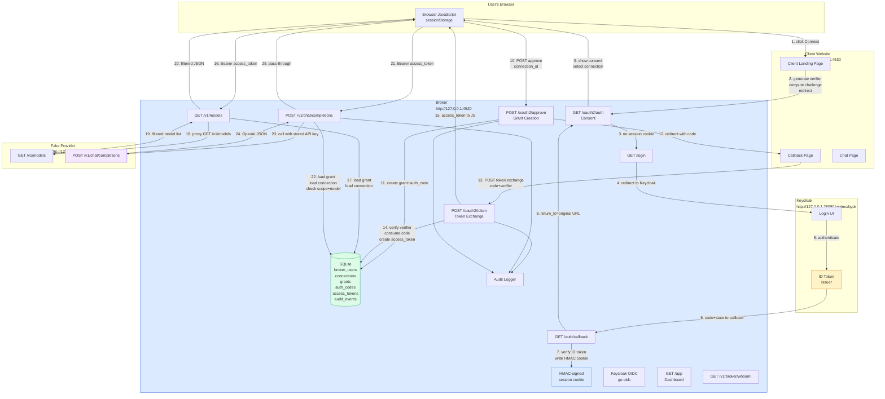

# BYOK Host: Broker, PKCE, and Chat Workflow — Technical Textbook

This note is a complete technical textbook on the BYOK Host system. It explains every layer of the architecture — from the browser's JavaScript OAuth client, through the broker's authorization server logic, to the SQLite persistence layer — with enough depth that a trained engineer could reproduce the system from this document alone.

> [!summary]
> The system implements **brokered bring-your-own-key (BYOK) inference** where a third-party website never receives the user's raw provider API key. The implementation uses:
> - **Keycloak** as a broker-user identity provider only
> - **Authorization Code + PKCE** as the delegation protocol between the client website and the broker
> - **HMAC-signed cookies** for broker session management
> - **SQLite** as the first pluggable storage backend
> - **A fake OpenAI-compatible provider** for local demonstration
>
> This document covers the complete data flow, every security boundary, the SQLite schema, failure modes, and the exact browser JavaScript that drives the client-side OAuth flow.

---

# Part I: System Overview and Motivation

## Why Brokered BYOK Exists

Direct browser-to-provider BYOK — where the user pastes their API key into a third-party website — is insecure because any JavaScript running in that page origin can steal the key. The browser sandbox protects the operating system from the page, but it does **not** protect secrets from malicious JavaScript executing in the same origin.

The brokered approach solves this by introducing an intermediary that:

1. accepts and stores the user's provider API key **on the broker's own server**, not in the browser
2. issues the website a **narrow, scoped, short-lived access token** that can only be used to call the broker's own API
3. enforces **consent and revocation** at the broker layer, not in the browser

This means the third-party website can perform inference on behalf of the user without ever seeing the raw provider key.

## The Three Actors

The system involves three distinct actors with fundamentally different trust levels:

### Actor 1: The User

The human who owns the upstream provider account (e.g., an OpenAI API key). The user authenticates to Keycloak, stores their provider credential in the broker, and approves or revokes client website access.

### Actor 2: The Client Website

A third-party web application that wants to perform inference on behalf of the user. It initiates an Authorization Code + PKCE flow against the broker, receives a scoped access token, and uses that token to call the broker's OpenAI-compatible API. It **never sees the provider key**.

### Actor 3: The Broker

The central authority. It owns:
- user identity (via Keycloak)
- the vault of stored provider credentials
- the grant/consent model
- the OAuth authorization server endpoints (`/oauth2/auth`, `/oauth2/approve`, `/oauth2/token`)
- the OpenAI-compatible inference API (`/v1/chat/completions`)
- the upstream provider adapter that forwards requests to the real provider

The broker is the **only actor** that ever sees the raw provider API key.

## Architecture Diagram



---

# Part II: Keycloak's Role — Identity Only

## What Keycloak Does

Keycloak's job is deliberately narrow: it authenticates the **broker user** and issues an OIDC identity token. It does **not**:

- issue tokens that the client website can use
- manage provider credentials
- know about broker grants or connections
- participate in the inference API

## How the Broker Uses Keycloak

The broker uses the `go-oidc` library to implement a server-side OIDC login flow. The relevant code is in `internal/auth/keycloak/oidc.go`.

### OIDC Settings

```go
type Settings struct {
    IssuerURL    string   // e.g., "http://127.0.0.1:28080/realms/byok"
    ClientID     string   // "broker-web"
    ClientSecret string   // "broker-web-secret"
    PublicURL    string   // "http://127.0.0.1:4520"
    CookiePath   string   // "/"
    Scopes       []string // ["openid", "profile", "email"]
}
```

The broker constructs an `Authenticator` at startup:

```go
provider, err := oidc.NewProvider(ctx, settings.IssuerURL)
// provider.Endpoint() gives Keycloak's auth + token endpoints

oauthConfig := oauth2.Config{
    ClientID:     settings.ClientID,
    ClientSecret: settings.ClientSecret,
    RedirectURL:  strings.TrimRight(settings.PublicURL, "/") + "/auth/callback",
    Endpoint:     provider.Endpoint(),  // Keycloak's endpoints
    Scopes:       scopes,
}

verifier := provider.Verifier(&oidc.Config{ClientID: settings.ClientID})
// verifier.Verify() cryptographically checks the ID token signature
```

The `redirectURL` registered in Keycloak's `broker-web` client must match exactly: `http://127.0.0.1:4520/auth/callback`.

## The Login Handler

When a user visits `/login`, the broker generates three short-lived values:

1. **`state`** — a random 32-byte token encoded in base64url. This prevents cross-site request forgery (CSRF). The broker stores it in a short-lived cookie.
2. **`nonce`** — a random 32-byte token encoded in base64url. This prevents replay of the ID token. Stored in another short-lived cookie.
3. **`return_to`** — the URL the user intended to visit before being redirected to login. Stored in a third short-lived cookie.

The redirect to Keycloak looks like:

```
http://127.0.0.1:28080/realms/byok/protocol/openid-connect/auth
  ?client_id=broker-web
  &redirect_uri=http%3A%2F%2F127.0.0.1%3A4520%2Fauth%2Fcallback
  &response_type=code
  &scope=openid+profile+email
  &state=<state_value>
  &nonce=<nonce_value>
```

Keycloak then presents its login page. On successful authentication, it redirects back to the broker's callback URL with a `code` parameter.

## The Callback Handler

On `/auth/callback?code=...&state=...`, the broker:

1. Reads the `state` and `nonce` cookies and compares them to the request parameters.
2. Exchanges the `code` for tokens using Keycloak's token endpoint:
   ```go
   token, err := a.oauthConfig.Exchange(ctx, code)
   ```
3. Extracts and verifies the `id_token` (ID token):
   ```go
   idToken, err := a.verifier.Verify(ctx, rawIDToken)
   ```
   Verification checks:
   - the token's signature against Keycloak's JWKS
   - the token's `iss` (issuer) matches the configured issuer URL
   - the token's `aud` (audience) includes the broker's client ID
   - the token's `exp` (expiry) is in the future
   - the token's `nonce` matches the stored nonce cookie
4. Extracts claims from the verified ID token:
   ```go
   type idTokenClaims struct {
       Email             string `json:"email"`
       EmailVerified     bool   `json:"email_verified"`
       PreferredUsername string `json:"preferred_username"`
       Name              string `json:"name"`
   }
   var claims idTokenClaims
   idToken.Claims(&claims)
   ```
5. Maps the Keycloak `sub` (subject) to a broker user in SQLite, creating one if it does not exist.
6. Writes a signed broker session cookie (described in Part III).
7. Redirects to the `return_to` URL stored in the cookie, or to `/app` as a fallback.

---

# Part III: Broker Session Management

## HMAC-Signed Cookie Architecture

The broker does **not** use Keycloak-issued tokens to manage browser sessions. Instead, after verifying the Keycloak ID token, the broker issues its own session cookie. This keeps the Keycloak session separate from the broker session and means the broker can remain functional even if Keycloak is restarted.

The session cookie is a **HMAC-signed, base64url-encoded JSON envelope**:

```
<payload_base64url>.<signature_base64url>
```

Where `payload_base64url` is the JSON-encoded session claims, and the signature is HMAC-SHA256 of the payload using the broker's secret key.

```go
type sessionEnvelope struct {
    Claims SessionClaims `json:"claims"`
}

type SessionClaims struct {
    Issuer            string    `json:"iss"`
    Subject           string    `json:"sub"`  // Keycloak sub
    Email             string    `json:"email,omitempty"`
    EmailVerified     bool      `json:"email_verified,omitempty"`
    PreferredUsername string    `json:"preferred_username,omitempty"`
    DisplayName       string    `json:"name,omitempty"`
    IssuedAt          time.Time `json:"iat"`
    ExpiresAt         time.Time `json:"exp"`
}
```

**Encoding:**
```go
func (m *SessionManager) encode(envelope sessionEnvelope) (string, error) {
    payload, _ := json.Marshal(envelope)
    payloadEncoded := base64.RawURLEncoding.EncodeToString(payload)
    signatureEncoded := base64.RawURLEncoding.EncodeToString(m.sign(payloadEncoded))
    return payloadEncoded + "." + signatureEncoded, nil
}

func (m *SessionManager) sign(payload string) []byte {
    h := hmac.New(sha256.New, m.secret)
    _, _ = h.Write([]byte(payload))
    return h.Sum(nil)
}
```

**Cookie properties:**
```go
http.SetCookie(w, &http.Cookie{
    Name:     "broker_keycloak_session",
    Value:    token,
    Path:     "/",
    HttpOnly: true,          // not accessible to JavaScript
    Secure:   shouldUseSecureCookies(r, m.publicURL),  // true if HTTPS
    SameSite: http.SameSiteLaxMode,
    Expires:  claims.ExpiresAt.UTC(),
    MaxAge:  int(time.Until(claims.ExpiresAt).Seconds()),
})
```

**Decoding with signature verification:**
```go
func (m *SessionManager) decode(raw string) (*sessionEnvelope, error) {
    parts := strings.Split(raw, ".")
    got, _ := base64.RawURLEncoding.DecodeString(parts[1])
    expected := m.sign(parts[0])
    if !hmac.Equal(got, expected) {
        return nil, errors.New("invalid session signature")
    }
    // ...
}
```

The HMAC signature means that any tampering with the cookie payload (e.g., changing the `sub` to impersonate another user) invalidates the signature. The secret is the `session-secret` flag passed to the broker at startup.

---

# Part IV: The Authorization Code + PKCE Flow

## Why PKCE Is Required

PKCE (Proof Key for Code Exchange) protects the Authorization Code flow against an attacker who can intercept the redirect URI. In a browser context, this is a real threat because:

1. An attacker observes the authorization `code` in the URL during the redirect
2. Without PKCE, the attacker could exchange the stolen code for a token at the token endpoint
3. PKCE makes the token exchange require a secret (`code_verifier`) that only the legitimate client possesses

PKCE transforms the flow from a one-step authorization to a two-step proof:

- **Before redirect:** the client proves possession of a secret by sending its hash (`code_challenge`)
- **During token exchange:** the client proves possession by sending the original secret (`code_verifier`)

## Step 1: Client Initiates the Flow

When the user clicks "Connect inference account", the browser JavaScript (`clientLandingPageTmpl`) generates:

### The code verifier
```javascript
function randomString(bytes = 32) {
    const arr = new Uint8Array(bytes);
    crypto.getRandomValues(arr);
    return btoa(String.fromCharCode(...arr))
      .replace(/\+/g, '-').replace(/\//g, '_').replace(/=+$/g, '');
}
// 32 random bytes → ~43-character base64url string
const verifier = randomString(48); // 48 bytes → ~64-character string
```

### The code challenge (S256 method)
```javascript
async function sha256Base64Url(input) {
    const encoded = new TextEncoder().encode(input);
    const hash = await crypto.subtle.digest('SHA-256', encoded);
    const bytes = Array.from(new Uint8Array(hash));
    const raw = String.fromCharCode(...bytes);
    return btoa(raw)
      .replace(/\+/g, '-').replace(/\//g, '_').replace(/=+$/g, '');
}
const challenge = await sha256Base64Url(verifier);
```

S256 is used (not "plain"), meaning the challenge is `BASE64URL(SHA256(verifier))`.

### The state parameter
A second random value (`state`) guards against CSRF attacks on the redirect.

### What gets stored in sessionStorage
```javascript
sessionStorage.setItem('pkce_verifier', verifier);  // the secret
sessionStorage.setItem('oauth_state', state);       // CSRF guard
// NOT stored: code_challenge (computed fresh each time)
```

### The redirect to the broker
```
GET http://127.0.0.1:4520/oauth2/auth
  ?response_type=code
  &client_id=client-demo-site
  &redirect_uri=http%3A%2F%2F127.0.0.1%3A4530%2Fcallback
  &scope=models%3Alist+inference%3Acomplete
  &state=<state_value>
  &code_challenge=<challenge_value>
  &code_challenge_method=S256
```

## Step 2: Broker Checks Login State

If the user is not logged in (no HMAC-signed broker session cookie), the broker redirects to `/login?return_to=` with the original URL encoded:

```
GET http://127.0.0.1:4520/login
  ?return_to=%2Foauth2%2Fauth%3Fresponse_type%3Dcode%26client_id%3Dclient-demo-site%26...
```

This `return_to` is stored in a short-lived broker cookie (not passed through Keycloak, because the Keycloak redirect would lose extra query parameters). After the Keycloak round-trip, the broker reads this cookie and redirects back to the original consent URL.

## Step 3: Broker Consent Screen

If the user is logged in, the broker presents the consent screen (`/oauth2/auth`). The broker checks:

```go
// Is the client ID registered?
if clientID != client.ID { /* 400 unknown client_id */ }

// Does the redirect_uri match?
if redirectURI != client.RedirectURI { /* 400 redirect_uri mismatch */ }

// Is the response type authorization_code?
if responseType != "code" { /* 400 */ }

// Is PKCE required and is it S256?
if codeChallengeMethod != "S256" { /* 400 code_challenge_method must be S256 */ }

// Are the requested scopes all allowed for this client?
if !scopesAllowed(requestedScopes, client.Scopes) { /* 400 */ }
```

The consent screen shows:
- which client website is requesting access
- which scopes (`models:list`, `inference:complete`)
- which stored provider connection will be used
- the option to approve or deny

## Step 4: User Approves

When the user approves, the broker:

1. Reads the selected `connection_id` from the form.
2. Creates a grant in SQLite (described in Part V).
3. Creates a short-lived auth code in SQLite:
   ```go
   code := storage.AuthCode{
       Code:              randomID("code_", 16),
       UserID:            brokerUser.ID,
       ClientID:          clientID,
       RedirectURI:       redirectURI,
       CodeChallenge:     codeChallenge,
       CodeChallengeMeth: "S256",
       GrantID:           grant.ID,
       ExpiresAt:         time.Now().Add(5 * time.Minute).UTC(),
   }
   store.StoreAuthCode(ctx, code)
   ```
4. Redirects to the client's registered redirect URI:
   ```
   http://127.0.0.1:4530/callback?code=<auth_code>&state=<state_value>
   ```

## Step 5: Client Exchanges the Code

The client website's callback page (`clientCallbackPageTmpl`) JavaScript runs:

```javascript
const params = new URLSearchParams(window.location.search);
const code = params.get('code');
const state = params.get('state');
const expectedState = sessionStorage.getItem('oauth_state');
const verifier = sessionStorage.getItem('pkce_verifier');

// Verify state to prevent CSRF
if (state !== expectedState) {
    statusEl.textContent = 'OAuth state mismatch.';
    return;
}

// Exchange code for token
const form = new URLSearchParams({
    grant_type: 'authorization_code',
    code,
    client_id: clientId,
    redirect_uri: clientBase + '/callback',
    code_verifier: verifier,  // <-- the PKCE proof
});
const response = await fetch(brokerBase + '/oauth2/token', {
    method: 'POST',
    headers: { 'Content-Type': 'application/x-www-form-urlencoded' },
    body: form,
});
const data = await response.json();
sessionStorage.setItem('broker_access_token', data.access_token);
// Clear OAuth state (code is consumed)
sessionStorage.removeItem('oauth_state');
sessionStorage.removeItem('pkce_verifier');
```

**Important:** After this step, `sessionStorage` contains only the access token — not the verifier, not the state, and not the auth code. The auth code is single-use.

## Step 6: Broker Validates the Token Request

On `POST /oauth2/token`, the broker:

```go
// 1. Consume the auth code (single-use)
authCode, err := store.ConsumeAuthCode(ctx, reqCode)
// Error if code doesn't exist, already consumed, or expired

// 2. Verify PKCE
if !verifyPKCE(authCode.CodeChallenge, authCode.CodeChallengeMeth, reqVerifier) {
    // "invalid_grant" — PKCE verification failed
}

// 3. Verify redirect_uri and client_id match
if authCode.ClientID != reqClientID || authCode.RedirectURI != reqRedirectURI {
    // "invalid_grant" — mismatch
}

// 4. Load the grant and verify it is not revoked
grant, err := store.GetGrantByID(ctx, authCode.GrantID)
if grant.RevokedAt != nil {
    // "invalid_grant" — grant revoked
}

// 5. Issue a broker access token
token := storage.AccessToken{
    Token:        randomID("atk_", 18),
    UserID:        authCode.UserID,
    ClientID:      authCode.ClientID,
    ConnectionID:  grant.ConnectionID,
    GrantID:       grant.ID,
    Scopes:        grant.Scopes,
    ExpiredAt:     time.Now().Add(15 * time.Minute).UTC(),
}
store.StoreAccessToken(ctx, token)
```

Response:
```json
{
  "access_token": "atk_j0Af4TLLRxNCGAazEU6OC3z9d",
  "token_type": "Bearer",
  "expires_in": 900,
  "scope": "models:list inference:complete"
}
```

## PKCE Security Properties

PKCE with S256 provides:

- **Confidentiality of the verifier:** only the original client knows the verifier; it is never transmitted before the token exchange
- **Binding to the authorization request:** the challenge is sent before the token exchange, so a stolen code cannot be exchanged without also stealing the challenge (which is observable only by the legitimate client)
- **Integrity:** S256 means the verifier cannot be modified in transit

The `state` parameter provides CSRF protection for the redirect by ensuring the callback originates from the same authorization request the client initiated.

---

# Part V: Grant and Token Lifecycle

## The Grant Model

A grant represents the user's **consent** for a specific client website to access a specific stored provider connection. It is created when the user clicks "Approve" on the consent screen.

```go
type Grant struct {
    ID            string     // "grant_<random>"
    UserID        string     // which broker user
    ClientID      string     // "client-demo-site"
    ConnectionID  string     // which stored connection
    Scopes        []string   // ["models:list", "inference:complete"]
    AllowedModels []string   // from the selected connection
    CreatedAt     time.Time
    RevokedAt     *time.Time // nil if active
}
```

Grants are **persistent** and survive broker restarts. They are explicitly revoked when:
- the user clicks "Revoke" on the dashboard
- the underlying connection is deleted

## The Access Token Model

The access token is what the client website actually uses. It is short-lived (15 minutes).

```go
type AccessToken struct {
    Token        string    // "atk_<random>"
    UserID       string
    ClientID     string
    ConnectionID string
    GrantID      string    // link back to the grant
    Scopes       []string
    ExpiresAt    time.Time
}
```

The token is **bearer-scoped**: anyone who possesses it can use it. The broker validates:
1. the token exists in SQLite
2. it has not expired
3. the associated grant has not been revoked
4. the token's `client_id` matches the calling client
5. the requested scope is present in the token

## Token Validation on Every Inference Request

On every `/v1/chat/completions` request, the broker performs:

```go
func validateBrokerAccessToken(ctx context.Context, store storage.Store, tokenValue string) (
    token AccessToken, grant Grant, connection Connection, err error) {

    // 1. Token must exist and not be expired
    token, err := store.GetAccessToken(ctx, tokenValue)
    if err != nil { return }
    if time.Now().After(token.ExpiresAt) { return fmt.Errorf("access token expired") }

    // 2. Grant must not be revoked
    grant, err := store.GetGrantByID(ctx, token.GrantID)
    if err != nil { return }
    if grant.RevokedAt != nil { return fmt.Errorf("grant revoked") }

    // 3. Connection must exist and not be disabled
    connection, err := store.GetConnection(ctx, token.UserID, token.ConnectionID)
    if err != nil { return }
    if connection.Disabled { return fmt.Errorf("connection disabled") }
}
```

This chain — token → grant → connection — is the core authorization model.

---

# Part VI: The Inference Authorization Flow

## Request Path

```
Browser JS
  → POST /v1/chat/completions
    Authorization: Bearer atk_j0Af4TLLRx...

Broker
  → validateBrokerAccessToken()
    → token record from SQLite
    → grant record from SQLite
    → connection record from SQLite
  → check scope: token must have "inference:complete"
  → check model allowlist: requested model must be in grant.AllowedModels
  → load stored API key: connection.APIKey
  → forward request to fake provider:
       Authorization: Bearer <connection.APIKey>
       X-Broker-Client-ID: <token.ClientID>
  → return provider response to browser
```

## Model Allowlisting

The broker enforces per-grant model restrictions. When the user creates a connection, they specify `allowed_models`:

```
fake-gpt-4o-mini, fake-gpt-4.1-mini
```

This list is stored in the connection record and copied into each grant at the time of approval. The broker checks it on every inference request:

```go
allowedModels := connection.AllowedModels
if len(grant.AllowedModels) > 0 {
    allowedModels = grant.AllowedModels  // grant-specific overrides
}
if len(allowedModels) > 0 && !slices.Contains(allowedModels, req.Model) {
    writeJSON(w, http.StatusForbidden, map[string]any{
        "error":         "model_not_allowed",
        "model":         req.Model,
        "allowed_models": allowedModels,
    })
    return
}
```

This means a grant can be more restrictive than the connection's overall allowlist, enabling the user to approve a client for only a subset of the models they have access to.

---

# Part VII: SQLite Persistence

## Schema

The SQLite schema in `internal/storage/sqlite/store.go` uses `CREATE TABLE IF NOT EXISTS` with `ON CONFLICT` upserts.

### Tables

```sql
CREATE TABLE broker_users (
    id TEXT PRIMARY KEY,
    keycloak_subject TEXT NOT NULL UNIQUE,
    preferred_username TEXT NOT NULL,
    email TEXT,
    created_at TIMESTAMP NOT NULL,
    updated_at TIMESTAMP NOT NULL
);

CREATE TABLE connections (
    id TEXT PRIMARY KEY,
    user_id TEXT NOT NULL REFERENCES broker_users(id),
    provider TEXT NOT NULL,
    display_name TEXT NOT NULL,
    api_key TEXT NOT NULL,
    allowed_models_json TEXT NOT NULL,   -- JSON array
    disabled INTEGER NOT NULL DEFAULT 0,
    created_at TIMESTAMP NOT NULL,
    updated_at TIMESTAMP NOT NULL
);

CREATE INDEX idx_connections_user_id ON connections(user_id);

CREATE TABLE grants (
    id TEXT PRIMARY KEY,
    user_id TEXT NOT NULL REFERENCES broker_users(id),
    client_id TEXT NOT NULL,
    connection_id TEXT NOT NULL REFERENCES connections(id),
    scopes_json TEXT NOT NULL,            -- JSON array
    allowed_models_json TEXT NOT NULL,    -- JSON array
    created_at TIMESTAMP NOT NULL,
    revoked_at TIMESTAMP                  -- NULL = active
);

CREATE INDEX idx_grants_user_id ON grants(user_id);
CREATE INDEX idx_grants_client_id ON grants(client_id);

CREATE TABLE auth_codes (
    code TEXT PRIMARY KEY,
    user_id TEXT NOT NULL,
    client_id TEXT NOT NULL,
    redirect_uri TEXT NOT NULL,
    code_challenge TEXT NOT NULL,
    code_challenge_method TEXT NOT NULL,
    grant_id TEXT NOT NULL,
    expires_at TIMESTAMP NOT NULL
);

CREATE TABLE access_tokens (
    token TEXT PRIMARY KEY,
    user_id TEXT NOT NULL,
    client_id TEXT NOT NULL,
    connection_id TEXT NOT NULL,
    grant_id TEXT NOT NULL,
    scopes_json TEXT NOT NULL,
    expires_at TIMESTAMP NOT NULL
);

CREATE INDEX idx_access_tokens_grant_id ON access_tokens(grant_id);

CREATE TABLE audit_events (
    id TEXT PRIMARY KEY,
    user_id TEXT,
    event_type TEXT NOT NULL,
    client_id TEXT,
    connection_id TEXT,
    payload_json TEXT NOT NULL,
    created_at TIMESTAMP NOT NULL
);

CREATE INDEX idx_audit_events_user_id ON audit_events(user_id);
```

## JSON Column Handling

`AllowedModels` and `Scopes` are stored as JSON arrays in `_json` columns and marshaled/unmarshaled in the SQLite store:

```go
// On write
allowedModels, _ := json.Marshal(c.AllowedModels)
_, err := s.db.ExecContext(ctx,
    `INSERT INTO connections ... allowed_models_json = ?`,
    string(allowedModels), ...)

// On read
var allowedModelsJSON string
row.Scan(..., &allowedModelsJSON, ...)
var allowedModels []string
json.Unmarshal([]byte(allowedModelsJSON), &allowedModels)
```

## Auth Code Consumption

Auth codes are single-use. The `ConsumeAuthCode` method deletes the code after reading:

```go
func (s *Store) ConsumeAuthCode(ctx context.Context, code string) (AuthCode, error) {
    // Start transaction
    tx, err := s.db.BeginTx(ctx, nil)
    // DELETE and return in one statement
    row := tx.QueryRowContext(ctx,
        `DELETE FROM auth_codes WHERE code = ? AND expires_at > ? RETURNING ...`,
        code, time.Now().UTC())
    ac, err := scanAuthCode(row)
    if err == sql.ErrNoRows { return storage.AuthCode{}, storage.ErrNotFound }
    tx.Commit()
    return ac, nil
}
```

Using `DELETE ... RETURNING` ensures the code is atomically consumed: it cannot be exchanged twice.

## Connection Deletion Cascade

When a user deletes a connection, all associated grants are automatically revoked:

```go
func (s *Store) DeleteConnection(ctx context.Context, userID, connectionID string) error {
    // Delete the connection
    _, err := s.db.ExecContext(ctx,
        `DELETE FROM connections WHERE id = ? AND user_id = ?`,
        connectionID, userID)
    // Revoke all grants for this connection
    _, _ = s.db.ExecContext(ctx,
        `UPDATE grants SET revoked_at = ? WHERE user_id = ? AND connection_id = ? AND revoked_at IS NULL`,
        time.Now().UTC(), userID, connectionID)
    return nil
}
```

This means deleting a connection immediately invalidates all outstanding access tokens that were issued against that connection's grants.

---

# Part VIII: The Browser JavaScript Client

## sessionStorage vs. localStorage

The client website uses `sessionStorage`, not `localStorage`. This is intentional:

- `sessionStorage` is origin-scoped and **cleared when the tab is closed**
- `localStorage` persists indefinitely, which would mean stale tokens remain across browser sessions

The browser JavaScript stores only three values in `sessionStorage`:

| Key | Value | Purpose |
|-----|-------|---------|
| `pkce_verifier` | `<random_string>` | PKCE secret, cleared after token exchange |
| `oauth_state` | `<random_string>` | CSRF guard, cleared after token exchange |
| `broker_access_token` | `atk_<...>` | The broker-issued access token |

**The raw provider API key is never stored in the browser.**

## The brokerFetch Helper

Every API call uses a shared helper that injects the Bearer token:

```javascript
async function brokerFetch(path, init = {}) {
    const t = token();  // read from sessionStorage
    if (!t) throw new Error('no broker access token');
    const headers = new Headers(init.headers || {});
    headers.set('Authorization', 'Bearer ' + t);
    return fetch(brokerBase + path, { ...init, headers });
}
```

This pattern ensures the access token is sent on every request, and the request fails immediately if no token is present.

## Handling Token Expiry

The current implementation does not automatically refresh the access token. When the token expires:

1. The broker returns `401 Unauthorized`
2. The JavaScript `catch` block surfaces the error to the user
3. The user must click "Forget broker token" and reconnect

A production implementation would add:
- automatic refresh token exchange before expiry
- a "session expired, reconnect" message in the UI

---

# Part IX: Failure Modes and Troubleshooting

## Failure: "Missing code, state, or PKCE verifier"

**Cause:** The callback page JavaScript cannot find the expected `code`, `state`, or `pkce_verifier` in sessionStorage. This happens when:

1. The user clicks "Connect" twice without completing the first flow. The first auth code is consumed on the first exchange; the second exchange fails.
2. The user has a stale `broker_access_token` from a previous session in sessionStorage while trying to start a new connect flow.
3. The broker was restarted between the approval and the token exchange, consuming the in-memory auth code (with a memory store) or the SQLite auth code (which survives a restart but may have expired).

**Fix:** Click **"Forget broker token"** to clear sessionStorage, then retry.

## Failure: "OAuth state mismatch"

**Cause:** The `state` parameter in the callback URL does not match `sessionStorage.getItem('oauth_state')`. This indicates a CSRF attempt or a race condition where the user opened two connect flows in parallel tabs.

**Fix:** Close all tabs and start a fresh connect flow.

## Failure: "invalid_grant — PKCE verification failed"

**Cause:** The `code_verifier` sent at the token exchange does not match `SHA256(code_verifier) = code_challenge`. This means the verifier was tampered with or the wrong verifier was sent.

**Fix:** Restart the connect flow from the beginning.

## Failure: "model_not_allowed"

**Cause:** The model requested in `/v1/chat/completions` is not in the grant's `AllowedModels` list.

**Fix:** Revoke the existing grant and re-approve with an expanded model allowlist, or approve against a different connection that allows the requested model.

## Failure: "grant revoked" or "connection disabled"

**Cause:** The grant was revoked from the dashboard, or the connection was deleted.

**Fix:** Reconnect by going through the authorization flow again.

## Failure: Broker logs show "broker keycloak issuer=..." but no HTTP responses

**Cause:** The broker is listening but the OIDC provider (Keycloak) may not be reachable. Check that the Keycloak container is running and the `oidc-issuer-url` flag matches the actual Keycloak host port.

**Fix:** Verify with `curl http://127.0.0.1:<KEYCLOAK_PORT>/realms/byok/.well-known/openid-configuration`.

## Keycloak login loop or "Invalid parameter" error

**Cause:** The `redirect_uri` registered in Keycloak for the `broker-web` client does not match the broker's actual callback URL.

**Fix:** Ensure the Keycloak realm import (`realm-byok.json`) has the correct `redirectUris` for the `broker-web` client:
```json
"redirectUris": [
    "http://127.0.0.1:4520/*",
    "http://localhost:4520/*"
]
```

---

# Part X: Operational Reference

## Ports

| Service | Port | Process |
|---------|------|---------|
| Keycloak | 28080 (auto-selected) | Docker container |
| Fake Provider | 4510 | `byok-keycloak-demo provider serve` |
| Broker | 4520 | `byok-keycloak-demo broker serve` |
| Client Website | 4530 | `byok-keycloak-demo client serve` |

## Demo Credentials

| Credential | Value |
|-----------|-------|
| Demo user username | `alice` |
| Demo user password | `password123` |
| Keycloak admin username | `admin` |
| Keycloak admin password | `admin` |

## SQLite DB Location

```
ttmp/.../various/broker.db
```

## Key Startup Flags

```bash
./byok-keycloak-demo broker serve \
  --port 4520 \
  --public-url 'http://127.0.0.1:4520' \
  --provider-base-url 'http://127.0.0.1:4510' \
  --client-origin 'http://127.0.0.1:4530' \
  --client-id 'client-demo-site' \
  --redirect-uri 'http://127.0.0.1:4530/callback' \
  --oidc-issuer-url 'http://127.0.0.1:28080/realms/byok' \
  --oidc-client-id 'broker-web' \
  --oidc-client-secret 'broker-web-secret' \
  --session-secret 'broker-session-secret-dev' \
  --storage-driver 'sqlite' \
  --storage-sqlite-path 'various/broker.db'
```

## Relevant Source Files

### Broker runtime
- `scripts/byok-keycloak-demo/internal/app/broker.go` — all broker HTTP handlers
- `scripts/byok-keycloak-demo/internal/app/oauth.go` — PKCE helpers, Bearer token extraction

### Auth
- `scripts/byok-keycloak-demo/internal/auth/keycloak/oidc.go` — OIDC login/callback/logout
- `scripts/byok-keycloak-demo/internal/auth/keycloak/session.go` — HMAC-signed session cookies

### Storage
- `scripts/byok-keycloak-demo/internal/storage/interfaces.go` — Store interface definition
- `scripts/byok-keycloak-demo/internal/storage/models.go` — domain types
- `scripts/byok-keycloak-demo/internal/storage/sqlite/store.go` — SQLite implementation
- `scripts/byok-keycloak-demo/internal/storage/memory/store.go` — in-memory implementation

### Templates
- `scripts/byok-keycloak-demo/internal/app/templates.go` — all HTML templates and JavaScript

### Infrastructure
- `scripts/byok-keycloak-demo/deploy/docker-compose.yaml`
- `scripts/byok-keycloak-demo/deploy/keycloak/realm-byok.json`
- `scripts/byok-keycloak-demo/scripts/run_tmux_keycloak_demo.sh`

---

# Part XI: Design Decisions and Trade-offs

## Decision: Broker Issues Its Own Access Tokens

The broker does not use Keycloak-issued tokens for the client website. Instead, the broker is itself an OAuth authorization server that issues proprietary broker access tokens. This was a deliberate choice because:

- Keycloak does not natively know about the broker's domain model (connections, grants, allowed models)
- the broker needs to enforce per-connection, per-grant, per-model authorization at inference time
- keeping the two token systems separate means Keycloak downtime does not break active inference sessions

## Decision: SQLite as First Backend

SQLite was chosen as the first persistent backend because:

- it requires no separate server process
- the schema is easy to inspect and modify during development
- it supports `FOREIGN KEY` constraints for referential integrity
- `ON CONFLICT` upserts make migration-safe schema evolution straightforward
- it is production-appropriate for single-node deployments and alpha environments

The storage layer is abstracted behind a Go interface, so Postgres or a dedicated secrets manager can replace SQLite without changing the broker runtime.

## Decision: HMAC-Signed Cookies Instead of JWTs

JWTs would require an asymmetric key infrastructure or a shared secret for verification. HMAC-signed cookies achieve the same security property — the cookie cannot be forged or tampered with — with a simpler deployment story (just one secret). The cookie format is self-contained and does not require a JWKS endpoint.

## Decision: PKCE S256 Only

The broker rejects `code_challenge_method=plain`, accepting only `S256`. This ensures the security property that the verifier cannot be intercepted during the authorization redirect.

## Decision: 5-Minute Auth Code TTL

Auth codes expire in 5 minutes. This limits the window in which a stolen code could be exchanged. The trade-off is that slow users who take more than 5 minutes at the consent screen will need to restart the flow.

## Decision: 15-Minute Access Token TTL

Access tokens expire in 15 minutes. This balances between:
- short enough to limit exposure if a token is leaked
- long enough that normal interactive usage does not require frequent re-authorization

A production system would add refresh tokens to allow seamless renewal.
