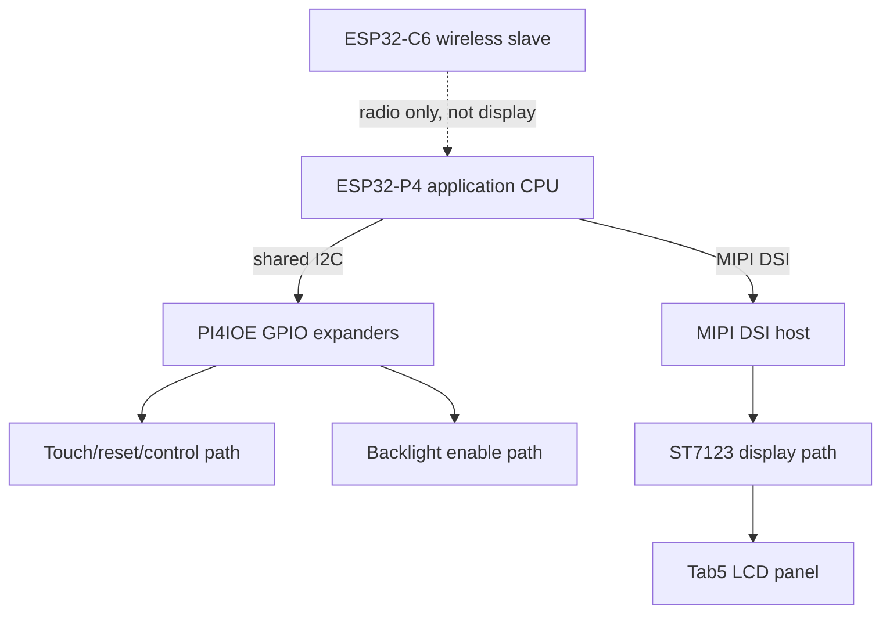

# M5 Tab5 - Display Bring-Up Failure and Display Architecture

This note is a detailed project report on the Tab5 display bring-up effort: what the display stack actually is on the tablet, why the first initialization attempt failed even though the code looked plausible, what fixed the hard failure, and what the later visual artifact taught us about display bandwidth on the ESP32-P4 platform. It is derived from the implementation diary and the ticket documents for the boot logo firmware, but it is written as a durable explanation that a future engineer can read without replaying the whole debugging session from scratch.

> [!summary]
> - The Tab5 display is driven by the **ESP32-P4**, not the wireless **ESP32-C6**. The display data path is **MIPI DSI**, while important control lines are prepared through the shared **I2C bus** and **PI4IOE GPIO expanders**.
> - The first display-init failure was not “bad DSI syntax.” It was an **initialization-order bug**: the firmware tried to talk to the ST7123 panel before reproducing the board-level preparation sequence used by the factory firmware.
> - The hard hang was fixed by replacing the hand-rolled low-level panel path with the factory-style BSP path: **I2C → IO expander → reset → `bsp_display_start_with_config()` → rotation → backlight → logo**.
> - A second issue appeared only after the screen came alive: a visible edge flutter and `lcd.dsi.dpi` underrun errors. That was traced to **PSRAM throughput**, not panel initialization, and the first safe fix was enabling **200 MHz PSRAM** on ESP32-P4 with `CONFIG_IDF_EXPERIMENTAL_FEATURES=y`.

## Why this note exists

The Tab5 is the kind of board that punishes shallow mental models. It looks like “just another ESP32 board with a screen,” but it is not. The application CPU has no radio, the screen uses a dedicated MIPI DSI engine rather than a casual SPI panel interface, the board routes many control signals through I/O expanders on a shared I2C bus, and the BSP hides some of the board-preparation steps that are easy to omit when writing a minimal tutorial firmware.

That combination is exactly why the display bring-up was difficult. The application compiled. The firmware flashed. The board booted. The logs said the MIPI DSI PHY turned on. And then the system stalled hard enough to trip the watchdog. That kind of failure is easy to misread as a low-level DSI or panel-driver bug when it is actually a board integration bug.

This report preserves the correct mental model:

- how the display stack is layered on the Tab5,
- what the first implementation got wrong,
- how the repair worked,
- and why the later display artifact was a different class of problem.

## The short version

The Tab5 boot logo firmware under `/home/manuel/workspaces/2025-12-21/echo-base-documentation/esp32-s3-m5/0051-tab5-boot-logo` originally attempted to initialize the ST7123 display panel almost entirely by hand from `main/display_app.c`. That looked attractive from a “small tutorial app” point of view, but it accidentally skipped board-level setup that the original M5Stack firmware performs before display startup.

The original factory sequence in `M5Tab5-UserDemo/platforms/tab5/main/hal/hal_esp32.cpp` initializes the shared I2C bus and the PI4IOE I/O expanders before bringing up the display. Those expanders control lines such as LCD reset, touch reset, and other board-level enables. The first tutorial display path skipped that preparation and jumped straight into low-level ST7123 / MIPI DSI work. The result was a stall in the panel-read path and a watchdog reset.

The repair was to stop reconstructing the board-specific display stack manually and instead adopt the same board-preparation order the factory firmware uses. Once that happened, the hard hang disappeared. The screen initialized, the logo rendered, and the rest of the firmware continued booting into Wi-Fi and HTTP service.

Only then did the second bug become visible: a narrow fluttering bar on one edge and repeated `lcd.dsi.dpi` underrun errors. That was not another bring-up-order bug. It was a memory/display bandwidth problem, which led to the PSRAM tuning work.

## How the display actually works on the tablet

The simplest accurate mental model is that the Tab5 display path has **two planes**:

1. a **pixel data plane**, and
2. a **board control plane**.

If you only think about the pixel data plane, you will almost certainly initialize the display incorrectly.

### 1. Pixel data plane: ESP32-P4 -> MIPI DSI -> ST7123 panel

The display is driven by the **ESP32-P4** using its dedicated **MIPI DSI peripheral**. This is the high-speed video path that sends pixel data to the panel. The panel controller on the Tab5 is the **ST7123**.

That means the display should not be reasoned about as “just a bunch of GPIOs.” Some earlier shorthand notes described lane pins in a GPIO-like way, but the more accurate statement is this:

- the P4 owns a dedicated MIPI DSI engine,
- the engine emits the display traffic,
- and the application uses ESP-IDF `esp_lcd` / BSP abstractions to configure that engine and the panel.

The display pipeline in software looks like this:


At the application level, the boot logo code only wants to do something simple: create an LVGL image object and put the M5 logo on screen. But under that simple UI action is a larger display stack:

- LVGL object tree
- `esp_lvgl_port` integration
- panel registration
- MIPI DSI host setup
- panel init sequence
- backlight enable

### 2. Board control plane: shared I2C + PI4IOE expanders + reset / backlight / touch lines

The second plane is what the first implementation underappreciated. The display is not ready simply because the DSI engine exists. The board also has to prepare a control path through shared I2C and the PI4IOE GPIO expanders.

Important facts from the board and BSP:

- the Tab5 uses a shared **I2C bus** for many board peripherals,
- the board includes **PI4IOE GPIO expanders**,
- those expanders drive control signals such as display reset, touch reset, and other enable lines,
- the BSP knows that ordering,
- and the factory firmware performs that preparation before display startup.

A more honest diagram of the display subsystem therefore looks like this:



The key lesson is that the display stack is not “P4 talks DSI to panel” in isolation. It is “P4 prepares board control state, then starts the display data path.”

### 3. LVGL, rotation, and why the logo code is smaller than the board logic

Once the display is alive, the application creates a logo object through LVGL. That part is relatively small compared to the board-preparation work.

The Tab5 panel is physically portrait-oriented, while the demo logic thinks in landscape-oriented UI coordinates. The factory firmware handles this by enabling **software rotation** through LVGL rather than relying on a hardware rotation block.

That matters because:

- the app can lay out the logo in logical coordinates,
- LVGL rotates the output,
- and the underlying buffers still need enough memory bandwidth to feed the display reliably.

This became important later when the panel initialized successfully but the runtime still showed visual jitter and DSI underrun errors.

### 4. Why PSRAM matters to the display path

The display path uses substantial buffering. On the ESP32-P4 build, those buffers can live in PSRAM. If PSRAM throughput is too low, the display engine can starve while trying to fetch data fast enough for the DSI/DPI pipeline.

That is why the later error:

```text
lcd.dsi.dpi: can't fetch data from external memory fast enough, underrun happens
```

was such an important clue. It pointed away from panel command sequencing and toward memory bandwidth.

## Why getting the display initialized was difficult

There were several overlapping reasons.

### The board is easy to misclassify

The Tab5 is not a simple single-chip “ESP32 + TFT” board. The P4 is the host, the C6 is the wireless slave, the display is high-speed MIPI DSI, and many other board controls sit behind I2C expanders. If you start with the wrong mental model, you will try to simplify the wrong parts.

### The minimal app wanted to be smaller than the real board

The tutorial firmware wanted to be a clean minimal example. That pushed the first implementation toward manually wiring together:

- DSI host creation,
- panel IO creation,
- ST7123 panel init,
- LVGL registration,
- backlight control,
- logo creation.

The problem was not that those APIs are inherently wrong. The problem was that the board-specific prerequisites did not vanish just because the tutorial app was smaller.

### The failure mode was misleading

The first hard failure was not a neat `ESP_FAIL`. It was a stall inside the panel communication path, followed by the task watchdog. That kind of failure can make it feel like the low-level driver is broken, even when the real issue is upstream setup.

### The second bug only appeared after the first one was fixed

Once the hard bring-up hang was gone, the screen actually turned on. That exposed a second failure mode — visible edge flutter and a blue-screen-like instability — which was caused by display underrun rather than panel init failure. That made the debugging story look messy, but the two bugs were actually distinct:

- first bug: initialization order
- second bug: throughput / memory bandwidth

## The failure story from the diary

The implementation diary is the best source for the actual sequence of mistakes and repairs.

### Phase 1: the first custom display path looked plausible but hung

The original custom `display_app.c` attempted a largely hand-rolled display bring-up. At a high level, it followed this shape:

```text
init backlight
power DSI PHY
create DSI bus
create panel IO
create ST7123 panel
reset panel
read / init panel
register display with LVGL
render logo
```

That is not obviously wrong if you only think in terms of display-driver layers. But it skipped the broader board-preparation sequence.

The resulting runtime signature was:

```text
I (...) tab5_boot_logo: boot
I (...) display: Initializing MIPI DSI display (ST7123, 720x1280 portrait)
I (...) M5STACK_TAB5: MIPI DSI PHY Powered on
E (...) task_wdt: Task watchdog got triggered
...
mipi_dsi_hal_host_gen_read_short_packet
```

The important point is not just that it failed, but *where* it failed. The stall occurred around the short-packet read path used by the panel driver, which fit the hypothesis that the code was trying to communicate with a panel that the board had not finished preparing.

### Phase 2: comparing against the factory firmware changed the debugging frame

The next crucial step was to compare the tutorial path against the original M5Stack Tab5 HAL in:

- `M5Tab5-UserDemo/platforms/tab5/main/hal/hal_esp32.cpp`

That file made the missing board-preparation order obvious. Before display startup, the original firmware initializes:

1. the shared I2C bus,
2. the GPIO expanders,
3. touch / reset related control flow,
4. then the display through the BSP wrapper.

This was the turning point. The question changed from “what DSI API call is wrong?” to “what board-prep step is missing before panel communication?”

### Phase 3: the repair was to delete custom display complexity, not add more of it

The repaired path in `main/display_app.c` switched to the board-sequence-friendly version:

```c
bsp_i2c_init();
i2c_master_bus_handle_t i2c = bsp_i2c_get_handle();
bsp_io_expander_pi4ioe_init(i2c);
bsp_reset_tp();
lv_display_t *disp = bsp_display_start_with_config(&cfg);
lv_display_set_rotation(disp, LV_DISPLAY_ROTATION_90);
bsp_display_backlight_on();
// create logo object
```

That fixed the hard hang.

The successful runtime logs then showed:

```text
I (...) M5STACK_TAB5: reset tp
I (...) M5STACK_TAB5: Install LCD driver of ST7123
I (...) st7123: LCD ID: 80 A0 FB
I (...) M5STACK_TAB5: ST7123 Display initialized with resolution 720x1280
I (...) M5STACK_TAB5: ST7123 touch panel initialized successfully
I (...) M5STACK_TAB5: Setting LCD backlight: 100%
I (...) display: Display initialized -- M5 logo rendered on screen
```

This is the strongest practical proof that the original diagnosis was right. The fix was not a one-line DSI tweak. It was restoring the missing board bring-up order.

### Phase 4: once the display was alive, the bandwidth bug became visible

After the hang was fixed, the display visibly came up but showed a new artifact: a narrow fluttering grey bar on one edge and a general sense of instability. The log now contained a different message:

```text
E lcd.dsi.dpi: can't fetch data from external memory fast enough, underrun happens
```

That message is qualitatively different from the first failure. The panel was now alive. The issue was that the display engine could not be fed quickly enough.

This led to a configuration comparison against the original firmware, which exposed an important difference:

- original firmware: PSRAM at **200 MHz**
- tutorial firmware at that moment: PSRAM effectively at **20 MHz**

A further ESP-IDF detail explained why an earlier attempt to set 200 MHz had not worked: on ESP32-P4, `CONFIG_SPIRAM_SPEED_200M` depends on `CONFIG_IDF_EXPERIMENTAL_FEATURES=y`.

Once both settings were enabled and the firmware was rebuilt, the runtime log reported:

```text
I esp_psram: Speed: 200MHz
```

and the previously observed DSI underrun spam disappeared from the capture window.

## The most important pseudocode in this whole debugging story

### The path that looked reasonable but was incomplete

```text
function old_display_init():
    enable_backlight_pwm()
    power_on_dsi_phy()
    create_dsi_bus()
    create_panel_io()
    create_st7123_panel()
    reset_panel()
    init_panel()
    register_lvgl_display()
    render_logo()
```

The hidden problem is not visible in that pseudocode. There is no board-preparation step for the shared I2C devices and expander-controlled resets.

### The path that actually matches the tablet

```text
function fixed_display_init():
    init_shared_i2c_bus()
    init_pi4ioe_expanders()
    reset_touch_and_related_control_lines()
    start_display_through_bsp_wrapper()
    rotate_lvgl_display(90_degrees)
    enable_backlight()
    render_logo()
```

That second sequence is a better model of the real hardware. It accepts that the display is part of a board, not just part of a graphics library.

## What I would tell a new engineer first

If you are new to this board, the most important working rules are these:

### 1. Treat the display as a board subsystem, not a panel driver demo

On a simpler dev board, you can sometimes initialize a screen by wiring together the panel driver calls directly and calling it done. The Tab5 is not that board. The display depends on board control state that lives outside the DSI configuration itself.

### 2. Read the original HAL ordering before writing a “minimal” replacement

The factory firmware may be heavier than the tutorial app, but it still encodes the correct board bring-up order. Copying only the visible display calls and omitting the earlier preparatory calls is exactly how this bug was created.

### 3. Separate “panel is not alive” bugs from “panel is alive but unstable” bugs

These are different classes of failure:

- no panel response / watchdog in read path -> think init order, reset, control plane
- visible image but jitter / edge flutter / underrun logs -> think bandwidth, buffers, PSRAM, timing

### 4. Respect the dedicated MIPI DSI interface

Do not flatten the display into a generic GPIO story. The correct mental model is a dedicated display peripheral plus a separate board-control path.

### 5. When comparing configs, compare runtime-relevant knobs one at a time

A broad import of factory performance options can create unrelated link or memory-layout failures. The better pattern is:

1. find the symptom,
2. form a narrow hypothesis,
3. compare with the factory configuration,
4. change one relevant knob,
5. re-test on real hardware.

## The practical engineering takeaways

The display debugging effort ended up teaching three separate lessons.

### Lesson A: initialization order matters more than low-level API confidence

The first code path had plenty of technically reasonable API calls. That did not save it, because the board-level order was wrong.

### Lesson B: the BSP is sometimes the right abstraction, even in a tutorial

There is a natural temptation to delete BSP usage in a tutorial because it looks “too magical.” In this case, the BSP was not hiding fluff; it was preserving real board knowledge.

### Lesson C: a successful display bring-up can expose the next hidden bottleneck

Fixing the first bug did not instantly produce a perfect screen. It uncovered the second problem. That is normal in embedded display work and should not be mistaken for regression.

## Useful file references

The files that mattered most in understanding and fixing the problem were:

- `/home/manuel/workspaces/2025-12-21/echo-base-documentation/esp32-s3-m5/0051-tab5-boot-logo/main/display_app.c`
- `/home/manuel/workspaces/2025-12-21/echo-base-documentation/esp32-s3-m5/0051-tab5-boot-logo/main/display_app.h`
- `/home/manuel/workspaces/2025-12-21/echo-base-documentation/M5Tab5-UserDemo/platforms/tab5/main/hal/hal_esp32.cpp`
- `/home/manuel/workspaces/2025-12-21/echo-base-documentation/esp32-s3-m5/0051-tab5-boot-logo/components/m5stack_tab5/m5stack_tab5.c`
- `/home/manuel/workspaces/2025-12-21/echo-base-documentation/esp32-s3-m5/0051-tab5-boot-logo/components/m5stack_tab5/esp_lcd_st7123.c`
- `/home/manuel/workspaces/2025-12-21/echo-base-documentation/esp32-s3-m5/0051-tab5-boot-logo/sdkconfig`
- `/home/manuel/workspaces/2025-12-21/echo-base-documentation/M5Tab5-UserDemo/platforms/tab5/sdkconfig.defaults`
- `/home/manuel/esp/esp-idf-5.4.2/components/esp_psram/esp32p4/Kconfig.spiram`

## Commands that were useful during the investigation

```bash
cd /home/manuel/workspaces/2025-12-21/echo-base-documentation/esp32-s3-m5/0051-tab5-boot-logo
source /home/manuel/esp/esp-idf-5.4.2/export.sh
idf.py build
idf.py -p /dev/ttyACM0 flash
```

And for the traceable ticket-local helpers:

```bash
esp32-s3-m5/ttmp/2026/04/21/ESP-49-TAB5-BOOTLOGO--tab5-boot-logo-display-firmware-guide/scripts/01-flash-and-capture-monitor.sh
esp32-s3-m5/ttmp/2026/04/21/ESP-49-TAB5-BOOTLOGO--tab5-boot-logo-display-firmware-guide/scripts/02-compare-display-config.sh
esp32-s3-m5/ttmp/2026/04/21/ESP-49-TAB5-BOOTLOGO--tab5-boot-logo-display-firmware-guide/scripts/03-enable-psram-200m.sh
```

## Current state of the project

The best current summary is:

- the original display-init hang is fixed,
- the logo render path works in serial evidence,
- the firmware proceeds to Wi-Fi, console, and HTTP startup,
- PSRAM now reports 200 MHz in the tuned build,
- and the remaining question is visual confirmation of the screen after the PSRAM change.

That is a much better state than the original “powers DSI PHY and then dies” build, and it gives the project a stable foundation for the next round of display polish.

## Related notes

- [[M5 Tab5 - Getting Acquainted]]
- [[M5 Tab5 - Reference Firmware and Hardware Docs Onboarding]]
